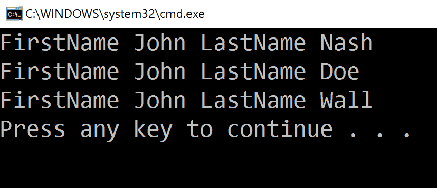
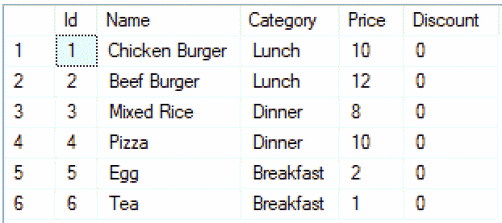

# 用例子探索 ADO.NET

如果你接触过网络开发，你可能听说过 ASP.NET，这是一个网络开发的框架。同样，如果您以前在中使用过数据库.NET 项目，你应该听说过或者用过 ADO.NET。ADO.NET 是一个类似于 ASP.NET 的框架，但是这个框架不是网络开发，而是用于数据库相关的工作。 **ActiveX 数据对象** ( **ADO** )是微软创造的一项老技术，但向 ADO.NET 的演变却非同寻常。ADO.NET 包含的类和方法可以用来轻松地与数据库管理系统(如 SQL Server 或 Oracle)建立连接。不仅如此，它还提供了有助于在数据库中执行命令的方法和对象，如选择、插入、更新和删除。

我们需要一个单独的数据库连接和活动框架，因为在开发应用时可以使用许多不同的数据库系统。数据库是应用非常重要的一部分；应用需要数据，数据需要存储在数据库中。因为数据库如此重要，而且有如此多的数据库可用，所以开发人员很难编写所有必要的代码。当我们可以编写一段可重用的代码时，不值得编写单独的代码。这就是微软提出 ADO.NET 框架的原因。这个框架有不同的数据提供者、数据集、数据适配器和各种其他与数据库相关的东西。

本章将涵盖以下主题:

*   ADO.NET 的基础
*   `DataProvider`、`Connection`、指挥、`DataReader`和`DataAdapter`
*   连接 SQL Server 数据库和 Oracle 数据库
*   存储过程
*   实体框架
*   SQL 中的事务

# ADO.NET 的基础

要了解 about，我们需要知道应用如何与数据库一起工作。然后，我们需要知道 ADO.NET 如何为这一进程提供支持。让我们从学习一些重要的概念开始。

# 数据提供者

ADO.NET 有不同类型的数据提供者。最受欢迎的数据提供者是 SQL Server、**开放数据库连接** ( **ODBC** )、**对象链接和嵌入数据库** ( **OLE DB** )和 **Java 数据库连接** ( **JDBC** )。这些数据提供者具有非常相似的代码结构，这使得开发人员的生活更加轻松。如果你过去用过一个，你就能毫无困难地使用其他任何一个。这些数据提供程序可以分为不同的组件:连接、命令、数据读取器和数据适配器。

# 连接对象

连接是与数据库建立连接以在数据库上执行命令的组件。不管你想连接哪个数据库，你都可以使用 ADO.NET。即使特定数据库没有特定的数据提供程序，您也可以使用 OLE DB 数据提供程序来连接任何数据库。该连接对象有一个名为`connectionstring`的属性。这是联系最重要的因素之一。`connection`字符串是以键值对的形式保存数据的字符串。例如,`connection`字符串包含数据库所在服务器的信息、数据库名称、用户凭据以及其他一些信息。如果数据库在同一台电脑上，则必须使用`localhost`作为服务器。`ConnectionString`包含数据库名称和授权数据，例如访问数据库所需的用户名和密码。让我们看一个针对 SQL Server 的`connectionString`示例:

```cs
SqlConnection con = new SqlConnection();
Con.connectionString = "Data Source=localhost; database=testdb; Integrated Security=SSPI";
```

这里，`Data Source`是服务器名称，因为数据库位于同一台计算机上。`connection`字符串中的`database`关键字保存数据库的名称，在本例中为`testdb`。您会在一些`connection`字符串中看到`Initial Catalog`被用来代替`connection`字符串中的`database`关键字来存储数据库的名称。您可以使用`Initial Catalog`或`database`在`connection`字符串中指定数据库的名称。我们这里的`connectionString`属性的最后一部分是`Integrated Security`，用作身份验证。如果您将其设置为`TRUE`或`SSPI`，这意味着您正在指示程序使用 Windows 身份验证来访问数据库。如果您有想要使用的特定数据库用户，可以通过在`connection`字符串中添加一个`user`键和一个`password`键来指定。您还可以提供一些其他数据，包括连接超时和连接超时。该`connection`字符串包含所需的最少信息。

# 命令对象

命令对象用于向数据库提供指令。每个数据提供者都有自己的`command`对象，该对象继承自`DbCommand`对象。SQL 数据提供程序中的`command`对象是`SqlCommand`，而 OLE DB 提供程序有一个`OleDbCommand`对象。命令对象用于执行任何一种 SQL 语句，如`SELECT`、`UPDATE`、`INSERT`或`DELETE`。命令对象也可以执行存储过程。稍后在*处理存储过程*部分，我们将了解如何做到这一点。它们还有一些方法，用来让编译器知道我们正在执行什么类型的命令。例如，`ExecuteReader`方法查询数据库并返回一个`DataReader`对象:

```cs
using System.Data.SqlClient;
using System;
using System.Data;

public class Program
{
    public static void Main()
    {
        string connectionString = "Data source = localhost;Initial Catalog=  TestDBForBook;Integrated Security = SSPI;";
        SqlConnection conn = new SqlConnection(connectionString);
        string sql = "SELECT * FROM Person";
        SqlCommand command = new SqlCommand(sql, conn);
        conn.Open();
        SqlDataReader reader = command.ExecuteReader();
        while (reader.Read())
        {
            Console.WriteLine("FirstName " + reader[1] + " LastName " +  reader[2]);
        }
        conn.Close();
    }
}
```

输出如下:



数据库表如下所示:


`ExecuteNonQuery`是另一种主要用于执行非查询方法的方法，如`INSERT`、`UPDATE`、`DELETE`。当您向数据库中插入一些数据时，您不是在查询数据库中的任何内容，您只是想插入数据。更新和删除也是如此。`ExecuteNonQuery`方法返回一个`INT`值，该值表示数据库中有多少行受到该命令的影响。例如，如果您在`Person`表格中插入一个人，您在表格中插入一个新行，因此只有一行受到影响。该方法将因此返回`1`给您。

让我们看看`ExecuteNonQuery()`方法的示例代码:

```cs
using System.Data.SqlClient;
using System;
using System.Data;
public class Program
{
    public static void Main()
    {
        string connectionString = "Data source = localhost;Initial Catalog=  TestDBForBook;Integrated Security = SSPI;";
        SqlConnection conn = new SqlConnection(connectionString);
        string sql = "INSERT INTO Person (FirstName, LastName, Age) VALUES  ('John', 'Nash', 34)";
        SqlCommand command = new SqlCommand(sql, conn);
        conn.Open();
        int rowsAffected = command.ExecuteNonQuery();
        conn.Close();
        Console.WriteLine("Number of rows inserted: " + rowsAffected);
    }
}
```

输出如下:


假设你想更新约翰·纳西先生的`Age`。执行`UPDATE`查询时，只影响表中的一行，所以会返回`1`。但是，例如，如果您执行一个查询，其中条件匹配几个不同的行，它将更新所有的行并返回受影响的行的总数。看看下面的例子。在这里，我们有一张`Food`桌子，上面有不同的食物。每个项目都有一个类别:



在这里，我们可以看到任何食品都没有折扣。假设我们现在想给每个早餐项目 5%的折扣。要更改`Discount`值，您必须执行`UPDATE`命令来更新所有行。从桌子上，我们可以看到桌子上有两个早餐项目。如果我们运行一个带有仅适用于`Category= 'Breakfast'`的条件的`UPDATE`命令，它应该会影响两行。让我们看看这个过程的 C# 代码。我们将在这里使用`ExecuteNonQuery`命令:

```cs
using System.Data.SqlClient;
using System;
using System.Data;
public class Program
{
    public static void Main()
    {
        string connectionString = "Data source = localhost;Initial Catalog=  TestDBForBook;Integrated Security = SSPI;";
        SqlConnection conn = new SqlConnection(connectionString);
        string sql = "UPDATE Food SET Discount = 5 WHERE Category = 'Breakfast'";
        SqlCommand command = new SqlCommand(sql, conn);
        conn.Open();
        int rowsAffected = command.ExecuteNonQuery();
        conn.Close();
        Console.WriteLine("Number of rows inserted: " + rowsAffected);
    }
}
```

输出如下:


从输出中我们可以看到`2`行受到影响。现在，让我们看看数据库表:


我们可以看到两行被改变了。

如果使用`ExecuteNonQuery`方法执行`DELETE`命令，它将返回受影响的行数。如果结果是你得到`0`，这意味着你的命令没有成功执行。

`SQLCommand`对象中还有很多其他方法。`ExecuteScalar`从查询中返回标量值。`ExecuteXMLReader`返回一个`XmlReader`对象。还有其他以异步方式工作的方法。所有这些方法的工作方式与这里显示的示例相似。

命令对象中有一个属性叫做`CommandType`。`CommandType`是一种`enum`类型，表示如何提供命令。枚举值为`Text`、`StoredProcedure`和`TableDirect`。如果选择了文本，SQL 命令将作为 SQL 查询直接在数据源中执行。在`StoredProcedure`中，可以设置参数并执行`storedprocedures`在数据库中执行一个命令。默认情况下，该值设置为`TEXT`。这就是为什么在前面的例子中，我们没有设置`CommandType`的值。

# 数据读取器对象

DataReader 对象提供了一种从数据库中读取仅向前的行流的方法。像其他的一样，数据读取器是数据提供者的一个对象。每个数据提供者都有不同的继承自`DbDataReader`的 DataReader 对象。当您执行`ExecuteReader`命令时，它会返回一个`DataReader`对象。您可以处理这个`DataReader`对象来收集您查询的数据。如果您使用 SQL Server 作为您的数据库，您应该使用`SqlDataReader`对象。`SqlDataReader`有一个叫`Read()`的方法，当你在`DataReader`对象中有可读取的数据时返回`true`。如果`SqlDataReader`对象中没有数据，`Read()`方法将返回`false`。通常的做法是先检查`Read()`方法是否为`true`，然后读取数据。以下示例显示了`SqlDataReader`的用法:

```cs
using System.Data.SqlClient;
using System;
using System.Data;

public class Program
{
    public static void Main()
    {
        string connectionString = "Data source = localhost;Initial Catalog=  TestDBForBook;Integrated Security = SSPI;";
        SqlConnection conn = new SqlConnection(connectionString);
        string sql = "SELECT * FROM Person";
        SqlCommand command = new SqlCommand(sql, conn);
        conn.Open();
        SqlDataReader reader = command.ExecuteReader();
        while (reader.Read())
        {
            Console.WriteLine("FirstName " + reader[1] + " LastName " +  reader[2]);
        }
        conn.Close();
    }
}
```

这里，`command.ExecuteReader()`方法返回一个`SqlDataReader`对象，保存查询结果:

```cs
SELECT * FROM Person
```

首先，我们将返回的对象保存在名为**读取器**的变量中，该变量属于`SqlDataReader`类型。然后，我们检查其`Read()`方法是否为`true`。如果是，我们执行以下语句:

```cs
Console.WriteLine("FirstName " + reader[1] + " LastName " +  reader[2]);
```

这里，读取器作为一个数组工作，我们从索引中顺序获取数据库表列的值。从数据库中的下表结构可以看出，它有四列，身份证、名字、姓氏和年龄:


这些列将被一个接一个地映射。`reader[0]`指 Id 列，`reader[1]`指名字列，以此类推。

我们写的语句会打印出 FirstName 列的值，在这里会找到`reader[1]`。然后它将打印姓氏列的值，在那里它将找到`reader[2]`。

如果这个数组索引让您感到困惑，如果您想要更好的可读性，请随意使用命名索引而不是数字:

```cs
Console.WriteLine("FirstName " + reader["FirstName"] + " LastName " +  reader["LastName"])
```

这将打印同样的东西。我们没有放`reader[1]`，而是写了`reader["FirstName"]`，这样我们访问的是哪个栏目就更清楚了。如果使用这种方法，请确保名称书写正确。

# 数据适配器

`DataAdapter`是从数据源读取和使用数据的另一种方式。数据适配器为您提供了一种将数据直接存储到数据集的简单方法。您也可以使用数据适配器从数据集中回写数据源。每个提供者都有自己的数据适配器。例如，一个 SQL 数据提供程序有`SqlDataAdapter`。

# 连接到各种数据库

让我们看一些如何使用 ADO.NET 连接到不同数据库的例子。如果您正在使用 ADO.NET，您最有可能使用的数据库系统是 SQL Server 数据库，因为当您使用微软堆栈时，这是最佳匹配。但是，如果您使用任何其他来源，则不会降低性能或遇到问题。让我们看看如何与 ADO.NET 的其他数据库连接。

# 数据库

要连接到 SQL Server，我们需要使用 ADO.NET 的 SQL Server 提供程序。看看下面的代码:

```cs
using System.Data.SqlClient;
using System;
using System.Data;
public class Program
{
    public static void Main()
    {
        string connectionString = "Data source = localhost;Initial Catalog= TestDBForBook;Integrated Security = SSPI;";
        SqlConnection conn = new SqlConnection(connectionString);
        string sql = "SELECT * FROM Person";
        SqlCommand command = new SqlCommand(sql, conn);
        conn.Open();
        SqlDataReader reader = command.ExecuteReader();
        while (reader.Read())
        {
            Console.WriteLine("FirstName " + reader["FirstName"] + " LastName " +  reader["LastName"]);
        }
        conn.Close();
    }
}
```

# 甲骨文数据库

要连接到 Oracle 数据库，我们需要使用 ADO.NET 的 ODBC 提供程序。看看下面的代码:

```cs
using System.Data.SqlClient;
using System;
using System.Data;
using System.Data.Odbc;
public class Program
{
    public static void Main()
    {
        string connectionString = "Data Source=Oracle9i;User ID=*****;Password=*****;";
        OdbcConnection odbcConnection = new OdbcConnection(connectionString);
        string sql = "SELECT * FROM Person";
        OdbcCommand odbcCommand = new OdbcCommand(sql, odbcConnection);
        odbcConnection.Open();
        OdbcDataReader odbcReader = odbcCommand.ExecuteReader();
        while (odbcReader.Read())
        {
            Console.WriteLine("FirstName " + odbcReader["FirstName"] + " LastName  " + odbcReader["LastName"]);
        }
        odbcConnection.Close();
    }
}
```

# 使用数据读取器和数据适配器

`DataReaders`和`DataAdapter`是数据提供者的核心对象。这些是 ADO.NET 提供的一些最重要的特征。让我们看看如何处理这些对象。

# 数据阅读器

每个提供者都有数据阅读器。本质上，所有的类都做同样的事情。`SqlDataReader`、`OdbcDataReader`、`OleDbDataReader`均实现`IDataReader`接口。数据读取器的主要用途是当数据来自流时，从数据源中读取数据。让我们看看数据读取器的不同属性:

| **属性** | **描述** |
| `Depth` | 一行的嵌套深度 |
| `FieldCount` | 返回一行中的列数 |
| `IsClosed` | 如果`DataReader`关闭，返回`TRUE` |
| `Item` | 返回列的值 |
| `RecordsAffected` | 受影响的行数 |

数据读取器有以下方法:

| **方法** | **描述** |
| `Close` | 此方法将关闭`DataReader`对象。 |
| `Read` | 该方法将在`DataReader`中读取下一条数据。 |
| `NextResult` | 这个方法会将头部移动到下一个结果。 |
| `GetString`、`GetChar`等等 | `GetString`方法将返回字符串格式的值。`GetChar`将以`Char`格式返回该值。还有其他方法会返回该特定类型的值。 |

下面的代码片段显示了一个`DataReader`的例子:

```cs
using System;
using System.Collections.Generic;
using System.Text;
using System.Data.SqlClient;
namespace CommandTypeEnumeration
{
    class Program
    {
        static void Main(string[] args)
        {
            // Create a connection string
            string ConnectionString = "Integrated Security = SSPI; " +
            "Initial Catalog= Northwind; " + " Data source = localhost; ";
            string SQL = "SELECT * FROM Customers";
            // create a connection object
            SqlConnection conn = new SqlConnection(ConnectionString);
            // Create a command object
            SqlCommand cmd = new SqlCommand(SQL, conn);
            conn.Open();
            // Call ExecuteReader to return a DataReader
            SqlDataReader reader = cmd.ExecuteReader();
            Console.WriteLine("customer ID, Contact Name, " + "Contact Title, Address ");
            Console.WriteLine("=============================");
            while (reader.Read())
            {
                Console.Write(reader["CustomerID"].ToString() + ", ");
                Console.Write(reader["ContactName"].ToString() + ", ");
                Console.Write(reader["ContactTitle"].ToString() + ", ");
                Console.WriteLine(reader["Address"].ToString() + ", ");
            }
            //Release resources
            reader.Close();
            conn.Close();
        }
    }
}

```

# 数据适配器

数据适配器就像断开连接的 ADO.NET 对象和数据源之间的桥梁。这意味着它们有助于在数据库中建立连接和执行命令。它们还将查询结果映射回断开的 ADO.NET 对象。数据适配器使用`DataSet`或`DataTable`在从数据源检索数据后存储数据。`DataAdapter`有一个名为`Fill()`的方法，从数据源收集数据并填充`DataSet`或`DataTable`。如果想要检索模式信息，可以使用另一种叫做`FillSchema()`的方法。另一种称为`Update()`的方法将`DataSet`或`DataTable`中所做的所有更改转移到数据源。

使用数据适配器的好处之一是，没有关于连接、数据库、表、列或任何其他与数据源相关的信息传递给断开连接的对象。因此，在向外部源传递值时使用它是安全的。

# 使用存储过程

**存储过程**是为了重用而存储在数据库中的一批 SQL 语句。ADO.NET 支持存储过程，这意味着我们可以使用 ADO.NET 调用数据库中的存储过程，并从中获得结果。将可能是输入或输出参数的参数传递给存储过程是非常常见的做法。ADO.NET 命令对象的参数是参数类型的对象。根据提供程序的不同，参数对象会发生变化，但它们都遵循相同的基础。让我们来看看在 ADO.NET 如何使用存储过程来代替普通的 SQL 语句。

要使用存储过程，在`SQLCommand`中传递的 SQL 字符串应该是存储过程的名称:

```cs
string ConnectionString = "Integrated Security = SSPI;Initial Catalog=Northwind;Data source=localhost;";
SqlConnection conn = new SqlConnection(ConnectionString);
String sql = “InsertPerson”;
SqlCommand command = new SqlCommand(sql, conn);
```

我们通常将参数传递给存储过程，如下所示:

```cs
using System.Data.SqlClient;
using System;
using System.Data;

public class Program
{
    public static void Main()
    {
        string ConnectionString = "Integrated Security = SSPI; Initial Catalog= Northwind; Data source = localhost; ";
        SqlConnection conn = new SqlConnection(ConnectionString);
 String sql = "InsertPerson";
 SqlCommand command = new SqlCommand(sql, conn);
 command.CommandType = CommandType.StoredProcedure;
 SqlParameter param = command.Parameters.Add("@FirstName", SqlDbType.NVarChar, 11);
 param.Value = "Raihan";
 param = command.Parameters.Add("@LastName", SqlDbType.NVarChar, 11);
 param.Value = "Taher";
 conn.Open();
 int rowsAffected = command.ExecuteNonQuery();
 conn.Close();
```

```cs

 Console.WriteLine(rowsAffected);
    }
}
```

现在让我们看看存储过程，了解如何使用参数:

```cs
CREATE procedure InsertPerson (
@FirstName nvarchar (11),
@LastName nvarchar (11)
)
AS
INSERT INTO Person (FirstName, LastName) VALUES (@FirstName, @LastName);
GO
```

# 使用实体框架

**实体框架** ( **EF** )是微软开发的**对象关系映射器** ( **ORM** )框架。它是为.NET 开发人员使用实体对象轻松地处理数据库。它位于后端代码或业务逻辑和数据库的中间。它允许开发人员用应用语言 C# 编写代码来与数据库对话。这意味着不需要手动使用和编写 ADO.NET 代码，我们在前面几节中已经这样做了。EF 有不同于普通 SQL 命令的命令类型。EF 命令看起来非常类似于 C# 代码，将在后台使用 SQL 与数据库进行通信。它可以与任何类型的数据源通信，因此您不必担心为每个数据库管理系统设置或编写不同的代码。

# 什么是实体框架中的实体？

实体是应用域中的一个类，它也作为`DbSet`属性包含在派生的`DbContext`类中。当 EF 执行一个实体时，该实体被转换为一个表，并且该实体的属性被转换为列:

```cs
public class Student{
}

public class StudentClass{
}

public class Teacher{
}

public class SchoolContext : DbContext {
    public SchoolContext(){}
    public DbSet<Student> Students { get; set; }
    public DbSet<StudentClass> StudentClasses { get; set; }
    public DbSet<Teacher> Teachers { get; set; }
}
```

# 不同类型的实体属性

让我们看看一个实体可以有哪些不同类型的属性:

*   标量属性
*   导航属性。其中包括以下内容:
    *   参考导航属性
    *   集合导航属性

# 标量属性

这些属性直接用作数据库中的列。它们用于在数据库中保存和查询。让我们看一个这些属性的例子:

```cs
public class Student{
    public int StudentID { get; set; }
    public string StudentName { get; set; }
    public DateTime? DateOfBirth { get; set; }
    public byte[]  Photo { get; set; }
    public decimal Height { get; set; }
    public float Weight { get; set; }

    public StudentAddress StudentAddress { get; set; }
    public Grade Grade { get; set; }
}
```

以下属性是标量属性:

```cs
public int StudentID { get; set; }
public string StudentName { get; set; }
public DateTime? DateOfBirth { get; set; }
public byte[]  Photo { get; set; }
public decimal Height { get; set; }
public float Weight { get; set; }
```

# 导航属性

这种类型的属性表示实体之间的关系。它们与特定的列没有直接关系。导航属性有两种类型:

*   **引用导航属性:**如果使用另一个实体类型作为属性，则称为引用导航属性
*   **集合导航属性:**如果一个实体被包含为集合类型，则称之为集合导航属性

导航属性的示例如下:

```cs
public Student Student { get; set; }
public ICollection<Student> Students { get; set; }
```

这里，`Student`是引用导航属性，`Students`是集合导航属性。

现在让我们看看使用 EF 的两种方法:**代码优先方法**和**数据库优先方法**。

# 代码优先的方法

这可以被认为类似于领域驱动的设计。在这种方法中，您编写实体对象和域，然后使用域使用 EF 生成数据库。使用实体对象中的不同属性，EF 可以理解如何处理数据库。例如，如果您希望模型中的特定属性被视为主键，则可以使用数据注释或流畅的应用编程接口向 EF 指示，在数据库中创建表时，它应该将此列视为主键。

# 数据库优先的方法

在这种方法中，您首先创建数据库，然后要求 EF 为您生成实体。您的所有更改都是在数据库级别进行的，而不是在后端应用的实体中进行的。在这里，英孚以代码优先的方式做了不同的工作。在数据库优先的方法中，EF 读取数据库表和列，并生成 C# 类模型，其中每一列都被视为一个属性。EF 还处理不同数据库表之间的关系，并在生成的模型中创建相同类型的关系。

# 使用实体框架

这两种方法都有各自的优点，但是代码优先的方法在开发人员中更受欢迎，因为您需要更少地处理数据库，而更多地使用 C#。

英孚不附带。. NET 框架。您必须从 NuGet 包管理器下载库，并将其安装到您正在处理的项目中。要下载并安装实体框架，您可以打开 Nuget 包管理器控制台并编写以下命令:

```cs
Install-Package EntityFramework
```

此命令将在您的项目中下载并安装实体框架:


如果您不习惯软件包管理器控制台，也可以使用图形用户界面的“管理解决方案软件包”窗口来安装实体框架。转到浏览选项卡并搜索实体框架。您将在搜索结果的顶部看到它。单击它并将其安装到您的项目中:


Installing Entity Framework using Nuget Package Manager

在本书中，我们将更多地关注 C#，因此我们将更仔细地研究代码优先方法，而不是数据库优先方法。在代码优先的方法中，由于我们不接触数据库代码，我们需要以创建数据库时可以遵循的方式来创建实体对象。创建数据库表后，如果我们想更新表或更改表，我们需要使用迁移。数据库迁移会创建数据库的新实例，并在新实例中应用新的更改。通过使用迁移，更容易操作数据库。

现在让我们多了解一点英孚的历史和流程。它于 2008 年首次出版.NET 3.5。在写这本书的时候，EF 的最新版本是第 6 版。英孚还有一个. NET Core 版本，叫做**实体框架核心**。这两个框架都是开源的。当您在项目中安装一个实体框架并编写一个**普通旧 CLR 对象** ( **POCO** )类时，该 POCO 类被实体框架使用。首先，EF 从中创建一个**实体数据模型** ( **EDM** )。该 EDM 稍后用于在数据库中保存和查询。**语言集成查询**(**LinKS**)和 SQL 都可以用来给 EF 下达指令。当在 EDM 中使用一个实体对象时，它会被跟踪。更新后，数据库也将更新。

我们可以使用`SaveChanges()`方法在数据库中执行插入、更新和删除活动。对于异步编程，使用`SaveChangesAsync()`方法。为了获得更好的查询体验，EF 具有一级缓存，因此在执行重复查询时，EF 会从缓存中返回结果，而不是去数据库收集相同的结果。

英孚应用编程接口主要做四件事:

*   将类映射到数据库模式
*   将临朐转换为实体查询并执行
*   跟踪变化
*   保存数据库中的更改

EF 将实体对象和上下文类转换为 EDM，数据库中使用 EDM。例如，假设我们有以下类:

```cs
public class Person {
    public int PersonId { get; set; }
    public string FirstName { get; set; }
    public string LastName { get; set; }
}
```

EF 会将其转换为 EDM，如下所示:

```cs
Table Name: Person
PersonId(PK,int,not null)
FirstName (nvarchar(50),null)
LastName (nvarchar(50),null)
```

然后，该 EDM 将用于创建或更新`Person`数据库表。

# SQL 中的事务

事务是一个单一的工作单元，它要么必须完成整个工作，要么回滚到以前的状态。一个事务不能在一件工作的中途停止。这是敏感数据处理的一个非常重要的特性。交易的最佳用途之一是处理资金转移过程。当一个人把一些钱转到另一个人的账户上时，如果在这个过程中出现任何错误，整个过程都应该被取消或回滚。

一个事务在 SQL 中有四个属性:**原子、一致、隔离和持久** ( **ACID** )。

# 原子的

原子意味着必须执行组中的所有语句。如果组中的一条语句没有被执行，则不应该执行任何语句。语句的整个组应该作为一个单独的单元工作。

# 一致的

执行事务时，数据库应该从一种状态到达另一种状态。我们称起始点为起点，执行后的点为终点。在交易中，起点和终点应该是明确的。如果事务成功，数据库状态应该在终点，否则应该在起点。保持这种一致性就是这个属性的意义所在。

# 脱离

作为事务一部分的一组语句应该与另一个事务或手动语句中的其他语句隔离开来。当一个事务正在运行时，如果另一个语句改变了一个特定的数据，整个事务将产生错误的数据。当事务运行时，不允许所有其他外部语句在数据库中的特定数据上运行。

# 持久耐用

执行一组语句后，结果需要存储在一个永久的地方。如果在事务处理过程中出现错误，语句可以回滚，数据库将恢复到以前的位置。

事务在 SQL 中起着非常重要的作用，所以 SQL 数据提供者提供了`SQLTransaction`类，可以使用 ADO.NET 执行事务。

# 摘要

数据是软件应用中非常重要的一部分。为了维护数据，我们需要某种能够以结构化方式存储数据的数据库，以便可以轻松地检索、保存、更新和删除数据。至关重要的是，我们的软件能够与数据源通信以使用数据。ADO.NET 框架提供了这种便利.NET 开发人员。学习和了解 ADO.NET 是任何人的基本要求之一.NET 开发人员。在本章中，我们介绍了 ADO.NET 元素的基本原理，如`DataProvider`、`Connection`、【指挥】、`DataReader`和`DataAdapter`。我们还学习了如何使用 ADO.NET 连接到 SQL Server 数据库和 Oracle 数据库。我们讨论了存储过程，并解释了什么是实体框架以及如何使用它。

在下一章，我们将讨论一个非常有趣的话题:反思。