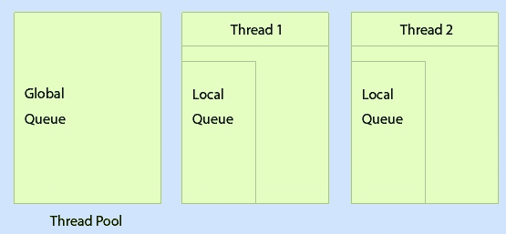
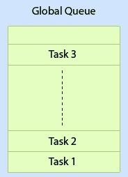
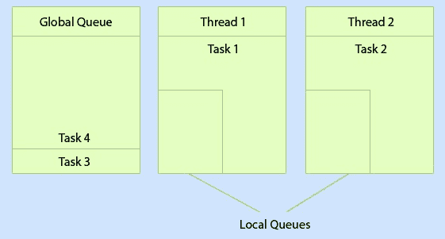

# 任务并行性

在前一章中，我们介绍了并行编程的概念。 在本章中，我们将继续讨论 TPL 和任务并行性。

. net 作为编程框架的主要目标之一是通过将所有常见的必需任务打包为 api，从而简化开发人员的工作。 正如我们已经看到的，从最早的。net 版本开始，线程就已经存在了，但它们最初非常复杂，并且与大量开销相关。 Microsoft 引入了许多新的并行原语，使从零开始编写、调试和维护并行程序变得更加容易，而不必处理遗留线程所涉及的复杂性。

本章将涵盖以下主题:

*   创建并启动任务
*   从完成的任务中获得结果
*   如何取消任务
*   如何等待正在运行的任务
*   处理任务异常
*   将**异步编程模型**(**APM**)模式转换为任务
*   将**基于事件的异步模式**(**eap**)转换为任务
*   多任务:
    *   继续任务
    *   父和子任务
    *   本地和全局队列和存储
    *   工作窃取队列

# 技术要求

为了完成本章，你应该很好地理解 C# 和一些高级概念，比如委托。

本章的源代码可以在 GitHub 上的[https://github.com/PacktPublishing/Hands-On-Parallel-Programming-with-C-8-and-.NET-Core-3/tree/master/Chapter02](https://github.com/PacktPublishing/Hands-On-Parallel-Programming-with-C-8-and-.NET-Core-3/tree/master/Chapter02)找到。

# 任务

**任务**是。net 中提供异步单元的抽象，就像 JavaScript 中的承诺一样。 在。net 的最初版本中，我们只能依赖线程，线程要么直接创建，要么使用`ThreadPool`类创建。 `ThreadPool`类在线程上提供了一个托管抽象层，但是开发人员仍然依赖`Thread`类来实现更好的控制。 通过`Thread`类创建线程，我们可以访问底层对象，可以等待、取消或将其移动到前台或后台。 然而，在实时中，我们需要线程连续地执行工作。 这需要我们编写大量的代码，很难维护。 `Thread`类也是未托管的，这给内存和 CPU 带来了很高的负担。 我们需要两全其美，这正是任务可以拯救我们的地方。 任务不过是线程上的包装器，它是通过`ThreadPool`创建的。 任务提供了诸如等待、取消和继续等特性，并且这些特性在任务完成后运行。

任务具有以下重要特性:

*   任务由`TaskScheduler`执行，默认的调度程序只在`ThreadPool`上运行。
*   我们可以从任务中返回值。
*   任务让您知道它们何时完成，不像`ThreadPool`或线程。
*   任务可以使用`ContinueWith()`结构继续运行。
*   我们可以通过调用`Task.Wait()`来等待任务。 这将阻塞调用线程，直到它完成。
*   与遗留线程或`ThreadPool`相比，任务使代码更具可读性。 他们还为 C# 5.0 中异步编程结构的引入铺平了道路。
*   当一个任务从另一个任务启动时，我们可以建立父/子关系。
*   我们可以将子任务异常传播到父任务。
*   可以使用`CancellationToken`类取消任务。

 **# 创建并启动任务

使用 TPL 创建和运行任务的方法有很多种。 在本节中，我们将尝试理解所有这些方法，并尽可能地进行比较分析。 首先，您需要添加对`System.Threading.Tasks`命名空间的引用:

```cs
using System.Threading.Tasks;
```

我们将尝试使用以下方法创建一个任务:

*   `System.Threading.Tasks.Task`班
*   `System.Threading.Tasks.Task.Factory.StartNew`方法
*   `System.Threading.Tasks.Task.Run`方法
*   `System.Threading.Tasks.Task.Delay`
*   `System.Threading.Tasks.Task.Yield`
*   `System.Threading.Tasks.Task.FromResult<T> Method`
*   `System.Threading.Tasks.Task.FromException`和`Task.FromException<T>`
*   `System.Threading.Tasks.Task.FromCancelled`和`Task.FromCancelled<T>`

# System.Threading.Tasks.Task 类

任务类是一种作为`ThreadPool`线程异步执行工作的方法，它基于**任务异步模式**(**TAP**)。 非泛型的`Task`类不返回结果，因此当我们需要从任务返回值时，我们需要使用泛型版本`Task<T>`。 在调用`Start`方法之前，通过`Task`类创建的任务不会被调度运行。

我们可以使用`Task`类以各种方式创建任务，我们将在下面的子部分中介绍所有这些方法。

# 使用 lambda 表达式语法

在下面的代码中，我们通过调用`Task`构造函数并传递一个包含我们想要执行的方法的 lambda 表达式来创建一个任务:

```cs
Task task = new Task (() => PrintNumber10Times ());
task.Start();
```

# 使用动作委托

在下面的代码中，我们通过调用`Task`构造函数来创建一个任务，并传递一个包含我们想要执行的方法的委托:

```cs
Task task = new Task (new Action (PrintNumber10Times));
task.Start();
```

# 使用委托

在下面的代码中，我们通过调用`Task`构造函数并传递一个包含我们想要执行的方法的匿名`delegate`来创建一个`task`对象:

```cs
Task task = new Task (delegate {PrintNumber10Times ();});
task.Start();
```

在所有这些情况下，输出将如下:


前面所有的方法都做同样的事情——只是语法不同。

We can only call the `Start` method on tasks that have not run previously. If you need to rerun a task that has already been completed, you need to create a new task and call the `Start` method on that.

# System.Threading.Tasks.Task.Factory.StartNew 方法

我们还可以使用`TaskFactory`类的`StartNew`方法创建一个任务，如下所示。 在这种方法中，创建任务并计划在`ThreadPool`中执行，并将该`Task`的引用返回给调用者。

我们可以使用`Task.Factory.StartNew`方法创建一个任务。 我们将在以下小节中讨论这个问题。

# 使用 lambda 表达式语法

在下面的代码中，我们通过调用`TaskFactory`上的`StartNew()`方法来创建`Task`，并传递一个包含我们想要执行的方法的 lambda 表达式:

```cs
Task.Factory.StartNew(() => PrintNumber10Times());          
```

# 使用动作委托

在下面的代码中，我们通过调用`TaskFactory`上的`StartNew()`方法来创建`Task`，并传递一个我们想要执行的委托包装方法:

```cs
Task.Factory.StartNew(new Action( PrintNumber10Times));
```

# 使用委托

在下面的代码中，我们通过调用`TaskFactory`上的`StartNew()`方法来创建`Task`，并传递我们想要执行的`delegate`包装方法:

```cs
 Task.Factory.StartNew(delegate { PrintNumber10Times(); });
```

前面所有的方法都做同样的事情——只是语法不同。

# System.Threading.Tasks.Task.Run 方法

我们还可以使用`Task.Run`方法创建任务。 它的工作原理与`StartNew`方法类似，并返回一个`ThreadPool`线程。

我们可以使用`Task.Run`方法以以下方式创建`Task`，所有这些都将在下面的小节中讨论。

 **# 使用 lambda 表达式语法

在下面的代码中，我们通过调用`Task`上的静态`Run()`方法来创建`Task`，并传递一个包含我们想要执行的方法的 lambda 表达式:

```cs
Task.Run(() => PrintNumber10Times ());
```

# 使用动作委托

在下面的代码中，我们通过调用`Task`上的静态`Run()`方法来创建`Task`，并传递一个包含我们想要执行的方法的委托:

```cs
Task.Run(new Action (PrintNumber10Times));
```

# 使用委托

在下面的代码中，我们通过调用`Task`上的静态`Run()`方法来创建`Task`，并传递一个包含我们想要执行的方法的`delegate`:

```cs
Task.Run(delegate {PrintNumber10Times ();});
```

# System.Threading.Tasks.Task.Delay 方法

我们可以创建一个任务，该任务在指定的时间间隔后完成，或者用户可以使用`CancellationToken`类在任何时候取消该任务。 在过去，我们使用`Thread`类的`Thread.Sleep()`方法创建阻塞构造来等待其他任务。 然而，这种方法的问题是，它仍然使用 CPU 资源并同步运行。 `Task.Delay`提供了在不利用 CPU 周期的情况下等待任务的更好选择。 它也是异步运行的:

```cs
Console.WriteLine("What is the output of 20/2\. We will show result in 2 seconds.");
Task.Delay(2000);
Console.WriteLine("After 2 seconds delay");
Console.WriteLine("The output is 10");
```

前面的代码向用户询问一个问题，然后等待两秒钟，然后给出答案。 在这两秒钟内，主线程不需要等待，而是需要执行其他任务来改善用户的体验。 代码在系统时钟上异步运行，一旦时间过期，其余代码将被执行。

上述代码的输出如下:


在查看可以用来创建任务的其他方法之前，我们先来看看 C# 5.0 中引入的两个异步编程构造:`async`和`await`关键字。

`async`和`await`是使我们更容易编写异步程序的代码标记。 我们将在[第 9 章](09.html)，*Async, Await，以及基于任务的异步编程基础**中深入学习这些关键词。* 顾名思义，我们可以使用`await`关键字等待任何异步调用。 当执行线程在方法中遇到`await`关键字时，它返回`ThreadPool`，将方法的其余部分标记为延续委托，并开始执行其他排队的任务。 一旦异步任务完成，来自`ThreadPool`的任何可用线程将完成方法的其余部分。

# System.Threading.Tasks.Task.Yield 方法

这是创建`await`任务的另一种方法。 调用者不能直接访问底层任务，但在一些涉及与程序执行相关的异步编程的场景中使用。 与其说这是一项任务，不如说是一项承诺。 使用`Task.Yield`，我们可以强制我们的方法是异步的，并将控制返回给操作系统。 当方法的其余部分在稍后的时间点执行时，它仍然可以作为异步代码运行。 我们可以使用以下代码实现相同的效果:

```cs
await Task.Factory.StartNew(() => {},
    CancellationToken.None,
    TaskCreationOptions.None,
    SynchronizationContext.Current != null?
    TaskScheduler.FromCurrentSynchronizationContext():
    TaskScheduler.Current);
```

通过在长时间运行的任务中不时地向 UI 线程提供控制，可以使用这种方法使 UI 应用响应。 然而，这并不是 UI 应用的首选方法。 还有更好的选择，在 WinForms 中有`Application.DoEvents()`，在 WPF 中有`Dispatcher.Yield (DispatcherPriority.ApplicationIdle)`:

```cs
private async static void TaskYield()
{
     for (int i = 0; i < 100000; i++)
     {
        Console.WriteLine(i);
        if (i % 1000 == 0)
        await Task.Yield();
     }
}
```

在控制台或 web 应用的情况下，当我们运行代码并在任务的 yield 上应用断点时，我们将看到随机线程池线程切换上下文来运行代码。 下面的屏幕截图描述了在不同阶段控制执行的各种线程。

下面的截图显示了程序流中同时执行的所有线程。 我们可以看到当前线程 ID 是 1664:


如果我们按*F5*并允许断点被命中以获得另一个值`i`，我们将看到代码现在正在由另一个 ID 为 10244 的线程执行:


我们将在[第 11 章](11.html)、*为并行和异步代码编写单元测试用例*中学习更多关于线程窗口和调试技术的内容。

# System.Threading.Tasks.Task.FromResult<t>方法</t>

最近在。net framework 4.5 中引入的这种方法被严重低估了。 我们可以通过这种方法返回一个带有结果的已完成任务，如下所示:

```cs
static void Main(string[] args)
{
    StaticTaskFromResultUsingLambda();
}
private static void StaticTaskFromResultUsingLambda()
{
    Task<int> resultTask = Task.FromResult<int>( Sum(10));
    Console.WriteLine(resultTask.Result);
}
private static int Sum (int n)
{
    int sum=0;
    for (int i = 0; i < 10; i++)
    {
        sum += i;
    }
    return sum;
}
```

从前面的代码中可以看到，我们实际上已经将同步`Sum`方法转换为使用`Task.FromResult<int>`类以异步方式返回结果。 这种方法在 TDD 中经常用于模拟异步方法，以及在异步方法中根据条件返回默认值。 我们将在[第 11 章](11.html)、*为并行和异步代码编写单元测试用例**中解释这些方法。*

# System.Threading.Tasks.Task.FromException 和 System.Threading.Tasks.Task.FromException<t>方法</t>

这些方法创建使用预定义异常完成的任务，并用于从异步任务和 TDD 中抛出异常。 我们将在[第 11 章](11.html)、*为并行和异步代码编写单元测试用例*中进一步解释这种方法:

```cs
return Task.FromException<long>(
new FileNotFoundException("Invalid File name."));
```

正如您在前面的代码中所看到的，我们将`FileNotFoundException`包装为一个任务，并将其返回给调用者。

# System.Threading.Tasks.Task.FromCanceled 和 System.Threading.Tasks.Task.FromCanceled<t>方法</t>

这些方法用于创建由于取消令牌而完成的任务:

```cs
CancellationTokenSource source = new CancellationTokenSource();
var token = source.Token;
source.Cancel();
Task task = Task.FromCanceled(token);
Task<int> canceledTask = Task.FromCanceled<int>(token);
```

如前面代码所示，我们使用`CancellationTokenSource`类创建了一个取消令牌。 然后，我们从该标记创建一个任务。 这里需要考虑的重要一点是，在我们可以用`Task.FromCanceled`方法使用令牌之前，需要先取消它。

如果我们想要从异步方法返回值，或者在 TDD 中返回值，那么这种方法非常有用。

# 从完成的任务中获得结果

为了从任务中返回值，TPL 提供了我们之前定义的所有类的泛型变体:

*   `Task<T>`
*   `Task.Factory.StartNew<T>`
*   `Task.Run<T>`

一旦任务完成，我们应该能够通过访问`Task.Result`属性从任务中获得结果。 让我们通过一些代码示例来理解这一点。 我们将创建各种任务，并尝试在完成时返回它们的值:

```cs
using System;
using System.Threading.Tasks;
namespace Ch02
{
    class _2GettingResultFromTasks
    {
        static void Main(string[] args)
        {
            GetResultsFromTasks();
            Console.ReadLine();
        }
        private static void GetResultsFromTasks()
        {
            var sumTaskViaTaskOfInt = new Task<int>(() => Sum(5));
            sumTaskViaTaskOfInt.Start();
            Console.WriteLine($"Result from sumTask is
             {sumTaskViaTaskOfInt.Result}" );
            var sumTaskViaFactory = Task.Factory.StartNew<int>(() => 
             Sum(5));
            Console.WriteLine($"Result from sumTask is 
             {sumTaskViaFactory.Result}");
            var sumTaskViaTaskRun = Task.Run<int>(() => Sum(5));
            Console.WriteLine($"Result from sumTask is 
             {sumTaskViaTaskRun.Result}");
            var sumTaskViaTaskResult = Task.FromResult<int>(Sum(5));
            Console.WriteLine($"Result from sumTask is 
             {sumTaskViaTaskResult.Result}");
        }
        private static int Sum(int n)
        {
            int sum = 0;
            for (int i = 0; i < n; i++)
            {
                sum += i;
            }
            return sum;
        }
    }
}
```

如前面的代码所示，我们使用泛型变量创建了任务。 一旦完成，我们就可以使用 result 属性得到结果:


在下一节中，我们将了解如何取消任务。

# 如何取消任务

TPL 的另一个重要功能是为开发人员提供现成的数据结构，以取消正在运行的任务。 你们中那些有经典线程背景的人会意识到，用所有自定义的自生长逻辑让线程支持取消过去是多么困难，但现在不再是这样了。 .NET Framework 提供了两个类来支持任务取消:

*   `CancellationTokenSource`**:**这个类负责创建取消令牌，并将取消请求传递给通过源创建的所有令牌
*   `CancellationToken`**:**这个类被监听者用来监视请求的当前状态

要创建可以取消的任务，我们需要执行以下步骤:

1.  创建`System.Threading.CancellationTokenSource`类的实例，该类通过`Token Property`进一步提供`System.Threading.CancellationToken`。
2.  在创建任务时传递令牌。
3.  需要时，调用`CancellationTokenSource`上的`Cancel()`方法。

让我们试着理解如何创建令牌以及如何将其传递给任务。

# 创建一个令牌

可以使用以下代码创建令牌:

```cs
CancellationTokenSource tokenSource = new CancellationTokenSource();
CancellationToken token = tokenSource.Token;
```

首先，我们使用`CancellationTokenSource`构造函数创建一个`tokenSource`。 然后，我们使用**`tokenSource`**的 token 属性获得我们的 token。

# 使用令牌创建任务

我们可以通过将`CancellationToken`作为第二个参数传递给任务构造器来创建任务，如下所示:

```cs
var sumTaskViaTaskOfInt = new Task<int>(() => Sum(5), token);
var sumTaskViaFactory = Task.Factory.StartNew<int>(() => Sum(5), token);
var sumTaskViaTaskRun = Task.Run<int>(() => Sum(5), token);
```

在经典的线程模型中，我们过去常常在不确定的线程上调用`Abort()`方法。 这将突然停止线程，从而在资源处于非托管状态时泄漏内存。 使用 TPL，我们可以调用`Cancel`方法，该方法是一个取消令牌源，它将依次在令牌上设置`IsCancellationRequested`属性。 由任务执行的底层方法应该监视这个属性，并且如果设置了该属性，应该优雅地退出。

有多种方法来监视令牌源是否请求取消:

*   轮询令牌上的`IsCancellationRequested`属性的状态
*   注册一个请求取消回调

# 通过 IsCancellationRequested 属性轮询令牌的状态

这种方法在涉及递归方法或通过循环包含长时间运行的计算逻辑的方法的场景中非常方便。 在我们的方法或循环中，我们编写代码以特定的最佳间隔轮询`IsCancellationRequested`。 如果设置了，则通过调用`token`类的`ThrowIfCancellationRequested`方法来中断循环。

下面的代码是通过轮询令牌来取消任务的示例:

```cs
        private static void CancelTaskViaPoll()
        {
            CancellationTokenSource cancellationTokenSource = 
             new CancellationTokenSource();
            CancellationToken token = cancellationTokenSource.Token;
            var sumTaskViaTaskOfInt = new Task(() => 
             LongRunningSum(token), token);
            sumTaskViaTaskOfInt.Start();
            //Wait for user to press key to cancel task
            Console.ReadLine();
            cancellationTokenSource.Cancel();
        }
        private static void LongRunningSum(CancellationToken token)
        {
            for (int i = 0; i < 1000; i++)
            {
                //Simulate long running operation
                Task.Delay(100);
                if (token.IsCancellationRequested)
                    token.ThrowIfCancellationRequested();
            }
        }
```

在前面的代码中，我们通过`CancellationTokenSource`类创建了一个取消令牌。 然后，我们通过传递令牌来创建一个任务。 该任务执行一个长时间运行的方法`LongRunningSum`(模拟的)，该方法保持对令牌的`IsCancellationRequested`属性的轮询。 如果用户在方法结束之前调用了`cancellationTokenSource.Cancel()`，则会抛出一个异常。

Polling doesn't come with any significant performance overhead and can be used according to your requirements. Use it when you have full control over the work that's performed by the task, such as if it's core logic that you wrote yourself.

# 使用 Callback 委托注册一个请求取消

这种方法使用了一个`Callback`委托，当底层令牌请求取消时，该委托将被调用。 我们应该在阻塞的操作中使用这种方法，因为阻塞的操作不可能以常规方式检查`CancellationToken`的值。

让我们看看下面的代码，它从一个远程 URL 下载文件:

```cs
private static void DownloadFileWithoutToken()
{
    WebClient webClient = new WebClient();
    webClient.DownloadStringAsync(new 
     Uri("http://www.google.com"));
    webClient.DownloadStringCompleted += (sender, e) => 
     {
        if (!e.Cancelled)
          Console.WriteLine("Download Complete.");
        else
          Console.WriteLine("Download Cancelled.");
     };
}
```

从前面的方法中可以看到，一旦我们调用`WebClient`的`DownloadStringAsync`方法，控件就会离开用户。 虽然`WebClient`类允许我们通过`webClient.CancelAsync()`方法取消任务，但我们无法控制何时调用它。

前面的代码可以修改为使用`Callback`委托，这样我们就可以更好地控制任务取消，如下所示:

```cs
static void Main(string[] args)
{
    CancellationTokenSource cancellationTokenSource = new 
     CancellationTokenSource();
    CancellationToken token = cancellationTokenSource.Token;
    DownloadFileWithToken(token);
    //Random delay before we cancel token
    Task.Delay(2000);
    cancellationTokenSource.Cancel();
    Console.ReadLine();
 }
private static void DownloadFileWithToken(CancellationToken token)
{    
    WebClient webClient = new WebClient();
    //Here we are registering callback delegate that will get called 
    //as soon as user cancels token
    token.Register(() => webClient.CancelAsync());
    webClient.DownloadStringAsync(new 
     Uri("http://www.google.com"));
    webClient.DownloadStringCompleted += (sender, e) => {
    //Wait for 3 seconds so we have enough time to cancel task
    Task.Delay(3000);
    if (!e.Cancelled)
        Console.WriteLine("Download Complete.");
    else
    Console.WriteLine("Download Cancelled.");};
}
```

如您所见，在这个修改后的版本中，我们传递了一个取消令牌，并通过`Register`方法订阅了取消回调。

当用户调用`cancellationTokenSource.Cancel()`方法时，将通过调用`webClient.CancelAsync()`取消下载操作。

`CancellationTokenSource` works well with the legacy `ThreadPool.QueueUserWorkItem` as well. Here is code that creates a `CancellationTokenSource` that can be passed to `ThreadPool` to support cancellation:

```cs
// Create the token source.
CancellationTokenSource cts = new CancellationTokenSource();
// Pass the token to the cancellable operation.
ThreadPool.QueueUserWorkItem(new WaitCallback(DoSomething), cts.Token);
```

在本节中，我们讨论了取消任务的各种方法。 在任务可能变得冗余的情况下，取消任务真的可以节省我们大量的 CPU 时间。 例如，假设我们创建了多个任务来使用不同的算法对一列数字进行排序。 尽管所有算法都将返回相同的结果(一个排序的数字列表)，但我们感兴趣的是尽可能快地获得结果。 我们将接受第一个(最快的)算法的结果，并取消其余的，以提高系统性能。 在下一节中，我们将讨论如何等待正在运行的任务。

# 如何等待正在运行的任务

在前面的示例中，我们调用了`Task.Result`属性来从已完成的任务中获取结果。 这将阻塞调用线程，直到结果可用为止。 TPL 为我们提供了另一种方法来等待一个或多个任务。

在 TPL 中有各种可用的 api，因此我们可以等待一个或多个任务。 这些措施如下:

*   `Task.Wait`
*   `Task.WaitAll`
*   `Task.WaitAny`
*   `Task.WhenAll`
*   `Task.WhenAny`

这些 api 将在以下小节中定义。

# 的任务。 等待

这是一个实例方法，可用于等待单个任务。 我们可以指定调用者等待任务完成的最大时间，然后使用超时异常来解除自己的阻塞。 通过将取消令牌传递给方法，我们还可以完全控制已经取消的监视事件。 调用方法将被阻塞，直到线程完成、被取消或抛出异常:

```cs
var task = Task.Factory.StartNew(() => Console.WriteLine("Inside Thread"));
//Blocks the current thread until task finishes.
task.Wait();
```

方法有五个重载版本:

*   `Wait()`:**:**无限期等待任务完成。 调用线程被阻塞，直到子线程完成。
*   `Wait(CancellationToken)`:**无限期等待任务完成执行或取消令牌被取消时。**
***   `Wait(int)`:等待任务在指定的时间内完成执行，单位为毫秒。*   `Wait(TimeSpan)`:等待任务在指定的时间间隔内完成。*   `Wait(int, CancellationToken)`:等待任务在指定的时间内(以毫秒为单位)或取消令牌时完成执行。**

 **# 的任务。 WaitAll

这是一个在`Task`类中定义的静态方法，用于等待多个任务。 任务以数组的形式传递给方法，调用者被阻塞，直到所有任务都完成。 此方法还支持超时和取消令牌。 使用此方法的一些示例代码如下:

```cs
    Task taskA = Task.Factory.StartNew(() => 
     Console.WriteLine("TaskA finished"));
    Task taskB = Task.Factory.StartNew(() => 
     Console.WriteLine("TaskB finished"));
    Task.WaitAll(taskA, taskB);
    Console.WriteLine("Calling method finishes");
```

上述代码的输出如下:


如您所见，当两个任务都完成执行时，调用方法完成语句被执行。

这种方法的一个示例用例可能是，当我们需要来自多个源的数据(每个源有一个任务)，并且我们希望组合来自所有任务的数据，以便它们可以显示在 UI 上。

# 的任务。 WaitAny

这是在`Task`类中定义的另一个静态方法。 与`WaitAll`一样，`WaitAny`用于等待多个任务，但是只要作为数组传递给方法的任何任务执行完毕，调用者就会被解除阻塞。 与其他方法一样，`WaitAny`支持超时和取消令牌。 使用此方法的一些示例代码如下:

```cs
Task taskA = Task.Factory.StartNew(() => 
 Console.WriteLine("TaskA finished"));
Task taskB = Task.Factory.StartNew(() => 
 Console.WriteLine("TaskB finished"));
Task.WaitAny(taskA, taskB);
Console.WriteLine("Calling method finishes");
```

在前面的代码中，我们启动了两个任务并使用`WaitAny`等待它们。 此方法阻塞当前线程。 一旦任何任务完成，调用线程就会被解除阻塞。

这种方法的一个示例用例可能是当我们需要的数据从不同的来源可用时，我们需要尽快得到它。 在这里，我们创建向不同源发出请求的任务。 一旦任何任务完成，我们将解除调用线程的阻塞，并从完成的任务中获得结果。

# 的任务。 WhenAll

这是`WaitAll`方法的非阻塞变体。 它返回一个任务，该任务表示所有指定任务的等待操作。 与阻塞调用线程的`WaitAll`不同，`WhenAll`可以在异步方法中等待，从而释放调用线程以执行其他操作。 使用此方法的一些示例代码如下:

```cs
Task taskA = Task.Factory.StartNew(() => 
 Console.WriteLine("TaskA finished"));
Task taskB = Task.Factory.StartNew(() => 
 Console.WriteLine("TaskB finished"));
Task.WhenAll(taskA, taskB);
Console.WriteLine("Calling method finishes");
```

除了调用线程返回到`ThreadPool`而不是被阻塞之外，这段代码的工作方式与`Task.WaitAll`相同。

# 的任务。 WhenAny

这是`WaitAny`的非阻塞变体。 它返回一个任务，该任务封装了一个底层任务上的等待操作。 与`WaitAny`不同，它不会阻塞调用线程。 调用线程可以在异步方法中调用 await。 使用此方法的一些示例代码如下:

```cs
Task taskA = Task.Factory.StartNew(() => 
 Console.WriteLine("TaskA finished"));
Task taskB = Task.Factory.StartNew(() => 
 Console.WriteLine("TaskB finished"));
Task.WhenAny(taskA, taskB);
Console.WriteLine("Calling method finishes");
```

除了调用线程返回到`ThreadPool`而不是被阻塞之外，这段代码的工作方式与`Task.WaitAny`相同。

在本节中，我们讨论了如何在使用多个线程而不进行代码分支的情况下编写有效的代码。 代码流看起来是同步的，尽管它在需要的地方是并行工作的。 在下一节中，我们将了解任务如何处理异常。

# 处理任务异常

异常处理是并行编程中最重要的方面之一。 所有优秀的代码从业者都专注于有效地处理异常。 这在并行编程中变得更加重要，因为线程或任务中任何未处理的异常都可能导致应用突然崩溃。 幸运的是，TPL 提供了一个很好的、有效的设计来处理和管理异常。 任务中发生的任何未处理的异常都被延迟，然后传播到连接线程，该线程观察该任务的异常。

在任务中发生的任何异常总是包装在`AggregateException`类下，并返回给观察异常的调用者。 如果调用者正在等待一个任务，`AggregateException`类的内部异常属性将返回原始异常。 但是，如果调用方正在等待多个任务，如`Task.WaitAll`、`Task.WhenAll`、`Task.WaitAny`或`Task.WhenAny`，则任务中发生的所有异常将作为一个集合返回给调用方。 他们可以通过`InnerExceptions`物业进入。

现在，让我们看看在任务中处理异常的各种方法。

# 处理单个任务的异常

在下面的代码中，我们正在创建一个简单的任务，该任务试图将一个数除以 0，从而得到`DivideByZeroException`。 异常返回给调用者，并在 catch 块中处理。 因为它是一个单独的任务，所以异常对象被包装在`AggregateException`对象的`InnerException`属性下:

```cs
class _4HandlingExceptions
{
    static void Main(string[] args)
    {
        Task task = null;
         try
           {
                task = Task.Factory.StartNew(() =>
                {
                    int num = 0, num2 = 25;
                    var result = num2 / num;
                });
            task.Wait();
        }
        catch (AggregateException ex)
        {
            Console.WriteLine($"Task has finished with 
             exception {ex.InnerException.Message}");
        }
        Console.ReadLine();
    }
}
```

下面是运行上述代码时的输出:


# 处理来自多个任务的异常

现在，我们将创建多个任务，然后尝试从中抛出异常。 然后，我们将学习如何从调用者的不同任务中列出不同的异常:

```cs
static void Main(string[] args)
{
    Task taskA = Task.Factory.StartNew(()=> throw 
     new DivideByZeroException());
    Task taskB = Task.Factory.StartNew(()=> throw 
     new ArithmeticException());
    Task taskC = Task.Factory.StartNew(()=> throw 
     new NullReferenceException());
    try
    {
        Task.WaitAll(taskA, taskB, taskC);
    }
    catch (AggregateException ex)
    {
        foreach (Exception innerException in ex.InnerExceptions)
        {
            Console.WriteLine(innerException.Message);
        }
    }
    Console.ReadLine();
}
```

下面是我们运行前面的代码时的输出:


在前面的代码中，我们创建了三个抛出不同异常的任务，并且使用`Task.WaitAll`等待所有线程。 如您所见，异常是通过调用`WaitAll`而不是通过启动任务来观察的，这就是为什么我们将`WaitAll`包装在`try`块中。 当传递给它的所有任务通过抛出异常而发生故障，并且执行相应的`catch`块时，`WaitAll`方法将返回。 通过迭代`AggregateException`类的`InnerExceptions`属性，我们可以找到所有源于所有任务的异常。

# 使用回调函数处理任务异常

找出这些异常的另一个选项是使用回调函数来访问和处理由任务产生的异常:

```cs
static void Main(string[] args)
      {
         Task taskA = Task.Factory.StartNew(() => throw 
          new DivideByZeroException());    
         Task taskB = Task.Factory.StartNew(() => throw 
          new ArithmeticException());                       
         Task taskC = Task.Factory.StartNew(() => throw 
          new NullReferenceException()); 
         try
         {
             Task.WaitAll(taskA, taskB, taskC);
         }
         catch (AggregateException ex)
         {
              ex.Handle(innerException =>
              {
                 Console.WriteLine(innerException.Message);
                 return true; 
              });
          }
          Console.ReadLine();
        }
```

下面是在 Visual Studio 中运行上述代码时的输出:


如前面的代码所示，我们不是通过`InnerExceptions`进行集成，而是订阅了`AggregateException`上的句柄回调函数。 这将对所有抛出异常的任务触发，我们可以返回`true`，这表明异常已被正常处理。

# 将 APM 模式转换为任务

遗留的 APM 方法使用`IAsyncResult`接口创建异步方法，其设计模式使用两个方法:`BeginMethodName`和`EndMethodName`。 让我们试着理解一个程序从同步到 APM，再到任务的过程。

下面是一个从文本文件中读取数据的同步方法:

```cs
private static void ReadFileSynchronously()        
{            
    string path = @"Test.txt";
    //Open the stream and read content.
    using (FileStream fs = File.OpenRead(path))
    {
         byte[] b = new byte[1024];
         UTF8Encoding encoder = new UTF8Encoding(true);
         fs.Read(b, 0, b.Length);
         Console.WriteLine(encoder.GetString(b));
     }
 }
```

前面的代码没有什么奇特之处。 首先，我们创建一个`FileStream`对象并调用`Read`方法，该方法将文件从磁盘同步地读入缓冲区，然后将缓冲区写入控制台。 我们使用`UTF8Encoding`类将缓冲区转换为字符串。 然而，这种方法的问题是，当调用`Read`时，线程会被阻塞，直到读取操作完成。 I/O 操作是由 CPU 使用 CPU 周期管理的，所以让线程等待 I/O 操作完成是没有意义的。 让我们试着理解 APM 的方法:

```cs
private static void ReadFileUsingAPMAsyncWithoutCallback()
        {
            string filePath = @"Test.txt";
            //Open the stream and read content.
            using (FileStream fs = new FileStream(filePath, 
             FileMode.Open, FileAccess.Read, FileShare.Read, 
             1024, FileOptions.Asynchronous))
            {
                byte[] buffer = new byte[1024];
                UTF8Encoding encoder = new UTF8Encoding(true);
                IAsyncResult result = fs.BeginRead(buffer, 0, 
                 buffer.Length, null, null);
                Console.WriteLine("Do Something here");
                int numBytes = fs.EndRead(result);
                fs.Close();
                Console.WriteLine(encoder.GetString(buffer));
            }
        }
```

如前面代码所示，我们已经将同步`Read`方法替换为异步版本，即`BeginRead`。 当编译器遇到`BeginRead`时，一条指令被发送到 CPU 开始读取文件，线程被解除阻塞。 我们可以在再次阻塞线程之前以相同的方法执行其他任务，方法是调用`EndRead`来等待`Read`操作完成并收集结果。 这是一种简单而有效的方法，可以使应用快速响应，尽管我们也会阻塞线程来获取结果。 与其在同一方法中调用`EndRead`，我们可以使用`Overload`，它接受一个回调方法，该方法在读操作结束时自动调用，以避免阻塞线程。 该方法的签名如下:

```cs
public override IAsyncResult BeginRead(
        byte[] array,
        int offset,
        int numBytes,
        AsyncCallback userCallback,
        object stateObject)
```

在这里，我们看到了如何从同步方法转移到 APM 方法。 现在，我们将把 APM 实现转换为一个任务。 下面的代码演示了这一点:

```cs
private static void ReadFileUsingTask()
        {
            string filePath = @"Test.txt";
            //Open the stream and read content.
            using (FileStream fs = new FileStream(filePath, FileMode.Open, 
             FileAccess.Read, FileShare.Read, 1024, 
             FileOptions.Asynchronous))
            {
                byte[] buffer = new byte[1024];
                UTF8Encoding encoder = new UTF8Encoding(true);
                //Start task that will read file asynchronously
                var task = Task<int>.Factory.FromAsync(fs.BeginRead, 
                 fs.EndRead, buffer, 0, buffer.Length,null);
                Console.WriteLine("Do Something while file is read 
                  asynchronously");
                //Wait for task to finish
                task.Wait();
                Console.WriteLine(encoder.GetString(buffer));
            }
        }
```

如前面代码所示，我们用`Task<int>.Factory.FromAsync`替换了`BeginRead`方法。 这是实现 TAP 的一种方式。 该方法返回一个任务，当我们在同一方法中继续做其他工作时，该任务在后台运行，然后再次阻塞线程以使用`task.Wait()`获得结果。 通过这种方式，您可以轻松地将任何 APM 代码转换为 TAP。

# 将 eap 转换为任务

eap 用于创建封装昂贵且耗时的操作的组件。 因此，它们需要实现异步。 此模式已在. net 框架中用于创建诸如`BackgroundWorker`和`WebClient`等组件。

实现此模式的方法在后台异步执行长时间运行的任务，但通过事件不断通知用户它们的进度和状态，这就是它们被称为基于事件的原因。

下面的代码展示了一个使用 EAP 的组件的实现:

```cs
  private static void EAPImplementation()
        {
            var webClient = new WebClient();
            webClient.DownloadStringCompleted += (s, e) =>
            {
                if (e.Error != null)
                    Console.WriteLine(e.Error.Message);
                else if (e.Cancelled)
                    Console.WriteLine("Download Cancel");
                else
                    Console.WriteLine(e.Result);
            };
            webClient.DownloadStringAsync(new 
             Uri("http://www.someurl.com"));
        }
```

在前面的代码中，我们订阅了`DownloadStringCompleted`事件，一旦`webClient`从 URL 下载了文件，该事件就会触发。 如您所见，我们尝试使用 if-else 结构读取各种结果选项，如异常、取消和结果。 与 APM 相比，将 EAP 转换为 TAP 比较棘手，因为它需要很好地理解 EAP 组件的内部本质，因为我们需要将新代码插入正确的事件中才能使其工作。 让我们看看转换后的实现:

```cs
private static Task<string> EAPToTask()
        {
            var taskCompletionSource = new TaskCompletionSource<string>();
            var webClient = new WebClient();
            webClient.DownloadStringCompleted += (s, e) =>
            {
                if (e.Error != null)
                    taskCompletionSource.TrySetException(e.Error);
                else if (e.Cancelled)
                    taskCompletionSource.TrySetCanceled();
                else
                    taskCompletionSource.TrySetResult(e.Result);
            };
            webClient.DownloadStringAsync(new 
             Uri("http://www.someurl.com"));
            return taskCompletionSource.Task;
        }
```

将 EAP 转换为 TAP 的最简单方法是通过`TaskCompletionSource`类。 我们已经插入了所有场景，并将结果、异常或取消结果设置为`TaskCompletionSource`类的实例。 然后，我们将包装的实现作为任务返回给用户。

# 更多的任务

现在，让我们学习一些可能会派上用场的关于任务的更重要的概念。 到目前为止，我们已经创建了独立的任务。 然而，为了创建更复杂的解决方案，我们有时需要定义任务之间的关系。 我们可以创建子任务、子任务以及延续任务来完成这一任务。 让我们试着用例子来理解每一个。 在本节的后面，我们将学习线程存储和队列。

# 继续任务

延续任务更像承诺。 当我们需要连接多个任务时，我们可以使用它们。 第二个任务在第一个任务完成时开始，并且第一个任务的结果或异常被传递给子任务。 我们可以链接多个任务来创建一个长任务链，或者我们可以使用 TPL 提供的方法创建一个选择性的延续链。 TPL 提供了以下结构用于任务延续:

*   `Task.ContinueWith`
*   `Task.Factory.ContinueWhenAll`
*   `Task.Factory.ContinueWhenAll<T>`
*   `Task.Factory.ContinueWhenAny`
*   `Task.Factory.ContinueWhenAny<T>`

# 使用任务继续任务。 ContinueWith 方法

使用 TPL 提供的`ContinueWith`方法可以很容易地完成任务的继续。

让我们通过一个例子来理解简单的链接:

```cs
var task = Task.Factory.StartNew<DataTable>(() =>
       {
           Console.WriteLine("Fetching Data");
           return FetchData();
       }).ContinueWith(
           (e) => {
               var firstRow = e.Result.Rows[0];
               Console.WriteLine("Id is {0} and Name is {0}", 
                firstRow["Id"], firstRow["Name"]);
       });
```

在前面的例子中，我们需要获取和显示数据。 **主要任务**调用`FetchData`方法。 当它完成后，结果作为输入传递给继续任务**，继续任务**负责打印数据。 输出如下:


我们也可以链接多个任务，从而创建一个任务链，如下所示:

```cs
 var task = Task.Factory.StartNew<int>(() => GetData()).
             .ContinueWith((i) => GetMoreData(i.Result)).
             .ContinueWith((j) => DisplayData(j.Result)));
```

我们可以通过将`System.Threading.Tasks.TaskContinuationOptions`枚举作为参数传递来控制延续任务何时运行，该参数具有以下选项:

*   `None`:这是默认选项。 继续任务将在主任务完成时运行。
*   `OnlyOnRanToCompletion`:当主任务成功完成时，继续任务将运行，这意味着它还没有取消或发生故障。
*   `NotOnRanToCompletion`:当主任务被取消或发生故障时，继续任务将运行。
*   `OnlyOnFaulted`:仅当主任务发生故障时，继续任务才会运行。
*   `NotOnFaulted`:仅当主任务未发生故障时，继续任务才会运行。
*   `OnlyOnCancelled`:仅当主任务被取消时，继续任务才会运行。
*   `NotOnCancelled`:仅当主任务未被取消时，继续任务才会运行。

# 使用 Task.Factory.ContinueWhenAll 和 Task.Factory.ContinueWhenAll 继续任务

我们可以等待多个任务，并链接一个只有在所有任务成功完成时才运行的延续代码。 让我们看一个例子:

```cs
 private async static void ContinueWhenAll()
        {
            int a = 2, b = 3;
            Task<int> taskA = Task.Factory.StartNew<int>(() => a * a);
            Task<int> taskB = Task.Factory.StartNew<int>(() => b * b);
            Task<int> taskC = Task.Factory.StartNew<int>(() => 2 * a * b);
            var sum = await Task.Factory.ContinueWhenAll<int>(new Task[] 
              { taskA, taskB, taskC }, (tasks)     
              =>tasks.Sum(t => (t as Task<int>).Result));
            Console.WriteLine(sum);
        }
```

在前面的代码中，我们要计算`a*a + b*b +2 *a *b`。 我们把任务分成三个单元:`a*a`、`b*b`和`2*a*b`。 每个单元都由三个不同的线程执行:`taskA`、`taskB`和`taskC`。 然后，我们等待所有任务完成，并将它们作为第一个参数传递给`ContinueWhenAll`方法。 当所有线程完成执行时，继续委托将执行，它由`ContinueWhenAll`方法的第二个参数指定。 延续委托对所有线程的执行结果求和，并将它们返回给调用者，调用者将在下一行中打印出来。

# 使用 Task.Factory.ContinueWhenAny 和 Task.Factory.ContinueWhenAny 继续任务

我们可以在 continuation 代码中等待多个任务和链，这些代码将在任何一个任务成功完成时运行:

```cs
private static void ContinueWhenAny()
      {
          int number = 13;
          Task<bool> taskA = Task.Factory.StartNew<bool>(() => 
           number / 2 != 0);
          Task<bool> taskB = Task.Factory.StartNew<bool>(() => 
           (number / 2) * 2 != number);
          Task<bool> taskC = Task.Factory.StartNew<bool>(() => 
           (number & 1) != 0);
          Task.Factory.ContinueWhenAny<bool>(new Task<bool>[] 
           { taskA, taskB, taskC }, (task) =>
          {
              Console.WriteLine((task as Task<bool>).Result);
          }
        ); 
      }
```

如前面的代码所示，我们有三段不同的逻辑来判断一个数是否为奇数。 假设我们不知道这些逻辑中哪一部分是最快的。 为了计算结果，我们创建了三个任务，每个任务都封装了不同的奇数查找逻辑，并并发运行它们。 由于一个数字一次可以是奇数，也可以是偶数，因此所有线程的结果都是相同的，并且在它们的执行速度方面有所不同。 因此，只获得第一个结果并丢弃其余结果是有意义的。 这就是我们使用`ContinueWhenAny`方法所取得的成果。

# 父和子任务

另一种可能发生在线程之间的关系类型是父-子关系。 子任务是作为父任务主体中的嵌套任务创建的。 子任务可以创建为附加的或分离的。 这两种类型的任务都是在父任务中创建的，默认情况下，创建的任务是分离的。 我们可以通过将任务的`AttachedToParent`属性设置为`true`来创建一个附加任务。 在以下任何一种情况下，您可能需要考虑创建附加任务:

*   在子任务中抛出的所有异常都需要传播到父任务
*   父任务的状态依赖于子任务
*   父进程需要等待子进程完成

# 创建分离任务

创建分离类的代码如下:

```cs
Task parentTask = Task.Factory.StartNew(() =>
 {
           Console.WriteLine(" Parent task started");
           Task childTask = Task.Factory.StartNew(() => {
               Console.WriteLine(" Child task started");
           });
           Console.WriteLine(" Parent task Finish");
       });
       //Wait for parent to finish
       parentTask.Wait();
       Console.WriteLine("Work Finished");
```

如您所见，我们已经在任务主体中创建了另一个任务。 默认情况下，子任务或嵌套任务被创建为分离任务。 我们通过调用`parentTask.Wait()`来等待父任务完成。 在下面的输出中，你可以看到父任务并不等待子任务完成，而是先完成，然后是子任务开始:


# 创建附加任务

附加任务的创建与分离任务类似。 唯一的区别是我们将任务的`AttachedParent`属性设置为`true`。 下面的代码片段演示了这一点:

```cs
     Task parentTask = Task.Factory.StartNew(() =>
            {
                Console.WriteLine("Parent task started");
                Task childTask = Task.Factory.StartNew(() => {
                    Console.WriteLine("Child task started");
                },TaskCreationOptions.AttachedToParent);
                Console.WriteLine("Parent task Finish");
            });
            //Wait for parent to finish
            parentTask.Wait();
            Console.WriteLine("Work Finished");
```

输出如下:


在这里，您可以看到父任务直到子任务完成执行后才结束。

在本节中，我们讨论了任务的高级方面，包括在任务之间创建关系。 在下一节中，我们将通过理解工作队列的概念以及任务如何处理它们来深入研究任务的内部工作。

# 工作窃取队列

窃取工作是线程池的一种性能优化技术。 每个线程池维护一个在进程中创建的单个全局任务队列。 在[第 1 章](01.html)、*并行编程导论*中，我们了解到线程池为执行任务保持一个最佳的工作线程数量。 `ThreadPool`还维护一个线程全局队列，在将所有工作项分配给可用线程之前，它将它们排队。 由于这是一个单队列，并且我们在多线程场景中工作，所以我们需要使用同步原语实现线程安全。 对于单个全局队列，同步会导致性能损失。

. net 框架通过引入由线程管理的本地队列的概念来解决这种性能损失。 每个线程都可以访问一个全局队列，并且还维护自己的线程本地队列来存储工作项。 父任务可以在全局队列中调度。 当任务执行并且需要创建子任务时，它们可以被堆叠在本地队列上，并在线程完成执行后立即使用 FIFO 算法进行处理。

下图描述了全局队列、本地队列、线程和`Threadpool`之间的关系:



假设主线程创建了一组任务。 所有这些任务都被排到全局队列中，稍后根据线程池中线程的可用性执行。 下图描述了全局队列中所有排队的任务:



我们假设**Task 1**被安排在**线程 1**上，**Task 2**被安排在**线程 2**上，依此类推，如下图所示:



如果**Task 1**和**Task 2**生成了更多的任务，新任务将被存储在线程本地队列中，如下图所示:


类似地，如果这些子任务创建了更多的任务，它们将进入本地队列而不是全局队列。 一旦**线程 1**完成了**Task 1**，它将查看其本地队列并拾取最后一个任务(LIFO)。 很有可能最后一个任务仍然在缓存中，因此不需要重新加载。 同样，这提高了性能。

一旦线程(T1)耗尽其本地队列，它将在全局队列中搜索。 如果全局队列中没有项目，它将在本地队列中搜索其他线程(比如 T2)。 这种技术被称为“窃取工作”，是一种优化技术。 这一次，它不会从 T2 中选择最后一个任务(LIFO)，因为最后一个项目可能仍然在 T2 线程的缓存中。 相反，它选择第一个任务(FIFO)，因为线程很有可能已经移出 T2 的缓存。 该技术通过使缓存任务可用于本地线程，而使缓存外任务可用于其他线程，从而提高了性能。

# 总结

在本章中，我们讨论了如何将任务分解成更小的单元，以便每个单元可以由一个线程独立处理。 我们还了解了使用`ThreadPool`创建任务的各种方法。 我们介绍了与任务的内部工作相关的各种技术，包括工作窃取和任务创建或取消的概念。 在本书的其余部分，我们将利用这一章所学到的知识。

在下一章中，我们将介绍数据并行的概念。 这将包括使用并行循环并处理其中的异常。******