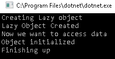
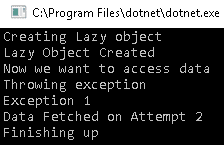
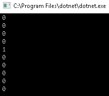
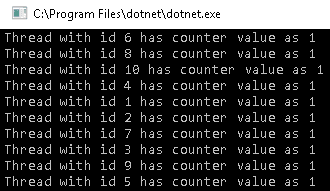
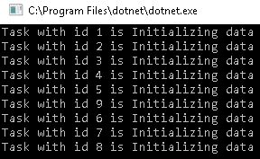

# 通过延迟初始化提高性能

在上一章中，我们讨论了 C# 中的线程安全并发集合。 并发集合有助于提高并行代码的性能，而无需开发人员担心同步开销。

在本章中，我们将讨论更多有助于提高代码性能的概念，包括使用自定义实现和使用内置构造。 以下是本章将要讨论的主题:

*   介绍延迟初始化的概念
*   `System.Lazy<T>`简介
*   如何用惰性模式处理异常
*   使用线程本地存储进行延迟初始化
*   减少延迟初始化的开销

让我们从引入惰性初始化模式开始。

# 技术要求

读者应该对 TPL 和 C# 有很好的理解。 本章的源代码可以在 GitHub 上的[https://github.com/PacktPublishing/-Hands-On-Parallel-Programming-with-C-8-and-.NET-Core-3/tree/master/Chapter07](https://github.com/PacktPublishing/-Hands-On-Parallel-Programming-with-C-8-and-.NET-Core-3/tree/master/Chapter07)找到。

# 引入惰性初始化概念

延迟加载是应用编程中常用的一种设计模式，在这种模式中，我们将对象的创建推迟到应用中实际需要时。 正确使用延迟加载模式可以显著提高应用的性能。

这种模式的一个常见用法可以在缓存旁模式中看到。 对于那些在资源或内存方面创建成本较高的对象，我们使用缓存备用模式。 我们不需要多次创建对象，而是一次性创建对象并缓存它们以备将来使用。 当对象的初始化从构造函数移到方法或属性时，可以使用此模式。 只有当代码第一次调用方法或属性时，对象才会初始化。 然后，它将被缓存以供后续调用。 看看下面的代码示例，它初始化了构造函数中的底层数据成员:

```cs
 class _1Eager
 {
     //Declare a private variable to hold data
     Data _cachedData;
     public _1Eager()
     {
         //Load data as soon as object is created
         _cachedData = GetDataFromDatabase();
     }
     public Data GetOrCreate()
     {
         return _cachedData;
     }
     //Create a dummy data object every time this method gets called
     private Data GetDataFromDatabase()
     {
         //Dummy Delay
         Thread.Sleep(5000);
         return new Data();
     }
 }

```

前面代码的问题是，对象一创建就初始化底层数据，即使底层对象只能通过调用`GetOrCreate()`方法访问。 在某些情况下，程序甚至可能不调用该方法，从而浪费了内存。

惰性加载可以完全使用自定义代码来实现，如下面的代码示例所示:

```cs
 class _2SimpleLazy
 {
    //Declare a private variable to hold data
     Data _cachedData;

     public _2SimpleLazy()
     {
         //Removed initialization logic from constructor
         Console.WriteLine("Constructor called");
     }

     public Data GetOrCreate()
     {
         //Check is data is null else create and store for later use
         if (_cachedData == null)
         {
             Console.WriteLine("Initializing object");
             _cachedData = GetDataFromDatabase();
         }        
         Console.WriteLine("Data returned from cache");
         //Returns cached data
         return _cachedData;
     }

     private Data GetDataFromDatabase()
     {
         //Dummy Delay
         Thread.Sleep(5000);
         return new Data();
     }
 }
```

从前面的代码中可以看到，我们将初始化逻辑从构造函数移到了`GetOrCreate()`方法中，该方法在将项返回给调用者之前检查该项是否在缓存中。 如果缓存中没有数据，则对其进行初始化。

下面是调用前面方法的代码:

```cs
public static void Main(){
    _2SimpleLazy lazy = new _2SimpleLazy();
     var data = lazy.GetOrCreate();
     data = lazy.GetOrCreate();
}
```

输出如下:


前面的代码虽然很懒，但存在多加载的潜在问题。 这意味着如果多个线程同时调用`GetOrCreate()`方法，对数据库的调用可能会运行多次。

可以通过引入锁来改进这一点，如下面的代码示例所示。 对于缓存 aside 模式，使用另一种模式是有意义的，双重检查锁定:

```cs
 class _2ThreadSafeSimpleLazy
 {
     Data _cachedData;
     static object _locker = new object();

     public Data GetOrCreate()
     {
         //Try to Load cached data
         var data = _cachedData;
         //If data not created yet
         if (data == null)
         {
             //Lock the shared resource
             lock (_locker)
             {
                 //Second try to load data from cache as it might have been 
                 //populate by another thread while current thread was 
                 // waiting for lock
                 data = _cachedData;
                 //If Data not cached yet
                 if (data == null)
                 {
                     //Load data from database and cache for later use
                     data = GetDataFromDatabase();
                     _cachedData = data;
                 }
             }
         }
         return _cachedData;
     }

     private Data GetDataFromDatabase()
     {
         //Dummy Delay
         Thread.Sleep(5000);
         return new Data();
     }
     public void ResetCache()
     {
         _cachedData = null;
     }
 }

```

前面的代码是不言自明的。 我们可以看到，从零开始创建惰性模式是很复杂的。 幸运的是，. net Framework 为惰性模式提供了数据结构。

# 引入系统。 懒惰

. net Framework 提供了一个`System.Lazy<T>`类，它具有惰性初始化的所有优点，而不需要担心同步开销。 使用`System.Lazy<T>`创建的对象被延迟，直到第一次访问它们。 通过前面部分中解释的自定义延迟代码，我们可以看到，我们将初始化部分从构造函数移到了方法/属性中，以支持延迟初始化。 使用`Lazy<T>`，我们不需要修改任何代码。

在 C# 中有多种方法来实现惰性初始化模式。 这些措施包括:

*   构造函数中封装的构造逻辑
*   构造逻辑作为委托传递给`Lazy<T>`

在接下来的章节中，我们将尝试深入理解这些场景。

# 构造函数中封装的构造逻辑

让我们首先尝试使用在构造函数中封装构造逻辑的类来实现惰性初始化模式。 假设我们有一个`Data`类:

```cs
 class DataWrapper
 {
     public DataWrapper()
     {
         CachedData = GetDataFromDatabase();
         Console.WriteLine("Object initialized");
     }
     public Data CachedData { get; set; }
     private Data GetDataFromDatabase()
     {
         //Dummy Delay
         Thread.Sleep(5000);
         return new Data();
     }
 }
```

如您所见，初始化发生在构造函数内部。 如果我们正常使用这个类，使用下面的代码，对象在创建`DataWrapper`对象时被初始化:

```cs
 DataWrapper dataWrapper = new DataWrapper();

```

输出如下:


以上代码可以使用`Lazy<T>`进行转换，如下所示:

```cs
 Console.WriteLine("Creating Lazy object");
 Lazy<DataWrapper> lazyDataWrapper = new Lazy<DataWrapper>();
 Console.WriteLine("Lazy Object Created");
 Console.WriteLine("Now we want to access data");
 var data = lazyDataWrapper.Value.CachedData;
 Console.WriteLine("Finishing up");
```

如您所见，我们没有直接创建对象，而是将其封装在惰性类中。 在访问`Lazy`对象的`Value`属性之前，构造函数不会被调用，如下面的输出所示:


# 构造逻辑作为委托传递给 Lazy

对象通常不包含构造逻辑，因为它们是普通的数据模型。 我们需要在第一次访问延迟对象时获取数据，同时传递获取数据的逻辑。 这可以通过使用`System.Lazy<T>`的另一个重载实现，如下所示:

```cs
 class _5LazyUsingDelegate
 {
     public Data CachedData { get; set; }
     static Data GetDataFromDatabase()
     {
         Console.WriteLine("Fetching data");
         //Dummy Delay
         Thread.Sleep(5000);
         return new Data();
     }
 }
```

在下面的代码中，我们通过传递`Func<Data>`委托来创建一个`Lazy<Data>`对象:

```cs
 Console.WriteLine("Creating Lazy object");
 Func<Data> dataFetchLogic = new Func<Data>(()=> GetDataFromDatabase());
 Lazy<Data> lazyDataWrapper = new Lazy<Data>(dataFetchLogic);
 Console.WriteLine("Lazy Object Created");
 Console.WriteLine("Now we want to access data");
 var data = lazyDataWrapper.Value;
 Console.WriteLine("Finishing up");
```

从前面的代码中可以看到，我们将`Func<T>`传递给`Lazy<T>`构造函数。 该逻辑在第一次访问`Lazy<T>`实例的`Value`属性时被调用，如下所示:



除了知道如何在.NET 中构造和使用惰性对象之外，我们还需要了解如何用惰性初始化模式处理异常! 让我们看看下面的部分。

# 使用惰性初始化模式处理异常

惰性对象在设计上是不可变的。 这意味着它们总是返回与初始化它们时相同的实例。 我们已经看到，我们可以将初始化逻辑传递给`Lazy<T>`，并且我们可以在底层对象的构造函数中拥有初始化逻辑。 如果构造/初始化逻辑出错并抛出异常，会发生什么? 在此场景中，`Lazy<T>`的行为取决于`LazyThreadSafetyMode`枚举的值和您选择的`Lazy<T>`构造函数。 在使用惰性模式时，有很多方法可以处理异常。 其中一些问题如下:

*   初始化过程中不会出现异常
*   使用异常缓存进行初始化时的随机异常
*   不缓存异常

在接下来的章节中，我们将尝试深入理解这些场景。

# 初始化过程中不会出现异常

初始化逻辑运行一次，对象被缓存并返回，随后访问`Value`属性。 在前一节中解释`Lazy<T>`时，我们已经看到了这种行为。

# 使用异常缓存进行初始化时的随机异常

在这种情况下，由于没有创建基础对象，初始化逻辑将在每次调用`Value`属性时运行。 在构造逻辑依赖于外部因素(比如调用外部服务时的 internet 连接)的场景中，这很有帮助。 如果 internet 暂时中断，则初始化调用将失败，但后续调用可以返回数据。 默认情况下，`Lazy<T>`将缓存所有参数化构造函数实现的异常，但不会缓存无参数构造函数实现的异常。

让我们试着理解当`Lazy<T>`初始化逻辑抛出一个随机异常时会发生什么:

1.  首先，我们使用`GetDataFromDatabase()`函数提供的初始化逻辑创建`Lazy<Data>`，如下所示:

```cs
Func<Data> dataFetchLogic = new Func<Data>(() => GetDataFromDatabase());
Lazy<Data> lazyDataWrapper = new Lazy<Data>(dataFetchLogic);
```

2.  接下来，我们访问`Lazy<Data>`的`Value`属性，它将执行初始化逻辑并抛出一个异常，因为计数器的值为`0`:

```cs
 try
 {
     data = lazyDataWrapper.Value;
     Console.WriteLine("Data Fetched on Attempt 1");
 }
 catch (Exception)
 {
     Console.WriteLine("Exception 1");
 }
```

3.  接下来，将计数器加 1，并再次尝试访问`Value`属性。 根据逻辑，这一次，它应该返回`Data`对象，但我们看到代码再次抛出异常:

```cs
 class _6_1_ExceptionsWithLazyWithCaching
 {
     static int counter = 0;
     public Data CachedData { get; set; }
     static Data GetDataFromDatabase()
     {
         if ( counter == 0)
         {
             Console.WriteLine("Throwing exception");
             throw new Exception("Some Error has occurred");
         }
         else
         {
             return new Data();
         }
     }

     public static void Main()
     {
         Console.WriteLine("Creating Lazy object");
         Func<Data> dataFetchLogic = new Func<Data>(() => 
          GetDataFromDatabase());
         Lazy<Data> lazyDataWrapper = new 
          Lazy<Data>(dataFetchLogic);
         Console.WriteLine("Lazy Object Created");
         Console.WriteLine("Now we want to access data");
         Data data = null;
         try
         {
             data = lazyDataWrapper.Value;
             Console.WriteLine("Data Fetched on Attempt 1");
         }
         catch (Exception)
         {
             Console.WriteLine("Exception 1");
         }
         try
         {
             counter++;
             data = lazyDataWrapper.Value;
             Console.WriteLine("Data Fetched on Attempt 1");
         }
         catch (Exception)
         {
             Console.WriteLine("Exception 2");
             // throw;
         }
         Console.WriteLine("Finishing up");
         Console.ReadLine();
     }
 }
```

如您所见，异常第二次被抛出，即使我们将计数器增加了 1。 这是因为异常值被缓存并在下次访问`Value`属性时返回。 输出如下所示:


前面的行为与通过传递`System.Threading.LazyThreadSafetyMode.None`作为第二个参数来创建`Lazy<T>`相同:

```cs
Lazy<Data> lazyDataWrapper = new Lazy<Data>(dataFetchLogic,System.Threading.LazyThreadSafetyMode.None);
```

# 不缓存异常

让我们将前面代码中`Lazy<Data>`的初始化改为如下:

```cs
Lazy<Data> lazyDataWrapper = new Lazy<Data>(dataFetchLogic,System.Threading.LazyThreadSafetyMode.PublicationOnly);

```

这将允许不同的线程多次运行初始化逻辑，直到其中一个线程成功地运行了初始化而没有任何错误。 在多线程场景中，如果任何线程在初始化过程中抛出错误，那么由已完成线程创建的基础对象的所有实例将被丢弃，并将异常传播到`Value`属性。 在单个线程的情况下，在后续访问`Value`属性时重新运行初始化逻辑将返回一个异常。 异常不会被缓存。

输出如下:



在了解了如何使用延迟初始化模式处理异常之后，现在让我们了解如何使用线程本地存储进行延迟初始化。

# 使用线程本地存储进行延迟初始化

在多线程编程中，我们通常希望创建一个线程本地的变量，这意味着每个线程都有自己的数据副本。 这适用于所有局部变量，但全局变量总是在线程间共享。 在旧版本的.NET 中，我们使用`ThreadStatic`属性使静态变量表现为线程局部变量。 然而，这并不是万无一失的，也不能很好地用于初始化。 如果我们初始化一个变量`ThreadStatic`，那么只有第一个线程获得初始化值，而其他线程获得变量的默认值，在整数的情况下为 0。 这可以用下面的代码来演示:

```cs
 [ThreadStatic]
 static int counter = 1;
 public static void Main()
 {
     for (int i = 0; i < 10; i++)
     {
         Task.Factory.StartNew(() => Console.WriteLine(counter));
     }
     Console.ReadLine();
 }

```

在前面的代码中，我们初始化了一个值为`1`的静态变量`counter`，并将其设置为线程静态，这样每个线程都可以拥有自己的副本。 出于演示目的，我们创建了 10 个打印计数器值的任务。 根据逻辑，所有的线程都应该输出 1，但是你可以从下面的输出中看到，只有一个线程输出 1，其他线程输出 0:



. net Framework 4 提供了`System.Threading.ThreadLocal<T>`作为`ThreadStatic`的替代，其工作方式更像`Lazy<T>`。 使用`ThreadLocal<T>`，我们可以创建一个线程局部变量，该变量可以通过传递一个初始化函数来初始化，如下所示:

```cs
 static ThreadLocal<int> counter = new ThreadLocal<int>(() => 1);
 public static void Main()
 {
     for (int i = 0; i < 10; i++)
     {
         Task.Factory.StartNew(() => Console.WriteLine($"Thread with 
          id {Task.CurrentId} has counter value as {counter.Value}"));
     }
     Console.ReadLine();
 }
```

输出与预期一致:



`Lazy<T>`与`ThreadLocal<T>`的区别如下:

*   每个线程使用自己的私有数据初始化`ThreadLocal`变量，而在`Lazy<T>`的情况下，初始化逻辑只运行一次。
*   与`Lazy<T>`不同，`ThreadLocal<T>`中的`Value`属性是读/写的。
*   在没有任何初始化逻辑的情况下，将把默认值`T`赋给`ThreadLocal`变量。

# 减少延迟初始化的开销

`Lazy<T>`通过包装底层对象来使用间接级别。 这可能会导致计算和内存问题。 为了避免包装对象，我们可以使用类的静态变体`Lazy<T>`，即`LazyInitializer`类。

可以使用`LazyInitializer.EnsureInitialized`初始化通过引用和初始化函数传递的数据成员，就像使用`Lazy<T>`一样。

该方法可以通过多个线程调用，但是一旦初始化了一个值，它将作为所有线程的结果使用。 为了演示，我在初始化逻辑中添加了一行到控制台。 虽然循环运行了 10 次，但对于单线程执行，初始化只会发生一次:

```cs
 static Data _data;
 public static void Main()
 {
     for (int i = 0; i < 10; i++)
     {
         Console.WriteLine($"Iteration {i}");
         // Lazily initialize _data
         LazyInitializer.EnsureInitialized(ref _data, () =>
         {
             Console.WriteLine("Initializing data");
             // Returns value that will be assigned in the ref parameter.
             return new Data();
         });
     }
     Console.ReadLine();
 }
```

下面是输出:

【t】【t】

这对于顺序执行很好。 让我们试着修改代码并通过多个线程运行它:

```cs
static Data _data;
static void Initializer()
{
     LazyInitializer.EnsureInitialized(ref _data, () =>
     {
         Console.WriteLine($"Task with id {Task.CurrentId} is 
          Initializing data");
         // Returns value that will be assigned in the ref parameter.
         return new Data();
     });

    public static void Main()
     {
         Parallel.For(0, 10, (i) => Initializer());
         Console.ReadLine();
     }
}
```

下面是输出:



如您所见，对于多个线程，存在一个竞争条件，所有线程最终都会初始化数据。 我们可以通过修改程序来避免这种竞争条件:

```cs
 static Data _data;
 static bool _initialized;
 static object _locker = new object();
 static void Initializer()
 {
     Console.WriteLine("Task with id {0}", Task.CurrentId);
     LazyInitializer.EnsureInitialized(ref _data,ref _initialized, 
      ref _locker, () =>
     {
         Console.WriteLine($"Task with id {Task.CurrentId} is 
          Initializing data");
         // Returns value that will be assigned in the ref parameter.
         return new Data();
     });
 }
 public static void Main()
 {
     Parallel.For(0, 10, (i) => Initializer());
     Console.ReadLine();
 }
```

从前面的代码中可以看到，我们使用了重载`EnsureInitialized`方法，并传递了一个布尔变量和一个`SyncLock`对象作为参数。 这将确保初始化逻辑一次只能被一个线程执行，如下面的输出所示:


在本节中，我们讨论了如何使用`Lazy<T>`的另一个内置静态变量`LazyInitializer`类来处理与`Lazy<T>`相关的开销。

# 总结

在本章中，我们讨论了延迟加载的各个方面，以及.NET Framework 提供的数据结构，以使延迟加载更容易实现。

通过减少内存占用以及通过停止重复初始化节省计算资源，延迟加载可以显著提高应用的性能。 我们可以选择使用`Lazy<T>`从头创建懒惰类，或者使用静态`LazyInitializer`类来避免复杂性。 通过优化线程存储的使用和良好的异常处理逻辑，这些当然是开发人员的伟大工具。

在下一章中，我们将开始讨论 C# 中的异步编程方法。

# 问题

1.  延迟初始化总是在构造函数中包含创建对象。
    1.  真正的                          
    2.  假
2.  在延迟初始化模式中，对象创建被推迟到实际需要时。
    1.  真正的                          
    2.  假
3.  其中哪些可以用来创建不缓存异常的惰性对象?
    1.  `LazyThreadSafetyMode.DoNotCacheException`
    2.  `LazyThreadSafetyMode.PublicationOnly`
4.  哪个属性可以用来创建线程本地的变量?
    1.  `ThreadLocal`                    
    2.  `ThreadStatic`
    3.  这两个