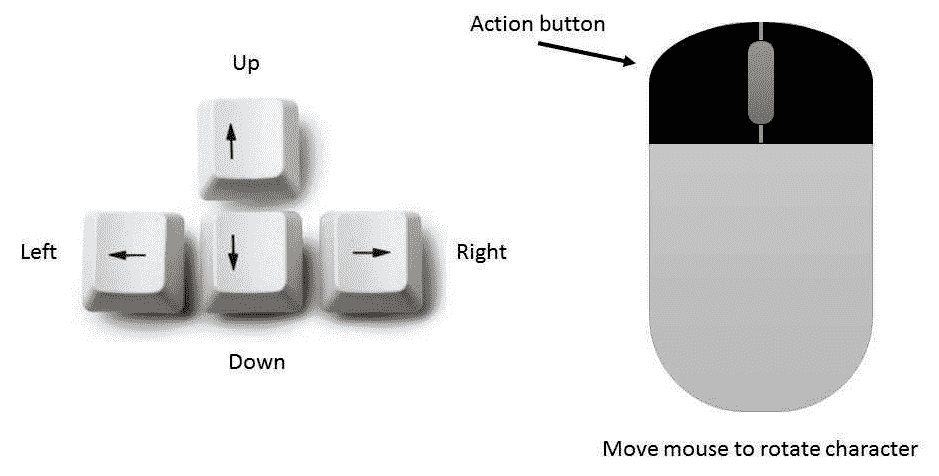
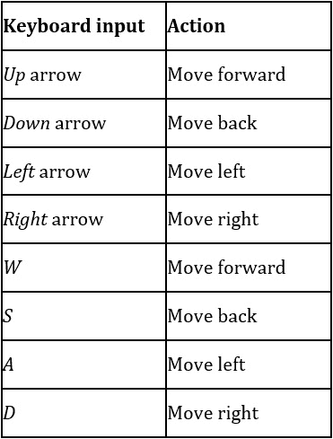
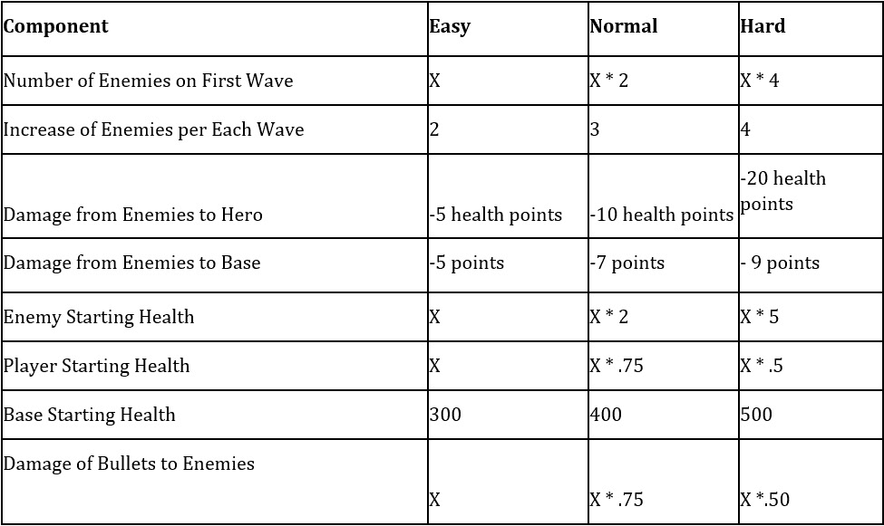

# *第一章*:从零开始设计游戏

欢迎来到这本书的第一章! 我相信你们和我一样，对于使用 Unity 开始游戏开发之旅感到非常兴奋。 我们将从四个部分来探讨游戏开发。 首先，我们将讨论游戏开发的基础知识，看看如何在你开始编码之前设计你的游戏，然后我们将使用 Unity 创建一个简单的首个关卡原型。 然后，我们将深入图像，找出一个好的游戏的外观和感觉。 稍后，我们将学习如何通过使用脚本使一切顺利进行; 最后，我们将看到你如何完成并发行你的游戏。 当你浏览章节时，你将把每个概念应用到一个完整的游戏项目中，所以你将以一个功能齐全的射击游戏结束这本书。

在本章中，我们将设计我们的游戏《Super Shooter》。 这一阶段被称为预制作阶段，我们将在此创建开发计划。 我们的游戏设计将包含我们想要的所有游戏功能:玩家角色、非玩家角色、游戏资产、动画等等。 我们将使用屏幕模型和叙述来记录我们的游戏设计。 在此过程中，我们将着眼于 Unity 在游戏中的使用相关概念。 在本章中，我们将讨论在所有设计工作中需要哪些文档。

具体来说，我们将在本章中研究以下概念:

*   游戏概念
*   游戏角色
*   游戏
*   很难平衡
*   文档

# 游戏概念

为什么不直接开始开发游戏，而不是设计游戏呢? 这个问题源于开发游戏的兴奋，特别是使用 Unity 游戏引擎。 所有游戏都是从一个想法开始的。 这个想法被转化为设计，而设计是开发的基础，最终是最终的游戏。

游戏设计就像房子的蓝图。 你不会考虑在没有蓝图的情况下建造房子，而在没有设计的情况下开发游戏也是个糟糕的主意。 这样做的原因是为了节省时间和挫败感。 对于更大的项目，浪费时间也意味着浪费不必要的资金。

假设你雇佣了一个由 12 名开发人员、动画师和美工组成的项目团队。 如果你分享了你的游戏理念，他们是否有足够的理由继续下去? 它们是否能够创造出出色的内容，但却不能为你的游戏创造出具有凝聚力的组件? 我们在游戏设计中所做的一切就是在一开始就尽可能地记录更多内容，以便让开发过程更具目的性。 毫无疑问，你将在开发过程中不断修改游戏设计，所以拥有一个强大的基础对于你的成功至关重要。

我们的游戏设计将作为基础的外观我们游戏,玩家的目标是什么,游戏会是什么,并支持用户操作、动画、音频、人工智能**(**AI),和胜利条件。 这是一个需要思考的问题，并且强调了将游戏理念转化为游戏设计的重要性。****

 **在本书中，我们将涵盖一系列的组件。 然而，在本节中，我们将涵盖以下列表中的内容:

*   游戏的想法
*   输入控件
*   胜利和失败

因此，让我们更详细地看看每个组件。

游戏的想法

我们的《超级射手》游戏的基本概念是，它将是一款以未来英雄士兵为玩家角色的 3D 游戏。 角色必须与敌兵作战。 这些敌人的目的是摧毁我们英雄的基地和任何挡住他们的人，包括我们的英雄。 他必须跟踪一定数量的子弹。

现在我们已经大致了解了游戏将会是什么样子，让我们来谈谈玩家将如何控制角色。

## 输入控件

考虑玩家如何与我们的游戏互动是很重要的。 玩家将使用标准的控制设置来控制我们的英雄。 玩家期望在游戏中执行用户控制的行业规范。 因此，我们的默认用户输入控件集，如下面的截图所示，将由键盘和鼠标组成:

图 1.1 -控制方案

我们将配置和编程我们的游戏，以便用户从键盘输入匹配下表所示的键和动作组合:

玩偶 1。2——键 mappi【T0 ng】

鼠标也将成为用户输入的重要来源。 我们将使用鼠标实现两个组件，如下表所示:

图 1.3 -鼠标映射

鼠标左键将是我们的操作按钮。 我们需要确保只有当玩家还剩下一颗或更多子弹时才会发射子弹。

这就是我们处理输入的方式，但是有时候我们需要结束游戏过程! 让我们来谈谈玩家将如何获胜和失败。

## 输赢

我们的胜利条件将是当所有的敌人波浪被消灭。 玩家可能会以两种不同的方式输掉游戏。 第一种失效条件是基础寿命变为**0**。 第二个死亡条件是英雄的生命值变为**0**。

通过这段简短的描述，你可以看出将有几件事情需要跟踪，包括以下内容:

*   剩余波数
*   我们的基本生命的数字
*   数我们的英雄生活

现在，我们已经定义了所谓的游戏“核心循环”(星级一个关卡，玩它，赢/输它，重复)。 让我们从角色开始，深入了解具体细节。

# 游戏角色

我们的游戏将突出几个物体，但只有两个游戏角色。 第一个游戏角色是我们的英雄，由玩家控制。 第二种类型的游戏角色是敌人。 它们是由 AI 控制的非玩家角色。 让我们更仔细地看看这两个角色。

## 英雄

玩家将以英雄(游戏邦注:我们游戏的主角)的身份来玩游戏。 这是一个角色，我们将导入使用在我们的游戏。 所以，我们的英雄玩家角色可以做什么? 我们已经知道，通过键盘和鼠标的组合输入，我们可以在整个游戏环境中移动它们。 我们也知道鼠标左键——我们的动作按钮——会让他发射子弹。

重要提示:

因为英雄是由人类玩家控制的，所以它被称为玩家角色。

我们将为英雄实现以下的动画:

*   **Idle**:该动画将在角色未被玩家移动时播放。
*   **Run**:当角色被玩家移动时，此动画将播放。
*   **Shoot**:这是一个让英雄发射子弹的动画。

这是我们的球员。 现在，让我们来讨论一下我们的敌人性格。

## 敌人

我们游戏的对手将是敌兵。 我们将在游戏中控制它们的数量以及它们的位置。 我们还将通过人工智能控制他们的行为。 敌人将直接前往基地，一旦那里，他们将开始破坏它。 我们将确定多长时间我们的基地被完全摧毁。

信息框:

因为敌人是由 AI 而不是人类玩家控制的，所以它被称为非玩家角色。

我们将为敌人士兵实现以下动画:

*   **Run**:当敌人看到英雄时，他们会朝他跑去，当他们接近玩家时，他们会停下来开始攻击英雄。
*   **攻击**:当敌人接近基地或玩家时，此动画将播放。
*   **Death**:此动画将在玩家打败敌人时播放。

我们将需要仔细的计划和脚本来创建理想的敌人行为。 敌人的数量和部署是我们需要做出的决定。

这定义了我们角色的细节。 现在，让我们讨论一下游戏将如何进行，看看具体细节。

# 游戏玩法

游戏将从游戏世界中心的玩家开始。 由玩家控制的英雄将需要保护基地免受敌人的攻击。 为了抵挡敌人，英雄将拥有一定数量的子弹。 目标是击败所有的敌人之前，基地是完全摧毁他们。

让我们看看如何实现这一切。 以下的游戏玩法组件将在本节中介绍:

*   游戏世界的布局
*   开始的条件
*   结束条件
*   点系统
*   **平视显示**(**HUD**)

我们将介绍上述每一个组件，并讨论它们如何改变游戏体验。 让我们先谈谈游戏世界将如何设计。

## 游戏世界布局

我们将创造基地环境，其中包括大型金属地砖、墙壁、门，敌人将在此产卵，而我们的基地建筑位于屏幕底部，敌人需要在此开始攻击。

以下是我们的游戏世界的模型:

图 1.4 -基础布局

有四个基本的东西在前面的模型中说明，列出如下:

*   **墙**:阻止玩家走出游戏区域的不可逾越的障碍。
*   **门**:像墙一样不可穿透，但也可以作为敌人的刷出位置。 敌人将在他们后面产卵，可以穿透他们进入我们的根据地。
*   **玩家开始**:英雄开始位置。
*   **基地建设**:我们的基地。 敌人必须足够近才能攻击它。

在完成基础关卡设计后，让我们来讨论玩家如何以温和的方式进入游戏世界。

## 起始条件

当我们的游戏首次发布时，我们将有几个启动条件设置。 以下是这些条件的列表:

*   敌人刷出点(门)的数量和位置
*   英雄持有的子弹数量
*   基地布置

让我们来看看这些初始条件:

*   第一个开始条件是在哪里生成敌人。 正如你在我们之前的模型中看到的，游戏中会有几个可能的刷出点(门)。 我们将编写一个脚本，每次在随机地点生成一波又一波的敌人。 每一波将增加敌人的数量，以增加难度。
*   玩家所持有的子弹数量必须经过仔细考虑。 它必须足够大，在敌人跑出之前就能击败他们。
*   我们的第三个也是最后一个开始条件是基地布置。 正如你在前面的截图中所看到的，这是位于门的另一边，所以敌人必须穿过门与门之间的整个空间，让玩家有机会攻击他们。

我们已经定义了敌人的生成规则以及玩家如何玩游戏。 现在，让我们来谈谈游戏将如何结束，看看这是如何执行的。

## 结束条件

到目前为止，我们已经确定我们将追踪游戏中的几个组件。 让我们记住它们——它们是这样的:

*   剩余的波
*   基本的健康
*   运动员的健康

基于我们之前所决定的关于游戏结束条件的内容，我们可以应用以下数学检查来确定游戏是否结束以及结果是什么。 下表列出了每个博弈结束条件及其结果:

图 1.5 -游戏结束条件

为了执行这三个游戏结束条件，我们知道我们必须追踪波动的数量、玩家生命值和基础生命值。 这是强制性的。

现在我们已经拥有了一款完整的游戏，让我们考虑如何通过执行经典的积分系统让游戏更具奖励性。

## 积分系统

由于我们跟踪的是包含数字的关键信息，这使得我们很容易实现积分系统。 例如，我们可以在每次消灭敌人时给予玩家 50 点积分，或者我们也可以在每次敌人破坏基地时拿走点数。 在我们的情况下，我们只会在敌人被杀时给予分数，但如果你想扩大这个区域，你可以自由。

现在，我们有几个玩家需要知道的系统，但现在，玩家还没有任何方法做出明智的决定。 让我们看看如何改进它，使用 HUD。

## HUD

我们决定在游戏过程中追踪具有价值的信息，而不仅仅是计算点数和游戏结束。 玩家会希望看到这些信息，因为它们能够提供动机并增加游戏的乐趣。 所以，我们将为玩家创建一个 HUD，并在游戏中动态更新数据。

信息框:

HUD 是始终呈现在屏幕上的可视化信息层。

以下是我们在《超级射手》游戏中 HUD 的模型:

图 1.6 - UI 布局

如你所见，我们的 HUD 中有几个组件，如下所示:

*   **英雄生命值**:经典的生命值条，让我们可以直观地看到剩余生命值。 我们选择一个条形图而不是数字，因为在激烈的战斗中更容易看到条形图而不是数字。
*   **英雄化身**:生命条旁边的图像只是为了显示英雄的脸。
*   **Score**:我们所获得的分数。
*   **子弹**:剩余子弹的数量。 玩家必须经常检查这个数字，以避免用光子弹。
*   **剩余的波浪/敌人**:关于波浪和游戏当前状态的信息，只是为了让玩家知道游戏什么时候会结束，在这个过程中给他们施加一些压力。
*   **基础生命值**:另一个重要信息。 它的大小足以让玩家注意到基地何时受到攻击，并在这种情况下采取行动。

最后，我们拥有了一款拥有许多规则和规范的成熟游戏，我们现在就可以开始创造游戏了。 然而，有一个很好的做法是永远不要过早执行:平衡游戏。

# 难度平衡

在决定游戏的难度时，你需要考虑很多因素。 如果游戏太难，玩家就会失去兴趣，如果游戏太简单，可能就无法吸引目标用户。 有些游戏还提供难度等级供用户选择。 其他游戏有多个关卡，每个关卡的难度都在增加。 为了达到我们想要的难度平衡，我们必须解决几个问题。

在这一节中，我们将首先看一些与难度平衡相关的问题，然后是我们的实施计划。

## 难度平衡问题

我们在游戏设计中需要考虑许多关于游戏的问题。 回顾这部分的问题将帮助我们认识到即使是像我们这样的简单游戏也必须面对的问题，以便实现所需的难度平衡。

这里列出的第一组问题与我们游戏中难度的整体执行有关:

*   我们是否应该设置不同的难度等级，让玩家自己选择?
*   每个难度级别有什么不同之处?
*   我们是否应该拥有多个游戏关卡，并且每个关卡的难度都有所增加?
*   每个游戏关卡有什么不同之处?

考虑以下关于我们游戏中的敌人的问题:

*   每波上应该产生多少敌人?
*   在什么距离下，敌人才会意识到英雄的存在?
*   敌人每次攻击对玩家造成多大伤害?
*   敌人在死亡前能承受多少伤害?

这里列出的下一组问题是关于我们的可玩角色，英雄:

*   角色应该有多少生命?
*   角色在一次敌人攻击中会受到多少伤害?
*   角色是否能够跑过敌人?

我们还需要在游戏中考虑基础和子弹。 以下是关于我们将在游戏中执行的每个游戏资产的几个问题。 在基地的情况下，问题如下:

*   敌人要发动多少次攻击才能摧毁一个基地?
*   在一个 Wave 中产生的敌人的理想最大数量是多少?
*   门和基地应该位于游戏环境的哪里?

现在，让我们来讨论一下子弹案例中的问题，如下:

*   玩家以什么速度耗尽子弹?
*   玩家所能拥有的最大子弹数量是多少?
*   子弹会对敌人造成多少伤害?

如您所见，作为设计的一部分，我们需要回答几个问题。 有些问题似乎是多余的，因为它们涉及游戏中的多个组件。 现在，让我们回答其中的一些问题。

## 实施方案

根据最后一节提出的问题，我们必须想出一些答案。 我们在这里做一下。 我们的第一个决策集中在整个游戏概念上，如下所示:

*   执行一个游戏关卡。
*   为用户提供三种游戏难度设置:**简单**、**普通**、**困难**。

既然我们已经决定创造三个游戏关卡，我们就必须确定它们的不同之处。 这很容易通过使用矩阵来管理。 当我们填写矩阵时，我们将能够记录前面列出的大多数问题的答案。 以下是我们所称的难度执行矩阵:

图 1.7 -每个关卡的难度

游戏中也会有一组不会根据用户选择的难度等级而改变的决策。 以下是这些决定的列表:

*   敌人的侵略性是不会改变的。 我们将为他们编写脚本，这样如果他们意识到英雄，他们就会攻击他。
*   我们将为敌人建立一个相当小的视野区域，让英雄能够很容易地从他们身边溜过，也许更重要的是，能够超越他们。
*   重生将被随机分配在之前游戏模型中确定的重生点之间。

重要的是要考虑到这是第一次平衡通过，我们肯定会根据游戏执行时的测试来改变这一点。

现在，我们可以说游戏设计已经完成了。 实际上，游戏设计永远不会结束; 它会随着游戏的发展而不断发展，但我们还是把它留到以后吧。 现在，让我们谈谈如何使用文档与团队中的每个人交流我们的伟大想法。

# 文档

现在我们已经了解了游戏的所有主要方面，准备好与他人分享这些内容是很重要的。 通过这本书，你可能会独自工作，但在现实生活中，你可能会与他人合作，所以分享你的愿景是创造成功游戏的关键技能。 你不仅要与队友分享你的愿景，还要与那些想要投资你的游戏项目的潜在投资者分享你的愿景(如果你说服他们这么做的话)。 在这一节中，我们将提供关于如何将你的游戏信息格式化成易于理解的文件的建议。

## 游戏设计文件(GDD)

这份文件可以说是你的游戏的“T0 圣经”。 它包含了所有方面的分解，每个方面都详细解释了不同的游戏系统应该如何运行。 在这里，您将提出我们之前在实施计划中回答的问题和答案，并且您将深入研究它们。 记住，在你的头脑中有一个想法，并确保其他人理解这个想法是复杂的，所以不要低估这个重要的任务。

也许你正在独自制作一款游戏，并表示你不需要 GDD，因为所有的想法都可以在你的头脑中找到，这对于非常小的游戏来说是正确的，但任何规模的游戏和团队都可以从 GDD 中受益。 它可以作为你的笔记本，记下你自己的想法并阅读它们。 这一点很重要，因为在你的脑海中，一切都是有意义的，但一旦你阅读并回顾自己的想法，你就会发现许多可以轻松修复的盲点，而不是在编写整个游戏时发现它们。

让我们开始讨论如何构建 GDD。

## GDD 格式

遗憾的是，目前还没有创建 GDD 的标准或独特方法。 每个公司和团队都有自己的方法，不仅是他们使用的工具，还有文件的内容。 根据团队的规模、游戏类型以及游戏背后的公司文化，这一比例会有很大的不同。 事实上，一些公司实际上认为没有必要创建 GDD。

开始制作它们的一个好主意是查看一些游戏的现有发行的 gdd。 这类游戏还有很多，包括知名的大型游戏(如《毁灭战士》)。 通常来说，它们大多是带有解释游戏系统(如武器、库存等)和所有角色列表的 Word 文档，而有些可能只是解释游戏不同部分的特定事实的要点列表。 之后，您可以开始试验适合您的项目和团队的不同 GDD 格式。

一旦你决定了一种好的格式，你就必须决定你将如何使用这种格式，除了使用笔和纸，更好的主意是使用所有这些伟大的数字工具。 让我们看看其中的一些。

## GDD 创建工具

在审查了现有的gdd 之后，下一步是选择一个合适的工具来编写它。 你需要考虑的第一件事是，GDD 会一直频繁地发生改变。 在创造游戏的过程中，你将验证或抛弃你在 GDD 中所写的想法，所以使用动态工具是个好主意。 这可以用您熟悉的任何文本处理程序来完成，但是还需要解决其他问题，也许文本处理程序还不够。

你的 GDD 会很大，我的意思是，即使是对于简单的游戏来说，它也会有很多部分，你会发现某些情况下，整个部分会参考其他部分，从而在文件的几个部分之间生成一个巨大的链接网。 管理这种情况的一个好工具，而不是文本处理程序，就是使用任何类型的 wiki，我强烈建议在这种情况下使用这些非常有用的工具。 它们允许你将整个 GDD 分解成文章，这样你就可以很容易地编辑和链接到其他人，而且，许多 wiki 允许你协作编辑文章。 还有其他额外的特性，比如允许关于 GDD 中某个特性的完整对话的注释，记录这个以供将来参考。 与 gdd 相关的*Wikipedia*页面如下截图所示:

图 1.8 -维基百科网站

此外，还可以使用其他工具，如谷歌 Drive，它允许混合不同类型的文档——从常规文本文档到动态幻灯片——来创建演示文稿，在简单而强大的媒体中交流复杂的方面。 另外，谷歌 Drive 有很多很棒的协作工具，可以改进许多人在 GDD 中工作的方式。

我们所描述的所有工具都是编写文件的通用解决方案，它们的效果非常好，但也有其他专门针对游戏的工具。

现在，让我们开始编写 GDD。 我知道我说过没有标准的格式，但至少让我们看看每个 GDD 应该有什么，从电梯游说开始。

## 电梯游说

想象一下，你正在一幢大楼里乘坐电梯，在下一层，一位重要的游戏投资者刚刚走进来。 他们按下了第 10 层的按钮，所以你有 8 层的时间去说服他们向你的口袋中投入资金来帮助你创造游戏。 我知道这不大可能，但在现实生活中，当你在圆桌会议上面对一位投资者时，你没有太多的时间去说服他们。 记住，在你身后可能有成千上万的开发者想要做同样的事情，所以你必须快速且发自内心，这就是为什么拥有一个好的电梯游说如此重要。

电梯游说可能是你在 GDD 中发现的第一句话，也是最重要的一句话。 它需要用不超过两行字来描述你的游戏，并说服阅读 GDD 的人你的游戏是个很棒的想法——你需要让他们立刻想玩你的游戏。 是的，这听起来很有野心，确实如此，但这可能会让你从众多希望为自己的游戏获得资金的开发者中脱颖而出。

再次强调，创造一个成功的电梯游说并没有标准的公式(如果存在这样的东西，我们都会很富有)，但这里有一些建议需要考虑:

*   你必须在不超过 10 秒的时间内陈述你的陈述。 再久一点，你就会对你试图说服的人失去兴趣。
*   你必须让自己的想法听起来令人信服; 没有人会投资一款你不确定是否会发行的游戏。
*   不要使用任何技术词汇(我说的是你们，程序员)。
*   包括你的游戏与其他游戏的区别。
*   迭代它，直到你能够说服任何与你关系密切的人去玩游戏，并尝试着与你所能找到的最诚实的人一起测试它——这个人不会介意将你的想法分解成碎片(如果你的想法真的值得这么做的话)。
*   在镜子前练习，一遍又一遍，直到你能把它说得漂亮、清楚，而且一气二用。

下面是一些关于“电梯游说”的例子:

*   想象你自己用你的手臂和力量屠杀希腊巨人，直到你成为奥林匹斯山之王。 **INSERT NAME OF TOTALLY NOT exist GAME HERE**
*   文明已经下降。 一种可怕的传染病会把人变成僵尸。 你有唯一的解药，而且必须穿越整个国家去运送它，否则人类会崩溃。

好吧，现在，这些点子不是特别新颖，但几年前是。 想象一下那些投球在当时的威力; 你必须找到类似的东西。 我并不是说这很容易，但看看这两行字如何成为令人惊叹的体验的开始，所以先专注于写这两行，然后是游戏的其余部分。

现在你已经引起了投资者的注意，是时候向他们展示所有的游戏系统和小细节来进一步宣传了，不，不是现在。 你只是吸引了他们的注意; 你还没有说服他们。 是时候开始谈论你的游戏了，而高概念是一个很好的方法。

## 一个高概念

高概念是一系列进一步描述你的游戏的陈述，但还是以一种简单而简洁的方式。 即使你没有试图说服投资者，这些声明也会勾勒出你的游戏将如何定义。

一个好的高概念可以包括以下部分:

*   **电梯游说**:正如我们在前一节中所解释的。
*   **题材**:也许你正在创造一些从未见过的新内容，但它可能会受到其他游戏的启发。 在这里，你将明确你的想法所基于的游戏类型，这样这份文件的读者就可以开始想象游戏将如何玩。 之后，你会详细说明差异，但最好先提出一个众所周知的想法，开始在读者的脑海中构建概念。 此外，你可以在此指定玩家在游戏中的视角和设置，例如*自上而下的中世纪 Roguelike***角色扮演游戏**(**RPG**)。
*   **平台和用户群体**:你需要清楚哪些人会玩你的游戏。 这与为北美的成年人开发游戏不同，也不同于为中国青少年开发游戏，也不同于为那些想要在回家的路上或公交车上花几分钟分心的商务人士开发游戏。 这些配置文件需要不同的体验，带有不同的挑战级别和游戏时间长度。 他们甚至会使用不同的设备来玩游戏。 考虑到这一点可以帮助你找到最适合目标用户的游戏机制和平衡。 我们经常会说你是在为自己创造一款游戏，但请记住，你不会购买这款游戏，所以在创造游戏时也要考虑到你的钱包——例如*手机平台休闲玩家*。
*   **功能**:列出游戏中不超过 3 到 5 个功能的列表。 把你所选择的游戏类型中的功能放进去——例如:*你将使用巨大的武器阵列射击一波又一波的敌人。 你将升级你的船以提高它的属性*。
*   **独特卖点****(USPs)**:这是与功能列表类似,但在这里,你将包括功能区分从其他游戏(不超过 3 或 5)——例如:*可以遍历场景使用 parkour-style 动作。 你可以用掠夺来的材料制作全新的武器。* 想想这些特征在几年前是多么独特。

再一次，没有理想的高概念。 也许你会发现游戏的其他方面可以在此突出并添加到文件中，但尽量将这些内容只放在一页纸上。

现在我们已经讨论了每个 GDD*应该*拥有什么，让我们来谈谈 GDD*可能*拥有什么。

## 创建 gdd 的提示

现在，是时候来定义整款游戏了。 我们说过 gdd 没有标准格式，但至少在创建它们的时候我们可以考虑几个好的实践。 下面列出了其中一些:

*   **可读性**:你的 GDD 必须让任何人都能阅读，包括那些没有游戏开发知识的人。 不要使用任何技术词汇(猜猜我在看谁)，尽量让事情简单。 测试你的 GDD 可读性的一个好方法是把它交给你的奶奶或任何你认为远离游戏的人，这个人必须能够阅读它。
*   **设置和介绍**:在你开始描述游戏机制之前，把读者放在游戏中。 描述游戏世界、玩家角色、背景故事、动机，以及玩家需要解决的主要问题。 让 GDD 的读者对游戏设置感兴趣，并想要继续阅读，看看他们将如何玩游戏并解决玩家在游戏中面临的所有任务。
*   **玩法部分**:这些部分将游戏分成几个相互关联的系统和子系统。 例如库存，任务，锻造，战斗，移动，商店等等。 你需要明确这些系统如何运行的每个方面，因为请记住，这份文件将被团队用于编写代码和游戏资产。 我们在本章前几节所做的所有分析都将在这里，并将进一步解释和分析。
*   **内容部分**:您还需要创建内容部分，例如我们之前设计的内容部分。 这些元素可以但不限于角色、故事、世界、关卡、美学、美术资产、音效和音乐资产、经济和输入。
*   **分享你的想法**:在将你的想法写进 GDD 并让每个人开始制作它们之前，在标记它们为完成之前讨论不同的 GDD 部分。 与你的团队、网上的人、朋友讨论——每个人都可以给你有价值的反馈。 我敢肯定你认为你的想法可能会被网上某个随机的人窃取，他们会在你之前发布同样的游戏——这是有可能发生的——但我并不是说分享整个 GDD，只是一些你不确定的特定执行细节。
*   **保持控制**:团队中的每个人都是游戏设计师——有些人比其他人更优秀。 每个人都有不同的想法和做法。 倾听他们——这样做会很有用，但记住你是负责人，你将拥有最终决定权。 你需要开放，但要设定一些限制，不要偏离你最初的想法和概念。 防止著名的功能蔓延:知道什么时候是足够的。 再说一遍，这不是一件容易的事——相信我，你将通过艰苦的方式学习到这一点，但当这种情况发生时，请记住:我告诉过你!
*   **游戏将会改变**:我已经说过了，但是我想要尽可能地强调这一点。 游戏会因为你在创造过程中发现的许多原因而发生很大的改变。 你会发现 X*机械不是乐趣,您创建了一个更好的方法处理*Y*系统,你认为值得你的游戏的时候改变已经存在的部分测试后显示,球员们不懂如何使用一个全新的关键特性在你的游戏,等等。 对改变你的游戏理念持开放态度。 如果你采取正确的方法，你的游戏将不会像你最初想象的那样，而是会是一个更好的版本。*
**   **图形**:使用图形、图表、图表等。 尽量避免巨大的文字墙。 记住，一张图片胜过千言万语。 你在交流，没有人愿意花宝贵的时间去理解你想说什么。 提高你的视觉沟通技巧，你就会有一个专注的团队。*   **纸上原型**:你可以在将想法放入 GDD 之前在纸上测试它们。 即使你的游戏是一款疯狂的“打败他们”游戏，你也可以让小纸角色在桌子周围移动，看看他们如何攻击玩家，以及他们将采取何种移动模式。 做一些计算，看看完美的时机，伤害和健康值，等等。*   **常规原型**:在你的游戏开发过程中，GDD 会根据玩家的反馈而不断变化。 你必须测试你的游戏，即使它还没有完成，并尽早获得玩家的反馈。 当然，他们会告诉你许多你已经知道的事情，但他们会看到许多你没有看到的问题，因为你每天都在创造和玩自己的游戏。 他们拥有第一次玩游戏的优势，这是一个真正的改变。*

 *游戏设计和 GDD 创造是一个复杂的主题，我们可以用几个章节来探讨它，但也有很多书是这样做的，而游戏设计并不是本书的主要主题。

在这之后，我们可以开始创建我们的 GDD，并且记住:你需要找到最适合你的格式。

# 总结

在本章中，我们完整地设计了我们的《超级射手》游戏，并计划使用我们的设计来推动我们的开发工作。 我们的游戏设计包括功能、玩家角色、非玩家角色、游戏资产、动画等等。 我们使用屏幕模型来帮助记录游戏设计。 此外，我们还计划了游戏的难度平衡，以确保游戏的难度能够根据用户的选择而调整。 我们讨论了什么是 GDD，我们如何创造它，以及它和游戏设计在游戏制作过程中如何改变。

记住这一点很重要，因为你需要在编写游戏代码前回答所有问题。 如果你不这么做，你将不得不为每个未预见的问题重新编码游戏的各个部分。 你不能防止所有可能的并发症，但至少在这个分析中有很大一部分是整理出来的。

在下一章中，你将学习如何开始使用 Unity。 你将获得知识，为什么 Unity 是一个伟大的选择，开始创建游戏。 你将创建自己的第一个游戏项目，并分析它是如何组成的。***