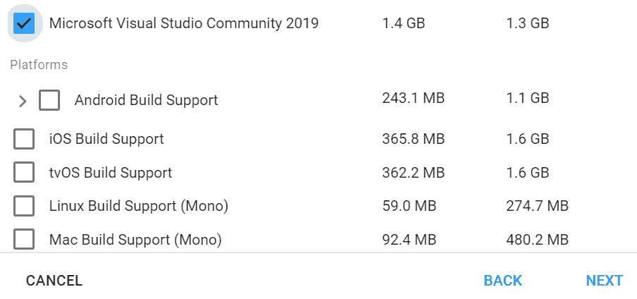
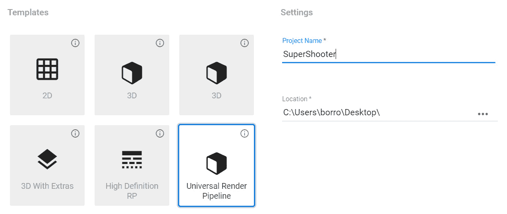
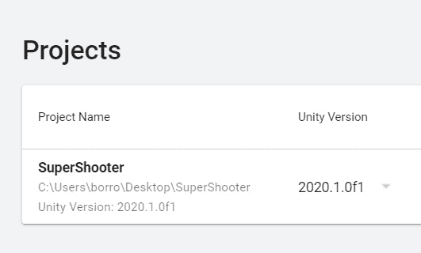
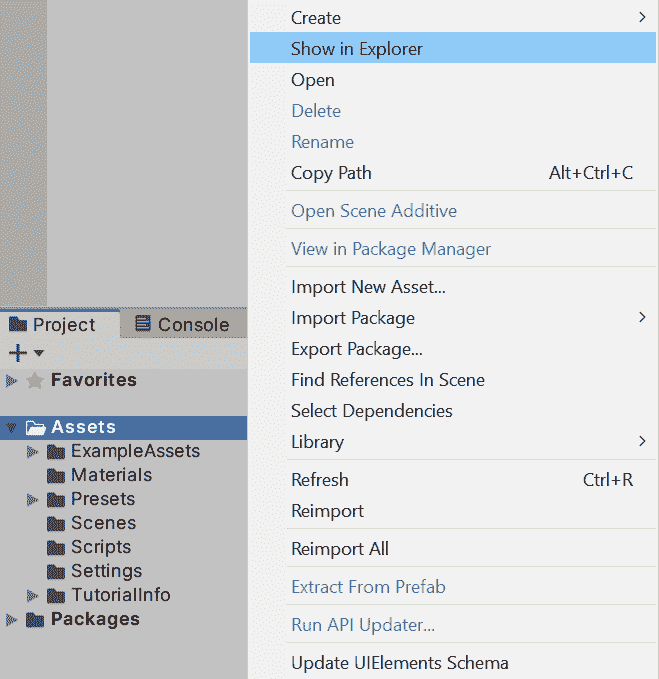

# 二、设置 Unity

在本章中，我们将了解为什么 Unity 是一个好的**游戏引擎**。 开始游戏开发职业有很多方法，所以选择合适的工具是迈出的第一步。 然后，我们将看到如何安装 Unity 和创建一个项目与 Unity 中心，一个管理不同的 Unity 安装和项目的工具，帮助我们处理他们的整个主机。

具体来说，我们将在本章中研究以下概念:

*   为什么要使用像 Unity 这样的游戏引擎?
*   安装统一
*   创建项目

让我们先谈谈为什么你应该选择 Unity 开始你的游戏开发生涯。

# 为什么要使用像 Unity 这样的游戏引擎?

当你想要创造一款游戏时，你便拥有多种方法去实现这一目标，并且每种方法都具有各自的优缺点。 在本节中，我们将讨论其原因，概述之前和当前的行业状态，并具体了解以下概念:

*   过去和现在的行业洞察力
*   游戏引擎
*   积极的团结

## 过去和现在的行业洞察

一开始，用户挣扎于设备，资源有限，游戏设计简单。 随着行业的发展，硬件变得比以前更强大，游戏也比以前更复杂。 一款大型 AAA 游戏需要将近 200 名开发者，致力于游戏的不同领域。 这些角色都需要多年的经验，所以制作游戏是一项昂贵且有风险的任务:你永远不知道一款游戏会获得成功还是只是在浪费金钱。 由于这些原因，一个人很难制作出一款完整的游戏。

重要提示:

AAA 级游戏是由许多在大公司工作的人创造的，这通常需要花费数百万美元。 也有 AA 游戏，这意味着团队规模和预算的差异。

在过去，程序员需要学习如何使用各种工具来解决不同的游戏开发问题。 一些工具不再得到其创建者的支持，留下了未解决的bug 和特性。 正因为如此，大公司开始雇佣高技能的开发者去创造所有这些工具，也就是所谓的游戏引擎。 我们回顾一下这是什么。

## 游戏引擎

游戏引擎是解决游戏开发问题(游戏邦注:如音频、图像和物理问题)的一组不同的软件，但它们被设计成一起工作，并基于相同的理念运行。 这一点很重要，因为每个团队和公司都有自己的工作方式。 从零开始创造游戏引擎是一项伟大的任务，只有少数大公司能够做到这一点。 公司所创造的游戏引擎通常都是私有的，所以只有公司才能使用它们。 一些公司出售他们的发动机，但成本太高。 但是另一种获得游戏引擎的方法在几年前就出现了。

你可能听说过由 1 到 10 名开发者创造的独立游戏，但这么小的团队怎么能创造出游戏呢? 的答案是**通用**游戏引擎。 这些是游戏引擎，就像公司所创造的引擎一样，但它们的设计初衷是为每款游戏提供良好的基础，并提供可供任何游戏中的任何人使用的工具集。 这些类型的引擎造就了一代狂热的开发者，他们现在能够比以前更轻松地开发自己的游戏。 过去有很多游戏引擎公司，但现在只有少数幸存下来，Unity 是最有影响力的公司之一。 但这是为什么呢? 让我们进一步讨论这个问题。

重要提示:

其他通用引擎的例子有 Unreal Engine、Godot、Torque 和 CryEngine。

## 团结的好处

Unity 如此受欢迎有许多潜在的原因。 让我们列举其中一些，如:

*   Unity 的设计理念很简单，具有非常简单且精致的界面，以及带有少量但强大设置的工具。 这可以帮助新手在启动引擎的第一时间不会感到迷失。
*   C# 是 Unity 的编程语言，初学者和高级程序员都非常熟悉它，并且使用 C# 编写 Unity 代码的方式既时髦又容易理解。 Unity 和 C# 处理了你在其他语言中可能遇到的大多数编程问题，大大减少了你的生产时间。
*   Unity 出现在手机游戏市场时代，它的创造者投入了所有的努力去创造任何手机引擎所需要的所有功能。 在我看来，这是 Unity 发展到今天的最重要的原因之一。
*   与其他新技术,如**增强现实**(**AR)和虚拟现实**(【显示】**VR),统一了不仅扩大了使用游戏,而且应用,模拟训练,建筑可视化,汽车工业,电影,等等。 使用 Unity，你可以为广泛的行业创建应用，而且它们的使用在逐年增加。******
***   Unity 拥有一个庞大的开发者社区，他们使用 Unity 创建参考书目和教程，询问和回答问题，并为引擎创建插件。 当你开始使用 Unity 时，所有这些都很有帮助，因为你的问题的答案只是一个谷歌搜索(有时只需要几美元)。*   因为它的发展，Unity 在全球范围内有许多工作机会，比其他游戏引擎的工作机会要多，而且其中一些工作是面向初级开发者的，所以新手进入这个行业的机会很大。**

 **Unity 并不是所有的优点——它也有缺点，还有其他引擎(如 Unreal Engine 4 或 Godot)也在这些局限性上与 Unity 竞争，它们拥有比 Unity 更好的功能，但也有自己的缺点。 在我看来,选择统一或另一个引擎取决于你打算做什么,和你是用来使用的技术,但在一天结束的时候,你可以做一切你需要团结和处理任何弱点的帮助下他们的大社区。 现在我们了解了 Unity，让我们看看如何安装引擎。

# 安装 Unity

好吧; 在所有这些之后，你决定与 unity 合作——很棒的决定! 现在，我们从哪里开始? 让我们从简单但必要的第一步开始:安装 Unity。 这似乎是一个简单的第一步，但是我们可以讨论一下正确安装它的方法。 在本节中，我们将研究以下概念:

*   统一的技术要求
*   统一的版本
*   安装统一

要运行 Unity 2020，您的计算机将需要满足以下要求:

*   如果你使用 Windows，你需要 Windows 7 SP1 或更高版本，8 或 10。 Unity 将只能在这些系统的 64 位版本上运行; 没有 32 位的支持。
*   对于 Mac，你需要 macOS High Sierra 10.13 或更高版本。
*   对于 Linux，你需要 Ubuntu 16.04 或者 18.04 或者 CentOS 7。
*   您的 CPU 需要支持 64 位和 SSE2(大多数 CPU 支持它)。
*   Windows 上支持 DirectX 10(大多数现代 gpu 支持它)的显卡，Mac 上支持 Metal, Linux 上支持 Open GL 3.2+或 Vulkan。

现在我们知道了需求，让我们来讨论 Unity 版本控制系统。

## 统一版本

在之前的 Unity 版本中，我们通常只是下载特定 Unity 版本的安装程序，然后点击**Next**直到安装完成。 但当你专业地使用 Unity 时，你需要安装多个版本的 Unity，因为你将使用不同版本制作不同的项目。 你可能想知道为什么你不能在每个项目中都使用最新的 Unity 版本，但这存在一些问题。

在 Unity 的新版本中，通常会有许多关于引擎工作方式的改变，所以你可能需要重新制作许多游戏部件来升级它。 此外，你可能正在使用的插件还没有适应更新，所以这些插件将停止工作。 在我的个人项目中，我习惯做项目升级; 但是仅仅出于学习的目的，在一个有特定发布日期的项目中，可能需要花费大量时间来升级整个项目，而这可能会大大推迟发布日期。 也许你需要一个特定的特性，这个特性会对你有很大的帮助。 在这种情况下，升级的成本可能是值得的，但要考虑到大多数情况下，这种情况不会发生。

管理使用不同 Unity 版本制作的不同项目，安装和更新新的 Unity 版本等等曾经是一个巨大的麻烦，但 Unity Hub 的创建就是为了帮助我们完成这一任务，它已经成为安装 Unity 的默认方式。 让我们看看更多。

## 使用 Unity Hub 安装 Unity

Unity Hub 是你在安装 Unity 之前安装的一个小软件。 它集中了所有 Unity 项目和安装的管理。 你可以从 Unity 官方网站获得它。 下载它的步骤经常变化，但在写这本书的时候，你需要做以下几点:

1.  [unity.com](http://unity.com)。
2.  Click on the **Get started** blue button, as shown in the following screenshot:

    

    图 2.1 - Unity 站点上的 Get started 按钮

3.  Click on the **Individual** tab and on the **Get started** button under the **Personal** section, as illustrated in the following screenshot:

    

    图 2.2 -选择个人/免费许可证

4.  Click on the **Start here** button in the **New Users** section, as illustrated in the following screenshot:

    

    图 2.3 -开始下载

5.  Accept the terms and conditions, as illustrated in the following screenshot:

    

    图 2.4 -同意隐私策略

6.  执行下载的安装程序。

考虑到我们使用的是 Unity Hub 2.3.2，即撰写本书时的最新版本。 如果使用更新的版本，有些步骤可能会改变，但主要的概念通常会保留下来。 现在我们已经安装了 Unity Hub，我们必须使用它来安装一个特定的 Unity 版本。 你可以通过以下步骤做到这一点:

1.  开始团结中心。
2.  It may ask you to create a Unity account. If so, just create one and log in with that account. If not, click the person icon at the top-right part of the window and select **Sign in** to have the option to log in or create an account, as illustrated in the following screenshot:

    

    图 2.5 -登录 Unity Hub

3.  Follow the steps on the installer and then, you should see the following screen:

    

    图 2.6 - Unity Hub 窗口

4.  更新版本的 Unity 将指导你完成 Unity 安装和第一次项目创建。 在这种情况下，跳过接下来的步骤，但如果你已经安装了 Unity，请遵循它们
5.  Click on the **Installs** button and check if you have Unity 2020 listed there. If not press the **ADD** button. Make sure the latest Unity 2020 release (in my case Unity 2020.1.0f1) is selected, and then click on the **NEXT** button. Your screen may show a newer version than mine, so don't worry about that. The process is illustrated in the following screenshot:

    

    图 2.7 -选择 Unity 版本进行安装

    重要提示:

    这是我们将在第 13 章**中使用 C#*编写脚本时用到的程序。 我们现在还不需要其他的 Unity 功能，但是如果你需要的话，你可以稍后再去安装它们。*

**   A feature selection window will show up. Make sure **Microsoft Visual Studio Community** is checked. At the time of writing this book, the latest version is 2019, but a newer one could work just as well. Now, click the **NEXT** button. The process is illustrated in the following screenshot:

    

    图 2.8 -选择 Visual Studio

    *   Accept Visual Studios terms and conditions, as illustrated in the following screenshot:

    

    图 2.9 -接受 Visual Studio 的条款和条件

    *   You will see the selected Unity version downloading and installing in the list. Wait for this to finish. In the following screenshot, you will see that I have other Unity versions installed, but you will only be seeing one version, which is fine:

    

    图 2.10 -我的机器上目前所有的 Unity 安装

    *   在 Unity 完成安装后，Visual Studio 安装程序将自动执行。 它将下载一个安装程序，下载并安装 Visual Studio Community 2019，如下截图所示:*

 *

图 2.11 -安装 Visual Studio

记住，前面的步骤在新的 Unity 版本中可能会有所不同，所以你可以尝试着遵循 Unity 设计的流程—-大多数时候，这是很直观的。 现在是使用 Unity 创建项目的时候了。

# 创建项目

现在我们已经安装了 Unity，我们可以开始制作游戏了。 为此，我们首先需要创建一个项目，即包含所有游戏文件的文件夹。 这些文件被称为素材，并且有不同类型的素材，如图像、音频、3D 模型、脚本文件等等。 在本节中，我们将看到如何管理一个项目，处理以下概念:

*   创建一个项目
*   项目结构

## 创建项目

与 Unity 安装一样，我们将使用 Unity Hub 来管理项目。 我们需要遵循以下步骤来创建一个:

1.  Open Unity Hub and click on the **Projects** button, and then click on **NEW**, as illustrated in the following screenshot:

    

    图 2.12 -在 Unity Hub 中创建一个新项目

2.  Pick the **Universal Render Pipeline** template, then a project name and a location, and hit **Create**. We will be creating a 3D game with simple graphics, prepared to run on every device Unity can be executed on, so the **Universal Render Pipeline** (or **URP**) is the better choice for that. In [*Chapter 6*](06.html# _idTextAnchor098)*, Materials and Effects with URP and Shader Graph*, we will be discussing exactly why. The process can be seen in the following screenshot:

    

    图 2.13 -选择通用渲染管道模板

    重要提示:

    尝试把项目放在 Dropbox，谷歌驱动器，或任何云同步文件夹，以确保你总是有项目在手。 这个项目将会增长，所以请确保该文件夹中有足够的空间。 如果你没有足够的空间在你的主机服务，跳过这个。 如果您知道如何使用 Git，那将是一个更好的选择。

3.  Unity will create and automatically open the project. This can take a while, but after that, you will see a screen similar to the one shown in the following screenshot:

    

    图 2.14 - Unity Editor 窗口

4.  尝试关闭窗口并再次打开，然后回到 Unity Hub 并从列表中选择项目，如下所示:

图 2.15 -重新打开项目

现在我们已经创建了这个项目，让我们来探索它的结构。

## 项目结构

我们刚刚打开了 Unity，但我们要等到下一章才会开始使用它。 现在，我们来看看项目文件夹结构是如何组成的。 为此，我们需要打开创建项目的文件夹。 如果你不记得这是在哪里，你可以做以下:

1.  右键单击位于编辑器底部的**Project**面板中的**Assets**文件夹。
2.  单击**显示在资源管理器**选项。 如果你使用的是 Mac，这个选项叫做**Reveal in Finder**。 下面的截图说明了这一点:

图 2.16 -在 Explorer 中打开项目文件夹

然后，你会看到下面的文件夹结构:

图 2.17 - Unity 项目的文件夹结构

如果任何时候你想把这个项目转移到另一台电脑上或发送给同事，你可以把所有这些文件压缩成 ZIP 文件发送给他们，但并不是所有的文件夹都是必要的。 重要的文件夹是**素材**、**包**和**项目设置**。 **Assets 文件夹**将包含我们将为游戏创建和使用的所有文件，所以这是必须的。 我们还将配置不同的 Unity 系统来调整引擎以适应我们的游戏。 所有相关的设置都在**项目设置**文件夹中。 最后，我们将安装不同的 Unity 模块或包来扩展其功能，所以**packages**文件夹将保存我们正在使用的包，以便 Unity 能够意识到这一点。 如果您需要将项目移到其他地方，则不需要复制其余的文件夹，但至少让我们讨论一下**Library**文件夹是什么。

Unity 需要将我们将要使用的文件转换成它自己的格式以便操作，例如音频和图形。 团结支持**MPEG 音频第三层**(**MP3**),**波形音频文件格式【显示】(****WAV),**便携式网络图形【病人】(****PNG),和**联合摄影专家组【t16.1】(****JPG)文件(更多),但在使用它们之前, 它们需要转换成 Unity 的内部格式。 这些转换后的文件将在**Library**文件夹中。 如果你复制的项目没有这个文件夹，Unity 会简单地将**Assets**文件夹中的原始文件全部重新创建**Library**文件夹。 这个过程需要时间，项目越大，需要的时间就越多。******

考虑你想要创建的所有文件夹统一当你参与这个项目,所以不要删除任何而这样做,但是如果你需要移动整个项目,现在你知道你需要什么。

# 总结

在本章中，我们讨论了为什么 Unity 是创造游戏的好工具，并将其与市场上的其他引擎进行了比较。 这一分析旨在帮助你选择 Unity 作为第一款游戏开发工具。 在那之后，我们还回顾了如何使用 Unity Hub 安装和管理不同的 Unity 版本，最后，我们看到了如何使用同一个工具创建和管理多个项目。 我们会经常使用 Unity Hub，所以知道如何使用它是很重要的。 现在，我们准备进入 Unity 编辑器。

在下一章中，我们将开始学习基本的 Unity 工具来创建我们的第一级原型。***