# *第三章*:使用场景和游戏对象

欢迎来到这本书的第三章——这里就是辛勤工作的开始! 在本章中，我们将开发一些 Unity 的基础知识，以便编辑一个项目。 我们将看到如何使用几个 Unity Editor 窗口来操作我们的第一个场景和它的对象。 此外，我们将学习如何创建和组成一个对象或游戏对象，以及如何管理复杂的场景与多个对象使用层次结构和预制件。 最后，我们将回顾如何正确地保存所有工作，以便以后继续进行工作。

具体来说，我们将在本章中研究以下概念:

*   操作场景
*   GameObjects 和组件
*   对象层次结构
*   预制
*   保存场景和项目

# 操作场景

一个**场景**是我们项目中几种文件(也称为**资产**)中的一种。 根据项目类型或公司的工作方式，场景可能意味着不同的内容，但最常见的用例是将游戏划分为多个部分，最常见的情况如下:

*   主菜单
*   1 级，2 级，3 级…，N 级
*   胜利画面，失败画面
*   启动画面，加载画面

在本节中，我们将涵盖以下与场景相关的概念:

*   场景的目的
*   场景视图
*   我们的第一个 GameObject
*   导航场景视图
*   操纵 GameObjects

## 场景的目的

将游戏划分为多个场景的理念是，你只需要处理和加载场景所需的数据; 所以,如果你是在主菜单,您将只有纹理,音乐,和对象特定场景 needs-there 不需要有 10 级老板**随机存取内存中加载的**(**RAM)如果你现在不需要它。 这就是为什么存在加载屏幕，只是为了填补从卸载一个场景所需的资产到加载另一个场景所需的资产之间的时间。 也许你认为开放游戏,比如**侠盗猎车手【显示】(**GTA)没有加载屏幕时世界上闲逛,但他们实际上是装卸块移动世界的背景, 这些块是不同的场景，它们被设计成相互连接。******

 **主菜单和普通关卡场景之间的区别在于它们所拥有的对象(也称为“游戏对象”)。 在菜单中，你可以找到背景、音乐、按钮和徽标等对象，而在关卡中，你可以找到玩家、敌人、平台、生命值箱等等。 所以，这取决于你和你放入场景中的 GameObjects 来决定场景对你的游戏意味着什么。

但是我们如何创造一个场景呢? 让我们从场景视图开始。

## 场景视图

当你打开一个 Unity 项目时，你会看到 Unity 编辑器。 它将由几个窗口或**面板**组成，每个窗口或面板将帮助你改变游戏的不同方面。 在本章中，我们将看到帮助你创建场景的窗口。 Unity 编辑器如下截图所示:

图 3.1 - Unity 编辑器

如果你曾经设定任何类型的应用程序之前,你可能习惯于一个起始函数,如主要**,在那里您开始编写代码来创建一些对象所需的应用程序,如果我们谈论的是游戏,你可能为这里的场景创建的所有对象。 这种方法的问题是，为了确保正确创建所有对象，您将需要运行程序来查看结果，如果有什么东西放错了位置，您将需要手动更改对象的坐标，这是一个缓慢而痛苦的过程。 幸运的是，在 Unity 中，我们拥有**Scene**视图，如下截图所示:**

 **

图 3.2 -场景视图

这个窗口是经典的**WYSIWYG(所见即所得)**概念的实现。 在这里，你可以创建对象并将其放置在整个场景中，通过场景预视，你可以看到当你点击**Play**时场景的样子。 但是在学习如何使用这个场景之前，我们需要在场景中有一个对象，所以让我们创建我们的第一个对象。

## 我们的第一个游戏对象

Unity**Universal Render Pipeline**(**URP**)模板带有施工现场测试场景，但是让我们创建自己的空场景来开始探索这个新概念。 要做到这一点，你可以简单地使用**文件**|**新场景**菜单选项来创建一个空的新场景，如下截图所示:

图 3.3 -创建一个新场景

我们将在本书中学习几种创建游戏对象的方法，但现在，让我们开始使用一些 Unity 提供给我们的基本模板。 为了创建它们,我们需要打开**GameObject**菜单顶部的统一窗口,它会告诉我们一些模板类别,如 3 d 对象,****2 d 对象**,****影响,等等,见以下截图:**

图 3.4 -创建多维数据集

**下的**3 d 对象的类别,我们将看到一些 3 d 元素如立方体**、**,**缸**,等等,而使用它们并不是令人兴奋的下载使用漂亮的 3 d 模型,记住我们的原型,也称为 gray-boxing。 这意味着我们将使用大量原型基本形状来建模我们的关卡，这样我们就可以快速测试它，看看我们的想法是否足够好，以便开始将其转化为最终版本的复杂工作。****

 ****我建议你选择**Cube**对象作为开始，因为它是一个可以代表许多对象的通用形状。 所以，现在我们有一个场景，有一个对象来编辑，我们需要做的第一件事是学习如何在场景中导航。

## 场景视图导航

为了操作一个场景，我们需要学习如何通过它来从不同的视角查看结果。 有几种导航方式，所以让我们从最常见的一种开始:第一人称视图。 这种视图允许你使用第一人称射击类导航，使用鼠标和*WASD*键在场景中移动。 要实现这样的导航，你需要按住鼠标右键，在此过程中，你可以移动鼠标旋转相机，并按*WASD*键移动相机。 您也可以按*Shift*快速移动，按*Q*和*E*键上下移动。

移动的另一个常见的方法是点击一个对象以选中它(选中的对象将有一个橙色大纲),然后按*F 键焦点,使现场相机立即进入一个位置我们看对象更密切。 之后,我们可以按住左边*Alt 键和鼠标左键,并移动鼠标,“轨道”对象,看不同角度检查每一部分是妥善放置,见以下截图:**

 *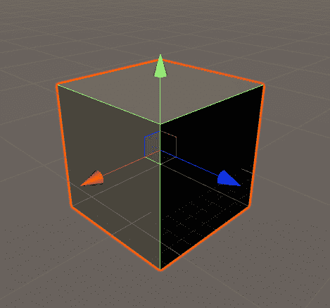

图 3.5 -选择对象

现在我们可以在场景中自由移动，我们可以开始使用场景视图来操纵游戏对象。

## 操作游戏对象

场景视图的另一个用途是操纵对象的位置。 为了做到这一点，我们首先需要选择一个对象，然后按下键盘上的*Y*键或 Unity Editor 左上角右移第 6 个按钮，如下截图所示:

图 3.6 -更改转换工具

这将显示被称为**变换 Gizmo**的对象，这允许我们改变的位置、旋转和对象的比例，如下面的截图所示:

图 3.7 - Transform Gizmo

让我们开始翻译对象，这是通过拖动 Gizmo´s 球体中的红色、绿色和蓝色箭头来完成的。 当您这样做时，您将看到对象将如何沿着所选轴移动。 这里要探讨的一个有趣的概念是箭头颜色的含义。 如果你注意场景视图的右上方区域，你会看到一个坐标轴 Gizmo，用来提醒那些颜色的含义，如下截图所示:

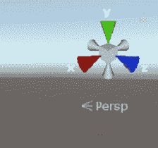

图 3.8 -轴小座标

计算机图形学使用经典的三维**笛卡儿坐标系**来表示物体的位置。 红色与物体的*x*轴相关联，绿色与*y*轴相关联，蓝色与*z*轴相关联。 但是每个轴代表什么呢? 如果你来自另一个 3 d 编写程序,这可以不同,但在统一,*z 轴(蓝色)代表了**向量【病人】,,这意味着箭头指向对象的前面; *x*轴为**右矢**，*y*轴为**上矢**。 考虑这些轴是**局部的**，这意味着如果你旋转物体，它们将改变它们的朝向，因为物体的方向改变了物体的朝向。 如果有必要，Unity 可以用**全局**坐标显示这些轴，但是现在，让我们继续使用局部坐标。***

为了确保我们使用的是局部坐标，请确保激活**局部**模式，如下截图所示:

图 3.9 -在主坐标和局部坐标之间切换

如果您看到**全局**而不是**本地**作为右键，只需点击它，它就会改变。 顺便说一下，试着把左边的按钮保持为**Pivot**。 如果显示**中心**，只需点击更改即可。

我知道我们正在编辑一个立方体，所以没有明确的正面或右侧，但当你处理真正的 3D 模型时，比如汽车和角色，它们肯定会有这些边，而且它们必须正确地与这些轴对齐。 如果在未来你将一辆汽车导入 Unity，并且汽车的前部指向红色轴(X)，你就需要修正这一问题，因为我们未来的移动代码将依赖于这一约定，但让我们将其保留到以后。

现在，让我们使用 Transform Gizmo 来旋转物体，使用围绕它的三种颜色的圆圈。 如果您单击并拖动，例如，红色圆圈，您将沿*x*旋转轴旋转该对象。 下面是另一个值得考虑的有趣提示。 如果你想要基于我们之前讨论过的颜色编码水平地旋转物体，你可能会选择*x*轴——用于水平移动的轴——但是，遗憾的是，这是错误的。

观察旋转的一个好方法就像自行车的加速器:你需要拿着它滚动它。 如果您像这样旋转*x*轴，您将上下旋转该对象。 因此，为了水平旋转，您需要使用绿色圆圈或*y*轴。 这个过程如下图所示:

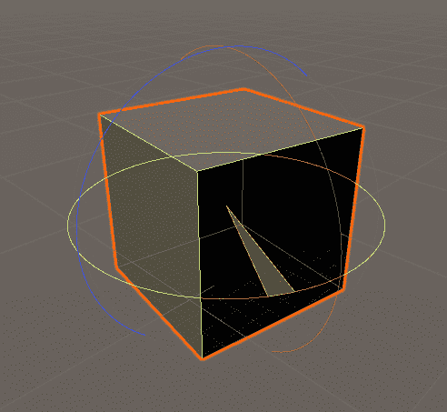

图 3.10 -旋转物体

最后，我们有缩放，这是通过 Transform Gizmo 球体外部的彩色立方体来完成的。 如果你点击并拖动这些，你会看到我们的立方体是如何在这些轴上拉伸的，允许你改变对象的大小。 此外，在小座标的中心将有一个灰色立方体，它允许你沿所有轴均匀地改变物体的大小。 这个过程如下图所示:

图 3.11 -缩放对象

记住，在许多情况下缩放对象通常是一种糟糕的做法。 在你的场景的最终版本中，你将使用适当大小和比例的模型，它们将以模块化的方式设计，以便你可以将它们一个接一个地插入。 如果你缩放它们，可能会发生一些不好的事情，比如纹理被拉伸和像素化，以及模块无法正常插入。 有一些例外,比如放置大量的实例相同的树在森林和改变其规模略模拟变化,而且,在 gray-boxing 的情况下,它是非常好的数据集和改变规模创造地板,墙壁,天花板,列,等等,因为在最后, 这些立方体将被真正的 3D 模型所取代。

挑战

创建一个由地板、三面墙和第四面墙(三个立方体)组成的房间。 在下面的截图中，你可以看到它应该是什么样子:

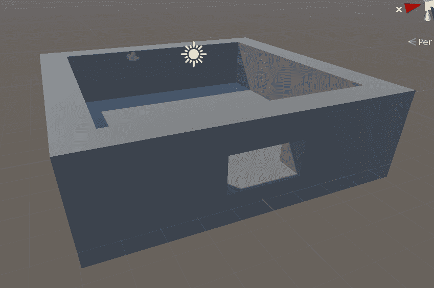

图 3.12 -房间任务完成

现在我们可以编辑对象的位置，让我们看看如何编辑它的所有其他方面。

# 游戏对象和组件

我们说过我们的项目是由资产组成的，场景(一种特定类型的资产)是由游戏对象组成的; 那么，如何创建一个对象呢? 通过组成**组分**。

在本节中，我们将涵盖以下与组件相关的概念:

*   组件
*   操作组件

## 组件

**组件**是游戏物体的若干组成部分之一; 每个人负责物体的不同特征。 有几个组件可以解决不同的任务，比如播放声音，渲染网格，应用物理等等，即使 Unity 有大量的组件，我们迟早还是需要创建自定义组件。 在下面的截图中，你可以看到当我们选择一个游戏对象时 Unity 所显示的内容:

图 3.13 - Inspector 面板

在前面的截图中,我们可以看到**检查员**面板中,如果我们需要猜出这是个什么东西,现在我们可以说它是显示所有所选对象的属性,我们可以配置他们改变对象的行为,如位置和旋转,是否将项目的阴影,等等。 这是对的，但我们缺少了一个关键元素:那些属性不属于对象; 它们属于物体的组成部分。 我们可以在一组属性前看到一些粗体标题，例如**Transform**和**Box Collider**，等等。 这些是物体的组成部分。

在这种情况下,我们的对象有一个**变换**,**网过滤**,**网格渲染器**,和**框对撞机组件,所以让我们回顾每个其中之一。 **Transform**只有位置信息，比如物体的位置、旋转和比例，它本身没有任何作用——它只是游戏中的一个点，但当我们添加组件到物体上时，这个位置开始有更多的意义。 这是因为一些组件将与**Transform**和其他组件交互，每个组件相互影响。**

一个例子是**网格过滤器**和**网格渲染器**，它们都负责渲染一个 3D 模型。 **网格渲染器将呈现中指定的网**筛网过滤器中指定位置的变换组件,所以【显示】**网格渲染器需要数据从其他组件和不能没有工作。 另一个例子是**盒碰撞器**。 这表示对象的物理形状，因此当物理计算对象之间的碰撞时，它会根据 Transform 中指定的位置检查该形状是否与其他形状发生碰撞。**

 **我们现在不想探索物理和渲染。 GameObject 是一组组件的集合，每个组件向我们的对象添加一个特定的行为，每个组件与其他组件交互以完成所需的任务。 为了进一步强化这一点，让我们看看如何利用物理原理将立方体转换成球体。

## 操作组件

编辑对象组件的工具是**检查器**。 它不仅允许我们更改组件的属性，还允许我们添加和删除组件。 在本例中，我们希望将立方体转换为球体，因此我们需要更改这些组件的几个方面。 我们可以从改变物体的视觉形状开始，所以我们需要改变渲染模型或**网格**。 指定要渲染的网格的组件是**MeshFilter**组件。 如果我们观察它，我们可以看到一个**Mesh**属性，它的名称是**Cube**，并且它的右边有一个圆点。

重要提示

如果您没有看到任何属性，比如我们刚才提到的 Mesh，请尝试单击组件名称左侧的三角形。 这样做将展开和折叠组件的所有属性。 下面的截图说明了这一点:

图 3.14 -禁用组件

如果我们点击它，会弹出**Select Mesh**窗口，允许我们选择几个 Mesh 选项; 因此，在本例中，选择**Sphere**组件。 在未来，我们将添加更多的 3D 模型到我们的项目，这样窗口将有更多的选项。 网格选择器如下截图所示:

图 3.15 -网格选择器

它看起来像一个球体，但它能表现得像球体吗? 让我们找出答案。 为了做到这一点，我们可以在球体上添加一个**刚体**组件，这将为它添加物理。 为此，我们需要单击**Inspector**底部的**Add Component**按钮。 它将显示一个带有许多类别的**Component Selector**窗口，在本例中，我们需要点击**Physics**类别。 窗口将显示所有的物理组件，在那里我们可以找到**刚体**。 另一个选项是在窗口顶部的搜索框中键入**刚体**。 下面的截图演示了如何添加组件:

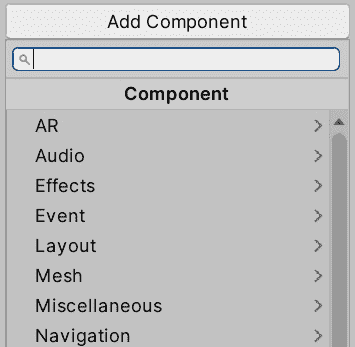

图 3.16 -添加组件

如果你点击编辑器顶部中部的 Play 按钮，你可以使用**Game**面板测试你的球体物理性能。 当你点击 Play 时，面板会自动聚焦，并向你展示玩家如何看待游戏。 这里可能发生的一个问题是，你可能看不到任何东西，如果游戏摄像机没有指向我们的球体所在的位置，就可能发生这种情况。 回放控件如下截图所示:

图 3.17 -回放控制

在这里，你可以使用 Transform Gizmo 旋转和定位你的相机，使其看着我们的球体。 当你移动时，你可以查看场景窗口右下角的小预览来查看新的相机视角。 另一个方法是选择**层次结构中的相机和使用快捷键*Ctrl +*+【T7 转变】F【显示】(*或*命令+*【病人】+*转变 F*Mac)。 摄像头预览如下截图所示:*****

图 3.18 -相机预览

现在，为了测试物理碰撞是否正确执行，让我们创建一个立方体，缩放它，直到它有一个斜坡的形状，并将斜坡放在球体下面，如下所示:

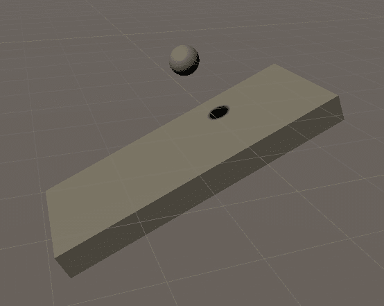

图 3.19 -球和斜坡物体

如果你现在点击 Play，你会看到球体以一种奇怪的方式与斜坡碰撞。 它看起来像在弹跳，但事实并非如此。 如果展开**框对撞机**领域组件,您将看到,即使我们的目标看起来像一个球体,绿箱子小发明是向我们展示我们的球体是一盒在物理世界中,见以下截图:

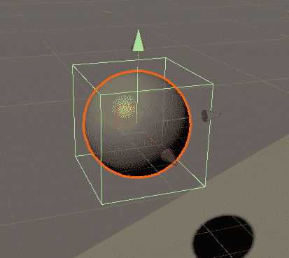

图 3.20 -球体图形和盒碰撞器

如今,视频卡可以处理呈现高度详细的模型(与高多边形计数),但物理系统**中央处理单元中执行**(**CPU)和它需要做复杂的计算以检测碰撞。 得到体面的表现我们的游戏**(至少 30 帧每秒**(**【显示】FPS))物理系统的工作原理使用简化碰撞形状可能不同于实际形状的玩家在屏幕上看到。 这就是为什么我们有**Mesh Filter**和不同类型的 Collider 组件分离-一个处理视觉形状，另一个处理物理形状。

再次强调，本节的主旨并不是深入探究那些 Unity 系统，所以我们现在就继续吧。 我们如何解决这个问题? 简单:通过修改我们的组件! 在本例中，**BoxCollider**只能表示一个框形，不像**MeshFilter**，它支持任何形状。 因此，首先，我们需要通过右键单击组件的标题并选择**remove component**选项来删除它，如下面的截图所示:

图 3.21 -拆卸部件

现在，我们可以再次使用**Add Component**菜单来选择**Physics**组件，这一次选择**Sphere Collider**组件。 如果你看看物理组件,您将看到其他类型的对撞机,它可以用来表示其他形状,但我们将看看他们在[*第 15 章【显示】*](15.html#_idTextAnchor194)*,物理碰撞和卫生系统*。 **球体碰撞器**组件如下截图所示:

图 3.22 -添加一个球体碰撞器组件

如果你点击 Play，你会看到我们的球体不仅看起来像球体，而且表现得也像球体。 记住:这部分书的主要思想是理解在 Unity 中，你可以通过添加、删除和修改组件来创建任何你想要的对象，我们将在整个书中做很多这方面的工作。

现在，组件并不是创建对象所需要的唯一东西。 复杂的对象可能由几个子对象组成，所以让我们看看这是如何工作的。

# 对象层次结构

一些复杂的对象可能需要划分为子对象，每个子对象都有自己的组件。 这些子对象需要以某种方式附加到主对象上，并共同创建必要的对象行为。

在本节中，我们将涵盖以下与组件相关的概念:

*   教育的对象
*   可能的用途

## 对象的养育

**教养**包括使一个对象成为另一个对象的子对象，这意味着这些对象将相互关联。 其中一种类型的关系是**Transform 关系**，这意味着子对象将受到父对象的 Transform 的影响。 简单地说，子对象将跟随父对象，就像它附加在父对象上一样。 举个例子，想象一个玩家头上戴着一顶帽子。 帽子可以是玩家头部的孩子，使帽子在连接时跟随头部。

为了做到这一点，让我们创造一个代表敌人的胶囊和一个代表敌人武器的立方体。 记住，为了做到这一点，你可以使用**GameObject**|**3D Object**|**Capsule**和**Box**选项。 下面的截图中可以看到一个示例胶囊:

图 3.23 -一个胶囊代表一个人，盒子代表一个武器

如果你移动敌人的物体(胶囊)，武器(盒子)将保持它的位置，而不是跟随我们的敌人。 所以，为了防止这种情况，我们可以在**层级**窗口中简单地将武器拖到敌人对象上，如下截图所示:

图 3.24 -在胶囊角色上养育立方体武器

现在，如果你移动敌人，你会看到大炮移动，旋转，并且随着它的移动而缩放。 所以，基本上，火炮转换也有敌人转换组件的效果。

现在我们已经完成了一些基本的育儿方法，让我们来探索其他可能的用途。

## 可能的用途

除了创建复杂的对象，育儿还有其他一些用途。 它的另一个常见用法是组织项目层次结构。 现在，我们的场景很简单，但随着时间的推移，它会增长，所以跟踪所有对象将变得困难。 所以，为了防止这种情况，我们可以创建空的游戏对象(在**GameObject**|**create empty**中)作为容器，将对象放入其中来组织我们的场景。 尽量谨慎地使用它，因为如果滥用它，会造成性能损失。 一般来说，在组织一个场景时，有一个或两个层次的父母是好的，但超过这可能会有一个表演的冲击。 考虑到您能够——而且将会——对复杂对象的创建有更深层次的养育; 提出的限制仅用于场景组织。

为了继续完善我们之前的例子，我们可以在场景中多次复制敌人，创造一个名为**Enemies**的空游戏对象，并将所有敌人拖到其中，使其成为一个容器。 下面的截图说明了这一点:

图 3.25 -将敌人分组在父对象中

育儿的另一个常见用法是改变**轴心**或物体的中心。 现在，如果我们尝试用 Transform Gizmo 旋转我们的枪，它会绕着它的中心旋转，因为那个立方体的创造者决定把中心放在那里。 通常情况下，这是可以的，但让我们考虑一下这种情况，我们需要让武器瞄准敌人的视线。 在这种情况下，我们需要围绕武器手柄旋转武器; 所以，在这种“盒子”武器的情况下，它是离敌人最近的一端。 这里的问题是,我们不能改变一个物体的中心,一个解决方案是创建另一个“武器”三维模型或网格与另一个中心,这将导致大量的复制版本的武器如果我们考虑其他可能的游戏需求,如旋转武器皮卡。 我们可以通过教育来轻松解决这个问题。

我们的想法是创建一个空的 GameObject，并将其定位到我们希望对象的新枢轴所在的位置。 在那之后，我们可以简单地将武器拖到这个空的 GameObject 中，并且从现在开始，将这个空的对象视为真正的武器。 如果你旋转或缩放这个武器容器，你会看到武器网格将在这个容器周围应用这些转换，所以我们可以说武器的枢轴发生了变化(实际上并没有，但我们的容器模拟了这种变化)。 这个过程如下图所示:

图 3.26 -改变武器支点

现在，让我们继续，看看管理游戏对象的不同方法，这次使用的是 Prefabs。

# 预制件

在前面的例子中，我们在场景周围创造了许多敌人的副本，但是在这样做的时候，我们创造了一个新的问题。 假设我们需要改变我们的敌人并添加一个**刚体**组件，但是因为我们有多个相同物体的副本，所以我们需要将它们一个一个地添加到所有的副本中。 也许之后，我们需要改变每个敌人的质量，所以，我们需要检查每个敌人并做出改变，我们可以开始看到一个模式。

一个解决方案可以选择所有敌人使用*Ctrl 键(*选择*Mac)和修改它们,但这解决方案不会对任何使用如果有敌人在其他场景副本。 所以，这就是预制构件的作用。*

在本节中，我们将涵盖以下与预制件相关的概念:

*   创建预制
*   Prefab-instance 关系
*   组合式变体

## 创建预制件

**预制件**是一种 Unity 工具，它允许我们将自定义对象(如我们的敌人)转换为定义如何创建它们的资产。 我们可以使用它们轻松地创建自定义对象的新副本，而不需要重新创建其组件和子对象。

为了创建一个预制件，我们可以简单地将我们的自定义对象从**Hierarchy**窗口拖动到**Project**窗口，这样做之后，你将在项目文件中看到一个新的资产。 **项目**窗口可以导航和浏览所有项目文件; 所以，在这种情况下，我们的预制是我们创建的第一个资产。 现在，你可以简单地把预制件从**项目**窗口拖到场景中，轻松地创建新的预制件副本，如下截图所示:

图 3.27 -创建预制构件

现在，我们有个小问题。 如果你注意**等级**窗口，你会看到原来的预制对象和所有新副本的名称都是蓝色的，而在预制之前创建的敌人的名称将是黑色的。 名称中的蓝色表示该对象是预制件的**实例**，这意味着该对象是基于预制件创建的。 我们可以选择那些蓝色的命名对象，并单击**Inspector**中的**select**按钮，选择创建该对象的原始预制。 下面的截图说明了这一点:

图 3.28 -在层次结构中检测预制构件

所以，这里的问题是，之前的 Prefab 副本并不是原始 Prefab 的实例，遗憾的是，我们没有办法将它们与 Prefab 连接起来。 因此，为了使发生，我们需要简单地销毁旧副本，并用用预制件创建的副本替换它们。 首先，不拥有所有的副本作为实例似乎不是一个问题，但它将在本章的下一节，我们将探讨预制和他们的实例之间的关系。

## 预制-实例关系

一个预制件的实例具有一个到该预制件的绑定，该绑定有助于在它们之间轻松地恢复和应用更改。 如果你预制和做一些修改,这些修改将自动适用于所有幕后的所有实例项目,所以我们可以很容易地创建一个预制的第一个版本,使用它在项目,然后尝试改变。

为了实践这一点，让我们假设我们想要添加一个**刚体**组件到敌人，这样他们就可以倒下。 为了做到这一点，我们可以简单地双击预制文件，然后进入预制编辑模式，在这里我们可以编辑与场景其他部分隔离的预制。 在这里，我们可以简单地获取 Prefab 根对象并添加**Rigidbody**组件。 之后,我们可以简单地点击**画面左上角的**按钮【T6 场景】窗口回到现场我们编辑,现在,我们可以看到,所有的敌人的组合式实例有一个【显示】Rigidbody 组件,如以下截图:

图 3.29 -预制编辑模式

现在，如果我们改变一个 Prefab 实例会发生什么呢? 假设我们想让一个特定的敌人飞起来，这样他们就不会受到重力的影响。 我们可以简单地选择特定的预制件，取消**刚体**组件中的**Use Gravity**复选框。 这样做之后，如果我们玩游戏，我们将看到只有那个特定的实例会浮动。 这是因为一个预制的实例的变化成为一个**覆盖**,,我们可以清楚地看到,如果你看看**使用【显示】**重力**属性的实例变得大胆**检查员【病人】。 让我们取另一个对象，并更改其**Scale**属性使其更大。 同样，我们将看到**Scale**属性如何变得粗体，并且在其左侧有一个小条。 **使用重力**复选框如下截图所示:****

图 3.30 -使用重力突出显示作为覆盖

覆盖优先于预制件，所以如果我们改变原始预制件的比例，拥有比例覆盖的那个将不会改变，保持它自己的比例版本，如下截图所示:

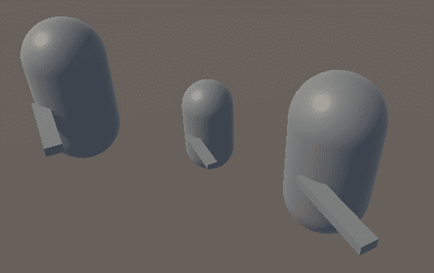

图 3.31 -一个带有缩放覆盖的 Prefab 实例

我们可以使用**检查器**中的**overrides**下拉框轻松定位一个实例的所有覆盖，定位对象的所有更改。 它不仅允许我们查看所有的覆盖，而且还恢复我们不想要的覆盖，并应用我们想要的覆盖。 让我们说，我们后悔缺乏重力的具体预制-没有问题! 我们可以找到覆盖并恢复它。 这个过程如下图所示:

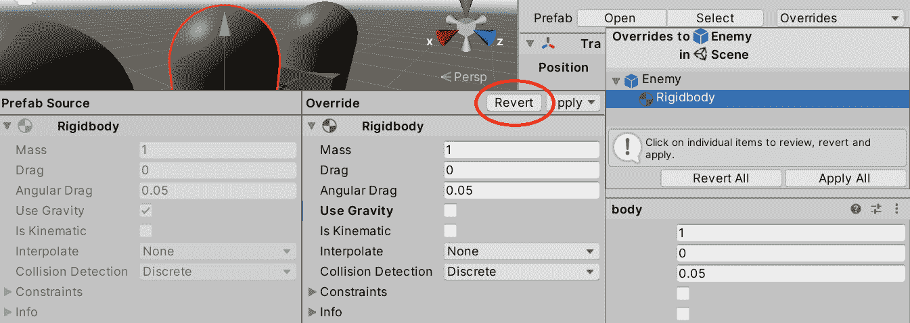

图 3.32 -恢复单个覆盖

另外，让我们假设我们真的很喜欢该实例的新规模，所以我们希望所有实例都具有该规模——太棒了! 我们可以简单地点击**Apply**按钮，选择特定的更改，所有实例都将具有该比例(除了带有覆盖的)，如下面的截图所示:

图 3.33 - Apply 按钮

此外，我们还有**Revert All**和**Apply All**按钮，但使用时要小心，因为您可以轻松地还原和应用您不知道的更改。

所以，正如你所看到的，Prefab 是一个非常有用的 Unity 工具，它可以跟踪所有类似的对象，并对所有对象进行更改，还可以拥有具有少量变化的特定实例。 谈论变化,在其他情况下,你会想要几个实例的预制相同的变化作为一个例子,飞行的敌人和敌人而是接地如果你认为,我们会有相同的问题当我们不使用预制时, 所以我们需要手动逐个更新这些不同的版本。

在这里，我们有两个选择:一是创造一个全新的 Prefab，只是拥有另一个带有该变体的版本。 这便引出了一个问题，即如果我们希望所有类型的敌人都受到改变，我们便需要手动将改变应用于每个可能的预制件。 第二种选择是创建一个 Prefab 变体。 让我们回顾一下后者。

## 预制变型

**预制件**是在现有预制件的基础上创建一个新的预制件，因此新预制件**继承了**基础预制件的特征。 这意味着我们的新预制件可能会与基础预制件有所不同，但它们的共同点仍然是相通的。

为了说明这一点，让我们创造一个能够飞行的敌人预制组件的变体:飞行的敌人预制组件。 为了做到这一点,我们可以选择一个已存在的**中的敌人预设实例层次**窗口中,命名为**飞行敌人,并拖动一遍**项目**窗口,而这一次我们将看到一个提示,问哪一种组合式我们想创建。 这次我们需要选择**预制件**，如下截图所示:**

 **

图 3.34 -创建预制变体

现在，我们可以通过双击它进入变体的预制编辑模式，然后添加一个立方体作为我们的敌人的喷气背包，并取消敌人的**使用重力**属性。 如果我们回到场景中，我们将看到变体实例被改变，而基础敌人没有改变。 你可以在下面的截图中看到:

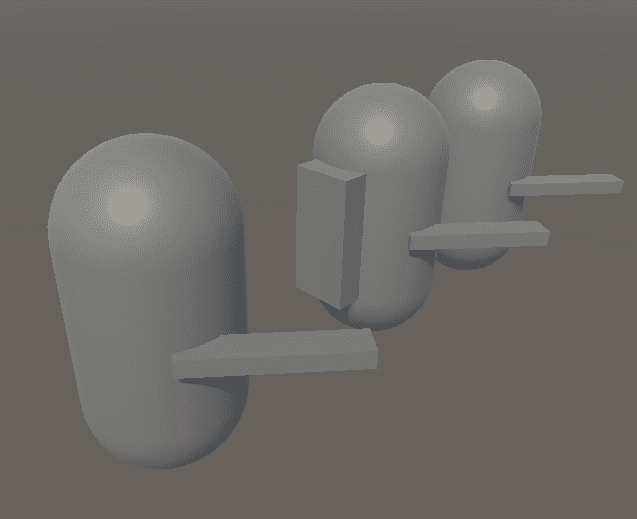

图 3.35 -预制变量实例

现在，想象一下你想给我们所有类型的敌人添加一个帽子。 我们可以通过双击基本敌人 Prefab 进入预制编辑模式，并添加一个立方体作为帽子。 现在，我们将看到这个改变适用于所有敌人，因为记住:**飞行敌人**预制是基础敌人预制的变体，这意味着它将继承基础敌人预制的所有变化。

到目前为止，我们已经创造了许多内容，但如果我们的 PC 因为某些原因关闭了，我们肯定会失去所有内容，所以让我们看看如何保存我们的进度。

# 保存场景和项目

就像在其他项目中一样，我们需要保存我们的进展。 这里的不同之处在于，我们并不是只有一个包含所有项目资产的巨型文件，而是针对每个资产的多个文件。

在本节中，我们将介绍以下与保存相关的概念:

*   拯救我们的变化
*   项目结构

## 保存我们的更改

让我们从开始，通过保存场景来保存进度，这非常简单。 我们可以去**文件**|**保存场景***或者按 Ctrl+*【显示】(*命令*+*【病人】Mac)。 当我们第一次保存场景时，一个窗口会问我们想将文件保存在哪里，你可以将文件保存在项目的**Assets**文件夹中任何你想保存的地方，但不能保存在该文件夹之外。 这将在**项目**窗口中生成一个新的资产:一个场景文件，如下截图所示:***

 *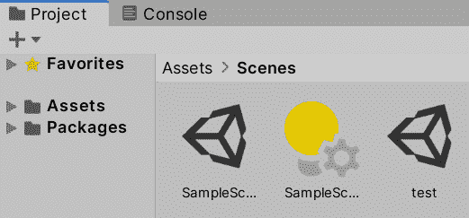

图 3.36 -场景文件

我们可以创建一个文件夹来保存我们的场景,对话框,或者,如果你已经保存的现场,你可以使用**创建一个文件夹创建**|**文件夹****项目中选择**窗口,拖动文件夹的创建的场景。 现在,如果你创建另一个场景文件与**|【显示】新场景**菜单选项,你可以回到以前的场景通过双击**中的资产项目**窗口。

这只会保存场景，但是在 Prefabs 和其他类型的资产上的任何改变都不会保存。 相反，如果你想保存除了场景以外的所有资产上的更改，你可以使用**文件**|**保存项目**选项。 这可能有点令人困惑，但如果您想要保存所有更改，您需要同时保存场景和项目，因为只保存项目不会保存场景上的更改。 有时，确保所有内容都被保存的最好方法就是关闭 Unity，当你试图在计算机或文件夹之间移动项目时，建议这样做。 让我们在下一节讨论这个问题。

## 项目结构

现在我们已经保存了所有的更改，我们可以在计算机之间或另一个文件夹中移动项目了(如果有一天需要的话)。 你可以关闭 Unity 以确保所有内容都被保存，然后复制整个项目文件夹。 如果你不记得,你救了你的项目,你可以右键单击**资产****项目中文件夹**窗口,选择**显示在资源管理器中**(**在 Finder 中显示【显示】Mac),见以下截图:**

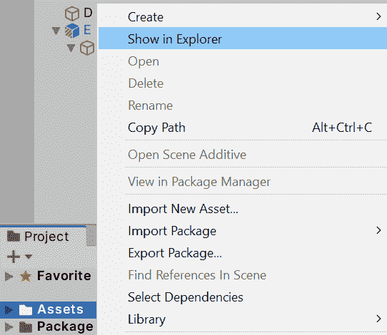

图 3.37 -定位项目文件夹

现在我们在项目文件夹中，让我们利用这个机会来探索一点。 我们会在一个完整的项目中找到几个文件夹和文件，但并不是为了将项目移到其他地方而必须复制所有的文件。 最重要的文件夹是**资产**、**项目设置**和**包**。 这些文件夹可以在下面的截图中看到:

图 3.38 -项目文件夹结构

**资产**是所有场景、预制件和其他资产文件的所在位置，因此文件夹及其所有内容都是必不可少的，包括那些根据资产自动创建的元文件。 **ProjectSettings**文件夹包含了一些不同 Unity 系统的配置，我们将在本书的后面进行修改，但即使我们没有改变任何设置，带着这个文件夹总是一个好主意。 **包**是一个统一的特性,允许您安装官方和自定义统一包或扩展引擎功能插件,这是一个新的不同版本的**.unitypackage**文件,但是我们稍后讨论。 到目前为止，重要的是要注意，该文件夹将设置我们的项目正在使用的包，所以记住也要带上那个包。

不需要其他文件夹/文件，因为其中一些是临时的，其他的可以重新生成，例如**库**，其中将保存我们的资产的所有转换版本。 所谓转换，我们指的是外部生成的文件，例如 3D 模型、图像、声音和等等。 Unity 需要将这些文件转换为与 Unity 兼容的格式。 原始文件将存在于**资产**中，而转换后的文件将存在于**库**中，以便在必要时可以轻松地重新生成。 之后在[*第 5 章*](05.html#_idTextAnchor085)*，导入和整合资产*中，我们将讨论整合外部生成的内容。

现在，让我们想象一下，你已经压缩了这三个文件夹，将它们复制到闪存驱动器中，然后将这些文件夹解压到另一台计算机中。 我们怎样才能重新启动这个项目? 如您所见，项目没有项目文件或类似的东西—它只是一堆文件夹。 为了打开一个项目，最简单的方法就是在**Assets**文件夹中找到一个场景文件，然后双击它，这样 Unity 就可以在那个场景中打开项目。 另一个选项是在 Unity Hub 中使用**添加**按钮，找到项目文件夹(包含**Assets**文件夹的那个)。 因此，我们将把这个项目添加到我们的计算机项目列表中，然后，我们可以单击列表中的名称来打开它。 下面的截图说明了这一点:

图 3.39 -重新打开一个项目

现在，我们拥有了所有需要的 Unity 基础知识，以便开始钻研如何使用不同的 Unity 系统，这样我们就可以开始创造一款真正的游戏了! 我们下一章再做吧!

# 总结

在本章中，我们快速介绍了基本的 Unity 概念。 我们回顾了所有的 Unity 窗口，以及我们如何使用它们来编辑一个完整的场景，从导航和创建预制对象，到使用 GameObjects 和组件操作它们来创建我们自己的对象类型。 我们还讨论了如何使用**Hierarchy**窗口来创建复杂的对象层次结构，以及如何创建 Prefabs 来重新利用和操作大量相同类型的对象。 最后，我们讨论了如何保存进度和移动项目，回顾了它的结构和哪些文件夹是最重要的。

在下一章中，我们将学习不同的工具，我们将使用创建我们的游戏关卡的第一个原型。**************