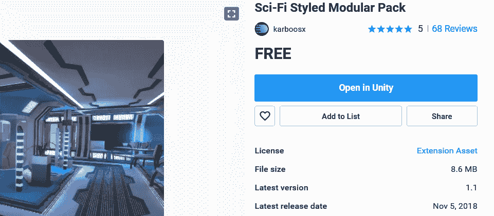
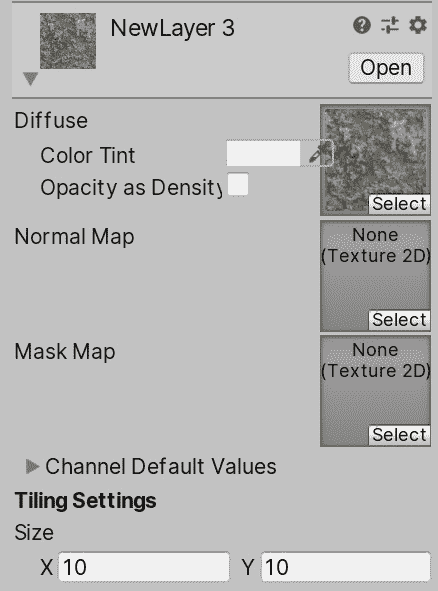
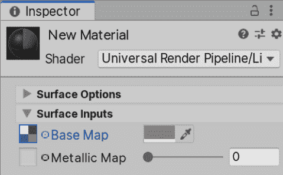
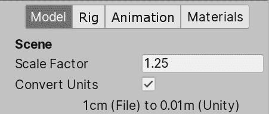
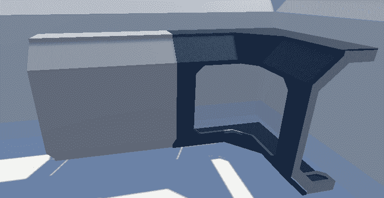
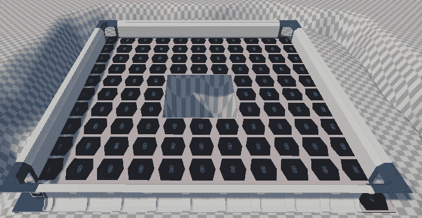
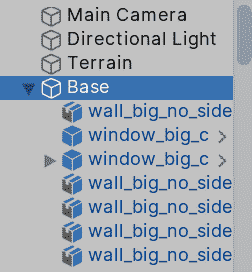

# *第五章*:导入和整合资产

在前一章中，我们创造了关卡的原型。 现在，让我们假设我们已经编写了游戏代码并进行了测试，验证了理念。 现在是时候将原型美术内容转变为真正的成品美术内容了。 实际上，我们将在第 3 部分中编写游戏代码，但出于学习目的，我们暂时跳过这一部分。 为了使用最终资产，我们需要学习如何获取它们(图像、3D 模型等)，如何将它们导入 Unity，以及如何在我们的场景中使用它们。

在本章中，我们将探讨以下主题:

*   导入资产
*   整合资产
*   配置资产

# 导入资产

我们可以在项目中使用不同的资产来源。 我们可以从美工那里获得文件，从不同的免费和付费资产网站下载，或者我们可以使用 Asset Store (Unity 的官方虚拟资产商店)，在那里我们可以获得免费和付费资产。 我们将混合使用从互联网和资产商店下载资产，只是为了获得所有可能的资源。

在本节中，我们将介绍与导入资产相关的以下概念:

*   从互联网导入资产
*   从资产存储中导入资产
*   下载和导入资产到我们的项目从互联网

## 从互联网导入资产

在为我们的项目获取图像资产方面，让我们从地形纹理开始。 记住，我们的地形是用网格图案绘制的，所以我们的想法是用草、泥、岩石和其他类型的纹理来代替。 要做到这一点，我们必须获得图像。 在这种情况下，这类图像通常是不同地形模式的自顶向下视图，它们有“平铺”的要求。 你可以在下面的截图中看到一个例子:

图 5.1 -左:草地; 右图:将同一块草地分开以突出纹理贴图

左边的草似乎是一个单一的大图像，但如果你注意，你应该能够看到一些图案重复它们自己。 在这个例子中，这棵草只是在网格中重复四次的单一图像，就像右边的这个。 通过这种方式，您可以通过重复一个小图像覆盖大区域，在您的计算机上节省大量 RAM。

我们的想法是用这些图像来绘制我们的地形。 你可以从几个地方得到它们，但最简单的方法是使用谷歌图像或任何图像搜索引擎。 要做到这一点，请遵循以下步骤:

1.  打开你的浏览器(Chrome, Safari, Edge 等等)。
2.  进入你喜欢的搜索引擎。 在这种情况下，我将使用谷歌。
3.  使用关键字**模式 tileable 纹理**,**替换模式**你正在寻找的地形,如**草 tileable 结构【5】或**泥浆 tileable 纹理**。 在这种情况下，我将键入**grass tileable texture**，然后按*Enter*进行搜索。**
4.  Switch to image search mode:

    

    图 5.2 -谷歌搜索图像

5.  Find any texture you find suitable for the kind of grass you need and click it. Remember that the texture must be a top-down view of the grass and must repeat.

    重要提示

    在选择之前，试着检查图像的分辨率。 现在尝试选择分辨率小于 1024 x 1024 的正方形图像。

6.  Right-click the opened image and select **Save image as…**:

    

    图 5.3 -另存图像为…选项

7.  将图片保存在任何你能记住的文件夹中。

现在已经下载了映像，可以通过几种方式将其添加到项目中。 最简单的方法是这样做:

1.  使用**文件资源管理器**(Mac 中的**Finder**)定位你的图像。
2.  在 Unity 的项目窗口中找到或创建**Textures**文件夹。
3.  把文件资源管理器和 Unity 项目窗口放在一起。
4.  将文件从文件资源管理器中拖动到 Unity 项目窗口中的**Textures**文件夹中:

图 5.4 -纹理被从文件资源管理器拖到 Unity 的项目视图

对于这些简单的纹理，任何搜索引擎都是有帮助的，但如果你想用详细的墙壁和门替换玩家的基础几何，或者在场景中放置敌人，你就需要获得 3D 模型。 如果你搜索那些在任何搜索引擎使用关键字,如“自由僵尸 3 d 模型,”你会发现无限的免费和付费 3 d 模型等网站 TurboSquid Mixamo,但这些网站可能会产生问题,因为这些网格通常不准备使用在统一中,甚至在游戏中。 你会发现模型有非常高的多边形计数，不正确的大小或方向，未优化的纹理，等等。 为了防止这些问题，我们想要使用更好的资源，在这种情况下，我们将使用 Unity 的资产商店，所以让我们来探索它。

## 从资产存储中导入资产

Asset Store 是 Unity 的官方资产市场，在这里你可以找到许多模型，纹理，声音，甚至整个 Unity 插件来扩展引擎的功能。 在这种情况下，我们将限制自己下载 3D 模型来替换玩家的基础原型。 你会想要得到一个模块化设计的 3D 模型，这意味着你将得到一些组件，如墙壁、地板、角落等等。 你可以把它们连接起来创造任何类型的场景。

为了做到这一点，你必须遵循以下步骤:

1.  Click on **Window | Asset Store** in Unity, which will open a new window saying the Asset Store has moved. In previous versions of Unity, you could see the Asset Store directly inside the editor, but now it is recommended to open it in a regular web browser, so just click the **Search online** button:

    

    图 5.5 -资产存储移动消息

2.  Your browser will open showing a site similar to the one in the following screenshot:

    

    图 5.6 - Asset Store 主页

3.  在右侧面板中，通过单击右侧的箭头打开 3D 类别。 然后，打开**Environments**，并检查**科幻**标记。 如您所见，有几个类别用于查找不同类型的资产，如果您愿意，您可以选择另一个类别。 在**环境**中，你会发现 3D 模型可以用来为你的游戏生成场景。
4.  If you need to, you can pay for an asset, but let's hide the paid ones for now. You can do that by searching through the **Pricing** section on the sidebar, opening it using the plus (**+**) symbol on its right, and then checking the **Free Assets** checkbox:

    

    图 5.7 -自由资产选项

5.  In the search area, find any asset that seems to have the aesthetic you are looking for and click it. Remember to look out for outdoors assets, because most environment packs are usually interiors only. In my case, I have picked one called **Sci-Fi Styled Modular Pack** that serves for both interiors and exteriors. Take into account that that package might not exist by the time you are reading this, so you might need to choose another one. If you don't find a suitable package, you can download the asset files we used in the GitHub repository. Please refer to the preface instructions of how to access the it.

    

    图 5.8 - Asset Store 搜索包的预览

    重要提示

    在写这本书的时候，Unity 正在发布“Snaps”包，这是一组官方的 Unity 3D 模型，可以用于不同类型的环境的模块化设计。 其中一些是付费的，而另一些是免费的——我建议你尝试一下。

6.  Now, you will see the package details in the Asset Store window. Here, you can find information regarding the package's description, videos/images, the package's contents, and the most important part, the reviews, where you can check whether the package is worth buying if it's a paid one:

    

    图 5.9 - Asset Store 包详细信息

7.  If you are OK with this package, click the **Add To My Assets** button, log in to Unity if requested and then click **Open In Unity** button. You might be prompted to accept a switch of apps to Unity – just accept:

    

    图 5.10 -切换应用

8.  This will open the **Package Manger** again, but this time in **My Assets** mode, showing a list of all the assets you have ever downloaded from the Asset Store, and the one you just selected highlighted in the list. You might need to log again in Unity clicking the Sign In button if you are not logged in Unity Hub.

    

    图 5.11 - Package Manager 显示资产

9.  点击**下载**在窗口的右下部分并等待其结束。 然后点击**导入。** 再次检查你是否从列表中选择了合适的资产包。
10.  After a while, the **Package Contents** Window will show up, allowing you to select exactly which assets of the package you want in your project. For now, leave it as-is and click **Import**:

    

    图 5.12 -要导入的资产

11.  在导入一段时间后，您将在项目窗口中看到所有的包文件。

考虑到导入大量完整的包将大大增加项目的大小，并且，稍后，您可能想要删除您没有使用的资产。 此外，如果你导入的资产产生错误，阻止你播放的场景，只需删除所有的**.cs**文件的包。 它们通常在名为**Scripts**的文件夹中。 这些代码文件可能与你的 Unity 版本不兼容。 在*第三部分*中，我们将学习如何制作我们自己的，以便那些是不必要的:

图 5.13 -点击播放提示代码错误

重要提示

资产商店很容易发生变化，即使你使用的是与我相同的 Unity 版本，所以 Unity 可能会在没有通知的情况下改变前面的步骤。 而且，它的内容经常变化，你可能找不到在这本书中使用的相同的包。 在这种情况下，你可以找到另一个类似的包，或者从 GitHub repo(链接和说明在序言)获取我使用的文件。

在你继续学习本章之前，试着使用资产存储下载一个敌人角色，按照前面的步骤。 为了解决这个练习，您必须完成与之前相同的步骤，但查看资产存储的**3D | Characters | Humanoid**类别。

现在我们已经导入了许多美术资产，让我们学习如何在我们的场景中使用它们。

# 整合资产

我们刚刚导入了许多可以以多种方式使用的文件，所以本节的想法是看看 Unity 如何将这些资产与 gameobject 和需要它们的组件集成在一起。

在本节中，我们将介绍与导入资产相关的以下概念:

*   结合地形纹理
*   集成网格
*   集成材料

让我们开始使用平铺纹理覆盖地形。

## 整合地形纹理

为了将纹理应用到我们的地形上，执行以下操作:

1.  选择**地形**对象。
2.  在**Inspector**中，点击**Terrain**组件的画笔图标(第二个按钮)。
3.  From the drop-down menu, select **Paint Texture**:

    

    图 5.14 -油漆纹理选项

4.  点击**编辑地形图层…|创建图层**选项。
5.  Look for the terrain texture you downloaded previously in the texture picker window that appears:

    

    图 5.15 -纹理选择器

6.  你将看到纹理将立即应用到整个地形。
7.  重复*步骤 4*和*步骤 5*添加其他纹理。 这一次，您将看到该纹理没有立即应用。
8.  在**地形图层**部分，选择你已经创建的新纹理开始绘制。 我在我的案例中使用了泥纹理。
9.  就像编辑地形一样，在**画笔**部分，你可以选择并配置画笔来绘制地形。
10.  在场景视图中，绘制你想要应用纹理的区域。
11.  If your texture patterns are too obvious, select your texture in the Terrains Layer box and then, open the **NewLayer N** where N is a number that depends on the layers you have created.

    重要提示

    每次你添加一个纹理到地形，你会看到一个名为“NewLayer N”的新资产被创建在项目视图中。 它保存了您创建的地形层的数据，如果需要，您可以在其他地形中使用该数据。 您还可以重命名该资产以赋予其一个有意义的名称。 此外，您还可以在自己的文件夹中重新组织这些资产。

12.  Open the section using the triangle to its left and increase the **Size** property in the **Tiling Settings** section until you find a suitable size where the pattern is not that obvious:

    

    图 5.16 -绘制纹理选项

13.  重复步骤*4*到*12*，直到你将所有你想要添加到你的地形的纹理。 在我的例子中，我将泥浆纹理应用于河流流域，并将岩石纹理应用于山丘。 对于岩石的纹理，我减少了画笔的**透明度**属性，以便更好地与山中的草混合。 你可以尝试在顶部加一层雪，只是为了好玩:

图 5.17 -用三种不同的纹理绘制我们的地形的结果

当然，我们可以使用系统的大量高级工具来大大改进，但是现在让我们保持简单。 现在，让我们看看如何整合 3D 模型。

## 集成网格

如果你选择一个我们之前已经配置的 3D 资产，并点击它右边的箭头，一个或多个子资产将出现在项目窗口中。 这意味着 FBX 不是一个 3D 模型，而是一个定义 3D 模型的资产容器:

图 5.18 -网格选择器

其中一些子资产是网格，它是定义模型几何形状的三角形集合。 您可以在文件中找到至少一个，但是您也可以找到几个，如果您的模型是由许多部分组成的，就会出现这种情况。 例如，一辆汽车可以是一个单一刚性网格，但不能让你旋转车轮或打开车门; 它只是一辆静态的汽车，如果汽车只是场景中的道具，这就足够了，但如果玩家能够控制它，你可能就需要修改它。 其理念是，你的汽车的所有部件都是相互关联的不同游戏对象，如果你移动其中一个部件，所有部件都会移动，但你仍然可以独立旋转这些部件。

当你将 3D 模型文件拖到场景中，Unity 将自动为每一块创建所有对象，并根据艺术家如何创建它们。 你可以在**层次结构**中选择对象，并查看它的所有子对象:

图 5.19 -子对象选择

此外，你会发现每个对象都有自己的**MeshFilter**和**MeshRenderer**组件，每个组件只渲染汽车的那一部分。 记住，网格过滤器是一个组件，它引用了来渲染网格资源，所以网格过滤器就是使用我们之前提到的网格子资源的那个:

图 5.20 -网格过滤器当前的网格选择

现在，如果你把 3D 模型文件拖到场景中，你会得到一个类似的结果，就好像模型是一个预制件，你正在实例化它。 但比组合式 3 d 模型文件更有限,因为你不能申请更改模型,所以在你对象拖到场景和编辑它有你想要的行为,我建议你创建一个预制的所有好处我们讨论[*第三章*](03.html# _idTextAnchor052),*使用场景和 GameObjects【5】, 例如，对 Prefab 的所有实例应用更改等等。 不要从模型文件中创建大量的模型实例——总是从基于该文件创建的 Prefab 中创建它们。*

这就是 3D 网格的基本用法。 现在，让我们探索纹理集成过程，这将使我们的 3D 模型有更多的细节。

## 整合纹理

也许你的模型已经应用了纹理，或者它已经应用了洋红色。 在后一种情况中，意味着资产没有准备好使用您在创建项目时选择的 URP 模板。 Asset Store 中的一些资产是用于较早版本的 Unity:

图 5.21 -网格渲染错误或根本没有材质

一个解决方案是使用**编辑|渲染管道|通用渲染管道|项目材料升级到 UniversalRP 材料**。 这将尝试升级你的所有材料到当前版本的统一:

图 5.22 -物料升级至 URP

这种方法的缺点是，有时，它不能正确地升级材料。 幸运的是，我们可以用这种新方法重新应用物体的纹理来解决这个问题。 即使你的资产工作得很好，我建议你重新应用纹理，只是为了学习更多关于材料的概念。

纹理直接应用于对象。 这是因为纹理只是所有控制模型方面的配置中的一个。 为了改变模型的外观，您必须创建一个材料。 材质是一个单独的资产，包含了很多关于 Unity 如何渲染你的对象的设置。 您可以将该资产应用到共享相同图形设置的多个对象，如果您更改材质的设置，它将影响所有正在使用它的对象。 它的工作原理就像一个图形配置文件。

为了创建一个材质来应用你的对象的纹理，你需要遵循以下步骤:

1.  在 Project Window 中，点击窗口左上角的加号(**+**)按钮。
2.  在该菜单中找到**材质**选项并单击它。
3.  命名您的材料。 这通常是您正在创建的资产的名称(例如，Car, Ship, Character 等等)。
4.  将你创建的材质资产拖动到场景中的模型实例中。 此时，如果你将鼠标拖拽资产到对象上，你将能够看到它在材质上的预览效果。 你可以通过释放鼠标来确认这一点。
5.  Maybe your object has several parts. In that case, you will need to drag the material to each part of the object.

    重要提示

    拖动材质只会改变你所拖动对象的**MeshRenderer**组件的材质属性。

6.  选择材质，点击**底图**属性左侧的圆圈。
7.  在**纹理选择器**中，点击模型的纹理。 它可以是复杂的定位纹理。 通常，纹理的名称将与模型名称相匹配。 如果没有，你将需要尝试不同的纹理，直到你看到一个适合你的对象。 此外，您可能会发现一些纹理与您的模型同名。 只要选择一个似乎有合适的颜色，而不是那些看起来黑色和白色或浅蓝色; 我们稍后将使用它们:

图 5.23 - URP 材料的底图属性

这样，你就成功地通过材质将纹理应用到物体上了。 对于每个使用相同纹理的物体，只需拖动相同的材质。 现在我们已经基本了解了如何应用模型纹理，让我们学习如何正确配置导入设置，然后将模型扩散到整个场景。

# 配置资产

正如我们之前所提到的，美工们习惯于在 Unity 之外创造美术资产，这可能会导致从工具中看到的资产与 Unity 将如何导入它之间的差异。 例如，3D Studio 可以使用厘米、英寸等单位，而 Unity 可以使用米。 我们刚刚下载并使用了大量资产，但是我们跳过了配置步骤来解决这些差异，所以现在让我们来看看。

在本节中，我们将介绍与导入资产相关的以下概念:

*   配置网格
*   配置纹理

让我们开始讨论如何配置 3D 网格。

## 配置网格

为了更改模型的导入设置，您需要找到已下载的模型文件。 有几个文件包含 3 d 模型的扩展,与最常见的一个是**.fbx**文件,但是你可以遇到**等.obj**,**3 ds**、【显示】.blender,**.mb**,等等。 你可以通过它的扩展名来识别这个文件是否是一个 3D 网格:

图 5.24 -选择的资产路径扩展

同样，你可以点击**资产**，并在检查器中查看你可以在以下截图中看到的选项卡:

图 5.25 -网格材质设置

现在你已经定位了 3D 网格文件，你可以正确地配置它们了。 现在，我们唯一需要考虑的是模型的适当比例。 美工习惯于使用不同的软件和不同的设置; 也许一个艺术家用米作为公制单位来创造模型，而其他艺术家用英寸、英尺等等。 当输入在不同单位中创建的资产时，它们很可能是不成比例的，这意味着我们将得到诸如人比建筑更大等结果。

最好的解决方法就是让美工去解决这个问题。 如果所有资产都是在你的公司中创建的，或者如果你使用了外部资产，你可以让美工根据你公司的运作方式去修改它，但现在，你可能只是一个自学 Unity 的开发者。 幸运的是，Unity 有一个设置，允许你在使用 Unity 之前缩放原始资产。 为了改变一个对象的比例因子，你必须做以下操作:

1.  在项目窗口中找到 3D 网格。
2.  拖动到场景中。 你会看到一个物体将出现在你的场景中。
3.  使用**GameObject | 3D Object | capsule**选项创建一个胶囊。
4.  Put the capsule next to the model you dragged into the Editor. See whether the scale makes sense. The idea is that the capsule is representing a human being (2 meters tall) so that you have a reference for the scale:

    

    图 5.26 -非比例资产

5.  如果模型比预期的大或小，再次在项目窗口中选择网格(不是你拖到编辑器中的游戏对象实例)，你将在检查器中看到一些导入设置。
6.  Look for the **Scale Factor** property and modify it, increasing it if your model is smaller than expected or reducing it in the opposite case:

    

    图 5.27 -模型网格选项

7.  点击检查器底部的**应用**按钮。
8.  重复*步骤 6*和*步骤 7*，直到达到你想要的结果。

还有许多其他选项可以配置，但我们现在就到此为止。 现在，让我们讨论如何正确配置模型的纹理。

## 配置纹理

同样，这里有几个设置需要配置，但是现在让我们专注于纹理大小。 我们的想法是使用最适合纹理使用的尺寸，这取决于很多因素。 第一个要考虑的因素是物体将被看到的距离。 如果你创建一个第一人称游戏,你可能会看到很多的对象附近足以证明一个纹理,但也许你有很多远处的物体,如广告牌在建筑物的顶部,您将永远不会足够附近看到的细节,所以你可以使用更小的纹理。 另一件要考虑的事情是对象的重要性。 如果你正在创造一款赛车游戏，你可能会在屏幕上出现许多 3D 模型，而玩家将永远不会关注它们; 他们会注意道路和其他车辆。 在这种情况下，一个物体，如街道上的一个垃圾桶，可以有一个小纹理和一个低多边形模型，用户永远不会注意到(除非他们停下来欣赏风景，但这是可以接受的)。 最后，你还可以制作一款带有自上而下视角的游戏，它永远不会放大场景，所以在第一人称游戏中拥有大纹理的相同物体在这里的纹理就不那么详细了。 在下一个图中，你可以看到较小的船可以使用较小的纹理:

图 5.28 -同一模型在不同距离处出现

纹理的理想尺寸是相对的。 找到它的通常方法是改变它的大小，直到你从游戏中最近的位置看到物体时，找到具有良好质量的最小大小。 这是一种反复试验的方法。 为了做到这一点，你可以做以下的:

1.  定位 3D 模型并将其放入场景中。
2.  将场景视图摄像机放在一个能够显示物体在游戏中最大尺寸的位置。 例如，在 FPS 游戏中，它几乎就在物体旁边，而在自上而下游戏中，它会在物体上方几米的地方。 再说一次，这取决于你的游戏。
3.  在与包一起导入的文件夹中或者从你之前创建的材质中找到并选择该对象正在使用的纹理。 它们通常有**.png**，**.jpg**，或**.tif**扩展。
4.  在检查器中，查看**Max Size**属性并减少它，尝试下一个最小值。 例如，如果纹理是 2048，尝试 1024。
5.  点击**应用**，检查场景视图，看看质量是否显著下降，或者变化是否不明显。 你会大吃一惊的。
6.  重复*步骤 4*到*步骤 5*，直到得到质量差的结果。 在这种情况下，只需增加之前的分辨率，以获得可接受的质量。 当然，如果你瞄准的是 PC 游戏，你就可以期待比手机游戏更高的分辨率。

现在你已经导入、集成并配置了你的对象，让我们用这些资产创建我们的 Player's Base。

## 装配场景

让我们开始使用下载的环境包替换原型库。 要做到这一点，你必须做到以下几点:

1.  In the **Environment** pack, locate the folder that contains all the models for the different pieces of the scene and try to find a corner. You can use the search bar in the Project Window to search for the **corner** keyword:

    

    图 5.29 -网格拾取器

2.  在我的具体案例中，我把角落的内外作为单独的模型，所以我需要把它们放在一起。
3.  Position it in the same position as any corner of your prototype base:

    

    图 5.30 -将网格放置在占位符上以便替换

4.  找到合适的模型，将连接到那个角落，创建墙壁。 同样，您可以尝试在项目窗口中搜索**墙**关键字。
5.  Instance it and position it so that it's connected to the corner. Don't worry if it doesn't fit perfectly; you will go over the scene when necessary later.

    重要提示

    您可以选择一个对象，按*V*键选择该对象的顶点，将其拖动到另一个对象的顶点。 这被称为顶点折断。 它允许你按照你的意愿连接两个场景:

    

    图 5.31 -连接两个模块

6.  Repeat the walls until you reach the other end of the Player Base and position another corner. You might get a wall that's a little bit larger or smaller than the original prototype, but that's fine:

    

    图 5.32 -连接模块链

    重要提示

    记住，你可以在按*Ctrl*键(在 Mac 上是*Control*键)的同时移动一个物体来捕捉物体的位置，这样墙壁的克隆体就可以很容易地定位在其他墙体的旁边。

7.  完成剩下的墙并摧毁原型。 记住这个过程是缓慢的，你需要有耐心。
8.  Add floors by looking for floor tiles and repeating them all over the surface:

    

    图 5.33 -带有凹坑孔的地板模块

9.  将您想要添加的任何细节添加到包中的其他模块中。
10.  将所有这些碎片放入一个名为**Base**的容器对象中。 记住创建一个空的对象，并把基础部分拖进去:

图 5.34 -网格子资产

经过大量的实践，您将慢慢获得经验与常见的陷阱和模块化场景设计的良好实践。 所有的包都有不同的模块化设计，因此您需要适应它们。

# 总结

在本章中，我们学习了如何导入模型和纹理，并将它们集成到我们的场景中。 我们讨论了如何将纹理应用到地形，如何用模块模型替换我们的原型网格，如何将纹理应用到那些，以及如何正确配置资产，同时根据对象的使用考虑几个标准。

至此，我们已经完成了本书的第一部分，并讨论了几个基本的 Unity 概念。 在第 2 部分中，我们将开始深入探讨一些 Unity 系统，这些系统能够帮助我们提高游戏的图像和音效质量。 我们将开始学习如何创建自定义材料类型来创建有趣的视觉效果和动画。