# *第八章*:使用通用渲染管道照明

**照明是一个复杂的主题,有几种可能的方法来处理它,每一个都有它的优点和缺点。为了得到最好的质量最好的性能,您需要确切地知道你的渲染器如何处理它,而这正是在这一章我们要做的。 我们将讨论如何在 Unity 的**Universal Render Pipeline**(**URP**)中处理灯光，以及如何正确配置它，以适应我们的场景的情绪与适当的灯光效果。**

在本章中，我们将研究以下照明概念:

*   应用照明
*   应用阴影
*   优化照明

# 应用照明

在讨论游戏中处理光照的方法时，我们可以采用两种主要方法，即**正向渲染**和**延迟渲染**。 两者都以的不同顺序处理照明，具有不同的技术、要求和优缺点。通常推荐前向渲染以提高性能，而推荐延迟渲染以提高质量。 后者由 Unity 的**High Definition Render Pipeline**使用，渲染器用于高端设备中的高质量图形。 在写这本书的时候，Unity 正在为 URP 开发一个性能版本。 同样，在Unity 中，Forward Renderer 有两种风格:**多通道 Forward**，这是在内置的渲染器(旧的 Unity 渲染器)中使用，以及**Single Pass Forward，**这是在URP 中使用。 同样，每种方法都有其优点和缺点。

重要的信息

实际上，还有其他可用的选项，包括官方的和第三方的选项，比如**Vertex Lit**，但现在我们将集中在三个主要的选项上——你使用 95%的时间。

在这两者之间做出选择取决于你所创造的游戏类型以及你需要运行游戏的目标平台。 你所选择的选项会因为你在场景中应用灯光的方式而发生很大的变化，所以你必须理解你正在处理的系统。

在本节中，我们将讨论以下实时照明概念:

*   讨论照明方法
*   使用天空盒配置环境照明
*   在 URP 中配置照明

让我们从比较前面提到的照明方法开始。

## 讨论照明方法

综上所述，我们提到了处理照明的三种主要方式:

*   正向渲染(单通道)
*   向前渲染(多路)
*   延迟渲染

在我们看它们之间的区别之前，让我们先谈谈它们的共同点。 这三个渲染器开始绘制场景，确定哪些物体可以被相机看到; 也就是说，那些落在相机截锥内的，当你选择相机时，可以看到一个巨大的金字塔:

图 8.1 -相机的截锥只显示它能看到的物体

在那之后，Unity 会从离相机最近的地方到离相机最远的地方排序(透明物体的处理略有不同，但我们先忽略它)。 这样做是因为更有可能靠近相机的物体会覆盖大部分相机，所以它们会遮挡其他物体，防止我们浪费资源计算被遮挡的像素。

最后，Unity 将尝试按照这个顺序渲染对象。 这就是在照明方法之间开始出现差异的地方，所以让我们开始比较两种正向渲染变体。 对于每个对象，单通道正向渲染将计算对象的外观，包括所有影响该对象的光，在一个镜头中，或者我们称为**Draw call**。 Draw Call 是 Unity 要求显卡渲染指定对象的确切时刻。 所有之前的工作都只是为这一刻做准备。 在多通道前向渲染器的情况下，通过简化一点实际逻辑，Unity 将为每个影响对象的光渲染一次对象。 因此，如果物体被三个灯光照亮，Unity 将渲染该物体三次，这意味着将发出三个 Draw Calls，并对 GPU 进行三次调用来执行渲染过程:

图 8.2 -左图，在多通道中首先绘制一个受两个光源影响的球体; 中间图像，球体的第二次绘制调用; 右图像，两者的组合绘制调用

现在你可能会想，*“为什么我要使用 Multi-Pass? 单次通过更有性能!” 是的，你是对的! 单通道比多通道的性能要好得多，并且在这里有一个伟大的地方。 GPU 中的 Draw Call 具有有限数量的可执行操作，所以你可以限制 Draw Call 的复杂性。 计算一个物体的外观和所有影响它的灯光是非常复杂的，为了让它只适合一个 Draw Call, Single Pass 执行了简化版本的灯光计算，这意味着更少的灯光质量和功能。 他们还对一个镜头可以处理的灯光数量有限制，在写这本书的时候，是每个物体 8 个(低端设备 4 个)。 这听起来是个小数字，但通常已经足够了。*

另一方面，多通道可以应用任意数量的灯，并可以为每个灯执行不同的逻辑。 让我们假设我们的物体有 4 盏灯影响它，但有两盏灯对它的影响很大，因为它们更近或强度更高，而剩下的影响物体的灯刚好足够被注意到。 在这个场景中，我们可以用更高的质量渲染前两盏灯，而用便宜的计算来渲染其余的灯——没有人能够分辨出它们的区别。 在这种情况下，Multi-Pass 可以使用**像素照明**计算前两个光源，使用**顶点照明**计算剩余的光源。 区别就在于他们的名字; Pixel 计算每个物体的像素的亮度，而 Vertex 计算每个物体顶点的亮度，并填充这些顶点之间的像素，从而在顶点之间插入信息。 你可以从下面的图片中清楚地看到区别:

图 8.3 -左图，一个球体被渲染顶点照明; 右图，一个用像素照明渲染的球体)

在单通道中，在一个绘制调用中计算所有内容会迫使你使用顶点光照或像素光照; 你不能把它们结合起来。

所以,总结单和多路之间的差异,在单通道,你有更好的性能,因为每个对象只是画一次,但是你的数量是有限的灯,可以应用在多程,你需要多次渲染对象,但是没有限制数量的灯, 你可以为每盏灯指定你想要的确切质量。 还有其他需要考虑的东西，比如一个 Draw Call 的实际成本(一个 Draw Call 可能比两个简单的更贵)，以及特殊的灯光效果，比如彩绘阴影，但让我们保持简单。

最后，让我们简要地讨论一下 Deferred。 即使我们不打算使用它，知道为什么我们不这样做还是很有趣的。 在确定哪些对象落在截锥体内并对其排序之后，Deferred 将在没有任何光照的情况下渲染这些对象，生成称为**G-Buffer**。 G-Buffer 是一组的几个图像包含不同场景的对象的信息,如颜色的像素(没有照明),每个像素的方向(称为**法线),和从相机像素。 你可以在下图中看到一个典型的 G-Buffer 示例:**

 **

图 8.4 -左侧图像，对象的纯色; 中间图像，每个像素的深度; 右图像，像素的法线

重要的信息

法线是方向，方向的(X,Y,Z)分量被编码到颜色的 RGB 分量中。

在渲染完场景中的所有物体后，Unity 将迭代在相机中可以看到的所有灯光，从而在 G-Buffer 上应用一层灯光，从中获取信息来计算特定的灯光。 当所有的灯都被处理后，你会得到如下的结果:

图 8.5 -三种灯的组合，应用于 G-Buffer，如图所示

正如你所看到的，这个方法的延迟部分来自于计算照明作为渲染过程的最后一个阶段的想法。 这是更好的，因为你不会浪费资源计算从可能被遮挡的物体的光照。 如果图像的地板首先在 Forward 中渲染，其余物体将遮挡的像素计算是徒劳的。 此外，还有一个细节，Deferred 只是在光线可以到达的精确像素中计算光照。 举个例子，如果你正在使用手电筒，Unity 将只计算落在手电筒圆锥内的像素的光照。 这里的缺点是延迟不被一些相对旧的显卡支持，并且你不能用顶点光照质量来计算光照，所以你将需要支付像素光照的价格，这在低端设备上是不推荐的(甚至在简单的图形游戏中是必要的)。

那么，为什么我们使用 URP 与单次转发? 因为它提供了性能、质量和简单性之间的最佳平衡。 在这款游戏中，我们不会使用太多的灯光，所以我们不会担心单通道的灯光数量限制，我们也不会过多地利用 Deferred 好处，所以使用更多硬件来运行游戏是没有意义的。

现在我们已经有了 URP 如何处理照明的基本概念，让我们开始使用它吧!

## 使用天空盒配置环境照明

有不同的光源可以影响场景，如太阳、手电筒、灯泡等等。 这些灯被称为**直射灯**; 也就是发射光线的物体。 然后，我们有**间接光**，通常代表直接光的反射。 然而如果你想让游戏运行至少 30 FPS(或者只是运行)，那么计算所有灯光所发出的所有光线的反弹是不可能的。 问题是，没有间接光会产生不现实的结果，因为我们的当前场景的照明，你可以观察到阳光无法到达的地方，是完全黑暗的，因为没有光从其他地方反射到光:

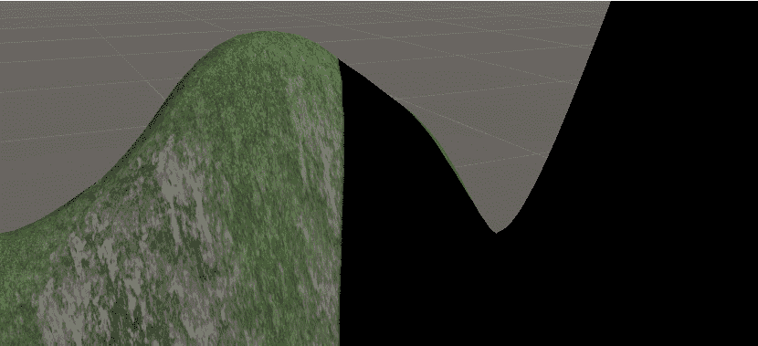

图 8.6 -在没有环境照明的情况下，投影在山上的阴影

为了解决这个问题，我们可以使用这些弹跳的近似。 这就是我们所说的**环境光**。 这代表了一个照明的基础层，通常应用一点点基于天空的颜色的光，但你可以选择任何你想要的颜色。 例如，在晴朗的夜晚，我们可以选择深蓝色来代表月光的色调。

默认情况下，Unity 不会计算来自天空的环境光，所以我们需要手动做如下操作:

1.  Select the Terrain in the Hierarchy and uncheck Static at the top right part of the Inspector. Later we will explain why we did this:

    

    图 8.7 -层次中的地形

2.  Click on **Window** | **Rendering** | **Lighting Settings**. This will open the **Scene Lighting Settings** window:

    

    图 8.8 -照明设置位置

3.  Click the **Generate Lighting** button at the bottom of the window. If you haven't saved the scene so far, a prompt will ask you to save it, which is necessary:

    

    图 8.9 -生成照明按钮

4.  See the bottom-right part of the Unity window to check the progress calculation bar to check when the process has finished:

    

    图 8.10 -照明生成进度条

5.  你现在可以看到，完全黑暗的区域在天空发出的光中有一点影响:

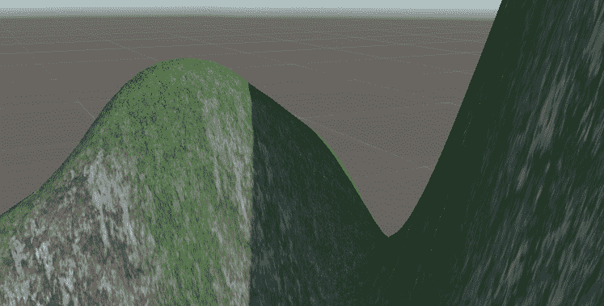

图 8.11 -环境光照下的阴影

现在，通过这样做，我们有更好的照明，但它仍然看起来像一个晴天。 记住，我们希望有雨天。 为了做到这一点，我们需要改变默认的天空，使它是多云的。 你可以通过下载**skybox**来实现。 当前你可以在场景中看到的天空只是一个大立方体，每一面都包含纹理，这些纹理有一个特殊的投影来防止我们检测立方体的边缘。 我们可以为立方体的每个边下载 6 张图片，并将它们应用于我们想要的任何天空，所以让我们这样做:

1.  你可以从任何你想要的地方下载天空盒纹理，但在这里，我将选择资产商店。 打开**窗口**|**资产商店**，进入资产商店网站。
2.  Look for **2D** | **Textures & Materials** | **Sky** in the category list on the right. Remember that you need to make that window wider if you can't see the category list:

    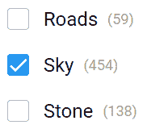

    图 8.12 -天空盒类别

3.  Remember to check the **Free Assets** checkbox in the **Pricing** section:

    

    图 8.13 -自由资产过滤

4.  Pick any skybox you like for a rainy day. Take into account that there are different formats for skyboxes. We are using the six-image format, so check that before downloading one. In my case, I have chosen the skybox pack shown in the following figure. Download and import it, as we did in [*Chapter 5*](05.html# _idTextAnchor085)*, Importing and Integrating Assets*:

    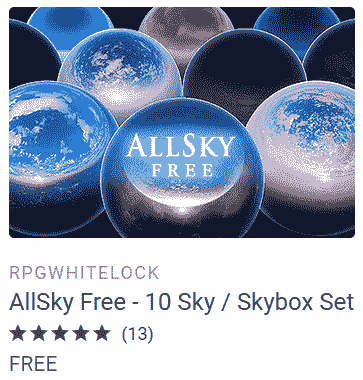

    图 8.14 -本书的选定天空盒

5.  使用**项目**窗口中的**+**图标创建一个新材质，并选择**材质**。
6.  将材质的**着色器**选项设置为**Skybox/6 边**。 记住，天空盒只是一个立方体，所以我们可以应用一个材料来改变它的外观。 skybox 着色器已经准备好应用 6 个纹理。
7.  Drag the six textures to the **Front**, **Back**, **Left**, **Right**, **Up**, and **Down** properties of the material. The six downloaded textures will have descriptive names so that you know which textures go where:

    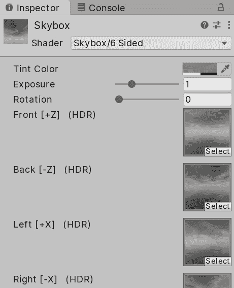

    图 8.15 -天空盒材质设置

8.  在场景视图中将材质直接拖到天空中。 确保你不要把材质拖到一个物体上，因为材质会被应用到它上面。
9.  重复*步骤 1【】*4 环境光计算的*(**照明设置**|**生成照明**)【显示】重新计算它基于新的天空体。 在下图中，你可以看到我目前的项目结果:*

图 8.16 -应用 skybox

现在我们已经有了一个很好的灯光基础层，我们可以开始添加灯光对象。

## 在 URP 中配置照明

我们有三种主要的类型的直接灯，我们可以添加到我们的场景:

*   **方向光**:这是代表太阳的光。 无论物体的位置如何，它所面向的方向都会发出光线; 太阳向右移动 100 米不会产生很大的影响。 例如，如果你慢慢地旋转这个物体，你可以生成一个日/夜循环:

图 8.17 -定向光结果

*   **Point Light**:此灯代表一个灯泡，它向四面八方发射光线。 它与太阳的不同之处在于它的位置很重要，因为它离太阳更近。 此外，因为它是一个较弱的光，这种光的强度随距离而变化，所以它的效应有一个范围——物体离光越远，接收到的强度就越弱:

图 8.18 - Point Light 结果

*   **聚光灯**:这种光代表一个光锥，例如手电筒发出的光锥。 它的行为类似于点光源，它的位置和方向很重要，光的强度在一定距离内衰减:

图 8.19 -聚光结果

到目前为止，我们有一个很好的雨天环境光，但我们在场景中唯一的直接光，方向光，不会是这样的，所以让我们改变:

1.  在**层次**窗口中选择**方向光**对象，然后查看**检查器**窗口。
2.  点击**Color**属性来打开颜色选择器。
3.  选择深灰色来获得被云部分遮挡的太阳光。
4.  设置**阴影类型**为**无阴影**。 现在我们有一个阴天，太阳不会投射出清晰的阴影，但是我们一会儿会更多地谈论阴影:

图 8.20 -没有阴影的柔和方向光

现在场景变暗了，我们可以添加一些灯光来照亮场景，如下所示:

1.  Create a Spotlight by going to **GameObject** | **Light** | **Spotlight**:

    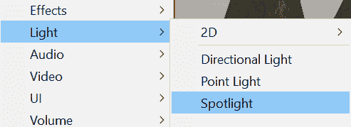

    图 8.21 -创建聚光灯

2.  选择它。 然后，在**检查器**窗口中，设置**内/输出点角度**为**90**和**120**，这将增加锥体的角度。
3.  设置**范围**至**50**，即光可达 50 米，沿路径衰减。
4.  Set **Intensity** to **1000**:

    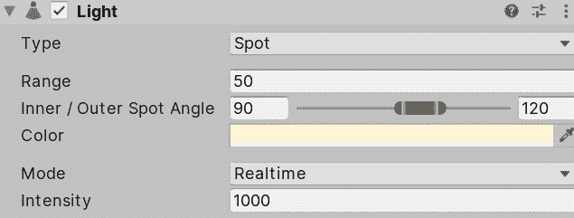

    图 8.22 -聚光灯设置

5.  Position the light at one corner of the base, pointing it at the center:

    

    图 8.23 -聚光灯位置

6.  通过选择它并按*Ctrl + D*(在 Mac 上按*command + D*)复制灯光。
7.  把它放在基座的对角

图 8.24 -两个 Spotlight 结果

你可以继续给场景添加灯光，但是要注意不要走得太远——记住灯光限制。 另外，你也可以下载一些灯柱放到灯的位置，从视觉上证明光源的来源。 现在我们已经实现了适当的照明，我们可以谈论阴影。

# 应用阴影

也许你会认为我们在场景中已经有了影子，其实我们没有。 物体较暗的区域，那些没有面对灯光的区域，没有阴影——它们没有被点亮，这和阴影是完全不同的。 在这种情况下，我们指的是从一个物体投射到另一个物体的阴影; 例如，玩家的影子投射在地板上，或者从山脉投射到其他物体上。 阴影可以提高场景的质量，但计算成本也很高，所以我们有两个选择:不使用阴影(建议使用手机等低端设备)或根据我们的游戏和目标设备找到性能和质量之间的平衡。 在第一种情况下，您可以跳过整个部分，但是如果您想要(尽可能多地)实现性能阴影，请继续阅读。

在本节中，我们将讨论以下关于阴影的主题:

*   理解阴影计算
*   配置高性能的阴影

让我们从讨论Unity 如何计算阴影开始。

## 理解阴影计算

在游戏开发中，众所周知，阴影在性能方面代价高昂，但为什么呢? 当光线在到达一个物体之前照射到另一个物体时，这个物体就会产生阴影。 在这种情况下，没有照明应用到该像素的光。 这里的问题和我们在环境灯光模拟中遇到的问题是一样的——计算所有可能的光线及其碰撞的代价太大了。 所以，我们再次需要一个近似值，这就是阴影贴图发挥作用的地方。

阴影地图是一个图像,从光的角度呈现,而是画完整的场景的色彩和照明计算,它将在灰度渲染所有的物体,黑色意味着像素非常远离相机和白意味着像素靠近镜头。 仔细想想，每个像素都包含了光的**射线**击中的位置的信息。 通过知道光线的位置和方向，你可以使用**阴影贴图**计算每个“光线”击中的位置。 在下图中，你可以看到我们的方向光的阴影贴图:

图 8.25 -阴影贴图由我们场景的方向光生成

每种类型的光计算阴影贴图略有不同，尤其是点光。 因为它是全方位的，它需要在所有的方向(前，后，上，下，右，左)渲染场景几次，以收集关于它发出的所有射线的信息。 我们不会在这里详细讨论这个问题，因为我们可以讨论一整天。

现在，重要的一点是在这里强调的是阴影贴图是纹理，因此它们有一个分辨率。 分辨率越高，阴影地图计算的“射线”就越多。 你可能想知道一个低分辨率的阴影地图看起来像什么，当它只有几条光线。 看看下面的图就知道了:

图 8.26 -用低分辨率阴影贴图渲染的硬阴影

这里的问题是，光线越少，阴影像素就越大，从而产生像素化阴影。 在这里，我们要考虑的第一个配置是:阴影的理想分辨率是多少? 你可能会想要增加它，直到阴影看起来平滑，但当然，这将增加计算它的时间，所以它将显著影响性能，除非你的目标平台可以处理它(手机绝对不行)。 在这里，我们可以使用**软阴影**技巧，我们可以在阴影上应用模糊效果来隐藏像素化的边缘，如下图所示:

图 8.27 -用低分辨率阴影贴图渲染的软阴影

当然，模糊效果不是免费的，但是将它与低分辨率的阴影贴图结合，如果你接受它的模糊效果，可以在质量和性能之间产生一个很好的平衡。

现在，低分辨率阴影地图有另一个问题，即**Shadow Acne**。 这是你在下图中看到的照明错误:

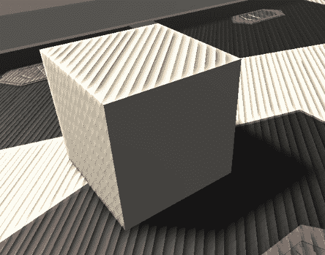

图 8.28 -低分辨率阴影地图上的阴影粉刺

低分辨率阴影地图会产生误报，因为它计算的“光线”更少。 在射线之间被着色的像素需要从最近的射线中插值信息。 阴影地图的分辨率越低，光线之间的差距就越大，这意味着精确度越低，误报越多。 一种解决方案是增加分辨率，但还是会有性能问题(一如既往)。 我们有一些聪明的解决方案，如使用**深度偏差**。 下面的图中可以看到一个例子:

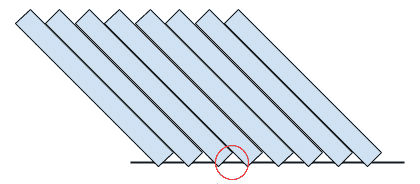

图 8.29 -两道远“射线”之间的假阳性 高亮的区域认为射线在到达物体之前就击中了它。

**深度偏差**的概念很简单——简单到看起来像是一个大骗局，事实上，它确实是，但游戏开发却充满了这些东西! 为了防止误报，我们将光线“推”得更远一点，刚好使插值光线到达撞击表面:

图 8.30 -具有深度偏差的射线以消除假阳性

当然，正如您可能预期的那样，如果没有警告，它们不会轻易地解决这个问题。 推送深度在其他区域产生假阴性，如下图所示。 它看起来像立方体是漂浮的，但实际上，它是触地的——假底片产生了它漂浮的错觉:

图 8.31 -高度偏倚造成的假阴性

当然，对于这种情况，我们有一个对抗的技巧，即**正常偏差**。 它仍然推动物体，但沿着它们所面对的方向。 这一点有点复杂，所以我们不会在这里详细讨论，但其想法是，结合一点深度偏差和另一点正常偏差将减少假阳性，但不能完全消除它们。 因此，我们需要学习如何与之共存，并通过巧妙定位对象来隐藏它:

图 8.32 -减少假阴性，这是结合深度和正常偏倚的结果

还有其他几个方面会影响阴影贴图的工作方式，其中之一就是光线范围。 光的范围越小，阴影覆盖的区域就越小。 相同的阴影贴图分辨率可以为该区域添加更多细节，所以尽量减少光的范围。

我可以想象你现在的样子，是的，照明是复杂的，我们只是触及了表面! 但是保持你的精神! 在对设置进行了一些尝试和错误调整之后，您将会更好地理解它。 我们将在下一节中做这个。

重要的信息

如果你真的有兴趣了解更多关于阴影系统的内部结构，我建议你看看**阴影级联**的概念，这是一个关于方向光和阴影贴图生成的高级主题。

## 配置性能阴影

因为我们的目标是中端设备，所以我们将尝试在这里实现质量和性能的良好平衡，所以让我们开始为聚光灯启用阴影。 方向光的阴影不会那么明显，实际上，下雨的天空不会产生清晰的阴影，所以我们将以此为借口不计算这些阴影。 为了做到这一点，请执行以下步骤:

1.  Select both Point Lights by clicking them in the Hierarchy while pressing *Ctrl* (*Command* on Mac). This will ensure that any changes made in the **Inspector** window will be applied to both:

    

    图 8.33 -选择多个对象

2.  In the **Inspector** window, set **Shadow Type** to **Soft Shadows**. We will be using low-resolution shadow maps here:

    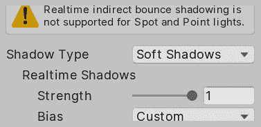

    图 8.34 -软阴影设置

3.  Select **Directional light** and set **Shadow Type** to **No Shadows** to prevent it from casting shadows:

    

    图 8.35 -无阴影设置

4.  创建一个多维数据集(**GameObject**|**3 d 对象立方体**|**),并将其附近的一个灯,就有我们可以投射阴影的对象用于测试目的。**

 **现在我们已经有了一个基本的测试场景，让我们来调整阴影贴图的分辨率设置，以防止在这个过程中出现阴影痤疮:

1.  转到**编辑**|**项目设置**。
2.  In the left-hand side list, look for **Graphics** and click it:

    

    图 8.36 -图形设置

    在选择此选项后出现的属性中，单击下面的方框**可脚本渲染管道设置**——包含名称的那个。 在我的例子中，这是**LWRP-HighQuality**，但你的游戏可能会因为拥有不同版本的 Unity 而有所不同:

    

    图 8.37 -当前渲染管道设置

3.  Doing that will highlight an asset in the Project window, so be sure that window is visible before selecting it. Select the highlighted asset:

    

    图 8.38 -突出显示的当前管道

4.  This asset has several graphics settings related to how URP will handle its rendering, including lighting and shadows. Expand the **Lighting** section to reveal its settings:

    

    图 8.39 -管道照明设置

5.  **附加光源**分段下的**阴影分辨率**设置表示所有非方向光源(因为它是**主光源**)的阴影贴图分辨率。 如果它还没有达到该值，则将其设置为**1024**。
6.  Under the **Shadows** section, you can see the **Depth** and **Normal Bias** settings, but those only work for the Directional Light. So, instead, select both spotlights, set Bias mode to custom, and set the **Depth** and **Normal Bias** to **0.25** in order to reduce them as much as we can before we remove the Shadow Acne:

    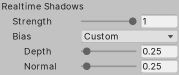

    图 8.40 -灯光阴影设置

7.  这并不完全与阴影相关，但在这里，你可以改变**每物体光**的限制来增加或减少可以影响物体的光的数量(不超过 8 个)。
8.  如果你遵循了前面展示的阴影级联提示，你可以稍微调整一下**级联**的值，使方向光的阴影能够注意到效果。 记住那些阴影设置只对方向光有效。
9.  把两盏灯都设置成 40 米的范围。 看看阴影在改变之前和之后的质量是如何提高的:

图 8.41 - Bias 设置

记住，这些值只在我的情况下工作，所以试着摆弄一下这些值，看看结果如何变化-你可能会找到一个更好的设置为你的 PC。 此外，请记住，不添加阴影始终是一个选项，所以要始终考虑到如果你的游戏在 FPS 上运行较低(并且不存在其他潜在的性能问题)。

你可能认为这是我们在灯光方面能做的所有事情，但幸运的是，事实并非如此! 我们还有另一种资源可以用来进一步改善它，即静态照明。

# 优化照明

我们之前提到过，不计算光照对性能有好处，但是不计算光，但仍然有它们怎么办? 是的，这听起来好得令人难以置信，但它实际上是可行的(当然，也需要技巧)。 我们可以使用一种叫做静态光照或烘烤的技术，它允许我们计算一次光照并使用缓存结果。

在本节中，我们将涵盖以下与静态照明相关的概念:

*   理解静态照明
*   Baking lightmaps
*   应用静态照明到动态对象

## 了解静态照明

这个想法很简单:只需要做一次光照计算，保存结果，然后使用这些而不是一直计算光照。 您可能想知道为什么这不是默认的技术。 这是因为它有一些限制，其中最大的限制是动态对象。 **Precalculating 阴影**意味着他们不能改变一旦被计算,但如果一个物体移动蒙上了一层阴影,阴影依然存在,所以最主要的考虑是,你不能用这种技术与移动的物体。 相反，你将需要混合**静态**或**烘焙光照**用于静态对象和**实时光照**用于动态(移动)对象。 此外，除了这种技术只适用于静态对象外，它也只适用于静态灯光。 同样，如果有光移动，那么预先计算的数据将无效。

您需要考虑的另一个限制是，预先计算的数据可能会对内存产生巨大影响。 这些数据占用 RAM 空间，可能有数百 mb，因此需要考虑目标平台是否有足够的空间。 当然，你可以通过降低预计算的光照质量来减少数据的大小，但你需要考虑质量的降低是否会严重影响游戏的外观和感觉。 与所有与优化有关的选项一样，您需要平衡两个因素:性能和质量。

在我们的过程中，我们有几种预先计算的数据，但最重要的是我们称为**的光照图**。 光照贴图是一个包含场景中所有物体的所有阴影和灯光的纹理，所以当 Unity 应用预先计算或烘烤的数据时，它会查看这个纹理来知道静态物体的哪些部分被照亮了，哪些没有。 你可以在下图中看到一个 lightmap 的例子:

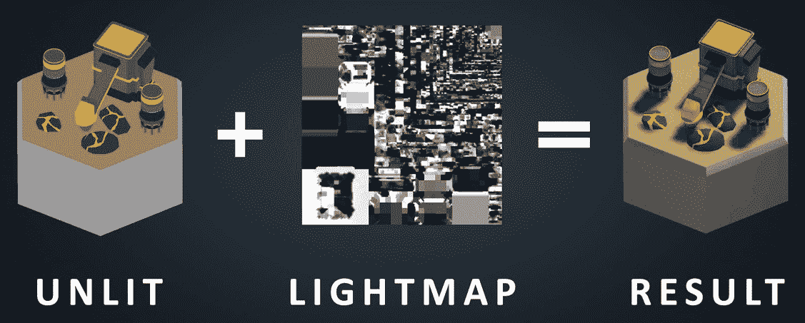

图 8.42 -左，没有灯光的场景; 中间，一个保存该场景预计算数据的 lightmap; 好的，灯光贴图被应用到场景中

不管怎样，光图有它自己的好处。 烘焙过程是在 Unity 中执行的，在游戏发布给用户之前，所以你可以花大量时间计算你在运行时不能做的事情，如提高准确性，光线反射，角落的光线遮挡，以及来自发射物体的光线。 然而，这也可能是一个问题。 记住，动态对象仍然需要依赖于实时照明，而且与静态照明相比，这种照明看起来会非常不同，所以我们需要对它们进行大量调整，以免用户注意到这种差异。

现在我们有了静态照明的基本概念，让我们深入了解如何使用它。

## 烘焙灯光图

要使用 lightmaps，我们需要做一些关于 3D 模型的准备工作。 记住，网格有**uv**，其中包含关于纹理的哪一部分需要应用到模型的每一部分的信息。 有时候，为了节省纹理内存，你可以将同一块纹理应用到不同的部分。 例如，在汽车的纹理中，你不会有四个轮子，你只有一个，你可以把相同的纹理应用到所有的轮子上。 这里的问题是静态照明使用纹理相同的方式，但在这里，它将应用光照贴图来照亮对象。 在车轮场景中，问题在于如果一个车轮接收阴影，那么所有的车轮都会有阴影，因为所有的车轮都共享相同的纹理空间。 通常的解决方案是在模型中有第二组 uv，没有共享纹理空间，只是用于光照映射。

有时，下载的模型已经准备好进行光照映射，有时则没有，但幸运的是，Unity 已经为我们提供了这些场景。 为了确保一个模型将正确计算光照映射，让我们通过以下操作让 Unity 自动生成**光照映射 UV**:

1.  在**项目**窗口中选择网格资产(FBX)。
2.  在**Model**选项卡中，找到底部的**Generate Lightmap**复选框并选中它。
3.  Click the **Apply** button at the bottom:

    

    图 8.43 -生成 Lightmap 设置

4.  对每个模型重复这个过程。 从技术上讲，你只能在模型中这样做，在烘烤光图后，你会得到工件和奇怪的结果，但现在，让我们在所有模型中这样做，以防万一。

在为灯光映射模型做准备之后，下一步是告诉 Unity 哪些对象不会移动。 为此，请执行以下操作:

1.  选择不会移动的对象。
2.  Check the **Static** checkbox in the topright of the **Inspector** window:

    

    图 8.44 -静态复选框

3.  对每个静态对象重复这一步骤(这对灯光没有必要; 我们稍后将处理这些)。

考虑到你可能不希望每个对象(即使它是静态的)都被光照映射，因为你光照映射的对象越多，你需要的纹理大小就越大。 举个例子，地形太大，会消耗大部分的光照贴图的大小。 通常，这是必要的，但在我们的情况下，聚光灯几乎没有触及地形。 在这里，我们有两个选择:让地形保持动态，或者更好的是，直接告诉聚光灯不要影响地形，因为其中一个只被环境光和方向光(不投射阴影)照亮。 记住，这是我们可以做的，因为我们的场景类型; 但是，您可能需要在其他场景中使用其他设置。 你可以通过以下方法从实时和静态光照计算中排除一个对象:

1.  选择要排除的对象。
2.  In the **Inspector** window, click the **Layer** dropdown and click on **Add Layer**:

    

    图 8.45 -图层创建按钮

3.  Here, you can create a layer, which is a group of objects that's used to identify which objects are not going to be affected by lighting. In the **Layers** list, look for an empty space and type in any name for those kinds of objects. In my case, I will only exclude the terrain, so I have just named it **Terrain**:

    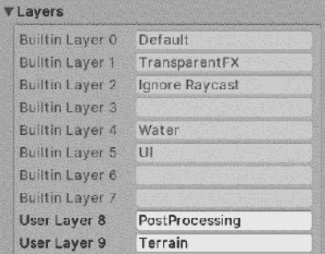

    图 8.46 -层次列表

4.  Once again, select the terrain, go to the **Layer** dropdown, and select the layer you created in the previous step. This way, you can specify that this object belongs to that group of objects:

    

    图 8.47 -改变游戏对象的图层

5.  Select all the Spotlights lights, look for the **Culling Mask** in the **Inspector** window, click it, and uncheck the layer you created previously. This way, you can specify that those lights won't affect that group of objects:

    

    图 8.48 -消光遮罩

6.  现在，你可以看到那些选择的灯是如何不照明或应用阴影的地形。

现在是灯光的时候了，因为**Static**复选框对它们不起作用。 对于他们，我们有以下三种模式:

*   **实时**:实时模式下的灯光将影响所有物体，包括静态和动态的，使用实时照明，这意味着没有预先计算。 这对于非静态的灯光很有用，如玩家的手电筒，一盏因风而移动的灯等等。
*   **烘烤**:与实时相反，这种光只会影响带有光照贴图的静态物体。 这意味着如果玩家(动态)在街道上的烤灯下移动(静态)，街道会看起来很亮，但玩家仍然是黑暗的，不会在街道上投下任何阴影。 我们的想法是，在灯光上使用这个不会影响任何动态对象，或者在灯光上几乎看不到的地方，这样我们就可以通过不计算它们来提高性能。
*   **混合**:如果您不确定要使用哪一个，这是首选的模式。 这类光将计算静态对象的光照贴图，但也会影响动态对象，结合其实时照明和烘烤的一个(像实时灯光也做)。

在我们的例子中，我们的方向光只会影响地形，因为我们没有阴影，在 URP 中给它应用光照是相对便宜的，所以我们可以让方向光保持实时状态，这样它就不会占用任何光照贴图区域。 我们的聚光灯会影响到基座，但实际上，他们只是对它施加光照——因为我们的基座是空的，所以我们没有阴影。 在这种情况下，最好不要计算光照映射，但为了学习的目的，我将添加一些物体作为基础上的障碍，投射一些阴影，并证明使用光照映射的合理性，如下图所示:

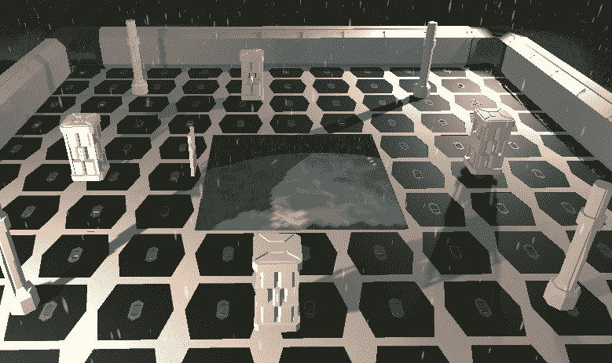

图 8.49 -添加物体到投射光

在这里，你可以看到我们最初的关卡设计是如何在游戏开发过程中不断改变的，这是你无法避免的——游戏的更大部分会随着时间而改变。 现在，我们准备设置光模式并执行烘焙过程，如下所示:

1.  选择**方向灯**。
2.  在**检查器**窗口中设置**渲染模式**为**实时**(如果它还没有处于该模式)。
3.  选择两个聚光灯。
4.  Set their **Render Mode** to **Mixed**:

    

    图 8.50 -混合照明设置

5.  打开**灯光设置**窗口(**窗口**|**渲染**|**灯光设置**)。
6.  点击**生成灯光**，这是我们之前用来生成环境灯光的按钮。
7.  Wait for the process to complete. You can do this by checking the progress bar at the bottom-right of the Unity Editor. Note that this process could take hours in large scenes, so be patient:

    

    图 8.51 -烘焙进度条

8.  We want to change some of the settings of the baking process. In order to enable the controls for this, click the **New Lighting Settings** button. This will create an asset with lightmapping settings that can be applied to several scenes in case we want to share the same settings multiple times:

    

    图 8.52 -创建照明设置

9.  Reduce the quality of lightmapping, just to make the process go faster. Just to iterate, the lighting can easily be reduced by using settings such as **Lightmap Resolution**, **Direct**, **Indirect,** and **Environment Samples**. In my case, I have those settings applied, as shown in the following figure. Note that even reducing those will take time; we have too many objects in the scene due to the modular level design:

    

    图 8.53 -场景灯光设置

10.  After the process has completed, you can check the bottom part of the **Lighting Settings** window, where you can see how many lightmaps need to be generated. We have a maximum lightmap resolution, so we probably need several of them to cover the entire scene. Also, it informs us of their size so that we can consider their impact in terms of RAM. Finally, you can check out the **Baked Lightmaps** section to see them:

    

    图 8.54 -生成的光照图

11.  现在，根据结果，你可以移动物体，修改光线强度，或者做任何你需要的校正，以使场景看起来像你想要的那样，并在你需要的时候重新计算灯光。 在我的例子中，这些设置给了我足够好的结果，如下图所示:

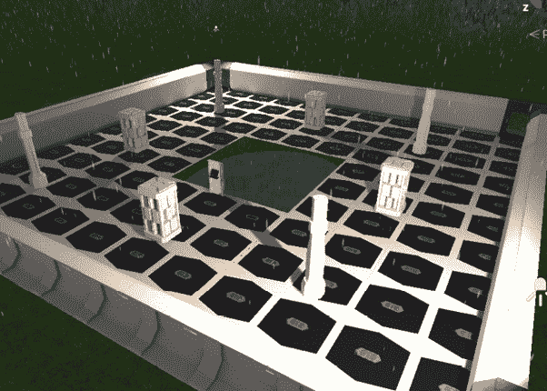

图 8.55 - Lightmap 结果

我们仍然有许多小的设置可以触及，但我将让你通过尝试和错误或阅读 Unity 文档中关于光照映射的链接来发现这些设置。 阅读 Unity 手册是一个很好的知识来源，我建议你开始使用它——任何优秀的开发人员，无论多么有经验，都应该阅读这本手册。

## 在静态物体上应用静态照明

当你在场景中将对象标记为静态时，你可能已经发现场景中的所有对象都不会移动，所以你可能会为每个对象勾选静态复选框。 这是可以的，但你应该始终在场景中添加一个动态对象，以确保所有内容都能够正常运行——没有游戏拥有完全静态的场景。 尝试添加一个胶囊并移动它来模拟我们的玩家，如下图所示。 如果你注意它，你会注意到一些奇怪的事情-由光照映射过程产生的阴影没有被应用到我们的动态对象:

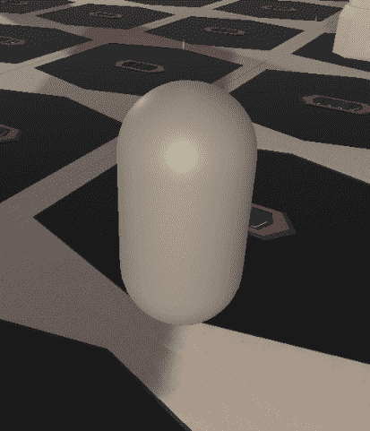

图 8.56 -在光照贴图的预先计算阴影下的动态物体

你可能会认为混合光模式应该同时影响动态和静态物体，而这正是它所做的。 这里的问题是，所有与静态对象相关的内容都预先计算到这些光照贴图纹理中，包括它们投射的阴影，因为我们的胶囊是动态的，所以在执行预计算过程时它并不存在。 因此，在本例中，因为投射阴影的对象是静态的，它的阴影不会影响任何动态对象。

这里，我们有几个解决方案。 第一种方法是改变静态和实时混合算法，让摄像机附近的一切都使用实时照明，避免出现这一问题(至少是在玩家关注的焦点附近)，这将对性能产生很大影响。 另一种选择是使用**光探头**。 当我们烘焙信息时，我们只在光照地图上做了那件事，这意味着我们只在表面上获得光照信息，而不是在空白空间中。 因为我们的玩家是在这些表面之间的空白空间中穿行，所以我们不知道在这些空间中灯光会是什么样子，比如走廊的中间。 Light Probes 是那些空白空间中的一组点，Unity 也在其中预先计算信息，所以当一些动态对象通过它时，它将从中采样信息。 在下图中，你可以看到一些光线探测器已经应用到我们的场景中。 你会注意到阴影里面的那些会变暗，而暴露在光下的那些会有更大的强度。 这个效果将应用于我们的动态对象:

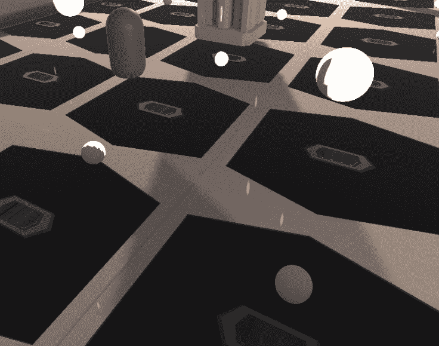

图 8.57 -球体代表光探针

如果你现在移动你的物体穿过场景，它会对阴影做出反应，如下两张图所示，你可以看到一个动态的物体被照亮在被烘烤的阴影之外，而内部是黑暗的:

图 8.58 -动态物体接收来自光探针的烘烤光照

为了创建光探针，做以下工作:

1.  Create a group of **Light** Probes by going to **GameObject** | **Light** | **Light Probe Group**:

    

    图 8.59 -创建光探测组

2.  Fortunately, we have some guidelines on how to locate them. It is recommended to place them where the lighting changes, such as inside and outside shadow borders. However, that is pretty complicated. The simplest and recommended approach is to just drop a grid of Light Probes all over your playable area. To do that, you can simply copy and paste the Light Grid Group several times to cover the entire base:

    

    图 8.60 -光探针网格

3.  Another approach would be to select one group and click the **Edit Light Probes** button to enter Light Probe edit mode:

    

    图 8.61 - Light Probe Group 编辑按钮

4.  点击**Select All**按钮，然后**Duplicate Selected**复制之前存在的所有探测器。
5.  使用翻译小工具，将它们移动到前一个旁边，在这个过程中扩展网格。 考虑到探测器越靠近，你需要覆盖更多的地形，这将产生更多的数据。 然而，光探头的数据相对便宜，所以你可以有很多。
6.  重复*步骤 4*到*步骤 5*直到覆盖整个区域。
7.  使用**照明设置**中的**生成照明**按钮重新生成照明。

这样，你就可以在 Light Probes 上预先计算光照，影响我们的动态对象，将两个世界结合起来，得到有凝聚力的光照。

# 总结

在这一章中，我们讨论了几个照明主题，如 Unity 如何计算灯光，阴影，如何处理不同的光源，如直接和间接照明，如何配置阴影，如何烘烤照明以优化性能， 以及如何将动态和静态照明结合起来，这样灯光就不会与它们所影响的世界脱节。 这是一个很长的章节，但照明值得。 这是一个复杂的主题，可以极大地改善你的场景的外观和感觉，以及戏剧性地降低你的性能。 它需要大量的实践，在这里，我们试图总结所有重要的知识，你将需要开始试验它。 对这个话题要有耐心; 很容易得到不正确的结果，但您可能只需要一个复选框就可以解决它。

现在我们已经改进的场景设置,所有我们可以在下一章,我们将最后一层的图像效果使用统一后处理堆栈,这将全屏图像效果,将给我们的电影外观和感觉现在所有游戏。****