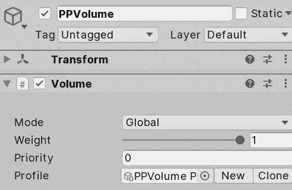
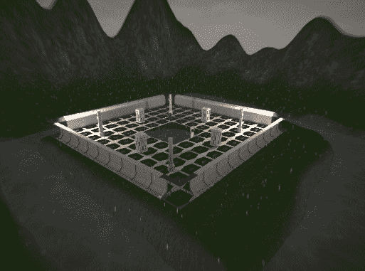

# *第九章*:后处理的全屏效果

到目前为止，我们已经创建了不同的对象来改变我们的场景的视觉效果，如网格、粒子和灯光。 我们可以调整这些对象的设置来提高我们的场景质量，但当你将其与现代游戏场景相比时，你总是会觉得缺少一些东西，那就是全屏或后处理效果。 在本章中，您将学习如何将效果应用到最终渲染的框架，这将改变整个场景的外观。

*   在本章中，我们将研究以下图像效果的概念:
*   使用后处理
*   使用先进的效果

# 使用后处理

**后处理**是一个 Unity 特性，它允许我们在之上应用多个效果(一个效果堆栈)，这将改变图像的最终外观。 每一个都会影响完成的框架，根据不同的标准改变其中的颜色。 在下面的截图中，您可以看到应用图像效果之前和之后的场景。 你会注意到一个戏剧性的变化，但场景的对象没有任何变化，包括灯光、粒子或网格。 应用的效果是基于像素分析。 看看这两个场景:

图 9.1 -一个没有图像效果的场景(左)和一个有效果的场景(右)

的东西之前考虑的后处理方法,**后处理堆栈版本 2**(**PPv2)不会工作**普遍呈现管道**(【显示】URP**); 它有自己的后处理实现，所以我们将在本章中看到它。 无论如何，它们非常相似，所以即使你使用 PPv2，你仍然可以从本章中得到的一些东西。

在本节中，我们将讨论以下 URP 后处理的概念:

*   设置配置文件
*   使用基本的影响

让我们开始准备我们的场景应用效果。

## 设置配置文件

要开始应用效果，我们需要创建一个**配置文件**，它是一个包含我们想要应用的所有效果和设置的资产。 这是一个分离的资产，因为我们可以在不同的场景和场景的部分共享相同的后处理配置文件。 当我们提到场景的某些部分时，我们指的是应用了某些效果的游戏体量或区域。 我们可以定义一个全局区域来应用效果，而不管玩家的位置，或者我们可以应用不同的效果——例如，当我们在室外或室内时。

在这种情况下，我们将使用一个全局卷，我们将使用它来应用我们的第一个效果，通过执行以下操作:

1.  创建一个新的空游戏对象(T0)(游戏对象|**创建空**)。
2.  命名为**PP 卷**(意为后处理卷)。
3.  添加**Volume**组件。
4.  确保**模式**设置为**全局**。
5.  Click on the **New** button at the right of the **Profile** setting, which will generate a new Profile Asset named like our object (PPVolume Profile). You can later move that to its own folder, which is recommended for Asset organization purposes. The process is illustrated in the following screenshot:

    

    图 9.2 -卷组件

6.  为了测试音量是否有效，让我们添加一个效果。 点击**添加覆盖**按钮，然后选择**后处理**|**色差**选项。
7.  Check the **Intensity** checkbox in the **Chromatic Aberration** effect and set the intensity to **0.5**, as illustrated in the following screenshot:

    

    图 9.3 - C 色差效应

8.  Now, you will see an aberration effect being applied in the corners of the image. Remember to look at this in the Scene Panel; we will apply the effect to the Game View in the next step. This is illustrated in the following screenshot:

    

    图 9.4 -应用于场景的色差

9.  现在,如果你点击**,看到游戏的观点**主要摄像头,你会发现效果不是被应用,因为我们需要检查后处理复选框**,在【显示】**呈现部分我们的**主要摄像头,见以下截图:**********

 ******

图 9.5 -启用后处理

所以，我们已经创建了一个全局卷，它将应用指定的效果覆盖到整个场景，而不管玩家的位置。

现在我们已经准备好了我们的场景使用后处理，我们可以开始试验不同的效果。 让我们在下一节中从最简单的开始。

## 使用基础效果

现在我们已经在我们的场景中进行了后处理，唯一需要做的就是开始添加效果并设置它们，直到我们得到想要的外观和感觉。 为了做到这一点，让我们探索系统中包含的几个简单效果。

让我们从**色差**开始，我们刚刚使用的那个，它和大多数图像效果一样，试图复制特定的现实生活效果。 所有的游戏引擎渲染系统都使用了一个简单的数学近似，即人眼视觉是如何工作的，正因为如此，我们无法在人眼或相机镜头中看到一些效果。 一个真实的相机镜头通过弯曲光线来指向相机传感器，但这种弯曲在某些镜头中并不完美(有时是故意的)，因此，你可以看到一个失真，如下面的截图所示:

图 9.6 -无色差的图像(左)和同一张有色差的图像(右)

这种效果将是我们在游戏中添加的几种效果之一，以产生电影般的感觉，模拟真实摄像机的使用。 当然，这种效果并不适用于所有类型的游戏; 也许简单的卡通风格并不能从中受益，但你永远不知道:艺术是主观的，所以这是一个反复尝试的问题。

此外，我们在前面的例子中稍微夸大了强度，以使效果更明显，但我建议在这个场景中使用 0.25 的强度。 通常建议温和的效果强度; 它很容易产生强烈的效果，但由于你将添加许多它们，一段时间后图像将变得臃肿，有太多的扭曲。 所以，尝试添加一些微妙的效果，而不是一些强烈的效果。 但是，再次强调，这取决于你所寻找的目标风格; 这里没有绝对的真理(但常识仍然适用)。

最后,在继续讨论其他影响之前,如果你习惯于使用其他类型的后处理效果框架,您将注意到这个版本的色差少了设置,这是因为 URP 版本寻求性能,所以它将尽可能简单。

我们接下来要讨论的效果是**Vignette**。 这是相机镜头的另一个缺陷，成像强度在镜头边缘丢失。 这不仅可以用于模拟旧相机，还可以用于将用户的注意力吸引到相机的中心——例如，在电影播放期间。 此外，如果你正在开发**虚拟现实**(**VR**)应用程序，这可以通过减少玩家的周边视觉来减少晕动病。 在下面的截图中，你可以看到一个旧相机上的晕渲例子:

图 9.7 -用旧相机拍摄，边缘有晕渲

为了尝试一下，让我们按照下面的步骤给我们的场景添加一些晕渲:

1.  选择**PP Volume**游戏对象。
2.  点击**Add Override**按钮，添加**后处理**|**Vignette**效果。
3.  选中**强度**复选框，将其设置为**0.3**，增加效果。
4.  勾选**平滑**复选框，将其设置为**0.5**; 这将增加这种影响的传播。 结果如下图所示:

图 9.8 -小插图效果

如果您愿意，您可以通过检查**color**复选框并将其设置为另一个值来更改颜色; 在我们的例子中，黑色可以加强雨天环境。 在这里，我邀请您检查其他属性，如**中心**和**圆角**，如何作为**粒子**工作。 您可以创建良好的效果，只是玩弄的价值。

我们将在基础部分回顾的另一个效果是**运动模糊**，同样，它模拟了相机的工作方式。 相机有曝光时间，即它需要捕捉光子来获得每一帧图像的时间。 当一个物体移动得足够快时，同一物体在短暂的曝光时间内被放置在不同的位置，因此它会显得模糊。 在下面的截图中，你可以看到应用到我们场景中的效果。 在这张图片的情况下，我们正在快速地上下旋转相机，结果如下:

图 9.9 动态模糊应用于我们的场景

需要考虑的一件事是，这个模糊将只适用于相机的运动，而不是对象的运动(静止的相机，移动的对象)，因为这个 URP 还不支持运动矢量。

为了使用这种效果，遵循以下步骤:

1.  添加**后处理**|**运动模糊**覆盖与**添加覆盖**按钮。
2.  选中**强度**复选框，并将其设置为**0.5**。
3.  在看到游戏视图(不是场景视图)时旋转摄像机。 您可以点击并拖动相机的**变换**的**X**属性(不是值——**X**标签)，如下截图所示:

图 9.10 -改变旋转

正如你所看到的，这个效果在场景视图中是看不到的，还有其他的效果，所以在结论效果不起作用之前要考虑到这一点。 Unity 之所以能够做到这一点，是因为当它在场景中工作时，它将会非常烦人。

最后，我们将简要讨论最后两个简单的效果，**胶片纹理**和**白平衡**。 第一个很简单:添加它，将强度设置为 1，你就会得到老电影中著名的纹理效果。 您可以将**Type**设置为不同的大小，使其更细微或更明显。 白平衡允许你改变颜色温度，使颜色变暖或变冷，这取决于你如何配置它。 在我们的例子中，我们是在一个寒冷的黑暗场景中工作，所以你可以添加它并将温度设置为-20 来稍微调整外观，并在这种场景中改善外观和感觉。

现在我们已经看到了一些简单的效果，让我们来看看剩下的一些受一些高级渲染特性影响的效果。

# 使用高级效果

我们将在这一节中看到的效果与之前的没有太大区别; 他们只是一个有点棘手，需要一些背景知识来正确使用他们。 所以，让我们深入研究它们吧!

在这一节中，我们将去看看先进的效果概念

**高动态范围**(**HDR**)和深度图。

## 高级效果

让我们从讨论这些效果正常工作的一些要求开始。

### HDR 和 Depth Map

有些效果不仅适用于渲染的图像，而且还需要额外的数据。 我们可以先讨论**Depth Map**，这是我们在前一章已经讨论过的概念。 回顾一下，深度图是从相机的角度渲染的图像，但它不是生成场景的最终图像，而是渲染场景对象的深度，以灰色阴影渲染对象。 颜色越深，像素距离相机越远，反之亦然。 在下面的截图中，你可以看到一个深度图的例子:

图 9.11 -一些原始形状的深度图

我们会看到一些效果,如**景深**,将模糊图像的某些部分基于相机的距离,但它可以用于多个目的定制的影响(而不是在基地 URP 包)。

这里要讨论的另一个概念是 HDR，它将改变颜色的处理方式，从而改变一些效果的工作方式。 在旧硬件中，颜色通道(红色、绿色和蓝色)在 0 到 1 范围内编码，0 表示无强度，1 表示全强度(每个通道)，所以所有的光照和颜色计算都在这个范围内完成。 这看起来不错，但并不能反映光的实际工作原理。 你可以看到完整的白色(所有频道设置为 1)在一张纸上被阳光点燃,你可以看到完整的白色当你直视一个灯泡,但即使光和纸都是相同的颜色,后者将,首先,刺激眼睛一会儿,其次,会有一些 overglow 由于过度的光。 这里的问题是,最大值(1)并不足以代表了最强烈的颜色,所以如果你有一个高强度光,另一个更强度,都将产生同样的颜色在每个通道(1)因为计算不能更进一步比 1。 因此，这就是创建**HDR 渲染**的原因。

HDR 是一种颜色超过 0.1 范围的方式，因此基于颜色强度工作的照明和效果在这种模式下有更好的精度。 是同样的想法具有相同名称的新电视的功能,尽管在这种情况下,统一将 HDR 的计算,但是最终的图像仍然使用以前的颜色空间(0 到 1,或**低动态范围(异地恋**),所以不要混淆统一**HDR 呈现**与**显示的 HDR**。 为了将 HDR 计算转换回 LDR, Unity(还有电视)使用了一个名为**的**映射的概念。 你可以在下面的截图中看到一个 ldr 渲染的场景和在 HDR 场景中使用的映射的例子:

图 9.12 -一个 ldr 渲染的场景(左)和一个 HDR 场景，使用 tonemapping 修正过亮(右)

Tonemapping 是一种将 0.1 范围外的颜色带回到它的方法。 它基本上使用一些公式和曲线来确定每个颜色通道应该如何映射回去。 你可以在典型的从暗到亮的场景过渡中清楚地看到这一点，比如当你离开没有窗户的建筑进入明亮的一天。 有一段时间，你会发现一切都变轻了，直到一切恢复正常。 这里的想法是，当你在建筑内部或外部时，计算并没有不同; 建筑内部的白色墙的颜色将接近 1 强度，而相同的白色外墙将有更高的值(由于阳光)。 不同之处在于，当你在建筑外时，tonmapping 会将高于 1 的颜色恢复为 1，如果所有场景都更暗，它可能会增加室内墙壁的照明，这取决于你如何设置它。

即使 HDR 在默认情况下是启用的，让我们看看如何检查它，通过执行以下操作:

1.  转到**编辑**|**项目设置**。
2.  点击左边面板的**图形设置**部分。
3.  点击**脚本渲染管道设置**属性下引用的资产。
4.  单击 Project Panel 中高亮显示的资产。 在单击**图形**设置中的属性之前，确保该面板是可见的。
5.  在**质量**部分，检查**HDR**，如下截图所示:

图 9.13 -启用 HDR

当然，HDR 是可切换的这一事实意味着在某些情况下您不想使用它。 您可以猜到，并非所有硬件都支持 HDR，使用它会带来性能开销，因此要考虑这一点。 幸运的是，大多数效果同时适用于 HDR 和 LDR 颜色范围，所以如果你启用了 HDR 但用户设备不支持它，你不会得到任何错误，只会得到不同的结果。

现在我们确定已经启用了 HDR，让我们来探索一些使用 HDR 和深度映射的高级效果。

让我们从常用的 Bloom 开始，看看使用前面描述的技术的某些效果。 这种效果，像往常一样，模拟发生在相机镜头甚至人眼周围的强光。 在下面的截图中，你可以看到我们场景的默认版本和夸张的 Bloom 版本之间的区别。 你可以观察到效果是如何只应用于我们的场景中最亮的区域。 看看这两种效果:

图 9.14 -默认场景(左)和带有高强度 Bloom 的相同场景(右)

这种效果实际上是非常常见和简单的，但我认为它是先进的，因为结果受到 HDR 的巨大影响。 这种效果依赖于计算每个像素的颜色强度来检测可以应用它的区域。 在 LDR 中，我们可以有一个白色的物体，它实际上并不是过亮的，但由于这个颜色范围的限制，Bloom 可能会导致它过亮。 在HDR 中，由于它增加了颜色范围，我们可以检测到一个物体是白色的，或者这个物体可能是浅蓝色但过于明亮，产生它是白色的错觉(例如一个高强度灯附近的物体)。 在下面的截图中，你可以看到有 HDR 和没有 HDR 场景之间的区别。 您会注意到，LDR 版本在不一定是过亮的区域会有 overglow。 差别可能非常细微，但要注意细微的细节来注意差别。 记住，我在这里夸大了效果。 看看这两个场景:

图 9.15 - Bloom 在 LDR 场景(左)和 Bloom 在 HDR 场景(右) 请注意，Bloom 设置已被更改，以尝试尽可能接近它们

现在，让我们继续使用 HDR 版本的场景。 为了启用 Bloom，请执行以下操作:

1.  像往常一样，将**Bloom**覆盖添加到配置文件中。
2.  选中**Intensity**复选框，并将其值设置为**1.5**。 这将控制应用多少 overglow。
3.  使能**门限**，设置为**0.7**。 这个值表示一个颜色需要考虑的最小亮度。 在我们的例子中，我们的场景有点暗，所以我们需要在 Bloom 效果设置中减少这个值，以包含更多的像素。 与往常一样，这些值需要根据您的特定场景进行调整。
4.  你会注意到差别是非常细微的，但是再次，记住你将会有几个影响，所以所有这些细微的差别将会总结。 你可以在下面的截图中看到这两种效果:

图 9.16 -布鲁姆效应

像往常一样，建议您修改其他值。 我推荐你测试一些有趣的设置:**污垢纹理**和**污垢强度**值。

现在，让我们来看看另一个常见的效果，**景深**。 这个依赖于我们之前讨论过的深度地图。 它对肉眼不是那么明显，但当你聚焦在你视线内的一个物体上时，周围的物体变得模糊，因为它们失去了焦点。 我们可以利用这一点在游戏玩法的关键时刻吸引玩家的注意力。 这个效果将采样深度图，看看对象是否在焦点范围内; 如果是，则不会应用模糊，反之亦然。 为了使用它，做以下:

1.  This effect depends on the camera positioning of your game. To test it, in this case, we will put the camera near a column to try to focus on that specific object, as illustrated in the following screenshot:

    

    图 9.17 -摄像机定位

2.  添加**景深**覆盖。
3.  启用并设置**模式**设置为**高斯**:最简单的一种。
4.  在我的例子中,我将开始****10**和**【5】**20**,这将使效果开始在【显示】距离背后的目标对象。 **结束**设置将控制模糊的强度如何增加，在 20 米的距离达到最大值。 记住根据您的情况调整这些值。****
***   如果你想放大一点效果，设置**最大半径**为**1.5**。 结果如下图所示:**

 **

图 9.18 -夸张的效果

考虑的东西是我们的特定的游戏会有一个自上而下的角度来看,与第一人称相机不同,在那里你可以看到远处的物体,在这里我们将对象不足以没有注意到效果,所以我们可以限制这种效果只是为了游戏动画的使用在我们的场景中。

现在，大多数剩余的效果是改变场景实际颜色的不同方式。 他们的想法是，真实的颜色有时不会给你你想要的确切的外观和感觉。 也许你需要将黑暗区域变得更黑暗以强化恐怖氛围的感觉，或者你想做相反的事:增加黑暗区域的亮度来代表一个开放场景。 如果你是在创造一款未来主义游戏，你可能会想要赋予高光一些颜色以获得霓虹效果，或者你可能想要一种暂时的棕褐色效果来实现闪回。 我们有很多方法可以做到这一点，在本例中，我将使用一个简单而强大的效果**阴影、中调、高光**。

这个效果将应用不同的颜色校正到井-阴影，中间色调，和高光，这意味着我们可以修改深，亮，和中等区域分别。 让我们通过以下步骤来尝试一下:

1.  添加**阴影，中间色调，高光**覆盖。
2.  让我们开始做一些测试。 勾选三个**阴影**、**中间色调**和**高光**复选框。
3.  Move the **Shadow** and **Midtones** sliders all the way to the left and the one for **Highlights** to the right. This will reduce the intensity of Shadows and Midtones and increase the intensity of Highlights. We did this so that you can see the areas that **Highlights** will alter, based on their intensity (this can also be an interesting effect in a horror game). You can do the same with the rest of the sliders to check the other two areas. You can see the result in the following screenshot:

    

    图 9.19 -隔离亮点

4.  Also, you can test moving the white circle at the center of the colored circle to apply a little bit of tinting to those areas. Reduce the intensity of the highlights by moving the slider a little bit to the left to make the tinting more noticeable. You can see the result in the following screenshot:

    

    图 9.20 -突出显示

5.  By doing this, you can explore how those controls work, but of course, those extreme values are useful for some edge cases. In our scene, the settings you can see in the following screenshot worked best for me. As always, it is better to use subtler values to not distort too much the original result, as illustrated here:

    

    图 9.21 -细微的改变

6.  你可以在下面的截图中看到前后效果:

图 9.22 -前后效果

你有其他更简单的选择**等分裂塑身**,也会做类似的事情,但只是阴影并突出,或**颜色曲线,给你先进控制的每个场景的颜色通道将被映射,但这个想法是一样, 改变产生的场景的实际颜色，为你的场景应用一个特定的颜色氛围。 如果你还记得电影系列*《黑客帝国》，*当角色在《黑客帝国》中的时候，一切都是淡淡的绿色，而外面的色调是蓝色。**

记住,使用 HDR 和不使用它的结果对这些影响是很重要的,所以最好是迟早决定是否使用 HDR,排除某些目标平台(也许并不重要,你的目标受众),或不使用(使用异地恋)和更少的控制你的场景照明水平。

此外，要考虑到你可能需要调整一些对象的设置，比如光的强度和材质属性，因为有时我们使用后处理来修复由错误设置的对象引起的图形错误，这是不好的。 例如，在我们的场景中增加环境照明将大大改变效果的输出，我们可以使用它来增加整体亮度，而不是使用一个效果，如果我们发现场景太暗。

这已经涵盖了使用的主要图像效果。 记住，你的想法不是使用每一个人，而是使用那些你认为对你的场景有贡献的人; 它们在性能方面不是免费的(尽管不是资源密集型的)，所以要明智地使用它们。 此外，你还可以查看已经创建的配置文件，并将其应用到你的游戏中，看看小小的改变会产生多大的不同。

# 总结

在这一章中，我们讨论了应用在我们的场景中的基本和先进的全屏效果，使它在相机镜头效果方面看起来更真实，在颜色扭曲方面更时尚。 我们还讨论了 HDR 和 Depth Maps 的内部机制，以及它们在使用这些效果时的重要性，它们能够以最小的努力立即提高游戏的图像质量。

现在我们已经讨论了 Unity 系统中的大多数常见图形，让我们开始看看如何使用声音来增加场景的沉浸感。********