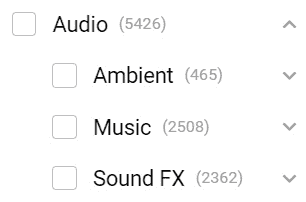
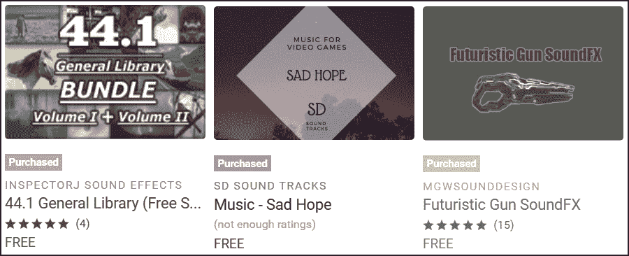
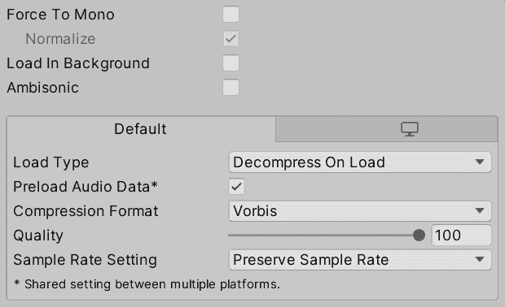
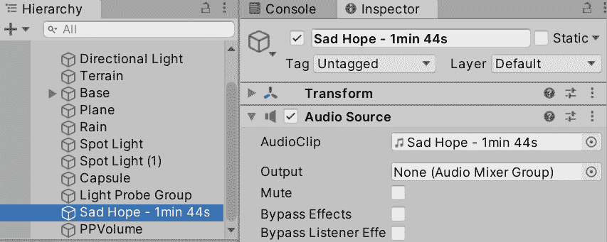
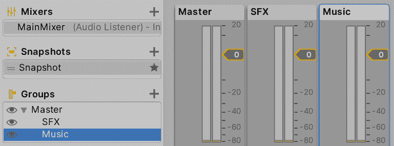
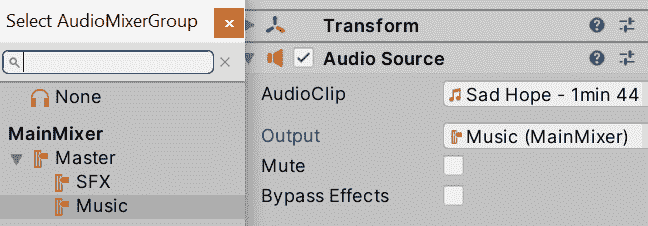
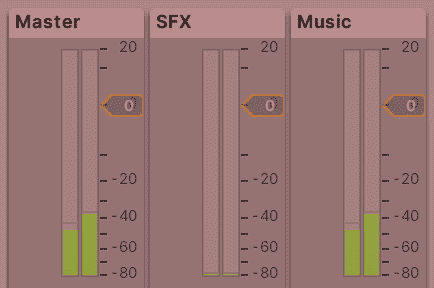
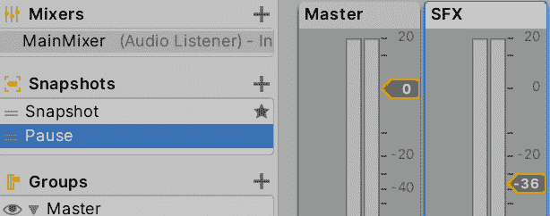
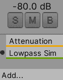
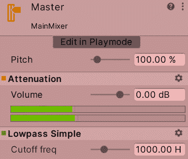

# 十、声音与音乐的融合

我们刚刚获得了足够好的图像质量，但我们缺少游戏美学的一个重要部分:声音。 声音通常是游戏开发的最后一步，如果声音存在，你就不会注意到它的存在，但如果声音不存在，你就会觉得缺失了什么。 它将帮助你强化你想要的游戏氛围，并且必须与图像设置相匹配。

在本章中，我们将研究以下健全的概念:

*   导入音频
*   集成和混合音频

# 导入音频

与图像素材一样，正确设置音频素材的导入设置非常重要，如果操作不当，这可能会耗费大量资源。

在本节中，我们将研究以下音频导入概念:

*   音频类型
*   配置导入设置

让我们从讨论我们可以使用的不同类型的音频开始。

## 音频类型

电子游戏中存在不同类型的音频，如下:

*   **音乐**:根据情况提升玩家体验的音乐。
*   **音效(SFX)**:是对玩家或 NPC 行动的反应，如点击按钮、行走、开门和射击。
*   **环境声音**:如果游戏中只有声音作为对事件的反应，那么它会让人感到空虚。 如果你重新创建一个公寓在中间的城市,即使玩家只是空闲的房间做,很多听起来应该听到了,和大多数人的来源将外面的房间,如飞机飞行的开销,一个建筑工地两个街区,在街上和汽车。 创建看不到的对象是一种资源浪费。 相反地，我们可以在整个场景中放置不同的声音来重新创造理想的氛围，但这将是资源密集型的，需要大量 CPU 和 RAM 来实现可信的结果。 考虑到这些声音通常位于用户注意力的第二层面，我们可以将它们合并成一个循环音轨，只播放一个音频，这就是环境声音。 如果你想创建一个 café场景，你可以去一个真正的 café并记录几分钟的音频，使用它作为你的环境声音。

对于几乎所有的游戏，我们都需要至少一个音乐轨道，一个环境轨道和几个 SFX 来开始音频制作。 与往常一样，我们拥有不同的音频素材来源，但我们将使用素材商店。 它有三个音频类别来搜索我们需要的素材:

图 10.1 -素材存储中的音频类别

在我的例子中，我还使用搜索栏进一步过滤类别，通过搜索天气来寻找降雨效果。 有时，你无法单独找到准确的音频; 在这种情况下，您将需要挖掘**包和**库，所以请耐心等待。 在我的例子中，我选择了如下图中所示的三个包，但是只导入其中的一些声音，它们在项目中都很重要。 为了营造气氛，我选择了雨。 然后，我选择了**Music - Sad Hope**作为音乐，而对于 SFX，我选择了一个枪支声音效果包作为我们未来的玩家英雄角色。 当然，你也可以选择其他更适合游戏需求的包:

图 10.2 -我们的游戏包

请记住，这些确切的软件包可能在您读这篇文章的时候无法获得。 在这种情况下，您可以下载其他文件，或者从 GitHub 回购选择我使用的文件。 现在我们已经有了必要的音频包，让我们讨论如何导入它们。

## 配置导入设置

我们有几个导入设置可以调整，但问题是我们需要考虑使用音频来正确设置它，所以让我们看看每种情况下的理想设置。 为了看到导入设置，和往常一样，你可以选择素材并在检查器面板中看到它，如下截图所示:

图 10.3 -音频导入设置

让我们讨论一下最重要的，从**Force To Mono**开始。 有些音频可能带有立体声通道，这意味着我们的左耳有一个声音，右耳有另一个声音。 这意味着一段音频实际上可以包含两个不同的音轨。 立体声对于不同的效果和乐器空间化在音乐中是有用的，所以我们希望在这些情况下，但在其他情况下，立体声是没用的。 考虑一下 3D 音效，如射击声或一些步行步骤。 在这些情况下，我们需要声音在方向被听到。 如果枪声发生在我的左边，我需要听到它从我的左边传来。 在这些情况下，我们可以通过检查音频导入设置中的**Force to mono**复选框将立体声音频转换为单声道音频。 这将使 Unity 将两个通道合并为一个，并将音频的大小缩小到原来的一半(有时更大，有时更小，取决于不同方面)。

你可以在音频素材检查器的底部验证该设置和其他设置的影响，在那里你可以看到导入的音频大小:

图 10.4 -左:音频导入没有强制到 Mono。 右图:与 Force To Mono 相同的音频

下一个要讨论的设置，也是其中一个重要的设置，是**负载类型**。 为了播放一些音频，Unity 需要从磁盘中读取音频，解压，然后播放。 Load Type 改变了这三个进程的处理方式。 我们有以下三种选择:

*   **Load 上解压**:内存最密集的选项。 这个模式将使 Unity 在场景加载时将未压缩的音频加载到内存中。 这意味着音频将在 RAM 中占用大量空间，因为我们已经加载了未压缩版本。 使用这种模式的优点是，播放音频更容易，因为我们有原始音频数据准备在 RAM 中播放。
*   **流**:与**Load 上解压**完全相反。 这种模式从不在 RAM 中加载音频。 相反地，当音频播放时，Unity 从磁盘读取一段音频素材，解压它，播放它，并重复，为**流**播放的每一段音频运行此过程一次。 这意味着该模式将是 CPU 密集型的，但将消耗几乎为零字节的 RAM。
*   **内存压缩**:介于两者之间。 当场景加载时，该模式将从磁盘加载音频，但将其压缩在内存中。 当 Unity 需要播放音频时，它会从 RAM 中取出一个片段，解压并播放。 记住，从 RAM 中读取音频素材要比从磁盘中读取快得多。

也许如果你是一名经验丰富的开发者，你可以很容易地判断哪种模式更适合哪种音频，但如果这是你第一次接触电子游戏，这听起来可能会令人困惑，所以让我们来讨论针对不同情况的最佳模式:

*   **频繁的短音频**:这可能是枪声或脚步声，这是持续不到 1 秒的声音，但可以出现在多个实例中，并在同时播放。 在这种情况下，我们可以使用 Decompress On Load。 未压缩的短音频与其压缩版本不会有很大的大小差异。 此外，由于这是最具性能的 CPU 选项，拥有多个实例不会对性能产生巨大影响。
*   **不频繁的大音频**:包括音乐、环境声音和对话。 这些类型的音频通常只播放一个实例，而且通常很大。 这些情况更适合流模式，因为在 RAM 中压缩或解压它们对低端设备(如移动设备)有巨大的影响(在 pc 上，我们有时可以使用压缩在内存中)。 CPU 可以处理两个或三个比特的音频播放流，但尽量不要超过这个。
*   **频繁中音频**:这包括预制语音聊天对话框在多人游戏中,角色表情,爆炸,或任何音频超过 500 KB(即不是一个严格的规则——这个数字在很大程度上取决于目标设备)。 在 RAM 中解压这类音频可能会对性能产生显著影响，但由于这类音频的使用相当频繁，我们可以在内存中压缩它。 它们相对较小的大小意味着它们通常不会对我们的游戏产生太大的影响，我们将避免在从磁盘读取时浪费 CPU 资源。

还有其他情况需要考虑，但这些情况可以根据前面的情况进行推断。 记住，之前的分析是基于标准游戏的要求，但这可能会根据你的游戏和目标设备而发生很大变化。 也许你正在制作一款不会消耗大量 RAM 但却需要大量 CPU 资源的游戏，在这种情况下你可以将所有内容都放在 Load 上解压。 你必须考虑游戏的各个方面，并相应地平衡你的资源。

最后，需要考虑的另一件事是压缩格式，这将改变 Unity 在已发行游戏中编码音频的方式。 不同的压缩格式将给出不同的压缩比，以换取与原始音频的较低保真度，或更高的解压时间，所有这些都根据音频模式和长度有很大的变化。 我们有三种压缩格式:

*   **PCM**:未压缩的格式将提供最高的音频质量，没有噪声干扰，但会导致更大的素材文件大小。
*   **ADPCM**:以这种方式压缩音频可以减少文件大小，并产生一个快速的解压缩过程，但这可能会在某些类型的音频中引入明显的噪声伪影。
*   **Vorbis**:一种高质量的压缩格式，几乎不会产生任何工件，但需要更长的解压时间，因此 Vorbis 音频播放比其他格式稍微密集一些。 它还提供了一个质量滑块来选择精确的压缩强度。

你应该使用哪一个? 再次强调，这取决于音频的功能。 短平滑音频可以使用 PCM，长噪声音频可以使用 ADPCM; 这种格式引入的工件将隐藏在音频本身中。 也许使用 Vorbis 可以使压缩失真明显的长平滑音频受益。 有时候，这只是一个尝试和错误的问题。 可能在默认情况下使用 Vorbis，当性能降低时，尝试切换到 ADPCM，如果这会导致故障，就切换到 PCM。 当然,这里的问题是确保音频处理是真正负责性能问题是什么——也许所有音频切换到 ADPCM 和检查是否使一个差异是一个很好的方法来检测,但更好的方法是使用分析器, 我们将在本书后面看到一个性能度量工具。

我们还有其他设置，比如采样率设置，同样，通过一些尝试和错误，你可以使用它来检测最佳设置。

我已经设置了从 Asset Store 下载的音频，如下截图所示。 第一个展示了我如何设置音乐和环境音频文件(大文件):

图 10.5 -音乐和环境设置

应该是立体声(Force To Mono unchecked)，使用**流负载类型**，因为它们很大，将只有一个实例播放**ADPCM 压缩格式**，因为 Vorbis 没有导致巨大的大小差异。

第二个截图显示了我如何设置 SFX 文件(小文件):

图 10.6 -拍摄 SFX 设置

将是 3D 声音，所以 Force To Mono 应该检查.. 将是短的，所以在负载负载类型上解压工作更好。 Vorbis 压缩格式将 ADPCM 的大小减少了一半以上

现在我们已经正确配置了音频片段，我们可以开始在场景中使用它们。

# 集成和混音

我们可以将一些音频拖到场景中开始使用它，但我们可以进一步挖掘，探索将它们配置到每个可能场景的最佳方法。

在本节中，我们将研究以下音频集成概念:

*   使用 2D 和 3D AudioSources
*   使用音频混合器

让我们开始探索 AudioSources，即负责音频播放的对象。

## 使用 2D 和 3D AudioSources

**AudioSources**是可以附加到游戏对象的组件。 他们负责在我们的游戏中基于**AudioClips**发出声音，这是我们之前下载的音频素材。 区分一个 AudioClip 和一个**AudioSource**是很重要的:我们可以有一个单一的爆炸 AudioClip，但是有很多 AudioSource 在播放它，模拟几个爆炸。 这样，一个 AudioSource 可以被视为一个 AudioClip 的实例。

创建**AudioSource**最简单的方法是选择**AudioClip**(一个音频素材)并将其拖动到**Hierarchy**窗口。 尽量避免将音频拖拽到现有对象中; 相反,拖动对象之间,所以统一将创建一个新对象的**AudioSource**,而不是将其添加到现有的对象(有时,你想要一个现有对象的【显示】AudioSource,但现在让我们让事情变得简单):

图 10.7 -拖动 AudioClip 到对象之间的层次结构窗口

下面的截图显示了通过拖动音乐素材到场景中生成的**AudioSource**。 你可以看到，**AudioClip**字段有一个引用拖动的音频:

图 10.8 - AudioSource 配置为播放我们的音乐素材

正如你所看到的，**AudioSource**有几个设置，所以让我们在下面的列表中回顾一下常见的设置:

*   **Play On Awake**:判断游戏开始时音频是否自动开始播放。 我们可以取消这一选项，并通过脚本来播放音频，也许是在玩家射击或跳跃时。
*   **循环**:播放完毕自动重复播放。 记住始终在音乐和环境音频剪辑上检查此设置。 我们很容易忘记这一点，因为这些轨迹很长，在测试中我们可能永远也达不到它们的终点。
*   **音量**:控制音频强度。
*   **音高**:控制声速。 这对于模拟慢动作或发动机不断增加的转数等效果很有用。
*   **空间混合**:控制音频是 2D 还是 3D。 在 2D 模式下，在任何距离听到的声音都是相同的音量，而 3D 模式下，随着距离相机距离的增加，声音的音量会逐渐减小。

在我们的音乐轨道的情况下，我已经配置它如下面的截图所示。 你可以拖动环境雨的声音添加到场景中，并使用相同的设置，因为我们希望在所有场景中都有相同的环境效果。 然而，在复杂的场景中，你可以在场景中分散不同的 3D 环境声音，以根据当前环境改变声音:

图 10.9 -音乐和环境设置 这将循环，设置为在 Awake 上播放，并且是 2D 的

现在，您可以拖动拍摄效果，并配置如下截图所示。 正如你所看到的，在这种情况下，音频不会循环，因为我们希望每个子弹只播放一次射击效果。 记住，在我们的例子中，子弹将是一个预制件，我们每次按下射击键时都会生成它，所以每个子弹都有自己的**AudioSource**，在子弹创建时播放。 此外，子弹被设置为 3D**空间混合**，这意味着效果将通过不同的扬声器传输，基于音频源相对于摄像头的位置:

图 10.10 -音效设置 这不会循环，是一个 3D 声音

在 3D 声音的情况下，需要考虑的是**音量翻转**设置，它位于 3D 声音设置部分。 这个设置控制音量如何随着距离相机的距离衰减。 默认情况下,您可以看到,这个设置被设置为**对数滚边,真实声音的工作方式,但有时你不想真实声音衰减,因为在现实生活中通常听到的声音略微即使源非常遥远。**

 **一种选择是切换到**线性滚转**，并配置精确的最大距离**最大距离**设置:

图 10.11 -使用 Linear Rolloff 制作的 3D 声音，最大距离为 10 米

现在我们可以配置单个音频片段，让我们看看如何使用**audio Mixer**将效果应用到音频实例组中。

## 使用音频搅拌机

我们将在游戏中设置多个音频实例:角色的脚步声，射击，篝火，爆炸，雨声等等。 控制哪些声音应该是声音响亮或低根据情况和应用效果加强某些情况下,如被击晕由于附近爆炸,称为音频混合,混合过程中几个听起来在一个有凝聚力和可控的方式。

在 Unity 中，我们可以创建一个 Audio Mixer，这是我们可以用来定义声音组的素材。 对一个组的所有更改都会影响其中的所有声音，可能是通过提高或降低音量，或者应用一个效果。 您可以使用 SFX 和音乐组来分别控制声音——例如，您可以在**Pause**菜单中降低 SFX 音量，但不能降低音乐音量。 此外，组是在一个层次结构中组织的，其中一个组还可以包含其他组，因此组中的更改也将应用到其子组。 事实上，你所创建的每个组都是主组的子组，主组将影响游戏中的每一个声音(使用混合器)。

让我们创建一个混合 SFX 和音乐组:

1.  在项目窗口中，使用**+**按钮，选择**Audio Mixer**选项。 如你所愿为素材命名; 在我的例子中，我选择了**Main Mixer**。
2.  Double-click the created asset to open the **Audio Mixer** window:

    

    图 10.12 -音频混频器窗口

3.  Click the **+** button at the right of the **Groups** label to create a child group of the master node. Name it **SFX**:

    

    图 10.13 -组创建

4.  Click on the **Master** group and click again on the **+** button to create another master node child group called **Music**. Remember to select the **Master** group before clicking the **+** button, because if another group is selected, the new group will be a child of that one. Anyway, you can rearrange a group child-parent relationship by dragging in the **Hierarchy** window:

    

    图 10.14 - Master, SFX 和 Music 组

5.  在**Hierarchy**窗口中选择**Music**GameObject，在 Inspector 窗口中寻找**AudioSource**组件。
6.  Click the circle to the right of the **Output** property and select the **Music** group in the **Audio Mixer** group selector. This will make that **AudioSource** be affected by the settings on the specified Mixer group:

    

    图 10.15 -制作一个 AudioSource 属于一个 Audio Mixer 组

7.  If you play the game now, you can see how the volume meters in the Audio Mixer start to move, indicating that the music is going through the **Music** group. You will also see that the **Master** group volume meter is also moving, indicating that the sound that is passing through the **Music** group is also passing through the **Master** group (the parent of the Music group) before going to the sound card of your computer:

    

    图 10.16 -组卷级别

8.  重复*步骤 5*和*步骤 6*，使环境音和射击音属于**SFX**组。

现在我们已经将声音分成组，我们可以开始调整组的设置。 但是，在这样做之前，我们需要考虑到这样一个事实，我们不希望总是使用相同的设置，就像前面提到的暂停菜单的情况，在那里 SFX 音量应该更低。 为了处理这些场景，我们可以创建快照，这是混合器的预置，可以在游戏过程中通过脚本激活。 我们将在本书的第 3 部分中处理脚本步骤，但我们可以为游戏内设置创建一个普通快照，为暂停菜单设置创建一个暂停快照。

如果您检查**Snapshots**列表，您将看到已经创建了单个快照—这可能是我们的普通快照。 因此，让我们通过以下步骤来创建一个暂停快照:

1.  Click on the **+** button to the right of the **Snapshots** label and call the snapshot **Pause**. Remember to stop the game to edit the mixer or click the **Edit in Playmode** option to allow Unity to change the mixer during play. If you do the latter, remember that the changes will persist when you stop the game, unlike changes to GameObjects. Actually, if you change other assets during Play mode, those changes will also persist – only GameObject changes are reverted (and some other specific cases that we won't discuss right now):

    

    图 10.17 -快照创建

2.  Select the **Pause** snapshot and lower the volume slider of the **SFX** group:

    

    图 10.18 -降低 Pause 快照的音量

3.  玩游戏，听听声音如何仍然在它的正常音量。 这是因为原始快照是默认的—您可以通过检查其右边的星星看到这一点。 您可以右键单击任何快照，并使用**设置为开始快照**选项将其设置为默认快照。
4.  在运行时点击**播放模式**中的**编辑至启用**音频混音**修改。**
5.  点击**暂停**快照使能，听**拍摄**和**环境**的音量如何降低。

如您所见，混音器的主要用途之一是控制组音量，特别是当您看到组的音量强度超过 0 标记时，表明组太响了。 不管怎样，对于混合器还有其他的用途，比如应用效果。 如果你玩过任何战争游戏，你就会注意到，每当炸弹在附近爆炸时，你会在一瞬间听到不同的声音，就好像这个声音来自另一个房间。 可以使用一种称为“低通的效应,完成块高频率的声音,而这正是发生在我们的耳朵在这些场景:大容量的压力所产生的爆炸声音刺激我们的耳朵,使他们不太敏感,高频率。

我们可以向任何通道添加效果，并根据当前快照配置它们，就像我们对卷所做的那样，通过以下操作:

1.  Click on the **Add…** button at the bottom of the **Master** group and select **Lowpass Simple**:

    

    图 10.19 -通道的效果列表

2.  选择正常的快照(称为**snapshot**的快照)进行修改。
3.  选择**Master**组，然后查看检查器面板，在那里你会看到通道及其效果的设置。
4.  将**Lowpass Simple**设置的**截止频率**属性设为最大值(**22000**); 这将禁用该效果。
5.  对**暂停**快照重复*步骤 3*和*4*; 我们不希望快照中出现这种效果。
6.  创建一个名为**Bomb Stun**的新快照，并选择它进行编辑。
7.  Set **Cutoff freq** to **1000**:

    

    图 10.20 -设置 Lowpass Simple 效果的截止频率

8.  玩游戏和改变快照之间的差别来检查。

除了低通滤波器,可以适用于其他几个过滤器,如回声,创建一个几乎梦幻效果,或发送、接收、和鸭组降低卷强度的基础上另一组(例如,您可能希望降低 SFX 卷对话框时发生)。 我邀请你尝试这些和其他效果，并检查结果，以确定潜在的用途。

# 总结

在这一章中，我们讨论了如何导入和整合声音，考虑到它们对记忆的影响，并应用效果来生成不同的场景。 声音是获得理想游戏体验的重要组成部分，所以要花适当的时间去制作正确的声音。

现在我们已经涵盖了游戏中几乎所有重要的美学元素，让我们创造另一种视觉传达形式——用户界面。**