# 十二、使用动画器、电影机和时间轴创建动画

在我们当前的游戏状态下，我们基本上拥有一个静态场景，没有考虑着色器和粒子动画。 在下一章中，当我们将为游戏添加脚本时，一切都将开始根据我们想要的行为移动。 但有时，我们需要以预先确定的方式移动对象，如通过过场动画或特定的角色动画，如跳跃、奔跑等。 本章的想法是通过几个 Unity 动画系统来创建所有可能的物体运动，而不需要脚本。

在本章中，我们将研究以下动画概念:

*   使用骨架动画与 Animator
*   使用 Cinemachine 创建动态摄像机
*   使用时间轴创建过场动画

在本章结束时，你将能够创建过场动画来讲述你的游戏历史或突出你的关卡的特定区域，以及创建动态摄像机，能够给你的游戏准确的外观，无论在何种情况下。

# 在 Animator 中使用骨骼动画

到目前为止，我们已经使用了所谓的静态网格，这是固体三维模型，不应该以任何方式弯曲或动画(除了分开移动，像汽车的门)。 我们还有另一种网格，称为蒙皮网格，它是一种能够根据骨骼弯曲的网格，因此它们可以模拟人体的肌肉运动。 我们将探索如何将动画类人角色整合到我们的项目中，以创建敌人和玩家的移动。

在本节中，我们将研究以下骨架网格概念:

*   了解皮肤
*   进口皮的网格
*   使用动画控制器集成

我们将探索剥皮的概念和它如何允许你动画角色。 然后，我们将将动画网格带入我们的项目中，最终将动画应用到它们中。 让我们从讨论如何将骨架动画引入我们的项目开始。

## 理解皮肤

为了得到一个动画网格，我们需要有四个部分，从网格本身和模型开始，它将被动画，创建的方式与任何其他网格相同。 然后，我们需要骨架，这是一组骨骼，将匹配所需的网格拓扑结构，如手臂、手指、脚等。 在*图 12.1*中，您可以看到与目标网格对齐的一组骨骼的示例。 你会注意到这些类型的网格通常用*T*姿势建模，这将有助于动画制作过程:

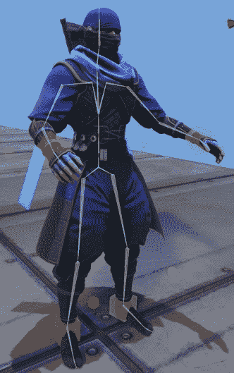

图 12.1 -一个带有骷髅的忍者网格与它的默认姿势相匹配

一旦艺术家创建了模型及其骨骼，下一步就是进行蒙皮，即将模型的每个顶点与一个或多个骨骼关联起来。 这样，当你移动骨头时，相关的顶点也会随之移动。 这样做是因为它更容易动画减少骨骼的数量，而不是每个单一的顶点的模型。 在下一个截图中，您将看到网格的三角形是根据影响它的骨骼的颜色绘制的，这是一种可视化骨骼影响的方式。 你会注意到颜色之间的混合，这意味着这些顶点受到不同的骨骼的不同影响，以允许关节附近的顶点很好地弯曲。 同样，截图展示了用于二维游戏的二维网格的例子，但其概念是相同的:

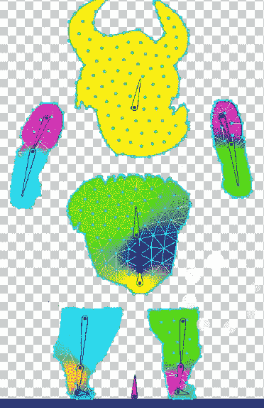

图 12.2 -网格蒙皮权重可视化地表示为颜色

最后，你需要的是实际的动画，它将简单地包含网格的不同姿态的混合。 美工将在动画中创建关键帧，确定模型在不同时刻需要呈现的姿势，然后动画系统将简单地在它们之间插入。 基本上，美工将动画骨骼，皮肤系统将应用这个动画到整个网格。 你可以有一个或几个动画，你可以根据你想要匹配角色动作的动画(如空闲、行走、跌倒等)在这些动画之间进行切换。

为了得到这四个部分，我们需要得到包含它们的适当素材。 本场景中的通常格式是**Filmbox**(**FBX**)，这与我们迄今为止导入 3D 模型所使用的格式相同。 这种格式可以包含我们需要的每一部分——模型、带皮肤的骨架和动画——但通常，我们会将这些部分分割成几个文件来重新利用这些部分。

想象一下，在一款城市模拟游戏中，我们拥有多个具有不同方面的公民网格，并且所有这些网格都必须是动画的。 如果我们为每个公民提供一个包含网格、蒙皮和动画的 FBX，这将导致每个模型都有自己的动画，或者至少是一个相同动画的克隆，并重复它们。 当我们需要改变动画时，我们将需要更新所有的网格公民，这是一个耗时的过程。 相反,我们可以有一个 FBX 每个公民,包含网和适当的皮肤的骨头的基于网格,以及一个单独的 FBX 动画,包含相同的骨头,所有公民正确的动画,但是没有网。 这将允许我们混合并匹配公民 FBX 与动画的 FBX 文件。 你可能想知道为什么模型 FBX 和动画 FBX 都必须有网格。 这是因为它们需要匹配才能使两个文件兼容。 在下面的截图中，你可以看到这些文件应该是什么样子:

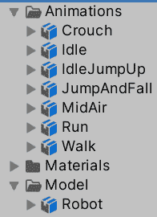

图 12.3 -我们将在项目中使用的包的动画和模型 FBX 文件

此外，值得一提的是被称为重定位的概念。 如前所述，为了混合模型和动画文件，我们需要它们具有相同的骨骼结构，这意味着相同数量的骨骼、层次结构和名称。 有时候，这是不可能的，特别是当我们将艺术家创建的自定义模型与外部动画文件混合在一起时，你可以使用动作捕捉技术或仅仅通过购买动作捕捉库从演员那里记录。 在这种情况下，你很可能会遇到不同的骨骼结构之间的一个动作捕捉库和你的角色模型，所以这里是重定位发挥作用的地方。 这个技术允许 Unity 在两个不同的类人骨骼结构之间创建一个通用映射，使它们兼容。 稍后，我们将看到如何启用该特性。

现在我们了解了蒙皮网格背后的基础知识，让我们看看如何通过骨骼和动画获得模型的素材。

## 导入骨骼动画

让我们开始如何从素材存储导入一些动画模型，在**3D**|**字符**|**类人**部分。 您也可以使用外部网站，如 Mixamo 下载它们。 但现在，我将坚持素材商店，因为您将有更少的麻烦，使素材工作。 在我的例子中，我下载了一个包，正如你在下面的截图中看到的，它包含了模型和动画。

注意，有时你需要单独下载它们，因为一些素材将是模型或动画的唯一。 此外，考虑到本书中使用的软件包可能在您阅读时不可用; 在这种情况下，你可以寻找另一个具有类似素材(在这种情况下，角色和动画)的包，或者从该书的 GitHub 存储库下载项目文件，并从那里复制所需的文件:

图 12.4 -我们游戏中的士兵模型

在我的包内容中，我可以在**Animations**文件夹中找到动画的 FBX 文件，在**model**中找到单个模型的 FBX 文件。 记住，有时你不会让它们像这样分开，如果有任何动画存在的话，动画可能位于与模型相同的 FBX 中。 现在我们已经有了所需的文件，让我们讨论如何正确地配置它们。

让我们开始选择**Model**文件，并检查**Rig**选项卡。 在这个选项卡中，你会发现一个名为**动画类型**的设置，如下截图所示:

图 12.5 - Rig 属性

此属性包含以下选项:

*   **None**:非动画模型的模式; 游戏中的每个静态网格都将使用这种模式。
*   **Legacy**:在旧的 Unity 项目和模型中使用的模式; 不要在新项目中使用它。
*   **Generic**:一种新的动画系统，可以用于各种模型，但通常用于非类人模型，如马、章鱼等。 如果使用这种模式，模型和动画 FBX 文件都必须具有完全相同的骨骼名称和结构，从而减少了组合来自外部源的动画的可能性。
*   类人:设计用于类人模型的新型动画系统。 它可以实现诸如重瞄准和**逆运动学**(**IK**)等功能。 这让你可以结合不同骨骼的模型，而不是动画，因为 Unity 会在这些结构和一个通用的结构之间创建映射，称为角色。 请注意，有时自动映射可能会失败，您需要手动纠正它; 所以，如果你的通用模型有你需要的一切，我建议你坚持**通用**，如果那是 FBX 的默认配置。

在我的例子中，我包中的 FBX 文件将模式设置为**Humanoid**，所以这很好，但记住，只有在绝对必要的情况下才切换到其他模式(例如，如果你需要组合不同的模型和动画)。 现在我们已经讨论了**Rig**设置，让我们来谈谈**Animation**设置。

为了做到这一点，选择任何动画 FBX 文件，并寻找检查器窗口的**animation**部分。 你会找到几个设置,比如**导入动画**复选框,必须注明如果文件有一个动画(不是模型文件),和**视频列表,在那里你会发现所有的动画文件。 在下面的截图中，你可以看到我们的一个动画文件的**剪辑**列表:**

图 12.6 -动画设置中的剪辑列表

一个带有动画的 FBX 文件通常包含一个大型动画轨道，它可以包含一个或几个动画。 无论哪种方式，默认情况下，Unity 将基于该轨迹创建一个单一的动画，但如果该轨迹包含多个动画，你将需要手动拆分它们。 在我们的例子中，我们的 FBX 包含几个动画已经被包创造者分割，但为了学习如何做手动分割，做以下:

1.  从**Clips**列表中，选择您想要重建的任何动画; 在我的例子中，我会选择**HumanoidCrouchIdle**。
2.  Take a look at the **Start** and **End** values below the animation timeline and remember them; we will use them to recreate this clip:

    

    图 12.7 -剪辑设置

3.  点击**Clips**列表右下角的减号按钮，删除选中的剪辑。
4.  使用加号按钮创建一个新的剪辑并选择它。
5.  使用**Take 001**输入字段将其重命名为与原始字段类似的名称。 在我的例子中，我将其命名为**Idle**。
6.  使用*步骤 2*中需要记住的值设置**结束**和**开始**属性。 在我的例子中，**结束**有**319**，**开始**有**264**。 这些信息通常来自艺术家，但您可以尝试最有效的数字，或者简单地在这些属性的顶部拖动时间轴上的蓝色标记。
7.  你可以通过点击 Inspector 窗口底部的动画标题栏(在我的例子中是**HumanoidIdle**)来预览剪辑，然后点击 Play 按钮。 你会看到默认的 Unity 模型，但是你可以通过把模型文件拖到预览窗口中看到你自己的模型，因为检查我们的模型是否配置正确是很重要的。 如果动画不播放，你需要检查**动画类型**设置是否与动画文件匹配:

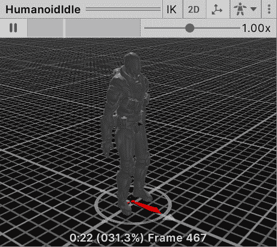

图 12.8 -动画预览

现在，打开动画文件，单击箭头，并检查子素材。 你会看到这里有一个标题为你的动画的文件，旁边是剪辑列表中的其他动画，其中包含了剪切的剪辑。 稍后，我们将播放它们。 在下面的截图中，你可以看到我们的**.fbx**文件中的动画:

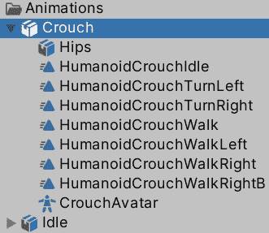

图 12.9 -生成的动画剪辑

现在我们已经介绍了基本的配置，让我们看看如何集成动画。

## 使用动画控制器集成

当我们向角色添加动画时，我们需要考虑动画的流程，这意味着考虑哪些动画必须播放，每个动画何时必须激活，以及动画之间的转换应该如何发生。 在之前的 Unity 版本中，你需要手动编写代码，生成复杂的 C# 脚本来处理复杂的场景; 但现在，我们有了动画控制器。

动画控制器是一种基于状态机的素材，我们可以用可视化编辑器**Animator**绘制动画之间的转换逻辑。 其思想是，每个动画都是一个状态，我们的模型将有几个状态。 一次只能有一个状态是活动的，所以我们需要创建转换来更改它们，而要触发转换过程，必须满足一些条件。 条件是关于动画角色的数据的比较，例如它的速度，它是射击还是蹲伏等等。

因此，基本上，动画控制器或状态机是一组带有转换规则的动画，这些规则将指示哪个动画应该是活动的。 让我们按照以下步骤创建一个简单的动画控制器:

1.  点击**项目**视图下的**+**按钮，点击**动画控制器**，将其命名为**播放器**。 记住在一个文件夹中找到你的素材适当的组织; 我会叫我的**动画师**。
2.  双击素材打开**Animator**窗口。 不要将此窗口与**动画**窗口混淆; **Animation**窗口做了一些不同的事情。
3.  Drag the **Idle** animation clip of your character into the **Animator** window. This will create a box in the Controller representing the animation that will be connected to the entry point of the Controller, indicating that the animation will be the default one because it is the first one that we dragged. If you don't have an **Idle** animation, I encourage you to find one. We will need at least one **Idle** and one walking/running animation clip:

    

    图 12.10 -从 FBX 素材拖动一个动画剪辑到动画控制器中

4.  以同样的方式拖动正在运行的动画。
5.  右键单击**Idle**动画，选择**Create Transition**，然后左键单击**Run**动画。 这将在**Idle**和**Run**之间创建一个转换。
6.  Create another transition from **Run** to **Idle** in the same way:

    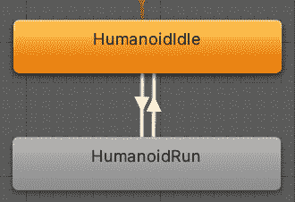

    图 12.11 -两个动画之间的过渡

    过渡必须有条件，以防止动画不断交换，但为了创造条件，我们需要数据来进行比较。 我们将向控制器添加属性，它将表示转换使用的数据。 稍后，在*第 3 部分*中，我们将设置该数据以匹配对象的当前状态。 但现在，让我们创建数据并测试控制器如何对不同的值做出反应。 为了创建基于属性的条件，请执行以下操作:

7.  点击**Animator**窗口左上方的**Parameters**标签。 如果您没有看到它，单击斜眼按钮来显示选项卡。
8.  Click on the **+** button and select **Float** to create a number that will represent the velocity of our character, naming it **Velocity**. If you missed the renaming part, just left-click on the variable and rename it:

    

    图 12.12 -带有浮动 Velocity 属性的 Parameters 选项卡

9.  点击**Idle to Run**转换(白色箭头)，在检查器窗口中查看**Conditions**属性。
10.  Click on the **+** button at the bottom of the list, which will create a condition that will rule the transition. The default setting will take the first parameter of our animator (in this case, it is **Velocity**) and will set the default comparer, in this case, **Greater**, to a value of **0**. This tells us that the transition will execute from **Idle** to **Run** if **Idle** is the current animation and the velocity of the Player is greater than **0**. I recommend you to set a slightly higher value, such as **0.01**, to prevent any float rounding errors (a common CPU issue). Also, remember that the actual value of **Velocity** needs to be set manually via scripting, which we will do in *Part 3*:

    

    图 12.13 -检查速度是否大于 0.01 的条件

11.  对**Run to Idle**转换执行相同的操作，但这次将**Greater**更改为**Less**，并再次将值设置为**0.01**:

图 12.14 -检查值是否小于 0.01 的条件

现在我们已经设置了第一个动画控制器，是时候将它应用到一个对象上了。 为了做到这一点，我们需要一系列的组件。 首先，当我们有一个动画角色，而不是常规的网格渲染器时，我们使用蒙皮网格渲染器。 如果你把角色的模型拖到场景中并探索它的子元素，你会看到一个组件，如下所示:

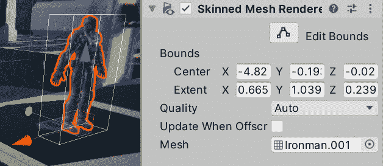

图 12.15 -一个蒙皮网格渲染器组件

这个组件将负责将骨骼的运动应用到网格上。 如果你搜索模型的子代，你会找到一些骨头; 你可以尝试旋转、移动和缩放它们来查看效果，如下面的截图所示。 考虑一下，如果你从 Asset Store 下载了另一个包，你的骨骼层次结构可能与我的不同:

图 12.16 -旋转颈骨

我们需要的另一个组件是**Animator**，它会自动添加到根 GameObject 的蒙皮网格中。 这个组件将负责应用我们在动画控制器中创建的状态机，如果动画 FBX 文件被正确地配置，就像我们之前提到的。 为了应用动画控制器，执行以下操作:

1.  拖动角色模型到场景中，如果它还没有存在。
2.  选择它并在根游戏对象中定位**Animator**组件。
3.  点击**Controller**属性右边的圆圈，选择我们之前创建的**Player**控制器。 您也可以直接从 Project 窗口拖动它。
4.  Make sure that the **Avatar** property is set to the avatar inside the FBX model; this will tell the animator that we will use that skeleton. You can identify the avatar asset by its icon of a person, as in the following screenshot. Usually, this property is correctly set automatically when you drag the FBX model to the Scene:

    

    图 12.17 -动画师使用玩家控制器和机器人化身

5.  设置**摄像头**游戏对象，让它看着玩家并玩游戏，你将看到角色执行**Idle**动画。
6.  Without stopping the game, open the Animator Controller asset again by double-clicking it and selecting the character in the **Hierarchy** pane. By doing this, you should see the current state of the animation being played by that character, using a bar to represent the current part of the animation:

    

    图 12.18 -动画控制器在播放模式中，当一个对象被选中时，显示当前动画和它的进程

7.  Using the **Animator** window, change the value of **Velocity** to **1.0** and see how the transition will execute:

    

    图 12.19 -设置控制器的速度以触发转换

    根据**Run**动画的设置，你的角色可能会开始移动。 这是由根移动引起的，这是一个基于动画移动角色的功能。 有时，这是有用的，但由于我们将使用脚本完全移动我们的角色，我们希望关闭该功能。 你可以取消**Character**对象的**Animator**组件中的**Apply Root Motion**复选框:

    

    图 12.20 -禁用的根移动

8.  您还会注意到在改变**Velocity**值和动画转换开始之间有一个延迟。 这是因为，默认情况下，Unity 会等待原始动画结束后才执行转换，但在这个场景中，我们不希望那样。 我们需要立即开始过渡。 为了做到这一点，选择控制器的每个过渡，并在检查器窗口中取消**Has Exit Time**复选框:

图 12.21 -禁用 Has Exit Time 复选框以立即执行转换

您可以开始将其他动画拖拽到控制器中，并创建复杂的动画逻辑，例如添加跳跃、下落或蹲伏动画。 我邀请您尝试其他参数类型，例如使用复选框而不是数字的布尔值。 此外，随着你进一步开发游戏，你的控制器的动画数量也会增加。 为了管理这些，还有其他一些特性值得研究，比如混合树和子状态机，但这超出了本书的范围。

现在我们了解了 Unity 中角色动画的基本知识，让我们来讨论如何创建动态摄像机动画来跟随我们的玩家。

# 使用 Cinemachine 创建动态摄像机

摄像机在电子游戏中是一个非常重要的主题。 它们让玩家能够看到自己所处的环境，并根据所看到的内容做出决定。 游戏设计师通常会定义游戏如何表现以获得他们想要的游戏体验，而这并非易事。 为了获得准确的感觉，许多行为必须分层。 此外，在过场动画中，重要的是控制摄像机将穿越的路径，以及摄像机在不断移动的场景中聚焦动作的位置。

在本章中，我们将使用 Cinemachine 包来创建跟踪玩家移动的动态摄像机(我们将在*第 3 部分*中编写)，以及在过场动画中使用的摄像机。

在本节中，我们将研究以下 Cinemachine 概念:

*   创建相机的行为
*   创造多利跟踪

让我们首先讨论如何创建一个 Cinemachine 控制的摄像机，并在其中配置行为。

创建相机的行为

Cinemachine 是摄像机中可以使用的不同行为的集合，如果恰当地组合起来，就可以在电子游戏中生成各种常见的摄像机类型，包括从后面跟随玩家，第一人称摄像机，自上而下的摄像机等等。 为了使用这些行为，我们需要理解大脑和虚拟摄像机的概念。

在 Cinemachine 中，我们将只保留一个主摄像机，就像我们之前所做的那样，该摄像机将由虚拟摄像机控制，独立的游戏对象具有前面提到的行为。 我们可以有几个虚拟摄像机并在它们之间随意切换，但活动虚拟摄像机将是唯一一个将控制我们的主摄像机。 这对于在游戏的不同时刻切换摄像机非常有用，例如在我们的玩家的第一人称摄像机之间切换。 为了用虚拟摄像机控制主摄像机，必须有一个**Brain**组件。

要开始使用 Cinemachine，首先，我们需要从包管理器中安装它，就像我们之前对其他包所做的那样。 如果你不记得怎么做，只需要做下面的事情:

1.  转到**窗口**|**包管理器**。
2.  Ensure that the **Packages** option in the top-left part of the window is set to **Unity Registry**:

    

    图 12.22 - Packages 筛选模式

3.  等待一下，让左边面板填充来自服务器的所有包(需要 internet)。
4.  从列表中查找**Cinemachine**包并选择它。 在撰写本书时，我们使用的是 Cinemachine 2.6.0。
5.  点击屏幕右下角的**Install**按钮。

让我们开始创建一个虚拟摄像机来跟踪我们之前动画的角色，这将是我们的玩家英雄。 执行以下操作:

1.  Click **Cinemachine** | **Create Virtual Camera**. This will create a new object called **CM vcam1**:

    

    图 12.23 -创建虚拟摄像机

2.  If you select the main camera from the **Hierarchy** pane, you will also notice that a **CinemachineBrain** component has been automatically added to it, making our main camera follow the virtual camera. Try to move the created virtual camera, and you will see how the main camera follows it:

    

    图 12.24 - CinemachineBrain 组件

3.  Select the virtual camera and drag the character to the **Follow** and **Look At** properties of the Cinemachine virtual camera component. This will make the movement and looking behaviors use that object to do their jobs:

    

    图 12.25 -设置我们相机的目标

4.  You can see how the **Body** property of the virtual camera is set to **Transposer**, which will move the camera relative to the target set at the **Follow** property; in our case the character. You can change the **Follow Offset** property and set it to the desired distance you want the camera to have from the target. In my case, I used the (**0**, **3**, and **-3**) values:

    

    图 12.26 -摄像机从后面跟随角色

5.  图 12.26 显示**游戏**视图; 您可以看到一个黄色的小矩形，它表示要查看字符的目标位置，并且它当前指向字符的枢轴—它的脚。 我们可以在虚拟摄像机的**Aim**部分的**跟踪对象偏移**属性中应用偏移。 在我的例子中，**0**，**1.5**和**0**的值工作得很好，可以让相机看到胸部:

图 12.27 -改变目标偏移量

如您所见，使用 Cinemachine 非常简单，在我们的例子中，默认设置已经足够满足我们所需要的行为。 然而，如果你探索其他的**Body**和**Aim**模式，你会发现你可以为任何类型的游戏创造任何类型的相机。 我们不会在这本书中介绍其他模式，但我强烈建议你查看 Cinemachine 的文档来检查其他模式的功能。 要打开文档，请执行以下操作:

1.  通过进入**窗口**|**包管理器**打开包管理器。
2.  在左侧列表中找到**Cinemachine**。 如果它没有出现，请稍等。 记住，你需要有网络连接才能让它工作。
3.  Once **Cinemachine** is selected, look for the **View documentation** link in blue. Click on it:

    

    图 12.28 - Cinemachine 文档链接

4.  你可以使用左边的导航菜单来浏览文档:

图 12.29 - Cinemachine 文档

与使用 Cinemachine 时一样，您可以用同样的方法找到其他包的文档。 现在我们已经实现了基本的相机行为，我们需要，让我们探索如何使用 Cinemachine 为我们的介绍过场动画创建一个相机。

## 创建小车轨道

当玩家开始关卡时，我们希望在进入战斗前有一个小过场动画在我们的场景和基地上滚动。 这将需要相机遵循一个固定的路径，而这正是Cinemachine 的 dolly 相机所做的。 它创建了一个路径，我们可以在其中附加一个虚拟摄像机，这样它将跟随它。 我们可以设置 Cinemachine 自动通过轨道或跟踪目标到轨道最近的点; 在本例中，我们将使用第一个选项。

为了创建一个移动相机，做以下:

1.  Let's start creating the track with a cart, which is a little object that will move along the track, which will be the target to follow the camera. To do this, click on **Cinemachine** | **Create Dolly Track with Cart**:

    

    图 12.30 -一个具有默认直线路径的移动相机

2.  如果您选择**DollyTrack1**对象，您可以看到两个带有数字**0**和**1**的圆。 这些是轨道的控制点。 选择其中一个，并在使用平移装置的箭头移动其他对象时移动它。
3.  You can create more control points by clicking the **+** button at the bottom of the **Waypoints** list of the **CinemachineSmoothPath** component of the **DollyTrack1** object:

    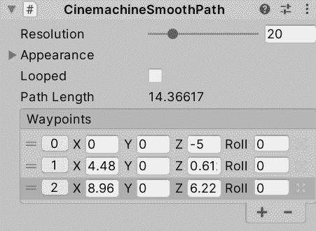

    图 12.31 -添加路径控制点

4.  Create as many waypoints as you need to create a path that will traverse the areas you want the camera to oversee in the intro cutscene. Remember, you can move the waypoints by clicking on them and using the translation gizmo:

    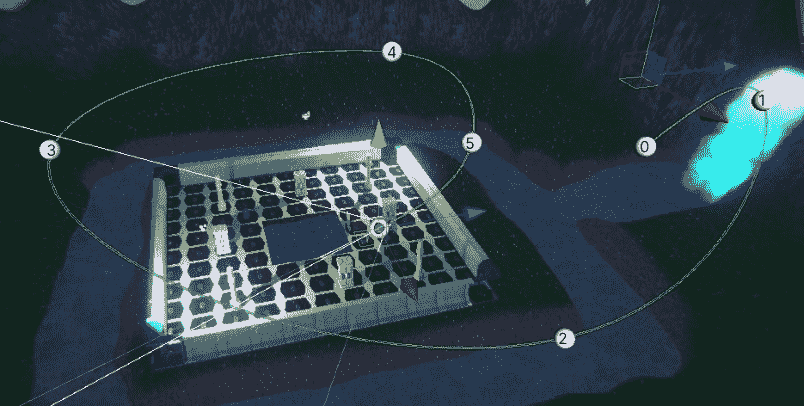

    图 12.32 -我们场景的手推车轨道 它就在角色后面结束了

5.  Create a new virtual camera. If you go to the **Game** view after creating it, you will notice that the character camera will be active. In order to test how the new camera looks, select it and click on the **Solo** button in the Inspector window:

    

    图 12.33 -编辑时 Solo 按钮暂时启用这个虚拟相机

6.  这次将**Follow**目标设置到我们之前用轨道创建的**DollyCart1**对象。
7.  设置**跟随偏移**到**0**，**0**和**0**，使相机保持在与小车相同的位置。
8.  Set **Aim** to **Same As Follow Target** to make the camera look in the same direction as the cart, which will follow the track curves:

    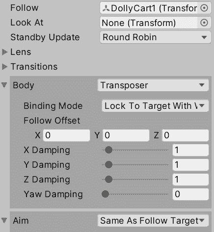

    图 12.34 -使虚拟摄像机跟随小车轨道的配置

9.  选择**DollyCart1**对象，并更改**Position**值，以查看购物车如何沿着轨道移动。 当游戏窗口被聚焦，**CM vcam2**处于单人模式时，看看相机会是什么样子:

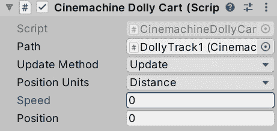

图 12.35 -手推车组件

随着小车轨道的正确设置，我们可以创建我们的过场动画使用**时间轴**来排序它。

# 使用时间轴创建过场动画

我们有了介绍镜头，但这还不足以创造过场动画。 一个合适的过场动画是在它们应该发生的时刻发生的一系列动作，协调多个对象以达到预期的效果。 我们可以进行诸如启用和禁用对象、切换摄像机、播放声音、移动对象等操作。 为了做到这一点，Unity 提供了**时间轴**，这是协调过场动画的行动序列。 我们将使用**时间轴**为我们的场景创建一个介绍过场动画，在游戏开始前展示关卡。

在本节中，我们将研究以下时间轴概念:

*   创建动画短片
*   排序我们的介绍过场动画

我们将看到如何在 Unity 中创建我们自己的动画剪辑来动画我们的游戏对象，然后把他们放在一个过场动画中，以协调他们的激活使用时间轴音序工具。 让我们开始创建一个相机动画，稍后在时间轴中使用。

## 动画剪辑

这实际上不是一个特定于时间轴的功能，而是一个与时间轴配合得很好的 Unity 功能。 当我们下载角色时，它带有使用外部软件创建的动画剪辑，但你可以使用 Unity 的**animation**窗口创建自定义动画剪辑。 不要将其与**Animator**窗口混淆，后者允许我们根据游戏情况创建动画转换。 这对于创建特定于对象的小动画非常有用，您将在稍后的时间轴中与其他对象的动画进行协调。

这些动画可以控制对象组件属性的任何值，比如位置、颜色等等。 在我们的例子中，我们想要动画小车轨道的**Position**属性，以使它在给定的时间内从开始到结束。 为此，请执行以下步骤:

1.  选择**DollyCart1**对象。
2.  点击**window**|**Animation**|**Animation**打开**Animation**(不是**Animator**)窗口。
3.  Click on the **Create** button at the center of the **Animation** window. Remember to do this while the dolly cart (not track) is selected:

    

    图 12.36 -创建自定义动画剪辑

4.  这样做之后，系统会提示您将动画剪辑保存到某个地方。 我建议你在项目中创建一个**Animations**文件夹(在**Assets**文件夹中)，命名为**IntroDollyTrack**。

如果你注意的话，小车现在有一个**Animator**组件，它创建了一个 Animator Controller，其中包含我们刚刚创建的动画。 与任何动画剪辑一样，你需要用 Animator 控制器将它应用到你的对象; 自定义动画也不例外。 因此，**Animation**窗口为您创建了它们。

在此窗口中动画包含指定其属性在给定时刻的值。 在我们的例子中,我们希望**位置值**0 开头动画在第二个 0 的时间表,和有一个价值 240**动画在第二年底【T6 5】**。 我选择了**240**，因为那是我推车里最后一个可能的位置，但那取决于你推车轨道的长度。 只需要测试你的最后一个可能的位置。 另外，我选择了第二个**5**，因为我觉得这是动画的正确长度，但你可以随意改变它。 现在,无论发生什么动画【病人】之间的 0 和**5**秒是一个插值的【t16.1】240 0 和**值,这意味着在**2.5**秒,**的价值地位**将于 120 年**。 动画总是包含在不同时刻插入物体的不同状态。********

 ********为了做到这一点，请执行以下步骤:

1.  在**动画**窗口中，点击录制按钮(左上角的红色圆圈)。 这将使 Unity 检测到我们对象的任何变化，并将其保存到动画中。 记住，当您选择了手推车时，请执行。
2.  Set the **Position** setting of the dolly cart to **1** and then **0**. Changing this to any value and then to **0** again will create a keyframe, which is a point in the animation that says that at **0** seconds, we want the **Position** value to be **0**. We need to set it first to any other value if the value is already at **0**. You will notice that the **Position** property has been added to the animation:

    

    图 12.37 -将 Position 值更改为 0 后，在 Record 模式下的动画

3.  Using the mouse scroll wheel, zoom out the timeline to the right of the **Animation** window until you see **5** seconds in the top bar:

    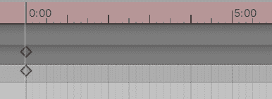

    图 12.38 -动画窗口显示 5 秒的时间轴

4.  单击时间轴顶部栏中的**5**第二个标签来定位当时的回放标题。 这将定位我们在那个时刻所做的下一个更改。
5.  Set the **Position** value of the dolly track to the highest value you can get; in my case, this is **240**. Remember to have the **Animation** window in **Record** mode:

    

    图 12.39 -在动画的第 5 秒创建一个 240 值的关键帧

6.  点击**动画**窗口左上方的播放按钮，观看动画播放。 记得在**游戏**视图中查看，而**CM vcam2**是单人模式。

现在，如果我们点击播放，动画会开始播放，但这是我们不想要的。 在这个场景中，我们的想法是将过场动画的控制权交给过场动画系统 Timeline，因为这个动画将不是我们过场动画中唯一需要排序的内容。 防止**Animator**组件自动播放我们创建的动画的一种方法是在控制器中创建一个空的动画状态，并通过以下操作将其设置为默认状态:

1.  搜索我们创建动画时创建的动画控制器并打开它。 如果你找不到它，只要选择小车，双击游戏对象上的**动画师**组件的**控制器**属性，打开素材。
2.  Right-click on an empty state in the Controller and select **Create State** | **Empty**. This will create a new state in the state machine as if we created a new animation, but it is empty this time:

    

    图 12.40 -在动画控制器中创建一个空状态

3.  Right-click on **New State** and click on **Set as Layer Default State**. The state should become orange:

    

    图 12.41 -将控制器的默认动画更改为空状态

4.  现在，如果你点击播放，没有动画将播放，因为我们的小车的默认状态是空的。

现在我们已经创建了摄像机动画，让我们开始创建一个过场动画，通过使用时间轴从介绍过场动画摄像机切换到玩家摄像机。

## 排序介绍过场动画

时间轴已经安装在您的项目中，但如果您进入时间轴的包管理器，您可能会看到一个**Update**按钮，以获得最新版本，如果您需要一些新功能。 在我们的案例中，我们将在项目中保留默认版本(撰写本书时为 1.3.4)。

我们要做的第一件事是创建一个过场动画素材和一个在场景中负责播放它的对象。 要做到这一点，请遵循以下步骤:

1.  使用**游戏对象**|**创建空**选项创建空游戏对象。
2.  选择空对象并将其命名为**Director**。
3.  转到**窗口**|**序列**|**时间轴**打开**时间轴**编辑器。
4.  点击**时间轴**窗口中间的**创建**按钮，同时选择**导演**对象，将该对象转换为过场动画玩家(或导演)。
5.  完成此操作后，将弹出一个窗口，要求您保存一个文件。 该文件将是过场动画或时间轴; 每个过场动画都将保存在自己的文件中。 将其保存在项目的**过场动画**文件夹中(**Assets**文件夹)。
6.  现在,你可以看到**主任对象有一个**播放董事**与**组件介绍**动画素材保存在上一步设置【T6 试玩版】属性,这意味着这个动画是由导演:**

 **

图 12.42 - Playable Director 准备播放 Intro Timeline 素材

现在我们已经准备好了时间轴素材，让我们将其设置为序列动作。 开始,我们需要两个序列,购物车位置动画的最后一步,然后相机多莉轨道之间的交换相机(**厘米 vcam2**)和玩家相机(vcam1**厘米**)。 就像我们之前说的，过场动画是在特定时刻执行的一系列行动，为了安排行动，你需要追踪。 在 Timeline 中，我们有不同种类的轨迹，每一个都允许你在特定的对象上执行特定的动作。 我们将从动画轨道开始。

动画轨迹将控制特定对象将播放哪个动画; 我们需要每个对象有一个轨迹来动画。 在我们的例子中，我们想让小车轨道播放我们创建的**Intro**动画，所以让我们按照下面的步骤来做:

1.  Create an Animation Track doing right click in the left part of the Timeline editor and clicking Animation Track:

    

    图 12.43 -创建动画轨迹

2.  选择**导演**对象，在检查器窗口中检查**可播放导演**组件的**Bindings**列表。
3.  Drag the **Cart** object to specify that we want the animation track to control its animation:

    

    图 12.44 -在这个导演中使动画跟踪控制小车动画

    重要提示:

    时间轴是一个通用的素材，可以应用到任何场景，但由于轨道控制具体的对象，你需要手动绑定他们在每个场景。 在我们的例子中，我们有一个期望控制单个动画师的动画轨迹，所以在每个场景中，如果我们想应用这个过场动画，我们需要在**Bindings**列表中拖动特定的动画师来控制。

4.  Drag the **Intro** animation asset that we created to the animation track in the **Timeline** window. This will create a clip in the track showing when and for how long the animation will play. You can drag many animations that the cart can play into the track to sequence different animations at different moments; but right now, we want just that one:

    

    图 12.45 -让动画师跟踪播放介绍片段

5.  你可以拖动动画来改变你想让它播放的确切时刻。 把它拖到轨道的开始。
6.  点击**时间轴**窗口左上方的播放按钮，查看其运行情况。 您也可以手动拖动**时间轴**窗口中的白色箭头，查看不同时刻的过场动画:

图 12.46 -播放时间轴并拖动播放头

重要提示:

记住，你不需要使用时间轴来播放动画。 在本例中，我们这样做是为了控制我们希望动画在哪个时刻播放。 你也可以使用脚本控制动画师。

现在，我们将让 Intro 时间轴素材告诉**CinemachineBrain**组件(主摄像机)，在过场动画的每个部分，哪个摄像机将处于活动状态，当摄像机动画结束时切换到玩家摄像机。 我们将创建第二个轨道- Cinemachine 轨道-它专门用于制作一个特定的**CinemachineBrain**组件来在不同的虚拟摄像机之间切换。 要做到这一点，请遵循以下步骤:

1.  Right-click on the empty space below the animation track and click on **Cinemachine Track**. Note that you can install Timeline without Cinemachine, but this kind of track won't show up in that case:

    

    图 12.47 -创建一个新的 Cinemachine Track

2.  In the **Playable Director** component's **Bindings** list, drag the main camera to **Cinemachine Track** to make that track control which virtual camera will be the one that controls the main camera at different moments of the cutscene:

    

    图 12.48 -让 Cinemachine Track 控制我们场景的主摄像机

3.  The next step indicates which virtual camera will be active during specific moments of the timeline. To do so, our Cinemachine Track allows us to drag virtual cameras to it, which will create virtual camera clips. Drag both **CM vcam2** and **CM vcam1**, in that order, to the Cinemachine Track:

    

    图 12.49 -将虚拟摄像机拖动到 Cinemachine 轨道

4.  如果你点击播放按钮或者只是拖动**Timeline Playback**标题，你可以看到当播放标题到达第二个虚拟摄像机剪辑时，活动虚拟摄像机是如何变化的。 记住要在**Game**视图中查看。
5.  如果您将鼠标放在剪辑的末端附近，将显示一个调整大小的光标。 如果您拖动它们，您可以调整剪辑的大小以指定其持续时间。 在我们的例子中,我们将需要匹配的长度**厘米 vcam2**夹到购物车**动画剪辑,然后把**厘米 vcam1**结束时通过拖动它,相机将活跃多莉购物车动画结束时。 在我的情况下，他们已经是相同的长度，但只是试图改变它无论如何练习。 此外，您可以使**CM vcam1**剪辑更短; 我们只需要播放它几分钟来执行相机交换。**
***   你也可以重叠剪辑一点，以使两个摄像机之间的平滑过渡，而不是硬切换，这会看起来很奇怪:**

 **

图 12.50 -调整大小和重叠剪辑来插入它们

如果你等待完整的过场动画结束，你会注意到在最后，**CM vcam2**再次激活。 你可以配置时间轴如何处理过场动画的结尾，因为默认情况下，它什么也不做。 这可能会根据赛道类型导致不同的行为; 在本例中，再次将选择虚拟摄像机的控制交给**CinemachineBrain**组件，该组件将选择具有最高**优先级**值的虚拟摄像机。 我们可以改变优先级**的**房地产的虚拟摄像头来确保【显示】厘米 vcam1(玩家相机)一直是更重要的一个,或一组**包装模式**的【病人】董事播放组件**,这将使一切,最后一帧的时间指定。**

 **在我们的例子中，我们将使用后一个选项来测试特定于时间轴的特性:

图 12.51 - Wrap Mode 设置为 Hold 模式

大多数不同的类型的轨道在相同的逻辑下工作; 每一个都将使用在设定时间内执行的剪辑来控制特定对象的特定方面。 我建议你测试不同的轨道，看看它们的作用，如**激活**，这将在过场动画中启用并禁用对象。 记住，您可以在包管理器中查看 Timeline 包的文档。

# 总结

在本章中，我们介绍了不同的动画系统，Unity 提供了不同的需求。 我们讨论了导入角色动画并使用动画控制器控制它们。 我们还了解了如何制作能够反映游戏当前情况的摄像机，例如玩家的位置，或者可以用于过场动画。 最后，我们通过时间轴和动画系统为游戏创造了一个介绍过场动画。 这些工具能够帮助我们团队中的动画师直接在 Unity 中工作，而无需整合外部素材(除了角色动画)，也能够避免程序员在创建动画时重复编写脚本，浪费时间。

现在，你可以在 Unity 中导入和创建动画剪辑，并将它们应用到游戏对象中，使它们根据剪辑移动。 此外，你可以将它们放在时间轴音序器中，以协调它们，并为你的游戏创建过场动画。 最后，你可以创建动态摄像机在游戏中或过场动画中使用。

到目前为止，我们已经讨论了许多 Unity 系统，这些系统允许我们在不编码的情况下开发游戏的不同方面，但迟早我们还需要编写脚本。 Unity 为一般情况提供通用工具，但我们游戏的独特玩法通常必须手动编写。 在下一章，也就是*第 3 部分*的第一章，我们将开始学习如何使用 C# 在 Unity 中编写代码。**************