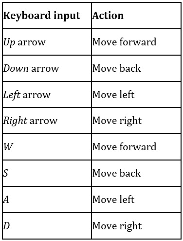
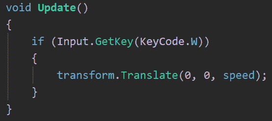
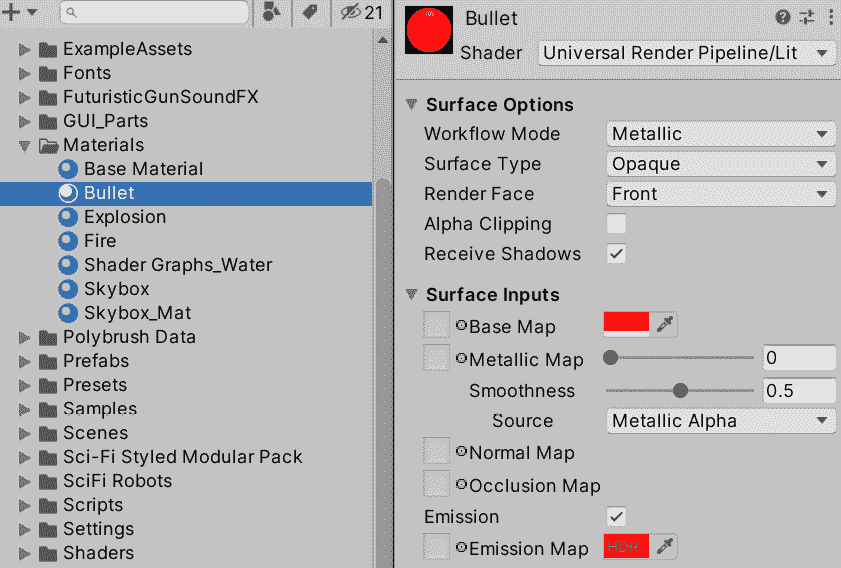
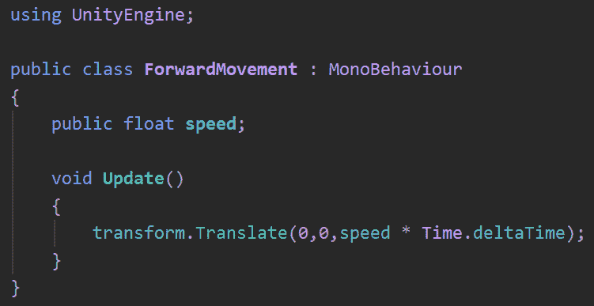
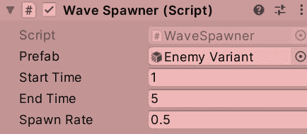
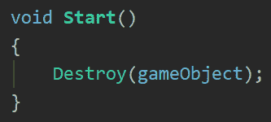

# 十四、实现移动和生成

现在我们已经准备好了开始编码的项目，让我们创建第一个行为。 我们将看到如何使用**Transform**组件通过脚本移动对象的基础知识，该组件将应用于使用按键的玩家的移动、子弹的持续移动以及其他对象的移动。 此外，我们将看到如何在游戏中创建和摧毁对象，如子弹我们的玩家和敌人射击和敌人波生成。 这些操作可以在其他几个场景中使用，所以我们将探讨几个来强化这个想法。

在本章中，我们将研究以下脚本的概念:

*   实现运动
*   实现生成

我们将开始编写组件来执行前面提到的移动行为，然后我们将继续进行对象创建和销毁。

# 实施运动

游戏中几乎所有物体都在以某种方式移动，玩家角色通过键盘移动，敌人通过 AI 移动，子弹只是向前移动，等等。 在 Unity 中有多种移动物体的方法，所以我们将从最简单的方法开始，即通过**Transform**组件。

在本节中，我们将研究以下运动概念:

*   通过变换移动对象
*   使用输入
*   理解三角洲时间

首先，我们将探索如何在我们的脚本中访问 Transform 组件来驱动玩家的移动，以便稍后根据玩家的键盘输入应用移动。 最后，我们将探讨 Delta Time 的概念，以确保每台计算机的移动速度是一致的。 我们将开始学习 Transform API 来掌握简单的移动。

## 通过变换移动物体

**Transform**是包含物体的平移、旋转和缩放的组件，所以物理或寻路等每个运动系统都会影响这个组件。 无论如何，有时候我们想要根据我们的游戏以特定的方式移动一个物体，通过创建我们自己的脚本，这将处理我们需要的移动计算，并修改 Transform 应用它们。

这里隐含的一个概念是组件改变其他组件。 在 Unity 中编码的主要方式是创建与其他组件交互的组件。 这里的想法是创建一个访问另一个并告诉它做一些事情，在这个例子中，移动。 要创建一个脚本，告诉**变换**移动，执行以下操作:

1.  Create and add a script called **Player Movement** to our character. In this case, it would be the animated robot object we created previously. Remember to move the script to the **Scripts** folder after creation:

    

    图 14.1 -为角色创建一个玩家移动脚本

2.  双击创建的脚本素材，打开 IDE 编辑代码。
3.  We are moving, and the movement is applied every frame, so this script will use only the **update** function or method, and we can remove **Start** (it is a good practice to remove unused functions):

    

    图 14.2 -只有更新事件功能的组件

4.  To move our object along its forward axis (Z-axis), add the **transform.Translate(0,0,1);** line to the **update** function as shown in the following image.

    重要提示

    每个组件都继承了一个**transform**字段(具体来说，是一个 getter 字段)，它是对组件所在游戏对象 transform 的引用，它代表了我们组件的同级 transform。 通过该字段，我们可以访问 Transform 的**Translate**函数，该函数将接收应用于 X, Y, Z 局部坐标的偏移量:

    

    图 14.3 -一个简单的向前移动脚本

5.  保存文件并玩游戏来查看移动。

图 14.4 -暂时禁用导演和增加播放器摄像头优先级

重要提示

我建议你暂时禁用可玩导演对象，并增加 CM vcam1 的优先级，这将禁用介绍过场动画，并默认激活角色跟随摄像机，减少测试游戏所需的时间。 另一个选择是创建一个次要场景来测试玩家的移动，这是在真实项目中所做的事情，但现在，让我们保持简单。

你会注意到玩家移动得太快，这是因为我们使用的是 1 米的固定速度，而**update**执行的是所有帧，所以我们每帧移动 1 米。 在标准的 30 帧 FPS 游戏中，玩家将移动 30 米/秒，这是太多了。 我们可以通过添加**speed**字段并使用编辑器中设置的值而不是固定值 1 来控制玩家的速度。 你可以在下面的截图中看到一种方法，但记住我们在前一章讨论的其他选项(使用 Serialize Field 属性):

图 14.5 -创建一个速度字段，并使用它作为移动脚本的 Z 速度

现在，如果您保存脚本应用更改，并在编辑器中设置玩家的**速度**，您就可以玩游戏并查看结果。 在我的例子中，我使用了**0.1**，但您可能需要另一个值(稍后将详细介绍):

图 14.6 -设置速度为每帧 0.1 米

你会注意到玩家会自动移动。 现在让我们看看如何基于玩家输入(如键盘和鼠标输入)**执行**移动。

## 使用输入

与 npc 不同，我们(T0)希望玩家的移动由玩家的输入(基于他们所按的按键、鼠标移动等等)来驱动。 我们可以回想一下我们在[*第 1 章*](01.html# _idTextAnchor015)*《从零开始设计游戏》*中设计的原始键映射:

T可以 14.1 -键盘映射

查看下表中的鼠标映射:

表 14.2 -鼠标映射

重要提示

最新的 Unity 版本有一个新的输入系统，但是在使用它之前需要一些设置。 现在，我们将使用默认的 Input 系统来简化脚本

要知道是否按下了某个键，比如向上箭头，我们可以使用**Input.GetKey(KeyCode. w)**行，它将返回一个布尔值，表示是否按下了**KeyCode**枚举中指定的键。 我们可以改变的关键检查改变**键码**枚举值,结合**GetKey**函数与一个【显示】如果声明翻译执行只有当满足条件(目前的关键。

重要提示

最新的 Unity 版本有一个新的输入系统，但是在使用它之前需要一些设置。 现在，我们将使用默认的 Input 系统来简化脚本。

让我们开始执行以下操作来实现键盘移动:

1.  Make the forward movement execute only when the *W* key is pressed, as shown in the next screenshot:

    

    图 14.7 -调节移动直到按下 W 键

2.  We can add other movement directions with more **If** statements. We can use *S* to move backward and *A* and *D* to move left and right, as shown in the following screenshot. Notice how we used the minus sign to invert the speed when we needed to move in the opposite axis direction:

    

    图 14.8 -检查 W、A、S、D 键压力

    重要提示

    记住,使用**如果没有括号意味着只有内部的线**如果声明将是旁边的一个**如果声明,在这种情况下,**变换。 翻译**电话。 无论如何，在最后的代码中，我建议保留括号。******

***   If you also want to consider the arrow keys, you can use an OR inside **if**, as shown in the following screenshot:

    

    图 14.9 -检查 W、A、S、D 和方向键的压力

    *   保存的改变并在播放模式中测试移动。**

 **考虑的东西是,首先,我们有几个键映射到一个行动的另一种方法通过配置输入管理器,一个操作可以创建映射,其次,在写这篇文章的时候,统一发布了一个实验新的输入系统,将取代。 现在，我们将使用这个方法，因为它足够简单，可以启动一个基本的游戏，因为实验 Unity 包可能有漏洞或改变他们的工作方式。 在具有复杂输入的游戏中，建议使用更高级的工具。

现在，让我们实现鼠标控制。 在本节中，我们将只讨论鼠标移动的旋转; 我们将在下一节中发射子弹。 在鼠标移动的情况下，我们可以通过表示鼠标水平或垂直移动了多少来获得一个值。 这个值不是一个布尔值，而是一个数字，一种通常被称为 Axis 的输入类型，这个数字将用更大的值指示移动的强度，并用数字的符号指示方向。 例如，如果 Unity 的**“Mouse X”**轴显示为 0.5，这意味着鼠标以中等速度向右移动，但如果显示为-1，它将快速向左移动，如果没有移动，它将显示为 0。 游戏手柄中的手柄也是如此; 在普通操纵杆中，**水平**轴代表左操纵杆的水平移动，所以如果玩家完全向左拉动操纵杆，它将显示-1。

我们可以创建自己的轴来映射其他常见操纵杆的压力控制，但对于我们的游戏来说，默认的轴就足够了。 要检测鼠标移动，请执行以下操作:

1.  Use the **Input.GetAxis** function inside **update**, next to the movement **if** statements, as shown in the following screenshot, to store the value of this frame's mouse movement into a variable:

    

    图 14.10 获取鼠标的水平移动

2.  Use the **transform.Rotate** function to rotate the character. This function receives the degrees to rotate in the X-, Y-, Z-axis order. In this case, we need to rotate horizontally, so we will use the mouse movement value as the Y-axis rotation, as shown in the next screenshot:

    

    图 14.11 -基于鼠标移动水平旋转对象

3.  If you save and test this, you will notice that the Player will rotate but very quickly or slowly, depending on your computer. Remember, this kind of value needs to be configurable, so let's create a **rotationSpeed** field to configure the speed of the Player in the Editor:

    

    图 14.12 -速度和旋转速度场

4.  Now we need to multiply the mouse movement value by the speed, so, depending on **rotationSpeed**, we can increase or reduce the rotation amount. As an example, if we set a value of 0.5 in the rotation speed, multiplying that value by the mouse movement will make the object rotate at half the previous speed, as shown in the following screenshot:

    

    图 14.13 -鼠标移动乘以旋转速度

5.  Save the code and go back to the Editor to set the rotation speed value. If you don't do this, the object won't rotate because the default value of the float type fields is 0:

    

    图 14.14 -设置旋转速度

6.  你可能还会注意到，由 Cinemachine 控制的摄像机可能会延迟以适应新的玩家位置。 你可以像我在下一个截图中所做的那样调整插值速度，以获得更灵敏的行为:

图 14.15 -角色虚拟相机的身体和瞄准部分的减振

现在我们已经完成了我们的运动脚本，我们需要通过探索 Delta Time 的概念来完善它，使其在每台机器上工作。

## 理解 Delta 时间

Unity 的更新循环以计算机最快的速度执行。 你可以在 Unity 中指定所需的帧率，但实现这一目标完全取决于你的计算机是否能够达到这一目标，这取决于许多因素，而不仅仅是硬件，所以你不能期望总是拥有一致的 FPS。 您必须编写脚本来处理所有可能的场景。 我们当前的脚本是以每帧一定的速度移动的，而每帧*部分在这里很重要。*

 *我们将移动速度设置为 0.1，所以如果我的电脑以 120 帧/秒的速度运行游戏，那么玩家将以每秒 12 米的速度移动。 现在，在游戏以 60 帧/秒的速度运行的电脑中会发生什么? 正如你所猜测的那样，它的移动速度仅为 6 米/秒，这使得我们的游戏在不同电脑间的行为不一致。 这就是德尔塔时间拯救世界的地方。

Delta Time 是一个值，它告诉我们从上一帧到现在已经过去了多少时间。 这在很大程度上取决于我们的游戏图像、实体数量、物理实体、音频和无数方面，它们将决定你的计算机处理帧的速度。 举个例子来说吧，如果你的游戏以 10fps 的速度运行，这意味着你的电脑在一秒钟内可以处理 10 次更新循环，也就是说每次循环大约需要 0.1 秒; 在那个坐标系中，Delta Time 将提供这个值。 在下一个图表中，你可以看到 4 帧帧的处理时间不同的例子，这可能在现实生活中发生:

图 14.16 - Delta Time 值随游戏不同帧而变化

这里，我们需要以这种方式编码，将每帧的移动部分*改为*每秒*; 我们需要在不同的计算机之间保持一致的每秒移动速度。 一种方法是根据 Delta Time 比例移动:Delta Time 值越高，帧就越长，为了匹配自上次更新以来所经过的实时，移动就应该越大。 我们可以把速度场的当前值用 0.1 米/秒来表示; 我们的时间为 0.5 意味着已经过去了半秒，所以我们应该移动速度的一半，0.05。 两帧之后，一秒过去了，两帧的运动总和(2 x 0.05)匹配目标速度 0.1。 Delta Time 可以解释为已经过去的一秒的百分比。*

为了让时间影响我们的运动，我们应该简单地每一帧乘以时间，因为每一帧的时间都是不同的，所以让我们这样做:

1.  We access Delta Time using **Time.deltaTime**. We can start affecting the movement by multiplying Delta Time in every Translate:

    

    图 14.17 -速度乘以 Delta 时间

2.  We can do the same with the rotation speed, chaining the mouse and speed multiplications:

    

    图 14.18 -将 Delta Time 应用于旋转代码

3.  如果你保存并玩游戏，你会注意到移动速度会比以前慢，因为现在 0.1 是每秒移动速度，即 10 厘米每秒，这是相当慢的; 试着提高这些值。 在我的例子中，10 个速度和 180 个旋转速度就足够了，但旋转速度取决于玩家偏好的灵敏度，这是可以配置的，但我们还是下次再考虑吧。

我们刚刚学习了如何混合 Unity 的输入系统，它告诉我们键盘、鼠标和其他输入设备的状态，以及基本的 Transform 移动功能。 这样，我们就可以开始让游戏更具动态感。

现在我们已经完成了玩家的移动，让我们来讨论如何使用 Instantiate 函数让玩家发射子弹。

# 实现生成

我们在编辑器中创造了许多定义关卡的对象，但一旦游戏开始，根据玩家的行动，我们必须创造新的对象以更好地适应玩家互动产生的场景。 敌人可能需要在一段时间后出现，或者必须根据玩家的输入创造子弹; 即使敌人死了，也有机会产生一些能量。 这意味着我们不能预先创建所有必要的对象，而是应该动态地创建它们，这是通过脚本完成的。

在本节中，我们将研究以下的生成概念:

*   生成对象
*   时间的行为
*   销毁对象

我们将开始看到 Unity**Instantiate**函数，它允许我们在运行时创建预制的实例，比如按下一个键，或者以基于时间的方式，比如让我们的敌人在每一段时间内生成子弹。 此外，我们将学习如何销毁这些对象，以防止我们的场景开始表现糟糕，因为太多的对象正在处理。

让我们从如何根据玩家的输入去射击子弹开始。

## 生成对象

要在运行时或播放模式下生成对象，我们需要描述该对象，它包含哪些组件，以及它的设置和可能的子对象。 你可能在这里想到的是 Prefabs，你是对的，我们将使用指令告诉 Unity 通过脚本创建一个 Prefab 实例。 记住，一个预制件的实例是一个基于预制件创建的对象，基本上是原始一个的克隆。

我们将开始射击玩家的子弹，所以首先让我们通过以下步骤创建子弹预制:

1.  在**GameObject**|**3D Object**|**sphere**中创建一个球体 如果你想的话，你可以用另一个子弹模型替换球体网格，但是我们现在只在这个例子中保留球体。
2.  重命名球体**Bullet**。
3.  点击 Project 窗口的**+**按钮，选择**material**选项，创建一个材质，并将其命名为**Bullet**。 记得把它放在**材质**文件夹中。
4.  Check the **Emission** checkbox in the material and set the **emission Map** and **Base Map** colors to red. Remember, the Emission color will make the bullet shine, especially with the bloom effect in our post-processing volume:

    

    图 14.19 -创建带有发射颜色的红色子弹材质

5.  通过拖动材质将材质应用到球体上。
6.  Set the Scale to a smaller value—(0.3, 0.3, 0.3) worked in my case:

    

    图 14.20 -红色小子弹

7.  Create a script called **ForwardMovement** to make the bullet constantly move forward at a fixed speed.

    我建议你先试着自己解决这个问题，然后在接下来的步骤中看看截图，解决方案是我们之前看到的动作概念的一个小挑战。 如果你不记得如何创建一个脚本，请阅读[*第 13 章*](13.html# _idTextAnchor172)*，C# Unity 脚本简介*，并检查前一节如何移动对象。

8.  The next screenshot shows you what the script should look like:

    

    图 14.21 -一个简单的 Move Forward 脚本

9.  Add the script (if not already there) to the bullet, and set the speed to a value you see fit. Usually, bullets are faster than the Player, but that depends on the Player experience you want to get (remember the questions in [*Chapter 1*](01.html# _idTextAnchor015)*, Designing a Game from Scratch*). In my case, 20 worked fine. Test it by placing the bullet near the Player and playing the game:

    

    图 14.22 -子弹中的向前移动脚本

10.  Drag the bullet **GameObject** instance to the **Prefabs** folder to create a **Bullet** Prefab. Remember that the Prefab is an asset that has a description of the created bullet, like a blueprint of how to create a bullet:

    

    图 14.23 -创建预制件

11.  从场景中移除原子弹; 我们将使用预制来创建子弹当玩家按下一个键(如果有的话)。

现在我们拥有了子弹预制件，是时候在玩家按下一个键时实例化它(克隆它)了。 要做到这一点，请执行以下步骤:

1.  Create and add a script to the Player's **GameObject** (the Robot) called **PlayerShooting** and open it.

    我们需要一种方法让脚本能够访问预制件，从而知道从我们项目中可能拥有的数十个预制件中使用哪个。 我们的脚本需要的所有数据,取决于所需的游戏体验是一个字段的形式,如速度场使用到目前为止,所以在这种情况下,我们需要一个字段的**GameObject**类型,可以引用的字段或指向一个特定的预设,可以使用编辑器设置。

2.  Adding the field code would look like this:

    

    图 14.24 - Prefab 参考字段

    重要提示

    正如你所猜测的，我们不仅可以使用**GameObject**类型来引用 Prefabs，还可以使用其他对象。 想象一个敌人 AI 需要引用玩家对象来获得自己的位置，使用一个游戏对象来链接两个对象。 这里的技巧在于，要考虑到预制件只是生活在场景之外的常规游戏对象; 您看不到它们，但它们在内存中，可以随时复制或实例化。 你只能通过脚本或编辑器在场景中看到它们的副本或实例。

3.  在编辑器中，单击属性右侧的圆圈上的，并选择**Bullet**Prefab。 另一种选择是直接拖动**Bullet**Prefab 到属性:

图 14.25 -设置预制件参考点来指向子弹

这样，我们就告诉脚本要射出的子弹将是那颗。 记住在场景中拖动预制而不是子弹(现在应该删除了)。

我们将射击子弹当玩家按下鼠标左键设计文档中指定的,所以让我们把正确的**如果**语句来处理,在**更新事件函数中所示的下一个屏幕截图:**

图 14.26 -检测鼠标左键的压力

你会注意到，这一次我们使用了**GetKeyDown**而不是**GetKey**，前者是检测按键开始按下的确切帧的一种方式; 这个**if**语句只会在该帧中执行其代码，直到释放并重新按下键，它才会再次进入。 这是一种防止子弹在每一帧中生成的方法，但只是为了好玩，你可以尝试使用**GetKey**来看看它的行为。 同样，0 是属于左击的鼠标按钮数，一个是右击，两个是中击。

我们可以使用**Instantiate**函数来克隆 Prefab，并将引用作为第一个参数传递给它。 这将创建一个将被放置在场景中的预制件的克隆:

图 14.27 -实例化预制构件

如果你保存脚本并玩游戏，你会注意到当你按下鼠标时，子弹会出现，但可能不会出现在你期待的地方，如果你没有看到它，试着检查层级结构中是否有新对象; 它会在那里。 这里的问题是，我们没有指定所需的刷出位置，我们有两种设置方式，我们将在接下来的步骤中看到。

第一种方法是使用**转换。 位置**和**变换。 从 MonoBehaviour 继承了字段，这将告诉我们当前的位置和旋转。 我们可以将它们作为**Instantiate**函数的第二个和第三个参数传递，它将理解这是我们希望子弹出现的位置。 记住，设置旋转让子弹面向与玩家相同的方向是很重要的，这样它就会朝那个方向移动:**

图 14.28 -在我们的位置和旋转中实例化预制构件

第二种方法，即会更长一些，但会给我们更大的灵活性来更改对象的其他方面，这是通过使用以前版本的 Instantiate，但保存函数返回的引用，这将指向 Prefab 的克隆。 拥有一个对实例化子弹的引用允许我们从它改变任何我们想要的，不仅是位置，还有旋转，但是现在，让我们限制我们自己的位置和旋转。 在本例中，我们将需要以下三行; 第一个将实例化并捕获克隆引用，第二个将设置克隆的位置，第三个将设置旋转。 您将注意到，我们还将使用**变换。 定位克隆的**字段，但这次要使用**=**(赋值)操作符更改其值:

图 14.29 -在特定位置实例化预制件的较长版本

使用你最喜欢的版本——两者都是一样的。 请记住，您可以检查项目存储库以查看完整的脚本完成情况。 现在您可以用其中一个版本保存文件并尝试拍摄。

如果你到目前为止尝试脚本，你应该会看到子弹在玩家的位置生成，但在我们的例子中，它可能是地板。 这里的问题是机器人的枢轴在那里，通常每个人形角色都有枢轴在那里。 我们有几种方法来解决这个问题，最灵活的方法是创建一个射击点，将一个空的玩家子对象放置在我们希望子弹生成的位置。 我们可以通过以下方法使用对象的位置而不是玩家的位置:

1.  在**GameObject**|**中创建空**GameObject** 将其命名为**shot point**。**
2.  Make it a child of the Player's Robot Character Object, and place it where you want the bullet to appear, probably a little higher and further forward than the original spawn position:

    

    图 14.30 -在角色内部放置一个空的 shoopoint 对象

3.  As usual, to access the data of another Object, we need a reference to it, such as the Prefab reference, but this time that one needs to point to our **ShootPoint**. We can create another **GameObject** type field, but this time drag **ShootPoint** instead of the Prefab. The script and the Object set would look as shown in the following screenshot:

    

    图 14.31 - Prefab 和 Shoot Point 字段以及如何在编辑器中设置它们

4.  我们可以使用**变换访问**shootPoint**的位置。 重新定位**字段，如下图所示:

图 14.32 - Prefab 和 shoopoint 字段以及如何在编辑器中设置它们

你会注意到，现在用鼠标射击和旋转出现了问题; 当移动鼠标旋转时，指针会落在游戏视图外，点击时，你会不小心点击编辑器，失去游戏视图的焦点，所以你需要再次点击游戏视图重新获得焦点并再次使用输入。 防止这种情况的一种方法是在播放时禁用光标。 要做到这一点，请遵循以下步骤:

1.  在玩家移动脚本中添加**开始**事件函数。
2.  Add the two lines you can see in the following screenshot to your script. The first one will make the cursor visible, and the second one will lock it in the middle of the screen, so it will never abandon the Game View. Consider that latter; you will need to reenable the cursor when you switch back to the main menu or the pause menu, to allow the mouse to click the UI buttons:

    

    图 14.33 -禁用鼠标光标

3.  保存并测试它。 如果你想要停止游戏,你可以按*Ctrl*+*+*P 转变*(*命令*+【显示】+*P 转变*在 Mac)或按【病人】Esc 键使再能鼠标。 两者都只能在编辑器中工作; 在真正的游戏中，你需要手动重新启用。*

 *现在我们已经介绍了对象生成的基础知识，让我们来看看一个将其与计时器结合起来的高级示例。

## 计时动作

与刷出不完全相关，但通常结合使用，计时行动是电子游戏中的常见任务。 这个想法是将某事安排在以后发生; 也许我们想让子弹在一段时间后被摧毁以防止内存溢出，或者我们想要控制敌人的生成率或他们应该何时生成，这正是我们在这一节中所要做的，从第二部分开始，敌人波。

其理念是，我们希望在游戏的不同时刻以特定的速度生成敌人; 也许我们想要在第 1 秒到第 5 秒内以每秒 2 秒的速度生成敌人，在给予玩家 20 秒的时间去消灭他们并在第 25 秒开始编写另一波敌人之前创造 10 个敌人。 当然，这在很大程度上取决于你想要的游戏，你可以以这样的想法开始，并在一些测试后修改它，以找到你想要的 wave 系统的确切工作方式。 在本例中，我们将使用前面提到的逻辑来举例说明计时。

首先，我们需要一个敌人，而现在，我们将使用与玩家相同的机器人角色，但添加一个前进移动脚本使其向前移动; 在本书的后面，我们将添加 AI 行为到我们的敌人。 我建议你尝试自己创建这个预制件，并看看接下来的步骤，一旦你尝试了，看看正确的答案:

1.  将机器人 FBX 模型拖到场景中创建另一个机器人角色，但这次将其重命名为**Enemy**。
2.  添加为子弹创建的**向前移动**脚本，但这次是针对**敌人**，并将其速度设置为 10。
3.  将**Enemy**GameObject 拖到项目中创建基于该对象的预制件; 我们将需要稍后生成它。 记住选择 Prefab Variant，这将保持 Prefab 与原始模型的链接，使应用于模型的更改自动应用于 Prefab。 还记得要摧毁原来的敌人从现场。

现在，为了安排操作，我们将使用**Invoke**函数套件，这是一组创建计时器的函数，是基本的，但足够满足我们的需求。 让我们通过以下方式来使用它:

1.  在基地的一端创建一个空的游戏对象，并将其命名为**Wave1a**。
2.  创建并添加一个名为**WaveSpawner**的脚本。
3.  Our spawner will need four fields: the Enemy Prefab to spawn, the game time to start the wave, the **endTime** to end the wave spawning, and the spawn rate of the enemies—basically, how much time there should be between each spawn during the given spawning period. The script and the settings will look like the following screenshot:

    

    图 14.34 - wave spawn 脚本的字段

    我们将使用**invokrepeat**函数来安排一个自定义函数周期性地重复。 你只需要安排一次重复; Unity 会记住这一点，所以不要每帧都这么做。 这是一个使用**Start**事件函数的好方法。 该函数的第一个参数是一个字符串(引号之间的文本)，其中包含要定期执行的另一个函数的名称，与 Start 或 update 不同的是，您可以随意命名该函数。 第二个参数是开始重复的时间，在本例中是我们的**startTime**字段。 最后，第三个参数是函数的重复率，每一次重复之间需要发生多少时间，这就是**spawnRate**字段。 你可以在下面的截图中找到如何调用该函数，以及自定义的**Spawn**函数:

    

    图 14.35 -安排 Spawn 函数重复执行

4.  Inside the **Spawn** function, we can put the spawning code as we know, using the **Instantiate** function. The idea is to call this function at a certain rate to spawn one Enemy per call. This time, the spawn position will be in the same position as the spawner, so place it carefully:

    

    图 14.36 -在 Spawn 函数中实例化

    如果你测试这个脚本设置预制**开始时间**和**spawnRate**字段一些测试值,您将注意到,敌人将开始生成,却从未停止,你可以看到,我们没有使用**endTime**字段到目前为止。 这个想法是调用**CancelInvoke**功能,一个函数,将取消所有【显示】InvokeRepeating 电话我们,但是过了一会儿然后使用**调用函数,类似工作【病人】InvokeRepeating**,但是这一次只执行一次。 在接下来的截图,你可以看到我们添加了一个**调用调用【t16.1】CancelInvoke 功能**开始,使用**endTime**字段的时间来执行**CancelInvoke**。 这将在一段时间后执行**CancelInvoke**，取消产生预制体的第一个**invokrepeat**调用:****

    ********

    ****图 14.37 -使用 CancelInvoke 调度刷出重复，但在一段时间后取消****

    ****重要提示****

    ****这一次，我们使用**Invoke**来延迟对**CancelInvoke**的调用。 我们没有使用自定义函数，因为**CancelInvoke**不接收参数。 如果需要调度带参数的函数，则需要创建一个无参数的包装器函数来调用所需的函数并调度该函数，就像我们在**Spawn**中所做的那样，其中唯一的目的是使用特定的参数调用 Instantiate。****

*****   现在你可以保存和设置一些真实的值到我们的刷出。 在我的例子中，我使用了下面的截图:****

 ****

图 14.38 -每 0.5 秒生成 1 - 5 秒的敌人，每秒 2 个

你应该看到敌人一个接一个地生成，因为他们向前移动，他们将形成一排敌人。 这种行为将在随后的 AI 中改变:

图 14.39 -生成敌人

如果你愿意，你可以创建几个 Wave Spawner 对象，为游戏的后期阶段安排 Wave。 还记得我们在第 1 章**《从零开始设计游戏》*中讨论的难度平衡吗? 你需要在针对敌人的最终 AI 中尝试这一点，但波浪的数量、次数和刷出率将决定游戏的难度，这就是为什么正确设置这些值很重要。 此外，还有许多方法可以创造一波又一波的敌人; 这是我能找到的最简单的一个。 你可能需要根据你的游戏改变它。*

 *现在我们已经讨论了时间和生成，让我们讨论时间和破坏对象，以防止我们的子弹永远活在记忆中。

## 破坏物体

这将是一个超级简短的函数，但它是一个广泛使用的函数，所以它值得有自己的一节。 我们可以使用**Destroy**函数来销毁 Object 实例。 我们的想法是让子弹有一个脚本，可以安排它们在一段时间后自动销毁，以防止它们永远存在。 我们将通过以下步骤创建脚本:

1.  选择**的组合式子弹**,并添加一个脚本叫做**Autodestroy**,你与其他对象使用**添加组件**|**新脚本**选项。 这一次，脚本将被添加到预制件中，你生成的每个预制件实例都将拥有它。
2.  You can use the **Destroy** function as shown in the next screenshot to destroy the Object just once in **Start**.

    **Destroy**函数期望对象作为第一个参数被销毁，在这里，我们使用了**gameObject**引用，即指向我们的 gameObject 来销毁它。 如果您使用**this**指针，我们将只销毁**Autodestroy**组件; 记住，在 Unity 中，你从不创建游戏对象，而是创建组件添加到它们:

    

    图 14.40 -在对象启动时销毁它

    当然，我们不希望子弹一产生就被摧毁，所以我们需要延迟摧毁。 你可能正在考虑使用**调用**，但与 Unity 中的大多数函数不同，**Destroy**可以接收第二个参数，这是等待销毁的时间。

3.  Create a **delay** field to use as the second argument of **Destroy**, as shown in the next screenshot:

    

    图 14.41 -使用一个字段来配置延迟以销毁对象

4.  将**delay**字段设置为合适的值; 对我来说，5 个就够了。 现在通过查看从等级中移除的子弹如何消失。

现在，我们可以随意创建和销毁对象，这在 Unity 脚本中非常常见。

重要提示

研究对象池的概念; 您将了解到，有时创建和销毁对象的性能并不那么好。

# 总结

我们已经创建了第一个真正的脚本，它提供了有用的行为。 我们讨论了如何通过脚本实例化 Prefabs，根据游戏情况随意创建对象。 此外，我们还了解了如何安排操作，在本例中是生成，但这可以用于安排任何事情。 最后，我们了解了如何销毁已创建的对象，以防止将对象数量增加到无法管理的程度。 我们将使用这些动作来创建其他类型的对象，如声音和效果，在本书的后面。

现在，您可以创建任何类型的移动或生成逻辑，您的对象将需要，并确保这些对象在需要时被销毁。 你可能会认为所有的游戏和创建射击系统相同的方式移动,虽然他们是相似的,能够创建自己的动作和射击游戏的脚本允许您定制这些方面表现为目的和创造的经验你正在寻找。

在下一章中，我们将讨论如何检测碰撞以防止玩家和子弹穿过墙壁等等。*********