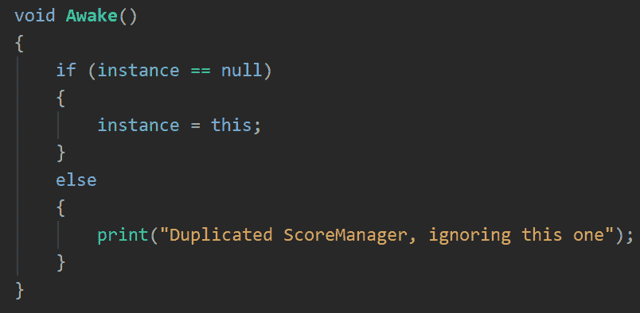
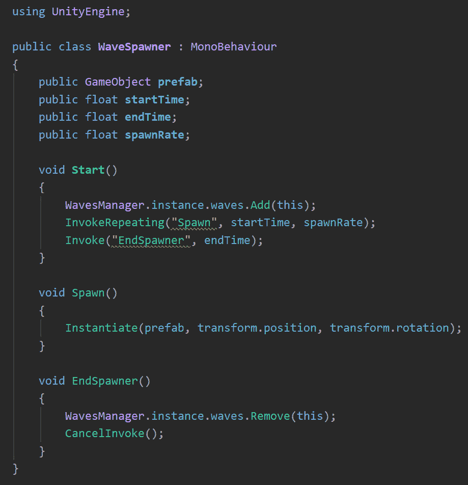
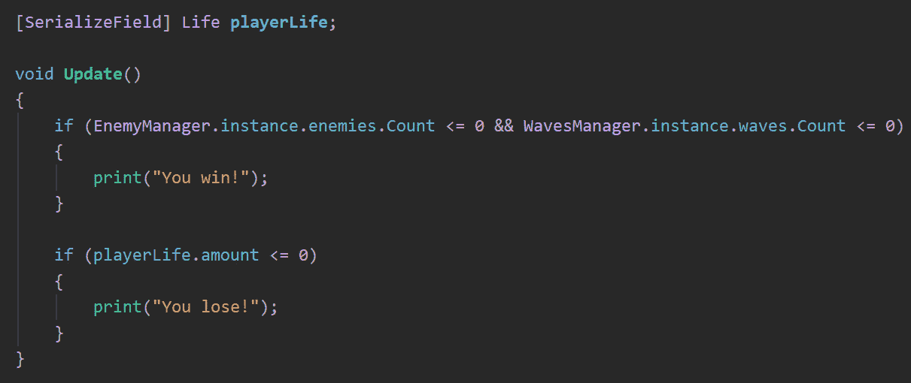
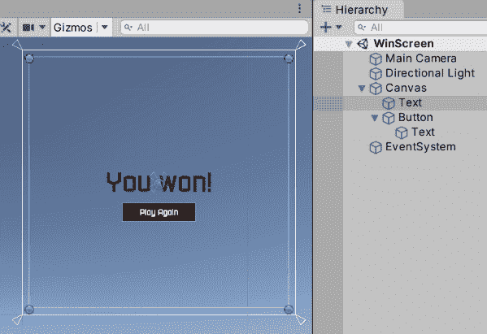
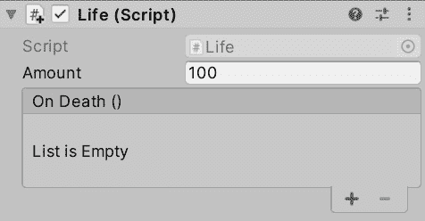
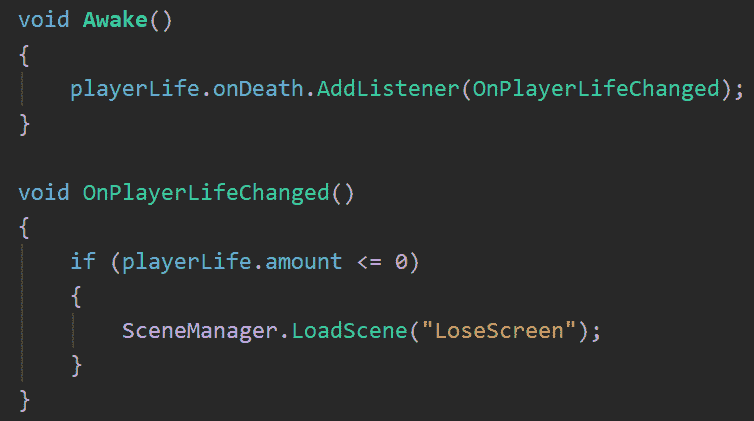
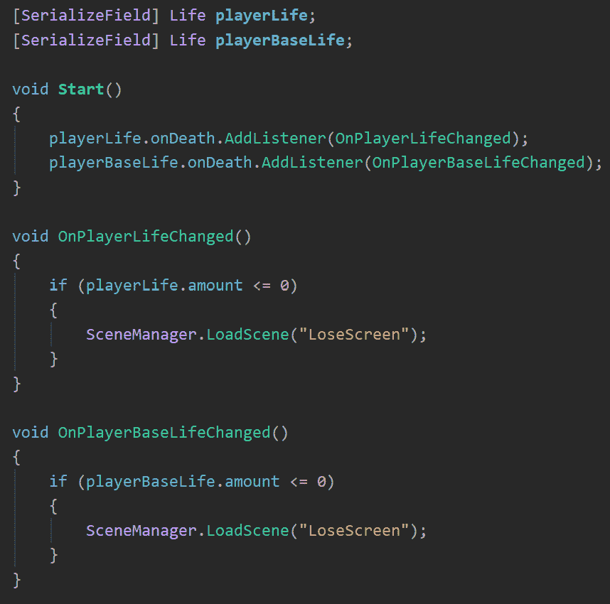
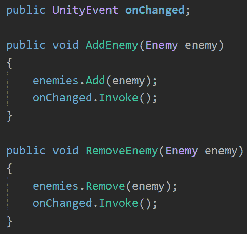
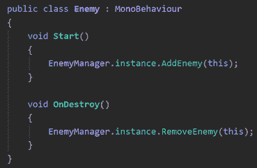
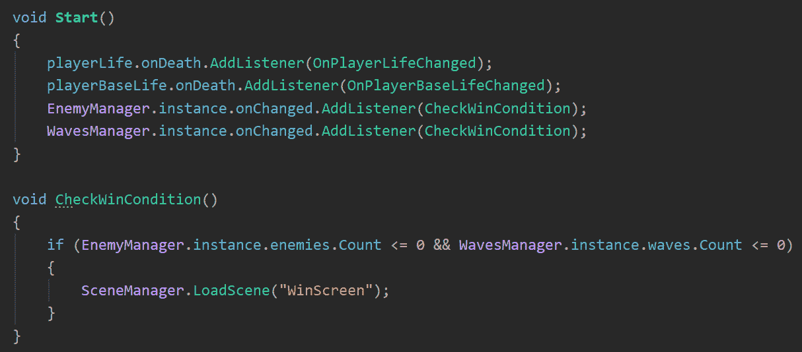

# 十六、输赢条件

现在我们已经拥有了基本的游戏体验，是时候结束游戏了，不管是胜利还是失败。 实现这一点的一种常见方法是，通过独立的组件监督一组对象，以检测需要发生的特定情况，如玩家生命变为 0 或所有波被清除。 我们将通过管理器的概念来实现这一点，管理器是管理多个对象并监视它们的组件。

在本章中，我们将研究以下 Manager 概念:

*   创建对象管理器
*   创建游戏模式
*   用事件改进代码

有了这些知识，你不仅能够创造游戏的胜利和宽松的条件，而且还能够使用像单例和事件监听器这样的设计模式以一种合理的结构化方式来实现这一点。 这些技能不仅可以用于创建游戏的输赢函数代码，也可以用于任何代码。

# 创建对象管理器

并不是场景中的每个物体都应该是可以看到、听到或碰撞到的物体。 一些物体也可以具有概念性意义，而不是有形的东西。 想象一下，你需要统计敌人的数量，你应该将其保存在哪里? 你还需要一个地方保存玩家当前的分数，你可能会认为它可能在玩家本身，但如果玩家死亡并重生会发生什么? 数据将会丢失! 在这种情况下，管理者的概念可以在我们的第一款游戏中解决这个问题，所以让我们来探索一下。

在本章中，我们将看到以下对象管理器的概念:

*   实现单例设计模式
*   使用单例模式创建管理器

我们将从讨论什么是单例设计模式以及它如何帮助我们简化对象之间的通信开始。 通过它，我们将创建 Managers Objects，将允许我们集中一组对象的信息。 让我们开始讨论单例设计模式。

## 实现单例设计模式

设计模式通常被描述为对常见问题的通用解决方案。 在编写游戏代码时，你必须做出一些编码设计决策，但幸运的是，解决最常见情况的方法是众所周知的，并且有文档记录。 在本节中，我们将讨论最常见的设计模式之一 Singleton，这是一个非常有争议但便于在简单项目中实现的模式。

当我们需要一个 Object 的单个实例时，使用 Singleton 模式，这意味着一个类不应该有多个实例，并且我们希望它易于访问(不一定，但在我们的场景中很有用)。 在我们的游戏中有很多例子可以使用这种方法，例如**ScoreManager**，这是一个保存当前分数的组件。 在本例中，我们的得分永远不会超过一个，因此我们可以在这里利用 Singleton Manager 的好处。

一个好处是确保我们不会有重复的分数，这使得我们的代码更不容易出错。 另外,到目前为止,我们需要通过编辑器来创建公共并拖动对象的引用连接两个对象或寻找使用**GetComponent**,但在这个模式中,我们将全球访问单例组件,这意味着你可以把组件的名字,你会访问它。 最后，只有一个**ScoreManager**组件，因此通过 Editor 指定哪个组件是多余的。 这类似于**time. deltatime**，负责管理时间的班级——我们只有一次时间。

重要提示

如果您是一名高级程序员，您现在可能正在考虑代码测试和依赖注入，您是对的，但请记住，到目前为止我们正在尝试编写简单的代码，因此我们将坚持这个简单的解决方案。

让我们创建一个 Score Manager 对象，负责处理分数，通过以下操作来展示一个 Singleton 的例子:

1.  创建一个空的游戏对象(游戏对象**GameObject**|**Create empty**)并将其命名为**ScoreManager**; 通常，管理器被放在空对象中，与场景对象的其余部分分开。
2.  向该对象添加一个名为**ScoreManager**的脚本，该脚本包含一个名为**amount**的**int**字段，该字段将保存当前的分数。
3.  Add a field of the **ScoreManager** type called **instance**, but add the **static** keyword to it; this will make the variable global, meaning it can be accessed anywhere by just writing its name:

    

    图 16.1 -可以在代码的任何地方访问的静态字段

4.  在**Awake**中，检查**实例**字段是否不为空，在这种情况下，使用**this**引用将我们自己设置为实例引用。
5.  In the **else** clause of the null checking **if** statement, print a message indicating that there's a second **ScoreManager** instance that must be destroyed:

    

    图 16.2 -检查是否只有一个 Singleton 实例

    这个想法是为了保存引用的唯一**ScoreManager**静态字段实例的实例,但是如果错误的用户创建了两个对象**ScoreManager**组件,这**如果**声明将检测并通知用户的错误,要求他们采取行动。 在这种情况下,第一个【显示】**ScoreManager 实例执行****清醒会发现没有实例集(字段为 null)它将当前实例,而第二个**【病人】ScoreManager 实例会发现实例已经设置并将打印信息。 记住,**是一个静态字段实例,所有类之间共享,与常规引用字段不同,其中每个组件将有自己的参考,所以在这种情况下,我们有两个【t16.1】ScoreManagers**添加到现场,并且都共享相同的实例字段。****

    **为了进一步完善这个例子，最好能够使用一种简单的方法来找到游戏中的第二个**ScoreManager**。 它会隐藏在等级体系的某个地方，很难找到。 我们可以将**print**替换为**Debug.Log**，这基本上是相同的，但允许我们传递第二个参数给函数，这是一个 Object，当在控制台上单击消息时，它会高亮显示。 在这种情况下，我们将通过**gameObject**引用来允许控制台突出显示复制的对象:**

    ****

    **图 16.3 -使用 Debug.Log 在控制台中打印消息**

***   After clicking the log message, this GameObject will be highlighted in the Hierarchy:

    

    图 16.4 -点击消息后高亮显示的对象

    *   Finally, a little improvement can be made here by replacing **Debug.Log** with **Debug.LogError**, which will also print the message but with an error icon. In a real game, you will have lots of messages in the console, and highlighting the errors over the information messages will help us to identify them quickly:

    

    图 16.5 -使用 LogError 打印错误消息

    *   尝试代码并观察控制台中的错误消息:**

 **

图 16.6 -控制台中出现错误消息

下一步将是在某处使用这个 Singleton，所以在这种情况下，我们将让敌人在他们被杀死时通过以下方法给点:

1.  敌人将脚本添加到**预制叫做**ScoreOnDeath**与**int 字段名为**,这将显示点的数量的敌人会给当死亡。 记住在编辑器中为预制件设置值为 0 以外的值。******
*****   Create the **OnDestroy** event function, which will be automatically called by Unity when this Object is destroyed; in our case, the Enemy:

    

    图 16.7 - OnDestroy 事件函数

    重要提示

    考虑到**OnDestroy**函数在我们改变场景或者游戏退出的时候也会被调用，所以在这个场景中，我们可能会在改变场景的时候得到点数，这是不正确的。 到目前为止，这在我们的案例中还不是问题，但在本章的后面，我们将看到一种防止这种情况的方法。

    *   Access the Singleton reference in the **OnDestroy** function by writing **ScoreManager.instance**, and add the **amount** field of our script to the **amount** field of the Singleton to increase the score when an Enemy is killed:

    

    图 16.8 - ScoreOnDeath 组件类的完整内容

    *   选择等级中的**ScoreManager**，点击播放，杀死一些敌人，看到分数随着每一次杀死而增加。 记得设置预制件的**ScoreOnDeath**组件的数量字段。****

 ****正如你所看到的，Singleton 大大简化了访问**ScoreManager**的方式，并且防止我们拥有同一个 Object 的两个版本，这将帮助我们减少代码中的错误。 考虑的东西,现在你将只会让一切一个单例,比如玩家生活或玩家子弹和使用它只是让你的生活更容易创建游戏等物时,尽管这将完全工作,记住,你的游戏将会改变,我的意思是,很多变化; 任何真正的项目都会受到影响。 也许今天，游戏将只有一个玩家，但也许在未来，你将想要添加第二个玩家或一个 AI 同伴，你希望能量提升也能影响他们，所以如果你滥用单例模式，你将难以处理这些场景。 也许同伴会去拿皮卡，但是主玩家会被治愈!

这里的要点是，在没有其他方法解决问题的情况下，尽可能少地使用该模式。 老实说，没有 Singleton 总是有解决问题的方法，但它们对于初学者来说实现起来有点困难，所以我宁愿简化您的生活，让您保持动力。 通过足够的练习，您将达到可以提高编码标准的程度。

现在，我们知道如何创建单例，让我们完成一些其他的管理器，我们将需要在稍后的游戏。

## 使用单例模式创建管理器

有时候,我们需要一个地方关于一群相似的对象的信息,例如,敌人经理,检查数量的敌人和潜在的访问数组的迭代在他们做一些事情,或者**MissionManager**,访问所有的活动在我们的游戏任务。 同样地，我们也可以将这些情况视为单例，即不会重复出现的单一对象(在我们当前的游戏设计中)，所以让我们创造出我们在游戏中需要的对象，即**EnemyManager**和**WaveManager**。

在我们的游戏中，**EnemyManager**和**WaveManager**只是用来保存游戏中存在的敌人和 wave 的引用数组，以便了解当前的数量。 有一些方法可以搜索特定类型的所有对象来计算它们的数量，但是这些函数开销很大，除非您真正知道自己在做什么，否则不建议使用这些函数。 因此，拥有一个单独的更新列表的 Singleton 将需要更多的代码，但性能会更好。 此外，随着游戏功能的增加，这些管理器将拥有更多的功能和帮助功能来与这些对象交互。

让我们从敌人管理器开始，执行以下操作:

1.  添加一个名为**Enemy**的脚本到 Enemy Prefab; 这将是连接此对象与**EnemyManager**的脚本。
2.  创建一个名为**EnemyManager**的空游戏对象**，并添加一个名为**EnemiesManager**的脚本。**
3.  **创建一个公共静态字段的**EnemiesManager**类型叫做****实例内的脚本,并添加单例重复检查【T6 清醒】**当我们在【显示】ScoreManager。
4.  Create a public field of the **List<Enemy>** type called **enemies**:

    

    图 16.9 -敌人部件列表

    C# 中的列表表示一个动态数组，一个能够添加和删除对象的数组。 您将看到，您可以在 Editor 中向该列表添加和删除元素，但保持列表为空; 我们将以另一种方式添加敌人。 请注意，**List**位于**System.Collections.Generic**命名空间中; 你会在我们脚本的开头找到使用的句子。 此外，考虑一下你可以将列表设置为私有，并通过 getter 而不是将其设置为公共字段来将其公开给代码; 但像往常一样，我们现在将使代码尽可能简单。

    重要提示

    记住，**List**是一个类类型，所以它必须被实例化，但是由于这个类型在编辑器中有暴露支持，Unity 会自动实例化它。 在需要非 editor 公开的列表(比如私有列表或常规非组件 C# 类中的列表)的情况下，必须使用 new 关键字对其进行实例化。

    C# 列表在内部被实现为数组。 如果您需要一个链表，请查看**LinkedList**集合类型。

5.  In the **Start** function of the **Enemy** script, access the **EnemyManager** Singleton and using the **Add** function of the enemies list, add this Object to the list. This will "register" this Enemy as active in the Manager, so other Objects can access the Manager and check for the current enemies. The **Start** function is called after all of the **Awake** function calls, and this is important because we need to be sure that the **Awake** function of the Manager is executed prior to the **Start** function of the Enemy to ensure that there is a Manager set as the instance.

    重要提示

    我们解决的问题与**开始函数称为竞态条件,也就是说,当两段代码不能保证在相同的顺序执行,而**清醒**执行顺序可以改变由于不同的原因。 代码中有很多情况会发生这种情况，所以要注意代码中可能出现的竞争条件。 同样，你也可以考虑使用更高级的解决方案，如延迟初始化，这可以给你更好的稳定性，但同样，为了简单和探索 Unity API，我们现在将使用**Start**函数方法。**

6.  在**OnDestroy**功能中，将敌人从列表中移除，以保持列表只更新活动的敌人:

图 16.10 -敌人脚本将我们自己注册为活跃的敌人

有了这个，现在我们有一个集中的地方，以一种简单而有效的方式接近所有活跃的敌人。 我挑战你对 wave 做同样的，使用**WaveManager**，它将收集所有激活 wave，然后检查所有 wave 是否完成了他们的工作，认为游戏获胜。 花点时间解决这个问题; 你会在下面的截图中找到解决方案，从**WavesManager**开始:

图 16.11 -完整的 WavesManager 脚本

你也需要**WavesSpawner**脚本:

图 16.12 -修改后的 WaveSpawner 脚本以支持 WavesManager

正如你所看到的，**WaveManager**和**EnemyManager**的创建方式相同，只是一个 Singleton，包含**WaveSpawner**的引用，但是**WaveSpawner**不同。 我们执行【显示】添加函数列表的**活动开始的【病人】WaveSpawner 注册波作为一个活跃的一个,但是**删除**功能需要更多的工作。**

 **这个想法是，当刷出者完成它的工作时，当它完成所有敌人的生成时，从活动波列表中注销该波。 在此修改之前，我们使用**Invoke**在一段时间后调用**CancelIncoke**函数来停止生成，但是现在我们需要在结束时间之后做更多的事情。 而不是叫**CancelInvoke**指定波结束时间后,我们将调用自定义函数叫做【显示】EndSpawner,这将调用**CancelInvoke 停止已成熟的雌鱼,调用重复,【病人】 但也将调用**Remove**from**WavesManager**list 函数，以确保当**WaveSpawner**完成其工作时，从 list 中移除**。****

 **使用对象管理器,我们现在集中的一组对象的信息,我们可以添加各种各样的对象组逻辑,但除了这些信息更新 UI(我们将在下一章),我们可以使用这些信息来检测我们的游戏的胜利和失去条件是否得到满足, 创建一个游戏模式对象来检测它。

# 创建游戏模式

我们创造了对象来模拟游戏的许多玩法元素，但游戏总有结束的时候，不管我们是赢还是输。 和往常一样，问题是把这种逻辑放在哪里，这就引出了进一步的问题。 主要的问题是，我们会以同样的方式赢得或输掉比赛吗? 我们会有一个不同标准的特殊关卡，而不是杀死所有的海浪，比如定时生存? 只有您知道这些问题的答案，但是如果现在的答案是否定的，这并不意味着以后不会更改，所以最好准备好我们的代码以无缝地适应更改。

重要提示

老实说，让我们的代码无缝地适应变化几乎是不可能的; 不可能有完美的代码来考虑每一种可能的情况，我们迟早都需要重写一些代码。 我们将努力使代码尽可能适应变化; 总是这样做不会消耗大量的开发时间，而且有时快速编写简单代码比不需要的缓慢编写复杂代码更可取，所以要明智地平衡你的时间预算。

为了做到这一点，我们将把胜利和失败的条件逻辑分离到它自己的对象中，我喜欢将其称为“游戏模式”(不一定是行业标准)。 这将是一个监督游戏的组件，检查需要满足的条件，以考虑游戏结束。 就像我们比赛的裁判一样。 游戏模式将不断检查对象管理器中的信息，也许还会检查其他信息源来检测所需的条件。 将这个物体与其他物体分开可以让我们创造带有不同游戏模式的不同关卡; 只是在那个关卡中使用另一个游戏模式脚本，仅此而已。

在我们的例子中，我们将拥有一个单一的游戏模式，它将检查海浪和敌人的数量是否变为 0，这意味着我们已经杀死了所有可能的敌人，游戏获胜。 此外，它还会检查玩家的生命值是否达到 0，认为在这种情况下游戏已经失败。 让我们通过以下步骤来创建它:

1.  创建一个**游戏模式**空对象，并添加一个**WavesGameMode**脚本。 正如你所看到的，考虑到我们可以添加其他游戏模式，我们给脚本起了一个描述性的名字。
2.  在其**更新**功能中，通过使用 Enemy and Wave Managers 检查敌人和波浪的数量是否达到**0**; 在这种情况下，现在只需在控制台中打印一条消息。 所有列表都有一个**Count**属性，该属性将告诉您存储在其中的元素数量。
3.  添加一个名为**PlayerLife**的**public**field**Life**type，并将玩家拖拽到该字段; 这里的想法是检测失去的条件。
4.  In **Update**, add another check to detect whether the life amount of the **PlayerLife** reference has reached **0**, and in that case, **print** a lose message in the console:

    

    图 16.13 - WavesGameMode 中的胜负条件检查

5.  Play the game and test both cases, whether the Player life reaches 0 or whether you have killed all enemies and waves.

    重要提示

    记住，我们不希望这个对象有两个实例，所以我们也可以让它成为单例，但由于这个对象不会被其他对象访问，这可能是多余的; 我把这个交给你。 无论如何，记住这并不会阻止你实例化两个不同的**游戏模式**; 为此，你可以创建一个**GameMode**基类，使用 Singleton 功能来防止在同一个场景中出现两个**GameMode**。

现在，是时候用更有趣的东西来替换这些消息了。 现在，我们只是将当前场景更改为胜利场景和失败场景，这将只有一个带有胜利和失败信息的 UI 和一个再次游戏的按钮。 在未来，你可以添加一个主菜单场景，并有一个选项回到它。 让我们通过以下步骤来实现:

1.  创建一个新场景(**文件**|**new scene**)并保存它，命名为**WinScreen**。
2.  添加一个 UI 文本并将其与文本居中，**你赢了!** 。
3.  Add a UI Button right below the text and change its text to **Play Again**:

    

    图 16.14 - WinScreen

4.  在项目视图中选择场景，按*Ctrl*+*D*(Mac 上*Cmd*+*D*复制场景。 将其重命名为**LoseScreen**。
5.  双击**LoseScreen**场景打开它，只需更改**你赢了!** 短信配**你输了!** 文本。
6.  Go to **File** | **Build Settings** to open the Scenes in the Build list inside this window.

    其理念是，Unity 需要你明确地声明游戏中必须包含的所有场景。 您可能有测试场景或您还不想发布的场景，所以我们需要这样做。 在我们的例子中,我们的游戏会有**WinScreen**,**LoseScreen**,和现场我们创造了到目前为止与游戏场景中,我叫**游戏,所以就拖那些场景从项目视图构建设置窗口的列表; 我们需要这个来让游戏模式脚本正确地改变场景。 此外，考虑到这个列表中的第一个场景将是我们在最终版本中玩游戏时打开的第一个场景(即构建)，所以你可能想要根据这个列表重新排列:**

    

    图 16.15 -将场景注册到游戏构建中

7.  在**WavesGameMode**中，为**UnityEngine 添加一个**using**语句。 场景管理**命名空间，启用本脚本中的场景切换功能。
8.  Replace the console **print** messages with calls to the **SceneManager.LoadScene** function, which will receive a string with the name of the scene to load; in this case, it would be **WinScreen** and **LoseScreen**. You just need the scene name, not the entire path to the file.

    如果你想链接不同的级别，你可以创建一个**公共**字符串字段，允许你通过编辑器指定加载哪些场景。 记住要把场景添加到 Build Settings 中，如果没有，当你试图更改场景时，你会在控制台中收到一个错误消息:

    

    图 16.16 -使用**SceneManager**切换场景

9.  Play the game and check whether the scenes change properly.

    重要提示

    现在,我们选择最简单的方式给我们输了还是赢了,但也许在未来,你会想要温和的多场景的突然变化,如也许等待几分钟**调用延迟变化或直接展示在游戏获胜的消息而不改变场面。 让玩家测试游戏并检查他们是否理解游戏过程中发生的事情时，游戏反馈对于让玩家意识到正在发生的事情非常重要，这并不是一项容易处理的任务。**

现在我们有了一款功能齐全的简单游戏，带有机制和输赢条件，虽然这已经足够让我们开始开发游戏的其他方面，但我想讨论一下我们当前的 Manager 方法中存在的一些问题，以及如何用事件解决它们。

# 用事件改进我们的代码

到目前为止，我们使用 Unity 事件函数来检测游戏中可能发生的情况，如**Awake**和**Update**。 这些函数是 Unity 通信两个组件的方式，如**OnTriggerEnter**，这是刚体通知游戏对象中其他组件发生碰撞的方式。 在我们的例子中，我们使用**if**内部更新来检测其他组件的变化，例如**GameMode**检查敌人数量是否达到 0。 但如果我们能够从敌人管理器中得知某些内容发生了改变，我们便能够改进这一点，并在那一刻执行签入操作，例如让刚体告诉我们碰撞情况，而不是在每一帧中检查碰撞情况。

有时,我们依靠团结事件执行逻辑,比如中给出的分数被**OnDestroy**事件,告诉我们当对象被销毁,但由于事件的本质,它可以称为我们不想增加的情况下得分,例如当现场更改或游戏关闭。 在这些情况下，物品会被摧毁，但不是因为玩家杀死了敌人，导致分数在不该上升的时候上升。 在这种情况下，如果有一个事件能够告诉我们玩家的生命值已经达到 0，我们便能够执行这一逻辑，而不是依赖于一般目的的破坏事件。

事件的想法是改进我们的对象之间的通信模型，确保在某些事情发生的确切时刻，该情况中感兴趣的部分会被通知做出相应的反应。 Unity 拥有许多事件，但我们可以根据游戏逻辑创造特定的事件。 让我们在前面讨论的 Score 场景中看到这一点; 其思想是让**寿命**组件有一个事件来通知其他组件，该对象因为其寿命达到 0 而被销毁。

有几种实现方法，我们将使用与**Awake**和**Update**方法不同的方法; 我们将使用**UnityEvent**字段类型。 这是一种字段类型，能够在我们想要执行的时候保存函数的引用，就像 C# 委托，但也有其他好处，比如更好的 Unity Editor 集成。 要实现这一点，请执行以下操作:

1.  In the **Life** component, create a **public** field of the **UnityEvent** type called **onDeath**. This field will represent an event where other classes can subscribe to it to be aware of when **Life** reaches 0:

    

    图 16.17 -创建自定义事件字段

2.  If you save the script and go to the Editor, you can see the event in the Inspector. Unity Events support subscribing methods to them in the Editor so we can connect two Objects together. We will use this in the UI scripting chapter, so let's just ignore this for now:

    

    图 16.18 - UnityEvents 出现在检查器中

    重要提示

    您可以使用泛型委托行动或一个自定义的委托来创建事件而不是使用**UnityEvent**,除了某些性能方面,唯一明显的区别是,**UnityEvent**将显示在编辑器中,*步骤 2 所示的【5】。*

3.  When life reaches **0**, call the **Invoke** function of the event, and this way, we will be telling anyone interested in the event that it has happened:

    

    图 16.19 -执行事件

4.  在**ScoreOnDeath**中，将**OnDestroy**功能重命名为**GivePoints**或任何你喜欢的名称; 这里的想法是停止给点在**OnDestroy**事件。
5.  在**ScoreOnDeath**脚本的**Awake**函数中，使用**GetComponent**获取**Life**组件，并将其保存在一个局部变量中。
6.  Call the **AddListener** function of the **onDeath** field of the **Life** reference and pass the **GivePoints** function as the first argument. The idea is to tell **Life** to execute **GivePoints** when the **onDeath** event is invoked. This way, **Life** informs us about that situation. Remember that you don't need to call **GivePoints**, but just pass the function as a field:

    

    图 16.20 -订阅 OnDeath 事件以在该场景中给出点数

    重要提示

    考虑在**OnDestroy**中调用**RemoveListener**; 通常，在可能的情况下取消订阅侦听器是很方便的，以防止任何内存泄漏(防止 GC 释放内存的引用)。 在这种情况下，它不是完全必要的，因为**Life**和**ScoreOnDeath**组件将同时被破坏，但请尝试习惯这种良好的做法。

7.  Save, select **ScoreManager** in the Editor, and hit play to test this. Try deleting an Enemy from the Hierarchy while in Play Mode to check how the score doesn't rise because the Enemy was destroyed for any other reason than its life becoming 0; you must destroy an Enemy by shooting at them to see the score being raised.

    现在**生命**有了**死亡**事件，我们也可以从**WavesGameMode**中替换玩家的**生命**检查，通过以下操作使用该事件:

8.  在**WavesGameMode**脚本中创建**OnLifeChanged**函数，并将生命检查条件从**更新**移动到该函数中。
9.  在**Awake**中，订阅这个新功能到玩家**Life**组件参考的**onDeath**事件:

图 16.21 -检查事件的丢失条件

正如你所看到的,创建自定义事件让你发现更多具体情况以外的违约在统一中,并保持您的代码干净,无需不断问条件**更新**功能,这未必是坏事,但事件方法生成清晰的代码。

记住我们也会失去我们的游戏玩家的基地生活达到 0,我们将探索玩家的基地的概念在这本书,但是现在,让我们创建一个立方体代表敌人的对象将攻击减少基础生活,像基本核心。 考虑到这一点，我建议您在我们的脚本中添加另一个 lose 条件。 当你完成后，你可以在下面的截图中检查解决方案:

图 16.22 - Complete WavesGameMode lose condition

正如你所看到的,我们只是重复了生活事件订阅:记得要创建一个对象来表示的基础伤害,添加一个**生活**脚本,并拖动一个玩家基地生活参考**WavesGameMode**。

现在，让我们通过在管理器中应用它来说明这个概念，以防止游戏模式在每一帧中检查条件:

1.  在**EnemyManager**中添加一个**UnityEvent**字段，命名为**onChanged** 当敌人从列表中添加或删除时，此事件将执行。
2.  创建两个函数，**添加敌人**和**移除敌人**，都接收一个**敌人**类型的参数。 这个想法是，与其直接将**Enemy**从列表中添加或删除自己，它应该使用这些函数。
3.  Inside these two functions, invoke the **onChanged** event to inform others that the enemies list has been updated. The idea is that anyone who wants to add or remove enemies from the list needs to use these functions:

    

    图 16.23 -添加或删除敌人时调用事件

    重要提示

    这里的问题是，没有任何东西阻止我们绕过这两个函数，直接使用列表。 您可以通过将列表设置为私有并使用**IReadOnlyList**接口公开它来解决这个问题。 请记住，这样一来，出于调试目的，该列表在 Editor 中就不可见了。

4.  Change the **Enemy** script to use these functions:

    

    图 16.24 -让敌人使用添加和删除功能

5.  Repeat the same process for **WaveManager** and **WaveSpawner**, create an **onChanged** event, and create the **AddWave** and **RemoveWave** functions and call them in **WaveSpawner** instead of directly accessing the list. This way, we are sure the event is called when necessary as we did with **EnemyManager**. Try to solve this step by yourself and then check the solution in the following screenshot, starting with **WavesManager**:

    

    图 16.25 - Wave Manager On Changed 事件实现

    同时，**WavesSpawner**也需要改变:

    

    图 16.26 -实现 AddWave 和 RemoveWave 函数

6.  **WavesGameMode**,**重命名更新****CheckWinCondition**和订阅这个函数**onchange 事件【显示】EnemyManager 和**【病人】的**onchange 事件 WavesManager。 这个想法是为了检查敌人的数量和只有在必要的时候才改变波浪。 记住在**Awake**中初始化单例时要在**Start**函数中订阅事件:**

 **

图 16.27 -当敌人或波浪数量改变时检查胜利条件

是的,这样,我们需要编写更多的代码,并在功能方面,我们没有获得任何新东西,但在较大的项目,管理条件通过**更新检查将导致不同的问题正如前面讨论的,等竞争条件和性能问题。 拥有一个可扩展的代码库有时需要更多的代码，这就是其中一种情况。**

 **在我们结束之前，我们需要考虑的是 Unity 事件并不是在 Unity 中创造这种事件交流的唯一方式; 你会发现一个类似的方法，叫做**Action**，这是 Unity 事件的原生 C# 版本，如果你想看到所有的选项，我建议你去寻找它。

# 总结

在这一章中，我们完成了游戏的一个重要部分，即结局，不管是胜利还是失败。 我们讨论了一个简单但强大的方法将不同层的责任通过经理通过创建单例,保证没有多个实例的各种管理和简化它们之间的连接通过静态访问(考虑一天你发现代码测试)。 此外，我们访问了事件的概念，以简化对象之间的通信，以防止问题，并在对象之间创建更有意义的通信。

有了这些知识，你不仅能够发现游戏的胜利和失败条件，而且还能够以一种更好的结构方式去做。 这些模式对改进我们的游戏代码非常有用，我建议你尝试将其应用到其他相关场景中。

在下一章中，我们将结合脚本和我们在*第 2 部分*中整合的素材，探索如何创建针对游戏玩法的视觉和音频反馈。**************