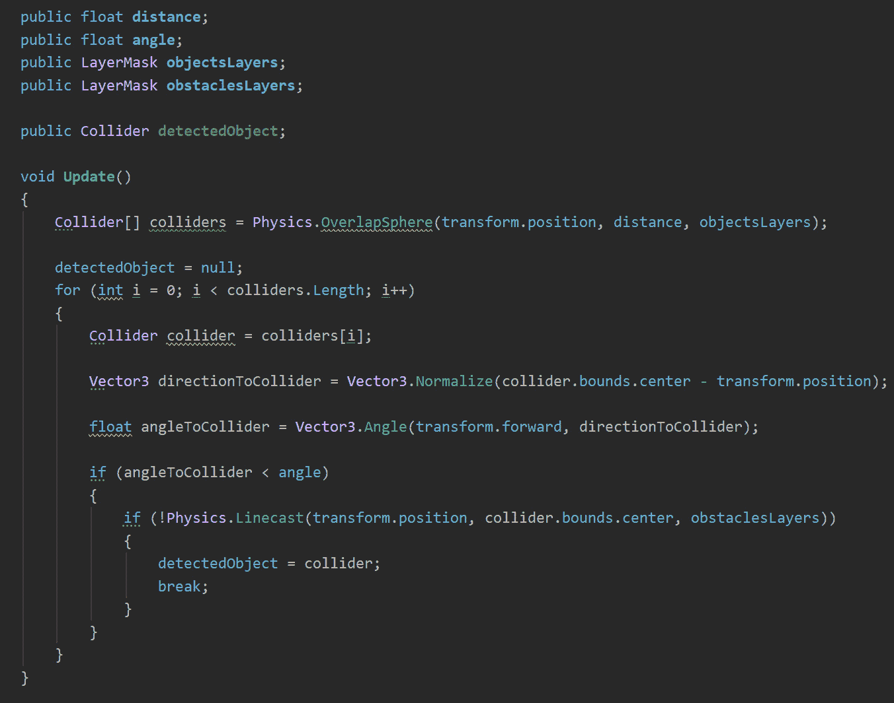
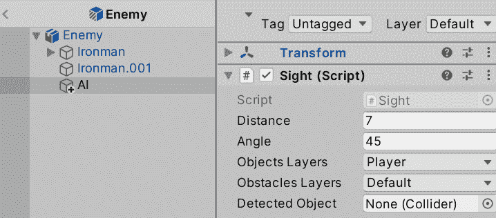
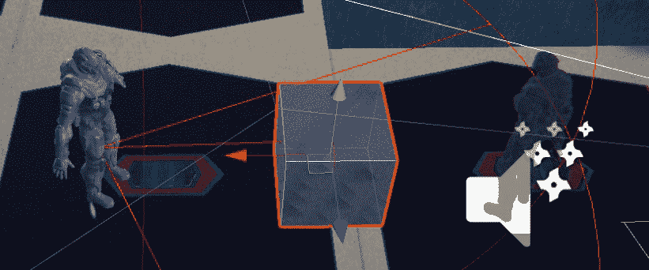
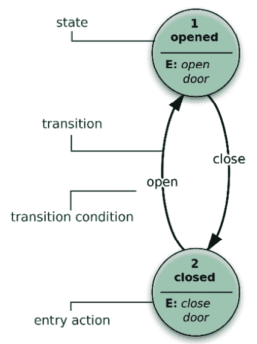
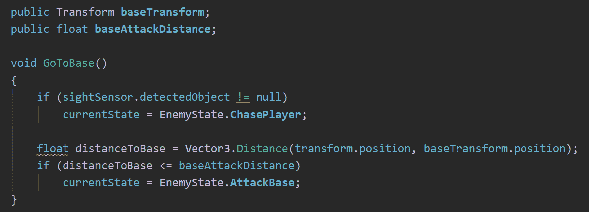
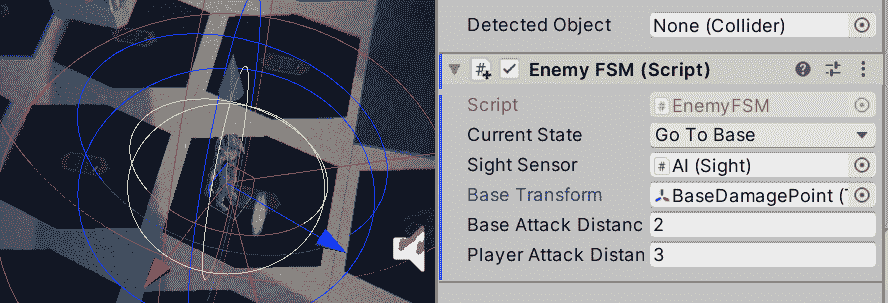
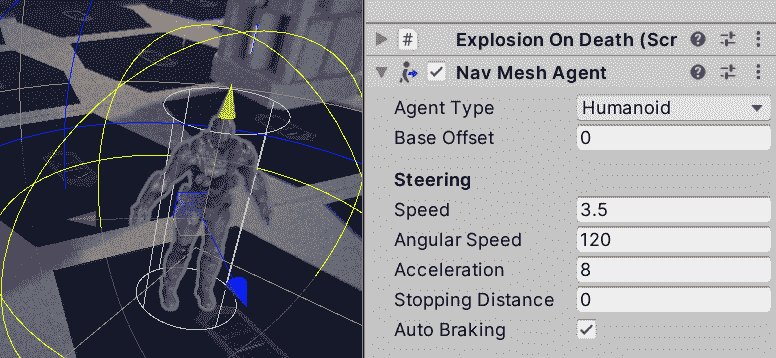
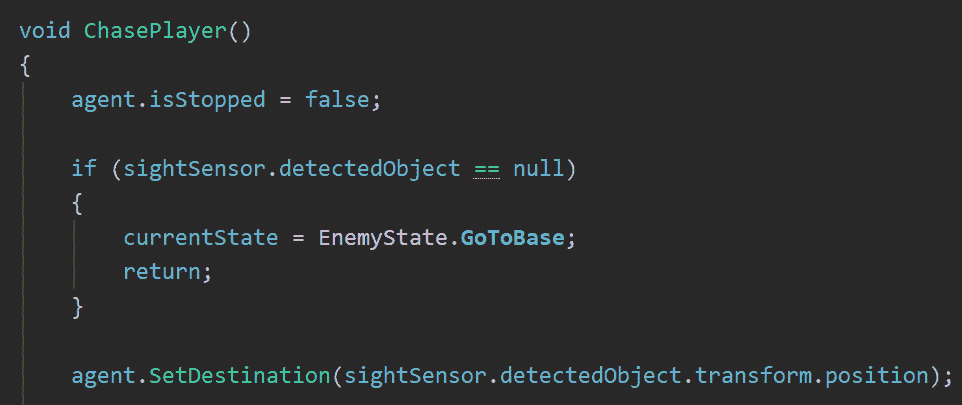
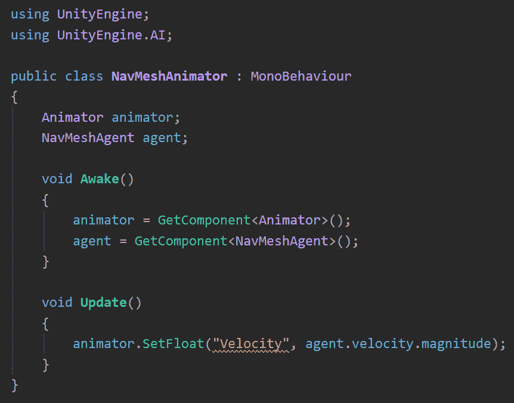
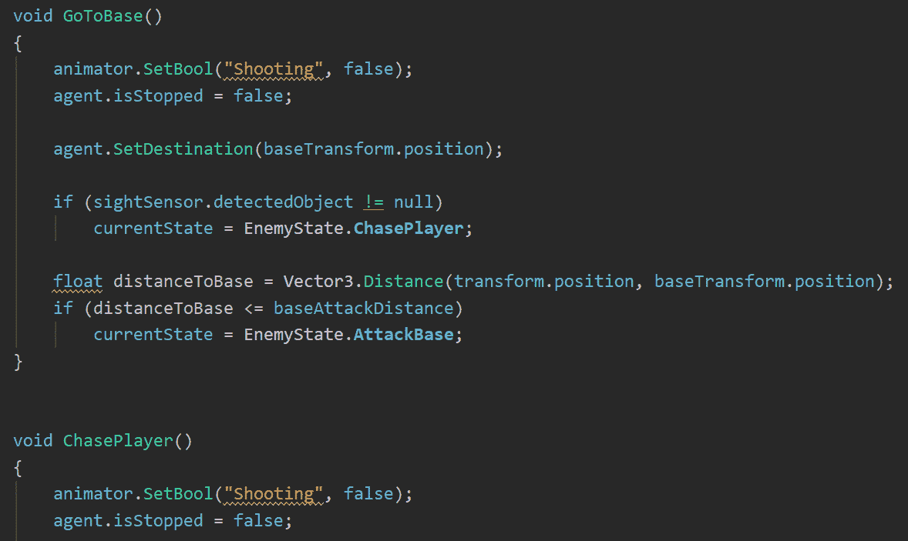

# 十八、执行游戏 AI 来建造敌人

如果游戏对玩家来说不是一个巨大的挑战，他们需要使用角色的能力去处理不同的场景，那还算什么游戏? 每款游戏都会给玩家设置不同类型的障碍，而我们游戏中的主要障碍便是敌人。 创造具有挑战性且可信的敌人可能很复杂，他们需要表现得像真正的角色，并且足够聪明，不容易被杀死，但也要足够简单，让他们不是不可能被杀死。 我们将使用基本但足够好的 AI 技术来实现这一点。

在本章中，我们将研究以下 AI 概念:

*   使用传感器收集信息
*   与 FSMs 一起做决定
*   执行 FSM 的行为

# 利用传感器收集信息

AI 首先通过获取有关其周围环境的信息来工作，然后通过分析这些数据来决定一个行动，最后执行所选择的行动，正如你所看到的，我们不能在没有信息的情况下做任何事情，所以让我们从这部分开始。 有几种人工智能可以使用的信息来源,如数据本身(生活和子弹)或者一些游戏状态(获胜条件或剩余的敌人),可以很容易地发现,到目前为止我们看到的代码,但有一个重要的信息来源也是人工智能感官。 根据游戏的需要，我们可能需要不同的感官，如视觉和听觉，但在我们的情况下，视觉就足够了，所以让我们学习如何编码。

在本节中，我们将研究以下传感器概念:

*   创建 Three-Filters 传感器
*   调试和小玩意

让我们开始了解如何使用三过滤器方法创建传感器。

## 创建三过滤器传感器

编码感知的常见方法是通过三过滤器方法来丢弃视线之外的敌人。 第过滤器,过滤器是一个距离将丢弃敌人太远,然后角度检查,将检查的敌人在我们观看锥,最后 raycast 检查,正在被我们丢弃的敌人墙壁等障碍物。 在开始之前，有一个建议:我们将在这里使用向量数学，深入讨论这些主题超出了本书的范围。 如果你有什么不明白的地方，你可以在截图中复制粘贴代码，然后在网上查找这些概念。 让我们以以下方式编码传感器:

1.  Create an empty **GameObject** called **AI** as a child of the **Enemy** Prefab. You need to first open the Prefab to modify its children (double-click the Prefab). Remember to set the transform of this Object to **position (****0,0,0****)**, **rotation (****0,0,0)**, and **scale (****1,1,1****)** so it will be aligned to the Enemy. While we can certainly just put all AI scripts directly in the Enemy, we did this just for separation and organization:

    

    图 18.1 - AI 脚本容器

2.  创建一个名为**Sight**的脚本，并将其添加到 AI 子对象中。
3.  Create two fields of the **float** type called **distance** and **angle**, and another two of the **LayerMask** type called **obstaclesLayers** and **ObjectsLayers**. **distance** will be used as the vision distance, angle will determine the amplitude of the view cone, **ObstacleLayers** will be used by our obstacle check to determine which Objects are considered obstacles, and **ObjectsLayers** will be used to determine what types of Objects we want the sight to detect. We just want the sight to see enemies; we are not interested in Objects such as walls or power-ups. **LayerMask** is a property type that allows us to select one or more layers to use inside code, so we will be filtering Objects by layer. In a moment, you will see how we use it:

    

    图 18.2 -视力检查参数的字段

4.  In **Update**, call **Physics.OverlapSphere** as in the next screenshot. This function creates an imaginary sphere in the place specified by the first parameter (in our case, our position) and with a radius specified in the second parameter (the **distance** property) to detect Objects with the layers specified in the third parameter (**ObjectsLayers**). It will return an array with all Objects Colliders found inside the sphere, these functions use Physics to do the check, so the Objects must have at least one collider. This is the way we will be using to get all enemies inside our view distance, and we will be further filtering them in the next steps.

    重要提示

    完成第一个检查的另一种方法是检查与玩家的距离，或者如果寻找其他类型的对象，即与包含它们列表的管理器的距离，但我们选择的方法更通用，可以用于任何类型的对象。

    此外，您可能需要检查**物理。 该函数的 OverlapSphereNonAlloc**版本，它做同样的事情，但通过不分配数组来返回结果，性能更高。

5.  Iterate over the array of Objects returned by the function:

    

    图 18.3 -在一定距离内获得所有物体

6.  To detect whether the Object falls inside the vision cone, we need to calculate the angle between our viewing direction and the direction to the Object itself. If the angle between those two directions is less than our cone angle, we consider that the Object falls inside our vision. We can start detecting the direction toward the Object, which is calculated normalizing the difference between the Object position and ours, like in the following screenshot. You might notice we used **bounds.center** instead of **transform.position**; this way, we check the direction to the center of the Object instead of its pivot. Remember that the Player's pivot is in the ground and the ray check might collide against it before the Player:

    

    图 18.4 -计算从我们的位置到碰撞器的方向

7.  We can use the **Vector3.Angle** function to calculate the angle between two directions. In our case, we can calculate the angle between the direction toward the Enemy and our forward vector to see the angle:

    

    图 18.5 -计算两个方向之间的夹角

    重要信息

    如果愿意，可以使用**Vector3。 点**，它将执行点积。 **Vector3。 角**实际上使用的是这个角，但要将点积的结果转换成一个角，就需要用到三角函数，而这可能是很昂贵的计算方法。 无论如何，我们的方法更简单和快速，而你没有大量的传感器(50+，取决于目标设备)，这在我们的情况下不会发生。

8.  现在检查计算出的角度是否小于**角度**字段中指定的角度。 假设我们设一个角为 90 度，它实际上是 180 度，因为如果**Vector3。 角度**函数返回，例如，30，它可以是向左或向右 30。 如果我们的角度是 90 度，它可以向左或向右都是 90 度，所以它会检测 180 度弧内的物体。
9.  Use the **Physics.Line** function to create an imaginary line between the first and the second parameter (our position and the collider position) to detect Objects with the layers specified in the third parameter (the **obstacles** layers) and return **boolean** indicating whether that ray hit something or not. The idea is to use the line to detect whether there are any obstacles between ourselves and the detected collider, and if there is no obstacle, this means that we have a direct line of sight toward the Object. Again, remember that this function depends on the obstacle Objects having colliders, which in our case, we have (walls, floor, and so on):

    

    图 18.6 -使用直线投射检查传感器和目标物体之间的障碍物

10.  If the Object passes the three checks that means that this is the Object we are currently seeing, so we can save it inside a field of the **Collider** type called **detectedObject**, to save that information for later usage by the rest of the AI scripts. Consider using **break** to stop **for** that is iterating the colliders to prevent wasting resources by checking the other Objects, and to set **detectedObject** to **null** before **for** to clear the result from the previous frame, so in case, in this frame, we don't detect anything, it will keep the null value so we can notice that there is nothing in the sensor:

    

    图 18.7 -全传感器脚本

    重要信息

    在我们的例子中,我们使用传感器来寻找球员,唯一对象的传感器负责寻找,但是如果你想使传感器更先进,你可以保持检测对象的列表,把里面每一个对象,通过了三个测试而不是第一个。

11.  In the Editor, configure the sensor as you wish. In this case, we will set **ObjectsLayer** to **Player** so our sensor will focus its search on Objects with that layer, and **obstaclesLayer** to **Default**, the layer we used for walls and floors:

    

    图 18.8 -传感器设置

12.  为了测试这一点，你只需在玩家面前放置一个移动速度为 0 的敌人，选择它的 AI 子对象，然后玩游戏，看看属性在检查器中是如何设置的。 此外，尝试在两者之间放置一个障碍，并检查属性是否为“None”(**null**)。 如果你没有得到预期的结果，请仔细检查你的脚本，它的配置，以及播放器是否有**Player**层和障碍是否有**默认**层。 此外，你可能需要将 AI 对象抬高一点，以防止光线从地下开始击中它:

图 18.9 -传感器捕获玩家

即使我们让我们的传感器工作，有时检查它是否工作或配置正确需要一些视觉辅助，我们可以使用**Gizmos**创建。

## Gizmos 调试

由于我们将创建我们的 AI，我们将开始在边缘情况下检测某些错误，通常与错误配置有关。 你可能会认为玩家处于敌人的视线范围内，但你可能看不到视线被一个物体挡住，特别是在敌人不断移动的情况下。 调试这些场景的一种好方法是通过称为**Gizmos**的仅 editor 的可视化辅助工具，它允许您可视化不可见的数据，例如用于检测障碍的可视距离或线投射。

让我们开始看看如何创建**Gizmos**，通过绘制一个代表视线距离的球体，执行以下操作:

1.  在**Sight**脚本中，创建一个名为**OnDrawGizmos**的事件函数。 这个事件只在编辑器中执行(而不是在构建中)，并且是 Unity 要求我们绘制**Gizmos**的地方。
2.  Use the **Gizmos.DrawWireSphere** function passing our position as the first parameter and the distance as the second parameter to draw a sphere in our position with the radius of our distance. You can check how the size of the Gizmo changes as you change the distance field:

    

    图 18.10 -球面小座标

3.  Optionally, you can change the color of the Gizmo, setting **Gizmos.color** prior to calling the drawing functions:

    

    图 18.11 - Gizmos 绘图代码

    重要信息

    现在你正在不断绘制**Gizmos**，如果你有很多敌人，他们可能会用太多**Gizmos**污染场景视图。 在这种情况下，尝试使用**OnDrawGizmosSelected**事件函数，它只在对象被选中时绘制**Gizmos**。

4.  We can draw the lines representing the cone using **Gizmos.DrawRay**, which receives the origin of the line to draw and the direction of the line, which can be multiplied by a certain value to specify the length of the line, as in the following screenshot:

    

    图 18.12 -绘制旋转线条

5.  在截图中，我们使用了**四元数。 欧拉**生成基于我们想要旋转的角度的四元数。 如果你用这个四元数乘以一个方向，我们就会得到旋转的方向。 我们取我们的正向矢量并根据角场旋转它来产生我们的锥体视线。 同时，我们将这个方向乘以视线距离，画出我们视线所及的范围; 你会看到直线如何匹配球体的末端:

图 18.13 -视角线

我们也可以绘制线投射，它检查障碍，但取决于游戏的当前情况，例如通过前两个检查的对象及其位置，我们可以使用**调试。 DrawLine**，可以在**Update**方法中执行。 这个版本的**DrawLine**被设计成只在运行时使用。 我们看到的**Gizmos**也在编辑器中执行。 让我们试试下面的方法:

1.  First, let's debug the scenario where **LineCast** didn't detect any obstacles, so we need to draw a line between our sensor and the Object. We can call **Debug.DrawLine** in the **if** statement that calls **LineCast**, as in the following screenshot:

    

    图 18.14 -在 Update 中绘制一条线

2.  In the next screenshot, you can see **DrawLine** in action:

    

    图 18.15 -指向被检测对象的行

3.  We also want to draw a line in red when the sight is occluded by an Object. In this case, we need to know where the Line Cast hit, so we can use an overload of the function, which provides an **out** parameter that gives us more information about what the line collided with, such as the position of the hit and the normal and the collided Object, as in the following screenshot:

    

    图 18.16 -获取关于 Linecast 的信息

    重要信息

    考虑到**Linecast**并不总是与最近的障碍物发生碰撞，而是与它在直线中检测到的第一个物体发生碰撞，这个物体的顺序可能不同。 如果你需要检测最近的障碍，寻找**物理。 光线投射**版本的功能。

4.  We can use that information to draw the line from our position to the hit point in the **else** clause of the **if** sentence, when the line collides with something:

    

    图 18.17 -画一条线以防我们遇到障碍

5.  在下面的截图中，你可以看到结果:

图 18.18 -障碍物遮挡视线时的连线

现在我们已经完成了传感器，让我们使用它们提供的信息与**有限状态机(FSMs)**进行决策。

# 与 FSMs 进行决策

当我们在过去的动画器中使用 FSMs 时，我们探索了 FSMs 的概念。 我们了解到 FSM 是一组状态的集合，每一个状态代表一个 Object 每次可以执行的一个动作，以及一组转换说明状态如何切换。 这一概念不仅应用于动画中，也应用于无数编程场景中，其中最常见的就是 AI。 我们可以在状态中用 AI 代码替换动画，我们就有了 AI FSM。

在本节中，我们将检验以下 AI FSM 的概念:

*   创建 FSM
*   创建转换

让我们开始创建 FSM 骨架。

## 创建 FSM

为了创建我们自己的 FSM，我们需要概述一些基本概念。 请记住，一个 FSM 可以为它可以执行的每个可能的操作拥有一个状态，并且一次只能执行一个。 在 AI 方面，我们可以巡逻，攻击，逃跑等等。 此外，还需要记住状态之间存在着过渡，即决定从一种状态转变为另一种状态所需要满足的条件，就 AI 而言，这可能是玩家靠近敌人而开始攻击，或生命值较低而开始逃离。 在下面的截图中，你可以找到一个简单的例子来提醒你门的两种可能状态:

图 18.19 - FSM 实例

有几种方法可以为 AI 执行 FSMs; 你甚至可以使用 Animator，如果你想或下载一些 FSM 系统从素材存储。 在我们的例子中，我们将采取最简单的方法，一个带有一组**If**句子的单一脚本，这可能是基本的，但仍然是理解概念的良好开端。 让我们通过以下步骤来实现它:

1.  在敌人的 AI 子对象中创建一个名为**EnemyFSM**的脚本
2.  创建**enum****EnemyState**与**GoToBase**,**AttackBase**、【显示】ChasePlayer,和**AttackPlayer 值。 我们的 AI 中会有这些状态。**
3.  Create a field of the **EnemyState** type called **currentState**, which will hold, well, the current state of our Enemy:

    

    图 18.20 - EnemyFSM 状态定义

4.  创建三个以我们定义的状态命名的函数。
5.  Call those functions in **Update** depending on the current state:

    

    图 18.21—基于 if 的 FSM

    重要信息

    是的，您完全可以在这里使用开关，但我只是更喜欢常规的**if**语法。

6.  在编辑器中测试改变**currentState**字段将如何改变哪个状态是活动的，查看控制台打印的消息:

图 18.22 -状态测试

正如你所看到的，这是一个非常简单但功能齐全的方法，所以让我们继续使用这个 FSM，创建它的转换。

## 创建过渡

如果你还记得在动画控制器中创建的转换，这些基本上是一个条件集合，如果转换所属的状态是活动的，就检查这些条件。 在我们的 FSM 方法中，这可以简单地翻译成 If 语句来检测状态内部的条件。 让我们创建如下所提议的状态之间的转换:

1.  添加一个字段的**看到**类型叫做**sightSensor**在我们 FSM 脚本,并拖动 AI**GameObject**字段连接到**看到**组件。 FSM 的组件是在同一个对象【显示】,我们还可以使用**GetComponent**相反,但在先进的 AIs,你可能有不同的传感器,检测不同的对象,所以我更喜欢准备脚本场景,但挑选你最喜欢的方法。
2.  In the **GoToBase** function, check whether the detected Object of the **Sight** component is not **null**, meaning that something is inside our line of vision. If our AI is going toward the base but detects an Object in the way there, we must switch to the **Chase** state to pursue the Player, so we change the state, as in the following screenshot:

    

    图 18.23 -创建转换

3.  Also, we must change to **AttackBase** in case we are near enough the Object that must be damaged to decrease the base life. We can create a field of the **Transform** type called **baseTransform** and drag the Base Life Object there so we can check the distance. Remember to add a **float** field called **baseAttackDistance** to make that distance configurable:

    

    图 18.24 -转到基转换

4.  In the case of **ChasePlayer**, we need to check whether the Player is out of sight to switch back to the **GoToBase** state or whether we are near enough the **Player** to start attacking it. We will need another **distance** field, which determines the distance to attack the Player, and we might want different attack distances for those two targets. Consider an early return in the transition to prevent getting **null** reference exceptions if we try to access the position of the sensor-detected Object when there is none:

    

    图 18.25 -追逐玩家过渡

5.  For **AttackPlayer**, we need to check whether **Player** is out of sight to get back to **GoToBase** or whether it is far enough to go back to chasing it. You can notice how we multiplied **PlayerAttackDistance** to make the stop-attacking distance a little bit larger than the start-attacking distance; this will prevent switching back and forth rapidly between attack and chase when the Player is near that distance. You can make it configurable instead of hardcoding **1.1**:

    

    图 18.26 -攻击玩家过渡

6.  在我们的例子中，**AttackBase**不会有任何转换。 一旦敌人足够接近基地，它就会保持这种状态，即使玩家开始射击它。 它的唯一目标就是摧毁基地。
7.  Remember you can use **Gizmos** to draw the distances:

    

    图 18.27 - FSM Gizmos

8.  测试脚本在点击 play 之前选择 AI 对象，然后移动玩家，检查检查器中状态的变化。 您还可以将原始打印消息保持在每个状态，以便在控制台中查看它们的更改。 记住要设置攻击距离和对象的引用。 在截图中，你可以看到我们使用的设置:

图 18.28 -敌方 FSM 设置

我们现在面临的一个小问题是，衍生的敌人将没有必要的引用来进行距离计算到基变换。 你会注意到，如果你试图将场景中的敌人的变化应用到预制组件(**覆盖|全部**)，基变换将显示**无**。 记住，预制件不能包含场景中对象的引用，这使我们的工作复杂化。 另一种选择是创建**BaseManager**，这是一个保存伤害位置引用的单例对象，这样我们的**EnemyFSM**就可以访问它。 另一种可能是利用**GameObject 等功能。 找到我们的目标。**

在本例中，我们将尝试后者。 即使它的性能不如 Manager 版本，我还是想向你展示如何使用它来扩展你的 Unity 工具集。 在本例中，只需将**Awake**中的**baseTransform**字段设置为**GameObject 的返回值。 使用**BaseDamagePoint**作为的第一个参数查找**，它将查找像下面的屏幕截图那样的对象。 另外，可以从**baseTransform**字段中删除 private 关键字; 既然已经通过代码设置了，那么除了调试之外，在编辑器中显示它就没有什么意义了。 你会看到现在我们的波浪产生的敌人将改变状态:

图 18.29 -根据名称在场景中搜索对象

既然我们的 FSM 状态已经编码并进行了适当的转换，让我们让它们做一些事情。

## 执行 FSM 的操作

现在我们需要做最后一个步骤——让 FSM 做一些有趣的事情。 在这里，我们可以做很多事情，如射击基地或玩家，并将敌人推向其目标(游戏邦注:即玩家或基地)。 我们将使用名为**NavMesh**的 Unity 寻路系统来处理移动，这个工具允许我们的 AI 计算并穿越两点之间的路径以避开障碍物，这需要一些准备工作。

在本节中，我们将检验以下 FSM 动作概念:

*   计算我们的场景寻路
*   使用寻路
*   添加最后的细节

让我们开始用寻路来准备我们的场景。

## 计算场景寻路

寻路算法依赖于场景的简化版本。 分析一个复杂场景的完整几何结构几乎不可能实时完成。 从场景中提取寻径信息有几种方法来表示，比如 Graphs 和 NavMesh 几何图形。 Unity 使用后者——一种简化的网格，类似于 3D 模型，它覆盖了 Unity 确定的可步行的所有区域。 在下面的截图中，你可以找到一个场景中生成的**NavMesh**的例子，也就是浅蓝色的几何图形:

图 18.30 -场景中可步行区域的导航网格

根据场景的大小，生成一个**NavMesh**可能需要几秒到几分钟的时间。 这就是为什么 Unity 的寻径系统只在编辑器中计算一次，所以当我们发行游戏时，用户将使用预先生成的**NavMesh**。 就像 Lightmapping 一样，一个**NavMesh**被烤到一个文件中供以后使用。 像 Lightmapping 一样，这里的主要警告是**NavMesh**对象在运行时不能改变。 如果你摧毁或移动地砖，AI 仍然会走过该区域。 在它上面的**NavMesh**不会注意到地板已经不在了，所以你不能以任何方式移动或修改这些对象。 幸运的是，在我们的例子中，我们不会在运行时对场景进行任何修改，但请记住，有一些组件，如**navmeshobbalance**可以在这些场景中帮助我们。

为我们的场景生成一个**NavMesh**，执行以下步骤:

1.  选择任何可行走物体及其上方的障碍物，如地板、墙壁等，并将其标记为**静态**。 你可能记得**静态**复选框也会影响 Lightmapping,所以如果你想要一个物体不是 Lightmapping 的一部分,但为**NavMesh**生成,您可以单击箭头在左边的静态检查并选择**导航静态【显示】。 试着将导航静态对象限制在那些敌人将会通过的对象上，以提高**NavMesh**生成速度。 在我们的情况下，让地形可导航将大大增加生成时间，我们将永远不会在那个区域玩游戏。**
2.  在**窗口| AI | Navigation**打开**NavMesh**面板。
3.  选择**Bake**标签，点击窗口底部的**Bake**按钮，检查生成的**NavMesh**:

图 18.31 -生成导航网格

这就是你需要做的所有事情。 当然,还有大量的设置可以吊儿郎当,比如**最大斜率**,这表明边坡的最大角 AI 能够攀升,高度或**一步,这将决定 AI 可以爬楼梯,连接层的步骤之间的**NavMesh**, 但由于我们有一个简单的场景，默认设置就足够了。**

现在，让我们让 AI 在**NavMesh**中移动。

## 使用寻径

制造一个人工智能对象与**移动 NavMesh**,统一提供了**NavMeshAgent**组件,这将使我们的 AI 坚持**NavMesh**,防止对象去外面。 不仅计算路径自动指定的目的地也将对象通过转向的路径使用行为的算法模拟人类将通过路径的方式,减缓在角落,篡改而不是瞬间。 此外，这个组件还能够避开在场景中运行的其他**navmeshagent**，防止所有敌人在相同位置崩溃。

让我们通过以下步骤来使用这个强大的组件:

1.  Select the Enemy Prefab and add the **NavMeshAgent** component to it. Add it to the root Object, the one called Enemy, not the AI child—we want the whole Object to move. You will see a cylinder around the Object representing the area the Object will occupy in the **NavMesh**. Remember that this isn't a collider, so it won't be used for physical collisions:

    

    图 18.32 - NavMeshAgent 组件

2.  移除**ForwardMovement**组件; 从现在起，我们将用**NavMeshAgent**来驱动敌人的移动。
3.  In the **Awake** event function of the **EnemyFSM** script, use the **GetComponentInParent** function to cache the reference of **NavMeshAgent**. This will work similar to **GetComponent**—it will look for a component in our **GameObject**, but if the component is not there, this version will try to look for that component in all parents. Remember to add the **using UnityEngine.AI** line to use the **NavMeshAgent** class in this script:

    

    图 18.33 -缓存父组件引用

    重要信息

    正如你所想象的，有**GetComponentInChildren**，它首先搜索**GameObject**中的组件，然后在必要时搜索它的所有子对象。

4.  In the **GoToBase** state function, call the **SetDestination** function of the **NavMeshAgent** reference, passing the position of the base Object as the target:

    

    图 18.34 -设置 AI 的目的地

5.  Save the script and test this with a few enemies in the scene or with the enemies spawned by the waves. You will see the problem where the enemies will never stop going toward the target position, entering inside the Object, if necessary, even if the current state of their FSMs changes when they are near enough. That's because we never tell **NavMeshAgent** to stop, which we can do by setting the **isStopped** field of the agent to **true**. You might want to tweak the Base Attack Distance to make the Enemy stop a little bit nearer or further:

    

    图 18.35 -停止代理移动

6.  We can do the same for **ChasePlayer** and **AttackPlayer**. In **ChasePlayer**, we can set the destination of the agent to the Player position, and in Attack Player, we can stop the movement. In this scenario, Attack Player can go back again to **GoToBase** or **ChasePlayer**, so you need to set the **isStopped** agent field to **false** in those states or before doing the transition. We will pick the former, as that version will cover other states that also stop the agent without extra code. We will start with the **GoToBase** state:

    

    图 18.36 -重新激活代理

7.  Then, continue with Chase Player:

    

    图 18.37 -重新激活代理并追逐播放器

8.  And finally, continue with Attack Player:

    

    图 18.38 -停止移动

9.  你可以调整**NavMeshAgent**的**加速度**，**速度**和**角速度**属性来控制敌人移动的速度。 此外，记住应用变化的预制，以产生的敌人受到影响。

现在我们在敌人中有了移动，让我们完成 AI 的最后细节。

# 添加最后的细节

我们在这里缺少了两个东西，敌人没有发射任何子弹，也没有动画。 让我们开始通过以下操作来修复拍摄:

1.  在我们的**EnemyFSM**脚本中添加**float**字段**fireRate**。
2.  Create a function called **Shoot** and call it inside **AttackBase** and **AttackPlayer**:

    

    图 18.39 -执行函数调用

3.  In the **Shoot** function, put a similar code as the one used in the **PlayerShooting** script to shoot bullets at a specific fire rate, as in the following screenshot. Remember to set the Enemy layer in your Enemy Prefab, in case you didn't before, to prevent the bullet from damaging the Enemy itself. You might also want to raise the AI script a little bit to shoot bullets in another position or, better, add a **shootPoint** transform field and create an empty Object in the Enemy to use as a spawn position. If you do that, consider making the empty Object to not be rotated so the Enemy rotation affects the direction of the bullet properly:

    

    图 18.40 -射击功能代码

    重要信息

    在这里，你可以发现在**PlayerShooting**和**EnemyFSM**之间存在一些重复的射击行为。 你可以通过创建一个带有**Shoot**功能的**武器**行为来解决这个问题，该功能将子弹实例化并考虑射击率，并在两个组件中调用它来重新利用它。

4.  When the agent is stopped, not only does the movement stop but also the rotation. If the Player moves while the Enemy is attacked, we still need the Enemy to face it to shoot bullets in its direction. We can create a **LookTo** function that receives the target position to look and call it in **AttackPlayer** and **AttackBase**, passing the target to shoot at:

    

    图 18.41 - LookTo 函数调用

5.  Complete the **LookTo** function by getting the direction of our parent to the target position, we access our parent with **transform.parent** because, remember, we are the child AI Object, the Object that will move is our parent. Then, we set the **Y** component of the direction to **0** to prevent the direction pointing upward or downward—we don't want our Enemy to rotate vertically. Finally, we set the forward vector of our parent to that direction so it will face the target position immediately. You can replace that with interpolation through quaternions to have a smoother rotation if you want to, but let's keep things as simple as possible for now:

    

    图 18.42 -朝目标看

    最后，我们可以使用与玩家相同的 Animator Controller 为敌人添加动画，并按照以下步骤使用其他脚本设置参数:

6.  为敌人添加**动画师**组件(如果还没有的话)，并设置与玩家相同的控制器; 在我们的例子中，这也被称为**玩家**。
7.  Create and add a script to the Enemy root Object called **NavMeshAnimator**, which will take the current velocity of **NavMeshAgent** and will set it to the Animator Controller. This will work similar to the **VelocityAnimator** script and is in charge of updating the Animator Controller **velocity** parameter to the velocity of our Object. We didn't use that one here because **NavMeshAgent** doesn't use **Rigidbody** to move. It has its own velocity system. We can actually set **Rigidbody** to **kinematic** if we want because of this, since it moves but not with Physics:

    

    图 18.43 -连接 NavMeshAgent 到我们的动画控制器

8.  Cache a reference to the parent **Animator** in the **EnemyFSM** script. Just do the same thing we did to access **NavMeshAgent**:

    

    图 18.44 -访问父对象的 Animator 引用

9.  Turn on the **Shooting** **animator** parameter inside the **Shoot** function to make sure every time we shoot, that parameter is set to **true** (checked):

    

    图 18.45 -打开拍摄动画

10.  在所有非射击状态下关闭**布尔**，例如**GoToBase**和**ChasePlayer**:

图 18.46 -关闭拍摄动画

至此，我们完成了所有的人工智能行为。 当然，这个脚本足够大，值得在未来进行一些返工和拆分，一些动作，如停止和恢复动画和**NavMeshAgent**可以以更好的方式完成。 但有了这个，我们就有了 AI 的原型，我们可以测试它，直到我们对它感到满意，然后我们可以改进这个代码。

# 总结

我很确定人工智能不是你想象的那样; 你没有在这里创造任何天网，但我们已经完成了一个简单但有趣的 AI 挑战我们的玩家，我们可以迭代和调整，以适应我们的游戏的预期行为。 我们看到如何通过传感器收集周围信息，并使用 FSMs 来决定执行什么行动，以及使用不同的 Unity 系统(如寻路和 Animator)来让 AI 执行这些行动。

至此，我们结束了本书关于 C# 脚本编写的第 2 部分*。 在接下来的简短部分中，我们将从优化开始，完成游戏的最终细节。*