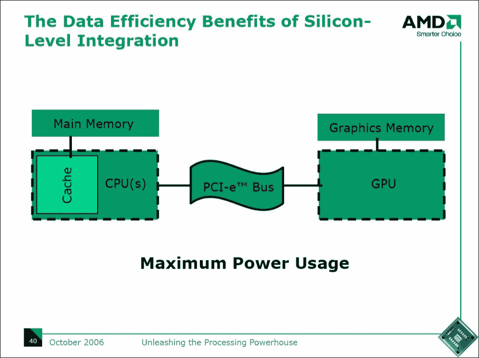
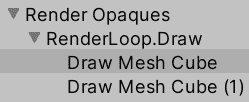
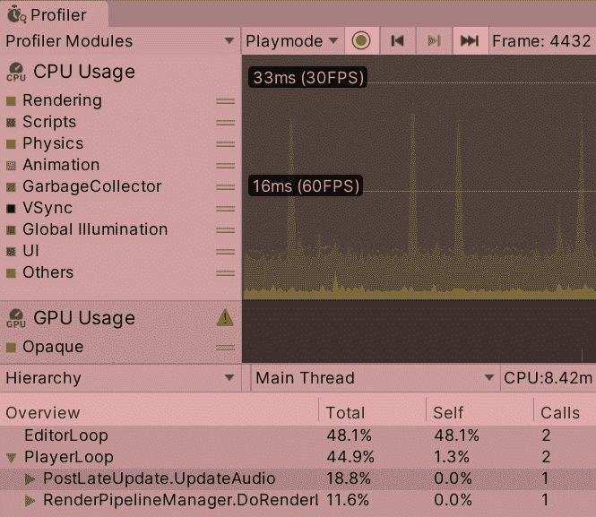

# *第十九章*:场景性能优化

欢迎来到这本书的第三部分，我很高兴你已经完成了这一部分，因为这意味着你几乎完成了一个完整的游戏! 在本章中，我们将讨论优化技术，以审查和改善你的游戏的性能，因为有一个良好和恒定的帧率是至关重要的任何游戏。 性能是一个广泛的主题，需要深入理解几个 Unity 系统，可能涉及好几本书。 我们将研究如何度量性能，并探索系统更改的影响，以了解它们如何通过测试工作。

在本章中，我们将研究以下性能概念:

*   优化的图形
*   优化处理
*   优化内存

在本章结束时，你将能够收集运行游戏的三个主要硬件的性能数据——GPU、CPU 和 RAM。 您将能够分析这些数据来检测可能的性能问题，并理解如何解决最常见的问题。

# 优化图形

最常见的导致性能问题的原因是资产的滥用，特别是在图形方面，因为没有足够的知识了解 Unity 的图形引擎是如何工作的。 我们将探索 GPU 如何在高水平上工作，以及如何提高其使用率。

在本节中，我们将研究以下图形优化概念:

*   图形引擎简介
*   使用调试器框架
*   使用批处理
*   其他优化

我们首先从一个高层的角度来概述如何渲染图形，以便更好地理解稍后在 Frame Debugger 中收集的性能数据。 基于调试器的结果，我们将确定可以应用批处理的领域(这是一种结合多个对象的渲染过程，从而降低其成本的技术)，以及其他需要记住的常见优化。

## 图形引擎简介

如今，每一个游戏设备，无论是电脑、移动设备还是控制台，都有一个视频卡——一组专门用于图形处理的硬件。 它与 CPU 有细微但重要的区别。 图形处理涉及到数千个网格顶点的处理和数百万像素的渲染，所以 GPU 被设计成可以运行短程序长时间，而 CPU 可以处理任何长度的程序，但并行能力有限。 使用这些处理单元的原因是，我们的程序可以在需要时使用每个处理单元。

这里的问题是，图形并不仅仅依赖于 GPU。 CPU 也参与了这个过程，进行计算并向 GPU 发出命令，所以它们必须一起工作。 为了实现这一目标,处理单元都需要沟通,因为他们(通常)分开的,他们需要另一个硬件允许甚至是公共汽车,最常见的是**外围组件互连表达**(**PCI Express)总线。**

PCI Express 是一种允许大量数据在 GPU 和 CPU 之间移动的连接，但问题是，即使它非常快，如果在两个单元之间发出大量命令，通信时间也会很明显。 因此，这里的关键概念是，图形性能的提高主要是通过减少 GPU 和 CPU 之间的通信:

图 19.1 - CPU/GPU 通过 PCI Express 总线通信

重要提示

现在，新的硬件架构允许 CPU 和 GPU 在同一个芯片组中共存，减少了通信时间，甚至共享内存。 遗憾的是，这种架构不允许电子游戏所需的处理能力。 我们可能只会看到它应用于高端游戏，但在不久的将来不会，甚至永远不会。

图形引擎的基本算法是确定哪些对象可以使用筛选算法,根据他们的相似性进行分类和分组时,然后发出绘图命令对象的 GPU 渲染这些团体,有时不止一次(如[*第八章*【4】【5】, 照明使用通用渲染管道)。 在这里，沟通的主要形式是那些](08.html#_idTextAnchor122)绘制命令，通常称为**绘制调用**，而我们优化图形时的主要任务就是尽可能地减少这些命令。 问题是，有几个来源的绘制调用需要考虑，如照明，和对象的规模，看看他们是否是静态的。 研究每一项都需要很长时间，即使如此，Unity 的新版本也可以通过自己的绘图调用引入新的图形功能。 相反，我们将探索一种使用 Frame Debugger 来发现这些绘制调用的方法。

## 使用帧调试器

**帧调试器**是一个工具，允许我们查看 Unity 渲染引擎发送给 GPU 的所有绘图命令或调用的列表。 它不仅列出了它们，还提供了关于每个 draw call 的信息，包括检测优化机会所需的数据。 通过使用**帧调试器**，我们可以看到我们的更改是如何修改绘制调用的数量的，这给我们提供了关于我们努力的即时反馈。

重要提示

注意，减少绘制调用有时不足以提高性能，因为每个绘制调用可能有不同的处理时间; 但通常，这种差异并不大到值得考虑。 此外，在某些特殊的渲染技术中，如射线跟踪或射线移动，单个绘制调用可能会耗尽我们的 GPU 的所有能量。 但在我们的游戏中却不是这样，所以我们现在就不考虑这一点。

让我们使用 Frame Debugger 来分析游戏的渲染过程，如下所示:

1.  打开帧调试器(**窗口**|**分析**|**帧调试器**)。
2.  Play the game and if you want to analyze the performance, click the **Enable** button in the top-left corner of the window (press *Esc* to regain control of the mouse while playing):

    

    图 19.2 -启用帧调试器

3.  Click on the **Game** tab to open the Game view.

    重要提示

    有时候，同时呈现**场景**和**游戏**面板是很有用的，你可以通过将其中一个面板拖到 Unity 底部，让它们分开并可见。

4.  Drag the slider to the right of the **Disable** button slowly from left to right to see how the scene is rendered. Each step is a draw call that is being executed in the CPU for that given game frame. You can also observe how the list in the left part of the window highlights the name of the executed draw call at that moment:

    

    图 19.3 -分析帧的绘制调用

5.  Click on any draw call from the list and observe the details in the right part of the window.

    他们中的大多数可以迷惑你,如果你不习惯引擎或着色器代码,但,你可以看到一些人有一个人类可读的部分叫**为什么这个画叫不能与前一个批处理,**这告诉你为什么两个对象不是聚集在一个画的电话。 我们稍后将分析这些原因:

    

    图 19.4 -帧调试器中的批处理中断原因

6.  当窗口在**Play**模式中打开时，禁用地形，并立即查看绘制调用的数量变化。 有时，仅仅打开和关闭对象就足以检测造成性能问题的原因。 此外，尝试禁用后处理和其他与图形相关的对象，如粒子。

即使我们没有完全意识到这些绘制调用来自何处，我们至少可以在 Unity 中修改设置，看看这些更改的影响。 没有什么比通过查看每个切换，并通过测量工具查看这些变化的影响更好的方法去发现像 Unity 这样巨大的内容是如何运行的。

现在，让我们讨论减少绘制调用的基本技术，并在 Frame Debugger 中查看它们的效果。

## 使用批量

我们在前面的章节中讨论了一些优化技术，其中照明是最重要的一个。 如果您在实现技术时度量绘制调用，您将注意到这些操作对绘制调用计数的影响。 然而，在本节中，我们将重点介绍另一种称为批处理的图形优化技术。 批处理是将多个对象分组，以便在一次绘制调用中将它们画在一起的过程。 你可能想知道为什么我们不能在一个绘制调用中绘制所有的东西，虽然这在技术上是可行的，但为了组合两个对象，需要满足一系列条件，通常情况下是组合材料。

请记住，材质是作为图形配置文件的资产，从指定一个**材质**模式或着色器和一组参数来定制我们的对象的方面，并且请记住，我们可以在多个对象中使用相同的材质。 如果团结必须画一个对象使用不同的材料比前一个,电话**SetPass**在执行之前需要被其吸引,这是另一种形式的 CPU / GPU 通信用于设置**材料 GPU**属性,比如它的质地和颜色。 如果两个物体使用相同的材料，这个步骤可以跳过。 来自第一个对象的**SetPass**调用被第二个对象重用，这为批处理对象打开了机会。 如果它们共享相同的设置，Unity 可以在 CPU 中将网格合并成单个网格，然后将合并后的网格在一个绘制调用中发送给 GPU。

有几种方法可以减少材料的数量，比如去除重复，但最有效的方法是通过纹理 atlasing 的概念。 这意味着将不同物体的纹理合并为一个。 这样，多个对象可以使用相同的材质，因为这里使用的纹理可以应用于多个对象，而一个拥有自己纹理的对象需要自己的材质。 遗憾的是，Unity 中并没有自动系统去结合三维对象的纹理，就像我们在 2D 中使用的**Texture Atlas**对象。 资产存储中可能有一些系统，但自动系统可能有一些副作用。 这一工作通常是由艺术家完成的，所以只要记住这一技术时，与一个专门的 3D 艺术家(或如果你是自己的艺术家):

图 19.5 -不同金属物体的碎片

让我们通过以下步骤来探索 Frame Debugger 的批处理:

1.  Search for the **Render Pipeline** asset that we currently want to use (**Edit** | **Project Settings** | **Graphics** | **Scriptable Render Settings**):

    

    图 19.6 -脚本渲染管道设置

2.  Uncheck **SRP Batcher** in the **Advanced** section. We will discuss this later:

    

    图 19.7 -禁用 SRP 批处理器

3.  创建一个新的空场景用于测试(**文件**|**新场景**)
4.  创建两种不同颜色的材料。
5.  创建两个立方体，将一个材料放入第一个，另一个放入第二个。
6.  Open Frame Debugger and click **Enable** to see the call list for the draw calls of our cubes:

    

    图 19.8 -绘制立方体

7.  选择第二个**绘制网格立方体**调用，并查看批处理中断的原因。 应该说这些物体有不同的材料。
8.  在两个立方体上使用一个材料，然后再看一遍列表。 你会注意到，现在我们只有一个**Draw Mesh Cube**调用。 您可能需要再次禁用和启用 Frame Debugger 以使其正确刷新。

现在，我挑战你尝试同样的步骤，但创造球体而不是立方体。 如果你这样做，你可能会注意到，即使使用相同的材料，球体也不是成批的! 这里我们需要引入动态批处理的概念。

记住，gameobject 有一个**Static**复选框，用于通知多个 Unity 系统该对象不会移动，以便它们能够应用一些优化。 没有选中此复选框的对象被认为是动态的。 到目前为止，我们用于测试的立方体和球体都是动态的，所以 Unity 需要在每一帧中组合它们，因为它们可以移动，组合并不是“自由的”。 它的成本直接与模型中顶点的数量相关。 你可以从 Unity 手册中得到准确的数字和所有需要考虑的事项，如果你搜索**Unity 批处理**，它就会出现。 然而，如果一个对象的顶点数量足够大，那么该对象就不会被批处理，这样做需要的不仅仅是两次绘制调用。 这就是为什么我们的球体没有成批; 球面的顶点太多了。

现在，如果我们有静态对象，情况就不同了，因为它们使用了第二个批处理系统——静态批处理器。 概念是一样的。 合并对象以在一个绘制调用中渲染它们，同样，这些对象需要共享相同的材质。 主要的区别是，这个批处理器将比动态批处理器批处理更多的对象，因为合并是在场景加载时进行一次，然后保存在内存中以用于下一帧，消耗内存，但每帧节省大量处理时间。 您可以使用同样的方法我们用来测试的动态计量器测试静态版本仅仅通过检查静态**复选框的球体,看到的结果**模式; 在**版本**模式(当它不播放时)，静态批处理器将无法工作:****

 **

图 19.9 -静态球体及其静态批处理

在继续之前，让我们讨论一下为什么禁用 SRP Batcher 以及它如何改变我们刚刚讨论的内容。 在它的 2020 年版，Unity 引入了 URP(通用渲染管道)，一个新的渲染管道。 除了几个改进之外，目前有一个相关的是 SRP 批处理器，这是一个新的批处理器，它工作在动态对象上，没有顶点或材料限制(但有其他限制)。 而不是依靠共享同一材料批对象,SRP 计量器可以有一批对象使用相同的材质的材料,这意味着我们可以有,例如,与 100 年 100 个对象为每一个不同的材料,他们将批处理无论顶点的数量, 只要材质使用相同的着色器和变体:

图 19.10 - GPU 数据持久性材料，这允许 SRP Batcher 存在

一个着色器可以有多个版本或变体，所选的变体是基于设置选择的。 我们可以有一个不使用法线映射的着色器和一个不计算法线的变体将被使用，所以这可能会影响 SRP Batcher。 所以，使用 SRP Batcher 基本上没有缺点，所以继续，再次打开它。 尝试用尽可能多的材料创建大量球体，并检查它将在 Frame Debugger 中生成的批量数量。 考虑一下，如果您需要在 pre-URP 时代完成的项目中工作，这将是不可用的，因此您需要知道使用适当的批处理策略。

## 其他优化

如前所述，有许多可能的图形优化，因此让我们简要讨论一下基本的，从**细节级别**(**LOD**)开始。 LOD 是根据物体到相机的距离来改变物体的网格的过程。 这可以减少绘制调用，如果你替换，例如，一个房子的几个部分和片断与一个单一的组合网格，减少细节时，房子是远的。 使用 LOD 的另一个好处是，你减少了绘制调用的成本，因为减少了顶点计数。

要使用此功能，请执行以下操作:

1.  Create an empty object and parent the two versions of the model. You need to use models that have several versions with different levels of detail, but for now, we are just going to test this feature using a cube and a sphere:

    

    图 19.11 -一个带有两个 LOD 网格的单一对象

2.  将 LOD 组组件添加到父组件。
3.  The default LOD group is prepared to support three LOD mesh groups, but as we only have two, right-click on one and click **Delete**. You can also select **Insert Before** to add more LOD groups:

    

    图 19.12 -移除 LOD 组

4.  选择最详细的 LOD 组**LOD 0**，然后点击下面**Renderers**列表中的**Add**按钮，将球体添加到该组中。 你可以添加任意数量的网格渲染器。
5.  Select **LOD 1** and add the cube:

    

    图 19.13 -向 LOD 组添加渲染器

6.  拖动两组之间的线来控制每组所占据的距离范围。 当你拖动它时，你会看到一个预览，显示相机需要切换到多远的组。 此外，你还有一个被剔除的组，这是相机不会渲染任何组的距离。
7.  只需在**编辑**模式下移动相机，看看网格是如何交换的。
8.  这里需要考虑的是，对象的碰撞器不会被禁用，所以只需将渲染器放在 LOD 子对象中。 把形状为 LOD 0 的碰撞器放在父对象中，或者只是从 LOD 组对象中删除碰撞器，除了组 0。

另一个要考虑的优化是截锥体剔除。 默认情况下，Unity 将渲染任何落入视图区域或相机截锥的对象，跳过那些不落入视图区域或截锥的对象。 这个算法足够便宜，可以一直使用，而且没有办法禁用它。 然而，它确实有一个缺陷。 如果我们有一堵墙隐藏了后面的所有物体，即使它们被遮挡，它们也会落在截锥内，所以它们无论如何都会被渲染。 实时检测一个网格的每个像素是否遮挡另一个网格的每个像素几乎是不可能的，但幸运的是，我们有一个解决方案:遮挡剔除。

遮挡剔除是一种分析场景，确定在场景的不同部分可以看到哪些物体的过程，将它们划分成扇区并分析每个扇区。 由于这个过程可能会花费相当长的时间，它是在编辑器中完成的，就像用光映射一样。 可以想象，它只在静态对象上工作。 要使用它，请执行以下操作:

1.  马克的对象不应该是静态的,或者如果你只是想让这个对象被认为是静态阻塞扑杀系统,检查**遮光板**和**Ocludee**复选框的箭头右边的**静态**复选框。
2.  打开**遮挡剔除**窗口(**窗口**|**渲染**|**遮挡剔除**)。
3.  保存场景，点击窗口底部的**Bake**按钮，然后等待烘焙过程。 如果你在烘烤过程之前不保存场景，它将不会被执行。
4.  在**Occlusion Culling**窗口中选择**Visualization**选项卡。
5.  With the **Occlusion Culling** window visible, select the camera and drag it around, seeing how objects are occluded as the camera moves:

    

图 19.14 -左边是正常场景，右边是遮挡剔除后的场景

要考虑到，如果你将摄像机移动到计算区域之外，这个过程将不会考虑位置，而 Unity 将只计算静态对象附近的区域。 你可以通过创建一个空物体并添加一个**遮挡区域**组件来扩展计算区域，设置它的位置和大小来覆盖相机将要到达的区域，最后，重新烘烤剔除。 试着合理考虑立方体的大小。 要计算的区域越大，磁盘中存储生成数据所需的空间就越大。 你可以使用其中的几个区域来更加精确——例如，在 l 形场景中，你可以使用其中的两个区域:

图 19.15 -遮挡区域

如果你看到物体没有被遮挡，可能是遮挡器物体(在这种情况下是墙壁)不够大。 你可以在窗口的**Bake**选项卡中增加物体的大小或者减少**最小的遮挡器**设置。 这样做将进一步细分场景以检测更小的遮挡器，但这将占用磁盘中更多的空间来存储更多的数据。 再次强调，要注意这个设置。

我们还可以将更多技巧运用到游戏中，但我们所讨论的已经足够了。 现在，让我们开始讨论其他优化区域，比如处理区域。

# 优化加工

虽然图像通常会占用生成帧的大部分时间，但我们不应该低估优化不良的代码和场景的成本。 游戏中有几个部分仍然是在 CPU 中计算的，包括部分图像处理(如批处理计算)、Unity 物理、音频和我们的代码。 在这里，与图像方面相比，我们有更多导致性能问题的原因，所以我们不再讨论每一个优化，而是学习如何发现它们。

在本节中，我们将研究以下 CPU 优化概念:

*   检测 CPU 和 gpu 绑定
*   使用 CPU 使用率分析器
*   通用 CPU 优化技术

我们将从讨论 CPU 和 GPU 绑定的概念开始，它们关注于优化过程，确定问题是与 GPU 相关还是与 CPU 相关。 稍后，与GPU 优化过程一样，我们将看看如何收集 CPU 的性能数据并解释它，以检测可能应用的优化技术。

## 检测 CPU 和 gpu 绑定

调试器与框架,统一分析器允许我们收集数据的性能我们的游戏通过一系列分析器的模块,每一个设计对每帧不同的统一系统收集数据,如物理学、音频,,最重要的是,CPU 使用率。 最后一个模块允许我们看到 Unity 调用来处理框架的每一个函数——也就是说，从我们脚本执行的函数到其他系统，比如物理和图形。

在探索 CPU 使用率之前，我们可以在这个模块中收集到的一个重要数据是，我们是受 CPU 还是 GPU 的限制。 如前所述，一个帧是同时使用 CPU 和 GPU 处理的，这些硬件可以并行工作。 当 GPU 执行绘图命令时，CPU 可以以非常高效的方式执行物理和我们的脚本。 但是现在，让我们假设 CPU 完成了它的工作，而 GPU 仍然在工作。 CPU 可以开始工作下一帧吗? 答案是否定的。 这将导致去同步，因此在这种情况下，CPU 需要等待。 这被称为 CPU 绑定，我们也有相反的情况，GPU 绑定，即 GPU 在 CPU 之前完成。

重要提示

值得一提的是，在移动设备上，有时为了减少电池消耗而降低游戏的帧率是可取的，让游戏在帧与帧之间处于空闲状态，但这可能会导致我们的命令和输入响应变慢。 为了解决这个问题，Unity 创建了一个包，它添加了在可配置的帧数之后跳过渲染过程的能力，这将保持处理工作，但跳过渲染。 因此，自然地，这些帧将只受 cpu 限制。

集中我们的优化努力是很重要的，所以如果我们发现我们的游戏是 GPU 绑定的，我们就会专注于 GPU 图形优化，如果是 CPU 绑定的，我们就会专注于其他系统和图形处理的 CPU 端。 为了检测我们的游戏是一种还是另一种，执行以下操作:

1.  打开**探查器**(**窗口**|**分析**|**探查器**)
2.  In the **Profiler Modules** dropdown in the top-left corner, tick **GPU** to enable the GPU profiler:

    

    图 19.16 -启用 GPU 分析器

3.  玩游戏，选择**CPU 使用率**分析器，点击**分析器**窗口左侧的其名称。
4.  Observe the bar with the **CPU** and **GPU** labels in the middle of the window. It should say how many milliseconds are being consumed by the CPU and GPU. The one with the higher number will be the one that is limiting our framerate and will determine whether we are GPU- or CPU-bound:

    

    图 19.17 -决定我们是受 CPU 还是 gpu 的限制

5.  Click the button that says Timeline and select Hierarchy instead:

    

    图 19.18 -选择层次结构

6.  There is a chance that when you try to open the GPU profiler, you will see a not supported message, and this can happen in certain cases (such as on some mac devices). In that scenario, another way to see whether we are GPU-bound is by searching **waitforpresent** in the search bar right next to the CPU/GPU labels while selecting the CPU Usage profiler:

    

    Figure 19.19 – Searching waitforpresent

7.  在这里，你可以看到 CPU 已经等待 GPU 多久了。 检查**时间 ms**列以得到数值。 如果你看到**0.00**，这是因为 CPU 没有等待GPU，这意味着我们不受 GPU 限制。 在前面的屏幕截图中，你可以看到我的屏幕显示**0.00**，而 CPU 占用**9.41ms**，GPU 占用**6.73ms**。 我的设备是 cpu 绑定的。

现在我们可以检测我们是受到 CPU 还是 gpu 的限制，我们可以集中精力进行优化。 到目前为止，我们讨论了如何配置和优化部分 GPU 进程。 现在，如果我们检测到我们受到 CPU 限制，让我们看看如何分析 CPU。

## 正在使用 CPU 使用率分析器

分析 CPU 的方法与分析 GPU 的方法类似。 我们需要获得 CPU执行的操作列表，并尝试减少这些操作，这就是 CPU Usage profiler 模块的作用——一个允许我们查看 CPU 在一帧内执行的所有指令的工具。 主要的区别是 GPU 主要执行 draw 调用，我们有几种类型的调用，而 CPU 可以有数百种不同的指令来执行，有时有些指令是不能删除的，比如 Physics Update 或音频处理。 在这些场景中，我们希望降低这些函数的成本，以防它们消耗太多时间。 因此，这里的一个重要注意事项是，检测哪个函数占用了太多的时间，然后降低其成本或删除它，这需要对底层系统有更深的理解。 让我们首先开始检测函数。

当你玩这个游戏的**分析器**选项卡打开,你会看到一系列的图形显示我们的游戏的性能,CPU 使用分析器,你会发现图形分成不同的颜色,每一个帧处理的不同部分。 您可以检查分析器左侧的信息，以了解每种颜色的含义，但让我们讨论最重要的颜色。 在下面的截图中，你可以看到图形应该是什么样子:

图 19.20 -分析 CPU 使用率图

如果你检查的图形,你可能会认为,深绿色的部分图占用大部分的履行合同的时间,虽然这是事实,你也可以看到从传说,深绿色意味着别人**,那是因为我们分析游戏在编辑器中。 编辑器的行为与最终游戏并不完全相同。 为了让它运行，它必须做许多在游戏中无法执行的额外处理，所以你能做的最好的事情就是在游戏构建过程中直接配置文件。 在那里，你将收集更准确的数据。 我们将在下一章中讨论如何构建，所以现在，我们可以忽略这个区域。 我们现在可以做的只是单击**Others**标签左侧的有色正方形，以禁用图表中的测量值，以便对其进行一些清理。 如果您还看到一大块黄色，则它指的是垂直同步(VSync)，它基本上是指等待我们的处理与监视器的刷新率相匹配所花费的时间。 这也是我们可以忽略的，所以您也应该禁用它。 在下面的截图中，你可以查看图形颜色类别以及如何禁用它们:**

 **

图 19.21 -从分析器中禁用垂直同步和其他

现在我们已经清理了图,我们可以得到一个好主意我们的游戏潜在的帧速率通过观察女士的标签(在我们的例子中,**5 ms (200 FPS)**),这表明框架下面这一行有超过 200 FPS,少和帧上面那条线。 在我的例子中，我有出色的性能，但请记住，我是在一台强大的机器上测试这一点。 最好的分析方法不仅是游戏的构建(作为可执行文件)，还包括目标设备，这应该是我们打算让游戏运行的最低规格硬件。 我们的目标设备很大程度上取决于游戏的目标用户。 如果我们制作的是休闲游戏，我们可能会瞄准手机设备，所以我们应该尽可能在最低规格的手机上测试游戏，但如果我们的目标是硬核玩家，他们可能会拥有运行我们游戏的强大机器。

重要提示

当然，如果你的目标是硬核玩家，这并不意味着我们可以因此制作一款未优化的游戏，但这将为我们提供足够的处理空间来添加更多细节。 无论如何，我强烈建议你不要玩这类游戏，如果你是新手的话，因为这类游戏的开发难度较大，你可能会意识到这一点。 从简单的游戏开始。

查看图形颜色，您可以观察到淡绿色渲染的 CPU 方面的成本，图中显示，淡绿色渲染占用了处理时间的很大一部分，这实际上是正常的。 然后，用蓝色表示，我们可以看到脚本的执行成本，这也占了很大一部分，但这也是很正常的。 此外，我们可以观察到一点橙色，这是物理，还有一点浅蓝色，这是动画。 记得在分析器中检查有色标签，以记住哪个颜色代表什么。

现在，这些彩色条表示一组操作，所以如果我们认为**呈现**条表示 10 个操作，我们如何知道其中包括哪些操作? 另外，我们如何知道哪些操作占用了最多的性能时间? 在这 10 次手术中，一次手术就可能导致这些问题。 这里是分析器的底部部分的用处所在。 它显示了框架中调用的所有函数的列表。 要使用它，请执行以下操作:

1.  清除我们之前使用的搜索栏。 它将根据名称过滤函数调用，我们希望看到所有函数调用。 记得从时间轴模式切换到层次模式，如果还没有的话。
2.  单击**Time ms**栏，直到您看到一个向下的箭头。 这将按成本降序排列调用。
3.  Click on a frame that is taking your attention in the graph—probably one of the ones with the biggest height that consumes more processing time. This will make the profiler stop the game straight away and show you information about that frame.

    重要提示

    在查看图表时，有两件事需要考虑。 如果你看到的峰值明显高于其他帧，这可能会导致游戏出现停顿——游戏在短暂的时间内冻结——这可能会破坏游戏的性能。 此外，你可以寻找一长串耗时较高的帧。 试着减少它们。 即使这只是暂时的，它的影响也很容易被玩家察觉。

4.  **PlayerLoop**可能是最耗时的框架，但这并不能提供太多信息。 您可以通过单击其左边的箭头来进一步扩展它。
5.  Click on each function to highlight it in the graph. Functions with higher processing times will be highlighted with thicker bars, and those are the ones we will focus on:

    

    图 19.22 -渲染相机功能在图中突出显示

6.  您可以继续单击箭头来进一步研究这些函数，直到达到极限为止。 如果你想更深入，在探查器的顶部栏中启用**深度探查器**模式。 这将提供给你更多细节，但要考虑到这一过程非常昂贵，并且会让游戏运行速度变慢，改变图表中显示的时间，使其看起来比实际时间要长得多。 在这里，忽略数字，看看基于图表的一个函数所占用的过程。 您将需要停止，启用**深度配置文件**，并再次播放，使其工作:

图 19.23 -启用 Deep Profile

有了这些知识，我们就可以开始改进游戏性能(如果低于目标帧率)，但每个功能都是由 CPU 调用并以其独特的方式改进的，这就要求我们更了解 Unity 的内部工作原理。 这可以跨越好几本书，而且无论如何，内部构件会在不同版本的基础上变化。 相反，你可以通过在互联网上查找关于特定系统的数据来研究每个函数是如何工作的，或者通过禁用或启用对象或代码的某些部分来探索我们的动作的影响，就像我们在 Frame Debugger 中所做的那样。 分析需要创造性和推理来解释所获得的数据并做出相应的反应，因此在这里您需要一些耐心。

既然我们已经讨论了如何获得与 CPU 相关的分析数据，那么让我们讨论一下减少CPU 使用的一些常用方法。

## 一般的 CPU 优化技术

在 CPU优化方面，有许多可能导致高性能的原因，包括滥用 Unity 的功能，大量的物理或音频对象，不恰当的资产/对象配置，等等。 我们的脚本也可能以未经优化的方式编码，滥用或误用昂贵的 Unity API 函数。 到目前为止，我们已经讨论了一些使用 Unity 系统的良好实践，如音频配置、纹理大小、批处理和查找功能(如**GameObject)。 找到**，用经理替换他们。 那么，让我们来讨论一些常见情况下的具体细节。

让我们先看看大量对象如何影响我们的性能。 在这里，您可以使用**Dynamic Profile**中配置的**Rigidbody**创建许多对象，并在 Profiler 中观察结果。 你会注意到，在下面的截图中，剖析器的橙色部分是如何变大的，以及**物理。 加工**功能是导致这种增加的原因:

图 19.24 -几个对象的物理处理

另一个测试可以看到几个物体的影响，可以创建许多音频源。 在下面的截图中，您可以看到我们需要重新启用**other**，因为音频处理属于该类别。 我们前面提到过**Others**属于编辑器，但它也可以包含其他进程，所以请记住:

图 19.25 -多个对象的物理处理

因此，要发现这些类型的问题，您可以开始禁用和启用对象，并查看它们是否增加了时间。 最后一个测试是关于粒子的。 创造一个能够产生足够数量的粒子来影响我们的帧速率并检查分析器的系统。 在下面的截图中，你可以查看粒子处理功能是如何在图表中突出显示的，显示它需要大量的时间:

图 19.26 -粒子处理

然后，在脚本方面，我们还需要考虑其他类型的问题，其中一些问题对于所有编程语言和平台来说都是常见的，比如迭代长对象列表、数据结构的误用以及深度递归。 然而，在这一节中，我将主要讨论特定于 unity 的 api，从**print**或**Debug.Log**开始。

这个函数对于在控制台中获取调试信息很有用，但它也很昂贵，因为所有的日志都要立即写入磁盘，以避免在游戏崩溃时丢失有价值的信息。 当然，我们希望在游戏中保留这些有价值的日志，但又不希望它影响性能，所以我们能做什么呢?

一种可能的方法是保留这些消息，但在最终构建中禁用非必要的消息，如作为信息消息，保持错误报告功能处于活动状态。 一种方法是通过编译器指令，比如下面截图中使用的指令。 请记住，这种类型的**if**语句是由编译器执行的，如果其条件不满足，编译时可以排除整个代码部分:

图 19.27 -禁用代码

在前面的截图中，您可以看到我们是如何询问此代码是由编辑器编译还是用于开发构建，后者是一种用于测试的特殊类型的构建(下一章将详细介绍)。 您还可以使用带有编译器指令的函数创建自己的日志记录系统，这样就不需要在您想要排除的每个日志中使用它们。

还有一些其他的脚本方面不仅会影响处理端性能，还会影响内存端性能，所以让我们在下一节中讨论它们。

# 优化内存

我们讨论了如何配置和优化两个硬件——CPU 和 gpu——但是还有一个硬件在我们的游戏中扮演着关键角色——ram。 这是我们放置所有游戏数据的地方。 游戏可能是内存密集型应用程序，与其他应用程序不同的是，它们需要不断地执行代码，所以我们需要特别注意这一点。

在本节中，我们将研究以下内存优化概念:

*   内存分配和垃圾收集器
*   使用内存分析器

让我们开始讨论内存分配是如何工作的，以及垃圾收集在这里扮演什么角色。

## 内存分配和垃圾收集器

每次实例化一个对象时，我们都在分配 RAM 中的内存，而在游戏中，我们将不断地分配内存。 在其他编程语言中，除了分配内存外，还需要手动释放内存，但 c#有一个垃圾收集器，它是一个跟踪未使用内存并清理它的系统。 这个系统使用一个引用计数器工作，它跟踪对一个对象存在的引用的数量，当该计数器达到**0**时，就意味着所有的引用都变为空，对象可以被释放。 这种重新分配过程在几种情况下都可能被触发，最常见的情况是当我们达到分配的最大内存时，我们想要分配一个新对象。 在这种情况下，我们可以释放足够的内存来分配我们的对象，如果这是不可能的，内存被扩展。

在任何游戏中,你可能经常被分配和释放内存,从而导致内存碎片,活着意义之间有小空间对象内存块,大多是无用的,因为他们没有足够大的分配一个对象,或者空间是足够大的总和, 但是我们需要连续的内存空间来分配对象。 在下面的图表中，你可以看到一个经典的例子，试图将一个大内存块放入由碎片生成的小间隙中:

图 19.28 -尝试在碎片内存空间中实例化一个对象

一些类型的垃圾收集系统，比如常规 c#中的垃圾收集系统，是分代的，这意味着内存根据其内存的“年龄”被划分为代桶。 更新的内存将被放在第一个桶中，并且这些内存往往会被频繁地分配和回收。 因为这个桶很小，在里面工作速度很快。 第二个存储桶拥有在第一个存储桶中保存了之前的回收扫描过程的内存。 该内存被移动到第二个桶中，以防止它不断地被检查，如果它在进程中幸存下来，并且有可能该内存将持续我们的程序的生命周期长度。 第三个桶只是第二个桶的另一层。 其思想是，大多数时候，分配和回收系统将在 bucket 1 中工作，由于它足够小，它可以快速地以连续的方式分配、释放和压缩内存。

这里的问题是 Unity 使用了自己的版本的垃圾收集系统，而这个版本是非分代和非压缩的，这意味着内存不会被分割成桶，内存也不会被移动来填补空白。 这表明在 Unity 中分配和释放内存仍然会导致碎片化问题，如果你不控制内存分配，你可能会经常执行一个昂贵的垃圾收集系统，在我们的游戏中产生问题， 您可以在 Profiler CPU Usage 模块中看到浅黄色。

处理这种情况的一种方法是尽可能地阻止内存分配，在不必要的时候避免分配。 为了防止内存分配，您可以做一些调整，但是在查看这些之前，再次强调，在开始修复可能不是问题的问题之前，首先获取有关问题的数据是很重要的。 这个建议适用于任何类型的优化过程。 这里,我们仍然可以使用 CPU 使用分析器看到多少内存被分配给每个函数调用 CPU 执行在每一帧,这只是通过看**GC Alloc**列,这表明函数分配的内存:

图 19.29 - Sight 的 Update 事件函数的内存分配

在前面的截图中，我们可以看到我们的功能分配了太多的内存，这是因为场景中有大量的敌人。 但这不是借口; 我们在每一帧都分配了那么多内存，所以我们需要改进这一点。 有几个因素会导致分配占用我们的内存，因此让我们讨论基本的因素，从返回数组的函数开始。

如果我们回顾 Sight 代码，我们可以看到我们唯一分配内存的时刻是在调用**Physics。 这是很明显的，因为它是一个数组返回函数，这是一个返回不同数量数据的函数。 为此，它需要分配一个数组并将该数组返回给我们。 这需要在创建函数(Unity)的一侧完成，但在本例中，Unity 提供了函数的两个版本——我们正在使用的版本和**NonAlloc**版本。 通常建议使用第二个版本，但 Unity 使用另一个版本来简化初学者的编码。 **NonAlloc**版本如下截图所示:**

图 19.30 - Sight 的 Update 事件函数的内存分配

这个版本要求我们分配一个有足够空间的数组来保存我们的**OverlapSphere**变量可以找到的最大数量的碰撞器，并将其作为第三个参数传递。 这允许我们只分配一次数组，并在需要的时候重用它。 在前面的截图中，您可以看到数组是静态的，这意味着它是在所有 Sight 变量之间共享的，因为它们不会并行执行(没有**Update**函数会执行)。 这将工作得很好。 请记住，该函数将返回检测到的对象的数量，因此我们只对该计数进行迭代。 数组中可以存储以前的结果。

现在，检查您的分析器并注意分配的内存数量是如何大大减少的。 在我们的函数中可能有一些剩余的内存分配，但是有时没有办法将其保持在**0**。 但是，您可以尝试使用深层分析或者注释一些代码，看看哪条注释删除了分配。 我建议你试试这个。 此外，**OverlapSphere**并不是唯一可能发生这种情况的例子。 你有其他人,比如**GetComponents**功能的家庭,,【显示】GetComponent 不同,发现给定类型的所有组件,不仅是第一个,所以注意任何 array-returning 团结和试图取代它的函数 non-allocating 版本,如果有的话。

内存分配的另一个常见来源是字符串连接。 请记住，字符串是不可变的，这意味着如果您连接两个字符串，它们不能更改。 第三个需要产生足够的空间来容纳第一个。 如果需要进行大量的连接，可以考虑使用**string。 格式**如果你只是在一个模板字符串替换占位符,比如把球员的名字和分数他们得到消息或使用**StringBuilder 类,持有的所有字符串连接在一个列表,在必要的时候,将它们连接在一起, 而不是像**+**操作符那样将它们逐个连接。 另外，考虑使用 c#中新的字符串插值函数。 你可以在下面的截图中看到一些例子:**

图 19.31 - c#中的字符串管理

最后，要考虑的一个经典的技术是对象池，它适用于需要不断实例化和销毁对象的情况，比如使用项目符号或效果。 在这种情况下，使用常规的**Instantiate**和**Destroy**函数将导致内存碎片，但对象池通过分配尽可能多的所需对象来解决这个问题。 它通过获取一个预先分配的函数来替换**实例化**，并通过将对象返回到池中来替换**Destroy**。 下面的截图显示了一个简单的池:

图 19.32 -一个简单的对象池

有几个方法来改善这个池，但它现在是好的。 请注意，当对象从池中取出时，需要重新初始化它们，您可以使用**OnEnable**事件函数或创建一个自定义函数来通知对象这样做。

现在我们已经探索了一些基本的内存分配减少技术，让我们看看一个新的内存分析器工具，它是在 Unity 的最新版本中引入的，以更详细地探索内存。

## 使用内存分析器

使用这个分析器，我们可以检测每帧分配的内存，但它不会显示到目前为止分配的总内存，这将有助于研究我们如何使用内存。 这就是内存分析器可以帮助我们的地方。 这个相对较新的 Unity 包允许我们获取分配在原生端和托管端上的每个对象的内存快照——原生端指的是内部 c++ Unity 代码，而托管端指的是属于 c#端的任何东西(即我们的代码和 Unity 的 c#引擎代码)。 我们可以使用可视化工具来研究快照，并快速查看哪种类型的对象占用的内存最多，以及它们如何被其他对象引用。

要开始使用内存分析器，请执行以下操作:

1.  Install the **Memory Profiler** package from **Package Manager** (**Window** | **Package Manager**). Remember to set **Packages Mode** to **Unity Registry** and enable the preview packages (**Wheel Icon | Advanced Project Settings | Enable Preview Packages**).

    

    图 19.33 -启用预览包

2.  在**窗口**|**分析**|**内存分析器**中打开**内存分析器**。
3.  Play the game and click on the **Capture Player** button in the **Memory Profiler** window:

    

    图 19.34 -启用预览包

4.  Click on the **Open** button next to the snapshot that was captured to open the tree view, where you can see the memory split into blocks by type:

    

    图 19.35 -内存块

5.  在我们的案例中，我们可以看到**RenderTexture**占用的内存最多，其中属于场景中显示的图像，还有一些后处理效果使用的纹理。 尝试禁用**PPVolume**对象，并使用另一个快照来检测差异。
6.  In my case, that dropped off 130 MB. There are other textures needed for other effects, such as HDR. If you want to explore where those remaining MBs came from, click on the block to subdivide it into its objects and take your own guesses based on the names of the textures:

    

    图 19.36 -内存块细节

7.  You can repeat the same process in the **Texture2D** block type, which belongs to the textures used in the materials of our models. You can look at the biggest one and detect its usage—maybe it is a big texture that is never seen close enough to justify its size. Then, we can reduce its size using the Max Size of the Texture import settings.

    重要提示

    与任何分析器一样，在构建中直接执行分析总是很有用的(更多内容将在下一章中介绍)，因为在编辑器中获取快照将捕获大量的内存，这些内存将被编辑器使用，而不会在构建中使用。 一个例子就是加载不必要的纹理，因为当你点击它们在检视器窗口中查看它们的预览时，编辑器可能已经加载了它们。

考虑到内存分析器是一个包，它的 UI 可以经常更改，但它的基本思想将保持不变。 您可以使用此工具来检测是否正在以意想不到的方式使用内存。 这里需要考虑的是 Unity 在加载场景时如何加载资产，这包括在加载时加载场景中引用的所有资产。 这意味着，举个例子，你可以有一个数组的预制件，这些预制件引用到材料，引用到纹理，即使你没有实例化它们的单个实例，预制件必须加载到内存中，导致它们占用空间。 在这个场景中，我建议您研究可寻址文件的使用，它提供了一种动态加载资产的方法。 但我们先把事情简单化。

分析器可以做更多,比如访问列表视图的所有对象,观察各个领域,其引用看到哪些对象正在使用它(从主菜单中,去**TreeMap**|**表**|**所有对象),但对于初学者来说,我发现这一观点有点混乱。 内存分析器参考导航系统的一个很好的替代方法是使用分析器的 Memory 模块。 这是内存分析器的一个基本版本，它不会用一个漂亮的树视图或内存分析器可以提供的大量细节来显示内存，而是提供了一个更简单的参考导航器版本，这在大多数情况下已经足够了。**

 **要使用它，请执行以下操作:

1.  打开分析器(**窗口**|**分析**|**分析器**)。
2.  在播放模式下，向下滚动剖析器模块列表并选择**Memory**。
3.  打开**收集对象引用**开关，点击**采样播放模式**。
4.  浏览弹出的列表，打开类别，并选择一个资产。 在下面的截图中，你可以看到我已经选择了纹理，在右边的面板中，我可以查看参考资料。 这个纹理是由一个名为 base color 的材质使用的，它是由一个名为**floor_1_LOD0**的游戏对象中的网格渲染器引用的。 您甚至可以单击引用列表中的一个项目来突出显示引用器对象:

图 19.37 -参考列表

如您所见，内存分析器和分析器中的内存模块都做类似的事情。 他们可以拍下内存快照供你分析。 我相信随着时间的推移，Unity 将统一这些工具，但目前，根据它们的优缺点，使用其中一种工具，比如内存分析器比较两个快照分析差异的能力，或者它探索内存底层数据的能力， 比如查看哪个托管对象正在使用哪个本机对象(这是相当高级的，大多数时候是不必要的)。 您可以使用 Memory 模块来分析引用，以查看哪个对象使用了哪个纹理以及为什么使用。

# 总结

优化一款游戏并不是一项简单的任务，特别是当你不熟悉每个 Unity 系统的内部工作原理时。 遗憾的是，这是一个巨大的任务，没有人知道每一个系统的细节，但有了本章学到的工具，我们可以通过探索探索变化如何影响系统。 我们学习了如何分析 CPU、GPU 和 RAM，以及任何游戏中的关键硬件是什么，还介绍了一些避免滥用它们的常见做法。

现在，您可以诊断游戏中的性能问题，收集关于三个主要硬件(CPU、GPU 和 ram)的性能数据，然后使用这些数据集中优化工作，以应用正确的优化技术。 性能非常重要，因为你的游戏需要平稳运行，才能给用户带来愉快的体验。

在接下来的章节中，我们将看到如何在不需要安装 Unity 的情况下创建一个与他人分享的游戏构建。******