# 二十二、Unity 中的增强现实

如今，新技术将 Unity 的应用领域从游戏扩展到各种软件，如模拟、培训、应用等等。 最新版本的统一,我们看到很多的改进领域的**增强现实(AR)**,它允许我们添加一层虚拟现实,从而增加我们的设备可以感知创建游戏依赖于真实数据,如相机的图像,我们的实际位置, 还有现在的天气。 这也可以应用于工作环境，例如查看建筑地图或检查墙壁内的电气管道。 欢迎来到这本书的额外部分，在这里我们将讨论如何使用 Unity 的 AR Foundation 包创建 AR 应用。

在本章中，我们将研究以下 AR 基础概念:

*   使用基于“增大化现实”技术的基础
*   为移动设备建造
*   创建一个简单的 AR 游戏

在本章结束时，您将能够使用 AR Foundation 创建 AR 应用，并将有一个使用其框架的功能齐全的游戏，以便您可以测试框架的能力。

让我们从探索 AR Foundation 框架开始。

# 使用 AR 基础

说到 AR, Unity 有两个主要的工具来创建应用:Vuforia 和 AR Foundation。 Vuforia 是一个 AR 框架，几乎可以在任何手机上运行，包含基本 AR 应用所需的所有功能，但需要付费订阅更高级的功能。 另一方面，完全免费的 AR Foundation 框架支持我们设备的最新 AR 本地特性，但只支持更新的设备。 两者之间的选择很大程度上取决于你要构建的项目类型和目标受众。 然而，由于本书旨在讨论最新的 Unity 特性，我们将探索如何使用 AR Foundation 来创建我们的第一个 AR 应用，以检测图像和表面在现实世界中的位置。 因此，我们将从探索它的 API 开始。

在本节中，我们将研究以下 AR 基础概念:

*   创建 AR Foundation 项目
*   使用跟踪功能

让我们开始讨论如何准备我们的项目，以便它可以运行 AR Foundation 应用。

## 创建 AR 基础项目

在创造 AR 项目时需要考虑的是，我们不仅要改变游戏编码方式，还要改变游戏设计方面。 AR 应用有差异，尤其是在用户交互的方式上，也有局限性，比如用户一直控制着摄像头。 我们不能在不改变游戏核心体验的情况下简单地将现有游戏移植到 AR 上。 这就是为什么，在本章中，我们将致力于一个全新的项目; 要想改变我们目前所创造的游戏，让它在 AR 中运行良好，这太困难了。

在我们的例子中，我们将创造一款游戏，让用户控制玩家移动一个“标记”，一个你可以打印的物理图像，让我们的应用识别玩家在现实世界中的位置。 我们将能够在移动图像的同时移动玩家，这个虚拟玩家将自动向最近的敌人射击。 这些敌人将从特定的刷出点生成，用户需要将其放置在家中不同的地方。 举个例子，我们可以在墙上放置两个刷出点，并在房间中央的桌子上放置玩家标记，这样敌人就会朝它们靠近。 在下图中，你可以看到游戏的预览版:

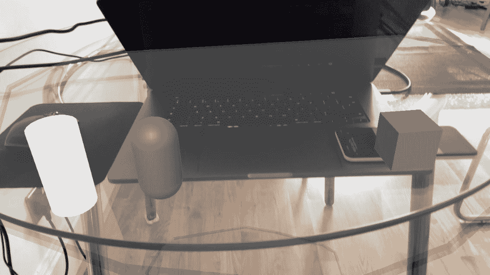

图 22.1 -完成游戏 圆柱体是敌人的刷出者，胶囊是敌人，立方体是玩家。 这些被定位在手机显示的标记图像中

我们将开始创建一个新的基于 urp 的项目，以同样的方式，我们创建我们的第一个游戏。 需要考虑的是 AR Foundation 与其他管道一起工作，包括内置管道，以防你想在已经存在的项目中使用它。 如果你不记得如何创建一个项目，请参考[*第二章*](02.html# _idTextAnchor040)，*设置 Unity*。 一旦你进入新的空白项目，从包管理器中安装 AR Foundation 包，就像我们之前安装其他包一样; 也就是说，从**Window | Package Manager**。 记得【显示】设置包管理器,显示所有包,不仅在项目的包(**按钮,在窗口的左上角需要设置为**统一注册【病人】)。 在撰写本书时，最新版本是 4.0.2。 记住，您可以使用出现的**See other Versions**按钮，单击列表中**package Item**下包左边的三角形来显示其他版本选项。 如果你发现了一个比我的新版本，你可以尝试使用那个版本，但像往常一样，如果有什么工作不同于我们想要的，请安装这个特定的版本:****

 **

图 22.2 -安装 AR Foundation

在我们安装任何其他需要的包之前，现在是讨论 AR Foundation 框架的一些核心思想的好时机。 这个包本身什么也做不了; 它定义了一系列的基于“增大化现实”技术的移动设备提供的功能,如图像跟踪、云点,和对象跟踪,但如何做的实际实现,包含在**提供者包,如 AR 工具和基于“增大化现实”技术的核心 XR 插件。 这样设计是因为，根据你想要使用的目标设备，这些功能的实现方式会发生变化。 例如，在 iOS 中，Unity 使用 AR Kit 实现这些功能，而在 Android 中，它使用 AR Core; 它们是特定于平台的框架。**

这里需要考虑的是，并非所有 iOS 或 Android 设备都支持 AR Foundation 应用。 在互联网上搜索 AR Core 和 AR Kit 支持的设备时，您可能会发现支持的设备的更新列表。 在撰写本文时，以下链接提供了支持的设备列表:

*   iOS:[https://www.apple.com/lae/ios/augmented-reality/](https://www.apple.com/lae/ios/augmented-reality/)(页面底部)
*   Android:[https://developers.google.com/ar/discover/supported-devices](https://developers.google.com/ar/discover/supported-devices)

此外，目前还没有 PC Provider 包，所以测试 AR Foundation 应用的唯一方法是直接在设备上，但测试工具很快就会发布。 在我的例子中，我将创建一个 iOS 应用，所以除了**AR Foundation**包，我需要安装**ARKit XR**插件。 然而，如果你想针对 Android 开发，可以安装**ARCore XR**插件(如果你同时针对两个平台，也可以同时安装)。 我将使用的 4.0.2 版本 ARKit 包,但写这本书的时候,4.0.4 通常桃色推荐版本,版本的**基于“增大化现实”技术的基础**和【显示】提供者包匹配,但应用相同的逻辑,当你选择了**版本基于“增大化现实”技术的基础。 在下面的截图中，你可以在包管理器中看到**ARKit**包:**

 **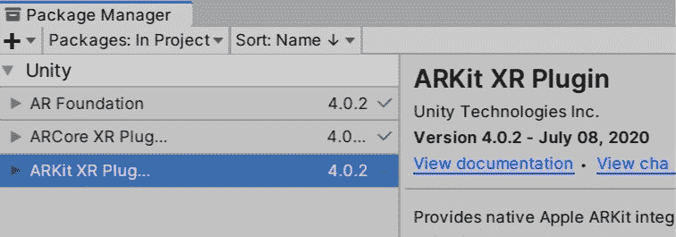

图 22.3 -安装特定于平台的 AR 提供者包

现在我们有了所需的插件，我们需要为 AR 准备一个场景，如下所示:

1.  在**文件|中创建一个新场景**。
2.  删除**主摄像头**; 我们将使用一个不同的。
3.  在**GameObject | XR**菜单中，创建**AR Session**对象。
4.  In the same menu, create an **AR Session Origin** Object that has a **Camera** inside it:

    

    图 22.4 -创建 Session 对象

5.  你的层级结构应该如下所示:

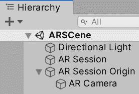

图 22.5 -初始 arscene

**AR Session**对象将负责初始化 AR 框架，并处理 AR 系统的所有更新逻辑。 **AR Session Origin**对象将允许框架定位跟踪对象，如图像和点云在场景的相对位置。 该设备通知跟踪对象的位置相对于该设备认为的“原点”。 当应用开始检测对象时，这通常是你的房子的第一个区域，所以 AR Session Origin 对象将代表那个区域。 最后,您可以检查相机内部的起源,它包含一些额外的组件,最重要的是**AR 构成****司机**,这将使你的【显示】相机与你的设备对象沿着。 因为设备的位置是相对于 Session Origin 对象的点，所以相机需要在原始对象内部。

一个额外的步骤,以防你在 URP 工作项目(我们的示例中)是你需要设置渲染管道,它支持渲染摄像机图像的应用。为此,去的**设置文件夹生成当我们创建了项目,寻找前进的**渲染器**文件,并选择它。 在**Renderer Features**列表中，点击**Add Renderer feature**按钮，然后选择**AR Background Renderer feature**。 考虑一下，如果您正在处理的是 AR Foundation 和 Provider 插件的 4.0.0 以上的版本，那么这个选项可能是不可用的。 在下面的截图中，你可以看到 Forward Renderer 素材应该是什么样子:**

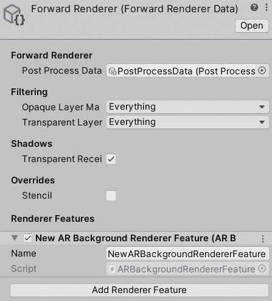

图 22.6 -添加 URP 支持

这就是一切! 我们已经准备好开始探索 AR Foundation 组件，以便我们能够实现跟踪特性。

## 使用跟踪功能

对于我们的项目，我们将需要 AR 中两个最常见的跟踪功能(但不是唯一的):图像识别和平面检测。 第一种方法是检测特定图像在现实世界中的位置，这样我们就可以在上面放置数字对象，比如玩家。 第二个是平面探测，它包含识别现实生活中的表面，如地板、桌子和墙壁，这样我们就可以参考我们可以放置物体的位置，如敌人的刷出点。 只识别水平和垂直表面(仅在某些设备上识别垂直表面)。

我们需要做的第一件事是告诉我们的应用需要检测哪些图像，如下所示:

1.  Add an image to the project that you can print or display in a cellphone. Having a way to display the image in the real world is necessary to test this. In this case, I will use the following image:

    

    图 22.7 -图像跟踪

    重要提示

    试着得到一张包含尽可能多的特征的图片。 这意味着有许多小细节的图像，如对比度、锐角等。 这就是我们的 AR 系统用来检测它的; 细节越多，识别效果越好。 在我们的例子中，我们使用的 Unity 标志实际上并没有太多细节，但有足够的对比度(只有黑白)和尖锐的角落让系统能够识别它。 如果你的设备无法检测到它，尝试其他图像(经典的二维码可能会有帮助)。

    考虑到某些设备可能对某些图像有问题，例如本书中建议的图像。 如果在测试时产生问题，请尝试使用另一个。 在本章接下来的章节中，你将在你的设备上进行测试，所以请记住这一点。

2.  Create a Reference Image Library, an asset containing all the images we wish our app to recognize, by clicking the **+** button in **Project Panel** and selecting **XR** | **Reference Image Library**:

    

    图 22.8 -创建参考映像库

3.  选择库素材和，单击**Add Image**按钮，向库中添加一个新的 Image。
4.  将纹理拖动到纹理槽(显示**None**的纹理槽)。
5.  打开**指定尺寸**，并设置**物理尺寸**为您的图像在现实生活中的尺寸，以米为单位。 这里要尽量准确; 在一些设备上，没有这个值可能会导致图像不被跟踪:

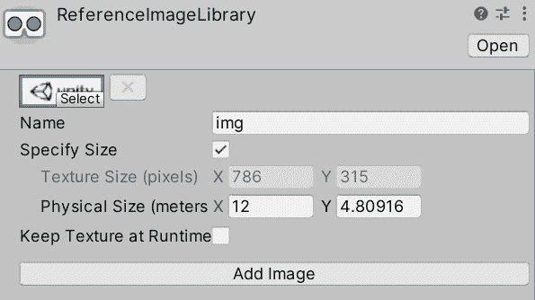

图 22.9 -添加要识别的图像

现在我们已经指定了要检测的图像，让我们通过在真实图像上放置一个立方体来测试:

1.  创建一个立方体的预制件，并添加**AR 跟踪图像**组件。
2.  将**AR Tracked Image Manager**组件添加到**AR Session Origin**对象中。 这将负责检测图像和创建物体在其位置。
3.  将**Image Library**素材拖动到组件的**Serialized Library**属性，指定要识别的图像。
4.  拖动**立方体**预制件到组件的**跟踪图像**预制件属性:

图 22.10 -设置跟踪图像管理器

这就是一切! 我们将看到一个立方体在图像在现实世界中的相同位置生成。 记住你需要在设备中进行测试，我们将在下一节中进行，所以现在让我们继续编写我们的测试应用:

图 22.11 -位于手机显示图像顶部的立方体

让我们也准备我们的应用，以便它可以检测和显示相机已经识别的平面。 这可以通过将**AR 平面管理器**组件添加到**AR 会话起源**对象中简单地完成:

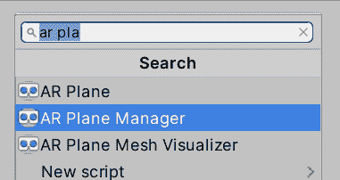

图 22.12 -添加 AR Plane Manager 组件

当我们将摄像机移动到房子上方时，这个组件将检测到房子上方的平面。 检测它们可能需要一段时间，所以重要的是可视化检测区域，以获得关于的反馈，以确保其正常工作。 我们可以从 AR 平面管理器的组件引用中手动获取关于平面的信息，但幸运的是，Unity 允许我们很容易地可视化平面。 让我们来看看:

1.  创建一个平面的预制，首先在**GameObject | 3D Object | plane**中创建平面。
2.  添加一个**线渲染器**。 这将允许我们在检测区域的边缘画一条线。
3.  Set the **Width** property of **Line Renderer** to a small value such as **0.01**, the **Color** property to black, and uncheck **Use World Space**:

    

    图 22.13 -设置 Line Renderer

4.  Remember to create a material for **Line Renderer** with the proper shader and set it as the material of the renderer:

    

    图 22.14 -创建 Line Renderer 材质

5.  Also, create a transparent material and use it in the **MeshRenderer** plane. We want to see through it so that we can easily see the real surface beneath:

    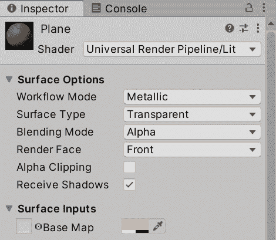

    图 22.15 -检测平面材质

6.  将**AR 平面**、**AR 平面网格可视化器**组件添加到**平面**预制件中。
7.  将预制件拖到**AR 会话起源**对象的**AR 平面管理器**组件的**平面预制件**属性:

图 22.16 -设置平面可视化预制件

现在，我们有办法看到飞机，但看到它们不是我们唯一能做的事情(有时，我们甚至不希望它们被看到)。 平面的真正力量在于将虚拟物体放在现实世界的表面上，敲击特定的平面区域，并获得其现实世界的位置。 我们可以使用 AR 平面管理器或通过访问可视化平面的 AR 平面组件来访问平面数据，但更简单的方法是使用**AR 光线管理器**组件。

**AR 光线投射管理器**组件为我们提供了与**物理等效的功能。 Unity 物理系统的光线投射(T3)功能，即用于创建从一个位置开始并朝着特定方向移动的假想光线，以便让它们击中表面并检测到准确的生命点。 **AR 射线投射管理器**提供的版本，不是与物理碰撞器碰撞，而是与跟踪对象碰撞，主要是点云(我们没有使用它们)和我们正在跟踪的“平面”。 我们可以通过以下步骤来测试这个特性:**

1.  将**AR 光线投射管理器**组件添加到**AR Session Origin**对象中。
2.  在**AR Session Origin**对象中创建一个自定义脚本**InstanceOnPlane**。
3.  在**Awake**缓存中，添加对**ARRaycastManager**的引用。 你需要使用 UnityEngine.XR.ARFoundation 添加**;** 行到脚本顶部，以便在我们的脚本中使用这个类。
4.  Create a private field of the **List<ARRaycastHit>** type and instantiate it; the Raycast is going to detect every plane our ray hit, not just the first one:

    

    图 22.17 -存储点击的列表

5.  在**更新**下，检查鼠标左键(**按键码。 正在按下 Mouse0**)。 在 AR 应用中，鼠标是通过设备的触摸屏来模拟的(你也可以使用**输入。 touch**阵列支持多点触摸)。
6.  在**如果声明中,添加另一个条件调用**Raycast****功能 AR Raycast 经理**,通过鼠标的位置作为第一个参数,点击第二的列表。**
7.  This will throw a raycast toward the direction the player touches the screen and store the hits inside the list we provided. This will return **true** if something has been hit, and **false** if not:

    

    图 22.18 -投射 AR 光线投射

8.  添加一个公共字段来指定在我们接触的地方实例化预制。 你可以创建一个球体预制来测试; 这里没有必要在预制构件上添加任何特殊的构件。
9.  实例化存储在列表中第一次命中的**Pose**属性的**Position**和**Rotation**字段中的预制件。 命中是按距离排序的，所以第一次命中是最近的一次。 你的最终脚本应该如下所示:

图 22.19 - Raycaster 组件

在本节中，我们学习了如何使用 AR Foundation 创建一个新的 AR 项目。 我们讨论了如何安装和设置框架，以及如何检测真实图像的位置和表面，然后如何在它们上面放置物体。

正如你可能已经注意到的，我们从未点击 play 去测试这一点，并且在写这本书的时候，我们不能在编辑器中测试这一点。 相反，我们需要在设备上直接进行测试。 因此，在下一节中，我们将学习如何为 Android 和 iOS 等移动设备进行构建。

# 面向移动设备的建筑

Unity 是一个非常强大的工具，它能够很容易地解决游戏开发中最常见的问题，其中之一就是针对多个目标平台制作游戏。 现在，为这些设备构建项目的 Unity 部分很容易完成，但每个设备在安装开发构建时都有其非 Unity 相关的细微差别。 为了测试我们的 AR 应用，我们需要直接在设备中测试它。 所以，让我们探索如何让我们的应用在 Android 和 iOS 这两个最常见的移动平台上运行。

在深入这个主题之前，值得一提的是，以下过程随着时间的推移会发生很大的变化，所以您将需要在互联网上找到最新的说明。 Unity Learn 门户网站([https://learn.unity.com/tutorial/building-for-mobile](https://learn.unity.com/tutorial/building-for-mobile))可能是一个很好的选择，如果本书中的说明失败了，但请先尝试这里的步骤。

在本节中，我们将探讨以下的移动建筑概念:

*   构建 Android
*   建筑为 iOS

让我们首先讨论如何构建我们的应用，以便它能在 Android 手机上运行。

## 面向 Android 的构建

与其他平台相比，创建 Android 构建相对容易，所以我们将从 Android 开始。 请记住你将需要一个能够运行 AR Foundation 应用的 Android 设备，所以请参考我们在本章第一节中提到的关于 Android 支持设备的链接。 我们需要做的第一件事是检查我们是否安装了 Unity 的 Android 支持，并配置我们的项目使用该平台。 要做到这一点，请遵循以下步骤:

1.  关闭 Unity，打开**Unity Hub**。
2.  转到**安装**部分，找到你正在使用的 Unity 版本。
3.  Click the three dots button at the top-right corner of the Unity version and click **Add Modules**:

    

    图 22.20 -向 Unity 版本添加模块

4.  Make sure **Android Build Support** and the sub-options that are displayed when you click the arrow on its left are checked. If not, check them and click the **Done** button at the bottom-right to install them:

    

    图 22.21 -在 Unity 中添加 Android 支持

5.  打开我们在本章中创建的 AR 项目。
6.  转到**Build Settings**(**File | Build Settings**)。
7.  从列表中选择**Android**平台，点击窗口右下角的**切换平台**按钮:

图 22.22 -切换到 Android 版本

为了在 Android 上创造一款应用，我们需要满足一些要求，如安装 Java SDK(不是常规的 Java 运行时)和 Android SDK，但幸运的是，新版本的 Unity 解决了这一问题。 为了再次检查我们是否已经安装了所需的依赖，请遵循以下步骤:

1.  转到**Unity 首选项**(**Windows 上编辑|首选项**，Mac 上**Unity |首选项**)。
2.  点击**外部工具**。
3.  检查所有的选项，说:**安装 Unity**在 Android 部分检查。 这意味着我们将使用 Unity 安装的所有依赖项:

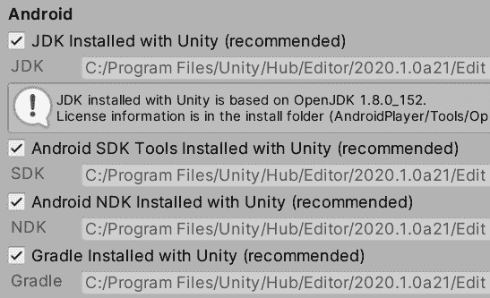

图 22.23 -使用已安装的依赖项

你可以在[https://developers.google.com/ar/develop/unity-arf/quickstart-android](https://developers.google.com/ar/develop/unity-arf/quickstart-android)找到一些额外的 Android AR core 相关设置。 如果你使用的是更新版本的 AR Core，这些可能会改变。 您可以通过以下步骤来应用它们:

1.  转到**播放器设置**(**编辑|项目设置|播放器**)。
2.  取消**多线程渲染**和**自动图形 API**。
3.  从**图形 api**列表中移除**Vulkan**
4.  设置**最小 API 级别**为**Android 7.0**:

图 22.24 - AR 核心设置

现在，您终于可以像往常一样，通过使用**build**按钮，从**文件| build Settings**构建应用。 这一次，输出将是单个 APK 文件，您可以通过将该文件复制到您的设备并打开它来安装该文件。 请记住，为了安装不是从 Play Store 下载的 APKs，你需要将设备设置为允许**安装未知应用**。 该选项的位置因人而异，取决于 Android 版本和你使用的设备，但该选项通常位于**安全性**设置中。 一些 Android 版本会在安装 APK 时提示您查看这些设置。

现在，每当我们想要创建一个构建时，我们就可以复制并安装生成的 APK 构建文件。 然而，我们可以让 Unity 使用**构建和**运行按钮来完成。 这个选项，在构建完应用后，会寻找第一个通过 USB 连接到您的计算机的 Android 设备，并自动安装应用。为此，我们需要准备我们的设备和 PC，如下所示:

在您的设备上，在设备的**设置**部分找到构建号，其位置也可以根据设备而更改。 在我的设备上，它位于**关于 Phone |软件信息**部分:

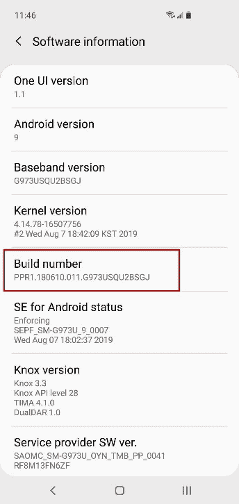

图 22.25 -定位构建号

1.  轻敲几下，直到设备显示你现在是一名程序员。 这个过程将启用设备中的隐藏开发者选项，您现在可以在设置中找到该选项。
2.  打开开发者选项，打开**USB 调试**，允许您的 PC 对您的设备拥有特殊的权限。 在这种情况下，它允许你安装应用。
3.  将 USB 驱动程序从手机制造商的网站安装到计算机上。 例如，如果你有一个三星设备，搜索**三星 USB 驱动**。 此外，如果你找不到，你可以寻找**Android USB 驱动**来获得通用驱动程序，但如果你的设备制造商有自己的驱动程序，这可能无法工作。 在 Mac 上，这一步通常是不必要的。
4.  Connect your device (or reconnect it if it's already connected). The option to **Allow USB Debugging** for your computer will appear on the device. Check **Always Allow** and click **OK**:

    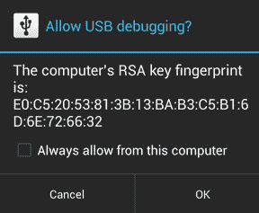

    图 22.26 -允许 USB 调试

5.  接受出现的**Allow Data**提示。
6.  如果这些选项没有出现，请检查您的设备的**USB 模式**设置为**Debugging**，而不是任何其他模式。
7.  在 Unity 中，使用**build and Run**按钮进行构建。
8.  请记住，如果你在检测到我们实例化玩家的图像(在我的例子中是 Unity 标志)时遇到困难，请尝试另一个图像。 根据设备的性能，这可能会有很大的不同。

这就是一切! 现在你已经在你的设备上运行了你的应用，让我们学习如何在 iOS 平台上做同样的事情。

## 面向 iOS 的构建

在 iOS 平台上开发游戏时，你需要投入一些资金。 你需要运行 Xcode，一个你只能在 OS x 上运行的软件。因此，你需要一个能运行它的设备，比如 MacBook、Mac mini 等等。 也许有办法在 pc 上运行 OS X，但你需要自己找到并尝试一下。 除了 Mac 和 iOS 设备上支出(iPhone、iPad、iPod、等等),你需要支付一个苹果开发者帐号,售价 99 美元每年,即使你不打算发布应用在 App Store(可能会有替代品,但再一次,你需要找到它们)。

所以，要创建一个 iOS 版本，你应该做以下工作:

1.  买一台 Mac 电脑。
2.  获取 iOS 设备。
3.  创建一个 Apple Developer 账号(在写本书的时候，你可以在[https://developer.apple.com/](https://developer.apple.com/)创建一个)。
4.  将 Xcode 从 App Store 安装到 Mac 上。
5.  Check if you have iOS build support in Unity Install on the Unity Hub. Please refer to the *Building on Android* section for more information about this step:

    

    图 22.27 -启用 iOS 构建支持

6.  Switch to the iOS platform under **Build Settings**, selecting iOS and clicking the **Switch Platform** button:

    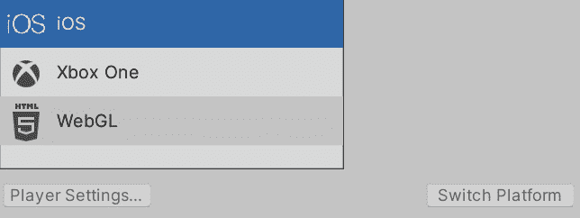

    图 22.28 -切换到 iOS 版本

7.  在**Build Settings**窗口中单击**Build**按钮并等待。

你会注意到，构建过程的结果是一个包含 Xcode 项目的文件夹。 Unity 不能直接创建构建，所以它会生成一个项目，你可以用我们之前提到的的 Xcode 软件打开它。 在这本书(11.4.1)中使用 Xcode 版本创建构建需要遵循的步骤如下:

1.  Double-click the **.xcproject** file inside the generated folder:

    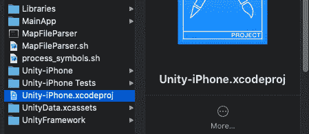

    图 22.29 - Xcode 项目文件

2.  转到**Xcode | Preferences**。
3.  In the **Accounts** tab, hit the **+** button at the bottom-left part of the window and log in with the Apple account you registered as an Apple developer:

    

    图 22.30 -帐户设置

4.  Connect your device and select it from the top-left part of the window, which should now say **Generic iOS device**:

    

    图 22.31 -选择设备

5.  在左侧面板中，点击文件夹图标，然后点击**Unity-iPhone**设置，显示项目设置。
6.  从**TARGETS**列表中，选择**Unity-iPhone**，然后点击**Signing&Capabilities**标签。
7.  In the **Team** settings, select the options that says **Personal Team**:

    

    图 22.32 -选择团队

8.  如果你看到一个**未能注册包标识符**错误,只改变**包标识符**设置另一个,总是尊重格式(**com.XXXX.XXXX**),然后单击**再试一次,直到解决。 一旦你找到一个可行的，在 Unity 中设置它(**Bundle Identifier**under**Player Settings**)，以避免每次构建都需要更改它。**
***   点击窗口左上角的**Play**按钮，等待构建完成。 在这个过程中，您可能会被提示输入几次密码，所以请这样做。*   当构建完成时，记得解锁设备。 提示符会要求你这样做。 注意，这个过程不会继续，除非你解锁手机。*   完成后，你可能会看到一个错误，说应用无法启动，但它还是安装了。 如果你尝试打开它，它会说你需要信任应用的开发者，你可以通过进入设备设置来做到这一点。*   从那里，转到**通用|设备管理**并在列表中选择第一个开发人员。*   点击蓝色**信任…**按钮，然后点击**信任**。*   尝试再次打开应用。*   如果你在检测到我们实例化玩家的图像(在我的例子中是 Unity 标志)时遇到困难，请记得尝试另一个图像。 这可能会有很大的不同，取决于你的设备的功能。**

 **在本节中，我们讨论了如何构建一个可以在 iOS 和 Android 上运行的 Unity 项目，从而允许我们创建移动应用，特别是 ar 移动应用。 与任何构建一样，我们可以遵循一些方法来进行概要分析和调试，就像我们在查看 PC 构建时看到的那样，但我们不打算在这里讨论这些。 现在我们已经创建了第一个测试项目，我们将通过添加一些机制将其转换为真正的游戏。

# 制作一个简单的 AR 游戏

正如我们前面所讨论的,想法是创建一个简单的游戏,我们可以将我们的球员移动时一个真实的形象,并把一些敌人已成熟的雌鱼的开发,我们希望他们,如墙、地板上,桌子等等。 我们的玩家会自动向最近的敌人射击，敌人也会直接向玩家射击，所以我们唯一的任务就是移动玩家，让他们避开子弹。 我们将使用脚本来执行这些游戏机制，这些脚本与我们在本书主要项目中使用的脚本非常相似。

在本节中，我们将开发以下 AR 游戏特性:

*   生成玩家和敌人
*   对玩家和敌人行为进行编码

首先，我们将讨论如何让我们的玩家和敌人出现在应用中，特别是在现实世界的位置，然后我们将让他们移动和射击，以创建特定的游戏机制。 让我们从生成开始。

## 生成玩家和敌人

先的球员,因为这是最简单的一个处理:我们将创建一个组合式图形我们希望玩家(对于我来说,只是一个立方体),一个**Rigidbody**与**运动**检查(玩家将),和一个**基于“增大化现实”技术的跟踪图像脚本。 我们将该预制件设置为**AR 会话源**对象中的**AR Tracked Image Manager**组件的**Tracked Image prefab**。 这将把玩家放在跟踪图像上。 记住要根据现实生活中的大小来设置玩家的大小。 在我的例子中，我将玩家缩放到(**0.05**，**0.05**，**0.05**)。 因为原来的立方体是 1 米大小，这意味着我的玩家将是*5x5x5*厘米。 你的玩家预制应该如下所示:**

图 22.33 -起始“Player”预制件

敌人需要更多的工作，如下所示:

1.  使用你希望刷出者拥有的图像(在我的例子中是一个圆柱体)和它的实际大小创建一个名为**刷出者**的预制组件。
2.  添加一个自定义脚本，每隔几秒钟生成一个预制件，如下面截图所示。
3.  You will notice the usage of **Physics.IgnoreCollision** to prevent the Spawner from colliding with the **Spawner** object, getting the colliders of both objects and passing them to the function. You can also use the **Layer Collision Matrix** to prevent collisions, just like we did with this book's main project, if you prefer to:

    

    图 22.34 -刷出脚本

4.  创建一个带有所需图形的**敌人**预制件(在我的例子中是胶囊)和一个带有**Is Kinematic**复选框的**刚体**组件。 这样，敌人将移动，但不与物理。 记住要考虑敌人的实际大小。
5.  Set the **Prefab** property of the Spawner so that it spawns our Enemy at your desired time frequency:

    

    图 22.35 -配置刷出器

6.  Add a new **SpawnerPlacer** custom script to the **AR Session Origin** object that instantiates a prefab in the place the player tapped using the AR Raycast system, as shown in the following screenshot:

    

    图 22.36 -放置生成器

7.  设置**SpawnerPlacer**的预制件，以便它能够生成我们之前创建的**Spawner**预制件。

这就是第一部分的全部内容。 如果你现在测试游戏，你将能够点击在应用中检测到的飞机，并看到刷怪是如何开始创造敌人的。 你也可以看看目标图像，看到我们的方块播放器出现。

现在我们在场景中有了对象，让我们让它们做一些更有趣的事情，从敌人开始。

## 对玩家和敌人行为进行编码

为了向玩家射击，敌人必须朝玩家移动，所以它必须能够接近玩家的位置。 因为敌人是实例化的，所以我们不能将玩家引用拖到预制中。 然而，玩家也被实例化了，所以我们可以向使用单例模式的玩家添加一个**PlayerManager**脚本(就像我们对管理器所做的那样)。 要做到这一点，请遵循以下步骤:

1.  Create a **PlayerManager** script similar to the one shown in the following screenshot and add it to the Player:

    

    图 22.37 -创建 PlayerManager 脚本

2.  Now that the Enemy has a reference to the player, let's make them look at the player by adding a **LookAtPlayer** script, as shown here:

    

    图 22.38 -创建 LookAtPlayer 脚本

3.  此外，添加一个简单的**MoveForward**脚本(如下截图所示)，让**敌人**不仅要盯着玩家，还要朝他们移动。 因为**LookAtPlayer**脚本让敌人面对玩家，所以沿着 z 轴移动的脚本就足够了:

图 22.39 -创建 MoveForward 脚本

现在，我们将处理玩家移动。 记住，我们的玩家是通过移动图像来控制，所以在这里，我们实际上指的是旋转，因为玩家需要自动观察并射击最近的敌人。 要做到这一点，请遵循以下步骤:

1.  创建一个**Enemy**脚本，并将其添加到**Enemy**预制中。
2.  Create an **EnemyManager** script like the one shown in the following screenshot and add it to an empty **EnemyManager** object in the scene:

    

    图 22.40 -创建 EnemyManager 脚本

3.  In the **Enemy** script, make sure to register the object in the **all** list of **EnemyManager**, as we did previously with **WavesManager** in this book's main project:

    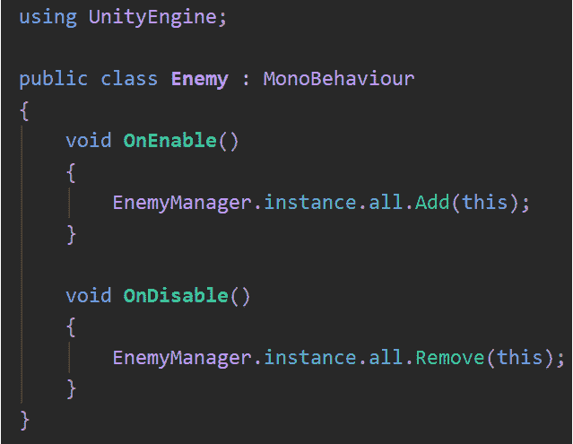

    图 22.41 -创建敌人脚本

4.  Create a **LookAtNearestEnemy** script like the one shown in the following screenshot and add it to the **Player** prefab to make it look at the nearest Enemy:

    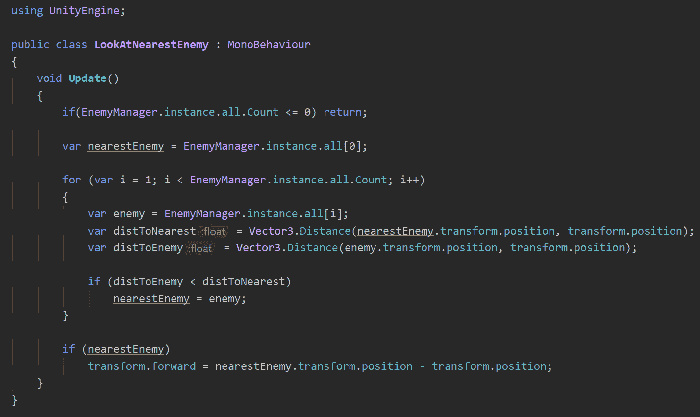

    图 22.42 -看着最近的敌人

    现在我们的物体像预期的那样旋转和移动，唯一缺少的就是射击和破坏:

5.  Create a **Life** script like the one shown in the following screenshot and add it to both the **Player** and **Enemy** components. Remember to set a value for the amount-of-life field. You will see this version of **Life** instead of needing to check if the life has reached zero every frame. We have created a **Damage** function to check that damage is dealt (the **Damage** function is executed), but the other version of this book's project also works:

    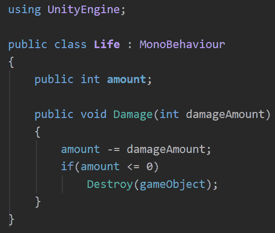

    图 22.43 -创建生命组件

6.  创建一个**子弹预制与所需的图形,对撞机的**触发**复选框在对撞机检查,**Rigidbody 组件运动与**(运动触发对撞机),检查和适当的真实大小。******
*****   将**MoveForward**脚本添加到**Bullet**预制件中，使其移动。 记得设定速度。*   添加一个**已成熟的雌鱼**脚本**玩家**和**敌人组件和设置**【T7 子弹】预制组合式生成,以及所需的产生频率。*****   Add a **Damager** script like the one shown in the following screenshot to the **Bullet** prefab to make bullets inflict damage on the objects it touches. Remember to set the damage:

    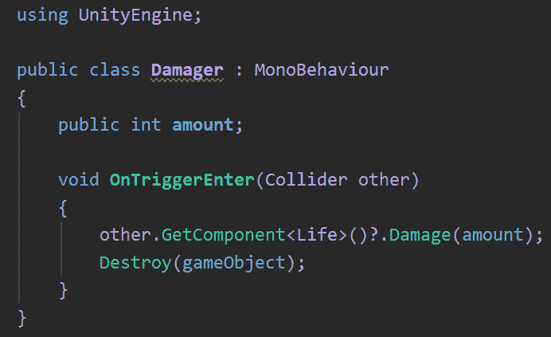

    图 22.44 -创建一个 Damager 脚本-第 1 部分

    *   在**Bullet**预制件中添加**AutoDestroy**脚本，使其在一段时间后消失。 记得设定**销毁**时间:****

 ****

图 22.45 -创建一个 Damager 脚本-第 2 部分

这就是一切! 正如你所看到的，我们基本上使用了与《T0》主游戏相同的脚本创造了一款新游戏，主要是因为我们将它们设计成通用的(游戏类型也几乎相同)。 当然，这个项目可以改进很多，但我们有一个很好的基础项目来创建惊人的 AR 应用。

# 总结

在本章中，我们介绍了 AR Foundation Unity 框架，探索了如何设置它，以及如何实现几个跟踪特性，以便我们可以将虚拟对象定位在真实对象之上。 我们还讨论了如何构建我们的项目，使其能够同时在 iOS 和 Android 平台上运行，这是我们在编写本文时测试 AR 应用的唯一方法。 最后，我们在主项目中创建的游戏基础上创建了一个简单的 AR 游戏，但对其进行了修改，使其适合在 AR 场景中使用。

有了这些新知识，你将能够作为一个 AR 应用开发者开始你的道路，创建应用，通过检测真实对象的位置，用虚拟对象增加真实对象。 这可以应用于游戏、训练应用和模拟。 你甚至可以找到新的应用领域，所以好好利用这项新技术及其新的可能性吧!**********