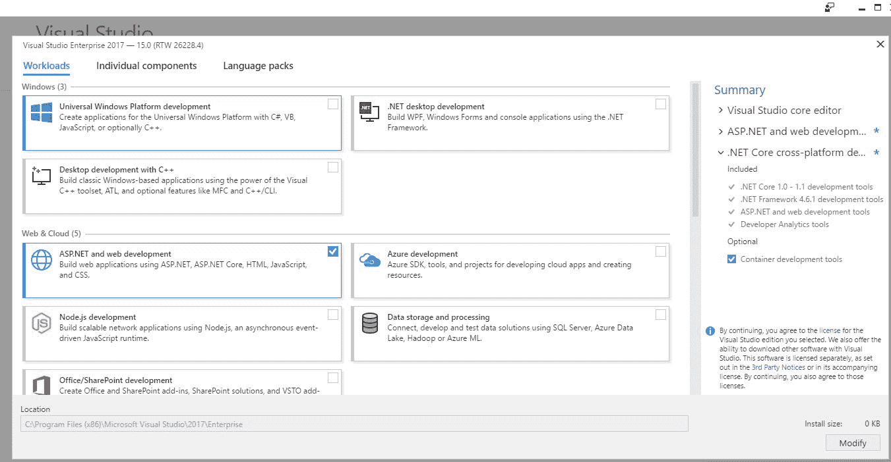

# 第 1 天-概述.NET 框架

这是我们七天学习 C# 之旅的第一天。今天，我们将首先介绍一个新的编程世界，并将讨论学习这种编程语言所需的所有基本概念。我们还将讨论.NET 框架和.NET Core 框架通过覆盖框架的重要概念。我们还将对托管和非托管代码有一个基本的了解。在一天结束时，我们将从一个简单的 Hello World 程序开始。

今天，我们将学习以下主题:

*   什么是编程？
*   什么是？NET Core？
*   什么是？NET 标准？

# 什么是编程？

可能有不同的定义或不同的想法来定义*编程* **这个词。**在我看来，*编程就是用机器(电脑)能理解的方式去描绘解决方案，你可以手动识别*。

比如说你有一个问题陈述:*从这本书*中找到元音的总计数。如果你想找到这种说法的解决方案，你会怎么做？

解决这个问题的可能步骤如下:

1.  首先，找一本合适的书。我假设你知道元音( *a* 、 *e* 、 *i* 、 *o* 和 *u* )。

2.  你在一本书里找到了多少个元音？- 0(零)。
3.  打开当前页面(最初，我们的当前页面是 1)，开始阅读查找元音。
4.  如果字母匹配 *a* 、 *e* 、 *i* 、 *o* 或 *u* (请注意大小写无关紧要，所以字母不妨为 *A* 、 *E* 、 *I* 、 *O* 、 *U* ，则元音数增加 1。
5.  当前页面完成了吗？
6.  如果第五步的答案是肯定的，那么检查这是不是书的最后一页:

    *   如果是，那么我们手里有元音总数，无非是 *n* ，其中 *n* 是当前章节找到的元音总数。移至第 8 步查看结果。
    *   如果这不是最后一章，在当前章节号上加 1，进入下一章。所以，我们应该移到 1 + 1 = 2(第二章)。
7.  在下一章，重复步骤 4 到 6，直到你读到书的最后一章。
8.  最后，我们有元音总数，即 *n* ( *n* 是找到的元音总数)。

前面的步骤描述了我们如何为问题陈述找到完美的解决方案。这些步骤展示了我们是如何手动找到本书章节中所有元音计数问题的答案的。

在编程界，这样的步骤统称为*算法*。

An algorithm is nothing but a process to solve a problem by defining a set of rules.

当我们以机器/计算机能够遵循指令的方式编写前面的步骤/算法时，这被称为编程。这些指令应该用机器/计算机能理解的语言编写，这就是所谓的编程语言。

在本书中，我们将使用 C# 7.0 作为编程语言.NETCore作为框架。

# 什么是？NET？

当我们提到.NET(发音为点 NET)，它是。网满，就像我们一样.NETCore，我们正在使用.NET Core 在我们的书中用 C# 7.0 作为语言进行了示例。在继续之前，你应该了解.NET，因为有一个. NET 标准可用于.NET Core，也就是两者的 API 服务器.NET 框架.NETCore。如果你用.NET 标准它对两者都有效.NET 框架和.NETCore。

.NET 不过是语言、运行时和库的组合，通过使用它我们可以开发托管软件/应用。软件是用.NET 是托管的或处于托管环境中。为了理解托管，我们需要深入了解二进制可执行文件是如何用于操作系统的。这包括三个更广泛的步骤:

1.  编写代码(源代码)。
2.  编译器编译源代码。
3.  操作系统立即执行二进制可执行文件:

Broader steps – how binary executable is available?

前面的过程是描述编译器如何编译源代码和创建可执行二进制文件的标准过程，但是在.NET，编译器(我们代码的 C# 编译器)不直接提供二进制可执行文件；它提供了一个程序集，该程序集由元数据和中间语言代码组成，也称为**微软中间语言** ( **MSIL** )或**中间语言** ( **IL** )。这个 MSIL 是一个高级语言，这不能被机器直接理解，因为 MSIL 不是机器特定的代码或字节代码。为了正确执行，应该对其进行解释。这种从 MSIL 或 IL 到机器语言的解释是在 JIT 的帮助下发生的。换句话说，JIT 将 MSIL、伊尔编译成机器语言，也称为本机代码。更多信息请参考[https://msdn . Microsoft . com/en-us/library/ht8ech 6(v = vs . 90)。aspx](https://msdn.microsoft.com/en-us/library/ht8ecch6(v=vs.90).aspx) 。

对于 64 位编译，微软已经公布了 RyuJIT([https://blogs . msdn . Microsoft . com/dotnet/2014/02/27/RyuJIT-CTP 2-准备黄金时间/](https://blogs.msdn.microsoft.com/dotnet/2014/02/27/ryujit-ctp2-getting-ready-for-prime-time/) )。在未来的版本中，32 位编译也将由 RyuJIT([https://github.com/dotnet/announcements/issues/10](https://github.com/dotnet/announcements/issues/10))处理。在此之后，我们现在可以为两个 CoreCLR 拥有一个单一的代码库。

中间语言是一种基于组件的高级汇编语言。

在我们七天的学习中，我们不会专注于框架，而是会更专注于 C# 语言的搭配使用.NETCore。在接下来的几节中，我们将讨论.NET Core，当我们使用 C# 程序时，我们应该理解我们的程序如何与操作系统对话。

# 什么是？NET Core？

.NET Core 是微软为满足跨平台需求而推出的一种新的通用开发环境。.NET Core 支持 Windows、Linux 和 OSX。

.NET Core 是一个开源软件开发框架，在麻省理工学院许可证下发布，由微软和。GitHub([https://github.com/dotnet/core](https://github.com/dotnet/core))存储库中的. NET 社区。

# .NETCore特性

以下是的一些重要特性.NET Core，就是那个牌子.NET Core 软件开发中重要的进化步骤:

*   **跨平台**:目前，.NET Core 可以在 Windows、Linux 和 macOS 上运行；未来，可能会有更多。更多信息请参考路线图([https://github.com/dotnet/core/blob/master/roadmap.md](https://github.com/dotnet/core/blob/master/roadmap.md))。
*   **拥有简单的命令行工具**:你可以使用命令行工具进行练习.NETCore。更多信息请参考[命令行界面工具。](https://docs.microsoft.com/en-us/dotnet/articles/core/tools/index)
*   **具有兼容性**:使用。. NET 标准库.NET Core 与兼容.NET 框架，Xamarin 和 Mono。
*   **开源**:.NET Core 平台是在麻省理工学院许可下发布的，是一个. NET 基础项目([https://dotnetfoundation.org/](https://dotnetfoundation.org/))。

# 是什么让？NET Core？

.NET Core 是 **coreclr** 、 **corefx** 以及 **cli 和 roslyn** 的组合。这些是的主要组成部分.NETCore组成。

*   **Coreclr** :它是一个. NET 运行时，提供程序集加载、垃圾收集器等等。您可以在[https://github.com/dotnet/coreclr](https://github.com/dotnet/coreclr)查看更多信息。
*   **Corefx** :是框架库；您可以在[https://github.com/dotnet/corefx](https://github.com/dotnet/corefx)查看更多信息。
*   **Cli** :无非是一个命令行界面工具，roslyn 是语言编译器(在我们这里是 C# 语言)。更多信息请参考 CLI([https://github.com/dotnet/cli](https://github.com/dotnet/cli)和罗斯林[https://github.com/dotnet/roslyn](https://github.com/dotnet/roslyn)。

# 什么是？NET 标准？

那个.NET Standard 是一组 API，当您试图编写跨平台应用时，它们可以解决代码共享的问题。目前，微软正在努力.NET 标准 2.0 使其精简，而这些标准将被所有人实现，也就是，。. NET 框架.NETCore，以及 Xamarin。使用.NET 标准(这是一组 API)，您确保您的程序和类库对所有目标都是可用的.NET 框架和.NETCore。换句话说，.NET 标准将取代**可移植类库** ( **PCL** )。更多信息请参考[https://blogs . msdn . Microsoft . com/dotnet/2016/09/26/introduction-net-standard/](https://blogs.msdn.microsoft.com/dotnet/2016/09/26/introducing-net-standard/)。

那个.NET 标准 2.0 存储库可在[https://github.com/dotnet/standard](https://github.com/dotnet/standard)获得。

到目前为止，你已经知道.NET Core 和其他一些有助于构建跨平台应用的东西。在接下来的部分中，我们将准备环境，以便开始使用 Visual Studio 2017(最好是社区版)学习 C# 语言。

# C# 可用的 IDEs 和编辑器

**集成开发环境** ( **IDE** )无非是方便应用开发的软件。另一方面，编辑器基本上意味着添加/更新预定义的或新的内容。当我们谈论 C# 编辑器时，我们指的是帮助编写 C# 程序的编辑器。有些编辑器附带了很多插件，可以编译或运行程序。

我们将使用 Visual Studio 2017 作为我们首选的 c# IDE；但是，您还可以使用一些 c# ide 和编辑器:

1.  **Visual Studio Code:** VS Code 是编辑器，可以从[https://code.visualstudio.com/](https://code.visualstudio.com/)下载开始。从 VS 代码开始，你需要从[https://marketplace.visualstudio.com/items?安装 C# 扩展 itemName=ms-vscode.csharp](https://marketplace.visualstudio.com/items?itemName=ms-vscode.csharp) 。
2.  **Cloud9:** 是一个基于 web 浏览器的 IDE。您可以在[https://c9.io/signup](https://c9.io/signup)免费注册。
3.  **捷脑骑士:**这是捷脑的跨平台 IDE。更多信息，请访问[https://www.jetbrains.com/rider/](https://www.jetbrains.com/rider/)。
4.  **宙斯 IDE:** 这是一款专为 Windows 平台设计的 IDE。你可以从[https://www.zeusedit.com/index.html](https://www.zeusedit.com/index.html)开始使用宙斯。

5.  **文字编辑:**这是不用任何安装就可以走的路；只需使用您选择的文本编辑器。我用记事本++([https://notepad-plus-plus.org/download/v7.3.3.html](https://notepad-plus-plus.org/download/v7.3.3.html))和 C **命令行界面** ( **CLI** )来构建代码。参考[https://docs . Microsoft . com/en-us/dotnet/articles/core/tools/](https://docs.microsoft.com/en-us/dotnet/articles/core/tools/)了解更多如何从 CLI 开始。

可能会有更多可供选择的 ide 和编辑器，但它们对我们来说并不那么重要。

# 设置环境

在本节中，我们将逐步了解如何在 Windows 10 上启动 Visual Studio 2017(最好是社区版)的安装:

1.  前往[https://www.visualstudio.com/downloads/](https://www.visualstudio.com/downloads/)(也可以从[https://www.visualstudio.com/dev-essentials/](https://www.visualstudio.com/dev-essentials/)获得 Dev Essentials 的优惠)。
2.  下载 Visual Studio 社区(https[://www . visualstudio . com/感谢下载 Visual Studio？sku =社区& rel=15](https://www.visualstudio.com/thank-you-downloading-visual-studio/?sku=Community&rel=15) ):

3.  启动 Visual Studio 安装程序。

4.  从工作负载中，选择要安装的选项。为了我们的书，我们需要.NET 桌面开发和.NETCore:

5.  单击安装开始安装:

6.  安装完成后，单击启动。
7.  使用您的实时标识注册 Visual Studio。
8.  选择 Visual C# 作为开发设置。
9.  您将看到如下的起始页:

我们都准备从第一步开始。

# 动手练习

通过涵盖今天学习的概念来回答以下问题。

*   什么是编程？写下一个算法，找出书中所有页面的元音计数，*7 天学习 c#*。
*   什么是？NETCore和.NET 标准？
*   是什么让. NET Core 成为一个进化的软件？

# 重访第一天

今天，我们向您介绍了.NETCore和.NET 标准。你学会了编程世界里有哪些程序和算法。