# 七、使用 C# 理解面向对象编程

今天是我们七天学习系列的第七天。昨天(第六天)，我们浏览了一些高级主题，并讨论了属性、泛型和 LINQ。今天我们就开始用 C# 学习**面向对象编程** ( **OOP** )。

这将是一个面向对象的实用方法，同时涵盖了所有方面。即使你没有任何面向对象的基础知识，你也会从中受益，并继续自信地在工作场所轻松练习。

我们将讨论这些主题:

*   面向对象程序设计简介
*   讨论对象关系
*   包装
*   抽象
*   遗产
*   多态性

# 面向对象程序设计简介

OOP 是纯粹基于对象的编程范例之一。这些对象包含数据(详情请参考第七天)。

When we do the classification of programming languages it is called programming paradigm. For more information refer to [https://en.wikipedia.org/wiki/Programming_paradigm](https://en.wikipedia.org/wiki/Programming_paradigm).

OOP 已经被考虑用来克服早期编程方法的局限性(考虑过程语言方法)。

一般来说，我对面向对象的定义如下:

*一种现代编程语言，其中我们使用对象作为构建块来开发应用。*

我们周围有很多物体的例子，在现实世界中，我们有各种各样的物体的表现。让我们回到我们的编程世界，思考一个定义如下的程序:

*程序是一个指令列表，指示语言编译器做什么。*

为了更好地理解 OOP，我们应该了解早期的编程方法，主要是过程编程、结构化编程等等。

*   **结构化程序设计**:这是埃德格·迪杰斯特拉在 1966 年创造的一个术语。结构化编程是一种编程范式，它解决了处理 1000 行代码并将这些代码分成小部分的问题。这些小部分大多叫做子程序、块结构、`for`和`while`循环等等。使用结构化编程技术的已知语言有 ALGOL、Pascal、PL/I 等。
*   **过程性编程**:从结构化编程中衍生出来的范式，简单来说就是基于我们如何进行调用(称为过程性调用)。使用过程编程技术的已知语言是 COBOL，Pascal，c . Go 编程语言的一个最近的例子是在 2009 年发布的。

这两种方法的主要问题是程序一旦增长就不容易管理。具有更复杂和更大代码库的程序使这两种方法变得紧张。简而言之，使用这两种方法，代码的可维护性是乏味的。为了克服这些问题，我们现在有了面向对象程序设计，它有以下特点:

*   遗产
*   包装
*   多态性
*   抽象

# 讨论对象关系

在我们开始讨论 OOP 之前，首先我们应该了解关系。在现实世界中，对象之间和层次之间也有关系。面向对象编程中有以下类型的关系:

*   **关联**:关联以所有对象都有自己生命周期的方式表示对象之间的关系。在关联中，这些对象没有所有者。例如，会议中的一个人。在这里，人和会议是独立的；他们没有父母。一个人可以有多个会议，一个会议可以组合多个人员。会议和人员都是独立初始化和销毁的。

Aggregation and composition are both types of association.

*   **聚合**:聚合是一种专门化的关联形式。与关联类似，对象在聚合中有自己的生命周期，但它涉及所有权，这意味着子对象不能属于另一个父对象。聚合是一种单向关系，其中对象的生命彼此独立。例如，子代和父代的关系是一种聚合，因为每个子代都有父代，但不是每个父代都必须有子代。
*   **构图**:构图是*死亡*的一种关系，表示两个物体之间的关系，一个物体(子物体)依赖于另一个物体(父物体)。如果父对象被删除，其所有子对象将自动被删除。例如，一所房子和一个房间。一栋房子有多个房间。但是一个单间不能属于多个房子。如果我们拆了房子，房间会自动删除。

在接下来的章节中，我们将详细讨论 OOP 的所有特性。此外，我们将理解使用 C# 实现这些功能。

# 遗产

继承是 OOP 最重要的特性/概念之一。名字不言自明；继承从类继承特性。简而言之，继承是在语法的帮助下，在编译时执行的活动。继承另一个类的类称为子类或派生类，而被继承的类称为基类或父类。在这里，派生类继承基类的所有特性来实现或重写。

在接下来的章节中，我们将通过使用 C# 的代码示例来详细讨论继承。

# 理解遗传

继承作为 OOP 的一个特性，可以帮助你定义一个子类。这个子类继承父类或基类的行为。

Inheriting a class means reusing the class. In C#, inheritance is symbolically defined using the colon (*:*) sign.

修饰符(参考[第 2 章](2.html# UGI00-cd07d0bec7404d1cb3fdb41e48e5618f)，*第 02 天-c#*入门)告诉我们基类对于派生类的重用范围是什么。例如，考虑类 *B* 继承类 *A.* 这里，类 *B* 包含类 *A* 的所有特性，包括它自己的特性。参考下图:

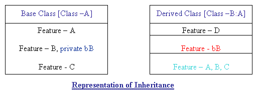

在上图中，派生类(即 *B* )通过忽略修改器继承了所有特征。无论这些功能是公共的还是私有的，都会被继承。当这些特性将要被实现时，这些修饰符会被考虑进来。在实现时，只考虑公共特性。所以，在这里，公共特性，即 *A* 、 *B* 、 *C* 将被实现，而私有特性，即 *B、*将不被实现。

# 继承的类型

到目前为止，我们已经有了关于继承的想法。现在，是时候讨论继承类型了；继承属于以下类型:

*   **单遗传:**

这是一种广泛使用的继承类型。单一继承是指一个类继承另一个类。继承另一个类的类称为子类，被继承的类称为父类或基类。在子类中，该类仅从一个父类继承特征。

C# only supports single inheritance.

您可以分层继承类(正如我们将在下一节中看到的)，但是对于派生类来说，这本质上是一个单一的继承。参考下图:

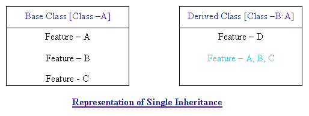

上图是单个继承的表示，显示了*B 类*(继承的类)继承*A 类*(基类)。*B 类*可以重用所有特性，即 *A* 、 *B* 和 *C、*包括其自身的特性，即 d .成员在继承中的可见性或可重用性取决于保护级别(这将在下一节*成员在继承中的可见性*中讨论)。

*   **多重遗传:**

当一个派生类继承多个基类时，就会发生多重继承。C++等语言支持多重继承。C# 不支持多重继承，但是我们可以借助接口实现多重继承。如果你很好奇为什么 C# 不支持多重继承，可以参考[https://blogs . msdn . Microsoft . com/csharfaq/2004/03/07/why-nots-C-support-multi-inheritation/](https://blogs.msdn.microsoft.com/csharpfaq/2004/03/07/why-doesnt-c-support-multiple-inheritance/)的这个官方链接。参考下图:

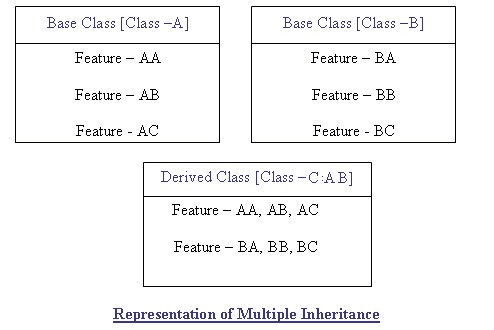

上图是多重继承的表示(没有接口的帮助在 C# 中是不可能的)，显示了*C 类*(派生类)继承自两个基类( *A* 和 *B* )。在多重继承中，派生的*C 类*将同时具有*A 类*和*B 类*的所有特征。

*   **等级继承:**

当多个类从一个类继承时，就会发生层次继承。参考下图:

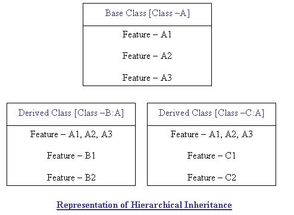

在上图中，*B 类*(派生类)*C 类*(派生类)继承自*A 类*(基类)。借助等级继承，*B 类*可以使用*A 类*的所有特性。同样的，*C 类*也可以使用*A 类*的所有功能。

*   **多级遗传:**

当一个类从已经是派生类的类派生时，它被称为多级继承。

In multi-level inheritance, the recently derived class owns the features of all the earlier derived classes.

在这种情况下，派生类可以有其父类和父类的父类。参考下图:


上图表示多级继承，说明*C 类*(最近衍生的类)可以重用*B 类*和*A 类*的所有特性。

*   **杂交遗传:**

混合继承是多个继承的组合。

C# does not support hybrid inheritance.

多级和多级继承的组合是一种层次继承，其中父类是派生类，最近派生类继承多个父类。可以有更多的组合。参考下图:

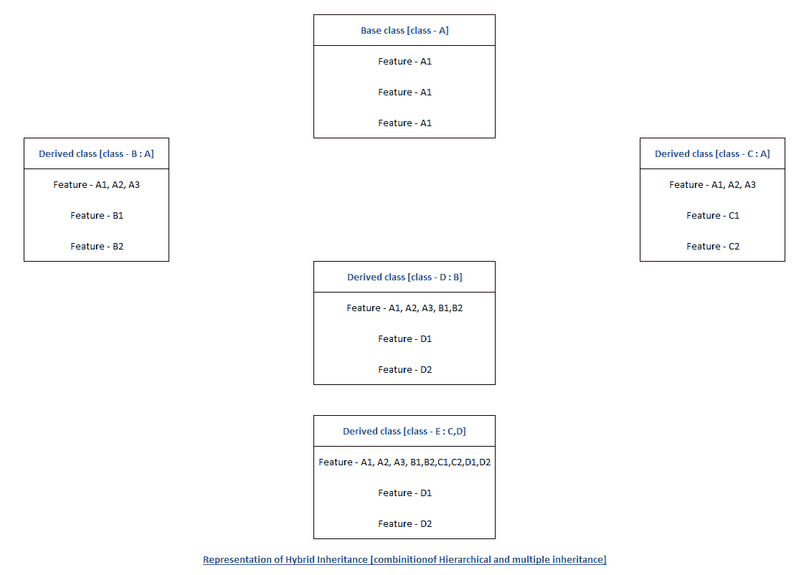

上图表示混合继承，显示了分层和多重继承的组合。可以看到*A 类*是父类，其他所有的类都是直接或间接从*A 类、*派生而来的。我们衍生的【the 类可以重用 *A 类*、 *B 类*、 *C 类、*和 *D 类*的所有特性。

*   **隐式继承:**

所有的类型.NET 隐式继承自`system.object`或其派生类。有关隐式继承的更多信息，请参考[https://docs . Microsoft . com/en-us/dotnet/csharp/tutorials/继承# 隐式继承](https://docs.microsoft.com/en-us/dotnet/csharp/tutorials/inheritance# implicit-inheritance)。

# 继承中的成员可见性

正如我们前面讨论的，在继承中，派生类可以重用父类的功能，并使用或修改其父类的成员。但是这些成员可以根据其访问修饰符或可见性进行重用或修改(更多详细信息请参考[第 4 章](4.html# 3HFIU0-cd07d0bec7404d1cb3fdb41e48e5618f)，*第 04 天-讨论 C# 类成员*)。

在本节中，我们将简要讨论继承中的成员可见性。在任何类型的继承中(在 C# 语言中是可能的)，基类不能继承下列成员:

*   **静态构造函数**:静态构造函数是初始化静态数据的构造函数(参见[第 4 章](4.html# 3HFIU0-cd07d0bec7404d1cb3fdb41e48e5618f)*第 04 天:讨论 C# 类成员*的*修饰符*部分)。静态构造函数的重要性在于，它们是在创建类的第一个实例或在某些操作中调用或引用的任何其他静态成员之前调用的。作为静态数据初始值设定项，静态构造函数不能被派生类继承。
*   **实例构造器**:不是静态构造器；每当创建类的新实例时，都会调用一个构造函数，它就是实例类。一个类可以有多个构造函数。由于实例构造函数用于创建类的实例，它不会被派生类继承。关于构造函数的更多信息，请参考[https://docs . Microsoft . com/en-us/dotnet/csharp/programming-guide/class-and-struts/constructors](https://docs.microsoft.com/en-us/dotnet/csharp/programming-guide/classes-and-structs/constructors)。
*   **终结器**:这些只是类的析构器。垃圾收集器在运行时使用或调用它们来销毁类的实例。由于终结器只被调用一次，并且是针对每个类的，因此派生类不能继承这些终结器。有关析构函数或终结器的更多信息，请参考[。](https://docs.microsoft.com/en-us/dotnet/csharp/programming-guide/classes-and-structs/destructors)

派生类可以重用或继承基类的所有成员，但是它们的用法或可见性取决于它们的访问修饰符(参考[第 4 章](4.html# 3HFIU0-cd07d0bec7404d1cb3fdb41e48e5618f)，*第 04 天-讨论 C# 类成员*)。这些成员的不同可见性取决于以下可访问性修饰符:

*   **Private** :如果一个成员是`private`，则`private`成员的可见性仅限于其派生类；`private`如果派生类嵌套到其基类，则成员在派生类中可用。

考虑以下代码片段:

```cs
public class BaseClass
{
   private const string AuthorName = "Gaurav Aroraa";
   public class DeriveClass: BaseClass
   {
      public void Display()
      {
         Write("This is from inherited Private member:");
         WriteLine($"{nameof(AuthorName)}'{AuthorName}'");
         ReadLine();
      }
   }
}
```

在前面的代码片段中，`BaseClass`将有一个私有成员，`AuthorName`，这将在`DeriveClass`中可用，因为`DeriveClass`是`BaseClass`的嵌套类。您也可以在编译时看到这一点，同时将光标移到私有`AuthorName`成员的用法上。请看下面的截图:

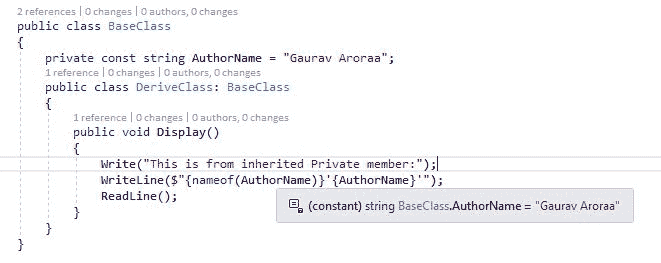

上图显示了派生类的私有方法的可见性。如果类嵌套在其基类中，则私有方法在派生类中可见。

如果该类没有嵌套在其父类/基类中，则可以看到以下编译时异常:


在前面的截图中，我们有`ChildClass`，继承自`BaseClass`。这里，我们不能使用`BaseClass`的私有成员，因为`ChildClass`没有嵌套在`BaseClass`中。

*   **受保护的**:如果成员是受保护的修饰符，那么它只对派生类可见。当您使用基类的实例时，这些成员将不可用或不可见，因为它们被定义为受保护的。

下面的屏幕截图描述了如何使用基类访问/显示受保护的成员:


在前面的截图中，受保护成员`EditorName`在`ChildClass`中可见，因为它继承了`BaseClass`。

下面的截图显示了使用`ChildClass`中的`BaseClass`实例无法访问受保护的成员。如果您尝试这样做，将会得到一个编译时错误:


*   **内部**:具有内部修饰符的成员只在与基类相同程序集的派生类中可用。这些成员不能用于属于其他程序集的派生类。

考虑以下代码片段:

```cs
namespace Day07
{
   public class MemberVisibility
   {
      private void InternalMemberExample()
      {
         var childClass = new Lib.ChildClass();
         WriteLine("Calling from derived class that
         belongs to same assembly of BaseClass");
         childClass.Display();
      }
   }
}
```

上面的代码显示了内部成员的可见性。这里，`ChildClass`属于`Lib`集合，也就是`BaseClass`存在的地方。

另一方面，如果`BaseClass`存在于`Lib`以外的组件中，则内部成员将不可访问；请参见下面的截图:


前面的屏幕截图显示了一个编译时错误，它告诉我们内部成员是不可访问的，因为它们在同一个程序集中不可用。

*   **Public** : Public 成员在派生类中可用或可见，可以进一步使用。

考虑以下代码片段:

```cs
public class ChilClassYounger : ChildClass
{
   private string _copyEditor = "Diwakar Shukla";
   public new void Display()
   {
      WriteLine($"This is from ChildClassYounger: copy
      editor is '{_copyEditor}'");
      WriteLine("This is from ChildClass:");
      base.Display();
   }
}
```

在前面的代码片段中，`ChildClassYoung`有一个显示控制台输出的`Display()`方法。`ChildClass`也有一个同样显示控制台输出的公共`Display()`方法。在我们的派生类中，我们可以重用`ChildClass`的`Display()`方法，因为它被声明为公共的。运行前面的代码后，它将给出以下输出:


在前面的代码中，您应该注意到我们在`ChildClassYounger`类的`Display()`方法中添加了一个`new`关键字。这是因为我们在父类中有一个同名的方法(即`ChildClass`)。如果不添加`new`关键字，会出现编译时警告，如下图截图所示:


通过应用`new`关键字，可以隐藏从`ChildClass`继承的`ChildClass.Display()`成员。在 C# 中，这个概念叫做方法隐藏。

# 实现继承

在前一节中，您详细了解了继承，并了解了它的各种类型。你也学会了继承成员的知名度。在本节中，我们将实现继承。

继承是一个 **IS-A** 关系的表示，暗示`Author`**IS-A**`Person``Person`**IS-A**`Human`，所以`Author` **IS-A** `Human`。让我们通过一个代码示例来理解这一点:

```cs
public class Person
{
   public string FirstName { get; set; } = "Gaurav";
   public string LastName { get; set; } = "Aroraa";
   public int Age { get; set; } = 43;
   public string Name => $"{FirstName} {LastName}";
   public virtual void Detail()
   {
      WriteLine("Person's Detail:");
      WriteLine($"Name: {Name}");
      WriteLine($"Age: {Age}");
      ReadLine();
   }
}
public class Author:Person
{
   public override void Detail()
   {
      WriteLine("Author's detail:");
      WriteLine($"Name: {Name}");
      WriteLine($"Age: {Age}");
      ReadLine();
   }
}
public class Editor : Person
{
   public override void Detail()
   {
    WriteLine("Editor's detail:");
    WriteLine($"Name: {Name}");
    WriteLine($"Age: {Age}");
    ReadLine();
   }
}
public class Reviewer : Person
{
   public override void Detail()
   {
      WriteLine("Reviewer's detail:");
      WriteLine($"Name: {Name}");
      WriteLine($"Age: {Age}");
      ReadLine();
   }
}
```

在前面的代码中，我们有一个基类`Person`和三个派生类，即`Author`、`Editor`和`Reviewer`。这显示了单一继承。以下是之前代码的实现:

```cs
private static void InheritanceImplementationExample()
{
   WriteLine("Inheritance implementation");
   WriteLine();
   var person = new Person();
   WriteLine("Parent class Person:");
   person.Detail();
   var author = new Author();
   WriteLine("Derive class Author:");
   Write("First Name:");
   author.FirstName = ReadLine();
   Write("Last Name:");
   author.LastName = ReadLine();
   Write("Age:");
   author.Age = Convert.ToInt32(ReadLine());
   author.Detail();
   //code removed
}
```

在前面的代码中，我们实例化了一个类并调用了 details 每个类都继承了`Person`类，因此也继承了它的所有成员。这将产生以下输出:

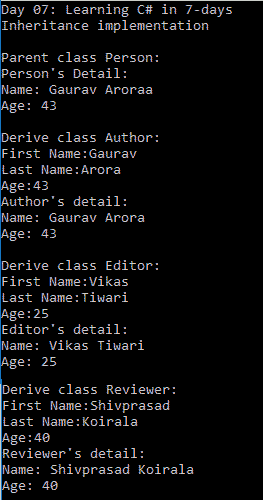

# 在 C# 中实现多重继承

我们在上一节已经讨论过 C# 不支持多重继承。但是我们可以借助接口实现多重继承(参考[第 2 章](2.html# UGI00-cd07d0bec7404d1cb3fdb41e48e5618f)，*第 02 天–c#*入门)。在本节中，我们将使用 C# 实现多重继承。

让我们考虑前一节的代码片段，它实现了单一继承。让我们通过实现接口来重写代码。

Interfaces represent **Has-A**/**Can-Do** relationship, which indicates that `Publisher` **Has-A** `Author` and `Author` **Has-A** `Book`. In C#, you can assign an instance of a class to any variable that is of the type of the interface or the base class. In view of OOP, this concept is referred to as polymorphism (refer to the *Polymorphism* section for more details).

首先，让我们创建一个界面:

```cs
public interface IBook
{
   string Title { get; set; }
   string Isbn { get; set; }
   bool Ispublished { get; set; }
   void Detail();
}
```

在前面的代码片段中，我们创建了一个`IBook`接口，它与书籍详细信息相关。该界面旨在收集图书详细信息，如书名、书号、图书是否出版。它有一个方法，提供了完整的书籍细节。

现在，让我们实现`IBook`接口来派生`Author`类，它继承了`Person`类:

```cs
public class Author:Person, IBook
{
   public string Title { get; set; }
   public string Isbn { get; set; }
   public bool Ispublished { get; set; }
   public override void Detail()
   {
      WriteLine("Author's detail:");
      WriteLine($"Name: {Name}");
      WriteLine($"Age: {Age}");
      ReadLine();
   }
   void IBook.Detail()
   {
      WriteLine("Book details:");
      WriteLine($"Author Name: {Name}");
      WriteLine($"Author Age: {Age}");
      WriteLine($"Title: {Title}");
      WriteLine($"Isbn: {Isbn}");
      WriteLine($"Published: {(Ispublished ? "Yes" :
      "No")}");
      ReadLine(); 
   } 
} 
```

在前面的代码片段中，我们使用`IBook`接口实现了多重继承。我们的派生类`Author`继承了`Person`基类，实现了`IBook`接口。在前面的代码中，值得注意的一点是类和接口都有`Detail()`方法。现在，这取决于我们想要修改哪个方法或者重用哪个方法。如果我们试图修改`Person`类的`Detail()`方法，那么我们需要覆盖或隐藏它(使用`new`关键字)。另一方面，如果我们想使用接口的方法，我们需要显式调用`IBook.Detail()`方法。显式调用接口方法时，不需要修饰符；因此，这里没有必要放一个`public`修改器。此方法隐式具有公共可见性:

```cs
//multiple Inheritance
WriteLine("Book details:");
Write("Title:");
author.Title = ReadLine();
Write("Isbn:");
author.Isbn = ReadLine();
Write("Published (Y/N):");
author.Ispublished = ReadLine() == "Y";((IBook)author).Detail(); //
we need to cast as both Person class and IBook has same named methods
```

前面的代码片段调用接口方法；注意我们如何用`IBook`铸造我们的`Author`类的实例:


上图显示了使用接口实现的代码的输出。子类可以访问接口的所有成员；当你实例化一个子类时，不需要特殊的实现。子类的实例能够访问所有可见的成员。前面实现中重要的一点是在`((IBook)author).Detail();`语句中，我们显式地将子类的实例强制转换为接口，以获得接口成员的实现。默认情况下，它提供类成员的实现，所以我们需要明确告诉编译器我们需要一个接口方法。

# 抽象

抽象是通过隐藏不相关或不必要的信息来显示相关数据的过程。例如，如果您购买了一部手机，您不会对如何传递您的信息或您的呼叫如何连接到另一个号码感兴趣，但您会有兴趣知道，每当您按下手机上的呼叫按钮时，它应该会连接您的呼叫。在这个例子中，我们隐藏那些用户不感兴趣的特征，并提供那些用户感兴趣的特征。这个过程叫做抽象。

# 实现抽象

在 C# 中，抽象可以通过使用:

# 抽象类

抽象类是半定义的，这意味着它提供了一种将成员重写到其子类的方法。我们应该在项目中使用基类，在这个项目中，我们需要有一个需要相同的成员来拥有自己的实现或想要重写的所有子类。举个例子，如果我们有一个抽象类 Car 和一个抽象方法颜色，并且有子类 HondCar、FordCar、MarutiCar 等等。在这种情况下，所有的子类都有 color 成员，但是实现方式不同，因为 color 方法会在子类中被它们自己的实现所覆盖。这里要注意的一点——抽象类代表的是一种关系。

You can also revisit our discussion of abstract class during Day04 section 'abstract' and code-examples to understand the implementation.

# 抽象类的特征

在前一节中，我们学习了抽象类，下面是抽象类的几个特性:

*   抽象类不能被初始化也就是说，你不能创建一个抽象类的对象。
*   抽象类旨在充当基类，因此其他类可以继承它。
*   如果你声明了一个抽象类，那么根据设计，它必须被其他类继承。
*   抽象类既可以有具体的方法，也可以有抽象的方法。Abstrcat 方法应该在继承抽象类的子类中实现。

# 连接

接口不包含功能或具体成员。您可以称之为类或结构的契约，它将实现来定义功能的签名。通过使用接口，您可以确保每当一个类或结构实现它时，该类或结构都将使用接口的约定。例如，如果 ICalculator 接口有方法 Add()，这意味着每当一个类或结构实现这个接口时，它都会提供一个特定的契约功能，即 Add。

For more information on interface, refer: [https://docs.microsoft.com/en-us/dotnet/csharp/programming-guide/interfaces/index](https://docs.microsoft.com/en-us/dotnet/csharp/programming-guide/interfaces/index)

接口只能有以下成员:

*   方法
*   性能
*   索引器
*   事件

# 界面特征

以下是接口的主要特征

*   默认情况下，接口是内部的
*   默认情况下，接口的所有成员都是公共的，没有必要对成员显式应用 public 修饰符
*   同样，对于抽象类，接口也不能实例化。它们只能实现，实现它的类或结构应该实现所有成员。
*   接口不能包含任何具体的方法
*   一个接口可以由另一个接口、类或结构来实现。
*   一个类或结构可以实现多个接口。

类可以继承抽象类或普通类并实现接口。

在本节中，我们将使用抽象类实现抽象。让我们考虑以下代码片段:

```cs
public class AbstractionImplementation
{
public void Display()
{
BookAuthor author = new BookAuthor();
author.GetDetail();
BookEditor editor = new BookEditor();
editor.GetDetail();
BookReviewer reviewer = new BookReviewer();
reviewer.GetDetail();
}
}
```

上面的代码片段只包含一个负责显示操作的公共方法。Display()方法是获取一本书的作者、编辑和审阅者的详细信息的方法。乍一看，我们可以说上面的代码是用不同的类不同的实现的。但是，实际上我们是在抽象类的帮助下抽象我们的代码，子类或派生类然后根据需要提供细节。

请考虑以下代码:

```cs
public abstract class Team
{
public abstract void GetDetail();
}
```

我们有一个抽象类 team，它有一个抽象方法 GetDetail()，这是负责获取 Team 细节的方法。现在，想想这个团队包括什么，这个团队由作者、编辑和一个审阅者组成。因此，我们有以下代码片段:

```cs
public class BookAuthor : Team
{
public override void GetDetail() => Display();
private void Display()
{
WriteLine("Author detail");
Write("Enter Author Name:");
var name = ReadLine();
WriteLine($"Book author is: {name}");
}
}
```

BookAuthor 类继承 Team 并重写 GetDetail()方法。这个方法进一步调用一个私有方法 Display()，这是用户不会意识到的。因为用户将只调用 GetDetail()方法。

类似地，我们有 BookEditor 和 BookReviewer 类:

```cs
public class BookEditor : Team
{
public override void GetDetail() => Display();
private void Display()
{
WriteLine("Editor detail");
Write("Enter Editor Name:");
var name = ReadLine();
WriteLine($"Book editor is: {name}");
}
}
public class BookReviewer : Team
{
public override void GetDetail() => Display();
private void Display()
{
WriteLine("Reviewer detail");
Write("Enter Reviewer Name:");
var name = ReadLine();
WriteLine($"Book reviewer is: {name}");
}
}
```

在前面的代码中，类将只显示一个方法，即`GetDetail()`来提供所需的细节。

以下是从客户端调用此代码时的输出:

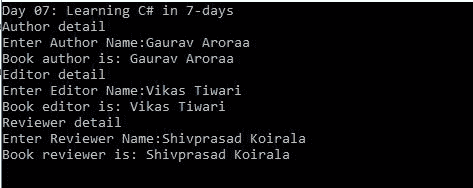

# 包装

封装是一个用户不能直接访问数据的过程。当您想要限制或隐藏客户端或用户对数据的直接访问时，该活动或过程称为封装。

当我们说信息隐藏时，这意味着隐藏一个不需要用户或用户对信息不感兴趣的信息，例如，当你买一辆自行车时，你不会有兴趣知道它的发动机是如何工作的，燃料供应是如何在内部存在的，但是你对自行车的里程感兴趣，等等。

Information hiding is not a data hiding but it is an implementation hiding in C# for more information refer: [http://blog.ploeh.dk/2012/11/27/Encapsulationofproperties/](http://blog.ploeh.dk/2012/11/27/Encapsulationofproperties/).

在 C# 中，当函数和数据组合在一个单元(称为类)中，并且不能直接访问数据时，称为封装。在 C# 类中，访问修饰符应用于成员、属性，以避免数据直接访问其他案例或用户。

在本节中，我们将详细讨论封装。

# C# 中什么是访问修饰符？

如前一节所述，封装是一种向外部世界隐藏信息的概念。在 C# 中，我们有访问修饰符或访问说明符来帮助我们隐藏信息。这些访问修饰符帮助您定义类成员的范围和可见性。

以下是访问修饰符:

*   公众
*   私人的
*   保护
*   内部的
*   受保护的内部

我们已经在第四天完成了前面所有的访问修饰符。请参考第*节访问修改器*及其可访问性，以修改这些修改器的工作方式，并帮助我们定义可见性。

# 实现封装

在本节中，我们将在 C# 7.0 中实现封装。想象一个场景，我们需要提供一个`Author`的信息，包括最近出版的书。考虑以下代码片段:

```cs
internal class Writer
{
   private string _title;
   private string _isbn;
   private string _name;
   public void SetName(string fname, string lName)
   {
      if (string.IsNullOrEmpty(fname) ||
      string.IsNullOrWhiteSpace(lName))
      throw new ArgumentException("Name can not be
      blank.");
      _name = $"{fname} {lName}";
   }
   public void SetTitle(string title)
   {
      if (string.IsNullOrWhiteSpace(title))
      throw new ArgumentException("Book title can not be
      blank.");
      _title = title;
   }
   public void SetIsbn(string isbn)
   {
      if (!string.IsNullOrEmpty(isbn))
      {
         if (isbn.Length == 10 | isbn.Length == 13)
         {
            if (!ulong.TryParse(isbn, out _))
            throw new ArgumentException("The ISBN can
            consist of numeric characters only.");
         }
         else
      throw new ArgumentException("ISBN should be 10 or 13
      characters numeric string only.");
      }
    _isbn = isbn;
   }
   public override string ToString() => $"Author '{_name}'
   has authored a book '{_title}' with ISBN '{_isbn}'";
  }
```

在前面展示封装实现的代码片段中，我们隐藏了用户不想知道的字段。作为主要座右铭是展示最近的出版物。

下面是客户端的代码，需要这些信息:

```cs
public class EncapsulationImplementation
{
   public void Display()
   {
      WriteLine("Encapsulation example");
      Writer writer = new Writer();
      Write("Enter First Name:");
      var fName = ReadLine();
      Write("Enter Last Name:");
      var lName = ReadLine();
      writer.SetName(fName,lName);
      Write("Book title:");
      writer.SetTitle(ReadLine());
      Write("Enter ISBN:");
      writer.SetIsbn(ReadLine());
      WriteLine("Complete details of book:");
      WriteLine(writer.ToString());
   }
}
```

前面的代码片段只是为了获取所需的信息。用户不会意识到信息是如何从类中获取/检索的。


前面的图像显示了确切的输出，您将在执行前面的代码后看到。

# 多态性

简而言之，多态性意味着有许多形式。在 C# 中，我们可以将一个具有多个函数的接口表示为多态。多态性取自希腊语，意为*多形*。

All types in C# (including user-defined types) inherit from object hence every type in C# is polymorphic.

正如我们所讨论的，多态性意味着许多形式。这些形式可以是我们在派生类中以不同形式实现具有相同参数的同名函数的函数。此外，多态性能够提供以相同名称实现的方法的不同实现。

在接下来的部分中，我们将讨论各种类型的多态性，包括它们使用 C# 7.0 的实现。

# 多态性的类型

在 C# 中，我们有两种类型的多态性，这些类型是:

*   **编译时多态性**

编译时多态性也以早期绑定、重载或静态绑定而闻名。它在编译时确定，并表示具有不同参数的相同函数名。编译时或早期绑定进一步分为两种类型，这些类型是:

函数重载因为名字是不言自明的，函数是重载的。当您用相同的名称但不同的参数声明函数时，它被称为函数重载。您可以声明任意多的重载函数。

考虑以下代码片段:

```cs
public class Math
{
    public int Add(int num1, int num2) =>   num1 + num2;
    public double Add(double num1, double num2) => num1 + num2;
}
```

前面的代码是重载的表示，`Math`类有一个方法`Add()`重载了双精度类型的参数。这些方法意在分离行为。请考虑以下代码:

```cs
public class CompileTimePolymorphismImplementation
{
   public void Run()
   {
      Write("Enter first number:");
      var num1 = ReadLine();
      Write("Enter second number:");
      var num2 = ReadLine();
      Math math = new Math();
      var sum1 = math.Add(FloatToInt(num1),
      FloatToInt(num1));
      var sum2 = math.Add(ToFloat(num1), ToFloat(num2));
      WriteLine("Using Addd(int num1, int num2)");
      WriteLine($"{FloatToInt(num1)} + {FloatToInt(num2)}
      = {sum1}");
      WriteLine("Using Add(double num1, double num2)");
      WriteLine($"{ToFloat(num1)} + {ToFloat(num2)} =
      {sum2}");
   }
   private int FloatToInt(string num) =>
   (int)System.Math.Round(ToFloat(num), 0);
   private float ToFloat(string num) = 
   float.Parse(num);
}
```

前面的代码片段同时使用了这两种方法。以下是前面实现的输出:

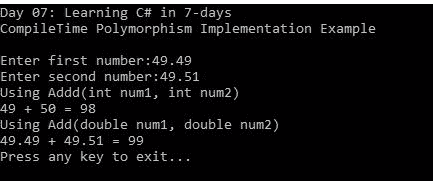

如果您分析以前的结果，您会发现接受双参数的重载方法提供了准确的结果，即 99，因为我们提供了十进制值，它添加了小数。另一方面有带整数类型参数的`Add`方法，应用 round of to double 并将其转换为整数，因此显示错误的结果。然而，前面的例子与正确的计算无关，但是这说明了使用函数重载的编译时多态性。

操作员加载是重新定义特定操作员实际功能的一种方式。

当您处理用户定义的复杂类型时，这一点很重要，因为无法直接使用内置运算符。

我们已经在[第 2 章](2.html# UGI00-cd07d0bec7404d1cb3fdb41e48e5618f)、*第 02 天-c#*入门部分- *操作员重载*中详细讨论了操作员重载-如果您想修改操作员重载，请参考本部分。

*   运行时多态

运行时多态性也以后期绑定、重写或动态绑定而闻名。我们可以通过在 C# 中重写方法来实现运行时多态性。虚拟或抽象方法可以在派生类中被重写。

在 C# 中，抽象类提供了一种实现运行时多态性的方法，在这种方法中，我们覆盖了派生类中的抽象方法。`virtual`关键字也是在派生类中重写方法的一种方式。我们在[第二章](2.html# UGI00-cd07d0bec7404d1cb3fdb41e48e5618f)、*第二天*讨论了`virtual`关键词(如果您想修改，请参考)。

考虑以下示例:

```cs
internal abstract class Team
{
   public abstract string Detail();
}
internal class Author : Team
{
   private readonly string _name;
   public Author(string name) => _name = name;
   public override string Detail()
   {
      WriteLine("Author Team:");
      return $"Member name: {_name}";
   }
}
```

上面的代码片段显示了用 C# 中抽象类的实现重写。这里抽象类`Team`有一个被覆盖的抽象方法`Detail()`。

```cs
public class RunTimePolymorphismImplementation
{
   public void Run()
   {
      Write("Enter name:");
      var name = ReadLine();
      Author author = new Author(name);
      WriteLine(author.Detail());
   }
}
```

前面的代码片段正在使用`Author`类，并产生以下输出:


上图显示了实现抽象类的程序示例的输出。

我们还可以使用抽象类和虚拟方法实现运行时多态性，考虑以下代码片段:

```cs
internal class Team
{
   protected string Name;
   public Team(string name)
   {
      Name = name;
   }
   public virtual string Detail() => Name;
}
internal class Author : Team
{
   public Author(string name) : base(name)
   {}
   public override string Detail() => Name;
}
internal class Editor : Team
{
   public Editor(string name) : base(name)
   {}
   public override string Detail() => Name;
}
internal class Client
{
   public void ShowDetail(Team team) =>
   WriteLine($"Member: {team.Detail()}");
}
```

在前面，代码片段是运行时多态性的一个实现示例，其中我们的客户端接受类型为`Team`的对象，并通过在运行时知道类的类型来执行操作。

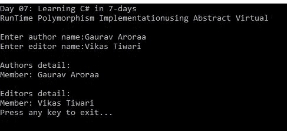

我们的方法`ShowDetail()`显示特定类型的成员名称。

# 实现多态性

让我们完整地实现多态性，考虑下面的代码片段:

```cs
public class PolymorphismImplementation
{
   public void Build()
   {
      List<Team> teams = new List<Team> {new Author(), new
      Editor(), new Reviewer()};
      foreach (Team team in teams)
      team.BuildTeam();
   }
}
public class Team
{
   public string Name { get; private set; }
   public string Title { get; private set; }
   public virtual void BuildTeam()
   {
      Write("Name:");
      Name = ReadLine();
      Write("Title:");
      Title = ReadLine();
      WriteLine();
      WriteLine($"Name:{Name}\nTitle:{Title}");
      WriteLine();
   }
}
internal class Author : Team
{
   public override void BuildTeam()
   {
      WriteLine("Building Author Team");
      base.BuildTeam();
   }
}
internal class Editor : Team
{
   public override void BuildTeam()
   {
      WriteLine("Building Editor Team");
      base.BuildTeam();
   }
}
internal class Reviewer : Team
{
   public override void BuildTeam()
   {
      WriteLine("Building Reviewer Team");
      base.BuildTeam();
   }
}
```

前面的代码片段是多态的一种表示，即构建不同的团队。它产生以下输出:

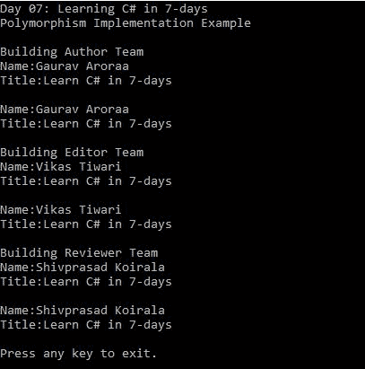

上图显示了代表多态性实现的程序的结果。

# 动手练习

以下是今天研究中未解决的问题:

1.  什么是 OOP？
2.  为什么我们应该使用面向对象语言而不是过程语言？
3.  定义继承？
4.  一般有多少种继承类型？
5.  为什么我们不能在 C# 中实现多重继承？
6.  如何在 C# 中实现多重继承？
7.  借助一个简短的程序定义继承的成员可见性。
8.  借助一个简短的程序来定义隐藏和详细说明。
9.  什么是压倒一切？

10.  什么时候使用隐藏，什么时候使用覆盖，借助一个短程序详细说明(提示:参考-[https://docs . Microsoft . com/en-us/dotnet/cs harp/programming-guide/class-and-struts/know-何时使用覆盖和新关键字](https://docs.microsoft.com/en-us/dotnet/csharp/programming-guide/classes-and-structs/knowing-when-to-use-override-and-new-keywords))
11.  什么是隐式继承？
12.  抽象类和接口有什么区别？
13.  什么是封装，借助一个短程序详细说明。
14.  定义有助于封装的访问修饰符或访问说明符。
15.  什么是抽象？用一个真实的例子来阐述它。
16.  借助于一个真实的例子，封装和抽象有什么区别。(提示:[https://stackoverflow . com/questions/16014290/简单易懂的封装和抽象方式](https://stackoverflow.com/questions/16014290/simple-way-to-understand-encapsulation-and-abstraction))
17.  什么时候用抽象类和接口借助短程序来阐述。(提示:[https://dzone . com/articles/何时使用-抽象-类和-interface](https://dzone.com/articles/when-to-use-abstract-class-and-intreface))
18.  抽象函数和虚函数有什么区别？(提示:[https://stackoverflow . com/questions/391483/抽象函数和虚函数的区别是什么](https://stackoverflow.com/questions/391483/what-is-the-difference-between-an-abstract-function-and-a-virtual-function))
19.  在 C# 中定义多态性？
20.  有多少类型的多态，用 C# 7.0 用一个短程序实现？
21.  用真实的例子定义后期绑定和前期绑定。
22.  借助程序证明这一点——在 C# 中，每种类型都是多态的。
23.  重载和重写有什么区别？

# 重温第七天

最后，我们处于结束最后一天的阶段，也就是我们 7 天学习系列的第七天。今天，我们已经了解了 OOP 范式的概念，其中我们从对象关系开始，概述了关联、聚合和组合，然后讨论了结构和过程语言。我们讨论了 OOP 的所有四个特性，即封装、抽象、继承和多态。我们还使用 C# 7.0 实现了面向对象的概念。

明天，在第八天，我们将开始一个现实世界的应用，它将帮助我们修改我们所有的概念，直到今天。如果你现在想复习，请继续看前一天的学习。

# 接下来呢？

今天我们结束了 7 天学习系列的第 7 天。在这个旅程中，我们从非常基本的开始，然后逐渐适应高级术语，但这只是一个开始，还有更多要抓住。我试图将这里的几乎所有东西结合起来进行下一步，我建议你应该学习这些:

1.  多线程
2.  构造函数链接
3.  索引器
4.  扩展方法
5.  高级正则表达式
6.  高级不安全代码实现
7.  垃圾收集的高级概念

有关更多高级主题，请参考以下内容:

1.  C# 7.0 和.NET Core Cookbook([https://www . packtpub . com/application-development/c-7-and-NET Core-Cookbook](https://www.packtpub.com/application-development/c-7-and-net-core-cookbook))
2.  [http://questpond.over-blog.com/](http://questpond.over-blog.com/)
3.  功能 c#([https://www . packtpub . com/application-development/functional-C](https://www.packtpub.com/application-development/functional-c))
4.  用 C# 实现多线程-Cookbook-第二版([https://www . packtpub . com/application-development/多线程-C-Cookbook-第二版](https://www.packtpub.com/application-development/multithreading-c-cookbook-second-edition))