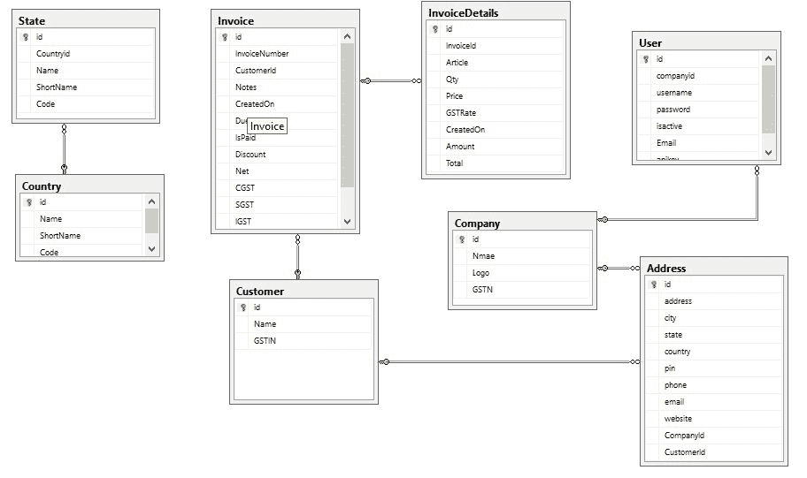
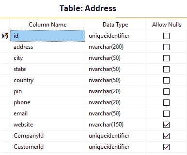
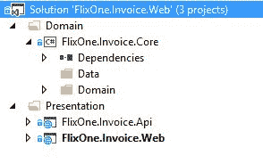

# 第 8 天-测试您的技能-构建真实世界的应用程序

第七天，我们学习了 C# 7.0 中的面向对象概念。随着对 OOP 概念的理解，我们这个学习系列的旅程需要一个动手的、实用的、真实的应用程序，这就是我们在这里的原因。今天是我们七天学习系列的复习日。在过去的七天里，我们学到了很多东西，包括以下内容:

*   。NET 框架和。净核心
*   基本的 C#概念，包括语句、循环、类、结构等等
*   高级 C#概念，包括委托、泛型、集合、文件处理、属性等等
*   C# 7.0 和 C# 7.1 的新特性

在过去的七天里，我们借助代码片段详细讨论了上述主题，并详细讨论了代码。我们在第一天从最基本的概念开始，在第二天和第三天涵盖了中间的内容，然后通过代码解释逐步完成高级主题。

今天，我们将重温一切，并在 C# 7.0 中构建一个真实世界的应用程序。以下是我们完成申请的步骤:

1.  讨论我们应用程序的需求。
2.  我们为什么要开发这个应用程序？
3.  应用开发入门:

    *   先决条件
    *   数据库设计
    *   讨论基本架构

# 我们为什么要开发这个应用程序？

我们的申请将基于印度的商品及服务税体系(http://www.gstn.org/)。在印度，最近已经宣布了这一系统，该行业强烈要求尽快采用该系统。这是创建一个真实世界的应用程序的合适时机，它给了我们一个实际的体验。

讨论我们应用程序的要求:

在本节中，我们将讨论我们的应用程序并对其进行布局。首先，让我们为我们的应用程序确定一个名称；我们称之为*flixoneinvoting*——一个生成发票的系统。正如上一节所讨论的，当今的行业需要一个能够满足其需求的系统来满足商品及服务税的所有部分，我们将借助基于商品及服务税的应用示例来演示这个系统。以下是系统的主要要求:

*   系统应该是特定于公司的，并且公司应该是可配置的
*   公司可以有多个地址(注册地址和发货地址可能不同)
*   公司可以是个人或注册实体
*   系统应该具有客户端/客户功能
*   该系统应该支持服务和商品行业
*   该体系应该遵循印度的商品及服务税规则
*   系统应该具有报告功能
*   系统应该具有基本操作，如添加、更新、删除等

前面提到的高级需求让我们对将要开发的系统有了一个概念。在接下来的部分中，我们将基于这些需求开发一个应用程序。

# 开始应用程序开发

在前面的章节中，我们讨论了为什么我们要开发这个应用程序，以及为什么根据行业需求需要它。我们还讨论了基本的系统需求，并从理论上布局了系统，这样当我们从实际编码开始时，我们就可以遵循所有这些规则/需求。在这一部分，我们将开始实际开发。

# 先决条件

要开始开发此应用程序，我们需要以下条件作为先决条件:

*   Visual Studio 2017 更新 3 或更高版本
*   SQL Server 2008 R2 或更高版本
*   C# 7.0 或更高版本
*   ASP.NET 核心
*   实体框架核心

# 数据库设计

要执行数据库设计，您应该对 SQL Server 和数据库的核心概念有基本的了解。如果您想学习数据库概念，以下资源可能会有所帮助:

*   [https://www . code project . com/Articles/359654/重要-数据库-设计-规则-哪些-I-fo](https://www.codeproject.com/Articles/359654/important-database-designing-rules-which-I-fo)
*   [https://www . packtpub . com/大数据与商业智能/SQL-server-2016-开发者指南](https://www.packtpub.com/big-data-and-business-intelligence/sql-server-2016-developer-guide)
*   [http://www.studytonight.com/dbms/database-normalization.php](http://www.studytonight.com/dbms/database-normalization.php)

根据我们在上一节中讨论的布局系统的基本业务需求，让我们设计一个完整的数据库，以便保存重要的应用程序数据。

# 概观

我们需要以这样的方式开发我们的数据库，它应该在*单个系统、多个公司*的基础上工作。*单一系统、多公司*功能将使我们的系统能够在一个公司结构内工作，在该结构中，公司有多个分支机构，一个总部和单独的用户为其他分支机构维护系统。

在本节中，我们将讨论以下数据库图表:

根据我们的要求，我们的系统适用于多家公司，这意味着每家公司都有自己的配置、用户、客户和发票。比如两个不同的公司(*ABC**XYZ*)使用同一个系统，那么 *abc* 的用户只能访问 *abc* 的信息。

The current system does not follow B2B or B2C categories.

让我们分析一下前面的数据库图表，以了解实际的关系层次结构。**公司**表由**用户**表引用，因此用户仅特定于一个公司。**地址**表在**公司**和**客户**表中很突出，两个表都引用了该表。拥有**地址**表参考**公司**和**客户**表，我们可以为它们中的每一个拥有多个地址。

国家和州的主数据分别存储在**国家**和**州**表中。国家只能属于一个特定的国家，因此相应地参照**国家**表。

We arrange our tables in this way to achieve normalization. Refer to [http://searchsqlserver.techtarget.com/definition/normalization](http://searchsqlserver.techtarget.com/definition/normalization) in order to understand the concept of normalization in a database.

讨论模式和表:

在前一节中，我们对数据库设计进行了概述。让我们讨论系统中的重要表格及其用法:

*   **用户**:本表包含了各公司*用户*的所有相关数据。这些是可以在系统上操作的用户。此表保存用户信息； **companyid** 是 **Company** 表的外键，它提供了**用户**和**公司**表之间的关系，以指示系统特定用户是指特定公司:

*   **公司**:本表包含公司所有相关信息，存储**名称**和 **GSTN** 字段。如果公司不是 GSTN 的注册公司， **GSTN** 字段为空。与**地址**表存在外键关系，因为一个公司可能有多个地址。因此，**公司**和**地址**表呈现一对多的关系:

*   **客户**:本表包含一个客户的所有相关信息，包括**名称**和 **GSTN。**GSTN**字段为空，因为个人不会在 **GSTN 注册。**此表与**地址**表也有关系:**

 **

*   **地址**:本表包含所有与公司或客户地址相关的信息，可以是多个:

*   **发票和发票明细**:这些表都是交易表。**发票**表包含创建发票所需的所有详细信息，**发票详细信息**表包含特定发票的项目/交易的完整详细信息:

*   **国家和州**:这些表存储主记录数据。这些数据不会改变，任何系统事务都不会影响这两个表中存储的数据。到目前为止，这两个表包含了印度特有的主数据:

按照我们最初的要求，前面的表格很好；当我们得到更多或更新的需求时，我们可以添加/更新表格。这个系统是用来更新的。

You can refer to `Database_FlixOneInvoice.sql` for the complete database schema and master data that is available on GitHub repository [<url>] in Day-08.

在下一节中，我们将讨论系统架构和我们将要编写的实际代码。

# 讨论基本架构

在这一节中，我们将讨论我们的应用程序的基本架构；我们将不讨论设计模式和其他架构相关的东西，这些都超出了本书的范围。

To understand design patterns, refer to [https://www.questpond.com/demo.html#designpattern](https://www.questpond.com/demo.html#designpattern).

正如先决条件中提到的，我们的应用程序将基于 ASP.NET 核心，它使用 RESTful API。这只是一个基本版本，所以我们不会展示太多设计模式的实现。下图简要概述了我们的 Visual Studio 解决方案。我们有一个表示和域，您可以将这些层拆分成更多的层来定义业务工作流。

我使用 C# 7.0 编写了实际的代码；该应用程序涵盖了我们在第 7 天讨论的所有内容。

Complete application is shipped with this chapter on GitHub: <<Link>>

在这一节中，我们将介绍到第 7 天为止我们所学的主要代码片段。下载完整的应用程序，在 Visual Studio 中打开解决方案，然后访问代码。将代码与您在这七天旅程中所学的一切联系起来。例如，看看我们在哪里使用了继承、封装等等。试着把我们在这本书里讨论的概念形象化。您将能够连接为我们的应用程序编写的每一条代码语句。

# 重游第八天

今天是我们书的修订日。当然，这是本书的最后一章，但这只是你开始探索更多与 C#相关的东西的开始。这一天，我们开发了一个基于印度商品及服务税系统的应用程序。在这个应用程序的帮助下，我们重温了您在这个为期七天的学习系列中学习的所有内容，包括属性、反思、C# 7.0 特性等等。**