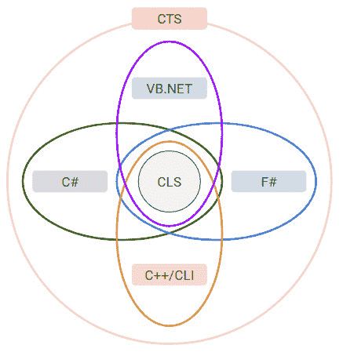
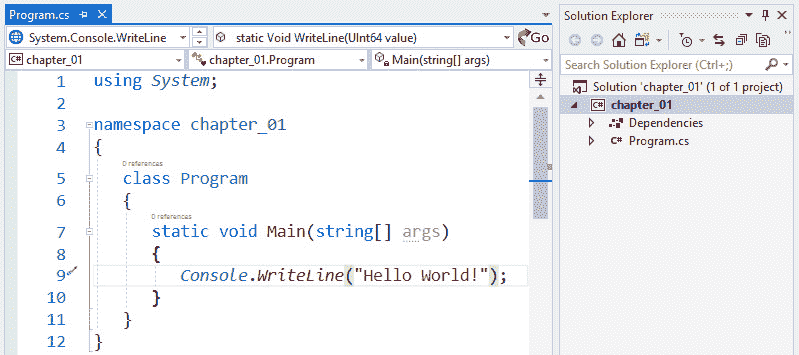

# *:从 c#的构建模块开始*

 *c#是最广泛使用的通用编程语言之一。 它是一种多范式语言，结合了面向对象、命令式、声明式、函数式、泛型和动态编程。 c#是为**公共语言基础结构**(**CLI**)平台设计的编程语言之一。 这是由微软开发的一个开放的规范和标准化的**国际标准化组织(ISO**)和【显示】欧洲计算机制造商协会**(**ECMA)描述了可执行代码和运行时环境使用不同的计算机平台上不 为特定的体系结构重写。****

 ****多年来，c#不断发展，一个版本又一个版本地发布了强大的特性。 最新的版本(在撰写本文时)是 c# 8，它引入了一些特性来提高开发人员的工作效率。 这包括可空引用类型、范围和索引、异步流、接口成员的默认实现、递归模式、开关表达式，以及许多其他。 您将在[*第十五章*](15.html#_idTextAnchor271)、*c# 8 的新特性*中详细了解这些特性。

在这一章中，我们将向你介绍。net 框架，以及与之相关的基本概念。 我们将本章内容组织如下:

*   学习 c#的历史
*   理解 CLI
*   了解。net 系列框架
*   在。net 程序集
*   了解 c#程序的基本结构

在本章的最后，您将学习如何编写一个**Hello World!** c#编程

# c#的历史

微软的 c#开发始于 20 世纪 90 年代末，由 Anders Hejlsberg 领导的团队开始。 最初，它被称为**Cool**，但是当. net 项目在 2002 年夏天首次公开宣布时，语言被重新命名为 c#。 使用锋利后缀的目的是表示该语言是 c++的一个增量，c++与 Java、Delphi 和 Smalltalk 一起成为了 CLI 和 c#语言设计的灵感来源。

c#的第一个版本是**1.0**，它与。net Framework 1.0 和 Visual Studio . net 2002 捆绑在一起，于 2002 年推出。 从那时起，随着。net Framework 和 Visual Studio 的新版本的发布，该语言的主要和次要的增量都已经发布。 下表列出了所有的版本和每个版本的一些关键特性:


在撰写本文时，该语言的最新版本 8.0 正在与。net Core 3.0 一起发布。 虽然大多数特性也可以在。net Framework 的项目中使用，但有些特性却不能，因为它们需要在运行时中进行更改，这是微软不再做的事情，因为。net Framework 正在被。net Core 取代。

现在您已经对 c#语言的演变有了一个概述，让我们开始看看该语言所瞄准的平台。

# 了解 CLI

CLI 是一种规范，它描述了如何在不同的计算机平台上使用运行时环境，而无需针对特定的架构进行重写。 它由微软公司开发，并由 ECMA 和 ISO 进行标准化。 下面的图表显示了 CLI 的高级功能:


图 1.1 - CLI 的高级功能图

CLI 允许用各种编程语言(符合 cls 的)编写的程序在任何操作系统上使用单个运行时执行。 CLI指定了一个共同的语言,叫做**公共语言规范(CLS)**,一个常见的数据类型集合,任何语言必须支持,叫做**通用类型系统,和其他的东西,如异常的处理方式和如何管理国家。 下面几节将更详细地描述 CLI 指定的各个方面。**

 **信息框

由于本章的范围有限，不可能深入探讨规范。 如果您想了解更多关于 CLI 的信息，您可以访问 ISO 站点[https://www.iso.org/standard/58046.html](https://www.iso.org/standard/58046.html)。

CLI 有几种实现，其中最重要的是。net Framework、。net Core 和 Mono/Xamarin。

## 通用型系统(CTS)

CTS 是 CLI 的一个组件，它描述了类型定义和值是如何表示的，内存旨在促进在编程语言之间共享数据。 以下是 CTS 的一些特点和功能:

*   它支持跨平台集成、类型安全性和高性能代码执行。
*   它提供了一个面向对象的模型，支持许多编程语言的完整实现。
*   它为语言提供了规则，以确保用不同编程语言编写的对象和对象的数据类型能够相互交互。
*   它定义了类型可见性和成员访问规则。
*   它定义了类型继承、虚拟方法和对象生存期的规则。

CTS 支持两类类型:

*   值类型**:这些直接包含它们的数据，具有复制语义，这意味着当复制这种类型的对象时，它的数据也会被复制。**
***   **引用类型**:这些包含对存储数据的内存地址的引用。 复制引用类型的对象时，复制的是引用而不是它所指向的数据。**

 **尽管这是一个实现细节，值类型通常存储在堆栈上，而引用类型存储在堆的上。 值类型和引用类型之间的转换是可能的，称为**装箱**，而反过来称为**开箱**。 这些概念将在下一章作更详细的解释。

## 通用语言规范

CLS 由一组规则组成，任何以 CLI 为目标的语言都需要遵守这些规则，以便能够与其他符合 CLS 的语言互操作。 CLS 规则属于 CTS 的更广泛的规则，因此可以说CLS 是 CTS 的一个子集。 CTS 的所有规则都适用于 CLS，除非 CLS 的规则更严格。 不可能很容易地验证代码的类型安全的语言构造被排除在 CLS 之外，因此所有使用 CLS 的语言都可以生成可验证的代码。

CTS 和 CLS 之间的关系以及针对 CLI 的编程语言的关系在概念上如下图所示:



图 1.2 -显示 CTS 和 CLS 与以 CLI 为目标的编程语言之间概念关系的图表

仅使用 CLS 规则构建的组件称为**符合 CLS 的**。 此类组件的一个例子是框架库，它需要跨. net 上支持的所有语言工作。

## 通用中级语言(CIL)

CIL 是平台中立的中间语言(以前称为**Microsoft intermediate language**或**MSIL**)，它表示由 CLI 定义的中间语言二进制指令集。 它是一种基于堆栈的面向对象的汇编语言，以字节码格式表示代码。

一旦编译了应用程序的源代码，编译器将其转换为 CIL 字节码并生成 CLI 程序集。 当 CLI 程序集被执行时，字节码通过**即时**编译器来生成本机代码，然后由计算机的处理器执行。 CIL 的 CPU 和平台独立特性使得代码可以在任何支持 CLI 的环境中执行。

为了帮助我们理解 CIL，让我们看一个示例。 下面的清单显示了一个非常简单的 c#程序，它打印了一个**Hello, World!** 消息到控制台:

```cs
using System;
namespace chapter_01
{
   class Program
   {
      static void Main(string[] args)
      {
         Console.WriteLine("Hello World!");
      }
   }
}
```

可以查看的内容汇编编译器使用产生的各种实用工具,比如**ildasm.exe**,有。net 框架,或 ILSpy,这是一个开源的. net 汇编浏览器和反编译器(可以在 http://www.ilspy.net/)。 **ildasm.exe**文件显示了程序及其组件的可视化表示，如类和成员:


图 1.3 -显示程序集内容的 ildasm 工具的屏幕截图

如果双击每个方法，还可以看到清单的内容(包括程序集元数据)以及 CIL 代码。 以下截图显示了**Main**方法的反汇编代码:


图 1.4 - ildasm 工具显示 Main 方法的 IL 代码的截图

还提供了一个人类可读的 CIL 代码转储。 这从清单开始，接着是类成员的声明。 以下是上述程序的部分 CIL 代码列表:

```cs
// Metadata version: v4.0.30319
.assembly extern System.Runtime
{
  .publickeytoken = (B0 3F 5F 7F 11 D5 0A 3A )                         // .?_....:
  .ver 4:2:1:0
}
.assembly extern System.Console
{
  .publickeytoken = (B0 3F 5F 7F 11 D5 0A 3A )                         // .?_....:
  .ver 4:1:1:0
}
.assembly chapter_01
{
}
.module chapter_01.dll
// MVID: {1CFF5587-0C75-4C14-9BE5-1605F27AE750}
.imagebase 0x00400000
.file alignment 0x00000200
.stackreserve 0x00100000
.subsystem 0x0003       // WINDOWS_CUI
.corflags 0x00000001    //  ILONLY
// Image base: 0x00F30000
// =============== CLASS MEMBERS DECLARATION ===================
.class private auto ansi beforefieldinit chapter_01.Program
       extends [System.Runtime]System.Object
{
  .method private hidebysig static void  Main(string[] args) cil managed
  {
    .entrypoint
    // Code size       13 (0xd)
    .maxstack  8
    IL_0000:  nop
    IL_0001:  ldstr      "Hello World!"
    IL_0006:  call       void [System.Console]System.Console::WriteLine(string)
    IL_000b:  nop
    IL_000c:  ret
  } // end of method Program::Main
  .method public hidebysig specialname rtspecialname 
          instance void  .ctor() cil managed
  {
    // Code size       8 (0x8)
    .maxstack  8
    IL_0000:  ldarg.0
    IL_0001:  call       instance void [System.Runtime]System.Object::.ctor()
    IL_0006:  nop
    IL_0007:  ret
  } // end of method Program::.ctor
} // end of class chapter_01.Program
```

这里对代码的解释超出了本章的范围，但是您可以一眼就看出其中的部分内容，比如类、方法和在每个方法中执行的指令。

## 虚拟执行系统

VES 是 CLI 的一部分，它代表了一个运行时系统，该系统提供了执行托管代码的环境。 它有几个内置的服务来支持代码的执行和异常处理等。

公共语言运行库是。net 框架对虚拟执行系统的实现。 CLI 的其他实现提供了它们自己的 VES 实现。

# .NET 系列框架

net 写作是由微软开发的通用开发平台的各种类型的应用程序桌面,云,和移动。CLI 的。net 框架是第一个实现,但随着时间的推移,创建了一系列的其他框架,比如。net 微框架,. net 本地人,和 Silverlight。 虽然。net Framework 可以在 Windows 上运行，但其他目前的实现，如。net Core 和 Mono/Xamarin，是跨平台的，可以在其他操作系统上运行，如 Linux、macOS、iOS 或 Android。

下面的截图显示了目前顶级的。net 框架的主要特点。net Framework 是为 Windows 开发。net 应用程序，并随操作系统一起发布。net Core，它是跨平台和开源的， 针对现代应用程序需求和开发人员工作流进行了优化，并与应用程序一起分发。 Xamarin 使用基于 mono 的运行时，它也是跨平台和开源的。 它旨在为 iOS、macOS、Android 和 Windows 开发移动应用程序，并与应用程序一起发布:


图 1.5 -最重要的。net 框架的主要特征图

所有这些实现都基于一个公共的基础设施，包括语言、编译器和运行时组件，并支持各种应用模型，其中一些如下面的截图所示:


图 1.6 - .NET 框架基础结构和它们支持的应用程序模型的高层图

在这里，您可以看到每个框架都位于公共基础设施之上，并提供一组基本库和不同的应用程序模型。

## .NET 框架

. net Framework 是 CLI 的第一个实现。 它是 Windows Server 和客户端开发人员的主要开发平台。 它包含一个支持多种应用程序类型的大型类库。 框架工作是作为操作系统的一部分分发的，因此，通过**Windows Update**为新版本提供服务，尽管也可以使用独立的安装程序。 最初，. net Framework 是微软开发的私有软件。 近年来，. net 框架的部分内容已经实现了开源。

下表展示了。net 框架的历史，以及每个版本中可用的主要特性:


在未来，微软打算将所有的。net 框架统一为一个框架。 在撰写本书时，计划将其命名为。net 5。

. net Framework包括**公共语言运行时**(**CLR**)，它是框架的执行引擎，提供内存管理、类型安全、垃圾收集、异常处理、线程管理等服务。 它还包括 CLI 基础标准库的实现。 下面是标准库的组件列表(虽然不是全部):

*   **基类库**(**BCL**):它提供了类型来表示 CLI 内置类型、简单文件访问、自定义属性、字符串处理、格式化、集合、流等。
*   **Runtime Infrastructure Library**:它提供服务来动态地从流中加载类型，以及允许编译器以 CLI 为目标的其他服务。
*   **反射库**:它提供了服务，使得在运行时检查类型的结构、实例化对象和调用方法成为可能。
*   **网络库**:提供网络服务。
*   **Extended Numerics Library**:它提供了支持浮点和扩展精度数据类型。
*   **并行库**:它以简单的形式提供并行。

除了这些库之外，。net Framework 类库(**FCL**)还包括许多其他的库，如WPF、WinForms、WCF、LINQ 等。 其中大多数都在**系统中。 ***或**微软。** 命名空间

在。net 平台上使用 c#进行开发的一个关键方面是如何管理内存。 一般来说，开发人员不必担心对象的生命周期和内存的处理。 内存管理是由 CLR 通过**垃圾收集器**(**GC**)自动完成的。 当不再使用堆对象时，GC 处理堆上对象的分配和内存的处理。

垃圾收集是一个*非确定性过程*，因为它是根据需要而不是在某些确定的时刻发生的。 垃圾收集的工作方式在[*第 9 章*](09.html#_idTextAnchor173)，*资源管理*中有详细描述。

## .NET Core

. net Core 是 CLI 的一个新实现，它是跨平台、开源和模块化的。 它旨在开发各种应用程序，如 web 应用程序、微服务、库或运行在 Windows、Linux 和 macOS 上的控制台应用程序。 .NET Core 框架是用 NuGet 打包的; 结果，它要么被直接编译到应用程序中，要么被放入应用程序中的文件夹中。 因此，. net Core 应用程序直接分发框架组件，尽管用于集中部署的缓存系统(称为**运行时包存储**)从 2.0 版本开始也可用。

面向。net Core 的 VES 实现称为**CoreCLR**。 类似地，CLI 基础标准库的实现称为**CoreFX**。

ASP。 NET Core 是.NET Core 的一部分，但也运行在。NET Framework CLR 上。 然而,一个 ASP。 NET Core 应用只有针对。NET Core 时才是跨平台的。

随着 2019 年 9 月 3.0 版本的发布，开发者可以使用。net Core 创建 web 应用程序、微服务、桌面应用程序、机器学习和 AI 应用程序、物联网应用程序、图书馆和控制台应用程序。

你将在[*第 16 章*](16.html#_idTextAnchor296)，*c# in Action with . net Core 3*学习更多关于。net Core 的知识。

## Xamarin

Xamarin 是一个基于**Mono**的 CLI 实现，它是一个跨平台的、开源的。net 框架。 总的来说，Mono api遵循的是。net Framework 的发展，而不是。net Core。 该框架旨在编写可以在 iOS、Android、macOS 和 Windows 设备上运行的移动应用程序。

使用 Xamarin 开发的应用程序是*原生*，这与使用 Objective-C 或 Swift (iOS)开发的应用程序和使用 Java 或 Kotlin (Android)开发的应用程序的性能类似。 Xamarin 还提供了直接调用 Objective-C、Java、C 和 c++库的工具。

Xamarin 应用程序是用 c#编写的，并且使用。net 基类库。 它们可以共享大部分代码，只有一小部分需要特定于平台。

关于 Xamarin 的详细信息超出了本书的范围。 如果您想了解关于此实现的更多信息，您应该使用其他资源。

# .NET 中的程序集

程序集是用于部署、版本控制和安全性的基本单元。 程序集有两种形式，要么是**可执行文件**(**.exe**)，要么是**动态链接库**(**.dll**)。 集合是类型、资源和元信息的集合，它们构成一个功能的逻辑单元。 程序集只有在需要时才被加载到内存中。 对于。net 框架应用程序，程序集可以位于应用程序专用文件夹中，也可以在全局程序集缓存中共享，前提是它们是强命名的。 对于. net Core应用程序，后一种解决方案是不可用的。

每个程序集都包含一个包含以下信息的清单:

*   程序集的标识(例如名称和版本)
*   描述构成程序集的文件表，如其他程序集或资源(如映像)
*   包含应用程序需要的外部依赖项的程序集引用列表

程序集的标识由以下几个部分组成:

*   文件的**名称**，其中名称应符合 Windows Portable 可执行文件格式
*   **大调、小调、构建、修订形式的**版本**，如 1.12.3.0**
*   的**区域性**应该是与区域无关的，但附属程序集(它是感知区域的程序集)除外。
*   **公钥令牌**，它是用于签名程序集的 64 位私钥哈希; 签名程序集具有强名称，意味着提供唯一名称

您将在[*第 11 章*](11.html#_idTextAnchor200)、*反射和动态规划*中了解更多关于程序集的知识。

## 全局汇编缓存(GAC)

如前一节所述，. net 框架程序集既可以存储在本地*，在应用程序文件夹中，也可以存储在*GAC*中。 这是一个机器范围的代码缓存，它允许在应用程序之间共享程序集。 自从。net Framework 4 发布以来，GAC 的默认位置是**%windir%\Microsoft。 NET\汇编**; 然而，以前的位置是**%windir%\assembly**。 GAC 还支持在私有文件夹中存储相同程序集的多个版本，这实际上是不可能的，因为您不能在同一个文件夹中存储多个具有相同名称的文件。*

 *要将程序集部署到 GAC，您可以使用名为**gacutil.exe**的 Windows SDK 实用工具或能够与 GAC 一起工作的安装程序。 然而，一个程序集必须有一个强名称才能部署到 GAC。 **强名称程序集**是一个用私钥进行加密签名的程序集，私钥对应于与该程序集一起分发的公钥。 您可以使用**Strong Name 工具**(**sn.exe**)对程序集进行签名。

请注意

如何签订大会的更多细节,请参考以下文档,它描述了签订大会有很强的名字:https://docs.microsoft.com/en-us/dotnet/framework/app-domains/how-to-sign-an-assembly-with-a-strong-name。

将程序集添加到 GAC 时，将对程序集包含的所有文件执行完整性检查。 这样做是为了确保装配没有被篡改。 加密签名确保对程序集中任何文件的任何更改都会使签名无效，并且只有访问私钥的人才可以退出程序集。

## 运行时包存储

GAC 不用于。net Core 程序集。 这些程序集可以在任何平台上运行，而不仅仅是Windows 上。 在. net Core 2.0 之前，部署的唯一选项是应用程序文件夹。 但是，从 2.0 版本开始，可以根据目标环境中存在的一组已知包打包和部署应用程序。 这使得部署速度更快，磁盘空间要求更低。 通常，这个存储在 macOS 和 Linux 上的**/usr/local/share/dotnet/store**中，在 Windows 上的**C:/Program Files/dotnet/store**中。

在发布应用程序时使用的目标清单文件中列出了运行时包存储中可用的包。 该文件的格式与项目文件格式(**.csproj**)兼容。

详细描述目标过程超出了本章的范围，但是您可以通过访问以下链接了解更多关于运行时包存储:[https://docs.microsoft.com/en-us/dotnet/core/deploying/runtime-store](https://docs.microsoft.com/en-us/dotnet/core/deploying/runtime-store)。

# 了解 c#程序的基本结构

到目前为止，我们已经学习了 c#和。net 运行时的基础知识。 在本节中，我们将编写一个简单的 c#程序，这样我们就可以简短地介绍一个简单程序的一些关键元素。

在编写程序之前，必须创建一个项目。 为此，你应该使用 Visual Studio 2019; 另外，您也可以使用任何其他版本来阅读本书的大部分内容。 本书的源代码是在 Visual Studio 2019 中使用。net Core 项目编写的。 创建新项目时，选择**控制台应用程序(。 NET Core)**，并调用项目**chapter_01**:


图 1.7 -选择控制台应用程序(。 在 Visual Studio 中创建新项目时，使用 asp.net Core)模板

系统会自动为您创建一个包含以下内容的项目:



图 1.8 - Visual Studio 截图和为所选模板生成的代码

这段代码表示了一个 c#程序必须包含的最小值:一个文件，包含一个类，该类只有一个方法**Main**。 您可以编译并运行该项目和消息**Hello World!** 将显示在控制台。 然而，为了更好地理解它，让我们看看实际的 c#程序。

第一行程序(**使用系统; )声明我们想在这个程序中使用的命名空间。 名称空间包含类型，这里使用的名称空间是基类库的核心名称空间。**

在下一行中，我们定义了自己的命名空间**chapter_01**，c包含我们的代码。 使用**名称空间**关键字引入名称空间。 在这个命名空间中，我们定义了一个单独的类**Program**。 用**class**关键字介绍一个类。 此外，这个类包含一个名为**Main**的方法，其参数是一个名为**args**的字符串数组。 名称空间、类型(无论是类、结构、接口还是枚举)和方法中的代码总是在花括号**{}**中提供。 这个方法是程序的入口点，这意味着它是程序执行开始的地方。 一个 c#程序必须有且只有一个**Main**方法。

**Main**方法只包含一行代码。 它使用**System.Console.WriteLine**静态方法将文本打印到控制台。 静态方法是属于某个类型而不是该类型的实例的方法，这意味着您不需要通过对象调用它。 Main 方法本身是一个静态方法，但它是一个特殊的方法。 每个 c#程序都必须有一个称为**Main**的静态方法，它被认为是程序的入口点，也是程序开始执行时第一个被调用的方法。

在接下来的章节中，我们将学习命名空间、类型、方法以及 c#的其他关键特性。

# 总结

在本章中，我们简要地回顾了 c#的历史。 然后，我们探讨了 CLI 及其组成部分(如 CTS、CLS、CIL 和 VES)背后的基本概念。 然后，我们看了。net 系列框架，并简要讨论了。net Framework、。net Core 和 Xamarin。 我们还讨论了程序集、GAC(用于。net 框架)和运行时包存储(用于。net Core)。 最后，我们编写了第一个 c#程序，并查看了它的结构。

这些框架和运行时的概述将帮助您理解编写和执行 c#程序的上下文，并为我们讨论更高级的特性(如反射、汇编加载)或查看. net Core 框架提供良好的背景。

在下一章中，我们将探索 c#中的基本数据类型和运算符，并学习如何使用它们。

# 测试你所学的内容

1.  c#第一次发布是什么时候，它的当前版本是什么?
2.  什么是公共语言基础架构? 它的主要组成部分是什么?
3.  什么是通用中间语言，它与即时编译器有什么关系?
4.  您可以使用什么工具来分解和研究编译器生成的程序集?
5.  什么是公共语言运行库?
6.  什么是基类库?
7.  目前主要的。net 框架有哪些? 哪一个将不再被开发?
8.  什么是总成? 什么构成了一个集会的身份?
9.  什么是全局程序集缓存? 运行时包存储如何?
10.  一个 c#程序必须包含什么才能被执行?

**********