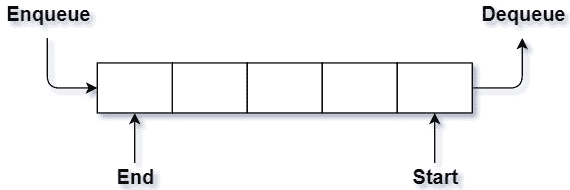
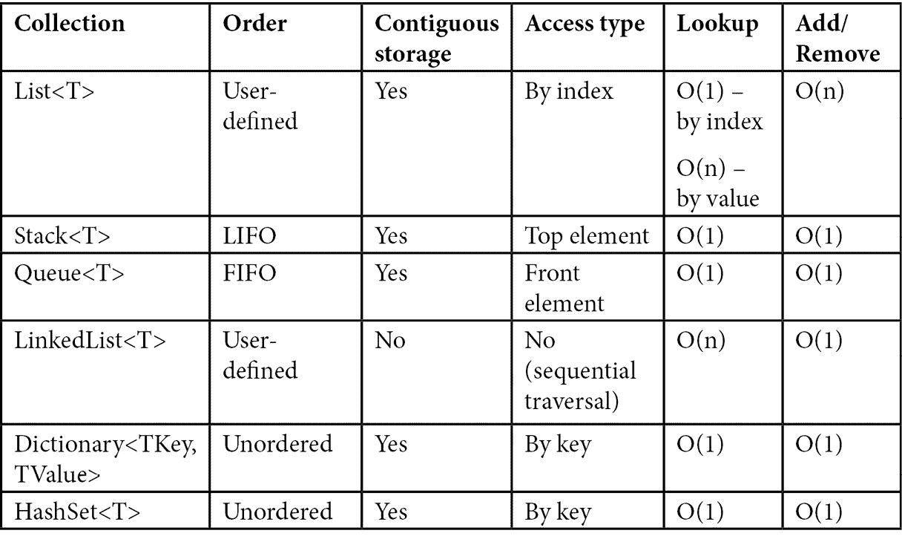
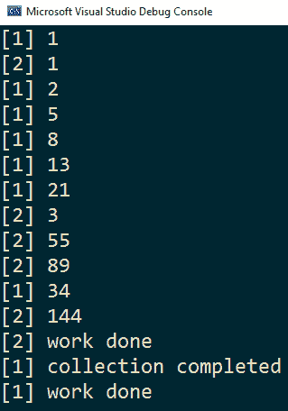

# *第七章*:集合

在前一章中，我们学习了 c#中的泛型编程。 泛型最重要的应用之一是创建泛型集合。 **集合**是一组对象。 我们在[*第二章*](02.html#_idTextAnchor036)、*数据类型与操作符*中学习了如何使用数组。 然而，数组是固定大小的序列，在大多数情况下，我们需要处理可变大小的序列。

. net 框架提供了表示各种类型集合的泛型类，例如列表、队列、集合、映射等等。 使用这些类，我们可以轻松地对一个对象集合执行插入、更新、删除、排序和搜索等操作。

本章将介绍以下泛型集合:

*   列表<T>集合
*   **堆栈<T>**集合
*   **队列<T>**集合
*   **LinkedList<T>**集合
*   **Dictionary<TKey, TValue>**集合
*   **HashSet<T>**集合

在本章结束时，你将对。net 中最重要的集合有一个很好的理解，它们建模的数据结构是什么，它们之间的区别是什么，以及什么时候应该使用它们。

前面提到的所有集合都不是线程安全的。 这意味着在多线程场景中，当一个线程可能正在读取而另一个线程可能正在写入同一个集合时，不能使用外部同步机制。 然而，. net 在**System.Collections.Concurrent**名称空间中也提供了几个线程安全的集合，它们使用高效的锁定或无锁定同步机制，并且在许多场景中，它们提供的性能比带有外部锁的通用集合更好。 在本章中，我们还将提供这些集合的演练，并了解适合使用它们的场景。

让我们通过查看**System.Collections.Generic**命名空间来概述泛型集合库，所有泛型集合都位于该命名空间中。

# System.Collections.Generic 命名空间介绍

本章将要介绍的泛型集合类是**. net 基类库**和的一部分，它们都可以在**System.Collections.Generic**命名空间下使用。 此命名空间包含定义泛型集合和操作的接口和类。 所有泛型集合实现一系列泛型接口，这些接口也在此名称空间中定义。 大致可分为两类:

*   **可变的**，它支持更改集合内容的操作，如添加新元素或删除现有元素。
*   **只读集合**，它不提供更改集合内容的方法。

表示可变集合的接口如下:

*   **IEnumerable<T>**:这是所有其他接口的基本接口，它公开了一个枚举器，该枚举器支持遍历**T**类型的集合中的元素。
*   【t16.1】**ICollection T>**:这个定义操作泛型集合的方法——**添加()**,**明确()**,**包含()**、【显示】CopyTo(),和**删除()以及属性,如【病人】**。 这些成员应该*不言自明*。
*   **IList<T>**:这表示一个泛型集合，其元素可以被*索引*访问。 它定义了三个方法:**IndexOf()**,检索元素的索引,插入(),**在指定的索引,插入一个元素和【显示】RemoveAt()**,删除指定索引的元素,此外,它还提供了一个索引器直接元素访问直接访问。
*   **isset<T>**:这是抽象集合的基本接口。 它定义了方法如**添加()**,**ExceptWith()**,**IntersetWith()**,【显示】UnionWith(),**IsSubsetOf()**和【病人】IsSupersetOf()。
*   **dictionary<TKey, TValue>**:这是提取键值对集合的基本接口。 它定义了**添加()**,**ContainsKey()**,**删除()**和【显示】TryGetValue()方法,以及一个索引器和**键**和【病人】属性值,返回键和值的集合,分别。

这些接口之间的关系如下图所示:


图 7.1 - System.Collections.Generic 命名空间中的通用集合接口的层次结构。

表示只读集合的接口如下:

*   **IReadOnlyCollection<T>**:这表示一个只读的通用元素集合。 它只定义了一个成员:**Count**property。
*   **IReadOnlyList<T>**:这表示一个只读的通用元素集合，可以被索引访问。 它只定义了一个成员:只读索引器。
*   **IReadOnlyDictionary<TKey, TValue>**:这表示键值对的只读通用集合。 该接口定义了**ContainsKey()**和**TryGetValue()**方法，以及**Keys**和**Values**属性和一个只读索引器。

同样，这些接口的关系如下图所示:


图 7.2 -只读通用集合的接口层次结构

每个通用集合实现了其中几个接口。 例如,**<列表 T>**实现**IList<【t16.1】**,**ICollection<>**,**IEnumerable<>【显示】,**IReadOnlyCollection<>**,<和**IReadOnlyList T>【病人】。 下图展示了泛型集合实现的所有接口，我们将在本章中学习这些接口:****


图 7.3 -显示最重要的泛型集合及其实现的接口的类图

这些图中显示的继承层次结构实际上是对实际的继承层次结构的简化。 所有泛型集合都有一个等效的非泛型集合。 例如,**<IEnumerable T>**是**的通用等效 IEnumerable**,**<ICollection T>**是**的通用等效 ICollection**、【显示】<IList T>是**的通用等效 IList**,等等。 这些遗留的接口是由遗留实现集合,如【病人】ArrayList,**队列**、【t16.1】堆栈,**DictionaryBase**,**Hashtable,等等,所有这些都可在**系统。 集合**命名空间。 这些非泛型遗留集合不是强类型的。 首选使用泛型集合有以下几个原因:**

 ***   它们提供类型安全的好处。 不需要从基集合派生并实现特定于类型的成员。
*   它们对于值类型具有更好的性能，因为没有对元素进行装箱和拆箱，而非泛型集合则需要这样的过程。
*   一些泛型集合提供了非泛型集合中不可用的功能，例如接受可用于搜索或执行每个元素的操作的委托的方法。

当您需要将集合作为参数传递给函数或从函数返回集合时，您应该避免使用具体的实现，而更倾向于使用接口。 **IEnumerable T<【5】**适用于当你只是想遍历的元素,但是如果你需要做多次,您可以使用**IReadOnlyCollection<>**。 在以下两种情况下应该优先使用只读集合:

*   当方法没有修改作为参数传递的集合时
*   当您返回一个集合时，如果该集合已经在内存中，并且调用者不应该修改它

最终，最合适的接口因情况而异。

在下面几节中，我们将介绍最广泛使用的类型安全泛型集合。 在遗留代码之外，对非泛型集合不太感兴趣。

# 列表<T>集合

**List<T>**generic类表示可以被其索引访问的元素集合。 **List<T>**与数组非常相似，不同之处是集合的大小不是固定的，而是可变的，它可以随着添加或删除元素而增加或减少。 事实上，**List<T>**的实现使用数组来存储元素。 当元素的数量超过数组的大小时，将分配一个更大的新数组，并将前一个数组的内容复制到新数组中。 这意味着**List<T>**将元素存储在连续的内存位置中。 但是，对于值类型，这些位置包含值，但是对于引用类型，它们包含对实际对象的引用。 可以将对同一对象的多个引用添加到一个列表中。

**List<T>**类实现了一系列泛型和非泛型接口，如下所示:

```cs
public class List<T> : ICollection<T>, ICollection
                       IEnumerable<T>, IEnumerable, 
                       IList<T>, IList,
                       IReadOnlyCollection<T>, IReadOnlyList<T> {}
```

列表可以通过几种方式创建:

*   使用默认构造函数，这会产生一个具有默认容量的空列表。
*   通过指定特定的容量，但不指定初始元素，这再次使列表为空。
*   从一组元素中。

在下面的例子中，**数字**是一个空的整数列表，**单词**是一个空的字符串列表:

```cs
var numbers = new List<int>();
var words = new List<string>();
```

另一方面，下面的示例用一些元素初始化列表。 第一个列表将包含 6 个整数，第二个列表将包含两个字符串:

```cs
var numbers = new List<int> { 1, 2, 3, 5, 7, 11 };
var words = new List<string> { "one", "two" };
```

该类支持从此类集合中期望的所有典型操作—添加、删除和搜索元素。 有几种方法可以向列表中添加元素:

*   **Add()**将一个元素添加到列表的末尾。
*   **AddRange()**将元素集合(以**IEnumerable<T>**的形式)添加到列表的末尾。
*   **Insert()**在指定的位置插入一个元素。 位置必须是一个有效的索引，在列表的范围内; 否则，抛出**ArgumentOutOfRangeException**异常。
*   **InsertRange()**在指定的索引处插入一个元素范围(以**IEnumerable<T>**的形式)，该索引必须在列表的范围内。

如果超出了存储元素的内部数组的容量，所有这些操作都可能需要重新分配内部数组。 **Add()**在不需要分配时为*O(1)*操作，在需要分配时为*O(n)*操作。

**AddRange()**是*O(n)*如果不需要分配，*O(n+k)*如果需要分配。 **插入()**【显示】始终是一个 O (n)操作,和**InsertRange()**【病人】O (n)*如果不需要分配和 O (n + k)*如果一个分配是必要的。 在这种表示法中，*n*是列表中的元素数，*k*是要添加的元素数。我们可以在下面的示例中看到这些操作的示例:

```cs
var numbers = new List<int> {1, 2, 3}; // 1 2 3
numbers.Add(5);                        // 1 2 3 5
numbers.AddRange(new int[] { 7, 11 }); // 1 2 3 5 7 11
numbers.Insert(5, 1);                  // 1 2 3 5 7 1 11
numbers.Insert(5, 1);                  // 1 2 3 5 7 1 1 11
numbers.InsertRange(                   // 1 13 17 19 2 3 5..
    1, new int[] {13, 17, 19});        // ..7 1 1 11
```

使用不同的方法也可以通过几种方式删除元素:

*   **Remove()**从列表中移除指定的元素。
*   **RemoveAt()**移除指定索引处的元素，该元素必须在列表的范围内。
*   **RemoveRange()**从给定的索引开始删除指定数量的元素。
*   **RemoveAll()**移除列表中满足谓词要求的所有元素。
*   **Clear()**移除列表中的所有元素

所有这些操作都在*O(n)*中执行，其中*n*是列表中的元素数。 例外是**RemoveAt()**，其中*n*是**计数索引**。 这样做的原因是，在删除一个元素之后，元素必须在内部数组中移动。 下面的代码片段展示了使用这些函数的示例:

```cs
numbers.Remove(1);              // 13 17 19  2  3  5  7  1  
                                // 1 11
numbers.RemoveRange(2, 3);      // 13 17  5  7  1  1 11
numbers.RemoveAll(e => e < 10); // 13 17 11
numbers.RemoveAt(1);            // 13 11
numbers.Clear();                // empty
```

可以通过指定谓词来搜索列表中的元素。

信息框

谓词**是返回 bool 类型的委托。 它们通常在过滤元素时使用，比如在搜索集合时。**

 **有几种方法可以用来搜索元素:

*   **Find()**返回与谓词匹配的第一个元素，如果没有匹配，则返回**T**的默认值。
*   **FindLast()**返回与谓词匹配的最后一个元素，如果没有匹配，则返回**T**的默认值。
*   **FindAll()**返回一个**List<T>**，其中包含匹配谓词的所有元素，如果没有找到，则返回一个空列表。

所有这些方法都在*O(n)*中执行，如下代码片段所示:

```cs
var numbers = new List<int> { 1, 2, 3, 5, 7, 11 };
var a = numbers.Find(e => e < 10);      // 1
var b = numbers.FindLast(e => e < 10);  // 7
var c = numbers.FindAll(e => e < 10);   // 1 2 3 5 7
```

也可以搜索元素的从零开始的索引。 有几种方法可以让我们做到这一点:

*   **IndexOf()**返回与提供的实参相等的第一个元素的索引。
*   **LastIndexOf()**返回搜索元素的最后一个索引。
*   **FindIndex()**返回满足提供谓词的第一个元素的索引。
*   **FindLastIndex()**返回最后一个满足谓词的元素的索引。
*   **BinarySearch()**返回满足所提供元素的第一个元素的索引，或者使用二进制搜索的比较器。 这个函数假设列表已经排序; 否则，结果是不正确的。

**BinarySearch()**在*O(log n)*中执行，而所有其他在*O(n)*中执行。 这是因为他们使用线性搜索。 如果没有找到满足搜索条件的元素，它们都返回**-1**。 示例如下所示:

```cs
var numbers = new List<int> { 1, 1, 2, 3, 5, 8, 11 };
var a = numbers.FindIndex(e => e < 10);     // 0
var b = numbers.FindLastIndex(e => e < 10); // 5
var c = numbers.IndexOf(5);                 // 4
var d = numbers.LastIndexOf(1);             // 1
var e = numbers.BinarySearch(8);            // 5
```

有一些方法允许我们修改列表的内容，比如对元素进行排序或恢复它们:

*   **Sort()**根据默认或指定的条件对列表进行排序。 有几种重载允许我们指定比较委托或**IComparer<T>**对象，甚至可以指定要排序的列表的子范围。 该操作在大多数情况下在*O(n log n)*中执行，在最坏的情况下在*O(n2)*中执行。
*   **Reverse()**反转列表中的元素。 有一个重载允许您指定要恢复的子范围。 此操作在*O(n)*中执行。

使用这些函数的例子如下:

```cs
var numbers = new List<int> { 1, 5, 3, 11, 8, 1, 2 };
numbers.Sort();     // 1 1 2 3 5 8 11
numbers.Reverse();  // 11 8 5 3 2 1 1
```

列表<T>类中的方法比这里显示的要多。 然而，所有这些都超出了本书的范围。 您应该在网上查找该类的官方文档，以获得该类所有成员的完整参考。

# 堆栈<T>集合

堆栈是一种线性数据结构，允许我们以特定的顺序插入和删除项。 新项被添加到堆栈的顶部。 如果我们想要从堆栈中删除一个项，我们只能删除顶部的项。 由于只允许从一端插入和删除，最后插入的项将是首先删除的项。 因此，栈被称为**Last in**，**First Out (LIFO)**集合。

下图描述了一个堆栈，其中*push*表示向堆栈中添加一个项目，*pop*表示从堆栈中删除一个项目:


图 7.4 -堆栈的概念表示。

. net 提供了通用的**栈<T>**类来处理栈。 该类包含几个构造函数，这些构造函数允许我们创建一个空堆栈或一个用元素集合初始化的堆栈。 看看下面的代码片段，我们正在创建一个包含三个初始元素的字符串堆栈和一个空的整数堆栈:

```cs
var arr = new string[] { "Ankit", "Marius", "Raffaele" };
Stack<string> names = new Stack<string>(arr);
Stack<int> numbers = new Stack<int>();
```

该堆栈支持的主要操作如下:

*   **Push()**:将一个条目插入堆栈顶部。 如果不需要重新分配，则执行*O(1)*操作，否则执行*O(n)*操作。
*   **Pop()**:移除并返回堆栈顶部的项。 这是一个*O(1)*操作。
*   **Peek()**:从堆栈顶部返回一个项目，而不删除它。 这是一个*O(1)*操作。
*   **Clear()**:从堆栈中移除所有的元素。 这是一个*O(n)*操作。

让我们通过下面的例子来了解这些操作是如何工作的，在左边，你可以看到每次操作后堆栈的内容:

```cs
var numbers = new Stack<int>(new int[]{ 1, 2, 3 });// 3 2 1
numbers.Push(5);                                   // 5 3 2 1
numbers.Push(7);                                   // 7 5 3 2 1
numbers.Pop();                                     // 5 3 2 1
var n = numbers.Peek();                            // 5 3 2 1
numbers.Push(11);                                 // 11 5 3 2 1
numbers.Clear();                                  // empty
```

如果堆栈为空，那么**Pop()**和**Peek()**方法会抛出**InvalidOperationException**异常。 在。net Core 中，从 2.0 版本开始，有两个可选的非抛出方法——**TryPop()**和**TryPeek()**。 这些方法返回一个布尔值，指示顶部元素是否找到，如果找到，则作为**和**参数返回。

# 队列<T>集合

队列是一种线性数据结构，其中元素的插入和删除从两个不同的端执行。 从队列的后端添加一个新项，从前面删除现有项。 因此，首先插入的项将是首先删除的项。 因此，该队列被称为**First in**，**First Out (FIFO)**集合。 下面的图描述了一个队列，其中**Enqueue**表示向队列中添加一个项目，**Dequeue**表示从队列中删除一个项目:



图 7.5 -队列的概念表示。

在。net 中，实现通用队列的类是**queue<T>**。 同样,【显示】**栈 T>**,有重载的构造函数允许我们创建一个空的队列或队列初始化元素从一个**<IEnumerable T>**收藏。 看看下面的代码片段，我们正在创建一个包含三个初始元素的字符串队列和一个包含整数的空队列:

```cs
var arr = new string[] { "Ankit", "Marius", "Raffaele" };
Queue<string> names = new Queue<string>(arr);
Queue<int> numbers = new Queue<int>();
```

队列支持的主要操作如下:

*   **Enqueue()**:在队列的末尾插入一个条目。 这个操作是*O(1)*，除非内部阵列需要重新分配，在这种情况下它成为*O(n)*操作。
*   **Dequeue()**:从队列前面移除并返回一个项目。 这是一个*O(1)*操作。
*   **Peek()**:从队列的前面返回一个项目而不删除它。 这是一个*O(1)*操作。
*   **Clear()**:从队列中移除所有元素。 这是一个*O(n)*操作。

为了理解这些方法是如何工作的，让我们看看下面的例子:

```cs
var numbers = new Queue<int>(new int[] { 1, 2, 3 });// 1 2 3
numbers.Enqueue(5);                                 // 1 2 3 5
numbers.Enqueue(7);                                // 1 2 3 5 7
numbers.Dequeue();                                 // 2 3 5 7
var n = numbers.Peek();                            // 2 3 5 7
numbers.Enqueue(11);                              // 2 3 5 7 11
numbers.Clear();                                 // empty
```

如果队列为空，那么**Dequeue()**和**Peek()**方法会抛出**InvalidOperationException**异常。 在。net Core 中，从 2.0 版本开始，有两个非抛出方法可供选择——**TryDequeue()**和**TryPeek()**。 这些方法返回一个布尔值，指示是否找到了顶部元素，如果找到了，则将其作为一个 out 参数返回。

从这些例子中可以看出，**Stack<T>**和**Queue<T>**虽然语义不同，但实现非常相似。 他们的公共成员几乎是相同的,区别在于,堆栈操作被称为**推动()**和**Pop()**和队列操作被称为【显示】排队()和**出列()**。

# LinkedList<T>集合

链表是一种线性数据结构，由一组节点组成，其中每个节点包含数据以及一个或多个节点的地址。 有四种类型的链表，如下所述:

*   **单链表**:这个包含存储一个值和对节点序列中下一个节点的引用的节点。 对最后一个节点的下一个节点的引用将指向空。
*   **双链表**:这里，每个节点包含两个链接——第一个链接指向上一个节点，下一个链接指向序列中的下一个节点。 对第一个节点的前一个节点的引用和对最后一个节点的下一个节点的引用将指向空。
*   **环形单链表**:指向最后一个节点的下一个节点，指向第一个节点，形成环形链。
*   **双重循环链表**:在这种类型的链表,参考下一个节点的最后一个节点将指向第一个节点和参考前一个节点的第一个节点将指向最后一个节点。

双链表的概念表示如下:


图 7.6 -双链表的概念表示。

这里，每个节点包含一个值和两个指针。 **Next**指针包含了对序列中下一个节点的引用，并允许在链表的前向方向轻松导航。 **Prev**指针包含了对序列中前一个节点的引用，并允许我们在链表中向后移动。

. net 提供了**LinkedList<T>**类，它表示一个双链表。 该类包含**LinkedListNode<T>**类型的项。 插拔操作在*O(1)*中，搜索操作在*O(n)*中。 节点可以在同一个链表对象或另一个链表对象中删除或重新插入。 该列表维护一个内部计数，因此使用**count**属性检索列表的大小也是一个*O(1)*操作。 链表不支持循环、分割、链接或其他任何可能使链表处于不一致状态的操作。

**LinkedListNode<T>**类具有以下四个属性:

*   **List**:该属性将返回**LinkedListNode<T>**所属的**LinkedList<T>**对象的引用。
*   **Next**:表示对**LinkedList<T>**对象中的下一个节点的引用，如果当前节点是最后一个节点，则表示**null**。
*   **Previous**:表示对**LinkedList<T>**对象中上一个节点的引用，如果当前节点是第一个节点，则表示**null**。
*   **值**:该属性类型为**T**，表示节点中包含的值。

对于值类型，**LinkedListNode<T>**包含实际值，而对于引用类型，它包含对对象的引用。

该类具有重载的构造函数，使我们能够创建一个空链表或一个用元素序列初始化的链表，其形式为**IEnumerable<T>**。 看看下面的例子来看看一些例子:

```cs
var arr = new string[] { "Ankit", "Marius", "Raffaele" };
var words = new LinkedList<string>(arr);
var numbers = new LinkedList<int>();
```

在链表中添加新元素有几种方式，使用以下方法:

*   **AddFirst()**在列表的开始添加一个新节点或值。
*   **AddLast()**在列表的末尾添加一个新节点或值。
*   **AddAfter()**在指定节点后的列表中添加一个新节点或值。
*   **AddBefore()**在列表中指定节点之前添加一个新节点或值。

在下面的例子中，我们可以看到重载的例子，它为每一个方法添加一个新值:

```cs
var numbers = new LinkedList<int>();
var n2 = numbers.AddFirst(2);      // 2
var n1 = numbers.AddFirst(1);      // 1 2
var n7 = numbers.AddLast(7);       // 1 2 7
var n11 = numbers.AddLast(11);     // 1 2 7 11
var n3 = numbers.AddAfter(n2, 3);  // 1 2 3 7 11
var n5 = numbers.AddBefore(n7, 5); // 1 2 3 5 7 11
```

搜索链表中的元素可以使用以下方法之一:

*   **Contains()**:检查是否在列表中找到指定的值，并返回一个布尔值来表示成功或失败。
*   **Find()**:查找并返回第一个包含指定值的节点。
*   **FindLast()**:查找并返回包含指定值的最后一个节点。

使用这些函数的示例如下:

```cs
var fn1 = numbers.Find(5);
var fn2 = numbers.FindLast(5);
Console.WriteLine(fn1 == fn2);           // True
Console.WriteLine(numbers.Contains(3));  // True
Console.WriteLine(numbers.Contains(13)); // False
```

从列表中删除元素可以使用以下几种方法:

*   **RemoveFirst()**移除列表中的第一个节点。
*   **RemoveLast()**移除列表中的最后一个节点。
*   **Remove()**从列表中删除指定的节点或第一个出现的指定值。
*   **Clear()**从列表中删除所有元素。

你可以在下面的清单中看到所有这些方法:

```cs
numbers.RemoveFirst(); // 2 3 5 7 11
numbers.RemoveLast();  // 2 3 5 7
numbers.Remove(3);     // 2 5 7
numbers.Remove(n5);    // 2 7
numbers.Clear();       // empty
```

链表类也有几个属性,包括**,返回列表中元素的个数,**,返回第一个节点,最后**,返回最后一个节点。 如果列表为空，那么**计数**为**0**和**第一个**和**最后一个**都设置为**null**。******

 ****# 字典<TKey, TValue>集合

字典是键值对的集合，允许基于键进行快速查找。 添加、搜索和删除项目是非常快速的操作，可以在*O(1)*中执行。 这里的例外是，如果必须增加容量，则添加一个新值，在这种情况下，它成为*O(n)*。

在。net 中，通用的**Dictionary<TKey,TValue>**类实现了一个字典。 **TKey**表示键的类型，**TValue**表示值的类型。 该字典的元素是**KeyValuePair<TKey,TValue>**对象。

**Dictionary<TKey, TValue>**有几个重载的构造函数，允许我们创建一个空字典或一个充满一些初始值的字典。 该类的默认构造函数将创建一个空字典。 看看下面的代码片段:

```cs
var languages = new Dictionary<int, string>(); 
```

这里，我们正在创建一个名为**languages**的空字典，该字典具有**int**类型的键和**string**类型的值。 我们也可以在声明的时候初始化字典。 考虑以下代码片段:

```cs
var languages = new Dictionary<int, string>()
{
    {1, "C#"}, 
    {2, "Java"}, 
    {3, "Python"}, 
    {4, "C++"}
};
```

这里，我们创建了一个由四个值初始化的字典，这些值具有键**1**、**2**、**3**和**4**。 这在语义上等同于下面的初始化:

```cs
var languages = new Dictionary<int, string>()
{
    [1] = "C#",
    [2] = "Java",
    [3] = "Python",
    [4] = "C++"
};
```

字典必须包含唯一的键; *可以重复*。 类似地，键不能是**null**，但值(如果是引用类型)可以是**null**。 要添加、删除或搜索字典值，可以使用以下方法:

*   **Add()**:将具有指定键的新值添加到字典中。 如果键为**null**或者键在字典中已经存在，则抛出异常。
*   **Remove()**:删除指定键的值。
*   **Clear()**:从字典中删除所有的值。
*   **ContainsKey()**:检查字典是否包含指定的键，并返回一个布尔值来表示。
*   **ContainsValue()**:检查字典是否包含指定的值，并返回一个布尔值来表示。 该方法执行线性搜索; 因此，它是一个*O(n)*操作。
*   **TryGetValue()**:检查字典中是否包含指定的键，如果包含，则返回相关的值作为**out**参数。 如果成功获取值，该方法返回**true**，否则返回**false**。 如果键不存在,输出参数设置为默认值【显示】TValue 类型的(也就是说,**0 为数值类型**,【病人】假为 bool,和**空引用类型)。**

在。net Core 2.0 及更新版本中，有一个名为**TryAdd()**的附加方法，它试图向字典中添加一个新值。 只有当键还没有出现时，方法才会成功。 它返回一个布尔值来指示成功或失败。

该类还包含一组属性，其中最重要的如下:

*   **Count**:返回字典中键值对的数量。
*   **Keys**:返回一个集合(属于**Dictionary<TKey,TValue>. keycollection**类型)，其中包含字典中的所有键。 没有指定此集合中键的顺序。
*   **Values**:返回一个集合(属于**Dictionary<TKey,TValue>. valuecollection**类型)，其中包含字典中的所有值。 该集合中值的顺序没有指定，但保证其顺序与**keys**集合中相关键的顺序相同。
*   **Item[]**:这是一个获取或设置与指定键关联的值的索引器。 索引器可用于向字典中添加值。 如果该键不存在，则添加一个新的键值对。 如果键已经存在，值将被覆盖。

看看下面的例子，我们创建了一个字典，然后用几种方式添加键值对:

```cs
var languages = new Dictionary<int, string>()
{
    {1, "C#"},
    {2, "Java"},
    {3, "Python"},
    {4, "C++"}
};
languages.Add(5, "JavaScript");
languages.TryAdd(5, "JavaScript");
languages[6] = "F#";
languages[5] = "TypeScript";
```

最初，字典包含[1,c#] [2, Java] [3, Python] [4, c++]，然后我们添加了两次[5,JavaScript]。 但是，由于第二次使用**TryAdd()**，操作将在不抛出任何异常的情况下发生。 然后，我们使用索引器添加了另一对[6,f#]，并将现有键值(即 5)从 JavaScript 更改为 TypeScript。

我们可以使用前面提到的方法来搜索字典:

```cs
Console.WriteLine($"Has 5: {languages.ContainsKey(5)}");
Console.WriteLine($"Has C#: {languages.ContainsValue("C#")}");
if (languages.TryGetValue(1, out string lang))
    Console.WriteLine(lang);
else
    Console.WriteLine("Not found!");
```

我们也可以使用枚举器遍历字典中的元素，在这种情况下，键值对被检索为**KeyValuePair<TKey, TValue>**对象:

```cs
foreach(var kvp in languages)
{
    Console.WriteLine($"[{kvp.Key}] = {kvp.Value}");
}
```

要删除元素，可以使用**remove()**或**Clear()**，后者用于从字典中删除所有的键值对:

```cs
languages.Remove(5);
languages.Clear();
```

另一个基于散列的集合是**HashSet<T>**，它只维护键或唯一值的集合。 我们将在下一节中研究它。

# HashSet<T>集合

集合是一个集合，它只包含可以按任意顺序排列的不同项。. net 提供了**HashSet<T>**类来处理集合。 这个类包含处理集合元素的方法，也包含建模数学集合操作的方法，例如**并集**或**交集**。

与所有其他集合一样，**HashSet<T>**包含几个重载的构造函数，这些构造函数允许我们创建一个空集合或一个充满初始值的集合。 要声明一个空集合，我们使用默认构造函数(即不带参数的构造函数):

```cs
HashSet<int> numbers = new HashSet<int>();
```

但是我们也可以用一些值来初始化这个集合，如下面的例子所示:

```cs
HashSet<int> numbers = new HashSet<int>()
{
    1, 1, 2, 3, 5, 8, 11
};
```

要处理一个集合，我们可以使用以下方法:

*   **Add()**将一个新元素添加到集合中，如果该元素还不存在。 该函数返回一个布尔值来指示成功或失败。
*   **Remove()**从集合中移除指定的元素。
*   **RemoveWhere()**从集合中删除匹配提供谓词的所有元素。
*   **Clear()**从集合中移除所有元素。
*   **Contains()**检查指定的元素是否存在于集合中。

我们可以在下面的示例中看到这些方法的作用:

```cs
HashSet<int> numbers = new HashSet<int>() { 11, 3, 8 };
numbers.Add(1);                       // 11 3 8 1
numbers.Add(1);                       // 11 3 8 1
numbers.Add(2);                       // 11 3 8 1 2
numbers.Add(5);                       // 11 3 8 1 2 5
Console.WriteLine(numbers.Contains(1));
Console.WriteLine(numbers.Contains(7));
numbers.Remove(1);                    // 11 3 8 2 5
numbers.RemoveWhere(n => n % 2 == 0); // 11 3 5
numbers.Clear();                      // empty
```

如前所述，**HashSet<T>**类提供了以下数学集合操作方法:

*   **UnionWith()**:执行两组并集。 通过添加提供的集合中不存在的所有元素来修改当前集合对象。
*   **IntersectWith()**:执行两个集合的交集。 修改当前 set 对象，使其只包含提供的集合中也存在的元素。
*   **ExceptWith()**:执行集合减法。 通过删除提供的集合中也存在的所有元素来修改当前集合对象。
*   **SymmetricExceptWith()**:执行集合对称差异。 将当前集合对象修改为只包含集合中或提供的集合中存在但不同时存在的元素。

使用这些方法的示例如下所示:

```cs
HashSet<int> a = new HashSet<int>() { 1, 2, 5, 6, 9};
HashSet<int> b = new HashSet<int>() { 1, 2, 3, 4};
var s1 = new HashSet<int>(a);
s1.IntersectWith(b);               // 1 2
var s2 = new HashSet<int>(a);
s2.UnionWith(b);                   // 1 2 5 6 9 3 4
var s3 = new HashSet<int>(a);
s3.ExceptWith(b);                  // 5 6 9
var s4 = new HashSet<int>(a);
s4.SymmetricExceptWith(b);         // 4 3 5 6 9
```

除了这些数学集合操作之外，该类还提供了确定集合相等、重叠以及一个集合是另一个集合的子集还是超集的方法。 这里列出了一些方法:

*   **Overlaps()**确定当前集和提供的集是否包含任何公共元素。 如果存在至少一个公共元素，该方法返回**为真**，否则返回**为假**。
*   **IsSubsetOf()**确定当前集合是否是另一个集合的子集，这意味着它的所有元素也存在于另一个集合中。 空集合是任何集合的子集。
*   **IsSupersetOf()**确定当前集合是否是另一个集合的超集，这意味着当前集合包含了另一个集合的所有元素。

下面的代码片段展示了使用这些方法的示例:

```cs
HashSet<int> a = new HashSet<int>() { 1, 2, 5, 6, 9 };
HashSet<int> b = new HashSet<int>() { 1, 2, 3, 4 };
HashSet<int> c = new HashSet<int>() { 2, 5 };
Console.WriteLine(a.Overlaps(b));     // True
Console.WriteLine(a.IsSupersetOf(c)); // True
Console.WriteLine(c.IsSubsetOf(a));   // True
```

**HashSet<T>**类包含其他方法和属性。 您应该查看在线文档以获得类成员的完整参考。

## 选择正确的集合类型

到目前为止，我们已经了解了最广泛使用的泛型集合类型，尽管基类库提供了更多类型。 单独查看每个集合后出现的关键问题是，何时应该使用这些集合。 在本节中，我们将提供一些选择正确集合的指导方针。 让我们来看看:

*   **List<T>**是在需要连续存储元素并直接访问它们且没有其他特定约束时使用的默认集合。 列表中的元素可以通过它们的索引直接访问。 在末尾添加和删除元素非常有效，但在开始或中间这样做代价很高，因为它至少涉及移动一些元素。
*   **堆栈<T>**是需要一个顺序列表的典型选择，其中的元素通常在以后进先出的方式检索后被丢弃。 从堆栈顶部添加或删除元素，这两种操作都需要恒定的时间。
*   **队列<T>**是一个很好的选择，如果您需要一个顺序列表，其中的元素在以 FIFO 方式检索后也被丢弃。 元素添加在队列的末尾，并从队列的顶部移除。 这两种操作都非常快。
*   **LinkedList<T>**在需要快速添加和删除列表中间的许多元素时很有用。 然而，这是以随机访问列表元素(通过索引)的能力为代价的。 链表并不连续存储其元素，您必须从列表的一端遍历该列表，以便找到一个元素。
*   **Dictionary<TKey, TValue>**用于存储与键关联的值。 插入、删除和查找都非常快——它们只需要常量时间，而不管字典的大小。 实现使用哈希表，这意味着键被哈希，因此键的类型必须实现**GetHashCode()**和**Equals()**。 或者，您需要在构造字典对象时提供一个**equitycomparer**实现。 字典的元素是无序存储的，这阻止您以特定顺序遍历字典中的值。
*   **HashSet<T>**是当您需要一个唯一值列表时可以使用的集合。 插入、删除和查找非常有效。 这些元素是无序但连续存储的。 哈希集在逻辑上类似于字典，其中值也是键，尽管它是非关联容器。 出于这个原因,它的元素的类型必须实现**GetHashCode 方法()**和**=()**,或者,或者,您必须提供一个**IEqualityComparer**实现的建设散列集。

下表总结了之前列表中的信息:



如果性能是应用程序的关键，那么，无论您根据指导原则和最佳实践做出何种选择，都必须测量所选的集合类型是否符合您的需求。 另外，请记住，基类库中的集合比本章中讨论的要多。 <**SortedList TKey, TValue>**,**【显示】SortedDictionary TKey, TValue>**,<和**SortedSet T>**在一些特定的场景也可能是有价值的。

# 使用线程安全的集合

迄今为止我们看到的泛型集合不是线程安全的。 这意味着,当他们用在多线程情况下,您需要保护访问这些集合与外部锁,这在许多情况下可以*降解性能。net 提供几个线程安全的集合,使用有效的锁定和无锁同步机制实现线程安全。 这些集合是在**System.Collections.Concurrent**名称空间中提供的，应该在多个线程同时访问一个集合的场景中使用。 但是，与使用外部锁保护的标准集合相比，实际的好处可能更小，也可能更大。 本节稍后将对此进行讨论。*

信息框

多线程和异步编程的主题将在[*第十二章*](12.html#_idTextAnchor215),*多线程和异步编程*,在那里您将了解线程和任务同步机制,等待/异步模型等等。

虽然从**System.Collections.Concurrent**名称空间是线程安全的,这是不能保证通过扩展方法访问它们的元素或显式接口实现也是线程安全的,他们可能需要额外的显式同步调用者。

可以使用线程安全的泛型集合，并将在以下小节中进行讨论。

## IProducerConsumerCollection<T>

这不是一个实际的集合，而是一个定义了操作线程安全集合的方法的接口。 它提供了两个名为**TryAdd()**和**TryTake()**的方法，允许以线程安全的方式向集合添加和删除元素，还支持使用**CancellationToken**对象进行取消。

此外，它还有一个**ToArray()**方法，该方法将元素从基础集合复制到一个新数组，并重载**CopyTo()**，该方法将集合的元素复制到从指定索引处开始的数组。 所有实现都必须确保该接口的所有方法都是线程安全的。 该接口由**实现 ConcurrentBag【病人】>**,**ConcurrentStack<>**,【显示】ConcurrentQueue【t16.1】>,<和**BlockingCollection T>**。 如果标准实现不能满足您的需求，您也可以提供自己的实现。

## BlockingCollection<T>

这个类实现了由**IProducerConsumerCollection<T>**接口定义的生产者-消费者模式。 它实际上是一个简单的封装在**IProducerConsumerCollection<T>**接口上，没有一个内部底层存储; 相反，它必须提供一个(一个实现了**IProducerConsumerCollection<T>**接口的集合)。 如果没有提供实现，则默认使用**ConcurrentQueue<T>**类。

**BlockingCollection<T>**类支持**包围**和**阻断**。 边界意味着您可以设置集合的容量。 这意味着当集合达到其最大容量时，任何生产者(向集合添加元素的线程)都将阻塞，直到消费者(从集合中删除元素的线程)删除一个元素。

另一方面，当集合为空时，任何想要删除元素的消费者都会阻塞，直到生产者向集合添加一个元素为止。 可以使用**Add()**和**Take()**或**TryAdd()**和**TryTake()**版本进行添加和删除，与前者不同，这些版本支持取消。 还有一个**CompleteAdding()**方法将集合标记为已完成，在这种情况下，不再可能进一步添加，并且当集合为空时，移除元素的尝试将不再阻塞。

让我们看一个示例来理解它是如何工作的。 在下面的示例代码中，我们有一个任务正在为**BlockingCollection<int>**生成元素，还有两个任务正在从中消耗元素。 创建集合的方式如下:

```cs
using var bc = new BlockingCollection<int>();
```

这将使用类的默认构造函数，该构造函数将使用**ConcurrentQueue<int>**类实例化它，作为集合的底层存储。 生产者任务使用阻塞集合添加数字，在本例中这些数字是斐波那契序列的前 12 个元素。 注意，在最后，我们调用**CompleteAdding()**将集合标记为完整。 进一步的添加尝试将失败:

```cs
using var producer = Task.Run(() => {
   int a = 1, b = 1;
   bc.Add(a);
   bc.Add(b);
   for(int i = 0; i < 10; ++i)
   {
      int c = a + b;
      bc.Add(c);
      a = b;
      b = c;
   }
   bc.CompleteAdding();
});
```

第一个使用者是一个任务，不确定地遍历集合，每次获取一个元素。 如果集合为空，对**Take()**的调用将阻塞调用线程。 但是，如果集合为空且已标记为完成，则该操作将抛出**InvalidOperationException**:

```cs
using var consumer1 = Task.Run(() => { 
   try
   {
      while (true)
         Console.WriteLine($"[1] {bc.Take()}");
   }
   catch (InvalidOperationException)
   {
      Console.WriteLine("[1] collection completed");
   }
   Console.WriteLine("[1] work done");
});
```

第二个消费者是一个执行类似工作的任务。 但是，它没有使用无限循环，而是使用了**foreach**语句。 这是可能的因为**【病人】BlockingCollection T>**有一种方法叫做**GetConsumingEnumerable()**,**检索 IEnumerable<T>**可以从集合中删除项目与【显示】foreach 循环或**平行。** 。

与无限循环不同，枚举数提供项，直到集合被标记为已完成为止。 如果集合为空但未标记为已完成，则操作将阻塞，直到有一个项可用为止。 在调用**GetConsumingEnumerable()**时，还可以通过使用**CancellationToken**对象来取消检索操作:

```cs
using var consumer2 = Task.Run(() => {
   foreach(var n in bc.GetConsumingEnumerable())
      Console.WriteLine($"[2] {n}");
   Console.WriteLine("[2] work done");
});
```

有了这三个任务，我们应该等待它们全部完成:

```cs
await Task.WhenAll(producer, consumer1, consumer2); 
```

执行这个示例的可能输出如下:



图 7.7 -执行前一个代码片段可能的输出。

请注意，对于不同的运行，输出将有所不同(这意味着处理元素的顺序将不相同，并且来自相同的任务)。

## 并发队列<T>

这是一个线程安全的队列(即 FIFO 集合)的实现。 它提供了三种方法:**排队()**,添加元素的集合,**TryPeek()**,试图返回队列的元素在一开始没有删除它,和**TryDequeue()**,尝试删除并返回元素的集合。 它还提供了**IProducerConsumerCollection<T>**接口的显式实现。

## 并行堆栈<T>

这个类实现了一个线程安全堆栈(即后进先出集合)。 它提供了四种方法:**Push()**,添加一个元素在堆栈的顶部,**TryPeek()**,试图返回顶部的元素没有删除它,**TryPop()**,尝试删除并返回顶部的元素,并且**TryPopRange()【显示】,尝试删除并返回多个对象从堆栈的顶部。 此外，它还提供了**IProducerConsumerCollection<T>**接口的显式实现。**

## ConcurrentBag<T>

这个类表示一个线程安全的无序对象集合。 当您希望存储对象(包括副本)，并且它们的顺序不重要时，这可能很有用。 该实现针对同一个线程既是袋子中元素的生产者又是消费者的场景进行了优化。 添加是通过**Add()**完成的，删除是通过**TryPeek()**和**TryTake()**完成的。 您也可以通过调用**Clear()**来移除包中的所有元素。 像并发堆栈和队列实现一样，这个类也为**IProducerConsumerCollection<T>**接口提供了显式实现。

## <TKey, TValue>

这表示一个线程安全的键值对集合。 它提供的方法比如**TryAdd()**,添加新的键-值对,**TryUpdate()**,更新现有条目,**AddOrUpdate()**,添加一个新的或更新现有的项目,和**GetOrAdd()【显示】,检索一个现有的项目或添加一个新的如果没有找到的关键之一。**

这些操作是原子的和线程安全的，但它们的重载除外，重载需要接受委托。 它们是在锁之外执行的，因此它们的代码不是操作原子性的一部分。 另外，**TryGetValue()**尝试获取指定键的值，而**TryRemove()**尝试移除并返回与指定键相关的值。

## 选择正确的并发收集类型

既然我们已经了解了什么是并发集合，那么重要的问题是什么时候应该使用这些集合，特别是在涉及非线程安全的集合时。 一般来说，你可以这样使用它们:

*   **BlockingCollection<T>**用于必要的包围和阻塞场景。
*   <**ConcurrentQueue T【病人】**应该优先于<**队列 T>**与外部锁当处理时间至少 500**浮点操作**(**失败**)。 否则，性能优势可能是适度的，或者它实际上可能表现得更差。 当每个元素的处理时间非常小时，如果一个线程排队，另一个线程离队，那么**ConcurrentQueue<T>**性能最好。
*   <**ConcurrentStack T>**应该优先于**【病人】栈 T>**与外部锁如果相同的线程可以添加或删除元素,在这种情况下,它是为小型和大型处理时间快。 然而,如果一个线程添加和另一个线程删除元素,然后**<ConcurrentStack T>【5】【t16.1】和**堆栈 T>**与外部锁将执行相对不变。 但是，当线程数量增加时，**Stack<T>**实际上可能会表现得更好。**
*   **ConcurrentDictionary 最后【显示】TKey, TValue>****执行比字典<TKey, TValue>**在所有场景添加和更新从多个线程并发执行,尽管如果更新频繁,但读起来非常罕见,非常小的好处。 如果读取和更新都很频繁，那么**ConcurrentDictionary<TKey, TValue>**显著更快。 **Dictionary<TKey, TValue>**只适用于所有线程只执行读取而不执行更新的场景。
*   **ConcurrentBag<T>**适用于同一个线程同时添加和消耗元素的场景。 然而，在线程只能添加或删除的情况下，它比所有其他并发集合都要慢。

请记住，前面的列表仅代表指导方针和一般行为，它可能并不适用于所有情况。 通常，在处理并发性和并行性时，需要考虑场景的特定方面。 无论您使用的算法和数据结构是什么，您都必须分析它们的执行情况，以了解它与顺序实现或其他并发替代方案的关系。

# 总结

在本章中，我们学习了。net 中的泛型集合，它们建模的数据结构，以及它们实现的接口。 我们看最重要的收藏**System.Collections.Generic**名称空间,**列表【t16.1】>**,**栈<>**,**队列<>**,【显示】LinkedList<>,**<字典 TKey, TValue>**,<和【病人】HashSet T>, 并学习了如何使用它们，以及如何执行添加、删除或搜索元素等操作。 在本章的最后一部分，我们还了解了**System.Collection.Concurrent**命名空间及其提供的线程安全集合。 然后，我们了解了每个集合的特性以及适合使用它们的典型场景。

在下一章中，我们将探索一些高级主题，如委托和事件、元组、正则表达式、模式匹配和扩展方法。

# 测试你所学的内容

1.  泛型集合在哪个名称空间下?
2.  为泛型集合定义功能的所有其他接口的基接口是什么?
3.  使用泛型集合而不是非泛型集合的好处是什么?
4.  **List<T>**是什么?您如何在其中添加或删除元素?
5.  什么是**栈<T>**，如何在其中添加或删除元素?
6.  什么是**队列<T>?** 它的**Dequeue()**和**Peek()**方法有什么区别?
7.  什么是**LinkedList<T>** 可以使用什么方法向集合中添加元素?
8.  **Dictionary<K, V>**是什么?它的元素是什么类型?
9.  **HashSet<T>T**与**Dictionary<K, V>**有何不同?
10.  什么是**BlockingCollection<T>**? 它适用于哪些并发场景?********