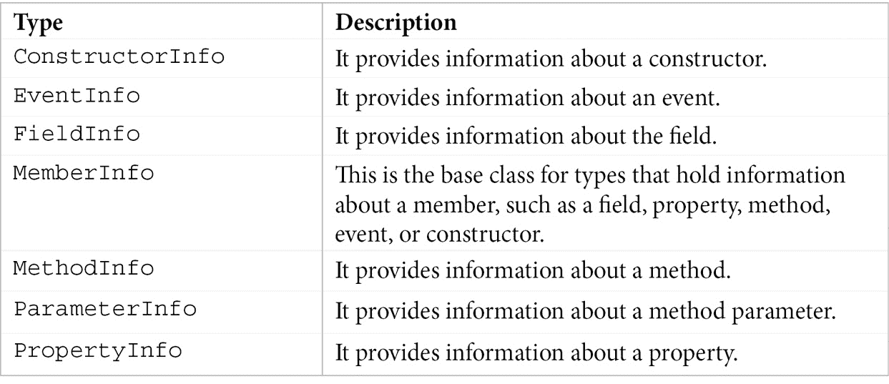
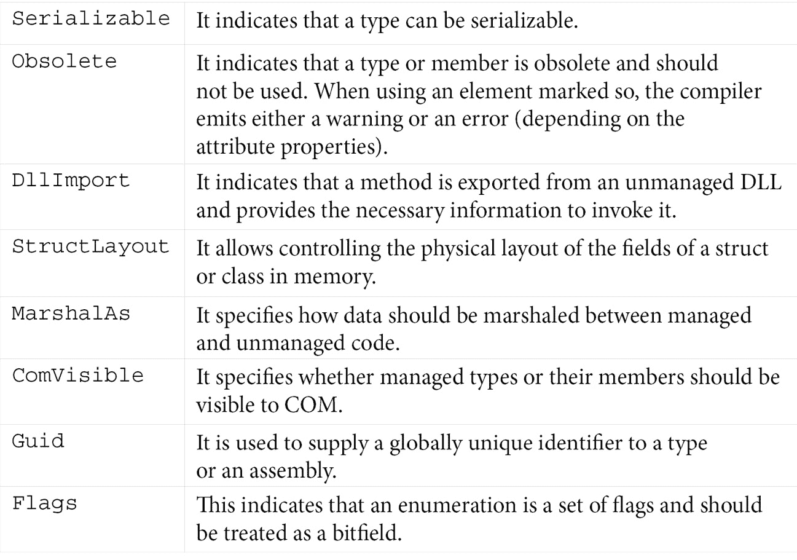

# *第十一章*:反射与动态规划

在前一章中，我们了解了函数式编程、lambda 表达式以及它们支持的特性，比如**语言集成查询(LINQ)**。 本章主要讨论反射服务和动态规划。 您将了解什么是反射，以及如何在运行时获取关于类型的信息，以及如何在程序集中存储代码和资源，以及如何在运行时动态加载这些以用于反射和代码执行。

这对于构建支持插件或插件形式的扩展的应用非常关键。 我们将看到什么是属性以及它们在反射中扮演什么角色。 另一个重要的话题,我们将在本章地址是动态规划和**动态语言运行时,支持动态语言运行在**公共语言运行时(CLR**)和动态特性添加到静态类型语言。**

 **本章讨论的主题如下:

*   了解反射
*   动态加载的程序集
*   理解后期绑定
*   使用**动态**类型
*   属性

在本章结束时，您将很好地理解反射、属性及其在反射中的使用，以及程序集加载和代码执行。 另一方面，您还将了解**动态**类型和能够与动态语言互操作。

# 理解反思

. net 中的部署单元是程序集。 程序集是一个文件(可执行文件或动态链接库)，其中包含**Microsoft intermediate Language****(MSIL)**代码，以及关于程序集内容和资源(可选)的元数据。 工具，如**ildasm.exe**(**IL Disassembler**)，在 Visual Studio 中发布; **ilspy.exe**(开源项目); 或其他选项允许您查看程序集的内容。 下面是**ildasm.exe**的截图，显示了**chapter_11_01.dll**程序集，可从本书的源代码中获得:


图 11.1 - chapter_11_01 程序集的反汇编源代码

**反射**是运行时类型发现和对它们进行更改的过程。 这意味着我们可以在运行时检索关于类型、它们的成员和属性的信息。 这带来了几个重要的好处:

*   在运行时(后期绑定)动态加载程序集、检查类型和执行代码的能力使构建可扩展应用变得容易。 应用可以通过接口和基类定义功能，然后在独立的模块(插件或外接程序)中实现或扩展这些模块，这些模块可以在运行时根据各种条件加载和执行。
*   我们稍后将在本章中看到属性，它使以声明的方式提供关于类型、方法、属性和其他方面的元信息成为可能。 通过能够在运行时读取这些属性，系统可以改变它们的行为。 例如，工具可以警告一个方法的使用与预期的不同(例如在过时的方法的情况下)，或者以特定的方式执行它们。 测试框架(我们将在最后一章看到一些)广泛地使用这种功能。
*   它提供了执行私有类型和成员或具有其他访问级别的成员的能力，否则这些类型和成员无法访问。 这对于测试框架来说非常方便。
*   它允许在运行时修改现有类型或创建全新的类型，并使用它们执行代码。

反射也有一些缺点:

*   它会带来可能降低性能的开销。 在运行时加载、发现和执行代码会更慢，可能会妨碍优化。
*   它公开类型的内部结构，因为它允许对所有类型和成员进行内省，而不管它们的访问级别如何。

. net 反射服务允许您使用**系统中的 api 进行发现。 反射**名称空间，您可以在前面提到的工具中看到相同的信息。 这个过程的关键是称为**System 的类型。 类型**，它包含公开类型的所有元数据的成员。 这是在**系统中其他类型的帮助下完成的。 反射**命名空间，其中一些列在下表中:



T1 系统中最重要的一些成员。 类型类如下表所示:


有几种检索**系统实例的方法。 键入**在运行时访问类型元数据; 这里有一些:

*   使用**系统的**GetType()**方法 对象**类型。 因为这是所有值和引用类型的基类，所以可以使用任何类型的实例调用:
*   使用**System 的**GetType()**静态方法。 类型**。 有许多重载允许指定名称和各种参数:

    ```cs
    var type = Type.GetType("Engine");
    ```

*   使用 C#**类型的**操作符:

    ```cs
    var type = typeof(Engine);
    ```

让我们通过一个实际的例子来看看我们如何使用反射。 我们将考虑以下**Engine**类型，它有几个属性、一个构造函数和几个改变引擎状态(启动或停止)的方法:

```cs
public enum EngineStatus { Stopped, Started }
public class Engine
{
    public string Name { get; }
    public int Capacity { get; }
    public double Power { get; }
    public EngineStatus Status { get; private set; }
    public Engine(string name, int capacity, double power)
    {
        Name = name;
        Capacity = capacity;
        Power = power;
        Status = EngineStatus.Stopped;
    }
    public void Start()
    {
        Status = EngineStatus.Started;
    }
    public void Stop()
    {
        Status = EngineStatus.Stopped;
    }
}
```

我们将构建一个小程序，在运行时读取**引擎**类型的元数据，并将以下内容打印到控制台:

*   *型*的名称
*   所有*属性*的名称以及它们的类型名称
*   所有*声明的方法*的名称(不包括继承的方法)
*   它们的*返回类型*
*   *各参数*的名称和类型

下面是在运行时读取和打印关于**引擎**类型元数据的程序:

```cs
static void Main(string[] args)
{
    var type = typeof(Engine);
    Console.WriteLine(type.Name);
    var properties = type.GetProperties();
    foreach(var p in properties)
    {
        Console.WriteLine($"{p.Name} ({p.PropertyType.Name})");
    }
    var methods = type.GetMethods(BindingFlags.Public |
                                  BindingFlags.Instance |
                                  BindingFlags.DeclaredOnly);
    foreach(var m in methods)
    {
        var parameters = string.Join(
            ',',
            m.GetParameters()
             .Select(p => $"{p.ParameterType.Name} {p.Name}"));
        Console.WriteLine(
          $"{m.ReturnType.Name} {m.Name} ({parameters})");
   }
}
```

在本例中，我们使用类型的操作符**来检索**系统的实例。 键入**Type 发现**引擎**类型的元数据。 为了检索属性，我们使用了不带参数的**GetProperties()**重载，它返回当前类型的所有公共属性。 然而，对于方法，我们使用了重载**GetMethod()**方法，它以一个由一个或多个**BindingFlags**值组成的位掩码作为参数。**

**BindingFlags**类型是一个 enum，带有控制绑定以及在反射期间执行类型和方法搜索方式的标志。 在我们的示例中，我们使用**Public**、**Instance**和**DeclareOnly**来指定只在该类型中声明的公共的非静态方法，并排除继承的方法。 这个程序的输出如下:

```cs
Engine
Name (String)
Capacity (Int32)
Power (Double)
Status (EngineStatus)
String get_Name ()
Int32 get_Capacity ()
Double get_Power ()
EngineStatus get_Status ()
Void Start ()
Void Stop ()
```

**引擎**类型位于执行反射代码的程序集中。 但是，您也可以反映来自其他程序集的类型，它们是从执行程序集引用的还是在运行时加载的，这是我们下一节将要讨论的内容。

# 动态加载程序集

反射服务允许您在运行时加载程序集。 这可以使用**system . reflect . assembly**类型来完成，该类型提供了加载组件的各种方法。

集合可以是*public*(也称为*shared*)或*private*。 一个共享程序集被几个应用使用，并且通常位于**全局程序集缓存(GAC)**下，这是一个程序集的系统存储库。 私有程序集旨在供单个应用使用，并存储在应用目录或其一个子目录中。 共享程序集必须被强命名并强制执行版本约束; 这些要求对于私有程序集不是必需的。

程序集可以在以下三种上下文中加载，也可以不加载:

*   *加载上下文,它包含组件从广汽,加载应用目录(**ApplicationBase**应用域),或其私有程序集的子目录(**PrivateBinPath**应用域)*
*   *load-from 上下文*，其中包含从程序集加载器所探测的上述路径以外的路径加载的程序集
*   仅用于反射的*上下文*，其中包含仅用于反射目的而加载的程序集，且不能用于执行代码
*   *没有上下文*，它是，用于某些特定的情况，例如从字节数组加载程序集

下表列出了用于加载程序集的最重要的方法:


我们将看几个动态加载程序集的例子。

在第一个示例中，我们使用**assembly . load()**从应用目录加载一个名为**engineelib**的程序集:

```cs
var assembly = Assembly.Load("EngineLib");
```

这里，我们只指定程序集的名称，但也可以指定显示名称，显示名称不仅由名称组成，还包括版本、区域性和用于对程序集签名的公钥令牌。 对于没有强名称的程序集，这是**null**。 下面这一行，我们在其中使用了显示名，相当于前面使用的那一行:

```cs
var assembly = Assembly.Load(@"EngineLib, Version=1.0.0.0, Culture=neutral, PublicKeyToken=null");
```

可以使用**AssemblyName**类以类型安全的方式创建显示名。 该类具有各种属性和方法，允许您构建显示名称。 可以这样做:

```cs
var assemblyName = new AssemblyName()
{
    Name = "EngineLib",
    Version = new Version(1,0,0,0),
    CultureInfo = null,
};
var assembly = Assembly.Load(assemblyName);
```

公共(或共享)程序集必须具有强名称。 这有助于惟一地标识程序集，因此避免可能的冲突。 使用公钥-私钥进行签名; 私钥用于签名，公钥与程序集一起分发，用于验证签名。

这样的密码对可以通过**sn.exe**工具生成，在 Visual Studio 中分发; 此工具也可用于验证签名。 对于强名称程序集，必须指定**PublicKeyToken**，否则加载将失败。 下面的例子展示了如何从 GAC 加载**WindowsBase.dll**:

```cs
var assembly = Assembly.Load(@"WindowsBase, Version=4.0.0.0, Culture=neutral, PublicKeyToken=31bf3856ad364e35");
```

使用程序集名称加载程序集的替代方法是使用它的实际路径。 但是，在这种情况下，您必须使用其中一个**LoadFrom()**重载。 这对于必须加载既不在 GAC 中也不在应用文件夹下的程序集的情况非常有用。 一个例子可以是一个可扩展系统，它可以加载可能安装在某些自定义目录中的插件:

```cs
var assembly = Assembly.LoadFrom(@"c:\learningC# 8\chapter_11_02\bin\Debug\netcoreapp2.1\EngineLib.dll");
```

**程序集**类具有成员，这些成员提供关于程序集本身的信息，以及关于它包含的类型的信息。 这里列出了一些最重要的成员:


在下面的示例中，在使用前面显示的方法之一加载程序集之后，我们列出了程序集名称、程序集清单中的文件以及引用的程序集的名称。 然后，我们搜索**engineelib。 键入引擎**并打印其所有属性的名称和类型:

```cs
if (assembly != null)
{
    Console.WriteLine(
$@"Name: {assembly.GetName().FullName}
Files: {string.Join(',', 
                    assembly.GetFiles().Select(
                        s=>Path.GetFileName(s.Name)))}
Refs:  {string.Join(',', 
                    assembly.GetReferencedAssemblies().Select(
                        n=>n.Name))}");
    var type = assembly.GetType("EngineLib.Engine");
    if (type != null)
    {
        var properties = type.GetProperties();
        foreach (var p in properties)
        {
            Console.WriteLine(
              $"{p.Name} ({p.PropertyType.Name})");
        }
    }
}
```

除了查询关于程序集及其内容的信息外，还可以在运行时从程序集执行代码。 这是我们将在下一节中讨论的内容。

# 理解延迟绑定

当您在编译时引用程序集时，编译器可以完全访问该程序集中可用的类型。 这被称为**早期结合**。 但是，如果程序集仅在运行时加载，则编译器无法访问该程序集的内容。 这称为**延迟绑定**，是构建可扩展应用的关键。 使用后期绑定，不仅可以加载和查询程序集，还可以执行代码。 我们将在下面的例子中看到这一点。

让我们想象一下，**发动机**类，即前面所示的，可以在中使用一个叫做**engineelib**的总成。 可以用**Assembly.Load()**或**Assembly.LoadFrom()**加载。 一旦加载完毕，我们可以使用**Assembly.GetType()**和**type**的类方法来获取关于**Engine**类型的信息。 然而，使用**Assembly.CreateInstance()**，我们可以实例化类的一个对象:

```cs
var assembly = Assembly.LoadFrom("EngineLib.dll");
if (assembly != null)
{
    var type = assembly.GetType("EngineLib.Engine");
    object engine = assembly.CreateInstance(
        "EngineLib.Engine",
        true,
        BindingFlags.CreateInstance,
        null,
        new object[] { "M270 Turbo", 1600, 75.0 },
        null,
        null);
    var pi = type.GetProperty("Status");
    if (pi != null)
        Console.WriteLine(pi.GetValue(engine));
    var mi = type.GetMethod("Start");
    if (mi != null)
        mi.Invoke(engine, null);
    if (pi != null)
        Console.WriteLine(pi.GetValue(engine));
}
```

**Assembly.CreateInstance()**方法有许多参数，但其中三个最重要:

*   第一个参数是**字符串 typeName**，表示程序集的名称。
*   第三个参数**BindingFlags bindingAttr**，表示绑定标志。
*   第五个参数，**对象【]****args**，表示一个包含用于调用构造函数的参数的数组; 对于默认构造函数，该对象可以为**null。 【5】**

在创建一个类型的实例之后，我们可以使用**PropertyInfo**、**MethodInfo**等实例来调用其成员。 例如,在前面的例子中,我们首先检索实例的**PropertyInfo 属性叫做【T6 状态】然后担保财产的价值通过调用 GetValue()和【显示】传递引擎对象。**

 **同样,我们使用**GetMethod()****的实例检索 MethodInfo**信息调用的方法**开始(),然后调用它通过调用**invoke()【显示】。 这个方法接受一个对象的引用和一个表示参数的对象数组; 因为**Start()**方法没有参数，所以这里使用**null**。****

**Assembly.CreateInstance()**方法有很多参数，使用起来很麻烦。 另外，**系统提供了在运行时创建类型实例的更简单的方法。 激活剂**类。 它有一个重载的**CreateInstance()**方法。 这实际上是由**Assembly.CreateInstance()**在幕后使用的。 在其最简单的形式中，它只接受**类型**和一个表示构造函数参数的对象数组，并实例化该类型的对象。 这里给出了一个例子:

```cs
object engine = Activator.CreateInstance(
    type,
    new object[] { "M270 Turbo", 1600, 75.0 });
```

**Activator.CreateInstance()**不是只是使用更简单，但在某些场景中可以提供好处。 例如，它可以使用 Remoting 在其他应用域或另一个服务器上创建对象。 另一方面，如果程序集尚未加载，**assembly . createinstance()**将不会尝试加载该程序集，而**System。 激活器**将加载程序集到当前应用域。

使用延迟绑定并以前面所示的方式调用代码并不实际。 实际上，在构建可扩展系统时，您可能会有一个或多个带有接口和常见类型的程序集，这些接口和常见类型是附加组件(或插件，取决于您希望如何调用它们)所依赖的。 您将先绑定到这些基本程序集，然后使用插件的后期绑定。

为了更好地理解这一点，我们将用下面的例子来演示它。 **EngineLibBase**是一个集合，定义了一个**IEngine**接口和**EngineStatus**枚举:

```cs
namespace EngineLibBase
{
    public enum EngineStatus { Stopped, Started }
    public interface IEngine
    {
        EngineStatus Status { get; }
        void Start();
        void Stop();
    }
}
```

该组件在**engineelib**组件中直接引用，该组件提供了实现**IEngine**接口的**Engine**类。 这在这里的例子中显示:

```cs
using EngineLibBase;
namespace EngineLib
{ 
    public class Engine : IEngine
    {
        public string Name { get; }
        public int Capacity { get; }
        public double Power { get; }
        public EngineStatus Status { get; private set; }
        public Engine(string name, int capacity, double power)
        {
            Name = name;
            Capacity = capacity;
            Power = power;
            Status = EngineStatus.Stopped;
        }
        public void Start()
        {
            Status = EngineStatus.Started;
        }
        public void Stop()
        {
            Status = EngineStatus.Stopped;
        }
    }
}
```

在我们的应用中，实例化了**Engine**类，我们再次引用**engineelibbase**组件，以便我们可以使用**IEngine**接口。 加载**EngineLib**后组装在运行时,我们实例化对象【显示】**引擎类的丢给**IEngine【病人】界面,这使得它可以在编译时访问接口的成员,即使实际的实例在运行时才知道。 这在这里的代码中显示:****

```cs
var assembly = Assembly.LoadFrom("EngineLib.dll");
if (assembly != null)
{
    var type = assembly.GetType("EngineLib.Engine");
    var engine = (IEngine)Activator.CreateInstance(
        type,
        new object[] { "M270 Turbo", 1600, 75.0 });
    Console.WriteLine(engine.Status);
    engine.Start();
    Console.WriteLine(engine.Status);
}
```

正如我们将在本章中进一步看到的，这并不是在运行时使用延迟绑定和动态执行代码的唯一方法。 另一种可能性是使用 DLR 和**动态**型。 我们将在下一节中讨论这个问题。

# 使用动态类型

在本书中，我们已经讨论了**CLR**. net 框架，然而，它包含了另一个组件，称为**动态语言运行时(DLR)**。 这是另一个运行时环境，它在 CLR 之上添加了一组服务，使动态语言能够在 CLR 上运行，并为静态类型语言添加动态特性。 C# 和 Visual Basic 都是静态类型语言。 相比之下，JavaScript、Python、Ruby、PHP、Smalltalk、Lua 等语言都是动态语言。 这些语言的关键特征是它们在运行时识别对象的类型，而不是像静态类型语言那样在编译时识别对象的类型。

DLR 为 C#(和 Visual Basic)提供了动态特性，使它们能够以一种简单的方式与动态语言互操作。 如前所述，DLR 向 CLR 添加了一组服务。 这些服务如下:

*   用**表达式树**表示语言语义。 这些是 LINQ 中使用的相同的表达式树，但扩展为包括控制流、赋值等。
*   **调用站点缓存**是一种服务，它缓存关于操作和对象的信息(例如对象的类型)，以便当同样的操作再次执行时，可以快速分派。
*   **动态对象互操作性**是一组 api，用于语言实实者建模动态对象及其操作。 这些类型包括:**IDynamicMetaObjectProvider**，**DynamicMetaObject**，**DynamicObject**，以及**ExpandoObject**。

DLR为 C# 4 中引入的**动态**类型提供了基础结构。 这是静态类型，这意味着此类型的变量在编译时被赋给**动态**类型。 但是，它们忽略了静态类型检查。 这意味着对象的实际类型只有在运行时才知道，编译器不能知道也不能强制对该类型对象执行的操作进行任何检查。 你可以调用任何带参数的方法编译器不会检查和抱怨; 但是，如果操作无效，将在运行时抛出异常。

下面的代码显示了**动态**类型变量的几个示例。 注意，**s**是一个字符串，**l**是**List<int>**。 调用**l.Add()**是一个有效的操作，因为**List<T>**包含这样一个方法。 但是，调用**s.s add()**是无效的，因为**string**类型没有这样的方法。 因此，此调用在运行时抛出一个**RuntimeBinderException**类型的异常:

```cs
dynamic i = 42;
dynamic s = "42";
dynamic d = 42.0;
dynamic l = new List<int> { 42 };
l.Add(43); // OK
try
{
   s.Add(44); /* RuntimeBinderException:
            'string' does not contain a definition for 'Add' */
}
catch (Exception ex)
{
    Console.WriteLine(ex.Message);
}
```

动态**类型使得使用在编译时对其类型一无所知的对象变得容易。 考虑上一段中的第一个例子，在这个例子中，我们使用反射加载了一个程序集，实例化了**Engine**类型的对象，并调用了它的方法和属性。 这个例子可以用更简单的方式重写，如下所示，使用**动态**类型:**

 **```cs
var assembly = Assembly.LoadFrom("EngineLib.dll");
if (assembly != null)
{
    var type = assembly.GetType("EngineLib.Engine");
    dynamic engine = Activator.CreateInstance(
        type,
        new object[] { "M270 Turbo", 1600, 75.0 });
    Console.WriteLine(engine.Status);
    engine.Start();
    Console.WriteLine(engine.Status);
}
```

在许多情况下，**动态**类型的对象的行为与**对象**类型类似(除了没有编译时检查)。 然而，物体价值的实际来源是不相关的。 它可以是.NET 对象、COM 对象、HTML DOM 对象、通过反射创建的对象，比如前面的示例，等等。

动态操作结果的类型也是**动态**，除了从**动态**到另一种类型的转换，以及包含**动态**类型参数的构造函数调用。 将执行从静态类型到**动态**以及反过来的隐式转换。 这在这里的代码块中显示:

```cs
dynamic d = "42";
string s = d;
```

对于静态类型，编译器执行重载解析以确定什么是函数调用的最佳匹配。 因为在编译时没有关于**动态**类型的信息，所以对于至少有一个**动态**类型参数的方法无法执行同样的操作。 相反，重载解析是在运行时执行的。

动态**类型通常用于在互操作程序集不可用时简化 COM 对象的使用。 下面是一个用一些虚拟数据创建 Excel 文档的示例:**

 **```cs
dynamic excel = Activator.CreateInstance(
    Type.GetTypeFromProgID("Excel.Application.16")); 
if (excel != null)
{
    excel.Visible = true;

    dynamic workBook = excel.Workbooks.Add();
    dynamic workSheet = excel.ActiveWorkbook.ActiveSheet;
    workSheet.Cells[1, 1] = "ID";
    workSheet.Cells[1, 2] = "Name";
    workSheet.Cells[2, 1] = "1";
    workSheet.Cells[2, 2] = "One";
    workSheet.Cells[3, 1] = "2";
    workSheet.Cells[3, 2] = "Two";
    workBook.SaveAs("d:\\demo.xls", 
        Excel.XlFileFormat.xlWorkbookNormal, 
        AccessMode : Excel.XlSaveAsAccessMode.xlExclusive);
    workBook.Close(true);
    excel.Quit();
}
```

这个代码的作用如下:

*   它检索**System。 类型**用于由程序标识符**Excel.Application 标识的 COM 对象。 16**，并创建它的实例。
*   它将 Excel 应用的**可见**属性设置为**true**，以便您可以看到窗口。
*   它创建一个工作簿并将一些数据添加到其活动工作表中。
*   它将文档保存在一个名为**demo.xls**的文件中。
*   它关闭工作簿并退出 Excel 应用。

在本章的最后一节中，我们将看看如何在反射服务中使用属性。

# 属性

属性提供关于程序集、类型和成员的元信息。 这些元信息被编译器、CLR 或使用反射服务来读取它们的工具使用。 属性实际上是派生自**系统的类型。 属性**抽象类。 . net 框架提供了大量的属性，但是用户可以定义自己的属性。

属性在方括号中指定，例如在**[SerializableAttribute]**中。 属性的命名约定是类型名称总是以单词**Attribute**作为后缀。 C# 语言提供了一个语法快捷方式，允许指定不带后缀的属性名称**属性**，例如**[Serializable]**。 然而，只有在根据该约定正确地添加了类型名称的后缀时，这才可能实现。

在下一节中，我们将首先研究一些广泛使用的系统属性。

## 系统属性

. net Framework 在不同的程序集和名称空间中提供了数百个属性。 列举它们不仅实际上是不可能的，而且也没有什么意义。 然而，下表列出了一些您将经常使用的属性; 其中一些我们已经在这本书中看到:



另一方面，创建自己的属性类通常是必要或有用的。 在下一节中，我们将研究用户定义的属性。

## 自定义属性

您可以创建属性来标记程序元素。 你要做的是从**系统中导出。 属性**，并遵循在类型后面加上单词**属性**的命名约定。 下面是一个名为**的属性 Description**，它包含一个名为的单一属性**Text**:

```cs
class DescriptionAttribute : Attribute
{
    public string Text { get; private set; }
    public DescriptionAttribute(string description)
    {
        Text = description;
    }
}
```

此属性可用于修饰任何程序元素。 在下面的例子中，我们可以看到这个属性用于类、属性和方法参数:

```cs
[Description("Main component of the car")]
class Engine
{
    public string Name { get; }
    [Description("cm³")]
    public int Capacity { get; }
    [Description("kW")]
    public double Power { get; }
    public Engine([Description("The name")] string name, 
                  [Description("The capacity")] int capacity, 
                  [Description("The power")] double power)
    {
        Name = name;
        Capacity = capacity;
        Power = power;
    }
}
```

属性可以有*位置*和*命名*参数:

*   位置形参由公共实例构造函数的实参定义。 每个构造函数的参数都定义了一组命名形参。
*   另一方面，每个可读写的非静态公共字段和属性都定义了一个命名参数。

下面的示例显示了前面引入的**Description**属性，经过修改后，可以使用名为**Required**的公共属性:

```cs
class DescriptionAttribute : Attribute
{
    public string Text { get; private set; }
    public bool Required { get; set; }
    public DescriptionAttribute(string description)
    {
        Text = description;
    }
}
```

此属性可以用作程序元素上的属性声明中的命名参数。 如下面的例子所示:

```cs
[Description("Main component of the car", Required = true)]
class Engine
{
}
```

让我们在下一节学习如何使用属性。

## 如何使用属性?

一个程序元素可以被标记为多个属性。 这可以用两种等价的方法来实现:

*   第一种方法(它是使用最广泛的方法，因为它的描述性和清晰性最强)是在一对方括号中分别声明每个属性。 下面的示例显示了如何实现此操作:

    ```cs
    [Serializable]
    [Description("Main component of the car")]
    [ComVisible(false)]
    class Engine
    {
    }
    ```

*   另一种方法是在同一对方括号中声明多个属性，用逗号分隔。 以下代码等价于前面的代码:

    ```cs
    [Serializable, 
     Description("Main component of the car"), 
     ComVisible(false)]
    class Engine
    {
    }
    ```

让我们看看如何在下一节中指定属性的目标。

## 属性目标

默认情况下，将属性应用于它前面的任何程序元素。 但是，也可以指定目标，比如类型、方法等等。 这是通过用另一个名为**AttributeUsage**的属性标记属性类型来实现的。 除了指定目标外，该属性还允许指定新定义的属性是否可以多次应用，以及是否可以继承。

以下**DescriptionAttribute**的修改版本表明它只能用于类、结构、方法、属性和字段。 此外，它指定该属性由派生类继承，并且可以在同一元素上多次使用:

```cs
[AttributeUsage(AttributeTargets.Class|
                AttributeTargets.Struct|
                AttributeTargets.Method|
                AttributeTargets.Property|
                AttributeTargets.Field,
                AllowMultiple = true,
                Inherited = true)]
class DescriptionAttribute : Attribute
{
    public string Text { get; private set; }
    public bool Required { get; set; }
    public DescriptionAttribute(string description)
    {
        Text = description;
    }
}
```

由于这些更改的结果，该属性不能再用于方法参数，如前面的示例所示。 这将导致编译器错误。

到目前为止，我们使用的属性针对的是程序元素，比如类型和方法。 但是程序集级别的属性也是可能的。 我们将在下一节中讨论这些内容。

## 汇编属性

有些属性可以针对程序集并指定有关程序集的信息。 此信息可以是程序集的标识(即名称、版本和区域性)、清单信息、强名称或其他。 这些属性是使用语法**[assembly: attribute]**指定的。 这些属性通常可以在为每个. net Framework 项目生成的**AssemblyInfo.cs**文件中找到。 下面是这些属性的一个例子:

```cs
[assembly: AssemblyTitle("project_name")]
[assembly: AssemblyDescription("")]
[assembly: AssemblyConfiguration("")]
[assembly: AssemblyCompany("")]
[assembly: AssemblyProduct("project_name")]
[assembly: AssemblyCopyright("Copyright © 2019")]
[assembly: AssemblyTrademark("")]
[assembly: AssemblyCulture("")]
[assembly: AssemblyVersion("1.0.0.0")]
[assembly: AssemblyFileVersion("1.0.0.0")]
```

属性用于反射服务。 现在我们已经了解了如何创建和使用属性，让我们看看如何在反射中使用它们。

## 反射中的属性

属性本身只有一点价值，除非有人对它们进行反思，并根据属性及其值的含义执行特定的操作。 **系统。 类型**类型以及其他类型来自**系统。 反射**名称空间有一个名为**GetCustomAttributes()**的重载方法，该方法检索特定程序元素标记的属性。 一个重载接受属性的类型，以便它只返回该类型的实例; 另一个则没有，并返回所有的属性。

以下示例检索所有的**描述的实例属性,首先从****发动机类型,然后从所有类型的属性,并显示描述文本在控制台:**

```cs
var e = new Engine("M270 Turbo", 1600, 75.0);
var type = e.GetType();
var attributes = type.GetCustomAttributes(typeof(DescriptionAttribute), 
                                          true);
if (attributes != null)
{
    foreach (DescriptionAttribute attr in attributes)
    {
        Console.WriteLine(attr.Text);
    }
}
var properties = type.GetProperties();
foreach (var property in properties)
{
    var pattributes = 
      property.GetCustomAttributes(
         typeof(DescriptionAttribute), false);
    if (attributes != null)
    {
        foreach (DescriptionAttribute attr in pattributes)
        {
            Console.WriteLine(
              $"{property.Name} [{attr.Text}]");
        }
    }
}
```

这个程序的输出如下:

```cs
Main component of the car
Capacity [cm3]
Power [kW]
```

# 总结

在本章中，我们了解了反射服务，如何在运行时加载程序集，以及查询关于类型的元信息。 我们还学习了如何一方面使用系统反射，另一方面使用 DLR 和**动态**类型来动态执行代码。 DLR 为 C# 提供了动态特性，并以一种简单的方式支持与动态语言的互操作性。 我们在本章讨论的最后一个主题是属性。 我们了解了常见的系统属性是什么，以及如何创建自己的类型，以及如何在反射中使用它们。

在下一章中，我们将关注并发性和并行性。

# 测试你所学的内容

1.  .NET 中的部署单元是什么?它包含哪些内容?
2.  反射是什么? 它有什么好处?
3.  什么.NET 类型公开关于类型的元数据? 如何创建这种类型的实例?
4.  公共集会和私人集会有什么区别?
5.  在.NET 框架中，在什么上下文中可以加载程序集?
6.  什么是早期绑定? 那么晚绑定呢? 后者提供了什么好处?
7.  什么是动态语言运行时?
8.  什么是动态类型，使用它的典型场景是什么?
9.  什么是属性，如何在代码中指定它们?
10.  如何创建用户定义的属性?********