# 第 13 章:文件、流和序列化

编程是关于处理可能来自不同来源的数据，例如本地内存、磁盘文件或来自网络上的远程服务器。 大多数数据必须持久化很长一段时间或无限期地持久化。 它必须在不同的应用重新启动之间可用，或者在多个应用之间共享。 无论存储的是纯文本文件还是各种类型的数据库，无论它们是本地的、来自网络的还是云端的，无论物理位置是硬盘驱动器、固态驱动器还是 u 盘，所有数据都保存在一个文件系统中。 不同的平台有不同类型的文件系统，但是它们都使用相同的抽象:路径、文件和目录。

在本章中，我们将了解. net 为处理文件系统提供的功能。 本章的主要内容如下:

*   **系统概述 IO**命名空间
*   使用路径
*   使用文件和目录
*   处理流
*   序列化和反序列化 XML
*   序列化和反序列化 JSON

到本章结束时，你将学会如何创建、修改和删除文件和目录。 您还将学习如何从具有不同类型数据(包括二进制和文本)的文件中读取和写入数据。 最后，您将学习如何将对象序列化为 XML 和 JSON。

让我们从探究**系统开始。 IO**命名空间。

# 系统概述。 IO 命名空间

. net 框架提供了类以及其他帮助类型，如枚举、接口和委托，这些帮助我们处理**文件系统对象**和**流**。 这些是在**系统下分组的。 在基类库中的 IO**命名空间。 完整的类型列表相当长，但下面的表格显示了这些类型中最重要的几类。

使用*文件系统对象*的最重要的类如下:

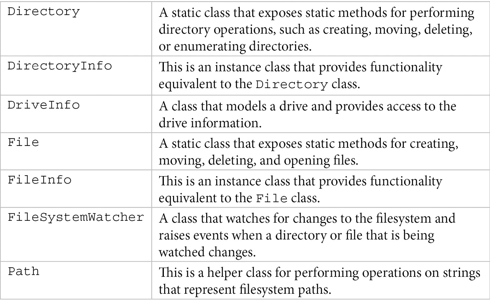

处理*流*最重要的类如下:


正如您在上一个表中看到的，这个列表中的具体类成对出现:一个 reader 和一个 writer。 典型地，这些被用为如下:

*   **BinaryReader**和**BinaryWriter**用于显式地将原始数据类型序列化或反序列化到二进制文件中。
*   **StreamReader**和**StreamWriter**用于处理文本文件中具有不同编码的基于字符的数据。
*   **StringReader**和**StringWriter**与前一对具有相似的接口和用途，尽管它们适用于字符串和字符串缓冲区，而不是流。

上表中类之间的关系如下简化类图所示:


图 13.1 -流类以及前面提到的读写类的类图

从这个图中，您可以看到只有**FileStream**和**MemoryStream**是真正的流类。 **BinaryReader**和**StreamReader**是从流读取数据的适配器，而**BinaryWriter**和**StreamWriter**将数据写入流。 所有这些类都需要一个流来创建实例(流作为参数传递给构造函数)。 另一方面，**StringReader**和**StringWriter**根本不能在流上工作; 相反，它们从字符串或字符串缓冲区进行读写。

大多数使用文件系统对象或流的操作在发生错误时抛出异常。 最重要的例外列在这里:


在本章接下来的章节中，我们将详细地研究其中的一些类。 现在，我们将从**Path**类开始。

# 使用路径

System.IO.Path 是一个静态类，它对字符串执行操作，表示文件系统对象(文件或目录)的路径。 没有任何类方法验证字符串是否表示有效文件或目录的路径。 但是，接受输入路径的成员会验证该路径是否格式良好; 否则，它们会抛出异常。 这个类可以处理不同平台的路径。 路径的格式(如是否存在根元素或路径分隔符)与平台相关，并由应用运行的平台决定。

路径可以是*相对*或*绝对*。 绝对路径是完全指定位置的路径。 另一方面，相对路径是由当前位置决定的部分位置，可以通过调用**Directory.GetCurrentDirector()**方法来检索该位置。

**Path**类的所有成员都是静态的。 最重要的列于下表:


要了解它是如何工作的，我们可以考虑下面的例子，其中我们使用了**Path**类的各种方法来打印关于**c:\Windows\System32\mmc.exe**路径的信息:

```cs
var path = @"c:\Windows\System32\mmc.exe";
Console.WriteLine(Path.HasExtension(path));
Console.WriteLine(Path.IsPathFullyQualified(path));
Console.WriteLine(Path.IsPathRooted(path));
Console.WriteLine(Path.GetPathRoot(path));
Console.WriteLine(Path.GetDirectoryName(path));
Console.WriteLine(Path.GetFileName(path));
Console.WriteLine(Path.GetFileNameWithoutExtension(path));
Console.WriteLine(Path.GetExtension(path));
Console.WriteLine(Path.ChangeExtension(path, ".dll"));
```

该程序的输出如下截图所示:

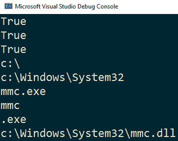

图 13.2 -执行前一个打印路径信息的示例的屏幕截图

**Path**类包含一个名为**Combine()**的方法，建议使用它将两个或多个路径组合成一个新路径。 该方法有四种重载; 这些重载采用两个、三个、四个路径或一组路径作为输入参数。 为了理解这是如何工作的，我们将看下面的例子，我们将连接两条路径:

```cs
var path1 = Path.Combine(@"c:\temp", @"sub\data.txt");
Console.WriteLine(path1); // c:\temp\sub\data.txt 
var path2 = Path.Combine(@"c:\temp\sub", @"..\", "log.txt");
Console.WriteLine(path2); // c:\temp\sub\..\log.txt
```

在第一个示例中,连接的结果是**c: \ temp \子\ data.txt**,妥善包括之间的路径分隔符**临时**和**子**,不存在于任何两个输入路径。 在第二个例子中，三个路径连接的结果是**c:\temp\sub\..\log.txt**。 注意，该路径是正确组合的，但没有解析为实际路径，即**c:\temp\log.txt**。

除了前面列出的方法外，在**Path**类中还有其他几个静态方法，其中一些用于处理临时文件。 这些都列在这里:


让我们来看一个使用临时路径的例子:

```cs
var temp = Path.GetTempPath();
var name = Path.GetRandomFileName();
var path1 = Path.Combine(temp, name);
Console.WriteLine(path1);
var path2 = Path.GetTempFileName();
Console.WriteLine(path2);
File.Delete(path2);
```

如下面截图所示，**路径 1**将包含**c:\用户\ marius \ appdata \本地\温度\w22fbbqw. y34**，尽管文件名称(包括扩展名)会随着每次执行而改变。 另外，此路径不是在磁盘上创建的，不像第二个示例，其中**c:\用户\ marius \ appdata \本地\ temp\ tmp8D5A.tmp**路径实际上代表一个新创建的文件:


图 13.3 -演示 GetRandomFileName()和 GetTempFileName()方法使用示例的屏幕截图

这两个临时路径之间有两个重要的区别:第一个使用加密性强的方法来生成名称，而第二个使用更简单的算法。 另一方面，**GetRandomFileName()**返回一个带有随机扩展名的名称，而**GetTempFileName()**总是返回一个文件名带有**. tmp**扩展名的路径。

要验证路径是否存在并执行创建、移动、删除或打开目录或文件等操作，必须使用**系统中的其他类。 IO**命名空间。 我们将在下一节中研究这些类。

# 使用文件和目录

**系统。** IO 命名空间包含两个类使用目录(**目录**和**DirectoryInfo**),和两个处理文件(**文件**和【显示】FileInfo)。 **目录**和【病人】文件**静态类**【t16.1】但包含基本相同**提供的功能实例类**——**DirectoryInfo**和**FileInfo**。

后两个派生自**FileSystemInfo**基抽象类，它提供了用于操作文件和目录的常见成员。 这些成员中最重要的是下表中列出的属性:


**DirectoryInfo**类中最重要的成员，不包括继承自基类的成员，这些成员在上表中列出:

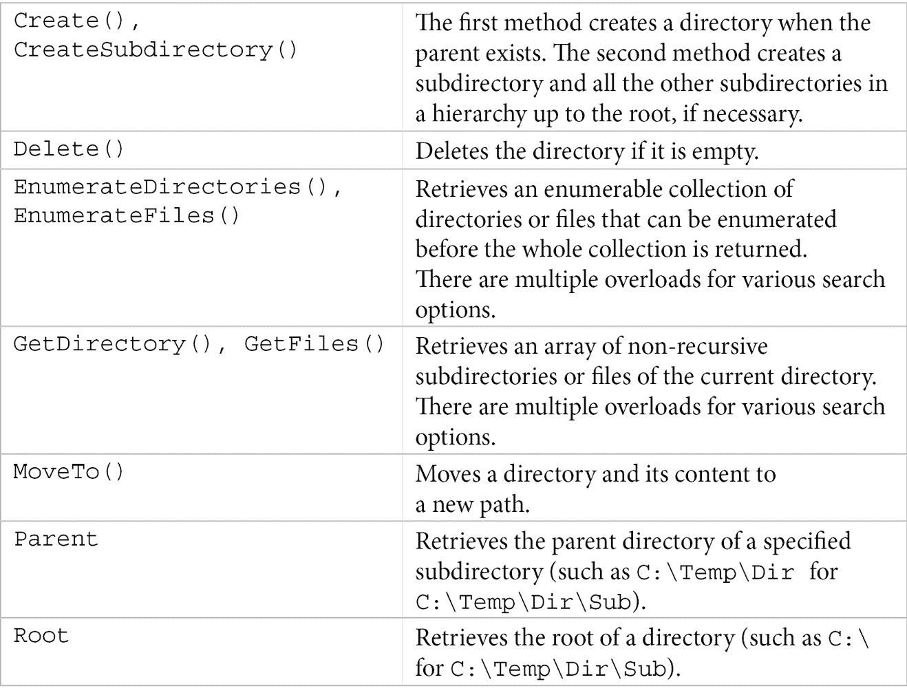

同样，**FileInfo**类中最重要的成员(不包括从基类继承的成员)如下:

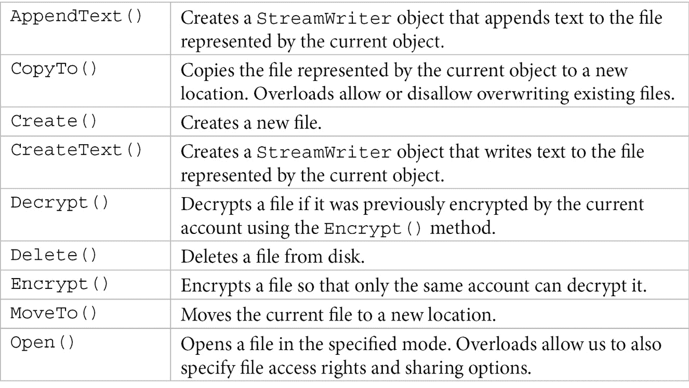


现在我们已经了解了用于处理文件系统对象及其最重要成员的类，让我们来看一些使用它们的例子。

在第一个示例中,我们将使用一个实例的**DirectoryInfo**打印信息目录(在本例中,**C:\Program Files (x86)\Microsoft sdk \ Windows \**),如姓名、家长,根、创建时间、和属性,以及其所有子目录的名称:

```cs
var dir = new DirectoryInfo(@"C:\Program Files (x86)\Microsoft SDKs\Windows\");
Console.WriteLine($"Full name : {dir.FullName}");
Console.WriteLine($"Name      : {dir.Name}");
Console.WriteLine($"Parent    : {dir.Parent}");
Console.WriteLine($"Root      : {dir.Root}");
Console.WriteLine($"Created   : {dir.CreationTime}");
Console.WriteLine($"Attribute : {dir.Attributes}");
foreach(var subdir in dir.EnumerateDirectories())
{
    Console.WriteLine(subdir.Name);
}
```

执行这段代码的输出如下(注意，在每台执行这段代码的机器上，输出结果是不同的):

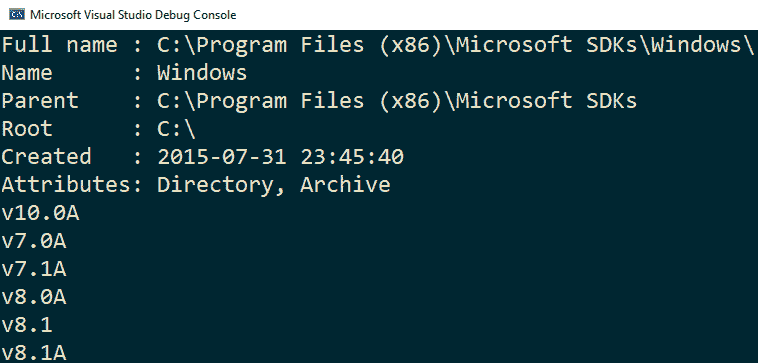

图 13.4 -显示目录信息的前一个示例的屏幕截图

**DirectoryInfo**还允许我们创建和删除目录，这就是我们在下一个例子中将要做的。 首先，我们创建**C:\Temp\Dir\Sub**目录。 其次，我们创建子目录层次结构，**sub1\sub2\sub3**，相对于前面的目录。 最后，我们从**C:\Temp\Dir\Sub\sub1\sub2**目录中删除最内部的目录**sub3**:

```cs
var dir = new DirectoryInfo(@"C:\Temp\Dir\Sub");
Console.WriteLine($"Exists: {dir.Exists}");
dir.Create();
var sub = dir.CreateSubdirectory(@"sub1\sub2\sub3");
Console.WriteLine(sub.FullName);
sub.Delete();
```

注意，**CreateSubdirectory()**方法返回一个**DirectoryInfo**实例，该实例表示所创建的最内部的子目录，在本例中为**C:\Temp\Dir\Sub\sub1\sub2\sub3**。 因此，在此实例上调用**Delete()**时，只删除**sub3**子目录。

我们可以使用**Directory**静态类及其**CreateDirectory()**和**Delete()**方法来编写相同的功能，如下所示:

```cs
var path = @"C:\Temp\Dir\Sub";
Console.WriteLine($"Exists: {Directory.Exists(path)}");
Directory.CreateDirectory(path);
var sub = Path.Combine(path, @"sub1\sub2\sub3");
Directory.CreateDirectory(sub);
Directory.Delete(sub);
Directory.Delete(path, true);
```

第一次调用**Delete()**将删除**C:\Temp\Dir\Sub\sub1\sub2\sub3**子目录，但仅当该子目录为空时。 第二个调用将以递归的方式删除**C:\Temp\Dir\Sub**子目录及其所有内容(文件和子目录)。

在下一个示例中,我们将列出所有的可执行文件开头字母 T**从一个给定的目录(在本例中,**C:\Program Files (x86)\Microsoft sdk \ Windows \ v10.0A \ bin \ NETFX 4.8 工具\**)。 为此，我们将使用**GetFiles()**方法提供适当的过滤器。 这个方法返回一个由**FileInfo**对象组成的数组，我们使用该类的不同属性打印文件的信息:**

 **```cs
var dir = new DirectoryInfo(@"C:\Program Files (x86)\Microsoft SDKs\Windows\v10.0A\bin\NETFX 4.8 Tools\");
foreach(var file in dir.GetFiles("t*.exe"))
{
    Console.WriteLine(
      $"{file.Name} [{file.Length}] 
    [{file.Attributes}]");}
```

执行此代码示例的输出可能如下所示:


图 13.5 -列出以字母 T 开头的可执行程序的屏幕截图

如前所述，为了打印关于文件的信息，我们使用了**FileInfo**类。 **名称**、**长度**和**属性**只是这个类提供的一些属性。 其他包括扩展名和文件时间。 下面的代码片段显示了使用它们的示例:

```cs
var file = new FileInfo(@"C:\Windows\explorer.exe");
Console.WriteLine($"Name: {file.Name}");
Console.WriteLine($"Extension: {file.Extension}");
Console.WriteLine($"Full name: {file.FullName}");
Console.WriteLine($"Length: {file.Length}");
Console.WriteLine($"Attributes: {file.Attributes}");
Console.WriteLine($"Creation: {file.CreationTime}");
Console.WriteLine($"Last access:{file.LastAccessTime}");
Console.WriteLine($"Last write: {file.LastWriteTime}");
```

尽管每台机器上的输出会有所不同，但它应该如下所示:

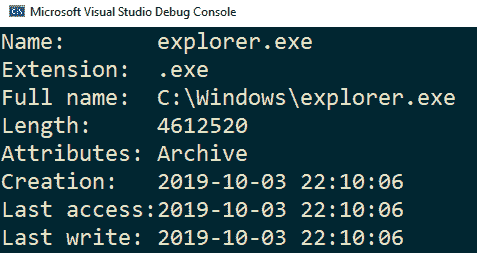

图 13.6 -在 FileInfo 类的帮助下显示的详细文件信息

我们可以使用到目前为止学到的内容来创建一个函数，该函数递归地将目录的内容写入控制台，同时，当它在目录层次结构中更深入地导航时，还可以缩进文件和目录的名称。 这样的函数可以如下所示:

```cs
void PrintContent(string path, string indent = null)
{
    try
    {
        foreach(var file in Directory.EnumerateFiles(path))
        {
            var fi = new FileInfo(file);
            Console.WriteLine($"{indent}{fi.Name}");
        }
       foreach(var dir in Directory.EnumerateDirectories(path))
        {
            var di = new DirectoryInfo(dir);
            Console.WriteLine($"{indent}[{di.Name}]");
            PrintContent(dir, indent + " ");
        }
    }
    catch(Exception ex)
    {
        Console.Error.WriteLine(ex.Message);
    }
}
```

当以项目目录的路径作为输入执行时，它将以下输出输出到控制台(以下截图是完整输出的片段):

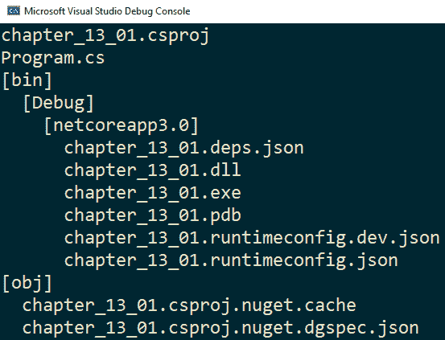

图 13.7 -程序的部分输出，递归地打印指定目录的内容

您可能已经注意到，我们同时使用了**GetFiles()**和**EnumerateFile()**，以及**EnumerateDirectories()**。 这两组方法，以**Get**为前缀的方法和以**Enumerate**为前缀的方法，在返回一个文件或目录集合的意义上是相似的。

然而,他们不同在一个关键在**方法返回一个对象数组,而**列举方法返回一个**IEnumerable【T6 T】>**,让客户开始迭代之前所有的文件系统对象检索和也仅仅消耗了他们想要的东西。 因此，在许多情况下，这些方法可能是更好的选择。****

 ****虽然我们确实创建和删除了目录，但是到目前为止的大多数示例都集中于获取文件和目录信息。 我们可以使用**File**和**FileInfo**类来创建和删除文件。 例如，我们可以使用**file . create()**来创建一个新文件或打开并覆盖一个现有文件，如下例所示:

```cs
using (var file = new StreamWriter(
   File.Create(@"C:\Temp\Dir\demo.txt")))
{
    file.Write("This is a demo");
}
```

**File.Create()返回一个****文件流,在本例中,用于创建一个**StreamWriter**让我们写文本****这是一个演示文件。 然后，流被释放，文件句柄被正确关闭。**

如果你有兴趣只有书面文本或二进制数据,您可以使用静态成员**文件的类,比如**WriteAllText()**,**WriteAllLines()**或**WriteAllBytes()**。 它们具有多个重载，例如，允许您指定文本编码。 也有异步对应，**WriteAllTextAsync()**，**WriteAllLinesAsync()**，和**WriteAllBytesAsync()**。 如果文件的当前内容已经存在，那么所有这些方法都会覆盖该文件的当前内容。 如果你有兴趣保护内容和附加结束,那么你可以使用**AppendAllText()**和【t16.1】AppendAllLines**()方法和异步同行,**AppendAllTextAsync()**和**AppendAllLinesAsync()**。

下面的示例展示了如何使用这里提到的一些方法向现有文件写入和追加文本:

```cs
var path = @"C:\Temp\Dir\demo.txt";
File.WriteAllText(path, "This is a demo");
File.AppendAllText(path, "1st line");
File.AppendAllLines(path, new string[]{ 
   "2nd line", "3rd line"});
```

第一个调用，**WriteAllText()**，将写入**这是一个演示**到文件中，覆盖任何内容。 第二个调用，**AppendAllText()**，将附加**第一行**，而不添加任何新行。 第三个调用，**AppendAllLines()**，将每个字符串写入文件，在每个字符串之后添加一个新行。 因此，执行此代码后，文件的内容将如下所示:

```cs
This is a demo1st line2nd line
3rd line
```

与将内容写入文件类似，也可以使用**file**类及其**ReadAllText()**、**ReadAllLines()**和**ReadAllBytes()**方法进行读取。 与写方法一样，也有异步版本，**ReadAllTextAsync()**，**ReadAllLinesAsync()**，和**ReadAllBytesAsync()**。 下面的代码中显示了使用其中一些方法的示例:

```cs
var path = @"C:\Temp\Dir\demo.txt";
string text = File.ReadAllText(path);
string[] lines = File.ReadAllLines(path);
```

在执行此代码之后，**文本**变量将包含从文件中读取的整个文本。 另一方面，**行**将是一个包含两个元素的数组，第一行是**，这是一个演示第一行**，第二行是**第三行**。

纯文本不是我们通常写入文件的唯一类型的数据，文件也不是数据的唯一存储系统。 有时，我们可能对从管道、网络、本地内存或其他方面进行读写感兴趣。 为了处理所有这些，. net 提供了*流*，这是下一节的主题。

# 与流一起工作

**流**是字节的序列,可以在本地存储在内存中,在一个文件中,管道,远程网络,或其他可能的来源.NET 抽象这一概念和一个叫**的类流**,它提供了支持读取或写入一个流。 另一方面，这些流在概念上分为三类:

*   **后备存储器**:这些是流，表示字节序列的源或目的。 它们是输入或输出数据(如文件或网络)的端点。 后备存储流以字节级别工作，. net 提供了诸如**FileStream**、**MemoryStream**和**NetworkStream**等类来实现后备存储。
*   **Decorators**:这些是流，用于从另一个流读取或写入数据，并以某种方式对其进行转换。 与备份存储一样，它们也使用字节。 . net 提供了诸如**BufferedStream**，**CryptoStream**，**DeflateStream**和**GZipStream**的 decorator 流。
*   **适配器**:它们实际上不是流，而是帮助我们在比字节更高级别上处理数据源的包装器。 它们允许我们读/写基本类型(**bool**、**int**、**double**等)、文本、XML 数据等等。 适配器提供的.NET 包括**主题**和**BinaryWriter【病人】,**StreamReader**和**StreamWriter【t16.1】,【XmlReader T17】**和**XmlWriter**。**

下图从概念上展示了流架构:


图 13.8 -流架构的概念图

讨论前面图中所示的所有流类超出了本书的范围。 然而,在这一节中,我们将关注**主题**/**BinaryWriter**和**StreamReader**/**【显示】StreamWriter 适配器,以及**和**FileStream MemoryStream【病人】支持存储流。******

 **## 流类概述

如前所述，所有流类的基类是**System.IO.Stream**类。 这是一个抽象类，它提供了从流读取和写入流的方法和属性。 其中许多是抽象的，在派生类中实现。 以下是类中最重要的方法:


所列出的一些操作具有异步伙伴，它们以单词**Async**作为后缀(例如**ReadAsync()**或**WriteAsync()**)。 读和写操作使指针向前移动，该指针指示当前流中具有读或写字节数的位置。

**流**类还提供了几个有用的属性，如下表所示:


表示文件的后备存储流的类称为**FileStream**。 这个类派生自抽象的**Stream**类，并实现了抽象成员。 它支持同步和异步操作，不仅可以用于打开、读、写和关闭磁盘文件，还可以用于其他操作系统对象，如管道和标准输入输出。 异步方法对于执行耗时的操作而不阻塞主线程非常有用。

**FileStream**类支持对文件的随机访问。 **Seek()**方法允许我们移动当前指针的位置，以便在流中读写。 更改位置时，必须指定字节偏移量和查找原点。 字节偏移量是相对于查找原点的，查找原点可以是流的开始、当前位置或流的结束。

类提供了许多构造函数来创建类的实例。 你可以提供一个文件句柄(无论是作为一个**IntPtr**或**SafeFileHandle)或文件路径,以及一个文件模式(这决定了应该如何打开文件),文件访问(这决定了应该如何访问文件,阅读,写作,或者两者兼而有之), 和文件共享(这决定了其他文件流如何访问相同的文件)以不同的组合。 在这里列出所有这些构造函数是不切实际的，但是在本章中我们将看到几个例子。**

 **表示内存后备存储器的类称为**MemoryStream**，也派生自**Stream**。 这个类的大多数成员都是基类的抽象成员的实现。 然而，该类具有几个构造函数，它们允许我们从字节数组中创建**可调整大小的流**(初始为空或具有指定的容量)或**不可调整大小的流**。 从字节数组创建的内存流不能扩展或收缩，可以是可写或只读的。

## 处理文件流

**FileStream**类允许我们从/向文件读写一个字节序列。 它使用原始数据，如**字节[]**，**Span<字节>**，或**内存<字节>**。 我们可以使用**File**类的静态方法或**FileInfo**类的非静态方法来获取**FileStream**对象:


我们可以使用下面的示例来了解这是如何工作的，在这个示例中，我们将四个字节写入位于**C:\Temp\data 的文件。 raw**，然后读取文件的全部内容，并将其打印到控制台:

```cs
var path = @"C:\Temp\data.raw";
var data = new byte[] { 0xBA, 0xAD, 0xF0, 0x0D};
using(FileStream wr = File.Create(path))
{
    wr.Write(data, 0, data.Length);
}
using(FileStream rd = File.OpenRead(path))
{
    var buffer = new byte[rd.Length];
    rd.Read(buffer, 0, buffer.Length);
    Console.WriteLine(
       string.Join(" ", buffer.Select(
                   e => $"{e:X02}")));
}
```

在第一部分中，我们使用**file . create()**来打开一个文件以便写入。 如果文件不存在，则创建该文件。 如果文件存在，则其内容将被覆盖。 方法**FileStream.Write()**用于将字节数组的内容写入文件。 当在**结束时使用**语句处理**FileStream**对象时，流将被刷新到文件，并且文件句柄将被关闭。

在第二部分中，我们使用**file . openread()**来打开先前写入的文件，但这次是用来读取的。 我们分配一个足够大的数组来接收文件的全部内容，并使用**FileStream.Read()**来读取其内容。 这段代码的输出如下:


图 13.9 -创建的二进制文件的内容显示在控制台

处理原始数据可能很麻烦。 出于这个原因，. net 提供了允许我们处理更高级别数据的流适配器。 第一对适配器是**BinaryReader**和**BinaryWriter**，它们支持以二进制格式读写基本类型和字符串。 下面是使用这两种方法的例子:

```cs
var path = @"C:\Temp\data.bin";
using (var wr = new BinaryWriter(File.Create(path)))
{
    wr.Write(true);
    wr.Write('x');
    wr.Write(42);
    wr.Write(19.99);
    wr.Write(49.99M);
    wr.Write("text");
}
using(var rd = new BinaryReader(File.OpenRead(path)))
{
    Console.WriteLine(rd.ReadBoolean()); // True
    Console.WriteLine(rd.ReadChar());    // x
    Console.WriteLine(rd.ReadInt32());   // 42
    Console.WriteLine(rd.ReadDouble());  // 19.99
    Console.WriteLine(rd.ReadDecimal()); // 49.99
    Console.WriteLine(rd.ReadString());  // text
} 
```

首先使用**file . create()**打开一个文件，该文件返回**FileStream**。 这个流被用作**BinaryWriter**流适配器的构造函数的参数。 **写()方法重载的原始类型(【显示】char**,**bool**,【病人】sbyte,**字节**,【t16.1】,**ushort**,**int**,**使用 uint**,**,**ulong**,**,**双**,和**小数), 以及**byte[]**，**char[]**和**string**。******** 

**其次，我们重新打开相同的文件，但是使用**file . openread()**进行读取。 此方法返回的**FileStream**对象被用作**BinaryReader**流适配器的构造函数的参数。 这类有一组阅读方法,对于每一个原始类型,如**ReadBoolean()【显示】,**ReadChar()**,**ReadInt16()【病人】,**ReadInt32()**,**ReadDouble()【t16.1】和**ReadDecimal()**,以及阅读方法**byte[]**——**ReadBytes()**, a**char[]**-**ReadChars()**，and strings-R**readstring()**。 您可以在前面的示例中看到其中的一些方法。********

默认情况下，**BinaryReader**和**BinaryWriter**处理字符串使用*UTF-8 编码*。 然而，它们都有重载的构造函数，允许我们使用**System.Text.Encoding**类指定另一种编码。

虽然这两个适配器可以用于处理字符串，但使用它们来读写文本文件可能很麻烦，因为缺少对行处理等特性的支持。 要处理文本文件，应该使用**StreamReader**和**StreamWriter**适配器。 默认情况下，它们以 UTF-8 编码的方式处理文本，但是它们的构造函数允许我们指定不同的编码。 在下面的例子中，我们将文本写入一个文件，然后将其读回并打印到控制台:

```cs
var path = @"C:\Temp\data.txt";
using(StreamWriter wr = File.CreateText(path))
{
    wr.WriteLine("1st line");
    wr.WriteLine("2nd line");
}
using(StreamReader rd = File.OpenText(path))
{
    while(!rd.EndOfStream)
        Console.WriteLine(rd.ReadLine());
}
```

**file . createtext()**方法打开一个文件进行写入(创建或覆盖它)，并返回一个使用 UTF-8 编码的**StreamWriter**类的实例。 方法将一个字符串写入文件，然后添加一个新行。 有重载版本**WriteLine()**还超载【显示】写()方法,可以编写一个**char**,【病人】char[],或**字符串没有添加一个新行。**

在第二部分中，我们使用**file . opentext()**方法打开之前写入的文本文件进行读取。 这将返回一个读取 UTF-8 文本的**StreamReader**对象。 **ReadLine()**方法用于在循环中逐行读取内容，直到流结束。 **EndOfStream**属性用于检查当前流的位置是否达到流的末端。

不使用**file . opentext()**方法，我们可以使用**file . open()**，它允许我们指定打开模式、文件访问和共享。 我们可以将前面的阅读部分重写如下:

```cs
using(var rd = new StreamReader(
  File.Open(path, FileMode.Open,
         FileAccess.Read, 
         FileShare.Read)))
{
    while (!rd.EndOfStream)
        Console.WriteLine(rd.ReadLine());
}
```

有时，我们需要一个流来处理临时数据。 使用文件可能很麻烦，还会给 I/O 操作增加不必要的开销。 对于这个目的，内存流是最合适的。

## 处理内存流

一个**内存流**是本地内存的后备存储器。 当我们需要临时存储来转换数据时，这样的流对于操作很有用。 示例包括 XML 序列化或数据压缩和解压缩。 我们将在接下来的代码中研究这两个操作。

以下代码中显示的静态**序列化器<T>**类包含两个方法:**Serialize()**和**反序列化()**。 前者接受一个**T**对象，使用**XmlSerializer**生成该对象的 XML 表示，并以字符串的形式返回 XML 数据。 后者接受一个包含 XML 数据的字符串，并使用**XmlSerializer**读取该字符串，并从中创建一个类型为**T**的新对象。 代码如下:

```cs
public static class Serializer<T>
{
    static readonly XmlSerializer _serializer =
       new XmlSerializer(typeof(T));
    static readonly Encoding _encoding = Encoding.UTF8;
    public static string Serialize(T value)
    {
        using (var ms = new MemoryStream())
        {
            _serializer.Serialize(ms, value);
            return _encoding.GetString(ms.ToArray());
        }
    }
    public static T Deserialize(string value)
    {
        using (var ms = new MemoryStream(
           _encoding.GetBytes(value)))
        {
            return (T)_serializer.Deserialize(ms);
        }
    }
}
```

在**Serialize()**方法中创建的内存流是可以调整大小的。 它最初是空的，然后根据需要增长。 然而，在**Deserialize()**方法中创建的变量是不可调整大小的，因为它是从一个字节数组初始化的。 此流用于只读目的。

**MemoryStream**类实现了**可消除**接口，因为它源于**Stream**，而**可消除**。 然而，**MemoryStream**没有要处理的资源，因此，**dispose()**方法什么也不做。 显式地调用它对流没有影响。 因此，没有必要使用语句将内存流变量封装到**中，就像我们在前面的示例中所做的那样。**

让我们考虑一下**Employee**类的以下实现:

```cs
public class Employee
{
    public int EmployeeId { get; set; }
    public string FirstName { get; set; }
    public string LastName { get; set; }
    public override string ToString() => 
        $"[{EmployeeId}] {LastName}, {FirstName}";
}
```

我们可以像下面这样序列化和反序列化该类的实例:

```cs
var employee = new Employee
{
    EmployeeId = 42,
    FirstName = "John",
    LastName = "Doe"
};
var text = Serializer<Employee>.Serialize(employee);
var result = Serializer<Employee>.Deserialize(text);
Console.WriteLine(employee);
Console.WriteLine(text);
Console.WriteLine(result);
```

执行此代码的结果如下截图所示:


图 13.10 -一个 xml 序列化的 Employee 对象显示在控制台

我们提到的另一个方便使用内存流的例子是数据的*压缩和解压缩。 **System.IO.Compression**命名空间中的**GZipStream**类是一个流装饰器，它支持使用 GZip 数据格式规范对流进行压缩和解压缩。 一个**MemoryStream**对象被用作**GZipStream**装饰器的后备存储器。 这里显示的静态**Compression**类提供了两个压缩和解压缩字节数组的方法:*

```cs
public static class Compression
{
    public static byte[] Compress(byte[] data)
    {
        if (data == null) return null;
        if (data.Length == 0) return new byte[] { };
        using var ms = new MemoryStream();
        using var gzips =
           new GZipStream(ms,
        CompressionMode.Compress);
        gzips.Write(data, 0, data.Length);
        gzips.Close();
        return ms.ToArray();
    }
    public static byte[] Decompress(byte[] data)
    {
        if (data == null) return null;
        if (data.Length == 0) return new byte[] { };

        using var source = new MemoryStream(data);
        using var gzips =
           new GZipStream(source,
        CompressionMode.Decompress);
        using var target = new MemoryStream(data.Length * 2);
        gzips.CopyTo(target);
        return target.ToArray();
    }
}
```

我们可以使用这个助手类将字符串压缩为字节数组，然后再将其解压缩为字符串。 下面的代码显示了这样一个示例:

```cs
var text = "Lorem ipsum dolor sit amet, consectetur adipiscing elit, sed do eiusmod tempor incididunt ut labore et dolore magna aliqua.";
var data = Encoding.UTF8.GetBytes(text);
var compressed = Compression.Compress(data);
var decompressed = Compression.Decompress(compressed);
var result = Encoding.UTF8.GetString(decompressed);
Console.WriteLine($"Text size: {text.Length}");
Console.WriteLine($"Compressed: {compressed.Length}");
Console.WriteLine($"Decompressed: {decompressed.Length}");
Console.WriteLine(result);
if (text == result)
    Console.WriteLine("Decompression successful!");
```

执行这个示例代码的输出如下截图所示:


图 13.11 -压缩和解压缩文本结果的屏幕截图

在本节中，我们看到了如何简单地序列化和反序列化 XML。 我们将在下一节中详细讨论这个主题。

# 序列化和反序列化 XML

在上一节中，我们已经看到了如何使用**System.Xml.Serialization**名称空间中的**XmlSerializer**类来序列化和反序列化数据。 这个类对于将对象序列化为 XML 和将 XML 反序列化为对象非常方便。 虽然在前面的示例中，我们使用内存流来序列化，但实际上它可以与任何流一起工作; 此外，它还可以与**TextWriter**和**XmlWriter**适配器一起工作。

下面的示例显示了修改后的**序列化器<T>**类，我们指定了要写入或从其中读取 XML 文档的文件路径:

```cs
public static class Serializer<T>
{
    static readonly XmlSerializer _serializer = 
        new XmlSerializer(typeof(T));
    public static void Serialize(T value, string path)
    {
        using var ms = File.CreateText(path);
        _serializer.Serialize(ms, value);
    }
    public static T Deserialize(string path)
    {
        using var ms = File.OpenText(path);
        return (T)_serializer.Deserialize(ms);
    }
}
```

我们可以使用这个新的实现如下:

```cs
var employee = new Employee
{
    EmployeeId = 42,
    FirstName = "John",
    LastName = "Doe"
};
var path = Path.Combine(Path.GetTempPath(), "employee1.xml");
Serializer<Employee>.Serialize(employee, path);
var result = Serializer<Employee>.Deserialize(path);
```

使用此代码进行 XML 序列化的结果是一个包含以下内容的文档:

```cs
<?xml version="1.0" encoding="utf-8"?>
<Employee xmlns:xsi="http://www.w3.org/2001/XMLSchema-instance" xmlns:xsd="http://www.w3.org/2001/XMLSchema">
  <EmployeeId>42</EmployeeId>
  <FirstName>John</FirstName>
  <LastName>Doe</LastName>
</Employee>
```

**XmlSerializer**通过将一个类型的所有公共属性和字段序列化为 XML 来工作。 它使用一些默认设置，比如类型变成节点，属性和字段变成元素。 类型、属性或字段的名称成为节点或元素的名称以及字段或属性的值及其文本。 它还添加了默认名称空间(您可以在前面的代码中看到)。 但是，可以使用类型和成员上的属性来控制执行序列化的方式。 下面的代码显示了这样一个示例:

```cs
[XmlType("employee")]
public class Employee
{
    [XmlAttribute("id")]
    public int EmployeeId { get; set; }
    [XmlElement(ElementName = "firstName")]
    public string FirstName { get; set; }
    [XmlElement(ElementName = "lastName")]
    public string LastName { get; set; }
    public override string ToString() => 
        $"[{EmployeeId}] {LastName}, {FirstName}";
}
```

序列化这个**Employee**类实现的一个实例将生成一个如下所示的 XML 文档:

```cs
<?xml version="1.0" encoding="utf-8"?>
<employee xmlns:xsi="http://www.w3.org/2001/XMLSchema-instance" xmlns:xsd="http://www.w3.org/2001/XMLSchema" id="42">
  <firstName>John</firstName>
  <lastName>Doe</lastName>
</employee>
```

我们在这里使用了几个属性:**XmlType**、**XmlAttribute**和**XmlElement**，但是这个列表很长。 下表列出了最重要的 XML 属性及其作用。 这些属性在**System.Xml.Serialization**命名空间中可用:


**XmlSerializer**类的工作方式是，在运行时，每当应用运行时，它在临时序列化程序集中为每种类型生成序列化代码。 在某些情况下，这可能是一个性能问题，可以通过预先生成这些程序集来避免。 可以使用**XML 序列化生成器****工具**(**Sgen.exe**)来生成这些程序集。 如果包含序列化代码的程序集被称为**MyAssembly.dll**，则生成的序列化程序集将被称为**MyAssembly.XmlSerializer.dll**。 该工具作为 Windows SDK 的一部分部署。

您还可以使用**XML 模式定义工具**(**XSD .exe**)从类或从现有 XML 模式生成类生成 XML 模式(XSD 文档)。 该工具是作为 Windows SDK 的一部分或与 Visual Studio 一起发布的。

**XmlSerializer**可能存在的一个问题是，它将单个. net 对象序列化为 XML 文档(当然，对象可能很复杂，并包含其他对象和对象数组)。 如果有两个要写入同一文档的单独对象，则无法正常工作。 让我们想象我们还有以下类，代表公司中的一个部门:

```cs
public class Department
{
    [XmlAttribute]
    public int Id { get; set; }

    public string Name { get; set; }
}
```

我们可能想要编写一个包含一个雇员和一个部门的 XML 文档。 使用**XmlSerializer**将不能正常工作。 这在下面的示例中显示:

```cs
public static class Serializer<T>
{
    static readonly XmlSerializer _serializer = 
        new XmlSerializer(typeof(T));
    public static void Serialize(T value, StreamWriter stream)
    {
        _serializer.Serialize(stream, value);
    }
    public static T Deserialize(StreamReader stream)
    {
        return (T)_serializer.Deserialize(stream);
    }
}
```

我们可以尝试使用以下代码将员工和部门序列化到同一个 XML 文档:

```cs
var employee = new Employee
{
    EmployeeId = 42,
    FirstName = "John",
    LastName = "Doe"
};
var department = new Department
{
    Id = 102, 
    Name = "IT"
};
var path = Path.Combine(Path.GetTempPath(), "employee.xml");
using (var wr = File.CreateText(path))
{
    Serializer<Employee>.Serialize(employee, wr);
    wr.WriteLine();
    Serializer<Department>.Serialize(department, wr);
}
```

生成到磁盘文件的 XML 文档将包含以下代码所示的内容。 这个不是有效的 XML，因为它有多个文档声明，而没有一个根元素:

```cs
<?xml version="1.0" encoding="utf-8"?>
<employee xmlns:xsi="http://www.w3.org/2001/XMLSchema-instance" xmlns:xsd="http://www.w3.org/2001/XMLSchema" id="42">
   <firstName>John</firstName>
   <lastName>Doe</lastName>
</employee>
<?xml version="1.0" encoding="utf-8"?>
<Department xmlns:xsi="http://www.w3.org/2001/XMLSchema-instance" xmlns:xsd="http://www.w3.org/2001/XMLSchema" Id="102">
   <Name>IT</Name>
</Department>
```

要使它工作，我们必须创建一个包含雇员和部门的附加类型，并且我们必须序列化该类型的一个实例。 这个额外的对象将被序列化为 XML 文档的根元素。 我们将用下面的例子来演示这一点(注意，这里有一个额外的属性，名为**Version**):

```cs
public class Data
{
    [XmlAttribute]
    public int Version { get; set; }
    public Employee Employee { get; set; }
    public Department Department { get; set; }
}
var data = new Data()
{
    Version = 1,
    Employee = new Employee {
        EmployeeId = 42,
        FirstName = "John",
        LastName = "Doe"
    },
    Department = new Department {
        Id = 102,
        Name = "IT"
    }
};
var path = Path.Combine(Path.GetTempPath(), "employee.xml");
using (var wr = File.CreateText(path))
{
    Serializer<Data>.Serialize(data, wr);
}
```

这一次，输出是一个结构良好的 XML文档，如下代码所示:

```cs
<?xml version="1.0" encoding="utf-8"?>
<Data xmlns:xsi="http://www.w3.org/2001/XMLSchema-instance" xmlns:xsd="http://www.w3.org/2001/XMLSchema" Version="1">
  <Employee id="42">
    <firstName>John</firstName>
    <lastName>Doe</lastName>
  </Employee>
  <Department Id="102">
    <Name>IT</Name>
  </Department>
</Data>
```

允许进一步控制读写 XML, . net 基类库包含两个类称为 XmlReader**和**XmlWriter**提供一种快速、缓存、单向方式读取或生成 XML 的数据或文件或流。**

 ****XmlWriter**类可以用于将 XML 数据写入流、文件、文本阅读器或字符串。 它提供如下功能:

*   验证字符和 XML 名称
*   验证 XML 文档的格式是否良好
*   支持 CLR 类型，因此您不需要手动将所有内容转换为字符串
*   用于写入 XML 文档的二进制数据的 Base64 和 base 十六进制编码

XmlWriter 类包含许多方法; 下表列出了其中一些方法。 虽然这个列表只包括同步方法，但是它们都有异步的伙伴，比如**WriteElementStringAsync()**对于**WriteElementString()**:

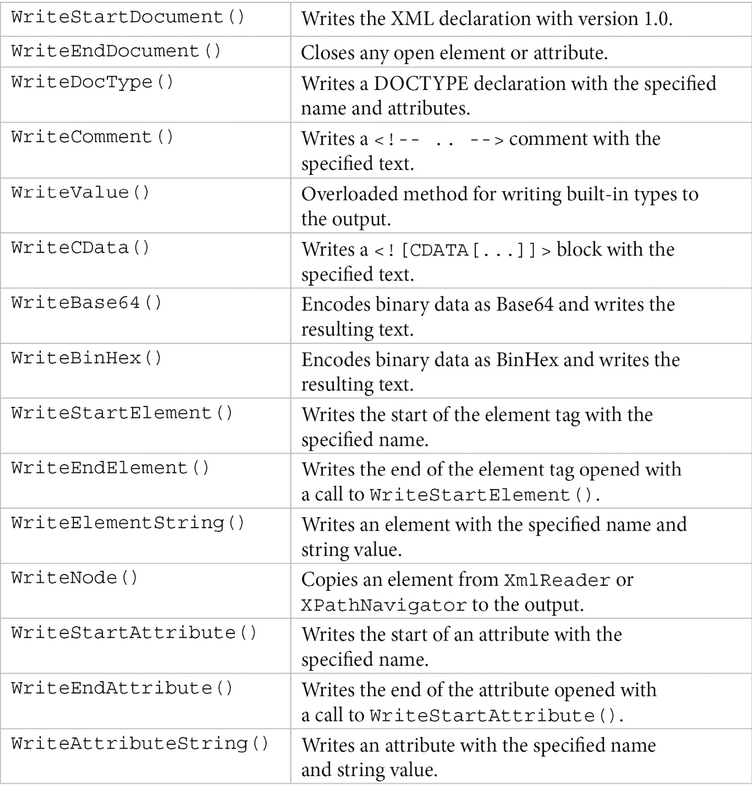

在使用**XmlWriter**时，可以指定各种设置，如编码、缩进、属性应该如何写入(在新行或同一行上)、省略 XML 声明等。 这些设置是通过使用**XmlWriterSettings**类的实例来控制的。

下面的清单显示了使用**XmlWriter**创建一个 XML 文档的示例，该文档包含一个雇员和一个部门，作为名为**Data**的根元素的一部分。 实际上，结果与前面的示例相同，只是没有创建名称空间:

```cs
var employee = new Employee
{
    EmployeeId = 42,
    FirstName = "John",
    LastName = "Doe"
};
var department = new Department
{
    Id = 102,
    Name = "IT"
};
var path = Path.Combine(Path.GetTempPath(), "employee.xml");
var settings = new XmlWriterSettings 
{ 
    Encoding = Encoding.UTF8, 
    Indent = true 
};
var namespaces = new XmlSerializerNamespaces();
namespaces.Add(string.Empty, string.Empty);
using (var wr = XmlWriter.Create(path, settings))
{
    wr.WriteStartDocument();
    wr.WriteStartElement("Data");
    wr.WriteStartAttribute("Version");
    wr.WriteValue(1);
    wr.WriteEndAttribute();
    var employeeSerializer = 
      new XmlSerializer(typeof(Employee));
    employeeSerializer.Serialize(wr, employee, namespaces);
    var depSerializer = new XmlSerializer(typeof(Department));
    depSerializer.Serialize(wr, department, namespaces);
    wr.WriteEndElement();
    wr.WriteEndDocument();
}
```

在本例中，我们使用了以下组件:

*   一个实例**XmlWriterSettings**将编码设置为 UTF-8，启用输出缩进。
*   **XmlWriter. create()**创建**XmlWriter**类的一个实现实例。
*   **XmlWriter**类编写 XML 数据的各种方法。
*   控制生成的名称空间的**XmlSerializerNamespaces**实例。 在本例中，我们添加了一个空模式和名称空间，这导致没有将名称空间写入 XML 文档。
*   **XmlSerializer**类的实例，简化了**Employee**和**Department**对象到 XML 文档的序列化。 这是可能的，因为**Serialize()**方法可以将**XmlWriter**作为它生成的 XML 文档的目的地。

**XmlWriter**的配套类是**XmlReader**。 这个类允许我们在 XML 数据中移动并读取其内容，但只能以向前的方式进行，这意味着您不能从给定的点返回。 XmlReader**类是一个抽象的人,就像**XmlWriter**,【显示】等有具体实现 XmlTextReader,**XmlNodeReader**或【病人】XmlValidatingReader。**

 **然而，对于大多数场景，您应该使用**XmlReader**n。要创建它的实例，请使用静态**XmlReader. create()**方法。 这个类包含一长串方法和属性，下表列出了其中一些。 与**XmlWriter**的情况一样，**XmlReader**同时具有同步和异步方法。 这里只列出了第一类中的一些:

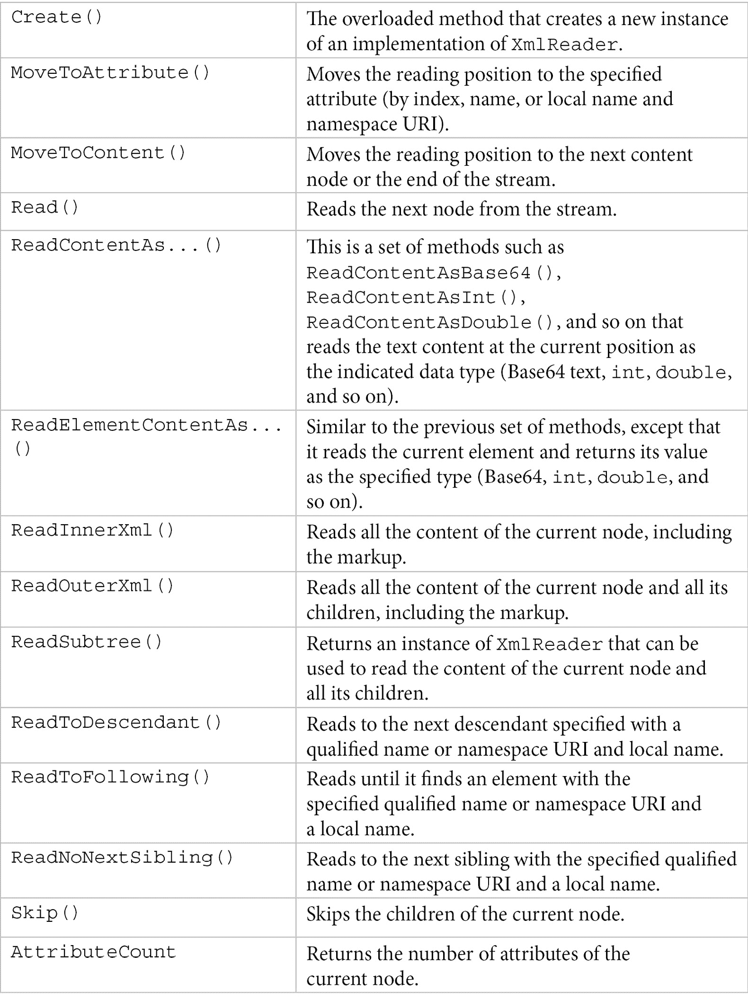


当创建一个实例 XmlReader**,您可以指定您想启用一组特性,如模式应该用于执行验证,忽略注释或空白,验证类型的任务,和其他人。 类**XmlReaderSettings**用于此目的。**

 **在下面的示例中，我们使用**XmlReader**读取先前编写的 XML 文档的内容，并将其内容的表示显示到控制台:

```cs
var rdsettings = new XmlReaderSettings()
{
    IgnoreComments = true,
    IgnoreWhitespace = true
};
using (var rd = XmlReader.Create(path, rdsettings))
{
    string indent = string.Empty;
    while(rd.Read())
    {
        switch(rd.NodeType)
        {
            case XmlNodeType.Element:
                Console.Write(
                  $"{indent}{{ {rd.Name} : ");
                indent = indent + " ";
                while (rd.MoveToNextAttribute())
                {
                    Console.WriteLine();
                    Console.WriteLine($"{indent}{{{rd.Name}:{rd.Value}}}");
                } 
                break;
            case XmlNodeType.Text:
                Console.Write(rd.Value);
                break;
            case XmlNodeType.EndElement:
                indent = indent.Remove(0, 2);
                Console.WriteLine($"{indent}}}");
                break;
            default:
                Console.WriteLine($"[{rd.Name} {rd.Value}]");
                break;
        }
    }
}
```

执行代码的输出如下:

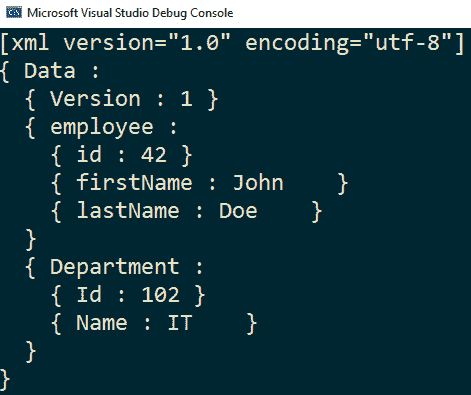

图 13.12 -从磁盘读取 XML 文档内容并显示在控制台上的屏幕截图

以下是这个例子中的几个关键点:

*   我们创建了一个实例**XmlReaderSettings**来告诉**XmlReader**忽略注释和空格。
*   我们使用**XmlReader. create()**来创建**XmlReader**实现的一个新实例，该实例从具有指定路径的文件中读取 XML 数据。
*   在循环中使用**Read()**方法逐节点读取 XML 文档。
*   我们使用**NodeType**、**Name**和**Value**等属性来检查每个节点的类型、名称和值。

有许多关于使用**XmlReader**和**XmlWriter**处理 XML 数据的细节，以及使用**XmlSerializer**进行序列化。 在这里讨论所有这些将花费太多的时间。 我们建议您使用其他资源(如官方文档)来了解更多关于这些类的信息。

现在我们已经了解了如何处理 XML 数据，让我们看看 JSON。

# 序列化和反序列化 JSON

近年来,**JavaScript 对象表示法(JSON)**已经成为事实上的标准数据序列化,不仅为 web 和移动也为桌面.NET 没有提供一个合适的序列化和反序列化 JSON 库; 因此，开发人员求助于第三方库。 其中一个库是**Json。 NET**(又名**Newtonsoft。 Json**，以其创建者 Newton-King 命名)。 它已经成为大多数.NET 开发人员首选的库，并且是 ASP 的一个依赖项。 净的核心。 然而，随着.NET Core 3.0 的发布，微软提供了自己的 JSON序列化器，称为**System.Text.Json**，以其可用的命名空间命名。 在本章的最后一部分，我们将看看这两个库，看看它们的一些功能，以及它们之间的比较。

## 使用 Json 净

Json。 NET 是目前使用最广泛的.NET 库用于 JSON 序列化和反序列化。 它是一个高性能、易于使用的开源库，可用为名为**Newtonsoft 的 NuGet 包。 Json**。 事实上，到目前为止，这是 NuGet 上下载最多的软件包。 这里列出了它提供的一些功能:

*   最常见的序列化和反序列化场景的简单 api 使用**JsonConvert**，它是**JsonSerializer**的包装器。
*   使用**JsonSerializer**对序列化/反序列化过程进行更细粒度的控制。 这个类可以直接通过**JsonTextWriter**和**JsonTextReader**向流写入文本或从流中读取文本。
*   使用**JObject**、**JArray**和**JValue**创建、修改、解析和查询 JSON 的可能性。
*   XML 和 JSON 之间转换的可能性。
*   使用 JSON Path(一种类似 xpath 的查询语言)查询 JSON 的可能性。
*   使用 JSON 模式验证 JSON。
*   通过**BsonReader**和**BsonWriter**支持**二进制 JSON (BSON)**。 这是一种 json 类文档的二进制编码序列化。

在本节中，我们将探讨使用 Json.NET 的几种常见序列化和反序列化场景。 为此，我们将使用**Employee**类的以下实现:

```cs
public enum EmployeeStatus { Active, Inactive }
public class Employee
{
    public int EmployeeId { get; set; }
    public string FirstName { get; set; }
    public string LastName { get; set; }
    public DateTime? HireDate { get; set; }
    public List<string> Telephones { get; set; }
    public bool IsOnLeave { get; set; }   

    [JsonConverter(typeof(StringEnumConverter))]
    public EmployeeStatus Status { get; set; }
    [JsonIgnore]
    public DateTime LastModified { get; set; }
    public override string ToString() => 
        $"[{EmployeeId}] {LastName}, {FirstName}";
}
```

虽然这个库具有丰富的功能，但是在这里介绍所有这些功能超出了本书的范围。 我们建议阅读 Json 的在线文档。 在 https://www.newtonsoft.com/json 上可以找到[。](https://www.newtonsoft.com/json)

获取包含**Employee**对象的 JSON 序列化的字符串很简单，如下例所示的:

```cs
var employee = new Employee
{
    EmployeeId = 42,
    FirstName = "John",
    LastName = "Doe"
};
var text = JsonConvert.SerializeObject(employee);
```

默认情况下，**JsonConvert.SerializeObject()**将生成最小化的 JSON，它不包含缩进和空格。 上述代码的结果是以下 JSON:

```cs
{"EmployeeId":42,"FirstName":"John","LastName":"Doe",
"HireDate":null,"Telephones":null,"IsOnLeave":false,
"Status":"Active"}
```

虽然这适用于通过网络传输数据，比如与 web 服务通信时，但由于其大小较小，因此很难被人读取。 如果您希望 JSON 文档具有可读性，您应该使用缩进。 这可以通过提供格式化选项来指定，该选项可通过**formatting**枚举获得。 这里显示了一个例子:

```cs
var text = JsonConvert.SerializeObject(
    employee, Formatting.Indented);
```

这一次，结果如下:

```cs
{
  "EmployeeId": 42,
  "FirstName": "John",
  "LastName": "Doe",
  "HireDate": null,
  "Telephones": null,
  "IsOnLeave": false,
  "Status": "Active"
}
```

缩进并不是我们可以指定的唯一序列化选项。 实际上，可以使用**JsonSerializerSettings**类设置许多选项，可以将其作为**SerializeObject()**方法的参数提供。 例如，我们可能想要跳过序列化属性或引用字段，或者设置为**null**的可空类型。 例如:**HireDate**和**电话机**，它们都属于**DateTime?** 和**分别列出<string>**类型。 可以这样做:

```cs
var text = JsonConvert.SerializeObject(
    employee,
    Formatting.Indented,
    new JsonSerializerSettings()
    {
        NullValueHandling = NullValueHandling.Ignore,
    });
```

下面的清单显示了对前面示例中使用的**employee**对象进行序列化的结果。 您将注意到**HireDate**和**电话**不再出现在结果 JSON 中:

```cs
{
  "EmployeeId": 42,
  "FirstName": "John",
  "LastName": "Doe",
  "IsOnLeave": false,
  "Status": "Active"
}
```

可以为序列化指定的另一个选项控制如何处理默认值。 **DefaultValueHandling**是一个枚举，它指定具有默认值的成员应该如何序列化或反序列化。 通过指定**忽略**,你使序列化器跳过从输出成员,其价值是一样的类型的默认值(**0 为数值类型**,**错误【显示】**bool**,【病人】和**零供参考和可空类型)。 实际上，可以通过使用在成员上指定的名为**DefaultValueAttribute**的属性来更改被忽略的默认值。 让我们考虑以下例子:****

```cs
var text = JsonConvert.SerializeObject(
    employee,
    Formatting.Indented,
    new JsonSerializerSettings()
    {
        NullValueHandling = NullValueHandling.Ignore,
        DefaultValueHandling = DefaultValueHandling.Ignore
    });
```

这一次，得到的 JSON 更加简单，如下面的清单所示。 这是因为**IsOnLeave**和**Status**属性被设置为其默认值，即**false**和**EmployeeStatus。 活性**，分别为:

```cs
{
  "EmployeeId": 42,
  "FirstName": "John",
  "LastName": "Doe"
}
```

我们前面提到了称为**DefaultValueAttribute**的属性。 您可能已经注意到在**Employee**类的声明中使用了两个其他属性，**JsonIgnoreAttribute**和**JsonConverterAttribute**。 序列化属性,可以控制和标准库支持.NET 序列化属性(如**SerializableAttribute**,**DataContractAttribute【病人】,**DataMemberAttribute**,【t16.1】和**NonSerializedAttributes)和内置 Json。 网络属性。 当两者都存在时，内置 Json。 NET 属性优先于其他属性。 内置的 Json。 NET 属性为，如下表所示:****

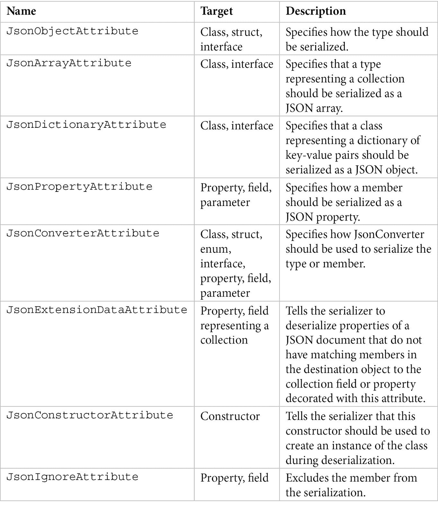

这些属性,我们使用**JsonIgnoreAttribute【】表明**LastModified**的**员工类不应被序列化和**JsonConverterAttribute**表明**【显示】状态属性应该序列化使用**StringEnumConverter**类。 结果是,这个属性将被序列化为一个字符串值(【病人】活动或**活动**),而不是作为一个数量(0 值【t16.1】或**1)。****

 ****JsonConvert.SerializeObject()**方法返回一个字符串。 可以使用流(如文件或内存流)来序列化和反序列化。 然而，要做到这一点，我们必须使用**JsonSerializer**类。 该类具有重载的方法**Serialize()**和**Deserialize()**，以及一系列允许我们自定义序列化的属性。 下面的例子展示了如何使用这个类将我们目前使用的employee 对象序列化到磁盘上的文本文件中:

```cs
var path = Path.Combine(Path.GetTempPath() + "employee.json");
var serializer = new JsonSerializer()
{
    Formatting = Formatting.Indented,
    NullValueHandling = NullValueHandling.Ignore,
    DefaultValueHandling = DefaultValueHandling.Ignore
};
using (var sw = File.CreateText(path))
using (var jw = new JsonTextWriter(sw))
{
    serializer.Serialize(jw, employee);
}
```

我们指定要使用缩进并跳过**为空**的成员或具有类型默认值的值的成员。 序列化的结果是一个包含以下内容的文本文件:

```cs
{
  "EmployeeId": 42,
  "FirstName": "John",
  "LastName": "Doe"
}
```

反序列化的相反过程也很简单。 使用**JsonSerializer**，我们可以读取前面创建的文本文件。 为此，我们使用了**JsonTextReader**，它是**JsonTextWriter**的一个伴生类:

```cs
using (var sr = File.OpenText(path))
using (var jr = new JsonTextReader(sr))
{
    var result = serializer.Deserialize<Employee>(jr);
    Console.WriteLine(result);
}
```

使用**JsonConvert**类也可以直接对字符串进行反序列化。 为此使用了重载的**DeserializeObject()**方法，如下所示:

```cs
var json = @"{
    ""EmployeeId"": 42,
    ""FirstName"": ""John"",
    ""LastName"": ""Doe""
}";
var result = JsonConvert.DeserializeObject<Employee>(json);
```

尽管被广泛使用，Json。 NET 库有一些缺点:

*   . net**string**类型使用 UTF-16 编码，而大多数网络协议，包括 HTTP，使用 UTF-8。 Json。 NET 在这两者之间进行转换，这会影响性能。
*   作为第三方库，而不是基类库(或基础类库)的组件，您可能拥有依赖于不同版本的项目。 ASP。 NET Core 使用 Json。 NET 作为依赖项，这有时会导致版本冲突。
*   它没有利用新的. net 类型，如**Span<T>**，这些类型的设计目的是在某些场景中提高性能，例如在解析文本时。

为了克服这些问题，Microsoft 已经提供了自己的 JSON 序列化器实现，我们将在下一节中查看。

## System.Text.Json

这是.NET Core 附带的新的 JSON 序列化器。 它取代 Json。 净在 ASP。 NET Core，它的集成包现在可用。 如果你的目标是.NET Framework 或.NET Standard，你仍然可以使用**System.Text.Json**，它可以作为NuGet 包，也称为**System.Text.Json**。

新的序列化器比 Json 执行得更好。 NET 主要有两个原因:它使用**Span<T>**和 UTF-8(因此避免 UTF-8 和 UTF-16 之间的转换)。 根据微软的说法，这个序列化器提供了比 Json 快 1.3 到 5 倍的速度。 NET，这取决于场景。

然而，这些 api 的灵感来自于 Json。 NET 和 Json 转换。 NET 对于简单的场景是无缝的，就像我们在本章前一节看到的那样。 下面的例子展示了如何将**Employee**对象序列化为**字符串**:

```cs
var employee = new Employee
{
    EmployeeId = 42,
    FirstName = "John",
    LastName = "Doe"
};
var text = JsonSerializer.Serialize(employee);
```

这看起来和 Json 非常相似。 NET，它也会产生缩小的 JSON，你可以在下面的代码中看到:

```cs
{"EmployeeId":42,"FirstName":"John","LastName":"Doe",
"HireDate":null,"Telephones":null,"IsOnLeave":false,
"Status":"Active"}
```

但是，可以通过提供各种选项来定制序列化，例如缩进、空值处理、命名策略、结尾逗号、忽略只读属性等等。 此类选项由**JsonSerializerOptions**类提供。 下面是一个缩进和跳过空值的例子:

```cs
var text = JsonSerializer.Serialize(
    employee,
    new JsonSerializerOptions()
    {
        WriteIndented = true,
        IgnoreNullValues = true 
    });
```

在这种情况下，输出如下:

```cs
{
  "EmployeeId": 42,
  "FirstName": "John",
  "LastName": "Doe",
  "IsOnLeave": false,
  "Status": "Active"
}
```

在这些示例中使用的**Employee**类的实现几乎与前一节中的实现相同。 让我们看看下面的代码，并尝试找出区别:

```cs
public class Employee
{
    public int EmployeeId { get; set; }
    public string FirstName { get; set; }
    public string LastName { get; set; }
    public DateTime? HireDate { get; set; }
    public List<string> Telephones { get; set; }
    public bool IsOnLeave { get; set; }
    [JsonConverter(typeof(JsonStringEnumConverter))]
    public EmployeeStatus Status { get; set; }
    [JsonIgnore]
    public DateTime LastModified { get; set; }
    public override string ToString() => 
        $"[{EmployeeId}] {LastName}, {FirstName}";
}
```

我们再次使用**JsonIgnoreAttribute**和**JsonConverterAttribute**属性来指定**LastModified 属性应该跳过,【T6 状态】**属性应该是序列化为一个字符串,而不是一个数字。 唯一的区别是我们在这里使用的转换器类型，它被称为**JsonStringEnumConverter**(当使用 Json 时)。 它被称为**StringEnumConverter**)。 然而，这些不是**Json。 NET**属性，但是**System.Text.Json**的属性，以及和其他属性，在**System.Text.Json. serialization**命名空间中可用。 下面的表格中列出了这些属性:

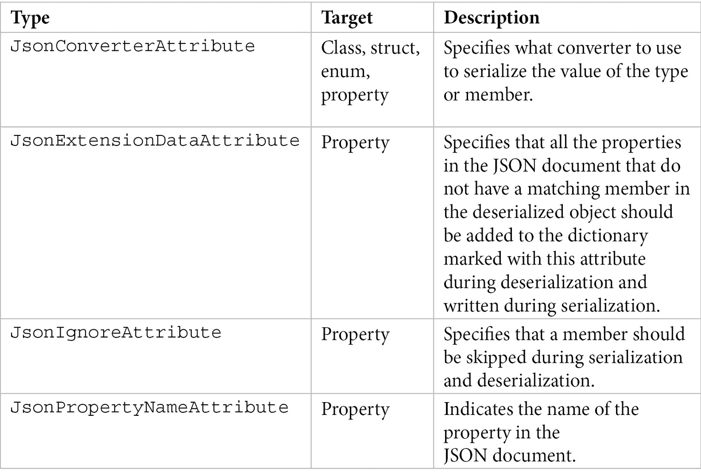

从这个表中，我们可以看到，**System.Text.Json**序列化器不支持序列化和反序列化字段，这是 Json 的东西。 净。 如果这是您需要的，您必须将字段更改为属性，为字段提供属性，或者求助于支持字段的序列化器。

如果您想对写入或读取的内容进行更多的控制，可以使用**Utf8JsonWriter**和**Utf8JsonReader**类。 它们为 UTF-8 编码的 JSON 文本提供了仅向前、不缓存、写入或只读读取的高性能 api。 在下面的例子中，我们将使用**Utf8JsonWriter**将一个 JSON 文档写入磁盘上包含一个雇员的文件:

```cs
var path = Path.Combine(Path.GetTempPath() + "employee.json");
var options = new JsonWriterOptions()
{
    Indented = true
};
using (var sw = File.CreateText(path))
using (var jw = new Utf8JsonWriter(sw.BaseStream, options))
{
    jw.WriteStartObject();
    jw.WriteNumber("EmployeeId", 42);
    jw.WriteString("FirstName", "John");
    jw.WriteString("LastName", "Doe");
    jw.WriteBoolean("IsOnLeave", false);
    jw.WriteString("Status", EmployeeStatus.Active.ToString());
    jw.WriteEndObject();
}
```

执行此代码的结果是一个包含以下内容的文本文件:

```cs
{
  "EmployeeId": 42,
  "FirstName": "John",
  "LastName": "Doe",
  "IsOnLeave": false,
  "Status": "Active"
}
```

要读取这里生成的 JSON 文档，可以使用**Utf8JsonReader**。 但是，该阅读器不处理流，而是处理原始数据的视图，其形式为**ReadOnlySpan<byte>**或**ReadOnlySequence<byte>**。 这个读取器允许我们逐个读取数据并进行相应的处理。 下面的代码片段显示了一个示例:

```cs
byte[] data = Encoding.UTF8.GetBytes(text);
Utf8JsonReader reader = new Utf8JsonReader(data, true,
                                           default);
while (reader.Read())
{
    switch (reader.TokenType)
    {
        case JsonTokenType.PropertyName:
            Console.Write($@"""{reader.GetString()}"" : ");
            break;
        case JsonTokenType.String:
            Console.WriteLine($"{reader.GetString()},");
            break;
        case JsonTokenType.Number:
            Console.WriteLine($"{reader.GetInt32()},");
            break;
        case JsonTokenType.False:
        case JsonTokenType.True:
            Console.WriteLine($"{reader.GetBoolean()},");
            break;
    }
}
```

执行这段代码的输出如下:

```cs
"EmployeeId" : 42,
"FirstName" : John,
"LastName" : Doe,
"IsOnLeave" : False,
"Status" : Active,
```

**System.Text.Json**序列化器比这里的示例显示的要复杂。 我们建议您阅读在线文档，以便更好地熟悉它的 api。

**Json。 NET**和**System.Text.Json**不是唯一的JSON 序列化器，也不是性能最好的。 如果 JSON 性能是关键对于您的应用,您可能想要**Utf8Json**使用(可以在 https://github.com/neuecc/Utf8【显示】JSON)或**吉尔(可以在 https://github.com/kevin-montrose【病人】/吉尔),既超越序列化器,我们看着在这一章。**

 **# 总结

本章一开始，我们概述了**系统。 IO**名称空间，并查看它为使用文件系统提供的功能。 然后我们学习了如何处理路径和文件系统对象。 我们了解了如何创建、编辑、移动、删除或枚举文件和目录。

我们还了解了如何在流的帮助下从磁盘文件中读取和写入数据。 我们了解了不同类型的流，并学习了如何使用不同的流适配器对文件和内存流进行读写。

在本章的最后一部分，我们了解了数据序列化，并学习了如何序列化和反序列化 XML 和 JSON。 对于后者，我们研究了 Json。 NET 序列化器，这是最流行的.NET JSON 库，以及**System.Text.Json**，这是新的.NET JSON 库。

在下一章中，我们将讨论一个不同的主题，即错误处理。 您将了解错误代码和异常，以及处理错误的最佳实践。

# 测试你所学的内容

1.  **系统中最重要的类是什么? 使用文件系统对象的 IO**命名空间?
2.  连接路径的推荐方法是什么?
3.  如何检索当前用户的临时文件夹路径?
4.  **File**和**FileInfo**类有什么区别? **目录**和**目录信息**有什么区别?
5.  您可以使用什么方法来创建目录? 那么枚举目录呢?
6.  .NET 中有哪三种类型的流?
7.  .NET 中流类的基类是什么?它提供了哪些功能?
8.  对于字符串，**BinaryReader**和**BinaryWriter**默认采用什么编码? 如何才能改变这一点呢?
9.  如何将**T**类型的对象序列化为 XML?
10.  .NET Core 附带的 JSON 序列化器是什么?如何使用它来序列化**T**类型的对象?******************