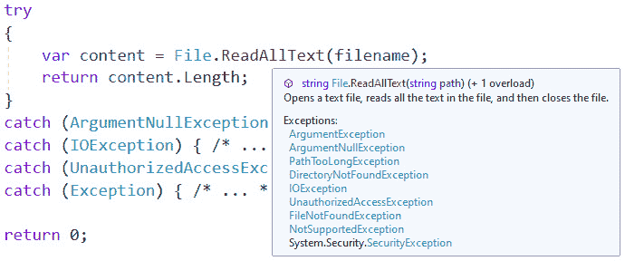
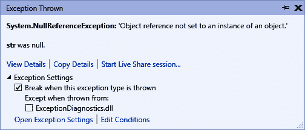
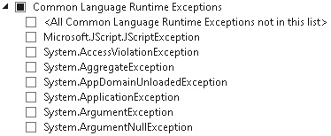

# 十四、错误处理

从历史上看，管理运行时错误一直是一个难以解决的问题，因为它们具有复杂和不同的性质，从硬件故障到业务逻辑错误。

其中的一些错误,如除零*和*零废弃*,由 CPU 本身生成一个异常,而另一些则在软件级别生成和传播作为例外,或作为一个错误代码,根据运行时和编程语言。*

. net 平台被设计成通过异常策略来管理错误条件，这有极大的优势，可以极大地简化处理代码。 这意味着任何属性或方法都可能抛出异常并通过异常对象传达错误条件。

抛出异常引发了一个重要的问题——*异常是标准库实实者与其使用者之间契约的一部分，还是一个实现细节?*

在本章中，我们将开始从生产者或消费者的角度分析参与异常模型所需的语言语法。 然而，我们还需要超越语法，分析那些试图调试原因的开发人员的含义，以及与错误抛出和错误处理方面相关的设计问题。 本章的以下三个部分将涵盖这些主题:

*   错误
*   异常
*   调试和监视异常

在本章的最后，您将能够从现有的库中捕获异常，了解一个方法是应该返回一个失败代码还是抛出一个异常，并在任何有意义的时候创建自定义异常类型。

# 错误

在软件开发中，用于管理错误的两种策略是**错误****代码**和**异常****处理**。 错误代码模型仅依赖于返回一个数字，该数字的值表示成功或任何可能的错误。 从历史上看，在错误代码的结构上从来没有收敛过。 例如,**【病人】Win32 子系统**错误代码和组件对象**【t16.1】****模型**(**COM)定义两个不同的错误代码的**winerror.h**文件,即使他们是 Windows 操作系统的两个部分。 换句话说，错误代码不是标准的一部分，当调用遍历边界时(例如不同的操作系统或运行时环境)，它们需要进行转换。**

错误代码的另一个重要方面是，它们是方法声明的一部分。 例如，它感觉很自然地定义划分方法如下:

```cs
double Div(double a, double b) { ... }
```

但是，如果分母是**0**，则应该将无效参数错误告知调用方。 错误码的采用对方法签名有直接的影响，在这种情况下是:

```cs
int Div(double a, double b, out double result) { ... }
```

最后一个签名(返回整数类型的错误代码)并不像库用户所期望的那样整洁。 另外，调用代码负责确定操作是否成功，这将引发多个问题。

第一个问题是对错误代码进行代码检查的复杂性，如本例所示:

```cs
var api = new SomeApi();
if (api.Begin() == 0)
{
    if (api.DoWork() == 0)
    {
        api.End();
    }
}
```

假设**0**是成功代码，那么每个块内的代码必须缩进，从而创建一个烦人且令人困惑的三角形，其大小与被调用的方法的数量一样大。 即使通过反转逻辑并检查故障条件，情况也不会得到改善，因为必须设置**if**语句的数量，以避免严重的 bug。

前面的代码还显示了一种常见的情况，即**api.End()**方法返回一个明显无用的错误代码，因为它在*结束*调用序列时可能需要它来处理它。 出现这个问题是因为错误代码让调用者负责决定错误严重性的重要性。 异常模型的优点之一是，它将这种能力赋予被调用的方法，从而*增强*错误的严重性。 这显然更有意义，因为严重性可能是特定于实现的。

前面的代码还隐藏了一个潜在的性能问题,由于现代的 CPU 的特点提供一个特性被称为**分支预测**,这是一种猜预装时由 CPU 指令后跳。 取决于许多因素，CPU 可能预加载*一个*路径，使其他路径运行得更慢，因为它们的代码没有预取。

最后，就类型成员属性是在所有现代语言中设计的而言，它们不适合错误代码，因为没有允许调用者意识到错误的语法，因此使用异常是沟通问题的唯一方法。

由于所有这些原因，当.NET 运行时最初设计时，团队决定采用异常范例，该范例将任何错误条件视为*带外信息*，而不是方法签名的一部分。

# 例外

异常是运行时提供的一种机制，用于使执行突然中断并跳转到处理错误的代码。 因为处理程序可能已经宣布的任何调用者的调用路径,运行时负责恢复堆栈和其他杰出的**最后**,我们将检查在 finally 块*本章部分。*

 *调用代码可能想要处理异常，如果它这样做了，它可能决定恢复正常执行，或者只是让异常继续传递给其他处理程序(如果有的话)。 当应用没有提供处理代码时，运行时捕获错误条件并执行唯一合理的操作—终止应用。

这让我们回到了我们在介绍中提出的原始问题——*是库实现者与其使用者之间契约的例外部分，还是更确切地说它是一个实现细节?*

由于实现者通过异常向调用者传递异常，因此异常看起来就像是契约的一部分。 至少这是其他语言的实现者的结论，包括 Java 和 c++，它们提供了指定方法中可能产生的异常列表的能力。 无论如何，最新的 c++标准已弃用，后来在声明中删除了异常说明，只留下了指定方法是否可能抛出异常的能力。

. net 平台决定不将异常绑定到方法签名，因为它被认为是一个实现细节。 事实上，同一个接口或基类的多个实现可能使用不同的技术抛出不同的异常。 例如，当您创建对象的代理时，除了在代理对象中声明的异常外，您可能需要抛出不同类型的异常。

由于异常不是签名的一部分，. net 平台定义了一个名为**System 的基类。 所有可能的异常**。 这种类型实际上是将消费者(调用者)与生产者(被调用的方法)绑定在一起的契约的一部分。

当然，. net 运行时是连接异常并执行匹配的处理程序的主题。 出于这个原因,. net 的例外只有有效上下文和每次你越过边界,要么用****平台调用服务**(**P / Invoke**)调用 COM 互操作性,或调用一个 web 服务, 必须适当地转换异常对象，因为它在. net 运行时之外没有任何意义。 为了缓解跨越 Win32 和 COM 边界的错误，. net 基类库定义了**Win32Exception**和**COMException**，由**Exception**衍生而来。**

显然，异常模型是管理错误的万能灵丹，但是仍然有一个非常重要的方面需要考虑—性能方面*。*

捕获异常、展开堆栈、调用相关的**最后**块以及执行其他必要的基础结构代码的整个过程都需要时间。 从这个角度来看，错误代码无疑具有更高的性能，但这是对我们已经提到的所有优势的回报。

当我们谈论性能时，必须度量它，而这又取决于给定的影响性能的代码是否经常运行。 换句话说，如果异常的使用是*异常*，它不会影响整体性能。 例如，**System.IO.File.Exists**方法返回一个布尔值，告诉我们文件在文件系统上是否存在。 但是，这并不会抛出异常，因为没有找到文件不是异常情况，并且在重复调用时抛出异常可能会严重影响性能。

现在让我们通过检查处理异常所需的语句来接触代码。 在下面几节中,您会注意到,我们介绍了一些概念[*第三章*](03.html# _idTextAnchor074),*控制语句和异常,当我们讨论异常处理。 在本章中，我们将更深入地讨论这些主题。*

 *## 捕获异常

作为一般规则，在抛出异常之前避免错误总是更好的。 例如，验证来自表示层的输入参数是您的最佳机会。

在尝试打开和读取一个文件之前，你可能想要检查它是否存在:

```cs
if (!File.Exists(filename)) return null;
var content = File.ReadAllText(filename);
```

但是这个检查不能保护代码免受其他可能的错误，因为文件名可能包含一个正斜杠(**/**)，这在 Windows 和 Linux 操作系统中都是禁止的。 尝试清理文件名是没有意义的，因为在访问文件系统时可能会发生其他错误，例如错误的路径或损坏的媒体。

当错误发生且无法轻易避免时，必须使用 C# 语言提供的命题来保护代码:**try**和**catch**块语句。

下面的代码片段演示了如何保护**文件。 从任何可能的错误 ReadAllText**:

```cs
try
{
    var content = File.ReadAllText(filename);
    return content.Length;
}
catch (Exception) { /* ... */ }
return 0;
```

**try**块包围了我们想要保护的代码。 因此，由**文件抛出的任何异常。 ReadAllText**将导致执行立即停止(**内容)。 长度**将不会被执行)，并跳转到匹配的捕获处理程序。

**catch**块必须紧跟着**try**块，并且指定只有在抛出的异常与圆括号中指定的类型匹配时才必须执行的代码。

前面的例子是能够捕获**catch**块中的任何错误，因为**Exception**是所有异常的层次结构的*基类。 但这未必是一件好事，因为您可能希望从特定的异常中恢复，而将其他失败的责任留给调用者。*

信息框

与文件名相关的大多数问题都可以通过添加一个带有**File 的检查来避免。 存在**，但我们故意省略了它，以便在我们的样本中有更广泛的可能的例外选择。

前面的代码片段可能因为为文件名提供不同的值而失败。 例如，如果**文件名**为空，则从**文件抛出**ArgumentNullException**。 ReadAllText**方法。 如果相反**文件名**是**/**，那么它将被解释为对根驱动器的访问，这需要管理权限，因此将出现异常**System。 UnauthorizedAccessException**。 当值为**//**时，会抛出**System.IO.IOException**，因为路径无效。

由于它可以根据异常类型做出不同的决定，C# 语法提供了指定多个**catch**块的能力，如下例所示:

```cs
try
{
    if (validateExistence && !File.Exists(filename)) return 0;
    var content = File.ReadAllText(filename);
    return content.Length;
}
catch (ArgumentNullException) { /* ... */ }
catch (IOException) { /* ... */ }
catch (UnauthorizedAccessException) { /* ... */ }
catch (Exception) { /* ... */ }
```

官方的.NET 类库文档包含一个*Exceptions*节，用于任何可能抛出异常的成员。 如果您使用 Visual Studio 并将鼠标悬停在 API 上，您将看到一个显示所有可能异常列表的工具提示。 下面的屏幕截图显示了**文件的工具提示。 ReadAllText**方法:



图 14.1 -显示文件异常的工具提示 ReadAllText 方法

现在让我们假设**filename**指定了一个不存在的文件:在这段代码中会发生什么? 根据工具提示异常列表，我们可以很容易地猜到将抛出一个**FileNotFoundException**异常。 这个异常的类层次结构分别是**IOException**、**SystemException**和**exception**。

有两个满足匹配的 catch 块——**IOException**和**Exception**——但是第一个胜出，因为**catch**块顺序非常重要。 如果您试图颠倒这些块的顺序，您将得到编译错误并在编辑器中得到反馈，因为这将导致无法到达的**catch**块。 下面的示例显示了当将**catch(Exception)**指定为第一个 catch 时，Visual Studio 编辑器生成的红色曲线:


图 14.2 -当 catch (Exception)是第一个使用的异常时，编辑器会报错

编译器发出的错误是**CS0160**:

```cs
error CS0160: A previous catch clause already catches all exceptions of this or of a super type ('Exception')
```

我们已经看到的示例展示了如何用相同的方法捕获异常。 但是异常模型的强大之处在于它能够遍历调用链以找到最合适的处理程序。

在下面的例子中，我们有两个不同的方法，我们恰当地处理了**ArgumentNullException**:

```cs
public string ReadTextFile(string filename)
{
    try
    {
        var content = File.ReadAllText(filename);
        return content;
    }
    catch (ArgumentNullException) { /* ... */ }
    return null;
}
public void WriteTextFile(string filename, string content)
{
    try
    {
        File.WriteAllText(filename, content);
    }
    catch (ArgumentNullException) { /* ... */ }
}
```

即使在这两个方法中已经声明了**try..catch**块，当**IOException**发生时，这些处理程序不会被调用。 运行时转而开始在调用者链中寻找兼容的处理程序。 这个过程完全由.NET 运行时管理，被称为**堆栈展开**，由调用跳到调用者中的第一个兼容处理程序，该处理程序的返回地址从堆栈中检索。

在以下示例中,**try…catch 块拦截**IOException**,这可能抛出的**ReadAllText**或**WriteAllText**api 使用的【显示】ReadTextFile 和**WriteTextFile**方法:**

 **```cs
public void CopyReversedTextFile(string source, string target)
{
    try
    {
        var content = ReadTextFile(source);
        content = content.Replace("\r\n", "\r");
        WriteTextFile(target, content);
    }
    catch (IOException) { /*...*/ }
}
```

无论调用堆栈有多深，**try..catch**块将保护该代码不受**IOException**的任何情况。

通过前面的所有示例，我们已经了解了如何区分异常类型，但是**catch**块接收该类型的对象，该对象提供关于异常性质的上下文信息。 现在让我们看一下异常对象。

## 异常对象

除了异常类型之外，**catch**块语法还可以指定引用被捕获异常的变量名。 下面的示例显示了计算所有指定文件的内容字符串长度的方法:

```cs
int[] GetFileLengths(params string[] filenames)
{
    try
    {
        var sizes = new int[filenames.Length];
        int i = 0;
        foreach(var filename in filenames)
        {
            var content = File.ReadAllText(filename);
            sizes[i++] = content.Length;  // may differ from file size
        }
        return sizes;
    }
    catch (FileNotFoundException err)
    {
        Debug.WriteLine($"Cannot find {err.FileName}");
        return null;
    }
}
```

每次我们打开一个文件之前没有使用**文件。 存在**来避免异常，我们可能会收到**FileNotFoundException**。 该对象是**IOException**的专门化，并暴露了一个**Filename**属性，提供了无法找到的文件名。 我不能甚至记得我希望从错误的应用得到这样的反馈的次数!

信息框

我们将在*调试和监视*一节中更详细地看到基类异常成员，但是您已经可以开始研究基类库中抛出的大量异常所暴露的属性了。

下面的代码显示了在捕捉**ArgumentException**时的另一个有趣的例子——当参数无法通过使用它的方法的验证时发生的异常:

```cs
private void CopyFrom(string source)
{
    try
    {
        var target = CreateFilename(source);
        File.Copy(source, target);
    }
    catch (ArgumentException err)
    {
        Debug.WriteLine($"The parameter {err.ParamName} is invalid");
        return;
    }
}
```

**catch**块拦截**源**和**目标**参数的故障。 与**源**参数验证相关的任何错误都应该返回到调用者，而**目标**参数则在本地计算。

我们怎样才能抓住那些我们感兴趣的? 答案在于 C# 6 中引入的一个语言特性。

## 条件捕获

当子句限制处理程序的范围时，**catch**块可以选择性地指定**。**

下面的例子非常类似于前面的一个,但是它限制了**捕获块钩**ArgumentException**,**ParamName**的**“destFileName”,这是第二个参数的名字【显示】文件。 复制**方法:**

 **```cs
private void CopyFrom(string source)
{
    try
    {
        var target = CreateFilename(source);
        File.Copy(source, target);
    }
    catch (ArgumentException err) when (err.ParamName == "destFileName")
    {
        Debug.WriteLine($"The parameter {err.ParamName} is invalid");
        return;
    }
}
```

当子句接受任何有效的布尔表达式时，**不一定要使用**catch**块中指定的异常对象。**

请注意，在本例中，我们使用了**"destFileName"**字符串来指定**File 的第二个参数。 复制**。 如果你使用 Visual Studio 中,您可以看到参数名称通过定位脱字符号超过所需的参数和使用的快捷方式*Ctrl*+*【T7 转变】+【显示】*空格键,显示以下建议窗口:


图 14.3 -编辑器显示的建议窗口

现在是跳转到生产者端的时候了，看看我们如何抛出异常。

## 抛出异常

当我们使用已经提供所需参数验证的 API 时，您可能决定不验证参数，并最终抛出异常。 在下面的例子中，我们打开一个日志文件，其名称由**logName**指定:

```cs
private string ReadLog(string logName)
{
    return File.ReadAllText(logName);
}
```

验证**logName**为空字符串或空字符串的决定不提供任何值，因为被调用的方法已经提供了考虑更多情况的验证，例如无效路径或不存在的文件。

但是**logName**参数可能表达不同的语义，指定日志的名称而不是要写到磁盘上的文件名(如果有的话)。 协调这两种可能的含义的解决方案是添加**".log"**扩展，如果它还没有:

```cs
private string ReadLog(string logName)
{
    var filename = "App-" + (logName.EndsWith(".log") ? logName : logName + ".log");
    return File.ReadAllText(filename);
}
```

这更有意义，但是**logName**可能是**null**，这会在突出显示的代码上导致**NullReferenceException**异常，这将使故障排除更加困难。

为了克服这个问题，我们可以添加**null**参数验证:

```cs
private string ReadLog(string logName)
{
    if(logName == null) throw new ArgumentNullException(nameof(logName));
    var filename = "App-" + (logName.EndsWith(".log") ? logName : logName + ".log");
    return File.ReadAllText(filename);
}
```

**throw**语句接受来自异常的任何对象，并立即中断方法的执行。 运行时钩子异常并将其分派给适当的处理程序，正如我们在前几节中已经研究过的那样。

提示

请注意使用**nameof(logName)**来指定出错的参数的名称。 在上一节中，我们在从**文件捕获异常时使用了这个参数。 复制**方法。 确保永远不要将参数的名称指定为文字形式。 使用**nameof()**可以保证名称始终*有效*，并避免重构过程中的问题。

**throw**语句非常简单，但请记住只在特殊情况下使用它; 否则，可能会导致性能问题。 在下面的示例中，我们使用流行的**基准测试比较两个循环。 NET**微基准库。 **LoopNop**方法中执行的代码永远不会抛出，而**LoopEx**方法中的另一个方法在每次迭代中抛出:

```cs
public int Loop { get; } = 1000;
[Benchmark]
public void LoopNop()
{
    for (var i = 0; i < Loop; i++)
    {
        try { Nop(i); }
        catch (Exception) { }
    }
}
[MethodImpl(MethodImplOptions.NoOptimization | MethodImplOptions.NoInlining)]
private void Nop(int i) { }
```

**LoopNop**方法只循环**Nop**空方法 1000 次。 **Nop**方法被标记为**noinline**，以避免在删除调用时进行任何编译器优化。

第二个方法执行相同的循环 1000 次，但调用**Crash**方法，它只在每次迭代中抛出:

```cs
[Benchmark]
public void LoopEx()
{
    for (var i = 0; i < Loop; i++)
    {
        try { Crash(i); }
        catch (Exception) { }
    }
}
[MethodImpl(MethodImplOptions.NoOptimization | MethodImplOptions.NoInlining)]
private void Crash(int i) => 
    throw new InvalidOperationException();
```

**Crash**方法每次都会创建一个新的异常，这是异常对象的实际使用。 但是，即使每次重用相同的对象，异常模型对性能的影响也是巨大的。

基准测试的结果是了解影响异常使用的*数量级*，在我们的示例中是四个数量级。

下面的输出显示了基准测试的结果:

```cs
|        Method |          Mean |       Error | Allocated |
|-------------- |--------------:|------------:|----------:|
|       LoopNop |      2.284 us |   0.0444 us |         - |
|        LoopEx | 25,365.467 us | 486.2660 us |  320000 B |
```

这个基准测试表明，抛出异常只能用于异常情况，不应该引起对异常模型有效性的任何怀疑。

我们已经看到了基类库中提供的一些异常类型。 现在，我们将看看最常见的异常以及何时使用它们。

### 常见的异常类型

基类库中可用的异常表达了最常见的错误类别的语义。 在基类库中提供的所有异常中，有一点值得一提:是开发人员最常使用的异常。 在本章中，我们已经看到了其他一些常见的异常，比如**NullReferenceException**，但它们通常只在运行时抛出:

*   **ArgumentNullException**:这通常在方法开始验证方法参数时使用。 由于引用类型可能假定为空值，它用于通知调用者 null 不是该方法可接受的值。
*   **ArgumentException**:这是另一个在方法开始处使用的异常。 它的含义更广泛，并且在参数值无效时抛出。
*   **InvalidOperationException**:这通常用于在每次对象的状态对请求的操作无效时拒绝方法调用。
*   **FormatException**:该类库使用此异常来表示格式错误的字符串。 它还可以用于为任何其他目的解析文本的用户代码。
*   **IndexOutOfRangeException**:每当一个参数指向容器的预期范围之外(比如数组或集合)时，就会使用该异常。
*   **NotImplementedException**:用来通知调用者被调用的方法没有可用的实现。 例如，当您要求 Visual Studio 在类主体中实现一个接口时，代码生成器会生成抛出此异常的属性和方法。
*   **TypeLoadException**:您可能很少需要抛出此异常。 它通常发生在无法在内存中加载类型时。 每当在静态构造函数中发生异常时，这是很常见的，除非您碰巧记住这一点，否则您可能很难诊断它。

基类库中所有异常的详尽列表可以在**Exception**类文档([https://docs.microsoft.com/en-us/dotnet/api/system.exception?view=netcore-3.1](https://docs.microsoft.com/en-us/dotnet/api/system.exception?view=netcore-3.1))中找到。

当决定抛出一个异常时，使用一个完全表达错误语义的异常是非常重要的。 每当您在.NET 中找不到合适的类时，更合适的方法是定义一个自定义异常类型。

## 创建自定义异常类型

定义异常类型就像编写一个简单的类一样简单; 惟一的要求是从异常类型(如**exception**)继承。

下面的代码声明了一个自定义异常，用于表示应用的数据层中的失败:

```cs
public class DataLayerException : Exception
{
    public DataLayerException(string queryKeyword = null)
        : base()
    {
        this.QueryKeyword = queryKeyword;
    }
    public DataLayerException(string message, string queryKeyword = null)
        : base(message)
    {
        this.QueryKeyword = queryKeyword;
    }
    public DataLayerException(string message, Exception innerException, string queryKeyword = null)
        : base(message, innerException)
    {
        this.QueryKeyword = queryKeyword;
    }
    public string QueryKeyword { get; private set; }
}
```

前面的自定义异常类定义了三个构造函数，因为它们的目的是在开发人员构造它们时提供同构的体验:

*   当您不需要构建带有附加参数的异常时，可能存在默认构造函数。 在我们的例子中，默认情况下允许使用空**QueryKeyword**构建异常对象。
*   接受**消息**参数的构造函数在表达任何可能简化诊断的人类信息时都很重要。 该消息应该只提供诊断信息，而不是打算显示给最终用户。
*   接受内部异常的构造函数在提供有关导致当前错误情况的基础异常(如果有的话)的额外信息方面很有价值。

一旦定义了新的自定义异常，它就可以与**throw**语句一起使用。 在下面的例子中，我们看到一些假设的代码对存储库进行查询，并将底层错误条件转换为自定义异常:

```cs
public IList<string> GetCustomerNames(string queryKeyword)
{
    var repository = new Repository();
    try
    {
        return repository.GetCustomerNames(queryKeyword);
    }
    catch (Exception err)
    {
        throw new DataLayerException($"Error on repository {repository.RepositoryName}", err, queryKeyword);
    }
}
```

被捕获的异常作为参数传递给构造函数，以便保留错误的原始原因，同时仍然抛出更好地表示错误性质的自定义异常。

在**catch**块中抛出，揭示了一个关于错误语义的架构问题。 在前面的示例中，我们无法恢复错误，但仍然希望捕获它，因为查询的存储库可能会因应用的安装而有很大的不同。 例如，如果存储库是数据库，内部异常将与*SQL Server*相关，而如果它是文件系统，则将是**IOException**。

如果我们想要更高层次的应用能够适当治疗错误,给他们一个机会恢复错误,我们需要抽象底层错误,并提供一个业务逻辑异常如**DataLayerException**,我们定义的。

信息框

. net Framework 最初定义**ApplicationException**作为所有自定义异常的基类。 由于没有强制执行，基类库本身从未广泛采用这种最佳实践。 因此，当前的最佳实践是从**Exception**中派生所有定制异常，您可以在官方文档中阅读:

[https://docs.microsoft.com/en-us/dotnet/api/system.applicationexception?view=netcore-3.1](https://docs.microsoft.com/en-us/dotnet/api/system.applicationexception?view=netcore-3.1)

从**catch**块内部抛出的能力并不局限于自定义异常。

## 重新抛出异常

我们刚刚看到了如何在**catch**块中抛出一个新的异常，但是有一个重要的快捷方式可以重新抛出相同的异常。

**catch**块通常用于尝试恢复错误或只是记录它。 在这两种情况下，我们可能都想让异常继续，就好像它根本没有被捕获一样。 C# 语言为这种情况提供了**throw**语句的简单使用，如下例所示:

```cs
public string ReadAllText(string filename)
{
    try
    {
        return File.ReadAllText(filename);
    }
    catch (Exception err)
    {
        Log(err.ToString());
        throw;
    }
}
```

**throw**语句后面没有任何参数，但它相当于指定在**catch**块中接收到的相同异常:

```cs
    catch (Exception err)
    {
        Log(err.ToString());
        throw err;
    }
}
```

除非**err**引用被更改为指向不同的对象，否则这两个语句是等效的，并且有一个很大的优势，那就是保留了导致错误的原始堆栈。 无论如何，我们仍然能够向该异常对象添加更多信息(**helpink**属性就是一个典型的例子)。

如果我们抛出一个不同的异常对象，原始堆栈就不是正在抛出的异常的一部分，这就是为什么**innerException**存在的原因。

在某些情况下，您可能希望保存由**捕获**块捕获的异常，稍后重新抛出它。 通过简单地抛出捕获的异常，捕获的堆栈将是不同的，而且用处不大。 如果需要保留最初捕获异常的堆栈，可以使用**ExceptionDispatchInfo**类，它提供了两个简单的方法。 **Capture**静态方法接受一个异常，并返回一个**ExceptionDispatchInfo**实例，其中包括**Capture**调用时的所有堆栈信息。 您可以保存该对象，然后使用其**throw**方法将异常与原始堆栈信息一起抛出。 该模式如下面的示例所示:

```cs
public void Foo()
{
    ExceptionDispatchInfo exceptionDispatchInfo = null;
    try
    {
        ExecuteFunctionThatThrows();
    }
    catch(Exception ex)
    {                 
        exceptionDispatchInfo = ExceptionDispatchInfo.Capture(ex);
    }

    // do something you cannot do in the catch block

    // rethrow
    if (exceptionDispatchInfo != null)
        exceptionDispatchInfo.Throw();
}
```

这里，我们调用了一个抛出异常的方法，该异常随后被**catch**子句捕获。 我们通过调用静态**ExceptionDispatchInfo 来存储对这个捕获异常的引用。 方法，它有助于保存调用堆栈。 在方法结束时，我们通过调用**ExceptionDispatchInfo**的**Throw**方法重新抛出异常。**

## 最后一个 block

**finally**块是最后一个与*异常管理*相关的 C# 语句。 它非常重要，因为它允许表达必须在**try**块之后调用的代码部分，而不管是否发生了异常。

在前面几节中，我们已经看到了代码的执行如何取决于是否发生异常。 **try**块中的代码执行可能会被跳过该代码部分的异常打断。 一旦发生错误，我们就可以保证执行匹配的**catch**块，使其有机会将问题写入日志，并可能执行一些恢复逻辑。

**终于可以指定块即使没有任何**块,这意味着任何异常调用链就会反弹,但是代码指定在**最后**块后将在任何情况下执行****试块。****

 **下面的示例显示了三个方法，它们的调用是*嵌套的*。 第一种方法,**M1**,**平方米,调用****M3,它调用【显示】**,最后抛出一个异常,如以下代码所示:

```cs
private void M1()
{
    try { M2(); }
    catch (Exception) { Debug.WriteLine("catch in M1"); }
    finally { Debug.WriteLine("finally in M1"); }
}
private void M2()
{
    try { M3(); }
    catch (Exception) { Debug.WriteLine("catch in M2"); }
    finally { Debug.WriteLine("finally in M2"); }
}
private void M3()
{
    try { Crash(); }
    finally { Debug.WriteLine("finally in M3"); }
}
private void Crash() => throw new Exception("Boom");
```

当我们调用**M1 和调用链达到**,**没有抓住**在**M3**处理异常,但其最终【显示】**块调用*之前离开的方法。 此时，运行时返回到**M2**调用者，该调用者捕获异常，但也调用其**最后**代码。 最后，由于异常已经被处理，**M2**自然地将控制返回给**M1**，其**最后**代码也被执行，如下所示:***

 ***```cs
finally in M3
catch in M2
finally in M2
finally in M1
```

你可以重复这个实验通过添加 extra-verbose 日志**试块如果愿意,但这里的重点是,**最后**块*总是执行*对*离开前*该方法。**

**try..finally**组合的另一个常见用法是确保资源被正确地处理，C# 将此模式作为一个关键字，即**using**语句。 下面的示例显示了两个等效的代码片段。 C# 编译器生成的 IL 代码基本上是相同的，你可以使用**ILSpy**工具在 IL 语言中进行反编译，自己测试:

```cs
void FinallyBlock()
{
    Resource res = new Resource();
    try
    {
        Console.WriteLine();
    }
    finally
    {
        res?.Dispose();
    }
}
void UsingStatement()
{
    using(var res = new Resource())
    {
        Console.WriteLine();
    }
}
```

当然，使用语句的**将其使用限制在实现**可删除**接口的对象上，但它生成了相同的模式。 这是我们在[*第 9 章*](09.html# _idTextAnchor173)、*资源管理*中深入探讨过的话题。**

现在我们已经从消费者和生产者的角度了解了异常的所有方面，我们将讨论与异常相关的问题的诊断研究。

# 调试和监控异常

调试异常与调试正常代码有一点不同，因为自然流会被运行时中断并处理。 除非在处理异常的代码上设置断点，否则就有可能无法理解问题从哪里开始的。 如果捕获了异常但没有重新抛出，或者方法没有在**catch**块中重新抛出，就会发生这种情况。

这似乎是异常模型的一个重要缺点，但是. net 运行时提供了克服这个问题的所有必要支持。 事实上，运行时内置了对调试器的支持，为愿意拦截异常的调试器提供了有价值的钩子。

从调试器的角度来看，您有两种可能性，即*机会*来拦截抛出的任何异常:

*   **第一次机会****异常**表示异常处于非常早期的阶段，即在它们被抛出之后，在跳到它们的处理程序之前(如果有的话)。 拦截异常(在第一次机会状态下)的好处是，我们可以准确地识别导致异常的代码。 相反，截获的异常可能是合法的并被正确处理。 换句话说，调试器将停止发生任何异常，即使是那些没有引起任何麻烦的异常。 默认情况下，当第一次出现异常时，调试器永远不会停止，但它会在调试器输出窗口中打印一个跟踪。
*   **二次**、**未处理**、**异常**为致命异常。 这意味着. net 运行时没有找到任何合适的处理程序来管理它们，并在强制关闭正在崩溃的应用之前调用调试器。 当第二次异常发生时，调试器总是停止，它总是代表一个错误条件。 第二次机会异常打印在输出窗口中，并在异常对话框中显示为未处理的异常。

使用默认设置，Visual Studio 调试器将中断，显示在崩溃应用之前可以运行的最后一行代码。 这段代码不一定会导致应用崩溃; 因此，您可能需要修改这些设置以更好地理解原因。

## 调试第二次机会异常

当被抛出的异常在我们的源代码中可用时，调试器的默认设置是，足以理解问题的原因，如下例所示:

```cs
public void TestMethod1() => Crash1();
private void Crash1() => throw new Exception("This will make the app crash");
```

Visual Studio 调试器将在高亮显示的代码处停止，该代码显示了臭名昭著的异常对话框:


图 14.4 -显示异常类型、消息和获取更多信息的链接的对话框

在输出窗口中还提供了其他信息:

```cs
Exception thrown: 'System.Exception' in ExceptionDiagnostics.dll
An unhandled exception of type 'System.Exception' occurred in ExceptionDiagnostics.dll
This will make the app crash
```

Visual Studio 调试器不断改进一个又一个版本的诊断输出。 在许多情况下，它能够打印完全表示问题根源的消息。 在以下示例代码中，异常是由**空**引用引起的:

```cs
public void TestMethod2() => Crash2(null);
private void Crash2(string str) => Console.WriteLine(str.Length);
```

这个对话框显示了一个**str 为 null**消息，它准确地告诉我们发生了什么:



图 14.5 -异常对话框显示变量之前的详细信息为空

类似地，输出窗口显示类似的消息:

```cs
**str** was null.
```

现在我们已经看到了调试器的默认行为，让我们考虑一个稍微复杂一点的场景。

## 调试首次机会异常

在本章中，我们用强调了试图从异常中恢复或重新抛出不同的异常的值，以便给调用代码更好的语义。 在某些情况下，这会增加调试的难度，如下代码所示:

```cs
public void TestMethod3()
{
    try
    {
        Crash1();
    }
    catch (Exception) { }
}
```

因为**catch**块没有重新抛出，所以该异常被简单地吞下，因此调试器根本不会中断。 但这种情况可能揭示问题的真正原因。 我们如何让调试器在这个异常处停止?

答案就在 Visual Studio 的异常窗口中(或其他暴露相同特性的调试器)。 在**Debug**|**窗口**|**异常设置**菜单中，Visual Studio 将显示以下窗口:


图 14.6 -例外设置窗口

.NET 运行时的相关异常在**公共语言运行时异常**项下:



图 14.7 -异常设置窗口的一部分显示了可选择的异常

大多数异常都是未检查的，这意味着，正如我们已经说过的，除非选中复选框，否则调试器将*而不是*在第一次出现异常时停止。

例如，如果我们想要中断上一个示例中的**throw**语句，我们只需选择**System。 从列表中删除**。

提示

请注意，此列表中的每个异常只包括确切的类型，而不包括派生类型的层次结构。 也就是说，**系统。 异常**不会钩住整个层次结构。

通过滚动列表，您可能会注意到**系统。 默认情况下会检查 NullReferenceException**和其他异常，因为这些异常被合理地认为是错误，应该总是通过验证代码中的参数来避免。

由于异常列表非常长，**公共语言运行时异常**根项是一个三种状态的切换，可以选择所有项、不选择项或重置为默认设置。

## AppDomain 异常事件

由于**AppDomain**对象提供的两个事件，第一次和第二次机会异常也可以被监视，但不会被拦截。 你可以在你的应用中使用以下代码来订阅这些事件:

```cs
AppDomain.CurrentDomain.FirstChanceException += CurrentDomain_FirstChanceException;
AppDomain.CurrentDomain.UnhandledException += CurrentDomain_UnhandledException;
// ...
private static void CurrentDomain_FirstChanceException(object sender,     System.Runtime.ExceptionServices.FirstChanceExceptionEventArgs e)
{
    Console.WriteLine($"First-Chance. {e.Exception.Message}");
}
private static void CurrentDomain_UnhandledException(object sender, UnhandledExceptionEventArgs e)
{
    var ex = (Exception)e.ExceptionObject;
    Console.WriteLine($"Unhandled Exception. IsTerminating: {e.IsTerminating} - {ex.Message}");
}
```

大多数时候，您不会希望监视第一次出现的异常，因为它们可能不会给应用带来任何麻烦。 无论如何，在您认为它们可能由于合法处理的异常而导致性能问题时，消除它们是很有用的。

第二次机会(未处理的)异常对于为任何可能无法捕获或意外的异常提供日志非常有用。 除此之外，在桌面应用上下文中，典型的用例是显示一个自定义的崩溃对话框。

提示

请注意.NET Core 总是有一个单一的应用域，而.NET Framework 可能有多个应用域，这在 ASP 中通常是正确的。 **Internet Information****Services**(**IIS**)回收主机进程时。

我们已经看到了如何获得关于在调试会话期间发生的异常的详细信息，以及记录它们的最佳选项。 现在我们将看到异常对象中提供的调试信息的种类，这些信息可以在应用崩溃后使用。

## 日志异常

在创建异常对象之后，运行时将丰富其状态，以便提供最详细的诊断信息，用于识别故障。 无论您以何种方式访问异常对象，无论是从**catch**块还是**AppDomain**事件，都有一些您可以访问的附加信息。

我们已经讨论了**InnerException**属性，该属性递归地提供了对链的所有内部异常的访问。 下面的例子展示了如何迭代整个链:

```cs
private static void Dump(Exception err)
{
    var current = err;
    while (current != null)
    {
        Console.WriteLine(current.InnerException?.Message);
        current = current.InnerException;
    }
}
```

在创建日志时，实际上并不需要访问内部异常来创建转储，因为异常对象的**ToString**方法提供了整个链的转储，即使它非常详细。

**ToString**方法打印运行时提供的**StackTrace**string 属性，以捕获发生异常的整个方法链。

由于**StackTrace**是运行时组合的字符串，异常对象还提供**MethodBase**类型的**TargetSite**属性，这是代表出错方法的反射对象。 该对象公开了带有方法名的**Name**属性。

最后,**GetBaseException**方法返回第一个例外,最初生成的故障,提供任何抛出收到声明保留内部异常或指定任何参数,正如我们已经讨论的*将异常部分。 相反，如果您需要知道是否有一个异常已经被某个处理程序吞噬，那么您将需要钩子第一次机会异常事件。*

 *您可能需要使用*进一步阅读*部分中提供的链接来研究更高级的调试技术。 它们包括转储的创建，转储是一个二进制文件，包含崩溃时应用进程的内存。 稍后可以使用调试工具调查转储。 另一个强大的和非常先进的工具是**儿子**【5】【T7 罢工】【显示】(**SOS)插件可用从 WinDbg 调试器(Windows)或**【病人】dotnet-dump 分析.NETCore 工具。****

这些是低级的工具，通常用于所谓的**事后****调试**。 它们允许我们创建错误应用使用的内存快照，然后检查其状态。 除了本机调试器提供的标准元素外，SOS 和**. net-dump**的功能还提供了特定于. net 的信息。

例如,使用这些工具,您可能会得到当前堆栈状态信息为每个线程,最最近的异常数据,每个对象在内存中是如何引用或引用其他对象,每个对象使用的内存,和其他信息相关的应用元数据和.NET 运行时。

# 总结

在本章中，我们首先理解了为什么.NET 采用了异常模型，而不是许多其他技术所使用的错误代码。

异常模型已经证明了它是非常强大的，它提供了一种向调用链报告错误的有效而干净的方法。 它避免了使用附加参数和错误检查条件污染代码，这在某些情况下可能会导致效率损失。 我们还通过一个基准测试验证了异常模型必须仅用于异常情况，否则可能会严重影响应用的性能。

我们也看到详细的语法**,**,和**终于语句允许我们拦截和处理异常,并提供一个确定的处置任何优秀的资源。******

 ****最后，我们检查了诊断和日志记录选项，它们在提供修复错误所需的所有信息方面非常有用。

在下一章中，我们将学习 C# 8 的新特性，这些特性在性能和健壮性方面增强了语言的表现力和能力。

# 测试你所学的内容

1.  哪个**块**语句可以用来包围一些可能抛出异常的代码?
2.  在任何**catch**块内的典型任务是什么?
3.  当指定多个**catch**块时，应该遵循什么顺序?为什么?
4.  我们应该在**catch**语句中指定异常变量名吗? 为什么?
5.  您刚刚在**catch**块中捕获了一个异常。 为什么你要重新抛出它?
6.  **最后**块的作用是什么?
7.  您可以指定一个没有**catch**块的**最后**块吗?
8.  什么是第一次机会例外?
9.  如何将 Visual Studio 调试器分解为第一次异常?
10.  你想在什么时候钩子 AppDomain 的**UnhandledException**事件?

# 进一步阅读

*   **的****dotnet-dump****工具**(**【显示】为**.NET**【病人】核心):https://docs.microsoft.com/en-us/dotnet/core/diagnostics/dotnet-dump**
***   **The****WinDbg****debugger**:[https://docs.microsoft.com/en-us/windows-hardware/drivers/debugger/debugger-download-tools](https://docs.microsoft.com/en-us/windows-hardware/drivers/debugger/debugger-download-tools)*   **使用******SOS****【T7 调试】【显示】扩展****【病人】WinDbg(**【t16.1】为**.NET 框架****):https://docs.microsoft.com/en-us/windows-hardware/drivers/debugger/debugging-managed-code**************************