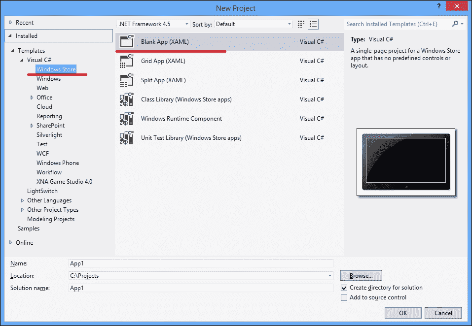
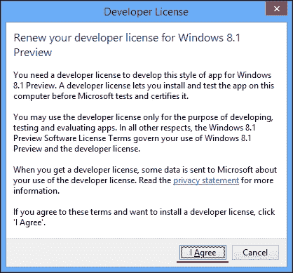
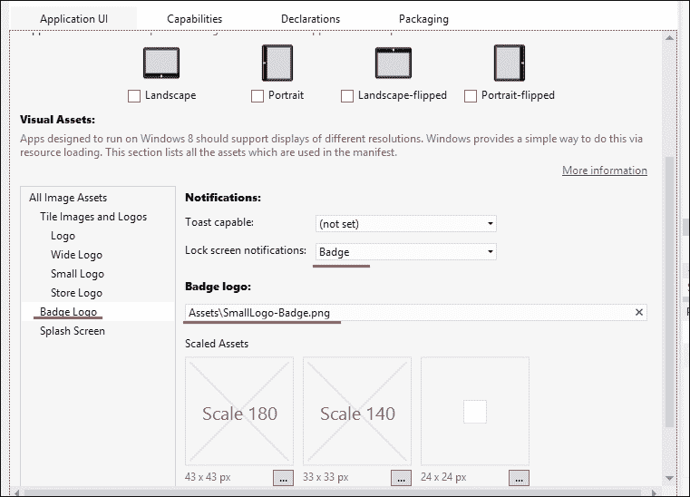

# 第 11 章，还有更多

在本章中，我们将介绍 Windows8 操作系统中的新编程范例。您将了解：

*   在 Windows 应用商店应用程序中使用计时器
*   从常用应用程序使用 WinRT
*   在 Windows 应用商店应用程序中使用 BackgroundTask

# 导言

微软在 2011 年 9 月 13 日的构建大会上发布了 Windows8 的第一个公开测试版。新的操作系统试图解决 Windows 的几乎所有问题，它引入了一些功能，如适用于触摸屏设备的响应式 UI、更低的功耗、新的应用程序模型、新的异步 API 和更严格的安全性。

Windows API 改进的核心是一个新的多平台组件系统**WinRT**，这是 COM 的逻辑开发。使用 WrRT，程序员可以使用本机 C++代码、C 语言和.NET，甚至 JavaScript 和 HTML 来开发应用程序。另一个变化是引入了集中式应用程序存储，这在以前的 Windows 平台上是不存在的。

作为一个新的应用平台，Windows8具有向后兼容性，允许运行普通的 Windows 应用程序。这导致了一种情况，即存在两大类应用程序：Windows 应用商店应用程序，其中新程序通过 Windows 应用商店分发，以及自上一版本 Windows 以来未更改的常见经典应用程序。

Windows 应用商店应用程序是我们在本章要讨论的内容。开发模式发生了很大的变化，作为程序员你必须遵守特定的规则。程序必须在启动或完成的有限时间内做出响应，以保持整个操作系统和其他应用程序的响应。为了节省电池，默认情况下，应用程序不再在后台运行；相反，它们被挂起并实际停止执行。

新的 Windows API 是异步的，您只能在应用程序中使用白名单 API 函数。例如，不再允许您创建新的`Thread`类实例。您必须使用系统管理的线程池。很多常用的 API 已经不能再使用了，你必须研究新的方法来实现与以前相同的目标。

在本章中，我们将了解 Windows 应用商店应用程序与普通 Windows 应用程序的不同之处，以及如何利用普通应用程序带来的一些 WinRT 好处，并介绍一个简化的 Windows 应用商店应用程序场景，以及后台通知。

# 在 Windows 应用商店应用程序中使用计时器

此配方展示了如何在 Windows 应用商店应用程序中使用简单计时器。

## 准备好了吗

要逐步完成此步骤，您需要 Visual Studio 2012 和 Windows 8+操作系统。不需要其他先决条件。此配方的源代码可在`7644_Code\Chapter11\Recipe1`中找到。

## 怎么做。。。

要了解如何在 Windows 应用商店应用程序中使用计时器，请执行以下步骤：

1.  Start Visual Studio 2012\. Create a new C# **Blank App (XAML)** project under **Windows Store**.

    

2.  In case you are asked to renew your developer license, you have to agree to the Microsoft privacy terms.

    

3.  Then, sign in to your Microsoft account (or create one first).

    

4.  Finally, you get a confirmation dialog that the developer license was successfully renewed.

    

5.  在的`MainPage.xaml`文件中，将的`Name`属性添加到`Grid`元素中：

    ```cs
    <Grid Name="Grid" Background="{StaticResourceApplicationPageBackgroundThemeBrush}">
    ```

6.  在`MainPage.xaml.cs`文件中，添加以下`using`指令：

    ```cs
    using System;
    using Windows.UI.Xaml;
    using Windows.UI.Xaml.Controls;
    using Windows.UI.Xaml.Navigation;
    ```

7.  在`MainPage`构造函数定义上方添加以下代码段：

    ```cs
    private readonly DispatcherTimer _timer;
    private int _ticks;
    ```

8.  将`MainPage()`构造函数替换为以下代码段：

    ```cs
    public MainPage()
    {
      InitializeComponent();
      _timer = new DispatcherTimer();
      _ticks = 0;
    }
    ```

9.  在`OnNavigatedTo`方法中添加以下代码段：

    ```cs
    Grid.Children.Clear();
    var commonPanel = new StackPanel
    {
      Orientation = Orientation.Vertical,
      HorizontalAlignment = HorizontalAlignment.Center
    };

    var buttonPanel = new StackPanel
    {
      Orientation = Orientation.Horizontal,
      HorizontalAlignment = HorizontalAlignment.Center
    };

    var textBlock = new TextBlock
    {
      Text = "Sample timer application",
      FontSize = 32,
      HorizontalAlignment = HorizontalAlignment.Center,
      Margin = new Thickness(40)
    };

    var timerTextBlock = new TextBlock
    {
      Text = "0",
      FontSize = 32,
      HorizontalAlignment = HorizontalAlignment.Center,
      Margin = new Thickness(40)
    };

    var timerStateTextBlock = new TextBlock
    {
      Text = "Timer is enabled",
      FontSize = 32,
      HorizontalAlignment = HorizontalAlignment.Center,
      Margin = new Thickness(40)
    };

    var startButton = new Button { Content = "Start",FontSize = 32};
    var stopButton = new Button { Content = "Stop",FontSize = 32};

    buttonPanel.Children.Add(startButton);
    buttonPanel.Children.Add(stopButton);

    commonPanel.Children.Add(textBlock);
    commonPanel.Children.Add(timerTextBlock);
    commonPanel.Children.Add(timerStateTextBlock);
    commonPanel.Children.Add(buttonPanel);

    _timer.Interval = TimeSpan.FromSeconds(1);
    _timer.Tick += (sender, eventArgs) =>
    {
      timerTextBlock.Text = _ticks.ToString(); _ticks++;
    };
    _timer.Start();

    startButton.Click += (sender, eventArgs) =>
    {
      timerTextBlock.Text = "0";
      _timer.Start();
      _ticks = 1;
      timerStateTextBlock.Text = "Timer is enabled";
    };

    stopButton.Click += (sender, eventArgs) =>
    {
      _timer.Stop();
      timerStateTextBlock.Text = "Timer is disabled";
    };

    Grid.Children.Add(commonPanel);
    ```

10.  运行程序。

## 它是如何工作的。。。

当程序运行时，它会创建一个`MainPage`类的实例。这里我们在构造函数中实例化`DispatcherTimer`，并将`ticks`计数器初始化为零。然后，在`OnNavigatedTo`事件处理程序中，我们创建 UI 控件，并将开始和停止按钮绑定到相应的 lambda 表达式，其中包含`start`和`stop`逻辑。

如您所见，`timer`事件处理程序直接与 UI 控件一起工作。这是可以的，因为`DispatcherTimer`的实现方式是`timer`的`Tick`事件的处理程序由 UI 线程运行。但是，如果您运行程序，然后切换到其他程序，并在几分钟后切换到程序删除，您可能会注意到秒计数器远远落后于实际经过的时间。这是因为 Windows 8 应用程序或通常所指的 Windows 应用商店应用程序具有完全不同的生命周期。

### 注

请注意，Windows 应用商店应用程序的行为与智能手机和平板电脑平台上的应用程序非常相似。它们不再在后台运行，而是在一段时间后被挂起，这意味着它们实际上被冻结，直到用户切换回它们。在应用程序挂起之前，保存当前应用程序状态的时间有限，并且可以在应用程序再次运行时恢复状态。

虽然这种行为可以节省电源和 CPU 资源，但它给本应在后台进行某些处理的应用程序编程带来了极大的困难。Windows8 有一套特殊的 API 用于编程此类应用程序。我们将在本章后面介绍这种情况。

# 从常用应用程序中使用 WinRT

此配方显示了如何创建能够使用 WinRT API 的控制台应用程序。

## 准备好了吗

要逐步完成此步骤，您需要 Visual Studio 2012 和 Windows 8+操作系统。没有其他先决条件。此配方的源代码可在`7644_Code\Chapter11\Recipe2`中找到。

## 怎么做。。。

要了解如何从常用应用程序中使用 WinRT，请执行以下步骤：

1.  启动 Visual Studio 2012。创建一个新的 C#**控制台应用程序**项目。
2.  在 Visual Studio**解决方案资源管理器**中右键单击已创建的项目，然后选择**卸载项目…**菜单选项。
3.  右键点击卸载的项目，选择**编辑 ProjectName.csproj**菜单选项。
4.  在`<TargetFrameworkVersion>`元素下方添加以下 XML:

    ```cs
    <TargetPlatformVersion>8.0</TargetPlatformVersion>
    ```

5.  保存`.csproj`文件，在 Visual Studio**解决方案浏览器**中右键点击卸载的项目，选择**重新加载项目**菜单选项。
6.  Right-click on the project and select **Add Reference** from the **Core** library under **Windows**. Then click on the **Browse** button.

    

7.  导航至`C:\Program Files\Reference Assemblies\Microsoft\Framework\.NETCore\v4.5`并点击`System.Runtime.WindowsRuntime.dll`。
8.  在文件`Program.cs`中添加以下`using`指令：

    ```cs
    using System;
    using System.IO;
    using System.Threading.Tasks;
    using Windows.Storage;
    ```

9.  在`Main`方法下方添加以下代码片段：

    ```cs
    async static Task AsynchronousProcessing()
    {
      StorageFolder folder = KnownFolders.DocumentsLibrary;

      if (await folder.DoesFileExistAsync("test.txt"))
      {
        var fileToDelete = await folder.GetFileAsync("test.txt");
        await fileToDelete.DeleteAsync(StorageDeleteOption.PermanentDelete);
      }

      var file = await folder.CreateFileAsync("test.txt",CreationCollisionOption.ReplaceExisting);
      using (var stream = await file.OpenAsync(FileAccessMode.ReadWrite))
      using (var writer = new StreamWriter(stream.AsStreamForWrite()))
      {
        await writer.WriteLineAsync("Test content");
        await writer.FlushAsync();
      }

      using (var stream = await file.OpenAsync(FileAccessMode.Read))
      using (var reader = new StreamReader(stream.AsStreamForRead()))
      {
        string content = await reader.ReadToEndAsync();
        Console.WriteLine(content);
      }

      Console.WriteLine("Enumerating Folder Structure:");

      var itemsList = await folder.GetItemsAsync();
      foreach (var item in itemsList)
      {
        if (item is StorageFolder)
        {
          Console.WriteLine("{0} folder", item.Name);
        }
        else
        {
          Console.WriteLine(item.Name);
        }
      }
    }
    ```

10.  在`Main`方法中添加以下代码段：

    ```cs
    var t = AsynchronousProcessing();
    t.GetAwaiter().GetResult();
    Console.WriteLine();
    Console.WriteLine("Press ENTER to continue");
    Console.ReadLine();
    ```

11.  在`Program`类定义下方添加以下代码片段：

    ```cs
    static class Extensions
    {
      public static async Task<bool> DoesFileExistAsync(thisStorageFolder folder, string fileName)
      {
        try
        {
          await folder.GetFileAsync(fileName);
          return true;
        }
        catch (FileNotFoundException)
        {
          return false;
        }
      }
    }
    ```

12.  运行程序。

## 它是如何工作的。。。

在这里，我们使用了一种相当复杂的方式从一个常见的.NET 控制台应用程序中使用WinRT API。不幸的是，并非所有可用的 API 都能在这种情况下工作，但使用运动传感器、GPS 定位服务等仍然是有用的。

为了在 Visual Studio 中引用 WinRT，我们手动编辑`.csproj`文件，将应用程序的目标平台指定为 Windows 8。然后我们手动引用`System.Runtime.WindowsRuntime.dll`来利用`GetAwaiter`扩展方法实现 WinRT 异步操作。这允许我们直接在 WinRT API 上使用`await`。还有一个反向转换。当我们创建 WRRT 库时，我们必须将 WiRT 本地的 java T4 接口家族公开给异步操作，这样它们就可以以语言不可知的方式从 JavaScript 和 C++中消费。

WinRT 中的文件操作是非常自我描述的；这里我们有异步文件创建和删除操作。不过，WinRT 中的文件操作包含安全限制，鼓励您为应用程序使用特殊的 Windows 文件夹，并且不允许您仅使用磁盘驱动器上的任何文件路径。

# 在 Windows 应用商店应用程序中使用 BackgroundTask

此配方介绍了在 Windows 应用商店应用程序中创建后台任务的过程，该过程将更新桌面上应用程序的实时互动程序。

## 准备好了吗

要逐步完成此步骤，您需要 Visual Studio 2012 和 Windows 8+操作系统。没有其他先决条件。此配方的源代码可在`7644_Code\Chapter11\Recipe3`中找到。

## 怎么做。。。

要了解如何在 Windows 应用商店应用程序中使用`BackgroundTask`，请执行以下步骤：

1.  启动 Visual Studio 2012。在**Windows 应用商店**下新建一个 C#**空白应用程序（XAML）**项目。如果您需要续订开发者许可证，请参阅 Windows 应用商店应用程序中使用计时器的*配方以了解详细说明。*
2.  在**资产**文件夹中，在 Paint editor 中打开**SmallLogo.png**文件，将其裁剪为 24 x 24 像素大小，将其作为`SmallLogo-Badge.png`保存回**资产**文件夹，并将其包含在项目中。
3.  Open the `Package.appxmanifest` file. In the **Declarations** tab, add **Background Tasks** to **Supported Declarations**. Under **Properties**, check the supported properties **System event** and **Timer**, and set the name of **Entry point** to `YourNamespace.TileSchedulerTask`. `YourNamespace` should be the namespace of your application.

    

4.  In the **Application UI** tab, select **Lock screen notifications** as **Badge**, and **Badge logo** as **Assets\SmallLogo-Badge.png**.

    

5.  在`MainPage.xaml`文件的中，将以下 XAML 插入`Grid`元素：

    ```cs
    <StackPanel Margin="50">
      <TextBlock Name="Clock"Text="HH:mm"HorizontalAlignment="Center"VerticalAlignment="Center"Style="{StaticResource HeaderTextStyle}"/></StackPanel>
    ```

6.  在文件`MainPage.xaml.cs`中添加以下`using`指令：

    ```cs
    using System;
    using System.Diagnostics;
    using System.Globalization;
    using System.Linq;
    using System.Xml.Linq;
    using Windows.ApplicationModel.Background;
    using Windows.Data.Xml.Dom;
    using Windows.System.UserProfile;
    using Windows.UI.Notifications;
    using Windows.UI.Xaml;
    using Windows.UI.Xaml.Controls;
    using Windows.UI.Xaml.Navigation;
    ```

7.  在`MainPage`构造函数定义上方添加以下代码段：

    ```cs
    private const string TASK_NAME_USERPRESENT ="TileSchedulerTask_UserPresent";
    private const string TASK_NAME_TIMER ="TileSchedulerTask_Timer";

    private readonly CultureInfo _cultureInfo;
    private readonly DispatcherTimer _timer;
    ```

8.  将构造函数替换为以下代码段：

    ```cs
    public MainPage()
    {
    InitializeComponent();

    string language = GlobalizationPreferences.Languages.First();
    _cultureInfo = new CultureInfo(language);

    _timer = new DispatcherTimer();
    _timer.Interval = TimeSpan.FromSeconds(1);
    _timer.Tick += (sender, e) => UpdateClockText();
    }
    ```

9.  在`OnNavigatedTo`方法上方添加以下代码片段：

    ```cs
    private void UpdateClockText()
    {
      Clock.Text = DateTime.Now.ToString(_cultureInfo.DateTimeFormat.FullDateTimePattern);
    }

    private static async void CreateClockTask()
    {
      BackgroundAccessStatus result = awaitBackgroundExecutionManager.RequestAccessAsync();
      if (result == BackgroundAccessStatus.AllowedMayUseActiveRealTimeConnectivity ||result == BackgroundAccessStatus.AllowedWithAlwaysOnRealTimeConnectivity)
      {
        TileSchedulerTask.CreateSchedule();

        EnsureUserPresentTask();
        EnsureTimerTask();
      }
    }

    private static void EnsureUserPresentTask()
    {
      foreach (var task in BackgroundTaskRegistration.AllTasks)
        if (task.Value.Name == TASK_NAME_USERPRESENT)
          return;

      var builder = new BackgroundTaskBuilder();
      builder.Name = TASK_NAME_USERPRESENT;
      builder.TaskEntryPoint =(typeof(TileSchedulerTask)).FullName;
      builder.SetTrigger(new SystemTrigger(SystemTriggerType.UserPresent, false));
      builder.Register();
    }

    private static void EnsureTimerTask()
    {
      foreach (var task in BackgroundTaskRegistration.AllTasks)
        if (task.Value.Name == TASK_NAME_TIMER)
          return;

      var builder = new BackgroundTaskBuilder();
      builder.Name = TASK_NAME_TIMER;
      builder.TaskEntryPoint = (typeof(TileSchedulerTask)).FullName;
      builder.SetTrigger(new TimeTrigger(180, false));
      builder.Register();
    }
    ```

10.  在`OnNavigatedTo`方法中添加以下代码段：

    ```cs
    _timer.Start();
    UpdateClockText();
    CreateClockTask();
    ```

11.  在`MainPage`类定义下方添加以下代码片段：

    ```cs
    public sealed class TileSchedulerTask : IBackgroundTask
    {
      public void Run(IBackgroundTaskInstance taskInstance)
      {
        var deferral = taskInstance.GetDeferral();
        CreateSchedule();
        deferral.Complete();
      }

      public static void CreateSchedule()
      {
        var tileUpdater = TileUpdateManager.CreateTileUpdaterForApplication();
        var plannedUpdated = tileUpdater.GetScheduledTileNotifications();

        DateTime now = DateTime.Now;
        DateTime planTill = now.AddHours(4);

        DateTime updateTime = new DateTime(now.Year, now.Month,now.Day, now.Hour, now.Minute, 0).AddMinutes(1);
        if (plannedUpdated.Count > 0)
          updateTime = plannedUpdated.Select(x =>x.DeliveryTime.DateTime).Union(new[] { updateTime}).Max();
        XmlDocument documentNow = GetTilenotificationXml(now);

        tileUpdater.Update(new TileNotification(documentNow) {ExpirationTime = now.AddMinutes(1) });

        for (var startPlanning = updateTime;startPlanning < planTill; startPlanning =startPlanning.AddMinutes(1))
        {
          Debug.WriteLine(startPlanning);
          Debug.WriteLine(planTill);

          try
          {
            XmlDocument document = GetTilenotificationXml(startPlanning);

            var scheduledNotification = newScheduledTileNotification(document,new DateTimeOffset(startPlanning))
            {
              ExpirationTime = startPlanning.AddMinutes(1)
            };

            tileUpdater.AddToSchedule(scheduledNotification);
          }
          catch (Exception ex)
          {
            Debug.WriteLine("Error: " + ex.Message);
          }
        }
      }

      private static XmlDocument GetTilenotificationXml(DateTime dateTime)
      {
        string language =GlobalizationPreferences.Languages.First();
        var cultureInfo = new CultureInfo(language);

        string shortDate = dateTime.ToString(cultureInfo.DateTimeFormat.ShortTimePattern);
        string longDate = dateTime.ToString(cultureInfo.DateTimeFormat.LongDatePattern);

        var document = XElement.Parse(string.Format(@"<tile>
        <visual>
          <binding template=""TileSquareText02"">
            <text id=""1"">{0}</text>
            <text id=""2"">{1}</text>
          </binding>
          <binding template=""TileWideText01"">
            <text id=""1"">{0}</text>
            <text id=""2"">{1}</text>
            <text id=""3""></text>
            <text id=""4""></text>
          </binding>  
        </visual>
      </tile>", shortDate, longDate));

        return document.ToXmlDocument();
      }
    }

    public static class DocumentExtensions
    {
      public static XmlDocument ToXmlDocument(thisXElement xDocument)
      {
        var xmlDocument = new XmlDocument();
        xmlDocument.LoadXml(xDocument.ToString());
        return xmlDocument;
      }
    } 
    ```

12.  运行程序。

## 它是如何工作的。。。

前面的程序演示了如何创建基于时间的后台任务，以及如何在 Windows 8 开始屏幕上的实时互动程序上显示此任务的更新。编程 Windows 应用商店应用程序本身就是一项极具挑战性的任务，您必须关心应用程序挂起/恢复其状态，以及许多其他事项。在这里，我们将专注于我们的主要任务，而忽略次要问题。

我们的主要目标是在应用程序本身不在前台时运行一些代码。首先，我们创建一个`IBackgroundTask`接口的实现。这是我们的代码，当我们得到触发信号时，`Run`方法将被调用。重要的是，如果`Run`方法包含包含包含`await`的异步代码，我们必须使用配方中所示的特殊延迟对象来明确指定`Run`方法执行的开始和结束时间。在我们的例子中，方法调用是同步的，但为了说明这一需求，我们使用了延迟对象。

在`Run`方法的任务中，我们每分钟创建一组 tile 更新，持续 4 小时，并在`ScheduledTaskNotification`类的帮助下在`TileUpdateManager`中注册。互动程序使用特殊的 XML 格式指定文本在其上的确切位置。当我们从系统触发任务时，它会为接下来的 4 小时安排一分钟的磁贴更新。然后，我们需要注册我们的后台任务。我们做两次；一次注册提供一个`UserPresent`触发器，这意味着当用户登录时将触发此任务。下一个触发器是时间触发器，它每 3 小时运行一次任务。

当程序运行时，它会创建一个计时器，该计时器在应用程序位于前台时运行。同时，它正在尝试注册后台任务；要注册这些任务，程序需要用户权限，它将显示一个对话框，请求用户的权限。现在，我们已经安排了接下来 4 小时的实时磁贴更新。如果我们关闭应用程序，实时互动程序将继续每分钟显示新时间。在接下来的 3 小时内，时间触发器将再次运行我们的后台任务，我们将安排另一个实时磁贴更新。