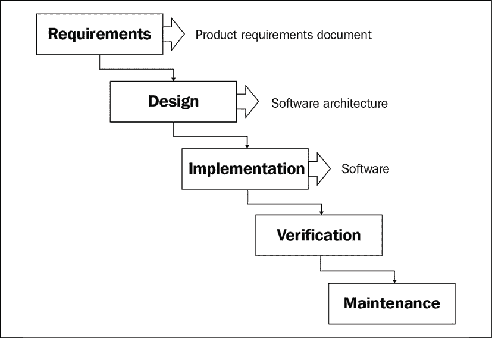
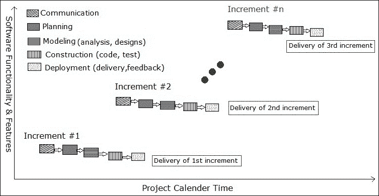
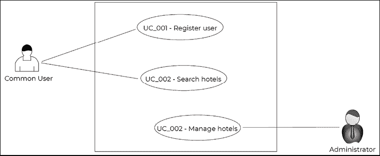

# 一、理解软件架构的重要性

软件架构是当今软件行业讨论最多的话题之一，其重要性在未来肯定会越来越大。我们构建的复杂而奇妙的解决方案越多，我们就越需要伟大的软件架构来维护它们。但是，向这些软件解决方案添加新功能的速度不断提高，新的架构机会不断涌现。这就是你决定读这本书的原因；这就是我们决定写第二版的原因。

这不是一个简单的任务来写这个重要的主题，它提供了这么多的替代技术和解决方案。本书的主要目的不是建立一个详尽的、永无止境的可用技术和解决方案列表，而是展示各种技术家族是如何相互关联的，以及它们在实践中如何影响可维护和可持续解决方案的构建。

我们需要继续专注于创建实际、有效的企业解决方案，这一需求不断增加；用户在应用中总是需要更多的新功能。此外，频繁交付应用版本的需求（由于快速变化的市场）增加了我们拥有复杂软件架构和开发技术的义务。

本章将介绍以下主题：

*   对什么是软件架构的理解
*   一些软件开发过程模型可以帮助您成为软件架构师
*   收集正确信息以设计高质量软件的过程
*   在开发过程中提供帮助的设计技术
*   需求影响系统结果的情况
*   本书案例研究导论

本书的案例研究将带您了解为名为**世界野生旅游俱乐部**（**WWTravelClub**的旅行社创建软件架构的过程。本案例研究的目的是帮助您理解每章中解释的理论，并提供一个示例，说明如何使用 Azure、Azure DevOps、C# 9、.NET 5、ASP.NET 和本书中介绍的其他技术开发企业应用。

在本章结束时，您将能够确切地理解软件架构的任务是什么。您还将了解什么是 Azure，以及如何在平台上创建您的帐户。您还将获得软件过程、模型和其他技术的概述，这些技术将使您能够管理您的团队。

# 什么是软件架构？

如果你今天正在读这本书，你应该感谢那些决定把软件开发当作一个工程领域的计算机科学家。这发生在上个世纪，更具体地说，60 年代末，当时他们提出我们开发软件的方式与我们建造建筑物的方式非常相似。这就是为什么我们命名为**软件架构**。就像架构师设计建筑并根据该设计监督其施工一样，软件架构师的主要目标是确保软件应用得到良好的实现；好的实现需要设计一个好的解决方案。

在专业发展项目中，您必须做以下事情：

*   定义解决方案的客户需求
*   设计一个很好的解决方案来满足这些需求
*   实现设计的解决方案
*   与客户一起验证解决方案
*   在工作环境中交付解决方案

软件工程将这些活动定义为软件开发生命周期。所有理论上的软件开发过程模型（瀑布式、螺旋式、增量、敏捷等）都与这个周期有某种关联。无论您使用哪种模型，如果您不处理项目早期介绍的基本任务，您将无法交付可接受的软件作为解决方案。

关于设计伟大解决方案的要点是本书目的的基础。您必须了解，伟大的现实世界解决方案带来了一些基本约束：

*   解决方案需要满足用户需求
*   解决方案需要按时交付
*   解决方案需要遵守项目预算
*   解决方案需要提供高质量的产品
*   解决方案需要保证安全有效的未来演变

伟大的解决方案需要是可持续的，您必须理解，没有伟大的软件架构，就没有可持续的软件。如今，伟大的软件架构依赖于现代工具和现代环境来完美地满足用户的需求。

因此，本书将使用微软提供的一些很棒的工具。该公司宣布将.NET5 作为软件开发的统一平台，这为我们提供了一个创造奇妙解决方案的绝佳机会。

<figure class="mediaobject"></figure>

图 1.1:NET 5 平台

NET 5 与 C# 9 一起交付。考虑到.NET 方法针对如此多的平台和设备，C# 现在是世界上最常用的编程语言之一，可以在小型设备上运行，也可以在不同操作系统和环境中的大型服务器上运行。

本书还将使用**Azure**，这是微软的云平台，在这里你可以找到该公司为构建高级软件架构解决方案而提供的所有组件。其中一个是**Azure DevOps**，这是一个应用生命周期管理环境，您可以在其中使用最新的软件开发方法构建解决方案。

作为一名软件架构师意味着理解上述技术，以及其他许多技术。本书将引导您踏上一段旅程，作为一名在团队中工作的软件架构师，您将使用列出的工具提供最佳解决方案。让我们通过创建您的 Azure 帐户开始这段旅程。

## 创建 Azure 帐户

**Microsoft Azure**是市场上目前可用的最佳云解决方案之一。重要的是要知道，在 Azure 中，我们将找到一系列组件，这些组件可以帮助我们定义二十一世纪解决方案的架构。

如果您想查看 Microsoft Azure 的各种组件，只需查看由 Alexey Polkovinkov 开发的令人难以置信的网站：[https://azurecharts.com/](https://azurecharts.com/) 。

本小节将指导您创建 Azure 帐户。如果您已经有一个，您可以跳过此部分。

使用网站地址[开始访问 Azurehttps://azure.microsoft.com](https://azure.microsoft.com) 。在那里，您将找到启动订阅所需的信息。翻译为母语通常是自动设置的。

1.  访问此门户后，即可注册。如果您以前从未这样做过，您可以**免费开始**，这样您就可以使用 Azure 的一些功能，而无需花钱。请在[查看免费计划选项 https://azure.microsoft.com/en-us/free/](https://azure.microsoft.com/en-us/free/) 。
2.  创建一个免费帐户的过程非常简单，您将被一个表单引导，该表单要求您拥有一个**Microsoft 帐户**或**GitHub 帐户**。
3.  在此过程中，您还将被要求提供信用卡号码，以验证您的身份，并防止垃圾邮件和机器人。但是，除非您升级帐户，否则不会向您收费。
4.  要完成任务，您需要接受订阅协议、优惠详情和隐私声明。

完成表单后，您将能够访问 Azure 门户。正如您在下面的屏幕截图中所看到的，该面板显示了一个可自定义的仪表板，以及左侧的一个菜单，您可以在其中设置要在解决方案中使用的 Azure 组件。在本书中，我们将回到这个屏幕截图来设置组件，以帮助我们创建现代软件架构。要查找下一页，只需选择左侧菜单图标（汉堡包菜单）并点击**所有服务**。

<figure class="mediaobject"></figure>

图 1.2:Azure 门户

创建 Azure 帐户后，您就可以了解软件架构师如何带领团队开发软件，充分利用 Azure 提供的所有机会。然而，重要的是要记住，软件架构师需要超越技术，因为这个角色是由那些需要定义软件交付方式的人来扮演的。

今天，软件架构师不仅构建了软件的基础，而且还决定了整个软件开发和部署过程的执行方式。下一个主题将介绍世界上使用最广泛的软件开发范例。我们将从描述社区所指的传统软件工程开始。在那之后，我们将介绍那些改变了我们现在构建软件方式的敏捷模型。

# 软件开发过程模型

作为一名软件架构师，了解目前大多数企业中使用的一些常见开发过程对您来说非常重要。软件开发过程定义了团队中的人员如何生产和交付软件。一般来说，该过程与软件工程理论有关，称为**软件开发过程模型**。从软件开发被定义为一个工程过程开始，人们就提出了许多开发软件的过程模型。让我们回顾一下传统的软件模型，然后看看目前常见的敏捷软件模型。

## 回顾传统的软件开发过程模型

软件工程理论中引入的一些模型已经被认为是传统的、相当过时的。本书的目的并不是要涵盖所有这些，但在这里，我们将简要介绍一些公司仍在使用的模型——瀑布模型和增量模型。

### 理解瀑布模型原理

在 2020 年出版的一本软件架构书中，这个话题可能显得有些奇怪，但是，是的，你可能会仍然发现一些公司，其中最传统的软件过程模型仍然是软件开发的指南。此过程按顺序执行所有基本任务。任何软件开发项目都包括以下步骤：

*   需求，其中创建了产品需求文档，它是软件开发的基础
*   设计，其中根据需求开发软件架构
*   软件编程的实现
*   验证，在应用中进行测试
*   交付后再次开始循环的维护

让我们看一下这方面的图示：

<figure class="mediaobject"></figure>

图 1.3：瀑布式开发周期(https://en.wikipedia.org/wiki/Waterfall_model)

通常，瀑布模型的使用会导致与软件功能版本交付延迟相关的问题，以及由于预期和最终交付产品之间的距离而导致的用户不满。此外，根据我的经验，只有在开发完成后才开始应用测试总是感觉压力很大。

### 增量模型分析

增量开发是一种试图克服瀑布模型最大问题的方法：用户只能在项目结束时测试解决方案。该模型的思想是让用户有机会尽早与解决方案交互，以便他们能够提供有用的反馈，这将有助于软件的开发。

<figure class="mediaobject"></figure>

图 1.4：增量开发周期(https://en.wikipedia.org/wiki/Incremental_build_model)

上图中介绍的增量模型是作为瀑布法的替代方法引入的。该模型的思想是为每个增量运行一组与软件开发相关的实践（**通信**、**规划**、**建模**、**构建**、**部署**）。尽管它缓解了与客户沟通不足相关的问题，但对于大型项目，增量减少仍然是一个问题，因为增量太长。

当增量方法主要在上世纪末大规模使用时，由于需要大量文件，报告了许多与项目官僚有关的问题。这种笨拙的场景导致了软件开发行业中一个非常重要的运动——**敏捷**的兴起。

## 理解敏捷软件开发过程模型

在本世纪初，开发软件被认为是工程中最混乱的活动之一。失败的软件项目的百分比非常高，这一事实证明需要一种不同的方法来处理软件开发项目所需的灵活性。

2001 年，敏捷宣言被介绍给世界，从那时起，各种敏捷过程模型被提出。其中一些已经存活到现在，仍然很常见。

敏捷宣言被翻译成 60 多种语言。请在[查看其链接 https://agilemanifesto.org/](https://agilemanifesto.org/) 。

敏捷模型与传统模型最大的区别之一是开发人员与客户互动的方式。所有敏捷模型传递的信息是，向用户交付软件越快越好。这种想法有时会让软件开发人员感到困惑，因为他们把它理解为–*让我们尝试编码，仅此而已，伙计们！*

然而，对于敏捷宣言有一个重要的观察，很多人在开始使用敏捷时都没有读过：

<figure class="mediaobject"></figure>

图 1.5：敏捷软件开发宣言

软件架构师总是需要记住这一点。敏捷过程并不意味着缺乏纪律。此外，当你使用敏捷过程时，你会很快明白没有纪律是无法开发好软件的。另一方面，作为软件架构师，您需要理解*软*意味着灵活性。一个拒绝灵活的软件项目往往会随着时间的推移而自我毁灭。

敏捷背后的 12 条原则是这种灵活方法的基础：

1.  持续交付有价值的软件以满足客户的需求必须是任何开发人员的最高优先级。
2.  需要将不断变化的需求理解为使客户更具竞争力的机会。
3.  务必使用每周时间表交付软件。
4.  软件团队必须由业务人员和开发人员组成。
5.  软件团队需要被信任，并且应该有正确的环境来完成项目。
6.  与软件团队沟通的最佳方式是面对面交流。
7.  当软件真正投入生产时，您可以理解软件团队的最大成就。
8.  当敏捷交付可持续发展时，它工作正常。
9.  你在技术和良好设计上投入的越多，你就越敏捷。
10.  简单是必不可少的。
11.  团队越是自我组织，交付的质量就越好。
12.  软件团队倾向于不时地改进他们的行为，分析和调整他们的过程。

即使在敏捷宣言发布 20 年后，它的重要性以及与软件团队当前需求的联系仍然完好无损。当然，有很多公司不太接受这种方法，但作为一名软件架构师，您应该理解这是一个转变实践和发展团队的机会。

有许多技术和模型是通过敏捷方法呈现给软件社区的。下一个子主题将讨论精益软件开发、极限编程和 Scrum，以便作为软件架构师，您可以决定使用哪些工具来改进软件交付。

### 精益软件开发

在《敏捷宣言》之后，精益软件开发方法被引入到社区，作为对汽车工程领域一个著名运动的改编；丰田的汽车制造模型。全球范围内的精益制造方法即使在资源很少的情况下也能提供高水平的质量。

Mary 和 Tom Poppendieck 列出了软件开发的七条精益原则，它们与敏捷和本世纪许多公司的方法有着真正的联系。我在这里列出了它们：

1.  消除浪费，你可能会认为浪费是任何干扰顾客真实需求的事情。
2.  在 To.T1 中建立质量：一个想要保证质量的组织需要促进它在从一开始就建立代码的过程中，而不是仅仅在代码被测试之后考虑它。
3.  **创造知识**：取得卓越成就的公司有一个共同的模式通过严格的实验、记录并确保这些知识在整个组织中传播，从而产生新知识。
4.  **推迟承诺**：在对项目造成损害之前，计划决定推迟到最后一次机会。
5.  **交付速度**：交付软件的速度越快，就越能消除浪费。使用时间频率进行竞争的公司比竞争对手具有显著优势。
6.  **尊重他人**：为团队设定合理的目标，并制定计划引导他们自我组织日常工作，这是一个尊重同事的问题。
7.  **整体优化**：精益公司提升所有价值周期；从收到新需求的那一刻起，直到软件完成时交付的需求为止。

精益原则促使团队或公司采取措施来提高客户真正需要的功能的质量。它还减少了在功能上花费的时间，这些功能在软件交付给客户时不会被使用。在精益生产中，确定对客户重要的特性将指导团队交付重要的软件，而这正是敏捷宣言打算在软件团队中推广的内容。

### 极限编程

就在《敏捷宣言》发布之前，一些设计该文件的参与者，特别是肯特·贝克，向世界展示了用于开发软件的**极限编程**（**XP****方法学**。

XP 基于简单、沟通、反馈、尊重和勇气的价值观。贝克在关于这个话题的第二本书中说，这后来被认为是编程中的一种社会变革。它当然促进了发展流动的巨大变化。

XP 指出，每个团队都应该简单地只做要求做的事情，每天面对面交流，尽早演示软件以获得反馈，尊重团队每个成员的专业知识，并有勇气说出进度和评估的真相，将团队的工作视为一个整体。

XP 还提供了一组规则。如果团队检测到某些东西工作不正常，则可以更改这些规则，但始终保持方法的值很重要。

这些规则分为计划、管理、设计、编码和测试。Don Wells 已在现场[绘制 XP 地图 http://www.extremeprogramming.org/](http://www.extremeprogramming.org/) 。尽管许多公司和专家强烈批评了该方法的一些想法，但今天使用了许多良好做法：

*   **使用用户故事编写软件需求**：用户故事被视为一种描述用户需求的敏捷方法，以及用于确保正确实施的验收测试。
*   **将软件划分为迭代并交付小版本**：瀑布式开发之后，软件开发中的迭代实践受到所有方法论的保护。交付更快版本的事实降低了无法实现客户期望的风险。
*   **避免加班并保证持续的速度**：虽然这一定是软件架构师可能要处理的最难的任务之一，但加班表明在这个过程中有些东西工作不正常。
*   **简单化**：在开发解决方案时，通常会尝试预测客户想要的功能。这种方法增加了开发的复杂性和解决方案上市的时间。不同的方法将导致开发的系统成本较高，而且实际使用的功能可能较低。
*   **重构**：持续重构代码的方法是好的，因为它支持软件的发展，并保证了设计改进，而由于您开发的平台的正常技术变化，这将是真正必要的。
*   **让客户随时可用**：如果您遵循 XP 的规则，您的团队中应该有一位专家客户。这当然是一件很难获得和处理的事情，但是这种方法的主要思想是保证客户参与开发的所有部分。另一个好处是，让客户接近您的团队意味着他们了解团队的困难和专业知识，从而增加双方之间的信任。
*   **持续集成**：此实践是当前 DevOps 方法的基础之一。您的个人代码库和主代码库之间的差异越小越好。
*   **先编写单元测试代码**：单元测试是一种为测试项目的单个单元（类/方法）编写特定代码的方法。这在一种称为**测试驱动开发**（**TDD**的当前开发方法中进行了讨论。这里的主要目标是保证每个业务规则都有自己的单元测试用例。
*   **代码必须按照约定的标准编写**：确定编码标准的需要与这样一种想法有关，即无论您在项目的特定部分工作的是哪位开发人员，都必须编写代码，以便他们中的任何人都能理解。
*   **结对编程**：结对编程是另一种在软件项目的每一分钟都很难实现的方法，但该技术本身——一个程序员编码，另一个积极观察并提供评论、批评和建议——在关键场景中非常有用。
*   **验收测试**：采用验收测试来满足用户需求是保证新发布的软件版本不会对其当前需求造成损害的一个好方法。一个更好的选择是让这些验收测试自动化。

值得一提的是，在不同的软件开发方法（包括 DevOps 和 Scrum）中，这些规则中的许多今天被认为是至关重要的实践。我们将在本书后面的*第 20 章**理解 DevOps 原则*中讨论 DevOps。现在让我们进入 Scrum 模型。

### 进入 Scrum 模型

Scrum 是一种用于软件开发项目管理的敏捷模型。该模型来源于精益原则，是当今广泛使用的软件开发方法之一。

有关 Scrum 框架的更多信息，请查看此链接：[https://www.scrum.org/](https://www.scrum.org/) 。

如下图所示，Scrum 的基础是您有一个灵活的用户需求积压（**产品积压**，需要在每个敏捷周期中讨论，称为**冲刺**。Sprint 目标（**Sprint Backlog**由 Scrum 团队确定，该团队由产品负责人、Scrum 主管和开发团队组成。**产品负责人**负责确定在该冲刺中交付的产品的优先级。在 Sprint 期间，此人将帮助团队开发所需的功能。在 Scrum 过程中领导团队的人被称为**Scrum 大师**。所有的会议和流程都由此人进行。

<figure class="mediaobject"></figure>

图 1.6：Scrum 过程

重要的是要注意，Scrum 过程没有讨论软件需要如何实现，也没有讨论将要完成哪些活动。同样，您必须记住本章开头讨论的软件开发基础；这意味着 Scrum 需要与流程模型一起实现。DevOps 是可以帮助您与 Scrum 一起使用软件开发过程模型的方法之一。查看*第 20 章**了解 DevOps 原理*，以便更好地理解。

# 收集正确的信息以设计高质量的软件

好极了你刚刚开始了一个软件开发项目。现在，是时候利用你所有的知识来提供最好的软件了。你的第一个问题可能是——*我该如何开始？*作为一名软件架构师，你将是回答这个问题的人。您可以确定，您的答案将随着您领导的每个软件项目的发展而变化。

定义软件开发过程是首要任务。这通常在项目规划过程中完成，也可能在项目开始之前完成。

另一个非常重要的任务是收集软件需求。无论您决定使用哪种软件开发过程，收集真实的用户需求都是一项艰巨而持续的工作的一部分。当然，有一些技术可以帮助您做到这一点，您可以确信，收集需求将帮助您定义软件架构的重要方面。

这两项任务被大多数软件开发专家视为开发项目旅程结束时成功的关键。作为一名软件架构师，您需要启用它们，以便在指导您的团队时能够避免尽可能多的问题。

## 了解需求收集过程

有许多不同的方法来表示需求。最传统的方法是在开始分析之前必须编写一份完美的规范。敏捷方法建议您在准备开始一个开发周期时，就需要编写用户故事。

**记住**：您并不是只为用户编写需求；你也可以为你和你的团队写。

事实是，无论您决定在项目中采用何种方法，您都必须遵循一些步骤来收集需求。这就是我们所说的**需求工程**。

<figure class="mediaobject"></figure>

图 1.7：需求工程过程

在此过程中，您需要确保解决方案是可行的。在某些情况下，可行性分析也是项目规划过程的一部分，当您开始需求引出时，您已经完成了可行性报告。因此，让我们检查一下这个过程的其他部分，这将为您提供许多有关软件架构的重要信息。

## 检测准确的用户需求

有很多方法可以检测特定场景中用户到底需要什么。这个过程被称为启发。一般来说，这可以通过使用有助于您理解我们所称的用户需求的技术来实现。这里列出了一些常用技术：

*   **想象力的力量**：如果你是提供解决方案领域的专家，你可以利用自己的想象力来发现新的用户需求。头脑风暴可以一起进行，这样一组专家就可以定义用户需求。
*   **问卷**：该工具可用于检测常见和重要的需求，如用户数量和种类、峰值系统使用情况、常用的**操作系统**（**OS**）和 web 浏览器。
*   **访谈**：访谈用户有助于您作为架构师发现可能问卷调查和您的想象力无法涵盖的用户需求。
*   **观察**：了解用户日常生活的最好的方式莫过于与他们在一起一天。

一旦当您应用一种或多种技术时，您将获得有关用户需求的重要信息。

**记住**：您可以在任何情况下使用这些技术，其中真正需要的是收集需求，无论是针对整个系统还是针对单个故事。

此时，您将能够开始分析这些用户需求，并检测用户和系统需求。让我们在下一节中了解如何做到这一点。

## 分析需求

当您检测到用户需求时，是时候开始分析需求了。为此，您可以使用以下技术：

*   **原型化**：原型化对于阐明和具体化系统需求非常有用。今天，我们有许多工具可以帮助您模拟接口。一个不错的开源工具是**铅笔项目**。您可以在[上找到关于它的更多信息 https://pencil.evolus.vn/](https://pencil.evolus.vn/) 。
*   **用例**：如果您需要详细文档，可以选择**统一建模语言**（**UML**）用例模型。模型由详细的规范和图表组成。**ArgoUML**是另一个开源工具，可以帮助您解决这个问题。您可以看到在*图 1.8*

    <figure class="mediaobject"></figure>

    中创建的模型

图 1.8：用例图示例

当您分析系统的需求时，您将能够明确用户的需求是什么。当你不确定你需要解决的真正问题时，这是很有帮助的，这比仅仅开始编程系统并希望得到最好的结果要好得多。在需求分析中投入的时间就是在以后更好的代码中投入的时间。

## 编写规范

完成分析后，将其注册为规范非常重要。规范文档可以使用敏捷项目中常用的传统需求或用户故事来编写。

需求规范代表用户和团队之间的技术合同。本文件需要遵循一些基本规则：

*   所有利益相关者都需要准确理解技术合同中的内容，即使他们不是技术人员。
*   文件需要清楚。
*   您需要对每个需求进行分类。
*   使用简单将来时态表示每个要求：
    *   坏例子：一个普通用户自己注册。
    *   很好的例子：普通用户应该自己注册。
*   需要避免模棱两可和争议。

一些附加信息可以帮助团队了解他们将要从事的项目的上下文。以下是一些有关如何添加有用信息的提示：

*   写一个介绍性的章节，给出解决方案的完整概念。
*   创建一个词汇表，使理解更容易。
*   描述解决方案将涵盖的用户类型。
*   编写功能性和非功能性需求：
    *   功能需求很容易理解，因为它们准确地描述了软件的功能。另一方面，非功能性需求决定了与软件相关的限制，这意味着可伸缩性、健壮性、安全性和性能。我们将在下一节介绍这些方面。
*   附上可帮助用户理解规则的文档。

如果你决定写用户故事，下面的一个好提示是，用简短的句子代表每个用户在系统中的每一刻，如下所示：

```cs
As <user>, I want <feature>, so that <reason> 
```

此方法将准确解释实现该功能的原因。它也是一个很好的工具，可以帮助您分析最关键的故事，并确定项目成功的优先级。它们还可以很好地通知应该构建的自动化验收测试。

### 了解可伸缩性、健壮性、安全性和性能的原则

检测需求是一项任务，它可以让您了解将要开发的软件。然而，作为一名软件架构师，您必须关注而不仅仅是系统的功能需求。理解非功能性需求很重要，也是软件架构师最早的活动之一。

我们将在*第 2 章*、*非功能性需求*中对此进行更详细的研究，但在这一点上，重要的是要知道，需求收集过程需要应用可伸缩性、健壮性、安全性和性能的原则。让我们看看每个概念：

*   **可扩展性**：作为一名软件开发人员，全球化为您提供了让您的解决方案在全世界运行的机会。这太棒了，但作为一名软件架构师，您需要设计一个提供这种可能性的解决方案。可伸缩性是指应用可以在必要时立即增加其处理能力，这是由于所消耗的资源数量所致。
*   **健壮性**：无论您的应用有多大的可扩展性，如果它不能保证一个稳定且始终在线的解决方案，您将无法获得任何安宁。健壮性对于关键解决方案非常重要，因为应用解决的问题类型，您在任何时候都没有机会进行维护。在许多行业，软件无法停止，很多例行程序在无人可用的情况下运行（夜间、节假日等）。设计一个健壮的解决方案可以让你在软件运行良好的时候自由地生活。
*   **安全**：这是需求阶段之后需要讨论的另一个非常重要的领域。每个人都担心安全问题，世界各地都有不同的法律来处理安全问题。作为一名软件架构师，您必须理解安全性需要由设计提供。这是满足安全界目前正在讨论的所有需求的唯一途径。
*   **性能**：了解您将要开发的系统的过程可能会让您很好地了解需要做什么才能从系统中获得所需的性能。需要与用户讨论此主题，以确定您在开发阶段将面临的大多数瓶颈。

值得一提的是，所有这些概念都是世界需要的新一代解决方案的要求。好的软件与难以置信的软件的区别在于为满足项目需求所做的工作量。

## 审查规范

一旦您编写了规范，就应该与利益相关者确认他们是否同意该规范。这可以在审查会议上完成，也可以使用协作工具在线完成。

这是当你展示你收集的所有原型、文档和信息时。一旦每个人都同意该规范，您就可以开始研究实现项目这一部分的最佳方法。

值得一提的是，您可以对整个软件或其中的一小部分使用此处描述的过程。

# 使用设计技术作为有用的工具

定义解决方案并不容易。确定其技术增加了这样做的难度。诚然，在您作为软件架构师的职业生涯中，您会发现许多项目，其中您的客户将为您提供*可供开发的解决方案*。如果你认为解决方案是正确的解决方案，这可能会变得相当复杂；大多数情况下，会出现架构和功能错误，这些错误将在将来的解决方案中导致问题。

有些情况下，当客户不知道问题的最佳解决方案时，问题会更严重。一些设计技巧可以帮助我们做到这一点，我们将在这里介绍其中两种：**设计思维**和**设计冲刺**。

您必须了解的是，这些技术是发现真正需求的一个极好的选择。作为一名软件架构师，您致力于帮助您的团队在正确的时间使用正确的工具，而这些工具可能是确保项目成功的正确选项。

## 设计思维

**设计思维**是一个允许您直接从用户那里收集数据的过程，重点是实现解决问题的最佳结果。在此过程中，团队将有机会发现所有将与系统交互的*角色*。这将对解决方案产生极好的影响，因为您可以通过关注用户体验来开发软件，这将对结果产生极好的影响。

该过程基于以下步骤：

*   **移情**：在这一步中，您必须进行实地调查，以发现用户的担忧。这是您了解系统用户的地方。这个过程有助于让你理解为什么要开发这个软件，以及为谁开发这个软件。
*   **定义**：一旦你有了用户的顾虑，是时候定义他们的需求来解决它们了。
*   **构思**：需求将提供一个集体讨论一些可能的解决方案的机会。
*   **原型**：这些解决方案可以开发为实物模型，以确认它们是否是好的。
*   **测试**：测试原型将帮助您了解最符合用户实际需求的原型。

考虑到**最小可行产品**（**MVP**），这种技术的重点是加速检测正确产品的过程。诚然，原型过程将帮助利益相关者理解最终产品，同时让团队参与提供最佳解决方案。

## 设计冲刺

**设计冲刺**是一个流程，专注于在五天的冲刺中通过设计解决关键业务问题。这项技术是由谷歌提出的，它是一种替代方法，可以让你快速测试和学习一个想法，需要构建并向市场推出一个解决方案。

这一过程是基于专家们为解决上述问题而专门安排的一周，在为此目的而准备的作战室中进行的。这一周是这样分开的：

*   **周一**：这一天的重点是确定冲刺目标，并规划实现冲刺的挑战。
*   **周二**：在理解了冲刺的目标后，参与者开始绘制可能解决问题的解决方案。是时候找到客户来测试将提供的新解决方案了。
*   **周三**：此时团队需要决定解决问题的可能性最大的解决方案。此外，在周三，团队必须将这些解决方案绘制到故事板中，为原型准备一个计划。
*   **周四**：是时候对故事板上计划的想法进行原型化了。
*   **周五**：完成原型后，团队将其展示给客户，从客户对设计的解决方案的反应中获取信息。

正如您在这两种技术中所看到的，收集客户反应的加速来自原型，原型将把您团队的想法具体化为对最终用户更具体的东西。

# 需求收集过程影响系统结果的常见情况

如果您想按照良好工程的原则设计软件，本章中讨论的所有信息都是有用的。本讨论与使用传统或敏捷方法进行开发无关，而是侧重于专业地或业余地构建软件。

了解一些情况也是一个好主意，在这些情况下，未能执行您所阅读的活动会给软件项目带来一些麻烦。以下案例旨在描述可能出现的问题，以及前面的技术如何帮助开发团队解决问题。

在大多数情况下，简单的行动可以保证团队和客户之间更好的沟通，而这种简单的沟通流程将把一个大问题转化为一个真正的解决方案。让我们研究三种常见情况，其中需求收集会影响性能、功能性和可用性的结果。

## 案例 1–我的网站太慢，无法打开该页面！

性能是您作为软件架构师在职业生涯中要处理的最大问题之一。任何软件在这方面都存在问题的原因是我们没有无限的计算资源来解决问题。此外，计算的成本仍然很高，特别是如果你谈论的是同时拥有大量用户的软件。

您无法通过编写需求来解决性能问题。然而，如果你写对了，你就不会有麻烦。这里的想法是需求必须呈现系统的期望性能。用一句简单的话来描述这一点，可以帮助整个项目团队：

**非功能性要求**：性能——即使 1000 个用户同时访问该软件的任何网页，也应在至少 2 秒钟内做出响应。

前面这句话只是让每个人（用户、测试人员、开发人员、架构师、经理等等）都确信任何网页都有一个要实现的目标。这是一个良好的开端，但还不够。开发和部署应用的良好环境也很重要。这就是.NET5 可以给你很大帮助的地方；特别是当你谈论 web 应用时，ASP.NETCore被认为是当今提供解决方案的最快选择之一。

如果你谈论性能，你作为一个软件架构师，应该考虑使用下面的章节中列出的技术和特定的测试来保证这个非功能性的需求。同样重要的是，ASP.NET Core 将帮助您轻松使用它们，以及 Microsoft Azure 提供的一些**平台即服务**（**PaaS**解决方案。

### 理解缓存

缓存是一种很好的技术，它可以避免可能会耗费时间的查询，并且通常会给出相同的结果。例如，如果您正在获取数据库中可用的汽车型号，则数据库中的汽车数量可能会增加，但不会改变。一旦您有了一个不断访问汽车模型的应用，一个好的做法就是缓存该信息。

重要的是要了解缓存存储在后端，并且缓存由整个应用共享（*内存缓存*）。需要重点关注的一点是，当您正在开发一个可伸缩的解决方案时，您可以配置一个*分布式缓存*来使用 Azure 平台解决它。事实上，ASP.NET 提供了这两种功能，因此您可以选择最适合您需要的。*第 2 章**非功能性需求*涵盖了 Azure 平台中的可伸缩性方面。

### 应用异步编程

在开发 ASP.NET 应用时，您需要记住，您的应用需要设计为可供多个用户同时访问。异步编程让您可以简单地完成这项工作，并提供关键字`async`和`await`。

这些关键字背后的基本概念是`async`允许任何方法异步运行。另一方面，`await`允许您同步异步方法的调用，而不阻塞调用它的线程。这种易于开发的模式将使您的应用运行时不会出现性能瓶颈和更好的响应能力。本书将在*第 2 章*、*非功能需求*中介绍更多关于此主题的内容。

### 处理对象分配

一个避免性能不足的非常好的技巧是了解**垃圾收集器**（**GC**的工作原理。GC 是在使用完毕后自动释放内存的引擎。由于 GC 的复杂性，本主题有一些非常重要的方面。

如果不处置某些类型的对象，则 GC 不会收集它们。该列表包括与 I/O 交互的任何对象，例如文件和流。如果没有正确使用 C# 语法来创建和销毁此类对象，就会出现内存泄漏，从而降低应用性能。

使用 I/O 对象的错误方法是：

```cs
System.IO.StreamWriter file = new System.IO.StreamWriter(@"C:\sample.txt");
file.WriteLine("Just writing a simple line"); 
```

使用 I/O 对象的正确方法是：

```cs
using (System.IO.StreamWriter file = new System.IO.StreamWriter(@"C:\sample.txt"))
{
file.WriteLine("Just writing a simple line");
} 
```

值得注意的是，这种正确的方法还可以确保文件被写入（它调用 Flush）。在错误的示例中，内容甚至可能不会写入文件。尽管上述做法对于 I/O 对象是强制性的，但我们完全建议您在所有一次性对象中继续这样做。事实上，在解决方案中使用带有错误警告的代码分析器将防止您意外地犯下这些错误！这将有助于 GC，并使您的应用能够在适当的内存量下运行。根据对象的类型，这里的错误可能会滚雪球，并且最终可能会导致其他大规模的错误，例如端口/连接耗尽。

您需要了解的另一个重要方面是，GC 收集对象所花费的时间将影响应用的性能。因此，避免分配大型对象；否则，它可能会导致您在等待 GC 完成其任务时遇到麻烦。

### 获得更好的数据库访问

数据库访问是最常见的性能弱点之一。这仍然是一个大问题的原因是在编写查询或 lambda 表达式以从数据库获取信息时缺乏注意。本书将在*第 8 章*中介绍实体框架核心*与 C#–实体框架核心*中的数据交互，但重要的是知道选择什么以及从数据库读取正确的数据信息。过滤列和行对于希望提供性能的应用来说是必不可少的。

好的方面是，与缓存、异步编程和对象分配相关的最佳实践完全适合数据库环境。这只是选择正确的模式以获得更好的软件性能的问题。

## 案例 2–用户的需求未得到正确实现

技术在各种领域的应用越多，就越难以提供用户所需的准确信息。也许这句话听起来很奇怪，但你必须明白，一般来说，开发人员研究如何开发软件，但他们很少研究如何满足特定领域的需求。当然，学习如何开发软件并不容易，但要理解特定领域的特定需求就更难了。如今，软件开发将软件交付给所有可能的行业类型。这里的问题是*一个开发人员，无论是否是软件架构师，如何发展到足以在他们负责的领域交付软件？*

收集软件需求将帮助您完成这项艰巨的任务；编写它们将使您了解并组织系统的架构。有几种方法可以最大限度地降低实施不同于用户真正需要的东西的风险：

*   对界面进行原型化以更快地理解用户界面
*   设计数据流以检测系统和用户操作之间的差距
*   频繁召开会议，根据用户当前需求进行更新，并与增量交付保持一致

同样，作为软件架构师，您必须定义如何实现软件。大多数时候，你不会是编写程序的人，但你将永远是对此负责的人。因此，一些技术可用于避免错误的实现：

*   与开发人员一起审查需求，以确保他们了解需要开发的内容。
*   验证预定义代码标准的代码检查。我们将在*第 19 章*中介绍这一点，*使用工具编写更好的代码*。
*   消除障碍的会议。

请记住，满足用户需求的实现是您的责任。使用你能使用的所有工具来满足它。

## 案例 3–系统的可用性不能满足用户需求

可用性是软件项目成功的关键。软件的呈现方式和解决问题的方式可以帮助用户决定是否使用它。作为一名软件架构师，您必须记住，如今交付具有良好可用性的软件是强制性的。

本书不打算涵盖可用性的一些基本概念，但在可用性方面，满足正确用户需求的一个好方法是了解谁将使用软件。正如本章前面讨论的那样，设计思维可以在这方面帮助您很多。

了解用户将帮助您决定软件是在网页上运行，还是在手机上运行，甚至是在后台运行。这种理解对于软件架构师来说非常重要，因为如果您正确地映射将使用它们的人，系统的元素将得到更好的呈现。

另一方面，如果你不在乎这一点，你只会交付工作正常的软件。这在短时间内是好的，但它不能完全满足人们要求您设计软件的真正需求。您必须记住这些选项，并了解好的软件是为在许多平台和设备上运行而设计的。

你会很高兴知道.NET5 是一个令人难以置信的跨平台选择。因此，您可以开发在 Linux、Windows、Android 和 iOS 中运行应用的解决方案。您可以在大屏幕、平板电脑、手机甚至无人机上运行应用！您可以将应用嵌入主板以实现自动化，也可以嵌入全息镜头以实现混合现实。软件架构师必须以开放的心态设计用户所需要的东西。

# 案例研究-介绍世界野生旅游俱乐部

正如我们在本章开头提到的，本书的案例研究将带您踏上为名为**世界野生旅游俱乐部**（**WWTravelClub**的旅行社创建软件架构的旅程。

WWTravelClub 是一家旅行社，旨在改变人们在世界各地度假和其他旅行的决策方式。为此，他们正在开发一项在线服务，在该服务中，旅行体验的每一个细节都将得到为每个目的地专门挑选的专家俱乐部的协助。

该平台的概念是，您可以同时成为访客和目的地专家。作为专家，您在目的地参与的次数越多，您的得分就越高。这些积分可以兑换成人们使用该平台在线购买的门票。

客户对平台提出了以下要求。重要的是要知道，一般来说，客户并没有为开发准备好需求。这就是需求收集过程如此重要的原因：

*   通用用户视图：
    *   主页上的促销套餐
    *   搜索包
    *   每个包裹的详细信息：
        *   买一个包裹
        *   购买包含以下专家俱乐部的套餐：
            *   评论你的经历
            *   请教专家
            *   评估专家
        *   注册为普通用户
*   目的地专家视图：
    *   与公共用户视图相同的视图
    *   回答询问目的地专业知识的问题
    *   管理回答问题时获得的分数：
    *   换票点
*   管理员视图：
    *   管理包
    *   管理普通用户
    *   管理目的地专家

为了完成这项工作，需要注意的是，WWTravelClub 计划为每个包裹配备 100 多名目的地专家，并将在全世界提供大约 1000 种不同的包裹。

## 了解用户需求和系统需求

要总结 WWTravelClub 的用户需求，您可以阅读以下用户故事：

*   `US_001`：作为普通用户，我想在主页上查看促销套餐，以便轻松找到下一个假期
*   `US_002`：作为一个普通用户，我想搜索在主页上找不到的包裹，以便探索其他旅行机会
*   `US_003`：作为一个普通用户，我想看到一个包的详细信息，这样我就可以决定买哪个包了
*   `US_004`：作为一个普通用户，我想注册自己，这样我就可以开始购买这个包了
*   `US_005`：作为注册用户，我想处理付款，这样我就可以买一个套餐了
*   `US_006`：作为注册用户，我想买一个包含专家推荐的套餐，这样我就可以有一个专属的旅行体验
*   `US_007`：作为一名注册用户，我想请一位专家，这样我就可以在旅途中找到我能做的最好的事情
*   `US_008`：作为一名注册用户，我想对自己的体验进行点评，以便对我的旅行进行反馈
*   `US_009`：作为一名注册用户，我想评估一位帮助我的专家，这样我就可以和其他人分享他们的精彩
*   `US_010`：作为注册用户，我想注册为目的地专家视图，这样我可以帮助到我所在城市旅游的人
*   `US_011`：作为一名专家用户，我想回答有关我所在城市的问题，这样我就可以在以后的交流中得分
*   `US_012`：作为一名专家用户，我想用积分兑换车票，这样我可以更多地周游世界
*   `US_013`：作为一名管理员用户，我想管理包裹，这样用户就可以有极好的旅行机会
*   `US_014`：作为管理员用户，我想管理注册用户，让 WWTravelClub 能够保证良好的服务质量
*   `US_015`：作为管理员用户，我想管理专家用户，以便回答所有关于我们目的地的问题
*   `US_016`：作为管理员用户，我想在全球范围内提供 1000 多个套餐，让不同的国家都能体验 WWTravelClub 服务
*   `US_017`：作为 CEO，我希望有 1000 多个用户同时访问该网站，以便业务能够有效扩展
*   `US_018`：作为一名用户，我想用我的母语访问 WWTravelClub，这样我就可以很容易地理解提供的软件包
*   `US_019`：作为一名用户，我想在 Chrome、Firefox 和 Edge 网络浏览器中访问 WWTravelClub，以便使用我喜欢的网络浏览器
*   `US_020`：作为一名用户，我想知道我的信用卡信息是否安全存储，这样我才能安全地购买包裹

请注意，当您开始撰写故事时，可以包含与非功能性需求相关的信息，如安全性、环境、性能和可伸缩性。

但是，在编写用户故事时，某些系统需求可能会被忽略，并且需要包含在软件规范中。这些要求可能与法律方面、硬件和软件先决条件有关，甚至与正确系统交付的注意事项有关。他们需要被映射和列出，以及用户故事。WWTravelClub 系统要求见下表。请注意，需求是在将来编写的，因为系统还不存在：

*   `SR_001`：系统应使用 Microsoft Azure 组件来提供所需的可扩展性
*   `SR_002`：系统应遵守**通用数据保护法规**（**GDPR**的要求
*   `SR_003`：系统应在 Windows、Linux、iOS 和 Android 平台上运行
*   `SR_004`：本系统的任何网页应在至少 2 秒钟内响应，1000 用户同时访问

列出用户故事和系统需求的想法是，如果你从架构的角度考虑，帮助你理解平台的开发可能有多复杂。

# 总结

在本章中，您了解了在软件开发团队中担任软件架构师的目的。此外，本章还介绍了软件开发过程模型和需求收集过程的基础知识。您还有机会了解如何创建 Azure 帐户，这将在本书的案例研究中使用，本书在上一节中介绍给您。此外，您还了解了功能性需求和非功能性需求，以及如何使用用户情景创建它们。这些技术将帮助您交付更好的软件项目。

在下一章中，您将有机会了解功能性和非功能性需求对软件架构的重要性。

# 问题

1.  软件架构师需要具备哪些专业技能？
2.  Azure 如何帮助软件架构师？
3.  软件架构师如何决定在项目中使用的最佳软件开发过程模型？
4.  软件架构师如何帮助收集需求？
5.  软件架构师需要签入什么样的需求规范？
6.  在收集需求的过程中，设计思维和设计冲刺如何帮助软件架构师？
7.  用户故事如何帮助软件架构师编写需求？
8.  开发高性能软件的好技术是什么？
9.  软件架构师如何检查用户需求是否正确实现？

# 进一步阅读

在这里，你有一些书籍和链接，你可以考虑阅读，以收集更多关于本章的信息。

有关 Azure 信息，请查看以下内容：

*   [https://www.packtpub.com/virtualization-and-cloud/hands-azure-developers](https://www.packtpub.com/virtualization-and-cloud/hands-azure-developers)
*   [https://azure.microsoft.com/en-us/overview/what-is-azure/](https://azure.microsoft.com/en-us/overview/what-is-azure/)
*   [https://azure.microsoft.com/en-us/services/devops/](https://azure.microsoft.com/en-us/services/devops/)
*   [https://www.microsoft.com/en-us/hololens](https://www.microsoft.com/en-us/hololens)
*   [https://azurecharts.com/](https://azurecharts.com/)

.NET 5 信息可在此处找到：

*   [https://docs.microsoft.com/en-us/dotnet/](https://docs.microsoft.com/en-us/dotnet/)
*   [https://docs.microsoft.com/en-us/aspnet/](https://docs.microsoft.com/en-us/aspnet/)
*   [https://www.packtpub.com/web-development/hands-full-stack-web-development-aspnet-core](https://www.packtpub.com/web-development/hands-full-stack-web-development-aspnet-core)
*   [https://docs.microsoft.com/en-us/aspnet/core/performance/performance-best-practices](https://docs.microsoft.com/en-us/aspnet/core/performance/performance-best-practices )

软件开发过程模型链接：

*   [https://agilemanifesto.org/](https://agilemanifesto.org/)
*   [https://www.amazon.com/Software-Engineering-10th-Ian-Sommerville/dp/0133943038](https://www.amazon.com/Software-Engineering-10th-Ian-Sommerville/dp/0133943038)
*   [https://www.amazon.com/Software-Engineering-Practitioners-Roger-Pressman/dp/0078022126/](https://www.amazon.com/Software-Engineering-Practitioners-Roger-Pressman/dp/0078022126/)
*   [https://scrumguides.org/](https://scrumguides.org/)
*   [https://www.packtpub.com/application-development/professional-scrummasters-handbook](https://www.packtpub.com/application-development/professional-scrummasters-handbook)
*   [https://en.wikipedia.org/wiki/Incremental_build_model](https://en.wikipedia.org/wiki/Incremental_build_model)
*   [https://en.wikipedia.org/wiki/Waterfall_model](https://en.wikipedia.org/wiki/Waterfall_model)
*   [http://www.extremeprogramming.org/](http://www.extremeprogramming.org/)
*   [https://www.gv.com/sprint/](https://www.gv.com/sprint/)