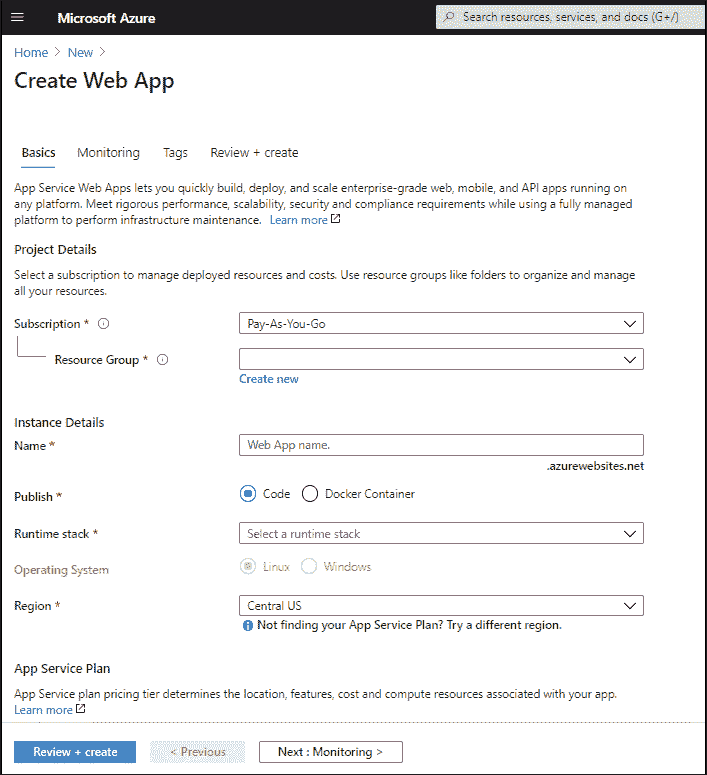
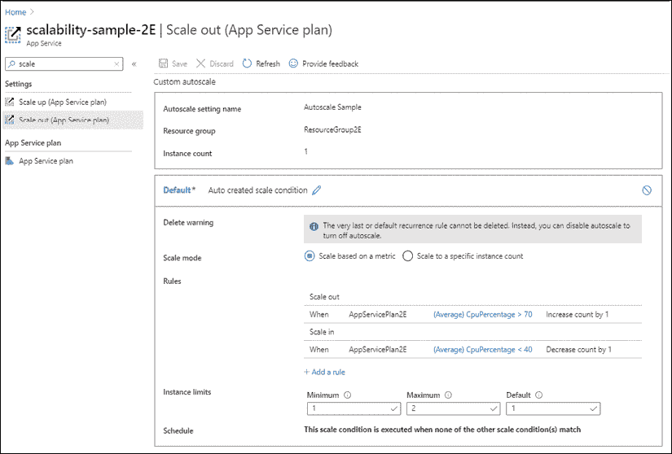
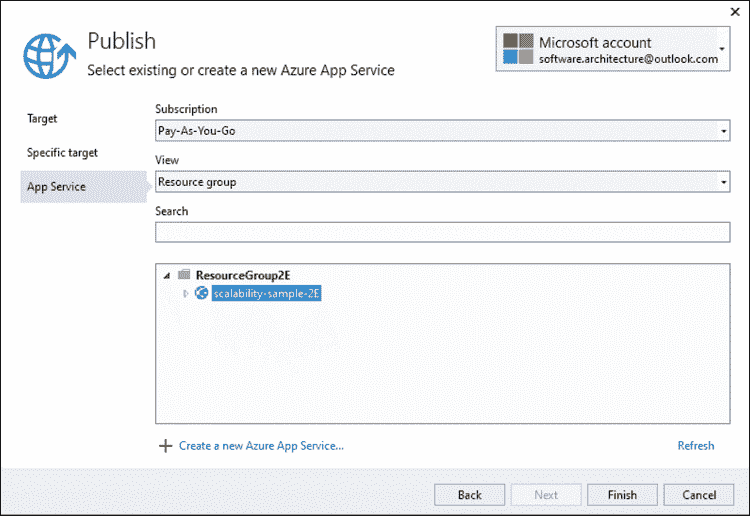
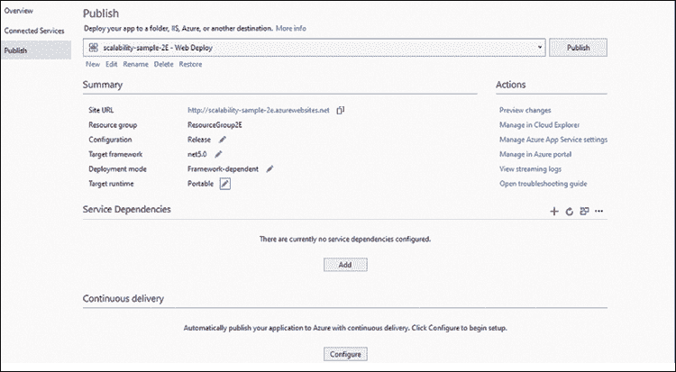
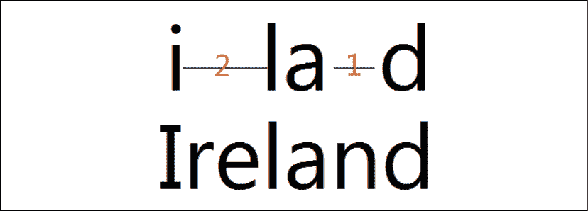
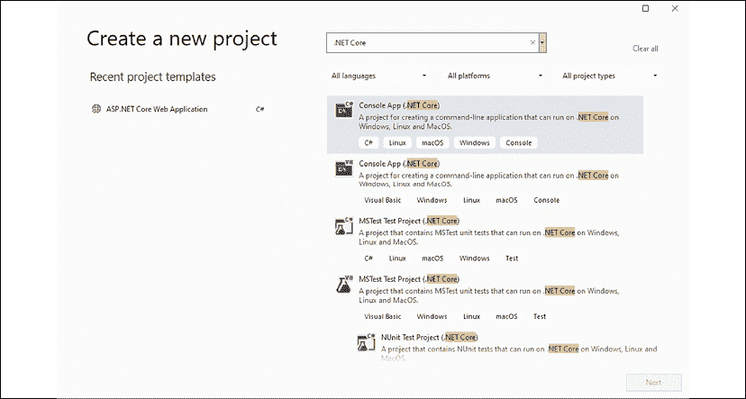

# 2.

# 非功能性需求

一旦收集了系统需求，就应该考虑它们对体系结构设计的影响。需要分析可伸缩性、可用性、弹性、性能、多线程、互操作性、安全性和其他主题，以便满足用户需求。我们将这些方面称为非功能性需求。

本章将介绍以下主题：

*   NET 5 和 Azure 如何实现可扩展性、可用性和恢复能力？
*   用 C 语言编程时需要考虑的性能问题#
*   软件可用性，即如何设计有效的用户界面
*   .NET5 与互操作性
*   通过设计实现安全性
*   书籍用例–了解.NET 核心项目的主要类型

# 技术要求

本章中提供的示例需要安装有.NET 5 SDK 的 Visual Studio 2019 社区版。

您可以在[找到本章的示例代码 https://github.com/PacktPublishing/Software-Architecture-with-C-9-and-.NET-5](https://github.com/PacktPublishing/Software-Architecture-with-C-9-and-.NET-5) 。

# 通过 Azure 和.NET 5 实现可扩展性、可用性和恢复能力

对可伸缩性的简短搜索会返回一个定义，例如*当需求*增加时，系统保持良好工作的能力。一旦开发人员阅读了这篇文章，他们中的许多人错误地得出结论*可伸缩性只意味着添加更多硬件以保持工作，而不停止应用*。

可扩展性依赖于涉及硬件解决方案的技术。然而，作为一名软件架构师，您必须意识到，好的软件将在可持续的模型中保持可伸缩性，这意味着一个架构良好的软件可以节省大量资金。因此，这不仅仅是一个硬件问题，也是一个整体软件设计的问题。这里的要点是，系统的运行成本也应该是架构决策中的一个因素。

在*第 1 章*中*理解了软件架构*的重要性，在讨论软件性能时，我们提出了一些克服性能问题的好技巧。同样的技巧也将帮助您实现可伸缩性。我们在每个进程上花费的资源越少，应用程序可以处理的用户就越多。

尽管可伸缩性很重要，但云计算应用程序必须设计为能够处理系统故障。每次您保证应用程序从故障中恢复，而不向最终用户公开此故障时，您就是在创建一个弹性应用程序。

您可以在[找到云架构弹性模式 https://docs.microsoft.com/en-us/azure/architecture/patterns/category/resiliency](https://docs.microsoft.com/en-us/azure/architecture/patterns/category/resiliency) 。

弹性在云场景中特别重要的原因是，提供给您的基础设施可能需要少量时间来管理更新、重置，甚至硬件升级。您也更可能使用多个系统，并且在与它们通信时可能会出现暂时性错误。这就是近年来这种非功能性需求开始传播的原因。

当您能够在系统中实现高可用性时，拥有可扩展和弹性解决方案的可能性变得更加令人兴奋。本书中介绍的所有方法都将指导您设计具有良好可用性的解决方案，但在某些情况下，您需要设计特定的替代方案来实现您的目标。

您可以在[找到云架构可用性模式 https://docs.microsoft.com/en-us/azure/architecture/patterns/category/availability](https://docs.microsoft.com/en-us/azure/architecture/patterns/category/availability) 。

值得一提的是，Azure 和.NET 5 web 应用程序可以配置为满足这些非功能性需求。让我们在下面的小节中检查一下。

## 在 Azure 中创建可扩展的 web 应用程序

在 Azure 中创建 web 应用程序非常简单，可以随时进行扩展。您必须这样做的原因是为了能够在不同的季节维护不同数量的用户。用户越多，需要的硬件就越多。让我们向您展示如何在 Azure 中创建可伸缩的 web 应用程序。

登录到 Azure 帐户后，您将能够创建新资源（web 应用程序、数据库、虚拟机等），如以下屏幕截图所示：

<figure class="mediaobject"></figure>

图 2.1:Microsoft Azure–创建资源

之后，您可以在**热门选项**中选择**网络应用**，甚至可以在**搜索市场**文本框中输入。此操作将带您进入以下屏幕：

<figure class="mediaobject"></figure>

图 2.2:Microsoft Azure–创建 web 应用程序

所需**项目详情**如下：

*   **订阅**：这是将收取所有申请费用的账户。
*   **资源组**：这是您可以定义用来组织策略和权限的资源集合。您可以指定新的资源组名称，或将 web 应用添加到定义其他资源时指定的组中。

除此之外，**实例详细信息**如下：

*   **名称**：如您所见，web 应用程序名称是您的解决方案创建后将采用的 URL。将检查名称以确保其可用。
*   **发布**：此参数表示是否直接交付 web app，或者是否使用 Docker 技术发布内容。Docker 将在*第 5 章**中进行更详细的讨论，将微服务架构应用于您的企业应用程序*。如果您选择 Docker 容器发布，您将能够配置**图像源**、**访问类型**以及**图像**和标签信息，以便将其部署到 web 应用程序。
*   **运行时堆栈**：显然，只有当您决定直接交付代码时，此选项才可用。在编写本章时，您可以为.NETCore、ASP.NET、Java11、Java8、Node、PHP、Python 和 Ruby 定义堆栈。
*   **操作系统**：这是定义将承载 web 应用程序的操作系统的选项。Windows 和 Linux 均可用于 ASP.NET 核心项目。
*   你可以考虑在哪里部署你的应用程序，考虑到 Azure 在世界各地有很多不同的数据中心。
*   **应用服务计划**：在这里定义用于处理 web 应用和服务器区域的硬件计划。此选项定义了应用程序的可扩展性、性能和成本。
*   **监控**：这是一个有用的 Azure 工具集，用于监控和排除 web 应用程序的故障。在本节中，您将能够启用应用程序洞察。始终建议您为解决方案的不同组件保留相同的区域，因为这将节省从一个数据中心到另一个数据中心的流量交换成本。

一旦您创建了您的 web 应用程序，此应用程序可能会以两种概念上不同的方式进行缩放：垂直**（向上缩放）**和水平**（向外缩放）**。正如您在以下屏幕截图中所看到的，这两个选项都可以在 web 应用程序设置中使用：

<figure class="mediaobject"></figure>

图 2.3：web 应用程序的缩放选项

让我们检查两种类型的缩放。

### 垂直缩放（放大）

放大意味着改变将承载应用程序的硬件规格。在 Azure 中，您有机会从免费共享的硬件开始，只需点击几下，就可以移动到一台独立的机器。以下屏幕截图显示了用于放大 web 应用程序的用户界面：

<figure class="mediaobject"></figure>

图 2.4：垂直缩放选项

通过选择提供的选项之一，您可以选择功能更强大的硬件（具有更多 CPU、存储器和 RAM 的机器）。监控您的应用程序及其应用程序服务计划将指导您如何决定运行正在验证的解决方案的最佳基础架构。它还将提供关键的见解，如可能的 CPU、内存和 I/O 瓶颈。

### 水平缩放（向外缩放）

向外扩展意味着在多个具有相同容量的服务器之间拆分所有请求，而不是使用更强大的机器。Azure 基础设施会自动平衡所有服务器上的负载。由于水平缩放可自动适应当前负载，因此建议在未来总负载可能发生较大变化时使用此解决方案。下面的屏幕截图显示了由两个简单规则定义的自动**扩展**策略，该策略由 CPU 使用情况触发：

<figure class="mediaobject"></figure>

图 2.5：水平缩放示例

值得强调的是，您可以选择硬编码实例计数或实现自动伸缩的规则。

对所有可用的自动称重规则的完整描述超出了本书的目的。然而，它们是不言自明的，*进一步阅读*部分包含完整文档的链接。

*横向扩展*功能仅在付费服务计划中可用。

一般来说，水平扩展是一种保证应用程序可用性的方法，即使同时进行多次访问也是如此。当然，使用它并不是保持系统可用的唯一方法，但它肯定会有所帮助。

## 使用.NET 5 创建可扩展的 web 应用程序

在所有可用于实现 web 应用的框架中，使用 ASP.NET Core 5运行它可以确保良好的性能，同时降低生产和维护成本。C#是一种强类型的高级通用语言，它与框架中不断实现的性能改进相结合，标志着近年来这一选项成为企业发展的最佳选择之一。

下面的步骤将指导您创建基于 ASP.NET Core Runtime 5 的 web 应用程序。所有步骤都很简单，但有些细节需要注意。

值得一提的是，.NET 5 为任何平台带来了开发机会——台式机（WPF、Windows 窗体和 UWP）、Web（ASP.NET）、云（Azure）、移动（Xamarin）、游戏（Unity）、IoT（ARM32 和 ARM64）和 AI（Apache Spark 的 ML.NET 和.NET）。因此，从现在开始，建议只使用.NET5。在这种情况下，您可以在 Windows 和更便宜的 Linux 服务器上运行 web 应用程序。

如今，微软推荐经典的.NET，以防你需要的功能在.NET Core 中不可用，甚至当你在不支持.NET Core 的环境中部署你的 web 应用时。在任何其他情况下，您都应该更喜欢.NET Core Framework，因为它允许您执行以下操作：

*   在 Windows、Linux、macOS 或 Docker 容器中运行 web 应用程序
*   使用微服务设计您的解决方案
*   具有高性能和可扩展的系统

容器和微服务将在*第 5 章**中介绍，将微服务架构应用于您的企业应用程序*。在那里，您将更好地了解这些技术的优势。现在，可以说.NET5 和微服务是为性能和可伸缩性而设计的，这就是为什么在所有新项目中都应该选择.NET5。

以下过程将演示如何在 Visual Studio 2019 中使用.NET 5 创建 ASP.NET 核心 web 应用程序：

*   一旦你开始 VS2019，你将能够点击**创建一个新项目**。
*   选择**ASP.NET 核心 Web 应用程序**后，系统将引导您进入一个屏幕，要求您设置**项目名称**、**位置**和**解决方案名称**：

    <figure class="mediaobject"></figure>

图 2.6：创建 ASP.NET 核心 web 应用程序

*   之后，您将能够选择要使用的.NET 版本。选择**ASP.NET Core 5.0**获得最先进的全新平台。对于本演示，您可以选择**Web 应用程序**模板。
*   现在我们已经完成了添加基本细节的工作，您可以将您的 web 应用程序项目连接到您的 Azure 帐户并发布它。
*   如果右键单击您创建的项目，在**解决方案资源管理器**中，您可以选择**发布**：

    <figure class="mediaobject"></figure>

图 2.7：发布 ASP.NET 核心 web 应用程序

*   您将找到不同的目标来发布您的 web 应用程序。选择**Azure**作为目标。
*   然后，您就可以决定要发布的**特定目标**。为此演示选择**Azure 应用程序服务（Windows）**。
*   此时可能需要您定义 Microsoft 帐户凭据。这是因为Visual Studio 和 Azure 之间完全集成。这使您有机会在您的开发环境中查看您在 Azure 门户中创建的所有资源：

    <figure class="mediaobject"></figure>

图 2.8:VisualStudio 和 Azure 之间的集成

*   一旦您决定了您的**发布**设置，即发布配置文件，当您点击**发布**时，web app 将自动发布。请注意此处选择 F1 定价层，以便此过程不会产生任何成本：

    <figure class="mediaobject"></figure>

图 2.9：发布配置文件选项

*   您当前有两种部署模式。第一个依赖于框架，需要使用目标框架配置 web 应用程序。第二个是自包含的，将不再需要此功能，因为框架的二进制文件将与应用程序一起发布。
*   值得一提的是，为了在依赖框架的模式下发布 ASP.NET 预览版本，您必须在 Azure Portal 的 web app 安装面板中添加一个扩展，如下图所示。但是，考虑使用自包含模式，特别是当你在预览版本下：

图 2.10：在 Azure Web App 服务中添加扩展

有关将 ASP.NET Core 5.0 部署到 Azure 应用程序服务的更多信息，请参阅以下链接：[https://docs.microsoft.com/en-us/aspnet/core/host-and-deploy/azure-apps/?view=aspnetcore-5.0&选项卡=visual studio](https://docs.microsoft.com/en-us/aspnet/core/host-and-deploy/azure-apps/?view=aspnetcore-5.0&tabs=vi)。

在这里，我们描述了部署 web 应用程序的最简单方法。在*第 20 章*、*理解 DevOps 原理*和*第 21 章*、*应用 CI 场景的挑战*中，我们将向您介绍Azure DevOps**持续集成/持续交付**（**CI/CD**管道。此管道是另一个Azure 工具集，它自动执行所有必要的步骤，以在生产中获得应用程序，即构建、测试、在暂存中部署和在生产中部署。

# 用 C 语言编程时需要考虑的性能问题#

如今，C#是世界上最常用的编程语言之一，因此关于 C#编程的好技巧是设计满足最常见的非功能性需求的良好体系结构的基础。

以下几节提到了一些简单但有效的技巧——相关的代码示例可在本书的 GitHub 存储库中找到。

## 字符串串联

这是一个经典的！使用`+`字符串运算符简单地连接字符串可能会导致严重的性能问题，因为每次连接两个字符串时，它们的内容都会复制到一个新字符串中。

因此，如果我们连接 10 个平均长度为 100 的字符串，第一个操作的成本为 200，第二个操作的成本为*200+100=300*，第三个操作的成本为*300+100=400*，等等。不难说服自己，总成本的增长就像*m***n*<sup class="Superscript--PACKT-">2</sup>，其中*n*是字符串的数量，*m*是它们的平均长度。*n*<sup class="Superscript--PACKT-">2</sup>对于小*n*（比如，*n*<10）来说不是太大，但是*n*达到 100-1000 量级时会变得相当大，10000-100000 量级是不可接受的。

让我们通过一些测试代码来了解这一点，它将简单的连接与在`StringBuilder`类帮助下执行的相同操作进行比较（代码可在本书的 GitHub 存储库中找到）：

<figure class="mediaobject"></figure>

图 2.11：串联测试代码结果

如果您使用类似于`var sb =new System.Text.StringBuilder()`的内容创建一个`StringBuilder`类，然后使用`sb.Append(currString)`将每个字符串添加到该类中，则不会复制这些字符串；相反，它们的指针在列表中排队。当您调用`sb.ToString()`以获得最终结果时，它们只在最终字符串中复制一次。因此，基于`StringBuilder-`的级联的成本简单地增长为*m*n*。

当然，你可能永远也找不到一个软件，它的函数类似于前一个连接 100000 个字符串的函数。但是，您需要识别与这些代码类似的代码片段，例如，在同时处理多个请求的 web 服务器中，20-100 个字符串的串联可能会导致瓶颈，从而损害您的非功能性性能需求。

## 例外情况

永远记住异常比正常的代码流慢得多！因此，`try-catch`的用法必须简洁、必要，否则会造成很大的性能问题。

以下两个示例比较了`try-catch`和`Int32.TryParse`的用法，以检查字符串是否可以转换为整数，如下所示：

```cs
private static string ParseIntWithTryParse()
{
    string result = string.Empty; 
    if (int.TryParse(result, out var value))
        result = value.ToString();
    else
        result = "There is no int value";
    return $"Final result: {result}";
}
private static string ParseIntWithException()
{
    string result = string.Empty;
    try
    {
        result = Convert.ToInt32(result).ToString();
    }
    catch (Exception)
    {
        result = "There is no int value";
    }
    return $"Final result: {result}";
} 
```

第二个功能看起来并不危险，但比第一个慢数千倍：

<figure class="mediaobject"></figure>

图 2.12：异常测试代码结果

综上所述，必须使用异常来处理破坏正常控制流的异常情况，例如，由于某些意外原因必须中止操作，并且必须在调用堆栈中向上返回多个级别的控制。

## 多线程环境可获得更好的结果–应做和不应做

如果你想利用你正在构建的系统提供的所有硬件，你必须使用多线程。这样，当线程等待操作完成时，应用程序可以将 CPU 留给其他线程，而不是浪费 CPU 时间。

另一方面，不管微软在这方面做得多么努力，并行代码并不像吃一块蛋糕那么简单：它容易出错，并且很难测试和调试。作为一名软件架构师，当您开始考虑使用线程时，最重要的一点是*您的系统是否需要它们？*非功能性需求和一些功能性需求将为您回答这个问题。

一旦确定需要多线程系统，就应该决定哪种技术更合适。这里有几个选项，如下所示：

*   **创建**`System.Threading.Thread`实例：这是 C#中创建线程的经典方式。整个线程生命周期将掌握在您手中。当您确定要做什么时，这是很好的，但是您需要担心实现的每一个细节。生成的代码很难构思和调试/测试/维护。因此，为了使开发成本可以接受，这种方法应该局限于几个基本的、性能关键的模块。
*   **使用**`System.Threading.Tasks.Parallel`**类**编程：自.NET Framework 4.0 以来，您可以使用并行类以更简单的方式启用线程。这很好，因为您不需要担心创建的线程的生命周期，但它会减少您对每个线程中发生的事情的控制。
*   **使用异步编程进行开发**：这无疑是开发多线程应用程序的最简单方法，因为编译器承担了大部分工作。根据您调用异步方法的方式，您可能会让创建的`Task`与用于调用它的`Thread`并行运行，甚至让这个`Thread`在不挂起的情况下等待创建的任务结束。这样，异步代码模仿了经典同步代码的行为，同时保留了一般并行编程的大部分性能优势：
    *   总体行为是确定性的，不依赖于每个任务完成所需的时间，因此不可再现的错误更难发生，并且生成的代码易于测试/调试/维护。是否将方法定义为异步任务是留给程序员的唯一选择；其他一切都由运行时自动处理。您唯一应该关心的是哪些方法应该具有异步行为。值得一提的是，将方法定义为`async`并不意味着它将在单独的线程上执行。您可以在[的一个很好的示例中找到有用的信息 https://docs.microsoft.com/en-us/dotnet/csharp/programming-guide/concepts/async/](https://docs.microsoft.com/en-us/dotnet/csharp/programming-guide/concepts/async/) 。
    *   在本书的后面，我们将提供一些异步编程的简单示例。有关异步编程及其相关模式的更多信息，请查看 Microsoft 文档（[中的*基于任务的异步模式*https://docs.microsoft.com/en-us/dotnet/standard/asynchronous-programming-patterns/task-based-asynchronous-pattern-tap](https://docs.microsoft.com/en-us/dotnet/standard/asynchronous-programming-patterns/task-based-asynch) ）。

无论你选择什么选项，作为一名软件架构师，你都必须注意一些应该做和不应该做的事情。详情如下:

*   **使用并发集合**（`System.Collections.Concurrent`）：一旦启动多线程应用程序，就必须使用这些集合。原因是您的程序可能会从不同的线程管理相同的列表、字典等。使用并发集合是开发线程安全程序最方便的选择。
*   **不要担心静态变量**：不能说在多线程开发中禁止使用静态变量，但您应该注意它们。同样，多个线程处理同一个变量会导致很多麻烦。如果用`[ThreadStatic]`属性修饰静态变量，每个线程将看到该变量的不同副本，从而解决了多个线程在同一个值上竞争的问题。但是，`ThreadStatic`变量不能用于额外的线程通信，因为一个线程写入的值不能被其他线程读取。在异步编程中，`AsyncLocal<T>`是这样做的选项。
*   **在多线程实现后测试系统性能**：线程使您能够充分利用硬件，但在某些情况下，写得不好的线程可能会浪费 CPU 时间，什么都不做！类似的情况可能会导致几乎 100%的 CPU 使用率和不可接受的系统减速。在某些情况下，可以通过在某些线程的主循环中添加一个简单的`Thread.Sleep(1)`调用来缓解或解决问题，以防止它们浪费太多 CPU 时间，但您需要对此进行测试。此实现的一个用例是 Windows 服务，它的后台运行许多线程。
*   不考虑多线程容易席语：多线程不像在一些 Ty2T2 语法实现中那样简单。在编写多线程应用程序时，您应该考虑诸如用户界面的同步、线程终止和协调等。在许多情况下，由于多线程的错误实现，程序停止正常工作。
*   **别忘了计划系统应有的线程数**：这一点特别重要，特别是对于 32 位程序。在任何环境中可以有多少线程是有限制的。当你设计你的系统时，你应该考虑这个问题。
*   **别忘了结束你的线程**：如果你没有每个线程的正确终止过程，你可能会在内存和处理泄漏方面遇到问题。

# 可用性–为什么插入数据花费太多时间

可伸缩性、性能提示和多线程是我们用来调整机器性能的主要工具。但是，您设计的系统的有效性取决于整个处理管道（包括人和机器）的总体性能。

作为一名软件架构师，你无法提高人的性能，但你可以通过设计一个有效的**用户界面**（**UI**）来提高人机交互的性能，即确保与人快速交互的用户界面，这反过来意味着：

*   用户界面必须易于学习，以便在目标用户学会快速操作之前减少学习和浪费时间。如果用户界面频繁更改，并且对于需要吸引尽可能多的用户的公共网站而言，此约束非常重要。
*   用户界面不得导致数据插入速度减慢；数据输入速度必须仅受用户打字能力的限制，而不受系统延迟或可避免的附加手势的限制。

值得一提的是，我们在市场上有用户体验专家。作为一名软件架构师，您必须决定什么时候它们对项目的成功至关重要。以下是设计*易学*用户界面的几个简单提示：

*   每个输入屏幕必须清楚地说明其用途。
*   使用用户的语言，而不是开发人员的语言。
*   避免并发症。在设计 UI 时要考虑到一般情况；更复杂的情况可以通过只在需要时出现的额外输入来处理。将复杂的屏幕拆分为更多的输入步骤。
*   使用过去的输入来理解用户意图，并通过消息和自动 UI 更改将用户置于正确的路径上；例如，级联下拉菜单。
*   错误消息不是系统给用户的坏消息，但它们必须解释如何插入正确的输入。

快速用户界面源于以下三个需求的有效解决方案：

*   输入字段必须按照通常填写的顺序放置，并且应该可以使用 Tab 键或 Enter 键移动到下一个输入。此外，经常保持为空的字段应该放在表单的底部。简单地说，填写表单时应尽量减少鼠标的使用。这样，用户手势的数量保持在最低限度。在 web 应用程序中，一旦确定了输入字段的最佳位置，就可以使用`tabindex`属性定义用户使用 Tab 键从一个输入字段移动到下一个输入字段的正确方式。
*   系统对用户输入的反应必须尽可能快。用户离开输入字段后，必须立即显示错误消息（或信息消息）。实现这一点的最简单方法是将大多数帮助和输入验证逻辑移动到客户端，这样系统反应就不需要通过通信线路和服务器。
*   有效的选择逻辑。选择现有项目应尽可能简单；例如，在报价中从数千种产品中选择一种产品，只需几个手势即可，无需记住确切的产品名称或条形码。下一小节将分析我们可以用来降低复杂性以实现快速选择的技术。

在*第 16 章**Blazor WebAssembly*中，我们将讨论这项微软技术如何帮助我们应对在前端使用 C#代码构建基于 web 的应用程序的挑战。

## 设计快速选择逻辑

当所有可能的选择都在 1-50 量级时，通常的下拉菜单就足够了。例如，此货币选择下拉菜单：

<figure class="mediaobject"></figure>

图 2.13：简单下拉菜单

当数量级较高但小于几千时，显示以用户键入的字符开头的所有项目名称的自动完成通常是一个不错的选择：

<figure class="mediaobject"></figure>

图 2.14：复杂下拉菜单

由于所有主数据库都可以有效地选择以给定子字符串开头的字符串，因此可以以较低的计算成本实现类似的解决方案。

当名称非常复杂时，当搜索用户键入的字符时，它们应该在每个项目字符串中扩展。通常的数据库无法有效地执行此操作，需要特殊的数据结构。

最后，当我们搜索由多个单词组成的内部描述时，需要更复杂的搜索模式。例如，产品描述就是这样。如果所选数据库支持全文搜索，系统可以在所有描述中高效地搜索用户键入的多个单词。

但是，当描述由名称而不是常用词组成时，用户可能很难记住目标描述中包含的几个确切名称。例如，多国公司名称就是如此。在这些情况下，我们需要能够为用户键入的字符找到最佳匹配的算法。必须在每个描述的不同位置搜索用户键入的字符串的子字符串。通常，基于索引的数据库无法有效地实现类似的算法，但需要将所有描述加载到内存中，并根据用户键入的字符串进行排序。

此类中最著名的算法可能是**Levenshtein**算法，大多数拼写检查器都使用该算法来查找最适合用户输入错误的单词。该算法最小化了描述和用户键入的字符串之间的 Levenshtein 距离，即将一个字符串转换为另一个字符串所需的最小字符删除和添加次数。

Levenshtein 算法非常有效，但计算量非常高。在这里，我们给出了一个更快的算法，可以很好地搜索描述中的字符出现。用户键入的字符不需要在描述中连续出现，但必须以相同的顺序出现。某些字符可能会丢失。每个描述都会受到惩罚，这取决于缺少的字符以及用户键入的字符与其他字符之间的距离。更具体地说，该算法使用两个数字对每个描述进行排序：

*   描述中用户键入的字符数：描述中包含的字符越多，其级别越高。
*   每个描述都会受到相当于用户在描述中键入的字符出现之间的总距离的惩罚。

以下屏幕截图显示了**爱尔兰**一词与用户键入的字符串**ilad**的排名：

<figure class="mediaobject"></figure>

图 2.15:Levenshtein 使用示例

出现次数为四（4），而角色出现之间的总距离为三（3）。

一旦对所有描述进行了评级，它们将根据出现的次数进行排序。出现次数相同的描述将根据最低惩罚进行排序。以下是实现上述算法的自动完成：

<figure class="mediaobject"></figure>

图 2.16:Levenshtein 算法用户界面体验

本书的 GitHub 存储库中提供了完整的类代码以及测试控制台项目。

## 从大量项目中选择

在这里，*巨大*并不是指存储数据所需的空间量，而是指用户难以记住每个项目的特征。当必须从 10000-100000 个项目中的中选择一个项目时，通过搜索描述中出现的字符来查找该项目是不可能的。在这里，必须通过类别层次结构将用户推向正确的项目。

在这种情况下，需要几个用户手势来执行单个选择。换句话说，每个选择都需要与多个输入字段进行交互。一旦确定不能使用单个输入字段进行选择，最简单的选项是级联下拉菜单，即一系列下拉菜单，其选择列表取决于在以前的下拉菜单中选择的值。

例如，如果用户需要选择位于世界任何地方的城镇，我们可以使用第一个下拉菜单来选择国家，一旦选择了国家，我们可以使用此选项将所选国家的所有城镇填充到第二个城镇中。一个简单的例子如下：

<figure class="mediaobject"></figure>

图 2.17：级联下拉菜单示例

显然，由于具有大量选项，在需要时，每个下拉菜单都可以替换为自动完成。

如果通过交叉几个不同的层次结构可以做出正确的选择，那么级联下拉菜单也会变得效率低下，我们需要一个过滤器表单，如下所示：

<figure class="mediaobject"></figure>

图 2.18：过滤形式示例

现在，让我们了解与.NET 核心的互操作性。

# 与.NET 核心的互操作性的奇妙世界

.NET Core 使 Windows 开发人员能够将其软件交付到各种平台。作为一名软件架构师，您需要注意这一点。Linux 和 macOS 不再是 C#爱好者的问题——比这要好得多——它们是向新客户交付产品的绝佳机会。因此，我们需要确保性能和多平台支持，这是多个系统中两个常见的非功能性需求。

在 Windows 中使用.NET 内核设计的控制台应用程序和 web 应用程序也几乎与 Linux 和 macOS 完全兼容。这意味着您无需再次构建应用程序，即可在这些平台上运行。此外，非常特定于平台的行为现在具有多平台支持，例如，`System.IO.Ports.SerialPort`类，它从.NET Core 3.0 开始，在 Linux 上。

Microsoft 提供脚本帮助您在 Linux 和 macOS 上安装.NET Core。您可以在[找到它们 https://docs.microsoft.com/dotnet/core/tools/dotnet-install-script](https://docs.microsoft.com/dotnet/core/tools/dotnet-install-script) 。一旦你安装了 SDK，你只需调用**dotnet**，就像在 Windows 中一样。

但是，您必须了解一些与 Linux 和 macOS 系统不完全兼容的功能。例如，这些操作系统中不存在与 Windows 注册表等效的系统，您必须自己开发一个替代系统。如果需要，加密的 JSON 配置文件是一个不错的选择。

另一个要点是 Linux 区分大小写，而 Windows 则不区分大小写。请在处理文件时记住这个。另一件重要的事情是 Linux 路径分隔符与 Windows 分隔符不同。您可以使用`Path.PathSeparator`字段和所有其他`Path`类成员来确保您的代码是多平台的。

此外，您还可以使用.NET Core 提供的运行时检查使代码适应底层操作系统，如下所示：

```cs
using System;
using System.Runtime.InteropServices;
namespace CheckOS
{
    class Program
    {
        static void Main()
        {
            if (RuntimeInformation.IsOSPlatform(OSPlatform.Windows))
                Console.WriteLine("Here you have Windows World!");
            else if(RuntimeInformation.IsOSPlatform(OSPlatform.Linux))
                Console.WriteLine("Here you have Linux World!");
            else if (RuntimeInformation.IsOSPlatform(OSPlatform.OSX))
                Console.WriteLine("Here you have macOS World!");
        }
    }
} 
```

## 在 Linux 中创建服务

以下脚本可用于在 Linux 中封装命令行.NET 核心应用程序。其想法是该服务的工作原理类似于 Windows 服务。考虑到大多数 Linux 安装都是命令行安装，并且在没有用户登录的情况下运行，这可能很有用：

*   第一步是创建一个运行命令行应用程序的文件。应用程序名称为`app.dll`，安装在`appfolder`中。应用程序将每 5000 毫秒检查一次。此服务是在 CentOS 7 系统上创建的。使用 Linux 终端，您可以键入以下内容：

    ```cs
    cat >sample.service<<EOF
    [Unit]
    Description=Your Linux Service
    After=network.target
    [Service]
    ExecStart=/usr/bin/dotnet $(pwd)/appfolder/app.dll 5000
    Restart=on-failure
    [Install]
    WantedBy=multi-user.target
    EOF 
    ```

*   创建文件后，必须将服务文件复制到系统位置。之后，您必须重新加载`system`并启用服务，以便在重新启动时重新启动：

    ```cs
    sudo cp sample.service /lib/systemd/system
    sudosystemctl daemon-reload 
    sudosystemctl enable sample 
    ```

*   完成！现在，您可以使用以下命令启动、停止和检查服务。您需要在命令行应用程序中提供的全部输入如下：

    ```cs
    # Start the service
    sudosystemctl start sample
    # View service status
    sudosystemctl status sample
    # Stop the service
    sudosystemctl stop sample 
    ```

现在我们已经了解了一些概念，让我们学习如何在用例中实现它们。

# 通过设计实现安全性

正如我们在书中看到的，我们开发软件的机会和技术是难以置信的。如果您在接下来的章节中添加所有您将阅读到的与云计算相关的信息，您将看到机会在增加，维护所有计算环境的复杂性也在增加。

作为一名软件架构师，您必须理解这些机会伴随着许多责任。在过去的几年里，世界发生了很大的变化。21 世纪的第二个十年需要大量的技术。应用程序、社交媒体、工业 4.0、大数据和人工智能不再是未来的目标，而主要是你将在日常工作中领导和处理的当前项目。

考虑到这种情况，安全性必须采用不同的方法。世界已经开始对管理个人数据的公司进行监管。例如，GDPR——通用数据保护条例——不仅在欧洲地区是强制性的，因为它改变了软件的开发方式，不仅在欧洲，而且在全球都是如此。考虑到您设计的软件将受到 GDPR 的影响，有许多与 GDPR 类似的计划必须纳入我们的技术和法规体系。

设计安全性必须是设计新应用程序的重点领域之一。这是一个庞大的主题，本书不会完全介绍它，但作为一名软件架构师，您必须了解在您的团队中有一名信息安全领域的专家的必要性，以保证避免网络攻击和维护机密性、隐私性、完整性所需的政策和实践，您构建的服务的真实性和可用性。

当谈到保护 ASP.NET 核心应用程序时，值得一提的是，该框架有许多功能可以帮助我们解决这一问题。例如，它包括身份验证和授权模式。在 OWASP 备忘单系列中，您将能够阅读许多其他.NET 实践。

开放 Web 应用安全项目®（OWASP）是一个非盈利的基础，它致力于提高软件的安全性。在[查看其信息 https://owasp.org/](https://owasp.org/) 。

ASP.NET 还提供了一些功能来帮助我们解决 GDPR 问题。基本上，有一些 API 和模板可以指导您实现策略声明和 cookie 使用许可。

## 实现安全体系结构的实践清单

以下与安全性相关的实践列表肯定没有涵盖整个主题。然而，作为软件架构师，这些实践肯定会帮助您探索与此主题相关的一些解决方案。

### 认证

为您的 web 应用定义身份验证方法。现在有很多认证选项可用，从 ASP.NET 核心身份到外部提供商认证方法，如 Facebook 或谷歌。作为软件架构师，您必须考虑应用程序的目标受众是谁。如果您选择走这条路，那么还值得考虑使用 Azure Active Directory 作为起点。

您可能会发现，设计与 Azure AD 关联的身份验证非常有用，Azure AD 是一个用于管理您所在公司的 Active Directory 的组件。这种替代方案在某些情况下非常好，特别是对于内部使用。Azure目前提供 Active Directory 作为**B2B**–**企业对企业**或**B2C**–**企业对消费者**使用。

根据您正在构建的解决方案的场景，您将需要实现**MFA**–**多因素身份验证**。此模式的思想是在允许使用解决方案之前，要求至少两种形式的身份证明。值得一提的是，Azure 广告为您提供了便利。

不要忘记，必须为您提供的 API 确定身份验证方法。JSON Web 令牌是一种非常好的模式，它的使用完全是跨平台的。

您必须确定将在 web 应用程序中使用的授权模型。有四种型号可供选择：

1.  **简单**，其中只需在类或方法中使用`[Authorize]`属性即可；
2.  **基于角色的**，其中您可以声明`Roles`访问您正在开发的`Controller`；
3.  **基于**的声明，您可以定义认证过程中必须接收的值，表示用户已被授权；
4.  **基于策略的**，其中在`Controller`中有一个定义访问的策略。

您还可以通过定义属性`[AllowAnonymous]`，将类中的控制器或方法定义为任何用户都可以完全访问。确保此类实现不会在您正在设计的系统中造成任何漏洞。

您决定使用的模型将精确定义每个用户在应用程序中能够做什么。

### 敏感数据

在设计过程中，作为一名软件架构师，您必须决定您存储的数据的哪一部分是敏感的，并且需要对其进行保护。通过连接到 Azure，您的 web 应用将能够在 Azure 存储和 Azure 密钥库等组件中存储受保护的数据。Azure 中的存储将在*第 9 章*、*如何选择云中的数据存储*中讨论。

值得一提的是，Azure Key Vault 用于保护应用程序可能拥有的机密。当你有这种需求时，考虑使用这个解决方案。

### 网络安全

在未启用 HTTPS 协议的情况下部署生产解决方案是完全不可接受的。Azure Web 应用程序和 ASP.NET 核心解决方案不仅可以使用，而且可以强制使用此安全协议。

Thera 是许多已知的攻击和恶意模式，例如跨站点请求伪造、开放重定向和跨站点脚本。ASP.NET 核心保证并提供 API 来解决这些问题。您需要检测对您的解决方案有用的。

要实现的另一个重要目标是良好的编程实践，例如通过在查询中使用参数来避免 SQL 注入。

您可以在[找到云架构安全模式 https://docs.microsoft.com/en-us/azure/architecture/patterns/category/security](https://docs.microsoft.com/en-us/azure/architecture/patterns/category/security) 。

最后，值得一提的是，需要使用洋葱方法来处理安全性，这意味着需要实现多个安全层。您必须有确定的策略，以保证访问数据的过程，包括对使用您正在开发的系统的用户的物理访问。此外，您还必须开发灾难恢复解决方案，以防系统受到攻击。灾难恢复解决方案将取决于您的云解决方案。我们稍后将在***第 4 章**中讨论这一点，以确定最佳的基于云的解决方案*。**

 **# 书籍用例–了解.NET 核心项目的主要类型

本书用例的开发将基于各种.NET 核心 VisualStudio 项目。本节介绍了所有这些问题。让我们在 Visual Studio**文件**菜单中选择**新项目**。

您可以通过在搜索引擎中键入来过滤**.NET 核心**项目类型，如下所示：

<figure class="mediaobject"></figure>

图 2.19：在 Visual Studio 中搜索.NET 核心项目的类型

在那里，您可以找到常见的 C#项目（控制台、类库、Windows 窗体、WPF）和各种类型的测试项目，每种项目都基于不同的测试框架：xUnit、NUnit 和 MSTest。在各种测试框架中进行选择只是一个偏好问题，因为它们都提供了类似的特性。将测试添加到构成解决方案的每一个软件中是一种常见的做法，它允许频繁修改软件而不损害其可靠性。

您可能还希望在**.NET 标准下定义类库项目，这将在*第 13 章*，*中讨论，在 C#9*中实现代码可重用性。这些类库基于使它们与多个.NET 版本兼容的标准。例如，基于 2.0 标准的库与大于或等于 2.0 的所有.NET 核心版本以及大于 4.6 的所有.NET Framework 版本兼容。这种兼容性优势的代价是可用功能更少。**

除了过滤**项目类型**到**云**之外，我们还有几个项目类型。其中一些将使我们能够定义微服务。基于微服务的体系结构允许将应用程序拆分为多个独立的微服务。同一微服务的多个实例可以创建并分布在多台机器上，以微调每个应用程序部分的性能。微服务将在以下章节中介绍：

*   *第 5 章**将微服务架构应用于企业应用*
*   *第 6 章*、*Azure 服务结构*
*   *第 7 章*、*天蓝 Kubernetes 服务*

最后，测试将在*第 18 章*、*使用单元测试用例和 TDD 测试代码*、*第 22 章*、*功能测试自动化*中详细讨论。最后，我们有一个 ASP.NET 核心应用程序，我们已经在*中描述了如何使用.NET 5*小节创建一个可伸缩的 web 应用程序。在这里，我们定义了一个 ASP.NET 核心应用程序，但 Visual Studio 还包含基于 RESTful API 和最重要的单页应用程序框架的项目模板，如 Angular、React、Vue.js 和基于 WebAssembly 的 Blazor 框架，这些将在*第 16 章**中讨论 Blazor WebAssembly*。其中一些可以通过标准 VisualStudio 安装获得，而另一些则需要安装 SPA 包。

# 总结

描述系统行为的功能性需求必须与约束系统性能、可伸缩性、可用性、弹性、互操作性、可用性和安全性的非功能性需求一起完成。

性能需求来自响应时间和系统负载需求。作为一名软件架构师，您应该确保以最低的成本获得所需的性能，构建高效的算法，并通过多线程充分利用可用的硬件资源。

可伸缩性是系统适应不断增加的负载的能力。系统可以通过提供更强大的硬件进行垂直扩展，也可以通过复制和负载平衡相同的硬件进行水平扩展，从而提高可用性。一般来说，云和 Azure 可以帮助我们动态实施战略，而无需停止您的应用程序。

在多个平台上运行的.NET Core 等工具可以确保互操作性，也就是说，您的软件能够在不同的目标机器上运行，并具有不同的操作系统（Windows、Linux、macOS、Android 等）。

可用性是通过考虑输入字段的顺序、项目选择逻辑的有效性以及系统的易学性来确保的。

此外，您的解决方案越复杂，其弹性就越强。恢复力的理念并不是保证解决方案不会失败。相反，这样做的目的是确保解决方案在软件的每个部分出现故障时都定义了一个动作。

作为软件架构师，您必须从设计的开始就考虑安全性。遵循指导原则来确定正确的模式，并在您的团队中配备一名安全专家，这将是实现我们现有所有法规的一个很好的选择。

在下一章中，您将了解 Azure DevOps 工具如何帮助我们收集、定义和记录需求。

# 问题

1.  缩放系统的两种概念方法是什么？
2.  您能否将 web 应用程序从 Visual Studio 自动部署到 Azure？
3.  多线程有什么用处？
4.  与其他多线程技术相比，异步模式的主要优势是什么？
5.  为什么输入字段的顺序如此重要？
6.  为什么.NET 核心`Path`类对互操作性如此重要？
7.  与.NET 核心类库相比，.NET 标准类库有什么优势？
8.  列出各种类型的.NET 核心 Visual Studio 项目。

# 进一步阅读

以下是一些你可以考虑阅读的书籍和链接，以便收集更多关于本章的信息：

*   [https://www.packtpub.com/virtualization-and-cloud/hands-azure-developers](https://www.packtpub.com/virtualization-and-cloud/hands-azure-developers)
*   [https://docs.microsoft.com/en-us/azure/architecture/best-practices/auto-scaling](https://docs.microsoft.com/en-us/azure/architecture/best-practices/auto-scaling)
*   [https://docs.microsoft.com/en-us/aspnet/core/host-and-deploy/azure-apps/](https://docs.microsoft.com/en-us/aspnet/core/host-and-deploy/azure-apps/)
*   [https://docs.microsoft.com/en-us/dotnet/standard/parallel-processing-and-concurrency](https://docs.microsoft.com/en-us/dotnet/standard/parallel-processing-and-concurrency)
*   [https://docs.microsoft.com/en-us/dotnet/standard/parallel-programming/](https://docs.microsoft.com/en-us/dotnet/standard/parallel-programming/)
*   [https://devblogs.microsoft.com/dotnet/performance-improvements-in-net-5/](https://devblogs.microsoft.com/dotnet/performance-improvements-in-net-5/)
*   [https://docs.microsoft.com/en-us/dotnet/standard/security/](https://docs.microsoft.com/en-us/dotnet/standard/security/)
*   [https://docs.microsoft.com/en-us/aspnet/core/security/](https://docs.microsoft.com/en-us/aspnet/core/security/)
*   [https://owasp.org/](https://owasp.org/)
*   [https://cheatsheetseries.owasp.org/cheatsheets/DotNet_Security_Cheat_Sheet.html](https://cheatsheetseries.owasp.org/cheatsheets/DotNet_Security_Cheat_Sheet.html)
*   [https://docs.microsoft.com/en-us/aspnet/core/security/gdpr](https://docs.microsoft.com/en-us/aspnet/core/security/gdpr)
*   [https://docs.microsoft.com/en-us/azure/architecture/patterns/category/resiliency](https://docs.microsoft.com/en-us/azure/architecture/patterns/category/resiliency)
*   [https://docs.microsoft.com/en-us/azure/architecture/patterns/category/availability](https://docs.microsoft.com/en-us/azure/architecture/patterns/category/availability)**