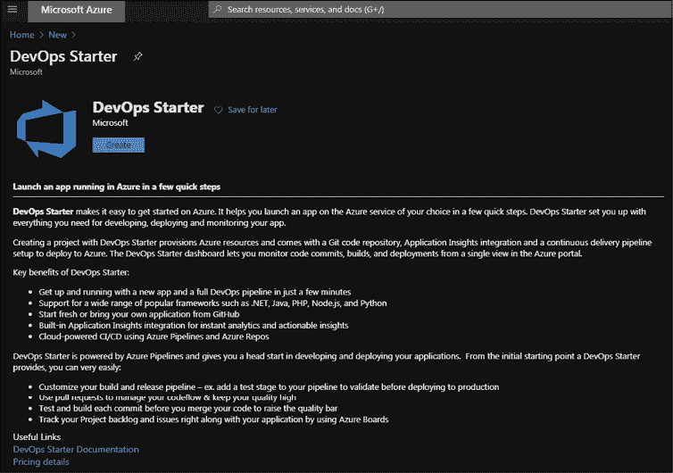
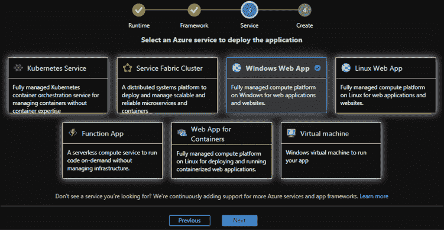
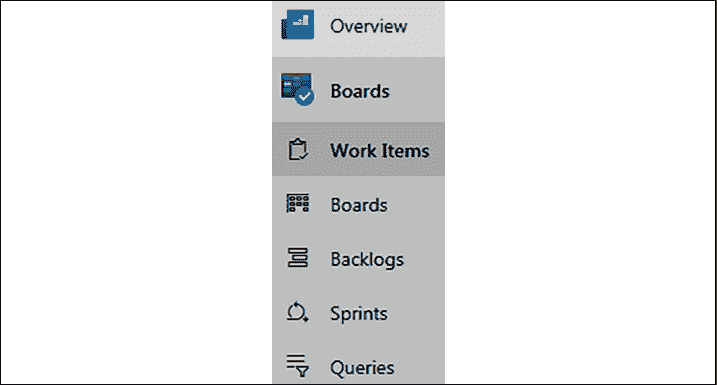
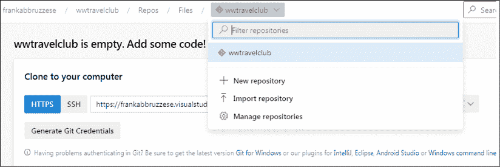
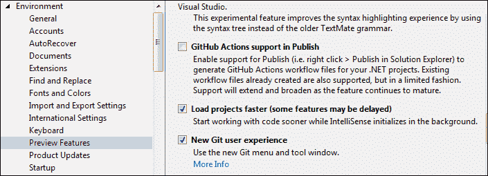
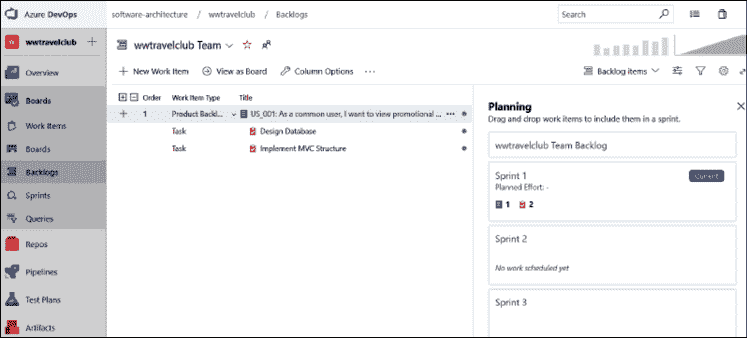

# 三、使用 Azure DevOps 记录需求

Azure DevOps 是 Visual Studio 团队服务的演变，它提供了多种新功能，可以帮助开发人员记录和组织他们的软件。本章旨在概述 Microsoft 提供的此工具。

本章将介绍以下主题：

*   使用 Azure 帐户创建 Azure DevOps 项目
*   了解 Azure DevOps 提供的功能
*   使用 Azure DevOps 组织和管理需求
*   在 Azure DevOps 中展示用例

本章的前两部分总结了 Azure DevOps 提供的所有功能，而其余部分则专门关注用于记录需求和支持整个开发过程的工具。前两部分中介绍的大部分功能将在其他章节中进行更详细的分析。

# 技术要求

本章要求您创建新的免费 Azure 帐户或使用现有帐户。*第一章**中的*创建 Azure 帐户*部分【了解软件架构的重要性*解释了如何创建 Azure 帐户。*Azure DevOps 存储库*小节还需要 Visual Studio 2019 社区版（免费）或更高版本。

# 介绍 Azure DevOps

Azure DevOps 是一个 Microsoft**软件即服务**（**SaaS**平台，使您能够为客户提供持续价值。通过在那里创建帐户，您将能够轻松地规划项目、安全地存储代码、测试代码、将解决方案发布到登台环境，然后将解决方案发布到实际的生产基础架构。

当然，Azure DevOps 是一个完整的框架，它为软件开发提供的生态系统目前是可用的。软件生产中所有步骤的自动化确保了现有解决方案的不断增强和改进，以使其适应市场需求。

您可以在 Azure 门户中启动流程移动。如果您不知道如何创建 Azure 门户帐户，请查看*第 1 章**了解软件架构*的重要性。创建 Azure DevOps 帐户的步骤非常简单：

1.  Select **Create a resource** and then **DevOps Starter**:

    <figure class="mediaobject"></figure>

    图 3.1:DevOps 初学者页面

2.  As soon as you start the wizard for creating the project, you can choose from several different platforms how you want to deliver your system. This is one of the greatest advantages of Azure DevOps, as you are not limited to Microsoft tools and products, but can rather choose from all common platforms, tools, and products available on the market:

    <figure class="mediaobject"></figure>

    图 3.2:DevOps 技术选择

3.  The options available will depend on the platform chosen in the first step. In some cases, you can choose from several deployment options, as you can see in the following screenshot, which appears if you select the .NET platform:

    <figure class="mediaobject"></figure>

    图 3.3:DevOps 技术选择，更多详细信息

    <figure class="mediaobject"></figure>

    图 3.4:DevOps 部署选项

4.  Once the setup is complete, you will be able to manage the project using the project portal according to the information you provided. It is worth mentioning that this wizard will create an Azure DevOps Service if you do not have one. Moreover, the resource selected for deployment is also automatically created, so for instance if you select **Windows Web App**, a web app will be created, and if you select **Virtual Machine**, a virtual machine will be created. The Azure DevOps organization is where you can organize all of your Azure DevOps projects. The whole process takes less than 20 minutes:

    <figure class="mediaobject"></figure>

    图 3.5:DevOps 与 Web 应用项目详细信息

    <figure class="mediaobject"></figure>

    图 3.6:DevOps 与虚拟机项目详细信息

5.  After that, you will be able to start planning your project. The following screenshot shows the page that appears once the Azure DevOps project creation is complete. In the remainder of this book, we will come back to this page several times to introduce and describe various useful features that ensure a faster and more efficacious deployment:

    <figure class="mediaobject"></figure>

    图 3.7:DevOps 项目页面

从前面的屏幕截图中可以看到，创建 Azure DevOps 帐户并开始开发同类最佳 DevOps 工具的过程非常简单。值得一提的是，只要团队中的开发人员不超过五名，再加上任何数量的利益相关者，您就可以免费开始使用这个奇妙的工具。

值得一提的是，利益相关者的数量没有限制，因为他们可以使用的功能非常有限。基本上，它们对板和工作项具有只读权限，修改它们的可能性非常有限。更具体地说，他们可以向工作项添加新的工作项和现有标记，并提供反馈。关于构建和发布，他们可以只批准发布（在撰写本书时，其他一些有限的功能正在预览中）。

# 使用 Azure DevOps 组织您的工作

DevOps 将在*第 20 章**理解 DevOps 原则*中详细讨论，但您需要将其理解为一种专注于向客户提供价值的理念。它是人、过程和产品的联合体，其中**持续集成和持续部署**（**CI/CD**方法用于对交付到生产环境的软件应用进行持续改进。Azure DevOps 是一个功能强大的工具，其应用范围包括应用初始开发及其后续 CI/CD 过程中涉及的所有步骤。

Azure DevOps 包含用于收集需求和组织整个开发过程的工具。可以通过单击 Azure DevOps 页面上的**Boards**菜单来访问它们，并将在接下来的两个部分中进行更详细的描述：

<figure class="mediaobject"></figure>

图 3.8：电路板菜单

Azure DevOps 中提供的所有其他功能将在以下小节中简要介绍。这些问题将在其他章节中详细讨论。更具体地说，CI 和构建/测试管道在*第 18 章*、*使用单元测试用例和 TDD 测试代码*、*第 21 章*、*应用 CI 场景的挑战*中进行了讨论，而 DevOps 原则和发布管道在*第 20 章*中进行了讨论，*理解 DevOps 原则*。

## Azure DevOps 存储库

**Repos**菜单项允许访问默认的 Git 存储库，您可以在其中放置项目代码：

<figure class="mediaobject"></figure>

图 3.9：回购协议菜单

点击**文件**项，进入默认存储库初始页面。它是空的，包含有关如何连接到此默认存储库的说明。

您可以通过页面顶部的下拉菜单进一步添加存储库：

<figure class="mediaobject"></figure>

图 3.10：添加新存储库

所有创建的存储库都可以通过相同的下拉菜单访问。

如前面的屏幕截图所示，每个存储库的初始页面都包含存储库地址和一个按钮，用于生成特定于存储库的凭据，因此您可以使用喜爱的 Git 工具连接到 DevOps 存储库。但是，您也可以通过非常简单的方式从 Visual Studio 内部进行连接：

1.  启动 Visual Studio 并确保您使用用于定义 DevOps 项目（或用于将您添加为团队成员）的相同 Microsoft 帐户登录。
2.  Select the **Team Explorer** tab and then click the connection button:

    <figure class="mediaobject"></figure>

    图 3.11：添加新存储库

3.  点击**连接。。。**Azure DevOps 的链接，您将了解如何与您的一个 Azure DevOps 项目建立连接。

一旦连接到 DevOps 远程存储库，就可以使用 Visual Studio Git 工具，还可以从 Visual Studio 中与其他 DevOps 功能交互。在编写本书时，交互的类型取决于 Visual Studio 选项中的**新 Git 用户体验**复选框设置：

<figure class="mediaobject"></figure>

图 3.12：新 Git 用户体验复选框

如果未选中此选项，您将获得“经典”Visual Studio 体验，使用 Team Explorer 访问 Git 和其他 DevOps 功能：

1.  Click the Team Explorer **Home** button. Now, you will see commands for performing Git operations and for interaction with other Azure DevOps areas:

    <figure class="mediaobject"></figure>

    图 3.13：团队资源管理器选项

2.  如果指定您初始化 DevOps 存储库，请创建一个启动解决方案，并通过单击**更改**按钮提交代码，然后按照后续说明进行操作。
3.  单击**同步**按钮将本地存储库与远程 Azure DevOps 存储库同步。
4.  一旦所有团队成员都使用前面的步骤初始化了他们的本地机器存储库和 Azure DevOps 存储库，您现在就可以打开 Visual Studio 了。在本地存储库中创建的解决方案将出现在**团队资源管理器**窗口的底部区域。
5.  单击窗口在本地计算机上打开解决方案。然后，与远程存储库同步，以确保所修改的代码是最新的。

相反，如果选中了**新建 Git 用户体验**复选框，则**团队资源管理器**窗口中的命令仅用于非 Git DevOps 操作，并且有一个**Open Git Changes**链接用于打开专用于 Git 操作的新窗口：

<figure class="mediaobject"></figure>

图 3.14：新团队资源管理器窗口

一旦转到此窗口，系统将要求您克隆或创建新的存储库。在这两种情况下，都会提示您提供远程 DevOps 存储库的地址。一旦创建了连接到远程 DevOps 存储库的本地存储库，您就可以开始使用新的 Git 窗口，该窗口提供了比经典团队资源管理器窗口更多的选项，并且通常提供了更完整的用户体验：

<figure class="mediaobject"></figure>

图 3.15:Git 更改窗口

当您有更改要提交时，您可以在窗口顶部的文本框中插入一条消息，并通过点击**提交所有**按钮本地提交更改，或者您也可以点击此按钮旁边的下拉菜单访问更多选项：

<figure class="mediaobject"></figure>

图 3.16：提交选项

您可以提交和推送，也可以提交和同步，但您也可以阶段性地进行更改。Git Changes 窗口右上角的三个箭头分别触发获取、拉动和推送。同时，窗口顶部的下拉列表负责分支上的操作：

<figure class="mediaobject"></figure>

图 3.17：分行业务

## 包馈送

**工件**菜单处理项目使用或创建的软件包。在那里，您可以为基本上所有类型的包定义提要，包括 NuGet、Node.js 和 Python。因为商业项目也使用私有包，所以需要私有提要，所以您需要一个放置它们的位置。此外，构建期间生成的包被放置在这些提要中，因此其他模块可以将它们作为依赖项立即使用它们。

进入**工件**区域后，点击**+创建提要**按钮可以创建多个提要，每个提要可以处理多种包，如*图 3.18*所示：

<figure class="mediaobject"></figure>

图 3.18：提要创建

如果您选择连接到来自公共来源的包的选项，默认情况下，提要连接到`npmjs`、`nuget.org`和`pypi.org`。但是，您可以转到**提要**设置页面中的上游源选项卡，删除/添加包源。单击提要页面右上角的设置图标可以访问设置页面。新创建的提要页面的屏幕截图如下：

<figure class="mediaobject"></figure>

图 3.19：提要页面

每个提要的**连接到提要**按钮都会显示一个窗口，说明每个包类型如何连接到提要。特别是，对于 NuGet 软件包，您应该将所有项目提要添加到 Visual Studio 项目“/solutions”`nuget.config`文件中，以便本地计算机也可以使用它们，否则，您的本地生成将失败：

<figure class="mediaobject"></figure>

图 3.20：馈电连接信息

## 测试计划

**测试计划**部分允许您定义要使用的测试计划及其设置。测试在*第 18 章*、*使用单元测试用例和 TDD 测试代码*、*第 22 章*、*功能测试自动化*中进行了详细讨论，但这里我们想总结一下 Azure DevOps 提供的机会。可通过**测试计划**菜单项访问与测试相关的操作和设置：

<figure class="mediaobject"></figure>

图 3.21：Feed 测试计划菜单

在此，您可以定义、执行和跟踪由以下内容组成的测试计划：

*   人工验收试验
*   自动单元测试
*   负荷试验

自动单元测试必须在 VisualStudio 解决方案中包含的测试项目中定义，并基于 NUnit、xUnit 和 MSTest 等框架（VisualStudio 对所有这些都有项目模板）。测试计划使您有机会在 Azure 上执行这些测试，并定义以下内容：

*   许多配置设置
*   何时执行它们
*   如何跟踪他们以及在整个项目文档中报告他们的结果

对于手动测试，您可以在项目文档中为操作员定义完整的说明，包括执行这些测试的环境（例如，操作系统）以及报告测试结果的位置。您还可以定义如何执行负载测试以及如何测量结果。

## 管道

管道是自动行动计划，指定从代码构建到软件部署投入生产的所有步骤。可在**管线**区域定义，可通过**管线**菜单项访问：

<figure class="mediaobject"></figure>

图 3.22：管道菜单

在那里，您可以定义要与其触发事件一起执行的任务的完整管道，其中包括代码构建、启动测试计划以及测试通过后的操作等步骤。

通常，在测试通过后，应用会自动部署到一个可以进行 beta 测试的临时区域。您还可以定义自动部署到生产的条件。此类标准包括但不限于以下内容：

*   应用进行 beta 测试的天数
*   在 beta 测试期间发现和/或通过上次代码更改删除的 bug 数量
*   由一名或多名经理/团队成员手动批准

标准决策将取决于公司希望管理正在开发的产品的方式。作为一名软件架构师，您必须理解，当涉及到将代码移动到生产环境时，越安全越好。

# 在 Azure DevOps 中管理系统需求

AzureDevOps 使您能够使用工作项记录系统需求。工作项作为可分配给个人的信息块存储在项目中。它们被分为各种类型，可能包含所需开发工作的度量、状态以及它们所属的开发阶段（迭代）。

DevOps 通常与敏捷方法相结合，因此 Azure DevOps 使用迭代，整个开发过程被组织为一组 Sprint。可用的工作项取决于您在创建 Azure DevOps 项目时选择的*工作项流程*。以下小节包含选择敏捷或**Scrum***工作项流程*时出现的最常见工作项类型的描述（默认为**敏捷**。

## 史诗作品

假设你正在开发一个由不同子系统组成的系统。您可能不会在一次迭代中总结整个系统。因此，我们需要一个跨越几个迭代的保护伞来封装每个子系统的所有特性。每个 Epic 工作项都代表了这些保护伞中的一个，可以包含在各种开发迭代中实现的几个特性。

在 Epic 工作项中，您可以定义状态和验收标准以及开始日期和目标日期。除此之外，您还可以提供优先级和工作量估算。所有这些详细信息都有助于利益相关者遵循开发过程。作为项目的宏观视图，这非常有用。

## 功能工作项

您在 Epic 工作项中提供的所有信息也可以放置在功能工作项中。因此，这两种类型的工作项之间的差异与它们所包含的信息类型无关，而是与它们的角色以及您的团队将达到的目标有关。Epic 可以跨越多个迭代，并且在功能之上具有层次结构，也就是说，每个 Epic 工作项都链接到几个子功能，而每个功能工作项通常在几个 sprint 中实现，并且是单个 Epic 工作项的一部分。

值得一提的是，所有工作项都有用于团队讨论的部分。在那里，您可以通过键入`@`字符在讨论区找到团队成员（就像在许多论坛/社交媒体应用中一样）。在每个工作项中，可以链接和附加各种信息。您还可以在特定部分中检查当前工作项的历史记录。

特征工作项是开始记录用户需求的地方。例如，您可以编写一个名为**访问控制**的特性工作项，以定义实现系统访问控制所需的完整功能。

## 产品待办事项/用户故事工作项

哪些工作项可用取决于所选的*工作项流程*。它们之间有一些细微的差别，但它们的目的基本相同。它们包含功能的详细要求，由它们所连接的功能工作项描述。更具体地说，每个产品待办事项/用户故事工作项指定单个功能的需求，该功能是其父功能工作项中描述的行为的一部分。例如，在系统访问控制的功能工作项中，用户和登录界面的维护应该是两个不同的用户故事/产品待办事项项。这些要求将指导其他子工作项的创建：

*   **任务**：这些是重要的工作项，描述了需要完成的工作，以满足父产品待办事项/用户故事工作项中规定的要求。任务工作项可以包含有助于团队能力管理和总体调度的时间估计。
*   **测试用例**：这些项目描述了如何测试需求描述的功能。

根据您使用的开发和测试场景，您将为每个产品待办事项/用户故事工作项创建的任务和测试用例的数量将有所不同。

# 用例–在 Azure DevOps 中呈现用例

本节以 WWTravelClub 为例，阐明了前一节中概述的概念。考虑到*第 1 章*中描述的场景*理解软件架构*的重要性，我们决定定义三个 Epic 工作项，如下所示：

<figure class="mediaobject"></figure>

图 3.23：用户案例史诗

这些工作项的创建非常简单：

1.  在每个工作项中，我们链接了不同类型的工作项，如*图 3.24*所示。
2.  It is really important to know that the connections between work items are really useful during software development. Hence, as a software architect, you have to provide this knowledge to your team and, more than that, you have to incentivize them to make these connections:

    <figure class="mediaobject"></figure>

    图 3.24：定义链接

3.  As soon as you create a Feature work item, you will be able to connect it to several Product Backlog work items that detail its specifications. The following screenshot shows the details of a Product Backlog work item:

    <figure class="mediaobject"></figure>

    图 3.25：产品待办事项工作项

4.  After that, Task and Test Case work items can be created for each Product Backlog work item. The user interface provided by Azure DevOps is really efficacious because it enables you to track the chain of functionalities and the relationships between them:

    <figure class="mediaobject"></figure>

    图 3.26：电路板视图

5.  一旦您完成了产品待办事项和任务工作项的输入，您将能够与您的团队一起规划项目冲刺。平面视图允许将产品积压工作项拖放到每个计划冲刺：

    <figure class="mediaobject"></figure>

图 3.27：待办事项视图

通过单击右侧的特定 sprint，您将只看到分配给该 sprint 的工作项。每个 sprint 页面与 backlog 页面非常相似，但包含更多选项卡：

<figure class="mediaobject"></figure>

图 3.28：用户案例史诗

左侧的 sprint 菜单也很有用，它允许每个用户立即跳转到他们所参与的所有项目的当前 sprint。

这就是创建这些工作项的方式。一旦您了解了这种机制，您将能够创建和规划任何软件项目。值得一提的是，该工具本身不会解决与团队管理相关的问题。但是，该工具是激励团队更新项目状态的一个很好的方法，因此您可以保持项目如何发展的清晰视角。

# 总结

本章介绍了如何为软件开发项目创建 Azure DevOps 帐户，以及如何开始使用 Azure DevOps 管理项目。它还简要回顾了所有 Azure DevOps 功能，解释了如何通过 Azure DevOps 主菜单访问这些功能。本章更详细地描述了如何管理系统需求，如何使用各种工作项组织必要的工作，以及如何规划和组织 Sprint，以提供具有多种功能的 epic 解决方案。

下一章将讨论软件架构的不同模型。我们还将了解在开发解决方案的基础设施时，从复杂云平台（如 Azure）提供的选项中进行选择的基本提示和标准。

# 问题

1.  Azure DevOps 是否仅适用于.NET 项目？
2.  Azure DevOps 中提供了什么样的测试计划？
3.  DevOps 项目可以使用私有 NuGet 包吗？
4.  我们为什么使用工作项？
5.  Epics 和 Features 工作项之间的区别是什么？
6.  任务和产品待办事项/用户故事工作项之间存在何种关系？

# 进一步阅读

这里有一些你可以考虑阅读的书籍和链接，以收集更多关于这一章的信息：

*   [https://go.microsoft.com/fwlink/?LinkID=825688](https://go.microsoft.com/fwlink/?LinkID=825688)
*   [https://www.packtpub.com/virtualization-and-cloud/hands-devops-azure-video](https://www.packtpub.com/virtualization-and-cloud/hands-devops-azure-video)
*   [https://www.packtpub.com/application-development/mastering-non-functional-requirements](https://www.packtpub.com/application-development/mastering-non-functional-requirements)