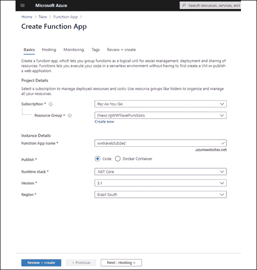
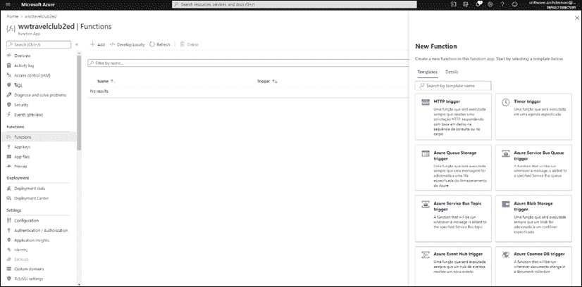
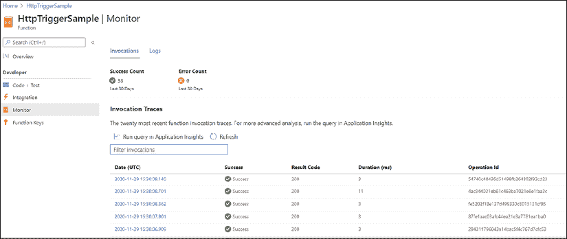
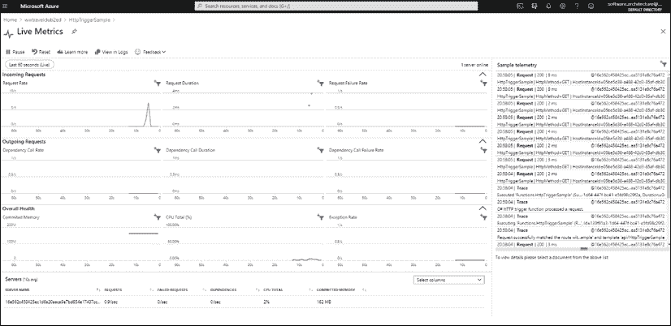
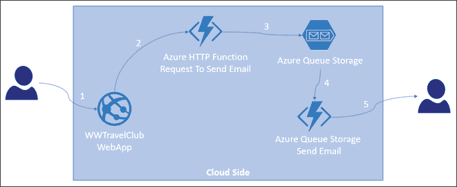
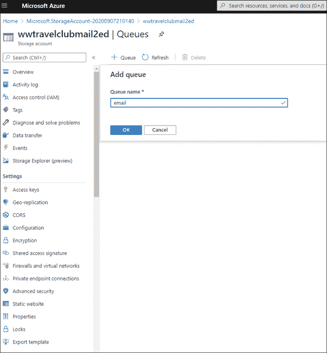
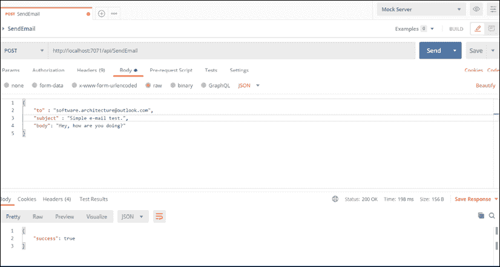
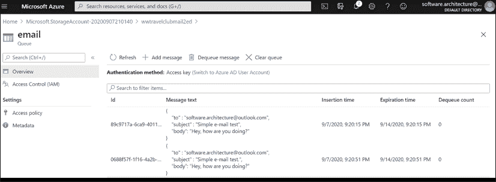

# 10

# 使用 Azure 函数

正如我们在*第 4 章*中提到的*决定了最佳的基于云的解决方案*，无服务器架构是提供灵活软件解决方案的最新方式之一。为此，Microsoft Azure 提供 Azure 功能，这是一种事件驱动、无服务器和可扩展的技术，可加速项目开发。本章的主要目标是让您熟悉 Azure 功能以及在使用它时可以实现的最佳实践。值得一提的是，Azure 函数的使用是一个很好的替代方案，可以让无服务器实现加速您的开发。使用它们，您可以更快地部署 API，启用由计时器触发的服务，甚至通过从存储接收事件来触发进程。

在本章中，我们将介绍以下主题：

*   了解 Azure 应用程序的功能
*   使用 C 语言编程 Azure 函数#
*   维护 Azure 功能
*   用例–实现 Azure 功能以发送电子邮件

在本章结束时，您将了解如何在 C#中使用 Azure 函数来加快开发周期。

# 技术要求

本章要求您具备以下条件：

*   Visual Studio 2019 免费社区版或更高版本，安装了所有 Azure 工具。
*   免费的 Azure 帐户。*第一章**中的*创建 Azure 帐户*部分【了解软件架构的重要性*解释了如何创建 Azure 帐户。

您可以在[找到本章的示例代码 https://github.com/PacktPublishing/Software-Architecture-with-C-9-and-.NET-5/tree/master/ch10](https://github.com/PacktPublishing/Software-Architecture-with-C-9-and-.NET-5/tree/master/ch10) 。

# 了解 Azure 应用程序的功能

Azure Functions 应用程序是一个 Azure PaaS，您可以在其中构建代码（函数）并将它们连接到您的应用程序，并使用触发器启动它们。这个概念非常简单——你用你喜欢的语言构建一个函数，然后决定启动它的触发器。您可以在系统中编写任意数量的函数。在某些情况下，系统完全由函数编写。

创建必要环境的步骤与创建函数本身所需的步骤一样简单。以下屏幕截图显示了创建环境时必须确定的参数。在 Azure 中选择**创建资源**并通过**功能 App**进行过滤后，点击**创建**按钮，会出现如下画面：

<figure class="mediaobject"></figure>

图 10.1：创建 Azure 函数

在创建 Azure 函数环境时，需要考虑几个关键点。运行函数的可能性不断增加，编程语言选项和发布样式也是如此。我们拥有的最重要的配置之一是托管计划，这是您运行功能的地方。托管计划有三个选项：消费（无服务器）、高级和应用程序服务计划。现在我们来谈谈这些。

## 消费计划

如果您选择消耗计划，则您的函数仅在执行时消耗资源。这意味着您将只在功能运行时收取费用。可扩展性和内存资源将由 Azure 自动管理。这就是我们所说的无服务器。

在这个计划中编写函数时，我们需要注意的是超时。默认情况下，5 分钟后，功能将超时。您可以使用`host.json`文件中的`functionTimeout`参数更改超时值。最大值为 10 分钟。

当您选择消费计划时，收费方式将取决于您执行的内容、执行时间和内存使用情况。更多信息可参见[https://azure.microsoft.com/en-us/pricing/details/functions/](https://azure.microsoft.com/en-us/pricing/details/functions/) 。

请注意，当您的环境中没有应用程序服务，并且您正在以低周期运行功能时，这可能是一个不错的选择。另一方面，如果您需要连续处理，您可能需要考虑应用程序服务计划。

## 保险费计划

取决于你使用你的函数，特别是如果他们需要连续运行艺龙网或几乎连续，或者如果一些函数执行需要超过 10 分钟，你可能想考虑一个保费计划。此外，您可能需要将功能连接到 VNET/VPN 环境，在这种情况下，您将被迫在此计划中运行。

您还可能需要比消耗计划提供的更多的 CPU 或内存选项。高级计划为您提供了一个核心、两个核心和四个核心实例选项。

值得一提的是，即使运行函数的时间不受限制，如果您决定使用 HTTP 触发器函数，230 秒是响应请求所允许的最大时间。这是一个限制的原因与 Azure 负载平衡器有关。在这种情况下，您可能需要重新设计您的解决方案，以遵守 Microsoft（[中规定的最佳实践 https://docs.microsoft.com/en-us/azure/azure-functions/functions-best-practices](https://docs.microsoft.com/en-us/azure/azure-functions/functions-best-practices) 。

## 应用服务计划

当您想要创建 Azure 功能应用程序时，应用程序服务计划是您可以选择的选项之一。以下是为什么您应该使用应用程序服务计划而不是消费计划来维护您的功能的原因列表（由 Microsoft 建议）：

*   您可以使用未充分利用的现有应用程序服务实例。
*   您想在自定义图像上运行函数应用程序。

在应用服务计划场景中，`functionTimeout`值根据 Azure 函数运行时版本而变化。但是，该值至少为 30 分钟。您可以在[处找到每个消费计划中超时的表格比较 https://docs.microsoft.com/en-us/azure/azure-functions/functions-scale#timeout](https://docs.microsoft.com/en-us/azure/azure-functions/functions-scale#timeout) 。

# 使用 C 语言编程 Azure 函数#

在本节中，您将学习如何创建 Azure 函数。值得一提的是，使用 C#创建它们有多种方法。第一个是通过创建函数并在 Azure 门户本身中开发它们。要做到这一点，让我们考虑，您已经创建了一个 Azure 函数应用程序与 Tyl T1。

通过选择创建的资源并导航到**功能**菜单，您将能够**向该环境添加**新功能，如以下屏幕截图所示：

<figure class="mediaobject"></figure>

图 10.2：添加函数

在这里，您需要决定要用于启动执行的触发器的类型。最常用的是**HTTP 触发器**和**定时器触发器**。第一个允许创建将触发函数的 HTTP API。第二种方法是，根据您的决定，定时器将触发功能。

决定要使用的触发器时，必须命名函数。根据您决定的触发器，您必须设置一些参数。例如，HTTP 触发器要求您设置授权级别。有三个选项可用，即**功能**、**匿名**、**管理员**：

<figure class="mediaobject"></figure>

图 10.3：配置 HTTP 功能

值得一提的是，本书并未涵盖建筑功能的所有选项。作为软件架构师，您应该了解 Azure 在功能方面为无服务器架构提供了良好的服务。这在几种情况下都很有用。这一点在*第 4 章**中进行了更详细的讨论，以确定最佳的基于云的解决方案*。

结果如下。请注意，Azure 提供了一个编辑器，允许我们运行代码、检查日志和测试我们创建的函数。这是测试和编码基本功能的良好界面：

<figure class="mediaobject"></figure>

图 10.4:HTTP 功能环境

然而，如果你想创建更复杂的函数，你可能需要一个更复杂的环境，这样你可以更有效地编码和调试它们。这就是 VisualStudioAzure 功能项目可以帮助您的地方。此外，使用 VisualStudio 执行函数的开发将使您朝着为函数使用源代码管理和 CI/CD 的方向前进。

在 Visual Studio 中，您可以通过转到**创建新项目**来创建专用于 Azure 功能的项目：

<figure class="mediaobject"></figure>

图 10.5：在 VisualStudio2019 中创建 Azure 功能项目

一旦您提交了您的项目，Visual Studio将询问您正在使用的触发器类型以及您的函数将运行的 Azure 版本：

<figure class="mediaobject"></figure>

图 10.6：创建新的 Azure 功能应用程序

值得一提的是，Azure 函数支持不同的平台和编程语言。在撰写本文时，Azure 函数有三个运行时版本，C#可以在所有这些版本中运行。第一个版本与.NET Framework 4.7 兼容。在第二种方法中，您可以创建在.NETCore2.2 上运行的函数。在第三个版本中，您将能够运行.NETCore3.1 和.NET5。

作为软件架构师，您必须牢记代码的可重用性。在这种情况下，您应该注意您将决定在哪个版本的 Azure Functions Project 中构建您的函数。但是，始终建议在运行时获得通用可用性状态后立即使用最新版本的运行时。

默认情况下，生成的代码类似于在 Azure 门户中创建 Azure 函数时生成的代码：

```cs
using System;
using Microsoft.Azure.WebJobs;
using Microsoft.Extensions.Logging;
namespace FunctionAppSample
{
    public static class FunctionTrigger
    {
        [FunctionName("FunctionTrigger")]
        public static void Run([TimerTrigger("0 */5 * * * *")]
            TimerInfo myTimer, ILogger log)
        {
             log.LogInformation($"C# Timer trigger function " +
                 $"executed at: {DateTime.Now}");
        }
    }
} 
```

发布方法的步骤与我们在*第 1 章**理解软件架构*中描述的 web 应用发布过程相同。但是，始终建议使用 CI/CD 管道，正如我们将在*第 20 章**理解 DevOps 原则*中所述。

## 列出 Azure 函数模板

Azure 门户中有几个模板可用于创建 Azure 功能。您可以选择的模板数量不断更新。以下仅是其中的一部分：

*   **Blob 触发器**：您可能希望在将某个文件上载到您的 Blob 存储后立即处理该文件的某些内容。这是 Azure 函数的一个很好的用例。
*   **Cosmos DB Trigger**：您可能希望使用处理方法同步 Cosmos DB 数据库中的数据。Cosmos DB 在*第 9 章*、*如何选择云中的数据存储*中进行了详细讨论。
*   **事件网格触发器**：这是管理 Azure 事件的好方法。可以触发功能，以便管理每个事件。
*   **事件中心触发器**：使用此触发器，您可以构建链接到向 Azure 事件中心发送数据的任何系统的函数。
*   **HTTP 触发器**：此触发器用于构建无服务器 API 和 web app 事件。
*   **物联网集线器触发器**：当您的应用程序通过使用物联网集线器连接到设备时，您可以在其中一个设备接收到新事件时使用此触发器。
*   **队列触发器**：您可以使用功能作为服务解决方案来处理队列处理。
*   **服务总线队列触发器**：这是另一种消息服务，可以作为功能的触发器。Azure 服务总线将在*第 11 章*、*设计模式和.NET 5 实现*中详细介绍。
*   **定时器触发器**：这通常与函数一起使用，是您指定时间触发器的地方，以便您可以连续处理来自系统的数据。

# 维护 Azure 功能

一旦你创建并编程了你的功能，你需要监控和维护它。为此，您可以使用各种工具，所有这些工具都可以在 Azure 门户中找到。这些工具将帮助您解决问题，因为您可以使用它们收集大量信息。

监控功能的第一个选项是使用 Azure 门户中 Azure 功能界面内的**监控**菜单。在那里，您将能够检查所有函数执行情况，包括成功结果和失败：

<figure class="mediaobject"></figure>

图 10.7：监控功能

需要大约 5 分钟才能获得任何结果。网格中显示的日期是 UTC 时间。

通过点击应用程序洞察中的**运行查询，同一界面允许您连接到此工具。这将带你进入一个几乎无限选项的世界，你可以用它来分析你的函数数据。Application Insights 是目前可用的最好的**应用程序性能管理**（**APM**系统之一：**

<figure class="mediaobject"></figure>

图 10.8：使用应用程序洞察进行监控

除了查询界面之外，您还可以使用 Azure 门户中的 Insights 界面检查功能的所有性能问题。在那里，您可以分析和筛选解决方案接收到的所有请求，并检查它们的性能和相关性。您还可以在某个端点发生异常时触发警报：

<figure class="mediaobject"></figure>

图 10.9：使用 Application Insights Live Metrics 进行监控

作为一名软件架构师，您将在这个工具中找到一个很好的项目日常助手。值得一提的是，Application Insights 可用于其他几种 Azure 服务，如 web 应用程序和虚拟机。这意味着您可以监控系统的运行状况，并使用 Azure 提供的出色功能对其进行维护。

# 用例–实现 Azure 功能以发送电子邮件

在这里，我们将使用前面描述的 Azure 组件的子集。WWTravelClub 的用例建议在全球范围内实现该服务，该服务可能需要不同的架构设计来面对我们在*第 1 章*中描述的所有性能关键点，*理解软件架构*的重要性。

如果您回顾*第 1 章**中描述的用户故事，了解软件架构*的重要性，您会发现许多需求都与通信相关。因此，解决方案中通常会通过电子邮件提供一些警报。本章的用例将重点介绍如何发送电子邮件。该体系结构将完全没有服务器。

下图显示了体系结构的基本结构。为了给用户一个良好的体验，应用程序发送的所有电子邮件都将异步排队，从而防止系统响应出现重大延迟：

<figure class="mediaobject"></figure>

图 10.10：发送电子邮件的架构设计

请注意，没有任何服务器管理 Azure 功能，用于将来自 Azure 队列存储的消息排队或退队。这正是我们所说的无服务器。值得一提的是，该体系结构不仅限于发送电子邮件，还可以用于处理任何 HTTP`POST`请求。

现在，我们将学习如何在 API 中设置安全性，以便只有经过授权的应用程序才能使用给定的解决方案。

## 第一步–创建 Azure 队列存储

在 Azure 门户中创建存储非常简单。让我们学习如何。首先，您需要通过单击 Azure 门户主页中的**创建资源**并搜索**存储帐户**来创建存储帐户。然后，您可以设置其基本信息，如**存储账号名称**和**位置**。如下图所示，有关**联网**和**数据保护**的信息也可以在向导中查看。这些设置有默认的值，将覆盖演示：

<figure class="mediaobject"></figure>

图 10.11：创建 Azure 存储帐户

一旦您有了存储帐户，就可以设置队列了。您可以通过点击存储帐户中的**概览**链接并选择**队列**选项，或者通过存储帐户菜单选择**队列**来找到此选项。然后，您会发现一个添加队列的选项（**+队列**），您只需要提供其名称：

<figure class="mediaobject"></figure>

图 10.12：定义用于监视电子邮件的队列

创建的队列将为您提供 Azure 门户的概览。在那里，您将找到队列的 URL 并使用存储资源管理器：

<figure class="mediaobject"></figure>

图 10.13：创建的队列

请注意，您还可以使用 Microsoft Azure storage资源管理器（[将连接到此存储 https://azure.microsoft.com/en-us/features/storage-explorer/](https://azure.microsoft.com/en-us/features/storage-explorer/) ：

<figure class="mediaobject"></figure>

图 10.14：使用 Microsoft Azure Storage Explorer 监视队列

如果您未连接到 Azure 门户，此工具尤其有用。

## 第二步-创建发送电子邮件的功能

现在，您可以认真地开始编程，通知队列正在等待发送一封电子邮件。这里，我们需要使用 HTTP 触发器。请注意，该函数是一个异步运行的静态类。以下代码正在收集来自 HTTP 触发器的请求数据，并将数据插入稍后将处理的队列中：

```cs
public static class SendEmail
{
    [FunctionName(nameof(SendEmail))]
    public static async Task<HttpResponseMessage>RunAsync( [HttpTrigger(AuthorizationLevel.Function, "post")] HttpRequestMessage req, ILogger log)
    {
        var requestData = await req.Content.ReadAsStringAsync();
        var connectionString = Environment.GetEnvironmentVariable("AzureQueueStorage");
        var storageAccount = CloudStorageAccount.Parse(connectionString);
        var queueClient = storageAccount.CreateCloudQueueClient();
        var messageQueue = queueClient.GetQueueReference("email");
        var message = new CloudQueueMessage(requestData);
        await messageQueue.AddMessageAsync(message);
        log.LogInformation("HTTP trigger from SendEmail function processed a request.");
        var responseObj = new { success = true };
        return new HttpResponseMessage(HttpStatusCode.OK)
        {
            Content = new StringContent(JsonConvert.SerializeObject(responseObj), Encoding.UTF8, "application/json"),
         };
    }
} 
```

在某些场景中，您可以尝试使用队列输出绑定来避免前面代码中指示的队列设置。查看[中的详细信息 https://docs.microsoft.com/en-us/azure/azure-functions/functions-bindings-storage-queue-output?tabs=csharp](https://docs.microsoft.com/en-us/azure/azure-functions/functions-bindings-storage-queue-output?tabs=) 。

通过运行 Azure Functions Emulator，您可以使用诸如 Postman 之类的工具来测试您的功能：

<figure class="mediaobject"></figure>

图 10.15：邮差功能测试

结果将显示在 Microsoft Azure 存储资源管理器和 Azure 门户中。在 Azure 门户中，您可以管理每条消息并将每条消息出列，甚至清除队列存储：

<figure class="mediaobject"></figure>

图 10.16:HTTP 触发器和队列存储测试

## 第三步–创建队列触发器函数

在此之后，您可以创建第二个函数。此选项将由进入您的队列的数据触发。值得一提的是对于 Azure Functions v3，您将自动将`Microsoft.Azure.WebJobs.Extensions.Storage`库添加为 NuGet 引用：

<figure class="mediaobject"></figure>

图 10.17：创建队列触发器

一旦您在`local.settings.json`中设置了连接字符串，您就可以运行这两个函数并使用 Postman 测试它们。不同之处在于，在第二个函数运行时，如果在其开头设置断点，则将检查消息是否已发送：

<figure class="mediaobject"></figure>

图 10.18:Visual Studio 2019 中触发的队列

从这一点来看，发送电子邮件的方式将取决于您拥有的邮件选项。您可以决定使用代理或直接连接到您的电子邮件服务器。

通过这种方式创建电子邮件服务有几个优点：

*   一旦您的服务经过编码和测试，您就可以使用它从任何应用程序发送电子邮件。这意味着您的代码始终可以重用。
*   由于在 HTTP 服务中发布的异步优势，使用此服务的应用程序不会停止发送电子邮件。
*   您不需要汇集队列来检查数据是否已准备好进行处理。

最后，队列进程并行运行，这在大多数情况下提供了更好的体验。可以通过在`host.json`中设置一些属性将其关闭。所有选项可在本章末尾的*进一步阅读*一节中找到。

# 总结

在本章中，我们介绍了使用无服务器 Azure 函数开发功能的一些优势。您可以将其用作检查 Azure 函数中可用的不同类型触发器以及计划如何监视它们的指南。我们还了解了如何编程和维护 Azure 功能。最后，我们看了一个架构示例，在该架构中，您可以连接多个函数以避免数据池并启用并发处理。

在下一章中，我们将分析设计模式的概念，了解它们为何如此有用，并了解一些常见的模式。

# 问题

1.  什么是 Azure 功能？
2.  Azure 函数的编程选项是什么？
3.  可以与 Azure 功能一起使用的计划是什么？
4.  如何使用 Visual Studio 部署 Azure 功能？
5.  您可以使用哪些触发器来开发 Azure 功能？
6.  Azure 功能 v1、v2 和 v3 之间有什么区别？
7.  Application Insights 如何帮助我们维护和监控 Azure 功能？

# 进一步阅读

如果您想了解有关创建 Azure 功能的更多信息，请查看以下链接：

*   Azure 功能规模和托管：[https://docs.microsoft.com/en-us/azure/azure-functions/functions-scale](https://docs.microsoft.com/en-us/azure/azure-functions/functions-scale)
*   *Azure 功能–精华【视频】*，作者：Praveen Kumar Sreeram:[https://www.packtpub.com/virtualization-and-cloud/azure-functions-essentials-video](https://www.packtpub.com/virtualization-and-cloud/azure-functions-essentials-video)
*   Azure 函数运行时概述：[https://docs.microsoft.com/en-us/azure/azure-functions/functions-versions](https://docs.microsoft.com/en-us/azure/azure-functions/functions-versions )
*   Azure 事件网格概述：[https://azure.microsoft.com/en-us/resources/videos/an-overview-of-azure-event-grid/](https://azure.microsoft.com/en-us/resources/videos/an-overview-of-azure-event-grid/)
*   Azure 函数的计时器触发器：[https://docs.microsoft.com/en-us/azure/azure-functions/functions-bindings-timer](https://docs.microsoft.com/en-us/azure/azure-functions/functions-bindings-timer)
*   Ritesh Modi 的书*Azure for Architects*中的应用见解部分：[https://subscription.packtpub.com/book/virtualization_and_cloud/9781788397391/12/ch12lvl1sec95/application-insights](https://subscription.packtpub.com/book/virtualization_and_cloud/9781788397391/12/ch12lvl1sec95/appli)
*   使用 Praveen Kumar Sreeram 的书*Azure 无服务器计算食谱*中的应用程序洞察部分监控 Azure 功能：[https://subscription.packtpub.com/book/virtualization_and_cloud/9781788390828/6/06lvl1sec34/monitoring-azure-functions-using-application-insights](https://subscription.packtpub.com/book/virtualization_and_cloud/9781788390828/6/06lvl1sec34/monitori)
*   使用.NET:[开始使用 Azure 队列存储 https://docs.microsoft.com/en-us/azure/storage/queues/storage-dotnet-how-to-use-queues](https://docs.microsoft.com/en-us/azure/storage/queues/storage-dotnet-how-to-use-queues)
*   Azure 函数触发器和绑定概念：[https://docs.microsoft.com/en-us/azure/azure-functions/functions-triggers-bindings](https://docs.microsoft.com/en-us/azure/azure-functions/functions-triggers-bindings)
*   Azure 函数的 Azure 队列存储绑定：[https://docs.microsoft.com/en-us/azure/azure-functions/functions-bindings-storage-queue](https://docs.microsoft.com/en-us/azure/azure-functions/functions-bindings-storage-queue)