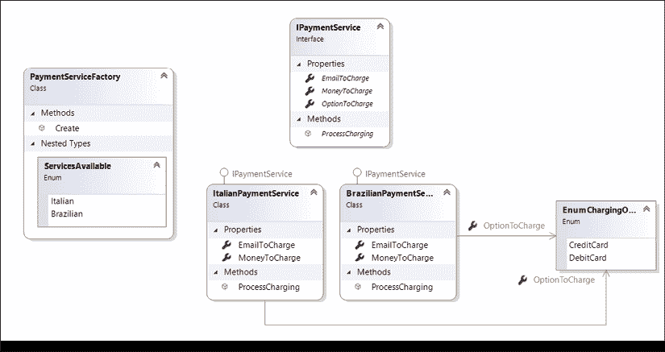
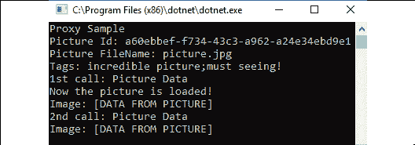
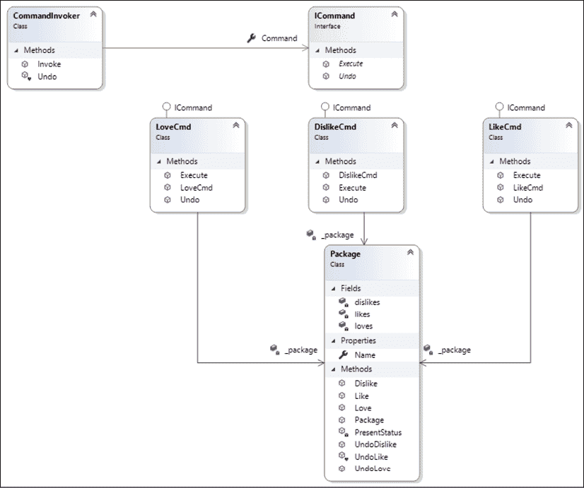

# 11

# 设计模式和.NET5 实现

设计模式可以定义为在软件开发过程中遇到的常见问题的随时可用的体系结构解决方案。它们对于理解.NETCore体系结构至关重要，对于解决我们在设计任何软件时所面临的普通问题也很有用。在本章中，我们将介绍一些设计模式的实现。值得一提的是，这本书并没有解释我们可以使用的所有已知模式。这里的重点是解释学习和应用它们的重要性。

在本章中，我们将介绍以下主题：

*   理解设计模式及其目的
*   了解.NET5 中可用的设计模式

在本章结束时，您将了解到可以使用设计模式实现的来自**WWTravelClub**的一些用例。

# 技术要求

为了完成本章，您将需要安装了所有数据库工具的免费 Visual Studio 2019 社区版或更高版本，以及一个免费的 Azure 帐户。*第 1 章*的*创建 Azure 帐户*小节*理解软件架构*的重要性，解释了如何创建 Azure 帐户。

您可以在[找到本章的示例代码 https://github.com/PacktPublishing/Software-Architecture-with-C-9-and-.NET-5](https://github.com/PacktPublishing/Software-Architecture-with-C-9-and-.NET-5) 。

# 理解设计模式及其目的

决定一个系统的设计是具有挑战性的，与此任务相关的责任是巨大的。作为软件架构师，我们必须始终牢记良好的可重用性、良好的性能和良好的可维护性等特性对于交付一个好的解决方案非常重要。这就是设计模式帮助和加速设计过程的地方。

正如我们前面提到的，设计模式是已经讨论过的解决方案，并且已经定义，以便它们能够解决常见的软件体系结构问题。在《设计模式——可重用面向对象软件的元素》一书*发布后，这种方法变得越来越流行，其中**四人帮**（**GoF**）将这些模式分为三种类型：创造型、结构型和行为型。*

稍后，Bob 叔叔向开发人员社区介绍了坚实的原则，使我们有机会有效地组织每个系统的功能和数据结构。实体设计原则指明了软件组件的设计和连接方式。值得一提的是，与 GoF 提供的设计模式相比，SOLID 原则并不提供代码配方。相反，它们为您提供了设计解决方案时应遵循的基本原则，从而保持软件结构的强大性和可靠性。它们可以定义如下：

*   **单一责任**：一个模块或功能应该只负责一个目的
*   **打开-关闭**：软件工件应该打开以进行扩展，但关闭以进行修改
*   **Liskov 替换**：当您将程序的一个组件替换为另一个由 primer 对象的超类型定义的组件时，程序的行为需要保持不变
*   **接口隔离**：创建巨大的接口会导致在构建具体对象时产生依赖关系，但这对系统架构是有害的
*   **依赖倒置**：最灵活的系统是对象依赖只涉及抽象的系统

随着技术和软件问题的变化，更多的模式被构思出来。云计算的发展带来了一批云计算，这些云计算都可以在[上找到 https://docs.microsoft.com/en-us/azure/architecture/patterns/](https://docs.microsoft.com/en-us/azure/architecture/patterns/) 。新模式出现的原因与我们在开发新解决方案时面临的挑战有关。今天，可用性、数据管理、消息传递、监控、性能、可扩展性、恢复性和安全性是我们在提供云解决方案时必须处理的方面。

为什么你应该总是考虑开发使用设计模式是非常简单的软件架构师，你不能花时间重新发明车轮。然而，使用和理解它们还有另一个很好的理由：你会发现这些模式中有很多已经在.NET5 中实现了。

在接下来的几个小节中，我们将介绍一些最著名的模式。但是，本章的目的是让您知道它们的存在，并且需要进行研究，以便您可以加速和简化您的项目。此外，每个模式都将提供一个 C 代码片段，以便您可以轻松地在项目中实现它们。

## 建造者模式

在某些情况下，您将拥有一个复杂的对象，该对象由于其配置而具有不同的行为。您可能希望使用已构建的自定义配置，将其配置与其使用分离，而不是在使用时设置此对象。这样，您可以对正在构建的实例使用不同的表示。这是您应该使用生成器模式的地方。

下面的类图显示了为本书用例中的场景实现的模式。这一设计选择背后的理念是简化 WWTravelClub 客房的描述方式：

<figure class="mediaobject"></figure>

图 11.1：构建器模式

如下面的代码所示，此代码的实现方式是在主程序中不设置实例的配置。相反，您只需使用`Build()`方法构建对象。此示例模拟在 WWTravelClub 中创建不同的房间样式（单人房间和家庭房间）：

```cs
using DesignPatternsSample.BuilderSample;
using System;
namespace DesignPatternsSample
{
    class Program
    {
        static void Main()
        {
          # region Builder Sample
          Console.WriteLine("Builder Sample");
          var simpleRoom = new SimpleRoomBuilder().Build();
          simpleRoom.Describe();

          var familyRoom = new FamilyRoomBuilder().Build();
          familyRoom.Describe();
          # endregion
          Console.ReadKey();
        }
    }
} 
```

此实现的结果非常简单，但澄清了为什么需要实现模式的原因：

<figure class="mediaobject"></figure>

图 11.2：生成器模式示例结果

一旦有了实现，演化此代码就变得更简单、更容易。例如，如果需要构建不同样式的房间，则必须为该类型的房间创建一个新的生成器，然后才能使用它。

此实现变得非常简单的原因与链接方法的使用有关，正如我们在`Room`类中看到的：

```cs
 public class Room
    {
        private readonly string _name;
        private bool wiFiFreeOfCharge;
        private int numberOfBeds;
        private bool balconyAvailable;
        public Room(string name)
        {
            _name = name;
        }
        public Room WithBalcony()
        {
            balconyAvailable = true;
            return this;
        }
        public Room WithBed(int numberOfBeds)
        {
            this.numberOfBeds = numberOfBeds;
            return this;
        }
        public Room WithWiFi()
        {
            wiFiFreeOfCharge = true;
            return this;
        }
    ...
    } 
```

幸运的是，如果您需要增加产品的配置设置，您之前使用的所有具体类都将在 Builder界面中定义并存储在那里，以便您可以轻松地进行更新。

我们还将在*了解.NET5*中可用的设计模式一节中看到.NET5 中构建器模式的一个很好的实现。在这里，您将能够理解如何使用`HostBuilder`实现通用主机。

## 工厂模式

工厂模式在具有来自同一抽象的多个对象，并且在开始编码时不知道需要创建哪些对象的情况下非常有用。这意味着您必须根据特定配置或软件当前所在的位置创建实例。

例如，让我们检查一下 WWTravelClub 的样本。这里有一个用户故事，描述了这个应用程序将有来自世界各地的客户为他们的旅行付费。然而，在现实世界中，每个国家都有不同的支付服务。每个国家的支付流程类似，但该系统将提供多个支付服务。简化这种支付实现的一个好方法是使用工厂模式。下图显示了其体系结构实现的基本思想：

<figure class="mediaobject"></figure>

图 11.3：工厂模式

请注意，由于您有一个描述应用程序的支付服务的接口，因此可以使用 Factory 模式根据可用的服务更改具体类：

```cs
static void Main()
{
    # region Factory Sample
    ProcessCharging(PaymentServiceFactory.ServicesAvailable.Brazilian,
        "gabriel@sample.com", 178.90f, EnumChargingOptions.CreditCard);

    ProcessCharging(PaymentServiceFactory.ServicesAvailable.Italian,
        "francesco@sample.com", 188.70f, EnumChargingOptions.DebitCard);
    # endregion
    Console.ReadKey();
}
private static void ProcessCharging
    (PaymentServiceFactory.ServicesAvailable serviceToCharge,
    string emailToCharge, float moneyToCharge, 
    EnumChargingOptions optionToCharge)
{
    PaymentServiceFactory factory = new PaymentServiceFactory();
    var service = factory.Create(serviceToCharge);
    service.EmailToCharge = emailToCharge;
    service.MoneyToCharge = moneyToCharge;
    service.OptionToCharge = optionToCharge;
    service.ProcessCharging();
} 
```

由于实现的模式，服务的使用再次得到了简化。如果必须在实际应用程序中使用此代码，则可以通过在 Factory 模式中定义所需的服务来更改实例的行为。

## 单例模式

当您在应用程序中实现 Singleton 时，您将在整个解决方案中实现该对象的一个实例。这可以被认为是在每个应用程序中使用最多的模式之一。原因很简单，在许多用例中，您需要一些类只有一个实例。单例通过提供比全局变量更好的解决方案来解决这个问题。

在 Singleton 模式中，类负责创建和交付应用程序将使用的单个对象。换句话说，Singleton 类创建一个实例：

<figure class="mediaobject"></figure>

图 11.4：单例模式

为此，创建的对象是`static`并以静态属性或方法交付。下面的代码实现了 Singleton模式，该模式具有`Message`属性和`Print()`方法：

```cs
public sealed class SingletonDemo
{
    # region This is the Singleton definition
    private static SingletonDemo _instance;
    public static SingletonDemo Current => _instance ??= new 
        SingletonDemo();
    # endregion
    public string Message { get; set; }
    public void Print()
    {
        Console.WriteLine(Message);
    }
} 
```

它的用法很简单，每次需要使用 Singleton 对象时只需调用 static 属性：

```cs
SingletonDemo.Current.Message = "This text will be printed by " +
  "the singleton.";
SingletonDemo.Current.Print(); 
```

您可以使用此模式的一个地方是，当您需要以一种可以从解决方案中的任何位置轻松访问的方式交付应用程序配置时。例如，假设您有一些存储在表中的配置参数，您的应用程序需要在几个决策点查询这些参数。您可以创建一个 Singleton 类来帮助您，而不是直接查询配置表：

<figure class="mediaobject"></figure>

图 11.5：单例模式使用

此外，您需要在这个单例中实现一个缓存，从而提高系统的性能，因为您将能够决定系统是在每次需要时检查数据库中的每个配置，还是使用缓存。下面的屏幕截图显示了缓存的实现，其中配置每 5 秒加载一次。在这种情况下读取的参数只是一个随机数：

<figure class="mediaobject"></figure>

图 11.6:Singleton 模式中的缓存实现

这对于应用程序的性能是非常好的。此外，在代码中的多个位置使用参数更简单，因为您不必在代码中的任何地方创建配置实例。

值得一提的是，由于.NET5 中的依赖项注入实现，单例模式的使用变得不那么常见，因为您可以设置依赖项注入来处理单例对象。在本章后面的章节中，我们将介绍.NET5 中的依赖项注入。

## 代理模式

当需要提供控制对另一个对象的访问的对象时，将使用代理模式。您应该这样做的最大原因之一与创建被控制的对象的成本有关。例如，如果创建受控对象的时间太长或占用太多内存，则可以使用代理来确保仅在需要时创建对象的最大部分。

下面的类图是一个用于从**房间**加载图片的**代理**模式实现，但仅在请求时：

<figure class="mediaobject"></figure>

图 11.7：代理模式实现

此代理的客户端将请求创建它。在这里，代理只收集真实对象的基本信息（`Id`、`FileName`、`Tags`，不查询`PictureData`。当请求`PictureData`时，代理将加载它：

```cs
static void Main()
{
    Console.WriteLine("Proxy Sample");
    ExecuteProxySample(new ProxyRoomPicture());
}
private static void ExecuteProxySample(IRoomPicture roomPicture)
{
    Console.WriteLine($"Picture Id: {roomPicture.Id}");
    Console.WriteLine($"Picture FileName: {roomPicture.FileName}");
    Console.WriteLine($"Tags: {string.Join(";", roomPicture.Tags)}");
    Console.WriteLine($"1st call: Picture Data");
    Console.WriteLine($"Image: {roomPicture.PictureData}");
    Console.WriteLine($"2nd call: Picture Data");
    Console.WriteLine($"Image: {roomPicture.PictureData}");
} 
```

如果再次请求`PictureData`，由于图像数据已经就位，代理将保证图像重新加载不会重复。以下屏幕截图显示了运行上述代码的结果：

<figure class="mediaobject"></figure>

图 11.8：代理模式结果

这种技术可以被称为另一种众所周知的模式：**延迟加载**。事实上，代理模式是实现延迟加载的一种方式。另一种实现延迟加载的方法是使用`Lazy<T>`类型。例如，在实体框架核心 5 中，如*第 8 章*所述，*与 C#–实体框架核心*中的数据交互，您可以使用代理打开延迟加载。您可以在[上了解更多信息 https://docs.microsoft.com/en-us/ef/core/querying/related-data# lazy-加载](https://docs.microsoft.com/en-us/ef/core/querying/related-data# lazy-loading)。

## 命令模式

在许多情况下，需要执行**命令**，这将影响对象的行为。命令模式可以通过将此类请求封装在对象中来帮助您实现这一点。模式还描述了如何处理请求的撤销/重做支持。

例如，让我们想象一下，在 WWTravelClub 网站上，用户可能有能力通过指定他们是喜欢、不喜欢还是甚至喜欢他们的体验来评估软件包。

以下类图是使用命令模式创建此评级系统的示例：

<figure class="mediaobject"></figure>

图 11.9：命令模式

请注意，如果您需要不同的命令（如`Hate`），则不需要来更改使用该命令的代码和类。`Undo`方法的添加方式与`Redo`方法类似。这方面的完整代码示例可在本书的 GitHub 存储库中找到。

提到 ASP.NETCore MVC 在其`IActionResult`层次结构中使用命令模式也可能有所帮助。此外，在*第 12 章*中描述的业务操作*理解软件解决方案*中的不同领域，将利用此模式执行业务规则。

## 发布者/订阅者模式

从一个对象向一组其他对象提供信息在所有应用程序中都很常见。当有大量组件（订阅服务器）将接收包含对象（发布服务器）发送的信息的消息时，发布服务器/订阅服务器模式几乎是强制性的。

这里的概念很容易理解，如下图所示：

<figure class="mediaobject"></figure>

图 11.10：发布者/订阅者示例案例

当可能的订阅者数量不确定时，必须将广播信息的组件与使用它的组件分离。发布者/订阅者模式为我们做到了这一点。

实现这种模式是复杂的，因为分布式环境不是一项简单的任务。因此，建议您考虑已经存在的实现消息代理的技术，该消息代理将输入通道连接到输出通道，而不是从头开始构建。Azure 服务总线是此模式的可靠实现，因此您只需连接到它即可。

RabbitMQ，我们在*第 5 章**中提到过，将微服务架构应用于您的企业应用程序*，是另一种可用于实现消息代理的服务，但它是该模式的较低级别实现，需要一些相关任务，例如重试，以防错误必须手动编码。

## 依赖注入模式

依赖性注入模式被认为是实现依赖性反转原理的一种好方法。一个有用的副作用是，它迫使任何实现都遵循所有其他可靠的原则。

这个概念很简单。您不需要创建组件所依赖的对象的实例，只需要定义它们的依赖关系，声明它们的接口，并通过**注入**启用对象的接收。

执行依赖项注入有三种方式：

*   使用类的构造函数来接收对象
*   标记一些类属性以接收对象
*   使用方法定义接口以注入所有必要的组件

下图显示了依赖项注入模式的实现：

<figure class="mediaobject"></figure>

图 11.11：依赖注入模式

除此之外，依赖注入还可以与**控制反转**（**IoC**容器一起使用。此容器支持在需要依赖项时自动注入依赖项。市场上有几种 IoC 容器框架可用，但对于.NET Core，不需要使用第三方软件，因为它在`Microsoft.Extensions.DependencyInjection`名称空间中包含一组库来解决这个问题。

此 IoC 容器负责创建并处理请求的对象。依赖项注入的实现基于构造函数类型。注入组件的寿命有三个选项：

*   **瞬态**：每次请求时都会创建对象。
*   **作用域**：为应用程序中定义的每个作用域创建对象。在 web 应用程序中，**范围**由 web 请求标识。
*   **Singleton**：每个对象都有相同的应用生命周期，因此重用单个对象来服务给定类型的所有请求。如果对象包含状态，则不应使用此状态，除非它是线程安全的。

使用这些选项的方式取决于所开发项目的业务规则。这也是如何注册应用程序服务的问题。在决定正确的方法时需要小心，因为应用程序的行为将根据所注入对象的类型而改变。

# 了解.NET5 中可用的设计模式

正如我们在前面几节中发现的，C# 允许我们实现任何模式。NET5 在其 SDK 中提供了许多遵循我们讨论过的所有模式的实现，例如实体框架核心代理延迟加载。另一个自.NET Core 2.1 以来可用的好例子是.NET 通用主机。

在*第 15 章*中*展示 ASP.NETCore MVC*时，我们将详细介绍可用于.NET 5 中 web 应用程序的托管。这个网络主机帮助我们，因为应用程序的启动和生命周期管理是与它一起设置的。NET 通用主机的思想是为不需要 HTTP 实现的应用程序启用此模式。有了这个通用主机，任何.NETCore程序都可以有一个启动类，我们可以在其中配置依赖项注入引擎。这对于创建多服务应用程序非常有用。

您可以在[上找到有关.NET 通用主机的更多信息 https://docs.microsoft.com/en-us/aspnet/core/fundamentals/host/generic-host](https://docs.microsoft.com/en-us/aspnet/core/fundamentals/host/generic-host) ，其中包含一些示例代码，是 Microsoft 当前推荐的。GitHub 存储库中提供的代码更简单，但它侧重于创建一个控制台应用程序，该应用程序可以运行用于监视的服务。关于这一点，最重要的是控制台应用程序的运行方式，其中构建器配置应用程序将提供的服务，以及管理日志记录的方式。

这在以下代码中显示：

```cs
public static void Main()
{
    var host = new HostBuilder()
        .ConfigureServices((hostContext, services) =>
        {
            services.AddHostedService<HostedService>();
            services.AddHostedService<MonitoringService>();
        })
        .ConfigureLogging((hostContext, configLogging) =>
        {
            configLogging.AddConsole();
        })
        .Build();
    host.Run();
    Console.WriteLine("Host has terminated. Press any key to finish the App.");
    Console.ReadKey();
} 
```

前面的代码让我们了解了.NETCore如何使用设计模式。使用生成器模式，.NET Generic Host 可以设置将作为服务注入的类。除此之外，构建器模式还帮助您配置一些其他功能，例如日志的显示/存储方式。此配置允许服务将`ILogger<out TCategoryName>`对象注入任何实例。

# 总结

在本章中，我们理解了为什么设计模式有助于您正在构建的系统部分的可维护性和可重用性。我们还研究了一些可以在项目中使用的典型用例和代码片段。最后，我们介绍了.NET 通用主机，这是一个很好的例子，说明了.NET 如何使用设计模式来实现代码重用和实施最佳实践。

所有这些内容都将帮助您设计新软件，甚至维护现有软件，因为设计模式已经是软件开发中一些实际问题的已知解决方案。

在下一章中，我们将介绍领域驱动的设计方法。我们还将学习如何使用坚实的设计原则，以便将不同的领域映射到我们的软件解决方案。

# 问题

1.  什么是设计模式？
2.  设计模式和设计原则之间有什么区别？
3.  什么时候实现 Builder 模式是个好主意？
4.  什么时候实施工厂模式是个好主意？
5.  什么时候实现单例模式是个好主意？
6.  什么时候实现代理模式是个好主意？
7.  什么时候实现命令模式是个好主意？
8.  什么时候实现发布者/订阅者模式是个好主意？
9.  什么时候实现依赖注入模式是个好主意？

# 进一步阅读

以下是一些书籍和网站，您可以从中了解有关本章内容的更多信息：

*   *清洁架构：软件结构和设计的工匠指南*，马丁，罗伯特·C.，培生教育，2018。
*   *设计模式：可重用面向对象软件的元素*，Erica Gamma 等人，Addison-Wesley，1994。
*   *设计原则和设计模式*，Martin，Robert C.，2000。
*   如果您需要获得有关设计模式和体系结构原则的更多信息，请查看以下链接：
    *   [https://www.packtpub.com/application-development/design-patterns-using-c-and-net-core-video](https://www.packtpub.com/application-development/design-patterns-using-c-and-net-core-video)
    *   [https://docs.microsoft.com/en-us/dotnet/standard/modern-web-apps-azure-architecture/architectural-principles](https://docs.microsoft.com/en-us/dotnet/standard/modern-web-apps-azure-architecture/architectural-pr)
*   如果要检查特定的云设计模式，可以在以下位置找到它们：
    *   [https://docs.microsoft.com/en-us/azure/architecture/patterns/](https://docs.microsoft.com/en-us/azure/architecture/patterns/)
*   如果您想更好地理解通用主机的概念，请点击以下链接：
    *   [https://docs.microsoft.com/en-us/aspnet/core/fundamentals/host/generic-host](https://docs.microsoft.com/en-us/aspnet/core/fundamentals/host/generic-host)
*   关于服务总线消息传递，这里有一个很好的解释：
    *   [https://docs.microsoft.com/en-us/azure/service-bus-messaging/service-bus-dotnet-how-to-use-topics-subscriptions](https://docs.microsoft.com/en-us/azure/service-bus-messaging/service-bus-dotnet-how-to-use-topics-su)
*   通过检查以下链接，您可以了解有关依赖项注入的更多信息：
    *   [https://docs.microsoft.com/en-us/aspnet/core/fundamentals/dependency-injection](https://docs.microsoft.com/en-us/aspnet/core/fundamentals/dependency-injection)
    *   [https://www.martinfowler.com/articles/injection.html](https://www.martinfowler.com/articles/injection.html)