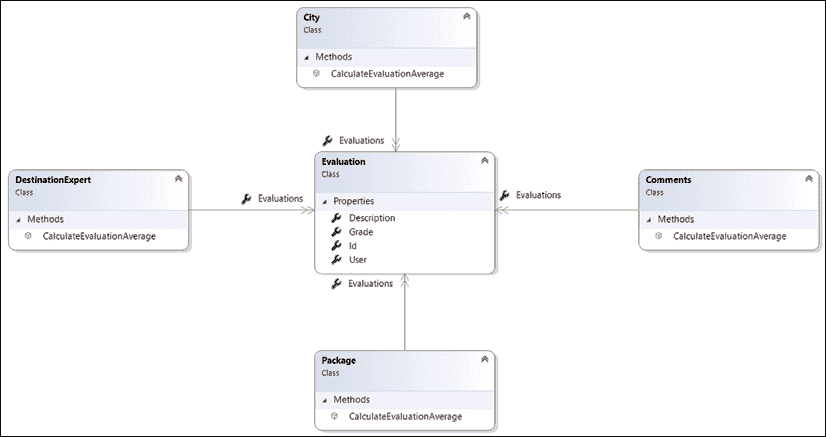
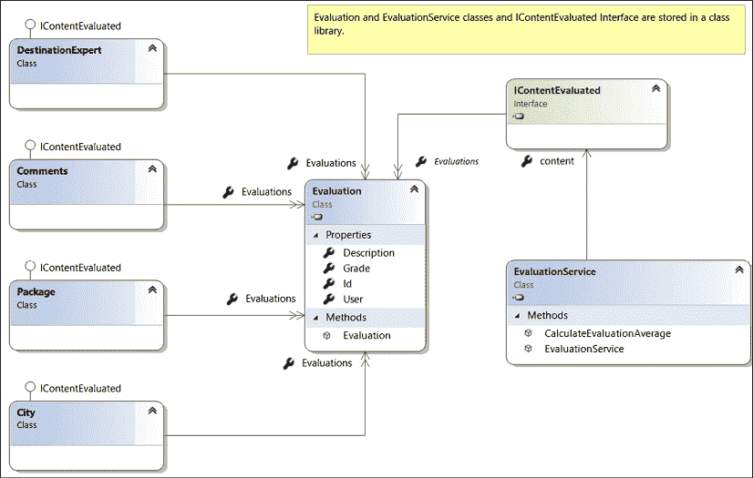
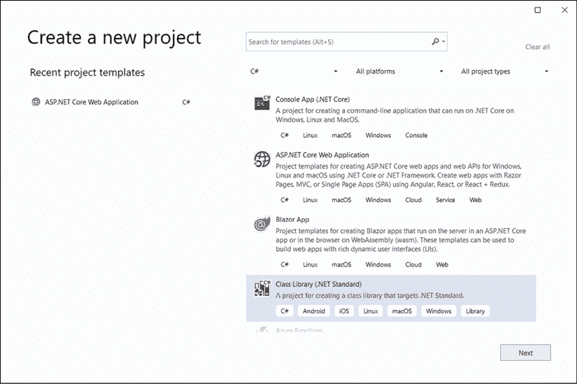
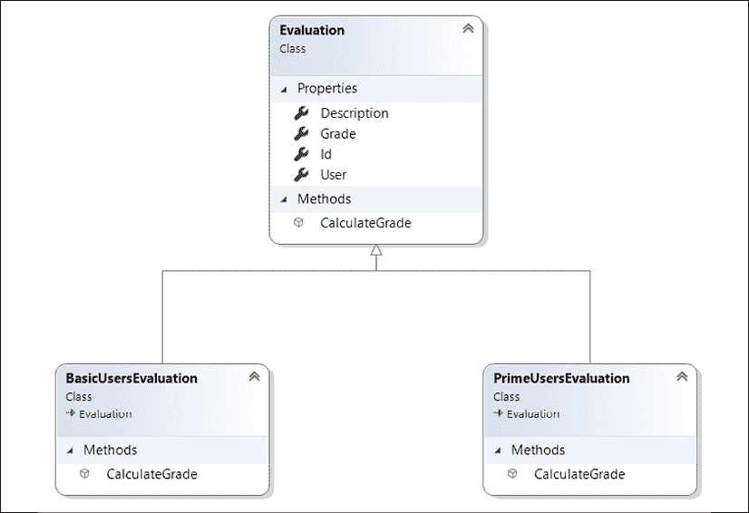
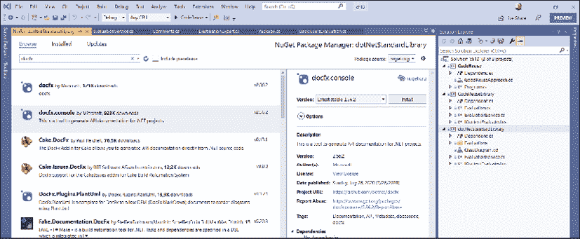

# 13

# 在 C# 9 中实现代码重用

代码可重用性是软件体系结构中最重要的课题之一。本章旨在讨论实现代码重用的方法，并帮助您了解.NET 5 如何朝着这个方向发展，以解决管理和维护可重用库的问题。

本章将介绍以下主题：

*   理解代码重用的原则
*   与.NET 标准相比，使用.NET 5 的优势
*   使用.NET 标准创建可重用库

尽管代码重用是一种特殊的实践，但作为软件架构师，您必须意识到这对您正在处理的场景非常重要。许多优秀的软件架构师都同意，由于试图使事物可重用，存在着大量的过度工程，即使它们通常是一次性使用的，或者没有被很好地理解。

# 技术要求

本章要求以下内容：

*   您需要安装所有数据库工具的免费 Visual Studio 2019 社区版或更高版本。
*   您可以在[找到本章的示例代码 https://github.com/PacktPublishing/Software-Architecture-with-C-9-and-.NET-5](https://github.com/PacktPublishing/Software-Architecture-with-C-9-and-.NET-5) 。

# 理解代码可重用性的原则

有一个理由可以用来证明代码重用的合理性——如果轮子已经在其他场景中运行良好，那么你就不能花宝贵的时间重新创建它。这就是为什么大多数工程领域都基于可重用性原则。想想你家里的电灯开关。

你能想象有多少应用程序可以使用相同的接口组件吗？代码重用的基本原理是相同的。同样，这是一个规划好的解决方案的问题，以便以后可以重用其中的一部分。

在软件工程中，代码重用是可以为软件项目带来一系列优势的技术之一，例如：

*   考虑到重用的代码已经在另一个应用程序中进行了测试，对软件有信心。
*   由于软件架构师和高级团队可以致力于解决此类问题，因此他们的使用率更高。
*   有可能为项目带来一种已经被市场接受的模式。
*   由于已经实现了组件，开发速度提高了。
*   保养比较容易。

这些方面表明，只要有可能，就应该进行代码重用。作为一名软件架构师，您有责任确保前面的优势得到利用，而且，更重要的是，您要激励您的团队在他们正在创建的软件中实现重用。

## 什么不是代码重用？

您必须了解的第一件事是，代码重用并不意味着将代码从一个类复制和粘贴到另一个类。即使这段代码是由另一个团队或项目编写的，这并不表示您正确地使用了可重用性原则。让我们想象一下我们将在本书的用例中发现的一个场景，WWTravelClub 评估。

在本项目场景中，您可能需要评估不同类型的主题，如**包**、**目的地专家**、**城市**、**评论**等。无论你指的是哪门学科，获得评估平均值的过程都是一样的。因此，您可能希望通过复制和粘贴每次评估的代码来*启用*重用。（坏）结果将是这样的：

<figure class="mediaobject"></figure>

图 13.1：糟糕的实现——这里没有代码重用

在上图中，计算计算平均值的过程是分散的，这意味着相同的代码将在不同的类中重复。这将导致很多麻烦，尤其是在其他应用程序中使用相同的方法时。例如，如果有一个关于如何计算平均值的新规范，或者如果计算公式中有一个错误，则必须在所有代码实例中修复它。如果您不记得在所有地方都更新它，那么最终可能会得到一个不一致的实现。

## 什么是代码重用？

上一节提到的问题的解决方案非常简单：您必须分析代码，并选择其中有利于与应用程序解耦的部分。

您应该将这些代码解耦的最大原因与您如何确保这些代码可以在应用程序的其他部分甚至其他应用程序中重用有关：

<figure class="mediaobject"></figure>

图 13.2：专注于代码重用的实现

作为软件架构师，代码的集中化为您带来了不同的责任。您必须记住，此代码中的错误或不兼容可能会损坏应用程序的许多部分或不同的应用程序。另一方面，一旦测试并运行了这段代码，就可以毫无顾虑地传播它的使用。此外，如果需要改进平均计算过程，则必须在单个类中更改代码。

值得一提的是，使用相同的代码越多，开发成本就越低。需要提到成本，因为一般来说，可重用软件的概念在开始时成本更高。

# 开发生命周期中的可重用性

如果您了解可重用性将把您带到另一个代码实现级别，那么您应该考虑如何在开发生命周期中使用此技术。

事实上，创建和维护组件库并不容易，因为您将承担责任，并且缺少支持搜索现有组件的好工具。

另一方面，在您开始新开发时，您可以考虑在软件开发过程中实现的一些事情：

*   **使用**用户库中已经实现的组件，在软件需求规范中选择需要它们的功能。
*   **确定软件需求规范中的**特性，这些特性是设计为库组件的候选特性。
*   **修改**规范，考虑到这些特性将使用可重用组件开发。
*   **设计**可重用组件，并确保它们具有适用于许多项目的接口。
*   **使用新的组件库版本构建**项目架构。
*   **记录**组件库版本，以便每个开发人员和团队都知道。

使用识别、修改、设计、构建、构建和处理是一种技术，您可以考虑在每次需要启用软件重用时实现。一旦你有了需要为这个库编写的组件，你就需要决定提供这些组件的技术。

在软件开发的历史中，有很多方法可以做到这一点；其中一些在*第 5 章*、*将微服务架构应用于企业应用程序*、*微服务和模块概念的演变*一节中进行了讨论。

# 使用.NET 5 或.NET 标准进行代码重用

自第一个版本以来，.NET 有了很大的发展。这种演变不仅与命令数量和性能问题有关，还与支持的平台有关。正如我们在*第 1 章*中所讨论的*理解软件架构*的重要性，您可以在数十亿台设备上运行 C#.NET，即使它们运行 Linux、Android、macOS 或 iOS。由于这个原因，.NET 标准最初是与.NET Core 1.0 一起发布的，但是.NET 标准在.NET Framework 4.6、.NET Core 和 Xamarin 与.NET 标准 2.0 兼容时变得尤为重要。

关键的一点是.NET 标准不仅仅是一种 VisualStudio 项目。更重要的是，它是一个可用于所有.NET 实现的正式规范。如下表所示，它涵盖了从.NET Framework 到 Unity 的所有内容：

<colgroup><col> <col> <col> <col> <col> <col> <col> <col> <col> <col></colgroup> 
| .NET 标准 | 1 | 1.1 | 1.2 | 1.3 | 1.4 | 1.5 | 1.6 | 2 | 2.1 |
| --- | --- | --- | --- | --- | --- | --- | --- | --- | --- |
| .NET 核心和.NET 5 | 1 | 1 | 1 | 1 | 1 | 1 | 1 | 2 | 3 |
| .NET 框架 | 4.5 | 4.5 | 4.5.1 | 4.6 | 4.6.1 | 4.6.1 | 4.6.1 | 4.6.1 | 不适用 |

您可以在[上找到完整的.NET 标准概述 https://docs.microsoft.com/en-us/dotnet/standard/net-standard](https://docs.microsoft.com/en-us/dotnet/standard/net-standard) 。

上表表明，如果您构建了一个与此标准兼容的类库，您将能够在所提供的任何平台中重用它。想一想，如果你计划在所有项目中都这样做，那么你的开发过程会有多快。

显然，有些组件没有包含在.NET 标准中，但的演变是持续的。值得一提的是，微软的官方文档表明*版本越高，您可以使用的 API 就越多*。

为所有平台提供单一框架的倡议将我们带到了.NET5。微软表示，从现在起，net5.0 或更高版本将在任何地方运行。作为一名软件架构师，您可能会遇到的下一个问题是：.NET 标准将发生什么变化？

这个问题的答案由 Immo Landwerth 在 dotnet 博客[上解释得很好 https://devblogs.microsoft.com/dotnet/the-future-of-net-standard/](https://devblogs.microsoft.com/dotnet/the-future-of-net-standard/) 。基本的答案是，.NET 5（和未来版本）需要被认为是共享代码向前推进的基础。

## 创建.NET 标准库

创建与.NET 标准兼容的类库非常简单。基本上，创建库时需要选择以下项目：

<figure class="mediaobject"></figure>

图 13.3：创建.NET 标准库

完成本部分后，您将注意到公共类库与您创建的类库之间的唯一区别是项目文件中定义的目标框架：

```cs
<Project Sdk="Microsoft.NET.Sdk">
<PropertyGroup>
<TargetFramework>netstandard2.0</TargetFramework>
</PropertyGroup>
</Project> 
```

一旦加载了项目，就可以开始编写要重用的类。使用这种方法构建可重用类的优点是，您将能够在我们前面检查过的所有项目类型中重用编写的代码。另一方面，您会发现.NET Framework 中提供的某些 API 在此类项目中并不存在。

# C# 如何处理代码重用？

有许多方法可以帮助我们处理代码重用。正如我们在上一节中所做的那样，构建库的能力就是其中之一。最重要的一点是，这种语言是面向对象的。此外，值得一提的是泛型给 C 语言带来的便利。本节将讨论我们提到的最后两个。

## 面向对象分析

面向对象的分析方法使我们能够以不同的方式重用代码，从继承的便利性到多态性的可变性。完全采用面向对象编程将让您实现抽象和封装。

下图显示了使用面向对象方法如何简化重用。如您所见，考虑到您可以是系统的基本用户或主要用户，有不同的方法计算评估等级：

<figure class="mediaobject"></figure>

图 13.4：面向对象的案例分析

在本设计中，有两个方面需要作为代码重用进行分析。第一个是不需要在每个子类中声明属性，因为继承是为您做的。

第二个是使用多态性的机会，为同一方法启用不同的行为：

```cs
public class PrimeUsersEvaluation : Evaluation
{
    /// <summary>
    /// The business rule implemented here indicates that grades that 
    /// came from prime users have 20% of increase
    /// </summary>
    /// <returns>the final grade from a prime user</returns>
    public override double CalculateGrade()
    {
         return Grade * 1.2;
    }
} 
```

在前面的代码中，您可以看到多态性原则的使用，其中主要用户的评估计算将增加 20%。现在，看看调用同一类继承的不同对象有多容易。由于集合内容实现了相同的接口`IContentEvaluated`，所以也可以有基本用户和主要用户：

```cs
public class EvaluationService
{
    public IContentEvaluated content { get; set; }
    /// <summary>
    /// No matter the Evaluation, the calculation will always get     
    /// values from the method CalculateGrade
    /// </summary>
    /// <returns>The average of the grade from Evaluations</returns>
    public double CalculateEvaluationAverage()
    {
            return content.Evaluations
                .Select(x => x.CalculateGrade())
                .Average();
    }
} 
```

在使用 C# 时，可以认为必须采用面向对象的方法。然而，更具体的用法需要研究和实践。作为一名软件架构师，您应该始终激励您的团队学习面向对象分析。抽象能力越强，代码重用就越容易。

## 仿制药

泛型是在 2.0 版的 C# 中引入的，它被认为是一种提高代码重用的方法。它还最大限度地提高了类型安全性和性能。

泛型的基本原则是，您可以在接口、类、方法、属性、事件甚至委托中定义占位符，该占位符将在以后使用前面的一个实体时替换为特定类型。您使用此功能的机会是难以置信的，因为您可以使用相同的代码来运行该类型的不同版本。

以下代码是对`EvaluationService`的修改，该修改已在上一节中介绍。这里的想法是实现服务的通用化，让我们有机会定义自创建以来的评估目标：

```cs
public class EvaluationService<T> where T: IContentEvaluated 
```

此声明表示实现`IContentEvaluaded`接口的任何类都可以用于此服务。此外，该服务将负责创建评估内容。

以下代码实现自构造服务以来创建的已评估内容。此代码使用`System.Reflection`和类中的通用定义：

```cs
public EvaluationService()
{
    var name = GetTypeOfEvaluation();
    content = (T)Assembly.GetExecutingAssembly().CreateInstance(name);
} 
```

值得一提的是，这段代码可以工作，因为所有类都在同一个程序集中。此外，在使用泛型时，反射不是强制性的。可以在服务的实例创建中检查此修改的结果：

```cs
var service = new EvaluationService<CityEvaluation>(); 
```

好消息是，现在，您有了一个通用服务，它将自动实例化 list 对象，并对您需要的内容进行评估。值得一提的是，泛型显然需要更多的时间用于第一个项目的构建。然而，一旦设计完成，您将拥有良好、快速且易于维护的代码。这就是我们所说的重用！

# 如果代码不可重用怎么办？

事实上，任何代码都可以重用。这里的关键点是，您打算重用的代码是否编写得很好并且遵循良好的重用模式。代码未准备好重用有几个原因：

*   **代码在**之前没有经过测试：在重用代码之前，这是一个很好的方法来保证它的工作。
*   **代码是重复的**：如果您有重复的代码，您需要找到每个使用它的地方，这样您就只有一个版本的代码被重用。
*   **代码太复杂，无法理解**：在许多地方重复使用的代码需要简单编写，以便于理解。
*   **代码具有紧密耦合**：这是一个关于构建单独类库时组合与继承的讨论。类（带有接口）通常比可以继承的基类更易于重用。

在任何一种情况下，考虑重构策略都是一种很好的方法。当您重构代码时，您正在以更好的方式编写代码，同时尊重该代码将处理的输入和输出数据。这使得在更改代码时能够实现更全面、成本更低的代码。Martin Fowler 指出了我们应该考虑重构的一些原因：

*   **它改进了软件设计**：你的团队越是专家，设计就越好。更好的软件设计不仅能提供更快的编码，而且能让我们有机会在更短的时间内处理更多的任务。
*   **它使软件更容易理解**：无论我们谈论的是大三还是大四，好的软件都需要团队中的每个开发人员理解。
*   **这有助于我们发现 bug**：当您进行重构时，您会发现可能没有很好编程的业务规则，因此您会发现 bug。
*   **它使我们编程更快**：重构的结果将是代码，这将使未来的开发速度更快。

重构的过程取决于我们将遵循的一些步骤，以保证良好的结果并在过程中尽量减少错误：

*   **确保您有一组测试来保证正确的处理**：您有一组测试将消除必须清除代码的恐惧。
*   **消除重复**：重构是消除代码重复的好机会。
*   **最小化复杂性**：考虑到您的目标是使代码更易于理解，遵循*第 17 章*中提到的编程最佳实践，*编码 C# 9*的最佳实践将降低代码的复杂性。
*   **清理设计**：重构也是重组库设计的好时机。不要忘了更新它们。这是消除 bug 和安全问题的好方法。

作为一名软件架构师，您将收到来自团队的许多重构需求。这样做的动机必须是持续的。但是您必须提醒您的团队，不遵循前面的步骤进行重构可能会有风险。因此，您有责任以一种既能实现快速编程又能减少影响的方式实现它，从而提供真正的业务价值。

# 我有我的图书馆。我如何推广他们？

考虑到您已经做出了所有必要的努力来保证您拥有好的库，这些库必须在您的许多项目中重用，您将发现在启用可重用性时出现了另一个困难的情况：让程序员知道您已经准备好了可重用的库并不简单。

有一些简单的方法来记录一个库。正如我们在讨论开发生命周期时提到的，文档化是帮助开发人员注意到他们拥有的库的一种好方法。我们想在这里提到两个记录可重用代码的示例。

## 使用 DocFX 记录.NET 库

此工具是使用代码中的注释记录库的一个很好的替代方法。通过简单地添加 NuGet 包`docfx.console`，工具允许您创建一个任务，该任务将在构建库后运行：

<figure class="mediaobject"></figure>

图 13.5:docfx.console NuGet 库

此编译的输出是一个时尚的静态网站，其中包含代码的文档：

<figure class="mediaobject"></figure>

图 13.6:DocFx 结果

此网站非常有用，因为您可以将文档分发给您的团队，以便他们可以搜索您拥有的库。您可以查看输出的定制并在[找到更多信息 https://dotnet.github.io/docfx/](https://dotnet.github.io/docfx/) 。

## 使用 Swagger 记录 Web API

毫无疑问，Web API 是促进和促进代码重用的技术之一。出于这个原因，良好地完成文档编制，而且更重要的是，遵守标准是一种良好做法，这表明您对这种方法是最新的。为了做到这一点，我们有了 Swagger，它尊重 OpenAPI 规范。

OpenAPI 规范被称为描述现代 API 的标准。在 ASP.NET 核心 Web API 中，最广泛使用的文档化工具之一是`Swashbuckle.AspNetCore`。

实现`Swashbuckle.AspNetCore`库的好处在于，您可以为 Web API 设置 Swagger UI viewer，这是一种很好的图形化方式来分发 API。

在下一章中，我们将学习如何在 ASP.NET 核心 Web API 中使用此库。在此之前，了解此文档不仅可以帮助您的团队，还可以帮助任何可能使用您正在开发的 API 的开发人员，这一点很重要。

# 用例–重用代码作为交付良好和安全软件的快速方法

WWTravelClub 内容评估解决方案的最终设计如下所示。这种方法包括使用本章讨论的许多主题。首先，所有代码都放在.NET 标准类库中。这意味着您可以将此代码添加到不同类型的解决方案中，例如用于 Android 和 iOS 平台的.NET 核心 web 应用程序和 Xamarin 应用程序：

<figure class="mediaobject"></figure>

图 13.7:WWTravelClub 重用方法

这种设计利用了面向对象的原则，例如继承，因此您不需要多次编写可以在许多类中使用的属性和方法；和多态性，这样您就可以在不更改方法名称的情况下更改代码的行为。

最后，该设计通过引入泛型作为一种工具来抽象内容的概念，这种工具可以促进对类似类的操作，例如我们在 WWTravelClub 中使用的类，用于评估有关城市、评论、目的地专家和旅行包的内容。

鼓励代码重用的团队与不鼓励代码重用的团队的最大区别在于向最终用户交付优秀软件的速度。当然，开始使用这种方法并不容易，但请放心，使用一段时间后，您将获得良好的结果。

# 总结

本章旨在帮助您理解代码重用的优点。它还让您了解了哪些代码没有被正确重用。本章还介绍了重用和重构代码的方法。

考虑到没有流程的技术无法将您带到任何地方，因此提出了一个有助于实现代码重用的流程。此过程与使用库中已完成的组件有关；识别软件需求规范中作为库组件设计的候选特征；根据这些特点修改规范；设计可重用组件；以及使用新的组件库版本构建项目体系结构。

最后，本章介绍了.NET 标准库作为一种在不同 C# 平台上重用代码的方法，指出应使用.NET 5 和新版本在不同平台上重用代码。本章还强调了重用代码时面向对象编程的原则，并将泛型作为一种复杂的实现来简化对具有相同特征的对象的处理。在下一章中，我们将学习如何使用.NET 核心应用**面向服务的体系结构**（**SOA**。

值得一提的是，SOA 被认为是在复杂环境中实现代码重用的一种方法。

# 问题

1.  复制和粘贴可以被视为代码重用吗？这种方法的影响是什么？
2.  如何在不复制和粘贴代码的情况下利用代码重用？
3.  是否有一个流程可以帮助代码重用？
4.  .NET 标准和.NET 核心之间有什么区别？
5.  创建.NET 标准库的优点是什么？
6.  面向对象分析如何帮助代码重用？
7.  泛型如何帮助代码重用？
8.  将.NET 标准替换为.NET 5 吗？
9.  与重构相关的挑战是什么？

# 进一步阅读

以下是一些书籍和网站，您可以在其中找到有关本章的更多信息：

*   *清洁代码：敏捷软件工艺手册*马丁，罗伯特·C·皮尔逊教育，2012。
*   *清洁体系结构：软件结构和设计工匠指南*马丁、罗伯特·C·皮尔逊教育出版社，2018 年。
*   *设计模式：可重用面向对象软件的元素*作者：Erica Gamma【等】Addison-Wesley，1994。
*   罗伯特·C·马丁的*设计原则和设计模式*，2000 年。
*   *重构*由 Martin Fowler 编写，2018 年。
*   [https://devblogs.microsoft.com/dotnet/introducing-net-standard/](https://devblogs.microsoft.com/dotnet/introducing-net-standard/)
*   [https://www.packtpub.com/application-development/net-standard-20-cookbook](https://www.packtpub.com/application-development/net-standard-20-cookbook)
*   [https://github.com/dotnet/standard/blob/master/docs/versions.md](https://github.com/dotnet/standard/blob/master/docs/versions.md)
*   [https://docs.microsoft.com/pt-br/dotnet/csharp/programming-guide/generics/](https://docs.microsoft.com/pt-br/dotnet/csharp/programming-guide/generics/)
*   [https://devblogs.microsoft.com/dotnet/the-future-of-net-standard/](https://devblogs.microsoft.com/dotnet/the-future-of-net-standard/)
*   [https://dotnet.github.io/docfx/](https://dotnet.github.io/docfx/)
*   [https://github.com/domaindrivendev/Swashbuckle.AspNetCore](https://github.com/domaindrivendev/Swashbuckle.AspNetCore)
*   [https://docs.microsoft.com/en-us/aspnet/core/tutorials/web-api-help-pages-using-swagger](https://docs.microsoft.com/en-us/aspnet/core/tutorials/web-api-help-pages-using-swagger)