# 二十、理解 DevOps 原则

DevOps 是现在每个人都在学习和实践的过程。但是作为一名软件架构师，您不仅需要将 DevOps 作为一个过程，而且还需要将其作为一种哲学来理解和传播。本章将介绍使用 DevOps 开发和交付软件所需的主要概念、原则和工具。

在考虑 DevOps 的理念时，本章将重点关注所谓的**服务设计思维**，也就是说，记住您正在设计的软件是作为向组织/组织的一部分提供的服务。这种方法的主要优点是，最高优先级是您的软件给予目标组织的价值。此外，您提供的不仅仅是工作代码和修复 bug 的协议，而是一个解决方案，可以满足您的软件的所有需求。换句话说，您的工作包括满足这些需求所需的一切，比如监控用户的满意度，以及在用户需求发生变化时调整软件。最后，更容易监控软件以揭示问题和新需求，并对其进行修改以快速适应不断变化的需求。

服务设计思想与**软件即服务**（**SaaS**模型紧密相连，我们在*第 4 章*中讨论了*确定最佳的基于云的解决方案*。事实上，提供基于 web 服务的解决方案的最简单方法是将 web 服务作为服务提供，而不是销售实现它们的软件。

本章将介绍以下主题：

*   描述什么是 DevOps，并查看如何在 WWTravelClub 项目中应用它的示例
*   了解 DevOps 原则和部署阶段以利用部署过程
*   了解 Azure DevOps 的连续交付
*   定义持续反馈，并讨论 Azure DevOps 中的相关工具
*   了解 SaaS 并为服务场景准备解决方案
*   用例–使用 Azure 管道部署包管理应用

与其他章节不同，WWTravelClub 项目将在主题期间介绍，我们将在本章末尾提供一个附加结论，让您有机会了解 DevOps 理念是如何实现的。所有演示 DevOps 原则的屏幕截图都来自本书的主要用例，因此您将能够轻松理解 DevOps 原则。到本章结束时，您将能够根据服务设计思维原则设计软件，并使用 Azure 管道部署应用。

# 技术要求

本章要求安装了所有 Azure 工具的 Visual Studio 2019 Community Edition 或更高版本。您可能还需要 Azure DevOps 帐户，如*第 3 章**中所述，用 Azure DevOps*记录需求。它还需要一个免费的 Azure 帐户。如果您尚未创建 Azure 帐户，*第 1 章**理解软件架构*的重要性*创建 Azure 帐户*小节解释了如何创建 Azure 帐户。本章使用与*第 18 章*相同的代码，*使用单元测试用例和 TDD*测试您的代码，可以在这里找到：[https://github.com/PacktPublishing/Software-Architecture-with-C-9-and-.NET-5](https://github.com/PacktPublishing/Software-Architecture-with-C-9-and-.NET-5) 。

# 描述 DevOps

DevOps 来源于*开发和运营*这两个词的结合，所以这个过程简单地统一了这些领域的行动。然而，当你开始更多地研究它时，你会意识到将这两个领域联系起来并不足以实现这一哲学的真正目标。

我们还可以说，DevOps 是一个满足人类当前软件交付需求的过程。

微软首席 DevOps 经理多诺万·布朗（Donovan Brown）对 DevOps 的定义非常明确：*DevOps 是人员、流程和产品的联合体，能够为最终用户持续提供价值*。[http://donovanbrown.com/post/what-is-devops](http://donovanbrown.com/post/what-is-devops) 。

使用流程、人员和产品，持续向最终用户提供价值的方法：这是对 DevOps 理念的最好描述。我们需要开发和交付面向客户的软件。一旦公司的所有领域都认识到关键点是最终用户，作为软件架构师，您的任务就是展示能够促进交付过程的技术。

值得一提的是，本书的所有内容都与这种方法有关。这决不是了解一堆工具和技术的问题。作为一名软件架构师，您必须了解，它始终是一种将更快的解决方案轻松提供给最终用户的方法，并与他们的实际需求相关联。因此，您需要学习 DevOps 原则，这将在本章中讨论。

# 理解 DevOps 原则

考虑到 DevOps 是一种理念，值得一提的是，有一些原则可以使该流程在您的团队中正常工作。这些原则是持续集成、持续交付和持续反馈。

Microsoft 有一个特定的网页，用于定义 DevOps 概述、文化、实践、工具及其与云的关系。请在[查看此信息 https://azure.microsoft.com/en-us/overview/what-is-devops/](https://azure.microsoft.com/en-us/overview/what-is-devops/) 。

DevOps 在许多书籍和技术文章中以无限的符号表示。此符号表示软件开发生命周期中持续方法的必要性。在这个周期中，您需要计划、构建、持续集成、部署、操作、获得反馈，然后重新开始。这个过程必须是一个协作的过程，因为每个人都有相同的重点向最终用户交付价值。结合这些原则，作为软件架构师，您需要确定适合这种方法的最佳软件开发过程。我们在*第 1 章**中讨论了这些过程，了解了软件架构*的重要性。

## 定义持续集成

当您开始构建企业解决方案时，协作是更快完成任务和满足用户需求的关键。版本控制系统，正如我们在*第 17 章*中所讨论的*编码 C# 9*的最佳实践，对于这个过程是必不可少的，但工具本身并不能完成这项工作，尤其是在工具配置不好的情况下。

作为一名软件架构师，**持续集成**（**CI**）将帮助您有一个具体的软件开发协作方法。当您实现它时，只要开发人员提交他们的代码，就会自动构建和测试主代码。

应用 CI 的好处是，可以激励开发人员尽快合并他们的更改，以最大限度地减少合并冲突。此外，他们可以共享单元测试，这将提高软件的质量。

在 Azure DevOps 中设置 CI 非常简单。在构建管道中，您将通过编辑配置找到该选项，如以下屏幕截图所示：

<figure class="mediaobject">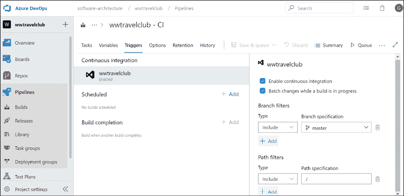</figure>

图 20.1：启用持续集成复选框

值得一提的是，如果您有一个包含单元和功能测试的解决方案集，那么一旦您提交了代码，它就会自动编译和测试。这将使您的主分支在团队每次提交后都保持稳定和安全。

CI 的关键是能够更快地识别问题。当您允许他人测试和分析代码时，您将有这个机会。DevOps 方法的唯一帮助是确保尽快实现这一点。

# 了解 Azure DevOps 的连续交付

一旦构建了应用的每个提交，并且该代码通过单元测试和功能测试进行了测试，您可能还希望继续部署它。这样做不仅仅是配置工具的问题。作为一名软件架构师，您需要确保团队和流程已准备好进入此步骤。但是，让我们看看如何使用本书中的用例启用第一个部署场景。

## 使用 Azure 管道部署包管理应用

在本节中，我们将为我们在*第 18 章*末尾的用例中定义的 DevOps 项目配置一个自动部署到 Azure 应用服务平台，*使用单元测试用例和 TDD*测试您的代码。Azure DevOps 还可以自动创建新的 web 应用，但为了防止配置错误（这可能会消耗您所有的免费信用），我们将手动创建它，并让 Azure DevOps 仅部署该应用。所有必需的步骤都被组织成不同的小节，如下所示。

### 创建 Azure Web 应用和 Azure 数据库

Azure Web 应用可以通过以下简单步骤来定义：

1.  Go to the Azure Portal and select **App Services**, and then click the **Add** button to create a new Web App. Fill in all data as follows:

    <figure class="mediaobject">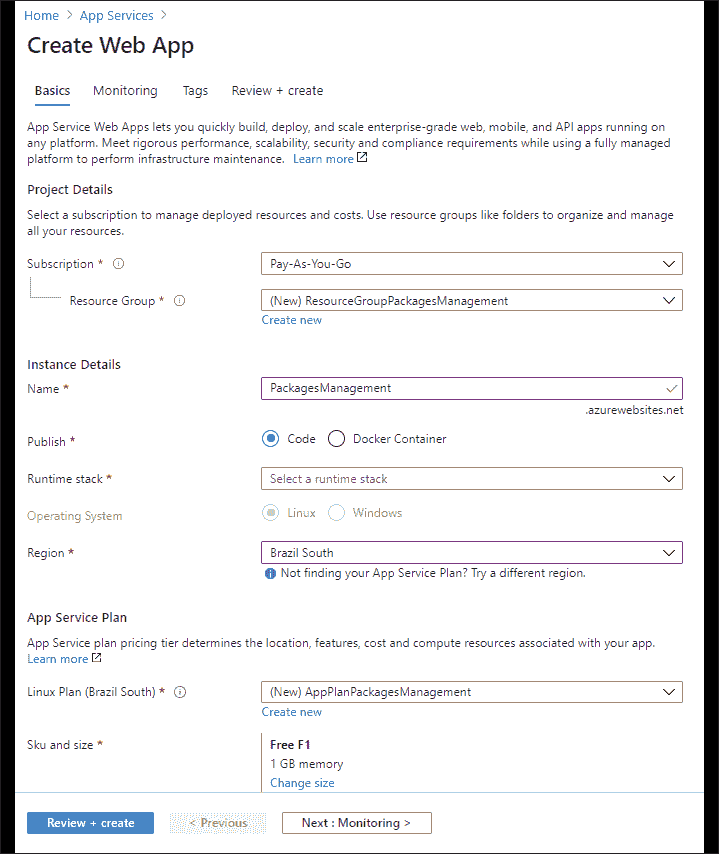</figure>

    图 20.2：创建 Azure Web 应用

2.  显然，您可以使用您已经拥有的**资源组**，以及您最方便的区域。对于**运行时堆栈**，请选择与 Visual Studio 解决方案中使用的相同的.NETCore版本。
3.  现在，如果您有足够的信用，让我们为应用创建一个 SQL Server 数据库，并将其命名为`PackagesManagementDatabase`。如果您没有足够的信用，不要担心您仍然可以测试应用部署，但是应用在尝试访问数据库时会返回错误。请参考*第 9 章*的*关系数据库*小节*如何选择云中的数据存储*，了解如何创建 SQL Server 数据库。

### 配置 Visual Studio 解决方案

一旦定义了 Azure Web App，您需要通过以下简单步骤配置应用以在 Azure 中运行：

1.  如果定义了 Azure 数据库，则在 Visual Studio 解决方案中需要两个不同的连接字符串，一个用于本地数据库的开发，另一个用于 Azure Web 应用。
2.  Now, open both `appsettings.Development.json` and `appsettings.json` in your Visual Studio solution, as follows:

    <figure class="mediaobject"></figure>

    图 20.3:Visual Studio 中的打开设置

3.  然后将`appsettings.json`的整个`ConnectionStrings`节点复制到`appsettings.Development.json`中，如下所示：

    ```cs
    "ConnectionStrings": {
            "DefaultConnection": "Server=(localdb)....."
    }, 
    ```

4.  现在您在开发设置中有了本地连接字符串，因此您可以将`appsettings.json`中的`DefaultConnection`更改为 Azure 数据库之一。
5.  转到 Azure 门户中的数据库，复制连接字符串，并用定义数据库服务器时获得的用户名和密码填充它。
6.  最后，在本地提交更改，然后与远程存储库同步。现在，您的更改位于 DevOps 管道上，该管道已经在处理这些更改以获得新的构建。

### 配置 Azure 管道

最后，您可以通过以下步骤配置 Azure 管道，以便在 Azure 上自动交付您的应用：

1.  通过单击 Visual Studio**团队资源管理器**窗口**连接**选项卡中的**管理连接**链接，将 Visual Studio 与您的 DevOps 项目连接起来。然后，单击 DevOps 链接转到您的在线项目。
2.  修改`PackagesManagementWithTest`构建管道，在单元测试步骤后添加进一步步骤。事实上，我们需要一个步骤来准备所有要在 ZIP 文件中部署的文件。
3.  点击`PackagesManagementWithTest`管道的**编辑**按钮，然后转到文件末尾并写入以下内容：

    ```cs
    - task: PublishBuildArtifacts@1 
    ```

4.  When the **Settings** link appears above the new task, click it to configure the new task:

    <figure class="mediaobject"></figure>

    图 20.4：配置发布构建工件窗格

5.  接受要发布的默认**路径**，因为它已经与将部署应用的任务的路径同步，插入工件名称，然后选择**Azure Pipelines**作为位置。保存后，管道将立即启动，新添加的任务应该会成功。
6.  部署和其他发布工件被添加到称为**发布管线**的不同管线中，以将它们与构建相关工件分离。使用**发布管道**，您无法编辑`.yaml`文件，但您将使用图形界面。
7.  点击**发布**左侧菜单页签，新建**发布管道**。单击**添加新管道**后，系统将提示您添加第一管道阶段的第一个任务。事实上，整个发布管道由不同的阶段组成，每个阶段对任务序列进行分组。虽然每个阶段只是一系列任务，但阶段图可以进行分支，我们可以在每个阶段之后添加几个分支。通过这种方式，我们可以部署到需要不同任务的不同平台。在我们的简单示例中，我们将使用单个阶段。
8.  选择**部署 Azure 应用服务**任务。添加此任务后，系统将提示您填写缺少的信息。
9.  Click the **error link** and fill in the missing parameters:

    <figure class="mediaobject">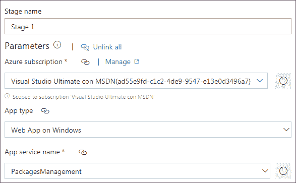</figure>

    图 20.5：配置发布阶段

10.  选择您的订阅，然后，如果出现授权按钮，请单击它以**授权**Azure 管道访问您的订阅。然后选择 Windows 作为部署平台，最后从**应用服务名称**下拉列表中选择您创建的应用服务。任务设置在您写入时会自动保存，因此您只需点击整个管道的**保存**按钮即可。
11.  Now, we need to connect this pipeline to a source artifact. Click the **Add Artifact** button and then select **Build** as the source type, because we need to connect the new release pipeline with the ZIP file created by our build pipeline. A settings window appears:

    <figure class="mediaobject"></figure>

    图 20.6：定义要发布的工件

12.  从下拉列表中选择我们的上一个构建管道，并保留**最新**作为版本。接受**来源别名**中的建议名称。
13.  Our release pipeline is ready and can be used as it is. The image of the source artifact you just added contains a trigger icon in its top-right corner, as follows:

    <figure class="mediaobject">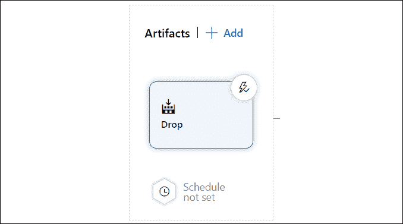</figure>

    图 20.7：准备发布的工件

14.  If you click on the trigger icon, you are given the option to automatically trigger the release pipeline as soon as a new build is available:

    <figure class="mediaobject">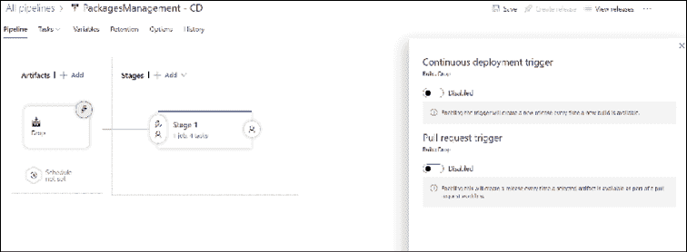</figure>

    图 20.8：启用连续部署触发器

15.  使其处于禁用状态；我们可以在完成并手动测试发布管道之后启用它。

正如我们前面提到的，为了准备自动触发，我们需要在部署应用之前添加人工批准任务。

### 为发布添加手动批准

由于任务通常由软件代理执行，我们需要在手动作业中嵌入人工批准。让我们通过以下步骤添加它：

1.  Click the three dots on the right of the **Stage 1** header:

    <figure class="mediaobject"></figure>

    图 20.9：向阶段添加人工批准

2.  Then, select **Add an agentless job**. Once the agentless job has been added, click the **add** button and add a **Manual intervention** task. The following screenshot shows the **Manual intervention** settings:

    <figure class="mediaobject">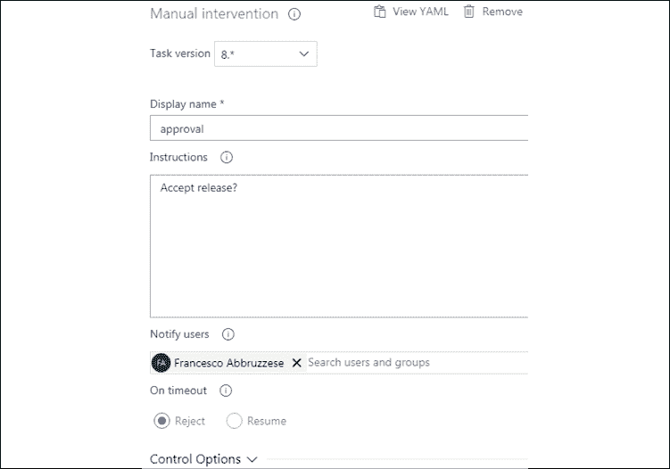</figure>

    图 20.10：为阶段配置人工批准

3.  为操作员添加说明，并在**通知用户**字段中选择您的账户。
4.  Now, drag the whole **Agentless job** with the mouse and place it before the application deployment task. It should look like this:

    <figure class="mediaobject"></figure>

    图 20.11：设置人员批准部署任务列表

5.  完了！点击左上角**保存**按钮保存管道。

现在，一切都准备好创建我们的第一个自动版本。

### 创建发布

一旦一切就绪，可以按如下方式准备和部署新版本：

1.  Let's click the **Create release** button to start the creation of a new release, as shown in the following screenshot:

    <figure class="mediaobject"></figure>

    图 20.12：创建新版本

2.  Verify that the **Source alias** is the last available one, add a **Release description**, and then click **Create**. In a short time, you should receive an email for release approval. Click the link it contains and go to the approval page:

    <figure class="mediaobject"></figure>

    图 20.13：批准发布

3.  Click the **Approve** button to approve the release. Wait for the **deployment** to complete. You should have all the tasks successfully completed, as shown in the following screenshot:

    <figure class="mediaobject"></figure>

    图 20.14：已部署的版本

4.  您已经运行了第一个成功的发布管道！

在实际项目中，发布管道将包含更多的任务。事实上，应用（在实际生产环境中部署之前）是在测试版测试的登台环境中部署的。因此，在第一次部署之后，可能会有一些手动测试，生产中部署的手动授权，以及生产中的最终部署。

## 多阶段环境

与**连续交付**（**CD**相关的方法需要来保证每次新部署时生产环境的安全。为此，需要采用多级管道。下面的屏幕截图显示了一种具有常见阶段的方法，使用书籍用例作为演示：

<figure class="mediaobject">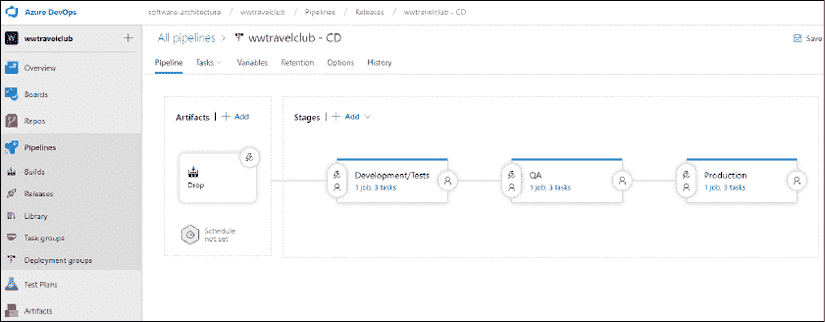</figure>

图 20.15：使用 Azure DevOps 的发布阶段

如您所见，这些阶段是使用 Azure DevOps 发布管道配置的。每个阶段都有自己的目的，这将利用最终交付的产品的质量。让我们看看阶段：

*   **开发/测试**：开发人员和测试人员使用此阶段构建新功能。这个环境肯定是最容易受到 bug 和不完整功能影响的环境。
*   **质量保证**：该环境为团队中与开发和测试无关的领域提供了新功能的简要版本。项目经理、市场营销、供应商和其他人可以将其作为研究、验证甚至试生产的一个领域。此外，开发和质量团队可以保证正确部署新版本，同时考虑功能和基础架构。
*   **生产：**这是客户运行解决方案的阶段。CD 表示，良好生产环境的目标是尽快更新。频率将根据团队规模而变化，但有一些方法会使该过程每天发生一次以上。

部署应用的这三个阶段的采用将影响解决方案的质量。它还将使团队有一个更安全的部署过程，具有更少的风险和更好的产品稳定性。乍一看，这种方法可能有点昂贵，但如果没有它，糟糕部署的结果通常会比这项投资更昂贵。

除了所有的安全性外，你还必须考虑多阶段的情况。您可以通过以下方式设置管道：只有通过定义的授权，您才能从一个阶段移动到另一个阶段：

<figure class="mediaobject"></figure>

图 20.16：定义部署前条件

正如您在前面的屏幕截图中所看到的，设置部署前条件非常简单，并且您可以在下面的屏幕截图中看到，定制授权方法的选项不止一个。这使您有可能改进 CD 方法，完全满足您正在处理的项目的需要。

以下屏幕截图显示了 Azure DevOps 为部署前批准提供的选项。您可以定义可以批准阶段的人员并为他们设置策略，即在完成流程之前重新验证批准者身份。作为软件架构师，您需要确定适合您使用此方法创建的项目的配置：

<figure class="mediaobject"></figure>

图 20.17：部署前批准选项

值得一提的是，尽管这种方法远比单阶段部署好，但作为软件架构师，DevOps 管道将引导您进入另一个监控阶段。持续的反馈将是实现这一点的一个令人难以置信的工具，我们将在下一节讨论这种方法。

# 定义持续反馈和相关的 DevOps 工具

一旦您有了一个在上一节描述的部署场景中完美运行的解决方案，您的团队就必须了解发布结果以及版本如何为客户工作。为了获得反馈，一些工具可以帮助开发人员和客户，将这些人聚集在一起，快速跟踪反馈过程。让我们看看这些工具。

## 使用 Azure Monitor Application Insights 监控软件

**Azure Monitor Application Insights**是软件架构师需要的工具，用于不断反馈其解决方案。值得一提的是，Application Insights 是 Azure Monitor 的一部分，Azure Monitor 是一套更广泛的监控功能，还包括警报、仪表板和工作簿。一旦你将你的应用连接到它，你就开始收到对软件的每个请求的反馈。这使您不仅可以监视请求，还可以监视数据库性能、应用可能遇到的错误以及处理时间最长的调用。

显然，将此工具插入到您的环境中会产生成本，但该工具提供的设施是值得的。可能值得注意的是，对于简单的应用，它甚至可以是免费的，因为您需要为接收的数据付费，这是一个免费的配额。此外，您需要了解，由于在**Application Insights**中存储数据的所有请求都在单独的线程中运行，因此性能成本非常小。

值得注意的是，许多服务（如应用服务、功能等）都可以选择在初始创建过程中添加应用洞察，因此您可能已经在阅读本书时创建了应用洞察。尽管如此，以下屏幕截图显示了在您的环境中创建工具的容易程度：

<figure class="mediaobject">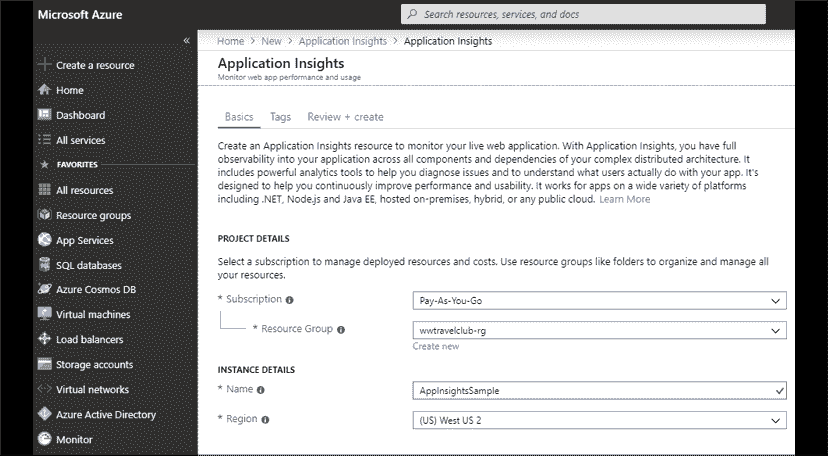</figure>

图 20.18：在 Azure 中创建应用洞察资源

如果您想使用 Visual Studio 在应用中设置应用洞察，您可能会发现此 Microsoft教程非常有用：[https://docs.microsoft.com/en-us/azure/azure-monitor/learn/dotnetcore-quick-start# configure-app insights sdk](https://docs.microsoft.com/en-us/azure/azure-monitor/learn/dotnetcore-quick-start# configure-app-insi)。

例如，假设您需要分析在应用中花费更多时间的请求。将应用洞察附加到 web 应用的过程非常简单：只要您设置了 web 应用，就可以完成。如果您不确定是否为您的 web 应用配置了 Application Insights，则可以使用 Azure 门户查找。导航至**应用服务**并查看**应用洞察**设置，如下图所示：

<figure class="mediaobject"></figure>

图 20.19：在应用服务中实现应用洞察

界面将为您提供创建或将已创建的监控服务附加到 web 应用的机会。值得一提的是，您可以将多个 web 应用连接到同一个 Application Insights 组件。以下屏幕截图显示了如何将 web 应用添加到已创建的 Application Insights 资源：

<figure class="mediaobject">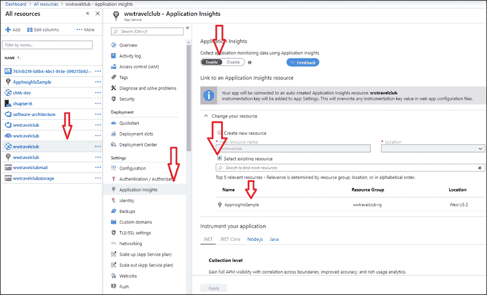</figure>

图 20.20：在应用服务中启用应用洞察

一旦您为您的 web 应用配置了应用洞察，您将在应用服务中找到以下屏幕：

<figure class="mediaobject">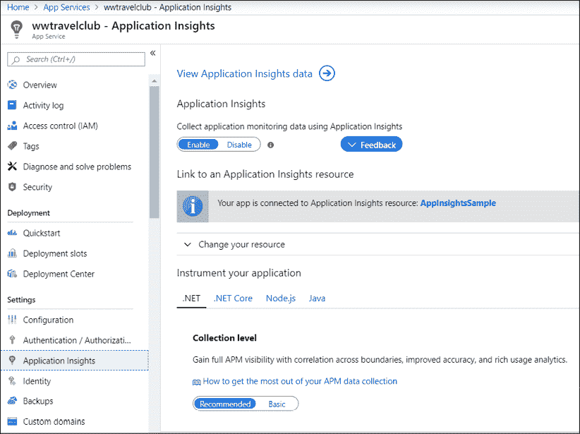</figure>

图 20.21：应用服务中的应用洞察

一旦连接到您的解决方案，数据采集将持续进行，您将在组件提供的仪表板中看到结果。您可以在两个地方找到此屏幕：

*   在 Web 应用门户内配置应用洞察的同一位置
*   在 Azure 门户中，在浏览 Application Insights 资源后：

<figure class="mediaobject"></figure>

图 20.22：正在运行的应用洞察

此仪表板为您提供了失败的请求、服务器响应时间和服务器请求的概念。您还可以打开可用性检查，该检查将从任何 Azure 数据中心向您选择的 URL 发出请求。

但应用洞察的美妙之处在于它对系统的分析有多深入。例如，在下面的屏幕截图中，它将向您提供有关网站上请求数量的反馈。您可以通过对处理时间较长或调用频率较高的项目进行排序来进行分析：

<figure class="mediaobject"></figure>

图 20.23：使用应用洞察分析应用性能

考虑到该视图可以以不同的方式进行过滤，并且您在 web 应用中刚刚收到信息，这当然是一个定义持续反馈的工具。这是使用 DevOps 原则实现客户需求的最佳方法之一。

Application Insights 是一种技术工具，它可以准确地完成软件架构师在真实分析模型中监控现代应用所需的功能。这是一种基于用户在您开发的系统上的行为的持续反馈方法。

## 使用测试和反馈工具启用反馈

在持续反馈过程中，另一个有用的工具是测试和反馈工具，由微软设计，用于帮助产品所有者和质量保证用户分析新功能。

使用 Azure DevOps，您可以通过在每个工作项中选择一个选项来请求团队的反馈，如以下屏幕截图所示：

<figure class="mediaobject">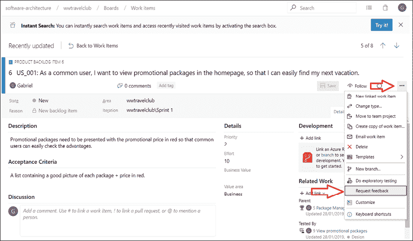</figure>

图 20.24：使用 Azure DevOps 请求反馈

一旦收到反馈请求，您可以使用测试和反馈工具进行分析，并向团队提供正确的反馈。您将能够将该工具连接到您的 Azure DevOps 项目，在分析反馈请求时为您提供更多功能。值得一提的是，此工具是一个 web 浏览器扩展，您需要在使用前安装它。以下屏幕截图显示了如何为测试和反馈工具设置 Azure DevOps 项目 URL：

您可以从[下载此工具 https://marketplace.visualstudio.com/items?itemName=ms.vss-探索测试网站](https://marketplace.visualstudio.com/items?itemName=ms.vss-exploratorytesting-web)。

<figure class="mediaobject"></figure>

图 20.25：将测试和反馈连接到 Azure DevOps 组织

这个工具非常简单。您可以截图、录制流程，甚至可以做笔记。以下屏幕截图显示了在屏幕截图中编写消息的容易程度：

<figure class="mediaobject"></figure>

图 20.26：使用测试和反馈工具提供反馈

好的是您将所有这些分析记录在会话时间线中。正如您可以在下一个屏幕截图中看到的，您可以在同一个会话中获得更多反馈，这有利于分析过程：

<figure class="mediaobject">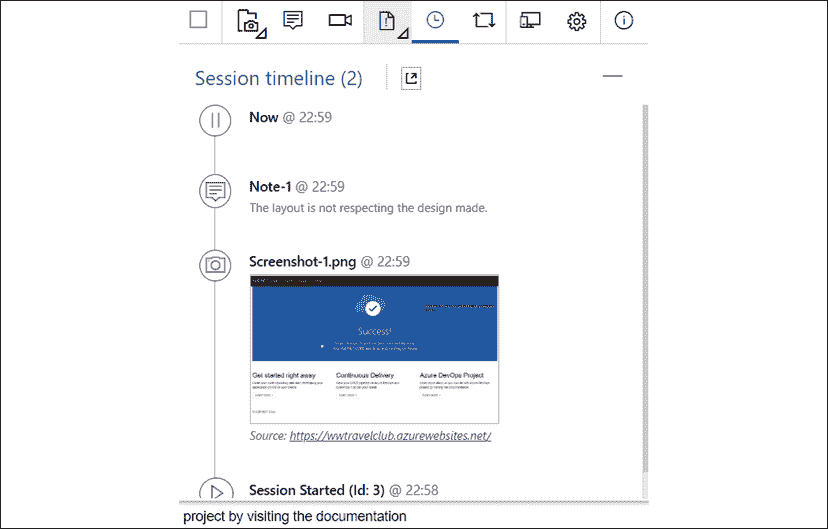</figure>

图 20.27：使用测试和反馈工具提供反馈

一旦您完成分析并连接到 Azure DevOps，您将能够报告错误、创建任务，甚至启动新的测试用例：

<figure class="mediaobject"></figure>

图 20.28：在 Azure DevOps 中打开 bug

创建的bug 的结果可以在Azure DevOps 中的**工作项**板上检查。值得一提的是，您不需要 Azure DevOps 开发者许可证就可以访问此环境区域。这使作为软件架构师的您能够将此基本且有用的工具传播给尽可能多的解决方案关键用户。以下屏幕截图显示了将该工具连接到 Azure DevOps 项目后创建的错误：

<figure class="mediaobject">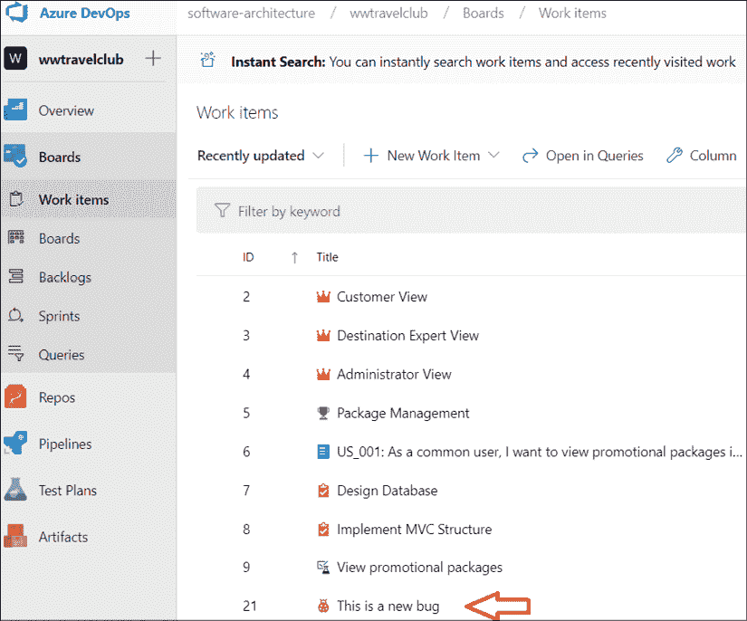</figure>

图 20.29:Azure DevOps 中新报告的 bug

重要的是要有一个像这样的工具来对你的项目有良好的反馈。但是，作为一名软件架构师，您可能必须找到最佳的解决方案来加速这一过程。书中探讨的工具是实现这一目标的好方法。每当你需要在开发过程中再执行一步时，你可以考虑这种方法。持续反馈是软件开发过程中的一个重要步骤，该过程将不断获得新功能。另一个可以利用 DevOps 的非常重要的方法是 SaaS。让我们在下一节中了解它。

# 理解 SaaS

将软件作为服务进行销售/使用涉及一套更广泛的解决方案设计原则，称为**服务设计思维**。服务设计思维不仅仅是一种软件开发技术和/或软件部署方法，它还影响多个业务领域，即组织和人力资源、软件开发过程，最后是硬件基础设施和软件架构。

在接下来的小节中，我们将简要讨论我们列出的每个业务领域的含义，在最后一小节中，我们将特别关注 SaaS 部署模型。

## 使您的组织适应服务场景

第一个组织含义来自为目标组织优化软件价值的需要。这需要人力资源或团队负责规划和监控软件在目标组织中的影响，以最大限度地提高软件的附加值。这种战略角色不仅在初始设计阶段需要，而且在应用的整个生命周期中都需要。事实上，这个角色负责监督使软件与目标组织不断变化的需求保持良好的协调。

另一个重要的影响领域是人力资源管理。事实上，由于主要优先事项是软件增加的价值（而不是利用现有资源和能力），因此人力资源必须适应项目需要。这意味着在需要新员工时尽快获得他们，并通过适当的培训培养所需的能力。

下一小节将讨论软件开发中涉及的所有过程的含义。

## 在服务场景中开发软件

影响软件开发过程的主要约束是需要保持软件对组织的需求进行微调。任何基于 CI/CD 方法的敏捷方法都可以满足这一需求。有关 CI/CD 的简要回顾，请参考*第 3 章*中的*使用 Azure DevOps*组织您的工作，*使用 Azure DevOps*记录需求。值得指出的是，任何设计良好的 CI/CD 周期都应该包括用户反馈和用户满意度报告的处理。

此外，为了优化软件的附加值，组织开发团队（或其一部分）与系统用户密切联系的阶段是一种良好的做法，以便开发人员能够更好地了解软件对目标组织的影响。

最后，在编写功能性和非功能性需求时，必须始终牢记软件增加的价值。因此，在注释*用户故事*时，考虑*为什么*以及*它们如何为价值做出贡献，这是非常有用的。收集需求的过程在*第 2 章**非功能性需求*中讨论。*

下一小节将讨论更多的技术含义。

## 服务场景的技术含义

在服务场景中，硬件基础设施和软件架构都受到三个主要原则的约束，这三个原则是保持软件微调以满足组织需求的需求的直接结果，即：

*   需要对软件进行监控，以发现可能由系统故障或软件使用和/或用户需求变化引起的任何问题。这意味着从所有硬件/软件组件中提取运行状况检查和负载统计信息。关于用户执行的操作的统计数据（更具体地说，是用户和应用在每个操作实例上花费的平均时间，以及每单位时间（天、周或月）执行的每个操作的实例数）也给出了发现组织需求变化的良好提示。
*   还有必要监测用户满意度。通过在每个应用屏幕上添加指向易于填写的用户满意度报告页面的链接，可以获得用户满意度反馈。
*   最后，需要快速调整硬件和软件，以适应每个应用模块接收的通信量和组织需求的变化。这意味着：
    *   极度关注软件模块化
    *   为数据库引擎中的更改打开大门，并将**面向服务的架构**（**SOA**或基于微服务的解决方案推荐给单片软件
    *   为新技术敞开大门

使硬件易于适应意味着允许硬件扩展，这反过来意味着要么采用云基础设施，要么采用硬件集群，要么两者兼而有之。对云服务供应商的变化敞开大门也很重要，这反过来意味着将对云平台的依赖封装在少量软件模块中。

软件增值的最大化可以通过选择可用于实现每个模块的最佳技术来实现，这反过来意味着能够混合不同的技术。这就是基于容器的技术（如 Docker）发挥作用的地方。Docker 及其相关技术的描述见：

*   *第 5 章**将微服务架构应用于企业应用*
*   *第 6 章*、*Azure 服务结构*
*   *第 7 章*、*天蓝 Kubernetes 服务*

综上所述，我们列出的所有需求都汇聚到了本书中描述的大多数先进技术，如云服务、可伸缩 web应用、分布式/可伸缩数据库、Docker、Kubernetes、SOA 和微服务架构。

下一节将详细介绍如何为服务环境准备软件，而下一小节将专门介绍 SaaS 应用的优缺点。

## 决定何时采用 SaaS 解决方案

SaaS 解决方案的主要吸引力在于其灵活的支付模式，其具有以下优势：

*   你可以避免放弃大额投资，转而选择更实惠的月度付款方式
*   您可以从一个便宜的系统开始，然后只有在业务增长时才转向更昂贵的解决方案

但是，SaaS 解决方案还提供了其他优势，即：

*   在所有云解决方案中，您都可以轻松地扩展解决方案
*   应用将自动更新
*   由于 SaaS 解决方案是通过公共互联网交付的，因此可以从任何位置访问它们

不幸的是，SaaS 的优势是有代价的，因为 SaaS 也有一些不可忽视的缺点，即以下几点：

*   您的业务与 SaaS 提供商有着严格的联系，SaaS 提供商可能会中断服务和/或以您无法接受的方式对其进行修改。
*   通常，您无法实现任何类型的定制，仅限于 SaaS 供应商提供的几个标准选项。然而，有时 SaaS 供应商还提供添加由他们或您编写的自定义模块的可能性。

总之，SaaS解决方案提供了有趣的优点，但也存在一些缺点，因此作为软件架构师，您必须执行详细的分析，以决定如何采用它们。

下一节将解释如何调整软件以在服务场景中使用。

## 为服务场景准备解决方案

首先，*为服务场景*准备解决方案意味着专门为云和/或分布式环境设计解决方案。反过来，这意味着在设计时要考虑可伸缩性、容错性和自动故障恢复。

前面三点的主要含义与*状态*的处理方式有关。无状态模块实例易于扩展和替换，因此您应该仔细规划哪些模块是无状态的，哪些模块具有状态。此外，正如*第 9 章*、*如何选择云中的数据存储*中所述，您必须记住，写操作和读操作以完全不同的方式进行缩放。读操作更容易通过复制进行扩展，而写操作不能很好地通过关系数据库进行扩展，通常需要 NoSQL 解决方案。

分布式环境中的高可扩展性通常防止使用分布式事务和同步操作。因此，只有使用基于异步消息的更复杂技术才能实现数据一致性和容错，例如：

*   一种技术是将要发送的所有消息存储在队列中，以便在发生错误或超时时重试异步传输。当收到接收确认或模块决定中止生成消息的操作时，可以从队列中删除消息。
*   另一种是处理同一消息被多次接收的可能性，因为超时导致同一消息被多次发送。
*   如果需要，可以使用乐观并发和事件源等技术来最小化数据库中的并发问题。乐观并发在*第 15 章*末尾的*定义用例的数据层*小节中进行了解释，*展示了 ASP.NETCore MVC*，而事件源在*中与其他数据层内容一起描述，使用坚实的原则映射您的域**第 12 章*章节*了解软件解决方案*中的不同领域。

前面列表中的前两点将与*中的其他分布式处理技术一起详细讨论。NETCore如何处理微服务？*第 5 章*的*部分*将微服务架构应用于您的企业应用*。

容错和自动故障恢复要求软件模块实现云框架可能调用的健康检查接口，以验证模块是否正常工作，或者是否需要终止模块并由另一个实例替换。ASP.NETCore和所有 Azure microservices 解决方案都提供基本的现成健康检查，因此开发人员无需进行检查。但是，可以通过实现一个简单的接口来添加更详细的自定义运行状况检查。

如果您的目标是可能更改某些应用模块的云提供程序，那么难度就会增加。在这种情况下，来自云平台的依赖必须封装在几个模块中，并且必须放弃与特定云平台过于严格绑定的解决方案。

如果您的应用是为服务场景设计的，那么一切都必须自动化：新版本的测试和验证、应用所需的整个云基础设施的创建，以及应用在该基础设施上的部署。

所有云平台都提供了自动化整个软件 CI/CD 周期的语言和设施，即构建代码、测试代码、触发手动版本批准、硬件基础设施创建和应用部署。

Azure 管道允许完全自动化列出的所有步骤。*第 18 章*中的用例*使用单元测试用例和 TDD*测试您的代码，展示了如何使用 Azure 管道自动化所有步骤，包括软件测试。下一节中的用例将展示如何在 Azure Web Apps 平台上自动化应用部署。

自动化在 SaaS 应用中具有更为基础的作用，因为为每个新客户创建新租户的整个过程必须由客户订阅自动触发。更具体地说，多租户 SaaS 应用可以通过三种基本技术实现：

*   所有客户共享相同的硬件基础架构和数据存储。此解决方案最容易实现，因为它需要实现标准的 web 应用。但是，这仅适用于非常简单的 SaaS 服务，因为对于更复杂的应用，越来越难以确保存储空间和计算时间在用户之间平均分配。此外，随着数据库变得越来越复杂，安全隔离不同用户的数据总是越来越困难。
*   所有客户共享相同的基础架构，但每个客户都有自己的数据存储。此选项解决了以前解决方案中的所有数据库问题，并且非常容易实现自动化，因为创建新租户只需要创建新数据库。此解决方案通过将定价策略与存储消耗量联系起来，提供了一种定义定价策略的简单方法。
*   每个客户都有自己的专用基础架构和数据存储。这是最灵活的策略。从用户的角度来看，它唯一的缺点是价格较高。因此，仅在每个用户所需的最小计算能力阈值以上才方便。自动化更加困难，因为必须为每个新客户创建一个完整的基础架构，并且必须在其上部署一个新的应用实例。

无论选择这三种策略中的哪一种，您都需要能够随着消费者的增加扩展您的云资源。

如果您还需要的可能性来确保您的基础设施创建脚本能够跨多个云提供商工作，那么，一方面，您不能使用过于特定于单个云平台的功能，另一方面，您需要一种独特的基础设施创建语言，可以将其翻译成更常见的云平台的本地语言。Terraform 和 Ansible 是描述硬件基础设施的两种常见选择。

# WWTravelClub 项目方法

在本章中，WWTravelClub 项目的截图展示了实现良好 DevOps 循环所需的步骤。WWTravelClub 团队决定使用 Azure DevOps，因为他们知道该工具对于在整个周期内获得最佳 DevOps 体验至关重要。

这些需求是使用用户故事编写的，可以在 Azure DevOps 的**工作项**部分找到。代码放在 Azure DevOps 项目的存储库中。这两个概念在*第 3 章*中进行了解释，*使用 Azure DevOps*记录需求。

用于完成工作的管理生命周期是 Scrum，见*第 1 章**理解软件架构的重要性*。这种方法将实现分为多个 sprint，强制要求在每个周期结束时交付价值。使用我们在本章中学习的持续集成工具，每次团队完成对存储库主分支的开发时，都将编译代码。

一旦代码被编译和测试，部署的第一阶段就完成了。第一阶段通常称为开发/测试，因为您可以为内部测试启用它。应用洞察和测试与反馈都可以用于获取新版本的第一个反馈。

如果测试和新版本的反馈通过，那么是时候进入第二阶段了，即质量保证。应用洞察、测试和反馈可以再次使用，但现在可以在更稳定的环境中使用。

该周期以在生产阶段部署的授权结束。这当然是一个艰难的决定，但 DevOps 指出，您必须不断地这样做，才能从客户那里获得更好的反馈。Application Insights 一直是一个有用的工具，因为您可以在生产中监控新版本的演变，甚至可以将其与过去的版本进行比较。

本文描述的 WWTravelClub 项目方法可用于许多其他现代应用开发生命周期。作为一名软件架构师，您必须监督整个过程。工具已经准备好了，这取决于你把事情做好！

# 总结

在本章中，我们了解到，DevOps 不仅是一组用于持续交付软件的技术和工具，而且是一种能够持续向您正在开发的项目的最终用户交付价值的理念。

考虑到这种方法，我们看到了持续集成、持续交付和持续反馈对于 DevOps 的目的是多么重要。我们还了解了 Azure、Azure DevOps 和 Microsoft 工具如何帮助您实现目标。

我们描述了*服务设计思想*原则和 SaaS 软件部署模型。现在，您应该能够分析这些方法对组织的所有影响，并且应该能够调整现有的软件开发过程和硬件/软件架构，以利用它们提供的机会。

我们还解释了软件周期自动化、云硬件基础设施配置和应用部署的必要性和涉及的技术。

一旦您实现了所示的示例，您应该能够使用 Azure 管道自动化基础架构配置和应用部署。本章以 WWTravelClub 为例阐述了这种方法，在 Azure DevOps 中启用 CI/CD，并使用应用洞察和测试与反馈工具进行技术和功能反馈。在现实生活中，这些工具将使您能够更快速地了解正在开发的系统的当前行为，因为您将对其有持续的反馈。

在下一章中，我们将详细了解持续集成，它在服务场景和 SaaS 应用维护中起着基础作用。

# 问题

1.  什么是 DevOps？
2.  什么是持续集成？
3.  什么是连续交付？
4.  什么是持续反馈？
5.  构建管道和发布管道之间有什么区别？
6.  DevOps 方法中应用洞察的主要目的是什么？
7.  测试和反馈工具如何在 DevOps 过程中提供帮助？
8.  服务设计思维的主要目标是什么？
9.  服务设计思维需要优化利用公司现有的所有能力，这是真的吗？
10.  为什么完全自动化是 SaaS 应用生命周期的基础？
11.  是否可以使用平台无关语言定义硬件云基础设施？
12.  自动化整个应用生命周期的首选 Azure 工具是什么？
13.  如果两个 SaaS 供应商提供相同的软件产品，您应该使用最可靠还是最便宜的软件产品？
14.  可伸缩性是服务场景中唯一重要的需求吗？

# 进一步阅读

以下是一些网站，您可以在其中找到有关本章所涵盖主题的更多信息：

*   [http://donovanbrown.com/](http://donovanbrown.com/)
*   [https://azure.microsoft.com/en-us/overview/what-is-devops/](https://azure.microsoft.com/en-us/overview/what-is-devops/)
*   [https://www.packtpub.com/networking-and-servers/devops-fundamentals-video](https://www.packtpub.com/networking-and-servers/devops-fundamentals-video)
*   [https://docs.microsoft.com/en-us/azure/devops/learn/what-is-devops](https://docs.microsoft.com/en-us/azure/devops/learn/what-is-devops)
*   [https://azuredevopslabs.com/labs/devopsserver/exploratorytesting/](https://azuredevopslabs.com/labs/devopsserver/exploratorytesting/)
*   [https://docs.microsoft.com/en-us/azure/azure-monitor/app/app-insights-overview](https://docs.microsoft.com/en-us/azure/azure-monitor/app/app-insights-overview)
*   [https://marketplace.visualstudio.com/items?itemName=ms.vss-探索测试网站](https://marketplace.visualstudio.com/items?itemName=ms.vss-exploratorytesting-web)
*   [https://docs.microsoft.com/en-us/azure/devops/test/request-stakeholder-feedback](https://docs.microsoft.com/en-us/azure/devops/test/request-stakeholder-feedback)
*   [https://docs.microsoft.com/en-us/azure/devops/pipelines/?view=azure-devops](https://docs.microsoft.com/en-us/azure/devops/pipelines/?view=azure-devops)
*   [https://www.terraform.io/](https://www.terraform.io/)
*   [https://www.ansible.com/](https://www.ansible.com/)