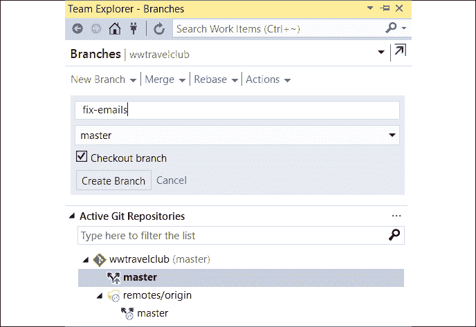
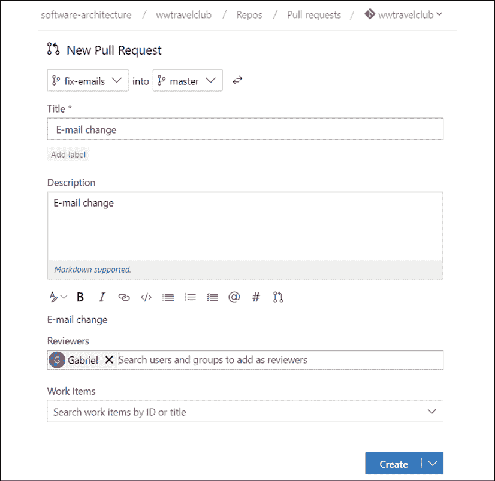
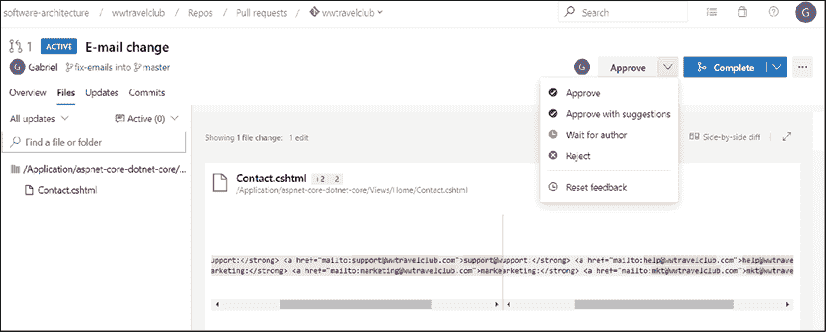
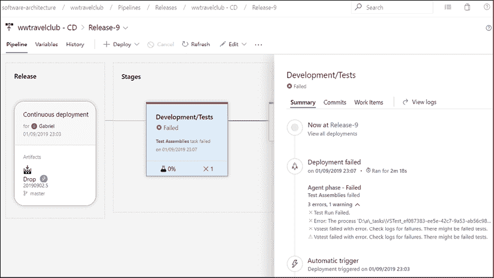
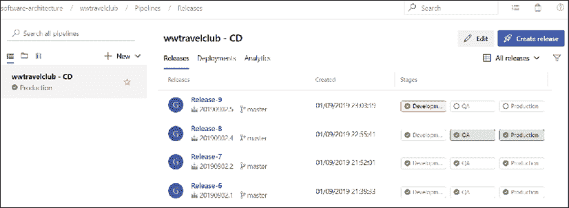

# 21

# 应用 CI 场景的挑战

**持续集成**（**CI**有时被称为 DevOps 的先决条件。在上一章中，我们讨论了 CI 的基础知识以及 DevOps 如何依赖它。在*第 20 章*、*理解 DevOps 原则*中也介绍了其实现。但与其他实际章节不同，本章的目的是讨论如何在真实场景中启用 CI，同时考虑到您作为软件架构师将需要应对的挑战。

本章涵盖的主题如下：

*   理解词
*   持续集成和 GitHub
*   了解使用 CI 时的风险和挑战
*   了解本章的 WWTravelClub 项目方法

与前一章一样，WWTravelClub 的示例将在本章的解释过程中呈现，因为用于举例说明 CI 的所有屏幕都来自 WWTravelClub。除此之外，我们将在本章末尾提供一个结论，以便您轻松理解 CI 原则。

在本章结束时，您将能够决定是否在项目环境中使用 CI。此外，您将能够定义成功使用此方法所需的工具。

# 技术要求

本章要求 Visual Studio 2019 社区版或更高版本。您可能还需要 Azure DevOps 帐户，如*第 3 章**中所述，用 Azure DevOps*记录需求。您可以在[找到章节的示例代码 https://github.com/PacktPublishing/Software-Architecture-with-C-9-and-.NET-5](https://github.com/PacktPublishing/Software-Architecture-with-C-9-and-.NET-5) 。

# 理解词

正如一旦您开始使用 Azure DevOps 这样的平台，在点击选项时启用 CI 肯定会很容易，正如我们在*第 20 章**理解 DevOps 原则*中所看到的。因此，技术不是实施这一过程的致命弱点。

下面的屏幕截图显示了使用 Azure DevOps 打开 CI 有多容易。通过在构建管道中单击并编辑它，您将能够设置一个触发器，在单击几次后启用 CI：

<figure class="mediaobject"></figure>

图 21.1：启用持续集成触发器

事实上，CI 将帮助您解决一些问题。例如，它将迫使您测试代码，因为您需要更快地提交更改，以便其他开发人员可以使用您正在编程的代码。

另一方面，您不会仅仅通过在 Azure DevOps 中启用 CI 构建来执行 CI。当然，一旦完成提交并完成代码，您就可以启动构建，但这远远不是说您的解决方案中有可用的 CI。

作为一名软件架构师，您需要更加担心它的原因与真正理解 DevOps 有关。正如*第 20 章**理解 DevOps 原则*中所述，向最终用户交付价值的需求始终是决定和绘制开发生命周期的好方法。因此，即使打开 CI 很容易，但为最终用户启用此功能的真正业务影响是什么？一旦您找到了这个问题的所有答案，并且知道如何降低实施的风险，那么您就可以说您已经实施了 CI 流程。

值得一提的是，CI 是使 DevOps 更好更快工作的原则，正如*第 20 章*、*理解 DevOps 原则*中所述。但是，如果您不确定您的流程是否足够成熟，无法持续交付代码，那么 DevOps 肯定可以没有它。更重要的是，如果您在一个不够成熟的团队中启用 CI来处理其复杂性，您可能会对 DevOps 产生不好的理解，因为在部署解决方案时，您将开始承担一些风险。关键是，CI 不是 DevOps 的先决条件。启用 CI 后，可以在 DevOps 中加快速度。但是，您可以在没有它的情况下练习 DevOps。

这就是为什么我们要为 CI 多写一章的原因。作为软件架构师，您需要了解打开 CI 的关键点。但是，在我们了解这一点之前，让我们学习另一个可以帮助我们实现持续集成的工具——GitHub。

# 持续集成和 GitHub

自从微软收购 GitHub以来，许多功能都得到了发展，并提供了新的选项，增强了这一强大工具的功能。可以使用 Azure 门户检查此集成，特别是使用 GitHub 操作。

GitHub Actions是一组帮助实现软件开发自动化的工具。它可以在任何平台上实现快速 CI/**连续部署**（**CD**服务，使用 YAML 文件定义其工作流。您可以考虑 GITHUB 行动作为 Azure DeVoPS 管道的替代品。但是，值得一提的是，您可以使用 GitHub 操作自动化任何 GitHub 事件，在 GitHub Marketplace 上有数千个操作：

<figure class="mediaobject"></figure>

图 21.2:GitHub 操作

通过 GitHub 操作界面创建工作流来构建.NETCore Web 应用程序非常简单。正如您在前面的屏幕截图中所看到的，已经创建了一些工作流来帮助我们。我们下面的 YAML 是通过点击**.NETCore**下的**设置此工作流**选项生成的：

```cs
name: .NET Core
on:
  push:
    branches: [ master ]
  pull_request:
    branches: [ master ]
jobs:
  build:
    runs-on: ubuntu-latest
    steps:
    - uses: actions/checkout@v2
    - name: Setup .NET Core
      uses: actions/setup-dotnet@v1
      with:
        dotnet-version: 3.1.301
    - name: Install dependencies
      run: dotnet restore
    - name: Build
      run: dotnet build --configuration Release --no-restore
    - name: Test
      run: dotnet test --no-restore --verbosity normal 
```

通过下面的修改，它能够构建为本章创建的特定于应用程序的版本。

```cs
name: .NET Core Chapter 21
on:
  push:
    branches: [ master ]
  pull_request:
    branches: [ master ]
jobs:
  build:
    runs-on: ubuntu-latest
    steps:
    - uses: actions/checkout@v2
    - name: Setup .NET Core
      uses: actions/setup-dotnet@v1
      with:
        dotnet-version: 5.0.100-preview.3.20216.6
    - name: Install dependencies
      run: dotnet restore ./ch21 
    - name: Build
      run: dotnet build ./ch21 --configuration Release --no-restore
    - name: Test
      run: dotnet test ./ch21 --no-restore --verbosity normal 
```

正如您在下面看到的，一旦脚本更新，就可以检查工作流的结果。如果愿意，还可以启用连续部署。这只是定义正确脚本的问题：

<figure class="mediaobject"></figure>

图 21.3：使用 GitHub 操作的简单应用程序编译

Microsoft提供了专门介绍 Azure 和 GitHub 集成的文档。请在[查看此信息 https://docs.microsoft.com/en-us/azure/developer/github](https://docs.microsoft.com/en-us/azure/developer/github) 。

作为软件架构师，您需要了解哪种工具最适合您的开发团队。Azure DevOps 有一个非常好的环境来支持持续集成，GitHub 也是如此。这里的关键一点是，无论您选择什么选项，一旦启用 CI，您都将面临风险和挑战。让我们在下一个主题中查看它们。

# 了解使用 CI 时的风险和挑战

现在，您可能正在考虑作为避免使用 CI 的一种方式的风险和挑战。但如果它能帮助您创建更好的 DevOps 流程，我们为什么要避免使用它呢？这不是本章的目的。本节的目的是帮助您，作为一名软件架构师，降低风险，并找到一种更好的方法，使用良好的流程和技术来克服挑战。

本节将讨论的风险和挑战列表如下：

*   连续生产部署
*   生产中的不完全特征
*   用于测试的不稳定解决方案

一旦定义了处理这些问题的技术和流程，就没有理由不使用 CI。值得一提的是，DevOps 不依赖 CI。然而，它确实使 DevOps 工作更加顺利。现在，让我们看看它们。

## 禁用连续生产部署

持续生产部署是一个过程，在提交一段新代码和一些管道步骤后，您将在**生产**环境中拥有此代码。这并非不可能，但很难做到，而且成本高昂。此外，您需要一个成熟的团队来实现它。问题是，您将在 internet 上找到的大多数演示和示例演示 CI，都会向您展示部署代码的快速途径。CI/CD 的演示看起来非常简单和容易！这种*简单*可以建议您尽快完成它的实现。但是，如果您再多想一想，如果您直接部署到生产环境中，这种情况可能会很危险！在一个需要每周 7 天、每天 24 小时可用的解决方案中，这是不切实际的。因此，您需要担心这一点，并考虑不同的解决方案。

第一个是使用多阶段场景，如*第 20 章**理解 DevOps 原则*所述。多阶段场景可以为您正在构建的部署的生态系统带来更多的安全性。此外，您将获得更多选项，以避免在生产中进行不正确的部署，例如部署前批准：

<figure class="mediaobject"></figure>

图 21.4：生产环境安全的多阶段场景

同样值得一提的是，您可以构建一个部署管道，其中所有代码和软件结构都将通过该工具进行更新。但是，如果您有此场景之外的内容，例如数据库脚本和环境配置，则不正确的发布到生产中可能会对最终用户造成损害。此外，需要计划何时更新生产环境的决策，并且在许多情况下，需要将即将发生的更改通知所有平台用户。在这些难以决定的情况下，使用*变更管理*程序。

因此，将代码交付到生产环境的挑战将使您考虑这样做的时间表。无论您的周期是每月、每天还是每次提交，这都无关紧要。这里的关键点是，您需要创建一个流程和管道，以确保只有良好且经批准的软件处于生产阶段。但是，值得注意的是，离开部署的时间越长，部署就越可怕，因为以前部署的版本与新版本之间的偏差将越大，并且会一次性推出更多的更改。您越频繁地处理此问题，效果越好。

## 不完整特征

虽然席的开发者正在创建一个新的特性或者修复一个 bug，但是你可能会考虑生成一个分支来避免使用连续传输的分支。分支可以被认为是代码存储库中的一个可用特性，可以创建独立的开发线，因为它隔离了代码。正如您在以下屏幕截图中所看到的，使用 Visual Studio 创建分支非常简单：

<figure class="mediaobject"></figure>

图 21.5：在 Visual Studio 中创建分支

这似乎是一个很好的方法，但让我们假设开发人员已经考虑了可以部署的实现，并且刚刚将代码合并到主分支中。如果这个特性还没有准备好，仅仅因为一个需求被省略了怎么办？如果错误导致了不正确的行为怎么办？其结果可能是发布的功能不完整或修复不正确。

在 master分支中，避免损坏的特性甚至错误的修复的一个良好实践是使用 pull 请求。Pull 请求将让其他团队开发人员知道您开发的代码已准备好合并。以下屏幕截图显示了如何使用 Azure DevOps 为您所做的更改创建**新的拉取请求**：

<figure class="mediaobject"></figure>

图 21.6：创建拉取请求

创建拉取请求并定义审阅者后，每个审阅者都将能够分析代码，并确定该代码是否足够健康，可以进入主分支。以下屏幕截图显示了一种使用比较工具来分析更改的检查方法：

<figure class="mediaobject"></figure>

图 21.7：分析 pull 请求

完成所有审批后，您将能够安全地将代码合并到主分支，如下面的屏幕截图所示。要合并代码，您需要点击**完成合并**。如果启用了 CI 触发器，如本章前面所示，Azure DevOps 将启动构建管道：

<figure class="mediaobject"></figure>

图 21.8：合并 pull 请求

没有办法反驳这样一个事实：如果没有这样一个进程，主分支将遭受大量错误代码的部署，这些错误代码可能会与 CD 一起造成损害。值得一提的是，代码审查是 CI/CD 场景中的一个优秀实践，它被认为是创建高质量软件的一个极好实践。

这里您需要重点关注的挑战是确保最终用户只看到整个功能。您可以使用 feature flag 原则来解决这个问题，这是一种确保只向最终用户显示准备就绪的功能的技术。同样，我们并不是说 CI 是一种工具，而是一种在每次需要为生产交付代码时都要定义和使用的过程。

值得一提的是为了控制环境中的功能可用性，功能标志比使用分支/拉请求安全得多。两者都有各自的位置，但拉取请求是关于在 CI 阶段控制代码质量的，而特性标志是用于在 CD 阶段控制特性可用性的。

## 用于测试的不稳定解决方案

考虑到您已经缓解了本主题中提出的另外两个风险，您可能会发现在 CI 之后出现错误代码是不常见的。确实，前面提到的担忧肯定会减轻，因为您正在处理一个多阶段场景，并在推到第一阶段之前拉取请求。

但是，有没有一种方法可以加速对发布的评估，确保这个新发布已经为您的涉众的测试做好了准备？是的，有！从技术上讲，您可以这样做的方式在*第 18 章*、*使用单元测试用例和 TDD*以及*第 22 章*、*功能测试自动化*的用例中进行了描述。

正如这两章中所讨论的，考虑到实现自动化所需的努力，自动化软件的每个部分是不可行的。此外，在用户界面或业务规则变化很大的情况下，自动化的维护成本可能会更高。尽管这是一个艰难的决定，但作为软件架构师，您必须始终鼓励使用自动化测试。

为了举例说明，让我们看一下以下屏幕截图，其中显示了由 Azure DevOps 项目模板创建的 WWTravelClub 的单元和功能测试示例：

<figure class="mediaobject"></figure>

图 21.9：单元和功能测试项目

在*第 11 章*中介绍了一些架构模式，如 SOLID、*设计模式和.NET 5 实现*以及质量保证方法，如同行评审，它们将为您提供比软件测试更好的结果。

然而，这些方法并不会使自动化实践无效。事实上，所有这些都有助于获得稳定的解决方案，尤其是在运行 CI 场景时。在这种环境中，您能做的最好的事情就是尽可能快地检测错误和错误行为。如前所示，单元测试和功能测试都将帮助您实现这一点。

单元测试将在部署之前、构建管道期间发现业务逻辑错误，这对您有很大帮助。例如，在下面的屏幕截图中，您将发现一个模拟错误，该错误取消了构建，因为单元测试没有通过：

<figure class="mediaobject"></figure>

图 21.10：单元测试结果

得到这个错误的方法很简单。您需要根据单元测试正在检查的内容编写一些没有响应的代码。一旦您提交了它，考虑到您有持续部署的触发器，您将在管道中进行代码构建。我们创建的 Azure DevOps 项目向导提供的最后一个步骤是执行单元测试。因此，在构建代码之后，单元测试将运行。如果代码不再与测试匹配，您将得到一个错误。

同时，下面的屏幕截图显示了在**开发/测试**阶段的功能测试中出现的错误。此时，**开发/测试**环境中有一个 bug 被功能测试快速检测到：

<figure class="mediaobject"></figure>

图 21.11：功能测试结果

但这并不是在 CI/CD 过程中应用功能测试的唯一好处，一旦您用这种方法保护了其他部署阶段。例如，让我们看一下 Azure DevOps 中**版本**管道接口的以下屏幕截图。如果您查看**Release-9**，您会发现，由于此错误发生在**开发/测试**环境中发布之后，多阶段环境将保护部署的其他阶段：

<figure class="mediaobject"></figure>

图 21.12：多阶段环境保护

在 CI 过程中成功的关键在于将其视为加速软件交付的有用工具，并且不要忘记团队始终需要为最终用户交付价值。通过这种方法，前面介绍的技术将提供难以置信的方法来实现团队的目标。

# 了解 WWTravelClub 项目方法

本章介绍了 WWTravelClub项目截图，举例说明了在启用 CI 的同时采用更安全方法的步骤。即使将 WWTravelClub 视为一个假设场景，在构建它时也考虑了一些问题：

*   CI 已启用，但也启用了多阶段方案。
*   即使在多阶段场景中，pull 请求也是一种保证在第一阶段只显示高质量代码的方法。
*   为了做好 pull 请求，需要进行同行评审。
*   例如，同行评审会在创建新功能时检查功能标志是否存在。
*   同行评审检查在创建新特性期间开发的单元测试和功能测试。

以上步骤并非仅适用于 WWTravelClub。作为一名软件架构师，您需要定义确保安全 CI 场景的方法。你可以以此为出发点。

# 总结

本章介绍了理解何时可以在软件开发生命周期中启用 CI 的重要性，同时考虑到一旦您决定将其用于解决方案，作为软件架构师将面临的风险和挑战。

此外，本章还介绍了一些可以简化此过程的解决方案和概念，如多阶段环境、请求审查、功能标志、同行审查和自动化测试。了解这些技术和流程将使您能够在 DevOps 场景中使用 CI 时引导您的项目走向更安全的行为。

在下一章中，我们将看到软件测试的自动化是如何工作的。

# 问题

1.  什么是 CI？
2.  你能有没有 CI 的 DevOps？
3.  在不成熟的团队中启用 CI 有哪些风险？
4.  多阶段环境如何帮助 CI？
5.  自动化测试如何帮助 CI？
6.  拉式请求如何帮助 CI？
7.  拉取请求是否仅适用于 CI？

# 进一步阅读

以下是一些网站，您可以在其中找到有关本章所涵盖主题的更多信息：

*   有关 CI/CD 的 Microsoft 官方文档：
    *   [https://azure.microsoft.com/en-us/solutions/architecture/azure-devops-continuous-integration-and-continuous-deployment-for-azure-web-apps/](https://azure.microsoft.com/en-us/solutions/architecture/azure-devops-continuous-integration-and-con)
    *   [https://docs.microsoft.com/en-us/azure/devops-project/azure-devops-project-github](https://docs.microsoft.com/en-us/azure/devops-project/azure-devops-project-github)
    *   [https://docs.microsoft.com/en-us/aspnet/core/azure/devops/cicd](https://docs.microsoft.com/en-us/aspnet/core/azure/devops/cicd)
    *   [https://docs.microsoft.com/en-us/azure/devops/repos/git/pullrequest](https://docs.microsoft.com/en-us/azure/devops/repos/git/pullrequest)
*   Azure 和 GitHub 集成：
    *   [https://docs.microsoft.com/en-us/azure/developer/github](https://docs.microsoft.com/en-us/azure/developer/github)
*   关于 DevOps 的大量材料：
    *   [https://www.packtpub.com/virtualization-and-cloud/professional-microsoft-azure-devops-engineering](https://www.packtpub.com/virtualization-and-cloud/professional-microsoft-azure-devops-engineering)
    *   [https://www.packtpub.com/virtualization-and-cloud/hands-devops-azure-video](https://www.packtpub.com/virtualization-and-cloud/hands-devops-azure-video)
    *   [https://www.packtpub.com/networking-and-servers/implementing-devops-microsoft-azure](https://www.packtpub.com/networking-and-servers/implementing-devops-microsoft-azure )
*   有关 Azure 管道的一些新信息：
    *   [https://devblogs.microsoft.com/devops/whats-new-with-azure-pipelines/](https://devblogs.microsoft.com/devops/whats-new-with-azure-pipelines/)
*   有关功能标志的说明：
    *   [https://martinfowler.com/bliki/FeatureToggle.html](https://martinfowler.com/bliki/FeatureToggle.html)