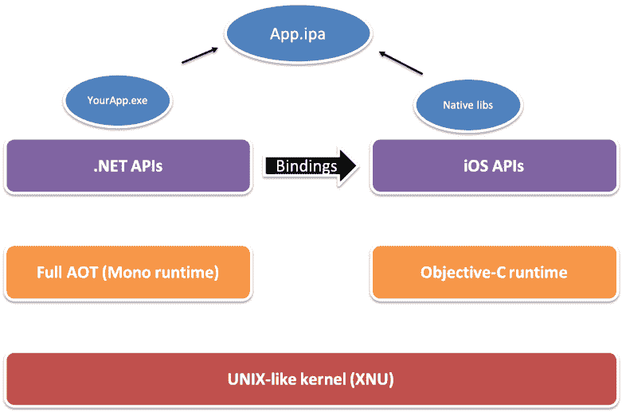
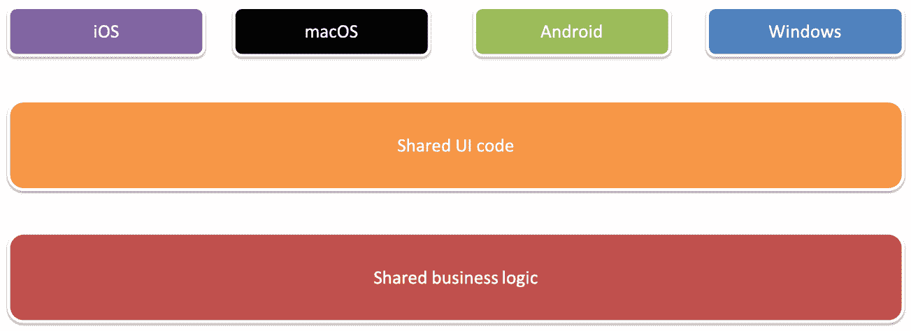
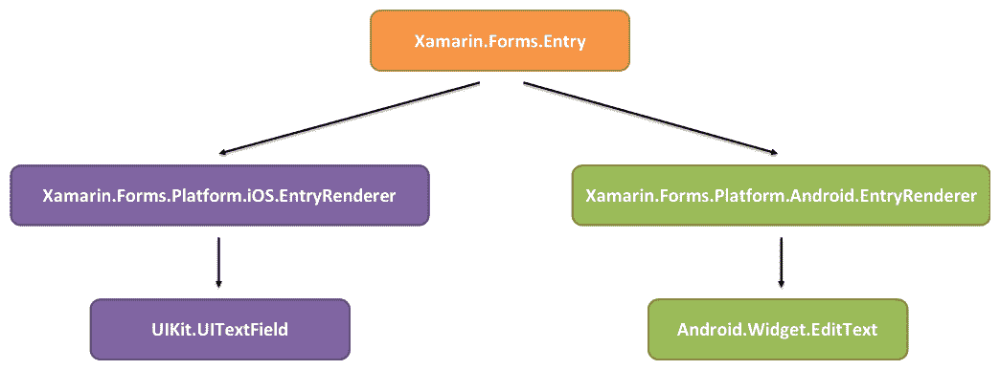
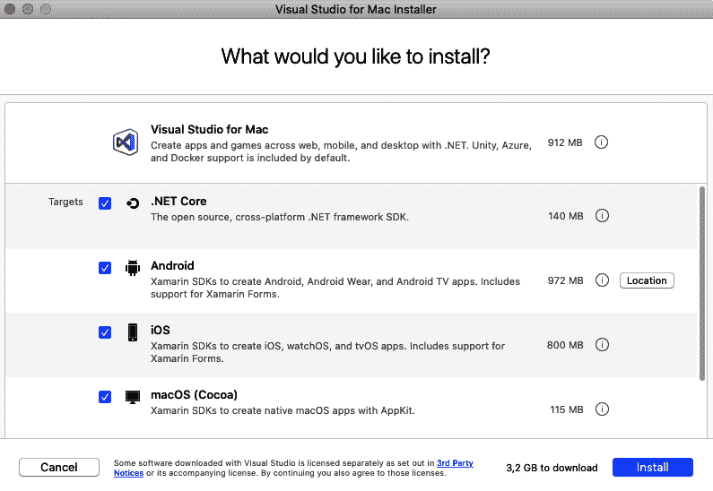
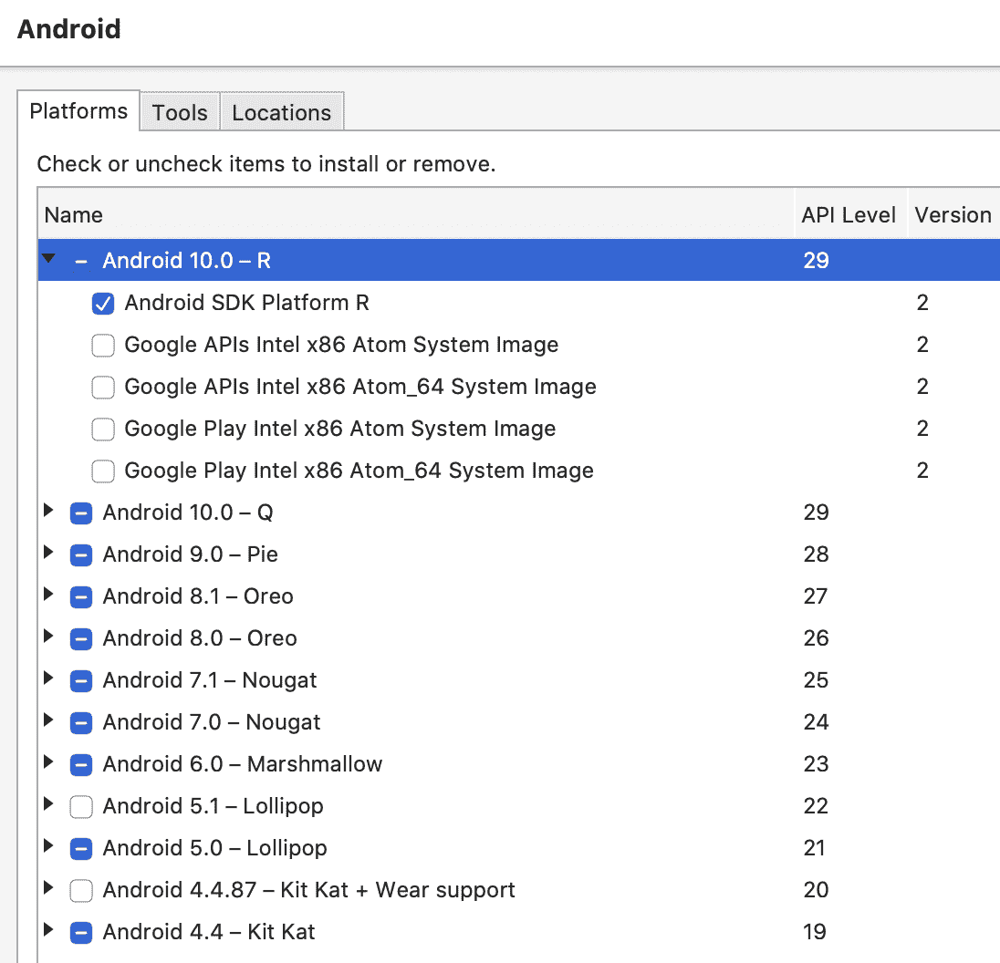
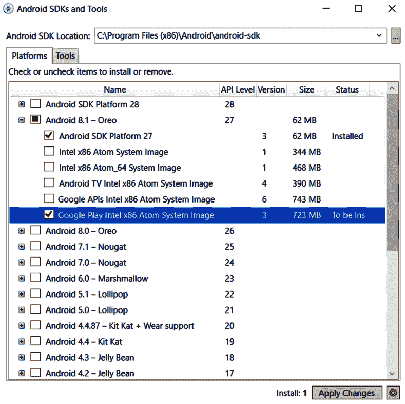
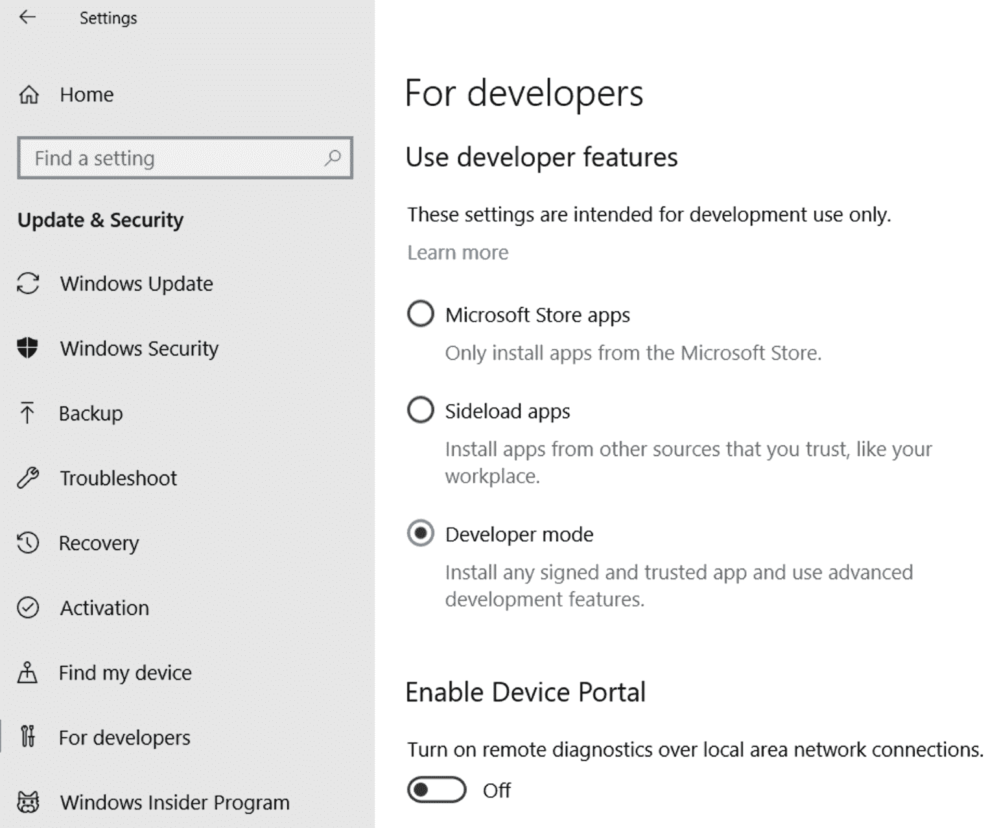

Introduction to Xamarin

这一章是关于了解 Xamarin 以及从中可以得到什么。这是唯一纯理论的一章；所有其他项目都涉及实践项目。此时您不需要编写任何代码，只需通读本章，就可以从较高的层次了解 Xamarin 是什么，Xamarin.Forms 与 Xamarin 的关系以及如何设置开发机器。

我们将首先定义什么是原生应用，以及.NET 作为一种技术带来了什么。之后，我们将了解 Xamarin.Forms 如何适应更大的范围，并了解何时适合使用传统的 Xamarin 和 Xamarin.Forms 应用程序。我们经常使用术语**传统 Xamarin**来描述不使用 Xamarin.Forms 的应用程序，即使 Xamarin.Forms 应用程序是通过传统 Xamarin 应用程序引导的。

在本章中，我们将介绍以下主题：

*   本机应用程序
*   Xamarin 和 Mono
*   Xamarin.表格
*   设置开发机器

让我们开始吧！

# 本机应用程序

术语**本地应用**对不同的人意味着不同的事情。对于某些人来说，它是一个使用平台创建者指定的工具开发的应用程序，例如使用 Objective-C 或 Swift 为 iOS 开发的应用程序，使用 Java 或 Kotlin 开发的 Android 应用程序，或使用.NET 开发的 Windows 应用程序。其他人使用术语“本机应用程序”来指编译成本机机器代码的应用程序。在本书中，我们将本机应用程序定义为具有本机 UI、性能和 API 访问权限的应用程序。下表更详细地解释了这三个概念：

*   **原生 UI**：**使用 Xamarin 构建的应用程序使用每个平台的标准控件。这意味着，例如，使用 Xamarin 构建的 iOS 应用程序的外观和行为将符合 iOS 用户的预期，而使用 Xamarin 构建的 Android 应用程序的外观和行为将符合 Android 用户的预期。**

 ***   **本机性能**：使用 Xamarin 构建的应用程序是针对本机性能编译的，可以使用特定于平台的硬件加速。

*   **原生 API 访问：**原生 API 访问意味着使用 Xamarin 构建的应用程序可以使用目标平台和设备提供给开发人员的一切。

# Xamarin 和 Mono

Xamarin 是一个开发平台，用于为 iOS（Xamarin.iOS）、Android（Xamarin.Android）和 macOS（Xamarin.Mac）开发本机应用程序。从技术上讲，它是这些平台之上的绑定层。绑定到平台 API 使.NET 开发人员能够使用 C#（和 F#）以每个平台的全部容量开发本机应用程序。我们在使用 Xamarin 开发应用程序时使用的 C# API 或多或少与平台 API 相同，但它们是**。网络化**。例如，API 通常根据.NET 命名约定进行定制，Android`set`和`get`方法通常由属性替代。这样做的原因是，对于.NET 开发人员来说，API 应该更易于使用。

单声道（[https://www.mono-project.com](https://www.mono-project.com/) 是微软.NET 框架的开源实现，基于**欧洲计算机制造商协会**（**ECMA**）C# 标准和**公共语言运行库**（**CLR**）。Mono 的创建是为了将.NET 框架引入 Windows 以外的平台。它是.NET 基金会的一部分 http://www.dotnetfoundation.org ），一个独立的组织，支持涉及.NET 生态系统的开放式开发和协作。

通过 Xamarin 平台和 Mono 的组合，我们可以使用特定于平台的 API 和.NET 的独立于平台的部分，包括名称空间、系统、`System.Linq`、`System.IO`、`System.Net`和`System.Threading.Tasks`。

使用 Xamarin 进行移动应用程序开发有几个原因，我们将在以下部分介绍这些原因。

When .NET 5 is released, it will partly replace Mono. We will get one unified **Base Class Library** (**BCL**) for all the .NET platforms. Xamarin.iOS will still run on the Mono runtime because iOS apps need to be **Ahead Of Time** (**AOT**) compiled. The .NET runtime (currently called .NET Core Runtime) will not support AOT.

## 代码共享

如果我们对多个移动平台（甚至服务器平台）使用一种通用编程语言，那么我们可以在目标平台之间共享大量代码，如下图所示。所有与目标平台无关的代码都可以与其他.NET 平台共享。通常以这种方式共享的代码包括业务逻辑、网络调用和数据模型：


还有一个基于.NET 平台的大型社区，以及可以从 NuGet（[下载的各种第三方库和组件 https://nuget.org](https://nuget.org) ），并跨.NET 平台使用。

跨平台的代码共享缩短了开发时间。它还可以生成质量更高的应用程序，例如，我们只需要为业务逻辑编写一次代码。有一个较低的错误风险，也可以保证计算返回相同的结果，无论我们的用户使用什么平台。

## 利用现有知识

对于希望开始构建本机移动应用程序的.NET 开发人员来说，学习新平台的 API 比学习新旧平台的编程语言和 API 更容易。

类似地，希望构建本机移动应用程序的组织可以使用现有的开发人员以及他们对.NET 的了解来开发应用程序。由于.NET 开发人员比 Objective-C 和 Swift 开发人员多，因此更容易为移动应用程序开发项目找到新的开发人员。

# 沙马林平台

可用的不同 Xamarin 平台有 Xamarin.iOS、Xamarin.Android 和 Xamarin.Mac。在本节中，我们将逐一介绍它们。

## 沙马林

Xamarin.iOS 用于使用.NET 为 iOS 构建应用程序，并包含与前面提到的 iOS API 的绑定。Xamarin.iOS 使用 AOT 编译将 C# 代码编译成**高级 RISC 机器**（**ARM**汇编语言。Mono 运行时与 Objective-C 运行时一起运行。使用.NET 名称空间的代码（如`System.Linq`或`System.Net`）由 Mono 运行时执行，而使用 iOS 特定名称空间的代码由 Objective-C 运行时执行。运行在**X 之上的 Mono 运行时和 Objective-C 运行时都不是 Unix**（**XNU**）类 Unix 内核（[https://github.com/apple/darwin-xnu](https://github.com/apple/darwin-xnu) ），由苹果公司开发。下图显示了 iOS 体系结构的概述：



## 泽马林，安卓

Android 用于使用.NET 为 Android 构建应用程序，并包含到 Android API 的绑定。Mono 运行时和**Android 运行时**（**艺术**）在 Linux 内核上并排运行。Android 应用程序可以是**实时**（**JIT**）编译的，也可以是 AOT 编译的，但要进行 AOT 编译，我们需要使用 Visual Studio Enterprise。

Mono 运行时和 ART 之间的通信通过一个**Java 本机接口**（**JNI**桥进行。JNI 桥有两种类型：**M****管理可调用包装器**（**MCW**）和**Android 可调用包装器**（**ACW**）。当代码需要在 ART 中运行时，使用 MCW；当 ART 需要在 Mono 运行时运行代码时，使用 ACW，如图所示：


## 哈马林，麦克

Mac 用于使用.NET 为 macOS 构建应用程序，并包含到 macOS API 的绑定。Mac 与 Xamarin.iOS 具有相同的体系结构，唯一的区别是 Xamarin.Mac 应用程序是 JIT 编译的，而 Xamarin.iOS 应用程序是 AOT 编译的。如下图所示：


# Xamarin.表格

Forms 是在 Xamarin（用于 iOS 和 Android）和**通用 Windows 平台**（**U****WP**之上构建的 UI 框架。Forms 允许开发人员使用一个共享代码库为 iOS、Android 和 UWP 创建 UI，如下图所示。如果我们使用 Xamarin.Forms 构建应用程序，我们可以使用 XAML、C# 或两者的组合来创建 UI：



## 沙马林的建筑形式

Forms 或多或少只是每个平台顶部的一个抽象层。Forms 有一个供所有平台使用的共享层，以及一个特定于平台的层。平台特定层包含渲染器。渲染器是将 Xamarin.Forms 控件映射到特定于平台的本机控件的类。每个 Xamarin.Forms 控件都有一个特定于平台的呈现程序。

下图说明了在 iOS 应用程序中使用共享的 Xamarin.Forms 代码时，如何将 Xamarin.Forms 中的条目控制从`UIKit`命名空间呈现给`UITextField`控件。Android 中的相同代码呈现来自`Android.Widget`命名空间的`EditText`控件：



## 使用 XAML 定义 UI

在 Xamarin.Forms 中声明 UI 最常用的方法是在 XAML 文档中定义它。也可以用 C# 创建 GUI，因为 XAML 实际上只是一种用于实例化对象的标记语言。理论上，我们可以使用 XAML 创建任何类型的对象，只要它具有无参数构造函数。XAML 文档是具有特定模式的**可扩展标记语言**（**XML**文档）。

### 定义标签控件

作为一个简单的示例，让我们看一下 XAML 文档的以下片段：

```cs
<Label Text="Hello World!" />
```

当 XAML 解析器遇到这个片段时，它会创建一个`Label`对象的实例，然后设置与 XAML 中的属性相对应的对象属性。这意味着如果我们在 XAML 中设置一个`Text`属性，它将在所创建的`Label`对象的实例上设置`Text`属性。上例中的 XAML 具有与以下相同的效果：

```cs
var obj = new Label()
{
    Text = "Hello World!"
};
```

XAML 的存在使我们能够更容易地查看创建 GUI 所需的对象层次结构。GUI 的对象模型也是按设计分层的，因此 XAML 支持添加子对象。我们可以简单地将它们添加为子节点，如下所示：

```cs
<StackLayout>
    <Label Text="Hello World" />
    <Entry Text="Ducks are us" />
</StackLayout>
```

`StackLayout`是一个容器控件，它在容器中垂直或水平地组织子对象。垂直组织是默认值，除非我们另行指定，否则将使用垂直组织。还有许多其他容器，如`Grid`和`FlexLayout`。这些将在以下章节的许多项目中使用。

### 在 XAML 中创建页面

单个控件没有任何用处，除非它有一个承载它的容器。让我们看看整个页面是什么样子。XAML 中定义的完全有效的`ContentPage`对象是 XML 文档。这意味着我们必须从 XML 声明开始。之后，我们必须有一个且只有一个根节点，如图所示：

```cs
<?xml version="1.0" encoding="UTF-8"?>
<ContentPage

     xmlns:x="http://schemas.microsoft.com/winfx/2009/xaml"
     x:Class="MyApp.MainPage">

    <StackLayout>
        <Label Text="Hello world!" />
    </StackLayout>
</ContentPage>
```

在前面的示例中，我们定义了一个`ContentPage`对象，该对象在每个平台上转换为单个视图。为了使其成为有效的 XAML，我们需要指定一个默认名称空间（`) and then add the `x`名称空间（`xmlns:x="http://schemas.microsoft.com/winfx/2009/xaml"`）。`

默认名称空间允许我们创建对象而无需前缀，例如`StackLayout`对象。`x`名称空间允许我们访问`x:Class`等属性，它告诉 XAML 解析器在创建`ContentPage`对象时实例化哪个类来控制页面。

一个`ContentPage`对象只能有一个子对象。在这种情况下，它是一个`StackLayout`控件。除非另行指定，否则默认布局方向为垂直。因此，`StackLayout`对象可以有多个子对象。稍后，我们将讨论更高级的布局控件，例如`Grid`和`FlexLayout`控件。

在这个特定的示例中，我们将创建一个`Label`控件作为`StackLayout`的第一个子控件。

### 用 C 语言创建页面#

为了清楚起见，下面的代码向您展示了前面的示例在 C# 中的外观：

```cs
public class MainPage : ContentPage
{
}
```

`page`是从`Xamarin.Forms.ContentPage`继承的类。如果我们创建一个 XAML 页面，这个类会自动生成，但是如果我们只使用代码，我们需要自己定义它。

让我们使用以下代码创建与前面定义的 XAML 页面相同的控件层次结构：

```cs
var page = new MainPage();

var stacklayout = new StackLayout();
stacklayout.Children.Add(
    new Label()
    {
        Text = "Welcome to Xamarin.Forms"
    });

page.Content = stacklayout;
```

第一条语句创建一个`page`对象。理论上，我们可以直接创建一个新的`ContentPage`页面，但这将禁止我们在其背后编写任何代码。出于这个原因，将我们计划创建的每个页面分为子类是一个很好的实践。

第一条语句后面的块创建了`StackLayout`控件，其中包含添加到`Children`集合的`Label`控件。

最后，我们需要将`StackLayout`分配给页面的`Content`属性。

### XAML 还是 C#？

通常，使用 XAML 可以提供更好的概述，因为页面是对象的层次结构，而 XAML 是定义该结构的一种非常好的方法。在代码中，由于我们需要首先定义最里面的对象，所以结构会被翻转，这使得阅读页面的结构变得更加困难。这在本章的 XAML 部分的*创建页面中得到了演示。话虽如此，如何定义 GUI 通常是一个偏好问题。本书将在接下来的项目中使用 XAML 而不是 C#。*

## Xamarin.形式与传统 Xamarin

虽然这本书是关于 Xamarin.Forms 的，但我们也将强调使用传统 Xamarin 和 Xamarin.Forms 之间的区别。传统的 Xamarin 用于开发使用 iOS 和 Android**软件开发工具包**（**SDK**）的应用程序，无需任何抽象手段。例如，我们可以创建一个 iOS 应用程序，该应用程序在情节提要或直接在代码中定义其 UI。这段代码不会被其他平台重用，比如 Android。使用这种方法构建的应用程序仍然可以通过引用.NET 标准库共享非平台特定的代码。此关系如下图所示：


另一方面，Forms 是 GUI 的抽象，它允许我们以平台无关的方式定义 UI。它仍然构建在 Xamarin.iOS、Xamarin.Android 和所有其他受支持的平台之上。可以将 Xamarin.Forms 应用程序创建为.NET 标准库或共享代码项目，其中源文件作为副本链接，并在与我们当前构建的平台相同的项目中构建。此关系如下图所示：


话虽如此，没有传统的 Xamarin.Forms 是不可能存在的，因为它是通过每个平台的应用程序引导的。这使我们能够使用自定义呈现器和平台特定代码在每个平台上扩展 Xamarin.Forms，这些代码可以通过接口公开给我们的共享代码库。我们将在本章后面更详细地介绍这些概念。

### 何时使用 Xamarin.Forms

我们可以在大多数情况下和大多数类型的应用程序中使用 Xamarin.Forms。如果我们需要使用 Xamarin.Forms 中没有的控件，我们可以始终使用特定于平台的 API。然而，在某些情况下，Xamarin.Forms 是无用的。我们可能希望避免使用 Xamarin.Forms 的最常见情况是，如果我们构建的应用程序在不同的目标平台上看起来应该非常不同。

# 设置开发机器

为多个平台开发应用程序对我们的开发机器提出了更高的要求。这样做的一个原因是，我们通常希望在开发机器上运行一个或多个模拟器。对于开始开发所需的内容，不同的平台也有不同的要求。无论我们使用 macOS 还是 Windows，Visual Studio 都将是我们的**集成开发环境**（**IDE**。VisualStudio 有几个版本，包括免费社区版。转至[https://visualstudio.microsoft.com/](https://visualstudio.microsoft.com/) 比较可用版本。以下列表总结了我们需要为每个平台开始开发的内容：

*   **iOS**：**要开发 iOS 应用程序，我们需要一台**Macintosh**（**Mac**设备。这可能是我们正在开发的机器，也可能是我们网络上的机器，如果我们正在使用的话。我们需要连接到 Mac 的原因是我们需要使用 Xcode 来编译和调试应用程序。Xcode 还提供了一个 iOS 模拟器。可以在没有连接 Mac 的情况下在 Windows 上进行一些 iOS 开发；您可以在本章的*Xamarin 热重启*部分了解更多信息。**
***   **安卓**：**安卓应用可以在 macOS 或 Windows 上开发。我们需要的所有东西，包括 SDK 和模拟器，都是用 Visual Studio 安装的。*****   **UWP**：**UWP 应用程序只能在 Windows 机器上的 Visual Studio 中开发。******

 ******## 设置 Mac

在 Mac 上使用 Xamarin 开发 iOS 和 Android 应用程序需要两个主要工具。这些是 Visual Studio for Mac（如果我们只开发 Android 应用程序，这是我们唯一需要的工具）和 Xcode。在以下部分中，我们将了解如何为应用程序开发设置 Mac。

### 安装 Xcode

在安装 VisualStudio 之前，我们需要下载并安装 Xcode。Xcode 是苹果公司的官方开发 IDE，包含所有可用于 iOS 开发的工具，包括用于 iOS、macOS、tvOS 和 watchOS 的 SDK。

我们可以从苹果开发者门户网站（[下载 Xcodehttps://developer.apple.com](https://developer.apple.com) 或从苹果应用商店购买。我建议你从应用商店下载，因为这保证了你有最新的稳定版本。从开发者门户下载 Xcode 的唯一原因是，如果您想使用预发布版本的 Xcode 为 iOS 预发布版进行开发。

在第一次安装之后，以及每次更新 Xcode 之后，打开它是很重要的。Xcode 通常需要在安装或更新后安装其他组件。我们还需要打开 Xcode 以接受与苹果的许可协议。

### 安装 Visual Studio

要安装 Visual Studio，我们首先需要从[下载它 https://visualstudio.microsoft.com](https://visualstudio.microsoft.com) 。

当我们通过下载的文件启动 VisualStudio 安装程序时，它将开始检查我们已经在机器上安装的内容。检查完成后，我们可以选择要安装的平台和工具。

选择了要安装的平台后，Visual Studio 将下载并安装使用 Xamarin 开始应用程序开发所需的所有内容，如图所示：



### 配置 Android 仿真器

VisualStudio 使用谷歌提供的 Android 模拟器。如果我们希望模拟器速度更快，那么我们需要确保它是硬件加速的。为了硬件加速 Android emulator，我们需要安装**Intel****硬件加速执行管理器**（**HAXM**，可以从[下载 https://software.intel.com/en-us/articles/intel-hardware-accelerated-execution-manager-intel-haxm](https://software.intel.com/en-us/articles/intel-hardware-accelerated-execution-manager-intel-haxm) 。

下一步是创建 Android 仿真器。首先，我们需要确保安装了 Android emulator 和 Android 操作系统映像。为此，请执行以下步骤：

1.  转到“工具”选项卡以安装 Android emulator：


2.  我们还需要安装一个或多个映像以与 emulator 一起使用。例如，如果我们想在不同版本的 Android 上运行我们的应用程序，我们可以安装多个图像。我们可以选择使用 Google Play 的模拟器（如下面的屏幕截图所示），这样我们就可以在我们的应用程序中使用 Google Play 服务，即使我们在模拟器中运行它。例如，如果我们想在我们的应用程序中使用谷歌地图，这是必需的：



3.  然后，要创建和配置仿真器，请转到 VisualStudio 中“工具”选项卡 Android 部分的“设备管理器”。从 Android 设备管理器，我们可以启动一个模拟器，如果我们已经创建了一个；或者，我们可以创建新的模拟器，如图所示：


4.  如果我们点击 NewDevice 按钮，我们就可以创建一个具有我们需要的规范的新模拟器。在这里创建新仿真器的最简单方法是选择符合我们需要的基本设备。这些基本设备是预配置的，这通常就足够了。但是，也可以编辑设备的属性，这样我们就有了一个符合我们特定需求的模拟器。

因为我们不会在带有 ARM 处理器的设备上运行 emulator，所以我们必须选择 x86 处理器或 x64 处理器，如下面的屏幕截图所示。如果我们尝试使用 ARM 处理器，模拟器将非常慢：


## 设置 Windows 计算机

我们可以使用虚拟或物理 Windows 机器来开发 Xamarin。例如，我们可以在 Mac 电脑上运行一台虚拟 Windows 机器。我们在 Windows 机器上开发应用程序所需的唯一工具是 Visual Studio。

### 安装 Xamarin for Visual Studio

如果我们已经安装了 VisualStudio，我们首先需要打开 VisualStudio 安装程序；否则，我们需要转到[https://visualstudio.microsoft.com](https://visualstudio.microsoft.com) 下载安装文件。

在安装开始之前，我们需要选择要安装的工作负载。

如果我们想为 Windows 开发应用程序，我们需要选择通用 Windows 平台开发工作负载，如下所示：


对于 Xamarin 开发，我们需要使用.NET 安装移动开发。如果要使用 Hyper-V 进行硬件加速，可以取消选中“移动开发详细说明”中的“英特尔 HAXM”复选框，左侧显示.NET 工作负载，如下面的屏幕截图所示。取消选择“英特尔 HAXM”时，也会取消选择 Android emulator，但您可以稍后重新安装：


当我们第一次启动 Visual Studio 时，系统会询问我们是否要登录。除非我们想使用 Visual Studio Professional 或 Enterprise，否则我们没有必要登录，在这种情况下，我们需要登录以便验证我们的许可证。

### 将 Visual Studio 与 Mac 配对

如果我们想运行、调试和编译 iOS 应用程序，那么我们需要将其连接到 Mac。如本章前面所述，我们可以手动设置 Mac，也可以使用自动 Mac 配置。这将在我们连接的 Mac 上安装 Mono 和 Xamarin.iOS。它不会安装 VisualStudioIDE，但如果我们只想将其用作构建机器，则不需要安装。但是，我们确实需要手动安装 Xcode。

为了能够手动或使用自动 Mac 配置连接到 Mac，我们需要能够通过网络访问 Mac，并且需要在 Mac 上启用远程登录。要执行此操作，请转到设置|共享并选中远程登录复选框。在窗口左侧，我们可以选择允许哪些用户使用远程登录进行连接，如图所示：


要从 Visual Studio 连接到 Mac，请使用工具栏中的 Pair To Mac 按钮（如以下屏幕截图所示）；或者，在顶部菜单中，转到工具| iOS |配对到 Mac：


将出现一个对话框，显示网络上可以找到的所有 Mac。如果您的 Mac 电脑没有出现在可用 Mac 电脑列表中，我们可以使用添加 Mac。。。按钮，输入 IP 地址，如图所示：


如果我们需要的所有东西都安装在 Mac 上，那么 VisualStudio 将连接，我们可以开始构建和调试 iOS 应用程序。如果 Mac 上缺少 Mono，则会出现警告。此警告还将为我们提供安装选项，如图所示：


### 配置 Android 仿真器和硬件加速

如果我们想要一个运行平稳的快速 Android 仿真器，我们需要启用硬件加速。这可以使用 Intel HAXM 或 Hyper-V 来完成。Intel HAXM 的缺点是，它不能在配备**高级微设备**（**AMD**处理器的机器上使用；我们必须使用带有英特尔处理器的机器。我们无法将 Intel HAXM 与 Hyper-V 并行使用。

因此，Hyper-V 是在 Windows 机器上硬件加速 Android 仿真器的首选方式。要在 Android emulator 中使用 Hyper-V，我们需要在 2018 年 4 月安装 Windows 和 Visual Studio 15.8 版（或更高版本）的更新（或更高版本）。要启用 Hyper-V，我们需要采取以下步骤：

1.  打开“开始”菜单，依次键入打开或关闭 Windows 功能。单击显示的选项将其打开，如图所示：


2.  要启用 Hyper-V，请选中 Hyper-V 复选框。此外，展开 Hyper-V 选项并选中 Hyper-V 平台复选框。我们还需要选中 Windows 虚拟机监控程序平台复选框，如图所示：


3.  当 Windows 提示您重新启动计算机时，请重新启动计算机。

因为我们在安装 VisualStudio 期间没有安装 Android 仿真器，所以现在需要安装它。转到 VisualStudio 中的工具菜单，然后单击 Android，然后单击 Android SDK 管理器。

在 Android SDK 管理器中的工具下，我们可以通过选择 Android emulator 来安装 emulator，如下面的屏幕截图所示。此外，我们还应确保安装了最新版本的 Android SDK 构建工具：


我们还建议安装本机开发工具包（NDK）。NDK 使得可以导入用 C 或 C++编写的库。如果我们想要 AOT 编译应用程序，还需要 NDK。

Android SDK 允许同时安装多个模拟器映像。例如，如果我们想在不同版本的 Android 上运行我们的应用程序，我们可以安装多个图像。选择带有 Google Play 的模拟器（如下面的屏幕截图所示），这样我们就可以在我们的应用程序中使用 Google Play 服务，即使我们在模拟器中运行它。

例如，如果我们想在我们的应用程序中使用谷歌地图，这是必需的：



下一步是创建一个虚拟设备来使用仿真器映像。要创建和配置仿真器，请转到 Android 设备管理器，我们可以从 VisualStudio 的“工具”选项卡打开它。在设备管理器中，我们可以启动模拟器（如果已经创建了模拟器），也可以创建新的模拟器，如图所示：


如果我们点击 NewDevice 按钮，我们就可以创建一个具有我们需要的规范的新模拟器。在这里创建新仿真器的最简单方法是选择符合我们需要的基本设备。这些基本设备是预配置的，这通常就足够了。但是，可以编辑设备的属性，这样我们就有了一个符合我们特定需求的模拟器。

我们必须选择 x86 处理器（如下屏幕截图所示）或 x64 处理器，因为我们没有在带有 ARM 处理器的设备上运行模拟器。如果我们尝试使用 ARM 处理器，模拟器将非常慢：


### 配置 UWP 开发人员模式

如果我们想开发 UWP 应用程序，我们需要在开发机器上激活开发者模式。要执行此操作，请转到开发者设置|更新与安全|。然后，点击开发者模式，如下图所示。这使我们能够通过 Visual Studio 侧向加载和调试应用程序：



如果我们选择 Sideload 应用程序而不是开发者模式，我们将只能安装应用程序，而无需进入 Microsoft 应用商店。如果我们有一台机器要测试，而不是调试我们的应用程序，我们可以只选择侧载应用程序。

# Xamarin 生产工具

Xamarin 热重启和 Xamarin 热重新加载是提高 Xamarin 开发人员生产率的两个工具。

## Xamarin 热重启

热重启是 VisualStudio 的一项功能，目前正在预览中，以提高开发人员的工作效率。它还为我们提供了一种在 iPhone 上运行和调试 iOS 应用程序的方法，而无需使用连接到 Visual Studio 的 Mac。Microsoft 对热重启的描述如下：

“<q>Xamarin 热重启使您能够在开发过程中快速测试对应用程序的更改，包括多文件代码编辑、资源和引用。它将新更改推送到调试目标上的现有应用程序包，从而加快构建和部署周期。</q>

要使用热重启，您需要以下内容：

*   Visual Studio 2019 版本 16.5 或更高版本
*   iTunes（64 位）
*   苹果开发者账户和付费苹果开发者程序（[https://developer.apple.com/programs/](https://developer.apple.com/programs/) 报名

热重启当前只能用于 Xamarin.Forms 应用程序。

要激活热重启，请转到工具|选项|环境|预览功能|启用 Xamarin 热重启。

在[阅读更多关于热重启当前状态的信息 https://docs.microsoft.com/en-us/xamarin/xamarin-forms/deploy-test/hot-restart](https://docs.microsoft.com/en-us/xamarin/xamarin-forms/deploy-test/hot-restart) 。

## Xamarin XAML 热重新加载

Xamarin XAML 热重新加载允许我们对 XAML 进行更改，而无需重新部署应用程序。当我们对 XAML 进行更改时，只需保存文件，它就会更新模拟器/仿真器或设备上的页面。XAML 热重新加载目前仅受 iOS 和 Android 支持。

要在 Windows 上为 Visual Studio 启用 XAML 热加载，请转到 Visual Studio |首选项| Xamarin 工具| XAML 热加载。

要在 Mac 上为 Visual Studio 启用 XAML 热加载，请转到工具|选项| Xamarin |热加载。

要使用 XAML 热重新加载，我们必须将 Xamarin.Forms 4.1+与 Visual Studio 2019 16.4+或 Visual Studio for Mac 8.4+结合使用。

# 总结

您现在应该对 Xamarin 是什么以及 Xamarin.Forms 与 Xamarin 本身的关系感到更舒服一些。

在本章中，我们建立了本机应用程序的定义，并了解了本机应用程序如何具有本机 UI、本机性能和本机 API 访问。我们讨论了 Xamarin 是如何基于 Mono 的，Mono 是.NET framework 的开源实现，并讨论了 Xamarin 的核心是如何绑定到特定于平台的 API。然后我们看了 Xamarin.iOS 和 Xamarin.Android 如何在引擎盖下工作。

在那之后，我们开始接触这本书的核心主题，那就是 Xamarin.Forms。我们首先概述了平台无关控件如何呈现为平台特定控件，以及如何使用 XAML 定义控件层次结构以组装页面。然后，我们花了一些时间研究 Xamarin.Forms 应用程序和传统 Xamarin 应用程序之间的区别。

传统的 Xamarin 应用程序直接使用特定于平台的 API，除了.NET 作为平台添加的 API 之外，没有任何抽象。Forms 是一个构建在传统 Xamarin API 之上的 API，允许我们在 XAML 或呈现给特定于平台的控件的代码中定义与平台无关的 GUI。Xamarin 的形式不止这些，但这是它的核心。

在本章的最后一部分，我们讨论了如何在 Windows 或 macOS 上设置开发机器。

现在，是时候利用我们新学到的知识了！在下一章中，我们将从头开始创建一个待办应用程序。我们将研究**模型–视图–视图模型**（**MVVM**）等概念，以实现业务逻辑和 UI 之间的清晰分离，以及 SQLite.NET 将数据持久保存到设备上的本地数据库。我们将同时为三个平台执行此操作，请继续阅读！********