Building Our First Xamarin.Forms App

在本章中，我们将创建一个待办事项列表应用程序，并在此过程中探索构成应用程序的所有细节。我们将着眼于创建页面、向页面添加内容、在页面之间导航以及创建令人惊叹的布局。嗯，*惊人*可能有点牵强，但我们一定会设计应用程序，以便在完成后您可以根据需要调整它！

本章将介绍以下主题：

*   建立项目
*   在设备上本地持久化数据
*   使用存储库模式
*   什么是 MVVM 以及为什么它非常适合 Xamarin.Forms
*   使用 Xamarin.Forms 页面（作为视图）并在它们之间导航
*   在 XAML 中使用 Xamarin.Forms 控件
*   使用数据绑定
*   在 Xamarin.Forms 中使用样式

# 技术要求

要完成此项目，您需要将 Visual Studio 安装到您的**Macintosh**（**Mac**）或 PC，以及 Xamarin 组件。有关如何设置您的环境的详细信息，请参阅[第 1 章](02.html)、*Xamarin 简介、*。

# 项目概述

每个人都需要一种跟踪事物的方式。为了启动我们的 Xamarin.Forms 开发学习曲线，我们决定，待办事项列表应用程序是启动并帮助您跟踪事情的最佳方式。一个简单、经典的双赢方案。

我们将首先创建一个项目并定义一个存储库来存储待办事项列表中的项目。我们将以列表形式呈现这些项目，并允许用户使用详细的用户界面编辑它们。我们还将研究如何通过**SQLite.NET**将待办事项列表项本地存储在设备上，以便在退出应用程序时它们不会丢失。

该项目的构建时间约为 2 小时。

# 开始项目

是时候开始编码了！但是，在开始之前，请确保您已经按照[第 1 章](02.html)、*Xamarin 简介*中的说明设置了您的开发环境。

本章将是一个经典的文件|新|项目章节，指导您逐步完成创建第一个待办事项列表应用程序的过程。将不会有任何需要下载。

## 建立项目

Xamarin 应用程序基本上可以使用以下两种代码共享策略之一创建：

*   作为共享项目
*   NET 标准库

第一个选项是**共享项目**，它创建的项目本质上是其中每个文件的链接副本。这些文件存在于一个公共位置，并在生成时链接到其中。这意味着我们在编写代码时无法确定运行时，只能访问每个目标平台上可用的 API。它确实允许我们使用条件编译，这在某些情况下可能很有用，但对以后阅读代码的人来说也可能会造成混淆。选择共享项目也可能是一个错误的选择，因为它将我们的代码锁定在特定的平台上。

我们将使用第二种选择，即**.NET 标准库**。当然，这是一个选择的问题，两种方法都会奏效。只要有一点想象力，即使您选择了共享项目选项，您仍然可以按照本章进行操作。

让我们开始吧！

### 创建新项目

第一步是创建一个新的 Xamarin.Forms 项目。打开 Visual Studio 2019 并转到文件|新建|项目：


这将打开“创建新项目”向导。在向导的中上部分，有一个搜索字段。输入`xamarin`并从列表中选择移动应用程序（Xamarin.Forms）项：


通过命名项目完成向导的下一页，然后单击创建**。**确保将项目命名为`DoToo`以避免任何名称空间问题：

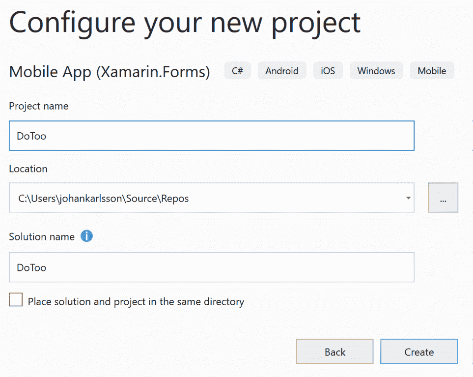

下一步是选择要使用的项目模板和代码共享策略。选择 Blank 以创建一个简单的 Xamarin.Forms 应用程序。在 2019 年之前的 Visual Studio 版本中，您还需要将代码共享策略选项更改为.NET 标准。在 2019 版本中，空白 XAMARIN。表单模板应用程序将为您创建.NET 标准库，您将没有选择共享项目的选择。单击“确定”完成安装，然后等待 Visual Studio 创建必要的项目：

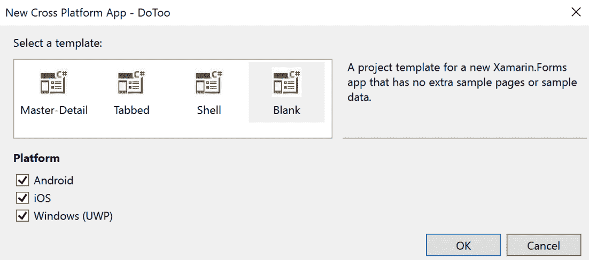

祝贺我们刚刚创建了第一个 Xamarin.Forms 应用程序。

### 检查文件

所选模板现在已创建四个项目：

*   `DoToo`：**这是一个针对.NET 标准 2.0 的.NET 标准库。它可以由支持此版本.NET 标准的任何运行时导入。**
***   `DoToo.Android`：**这是一款 Android 应用程序，用于在 Android 上引导 Xamarin.Forms。*****   `DoToo.iOS`：**这是一款 iOS 应用程序，用于在 iOS 上引导 Xamarin.表单。*****   `DoToo.UWP`：**这是一款**通用 Windows 平台**（**UWP**应用程序，用于在 UWP 上引导 Xamarin.表单。UWP 选项仅在 Windows 上可用。********

 ****这三个特定于平台的库引用了.NET 标准库。我们的大部分代码将在.NET 标准库中编写，并且只有一小部分特定于平台的代码将添加到每个目标平台。

该项目现在应如下所示：

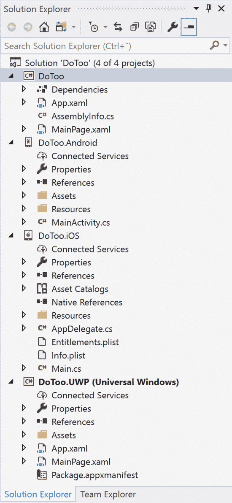

我们将强调每个项目中的几个重要文件，以便我们对它们有一个基本的了解。我们将逐一研究这些问题。

#### 多图

这是所有特定于平台的项目都引用的.NET 标准库，也是我们大部分代码将添加到的位置。以下屏幕截图显示了.NET 标准库的结构：

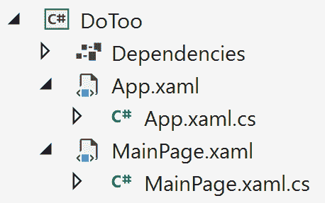

在 Dependencies 下，我们将找到对任何外部依赖项的引用，例如 Xamarin.Forms。我们将在本章的*更新 Xamarin.Forms 包***部分中更新 Xamarin.Forms 包版本，并在本章中添加更多依赖项。**

 **`App.xaml`文件是代表应用程序的 XAML 文件。这是一个放置应用程序范围的资源的好地方，我们稍后将这样做。我们还可以看到`App.xaml.cs`文件，其中包含启动代码和一些可以添加自定义代码的应用程序生存期事件，例如`OnStart`或`OnSleep`。

如果我们打开`App.xaml.cs`，我们可以看到 Xamarin.Forms 应用程序的起点：

```cs
public partial class App : Application
{
    public App()
    {
        InitializeComponent();
        MainPage = new DoToo.MainPage();
    }

    protected override void OnStart()
    {
        // Handle when your app starts
    }

    // code omitted for brevity
}
```

`MainPage`**属性被分配给一个页面，这一点特别重要，因为这决定了哪个页面首先显示给用户。在这个模板中，这是`DoToo.MainPage()`类。**

 **最后两个文件是`MainPage.xaml`文件，其中包含应用程序的第一页，以及代码隐藏文件，称为`MainPage.xaml.cs`。删除这些文件是为了符合**车型–视图–视图–车型**（**MVVM**的命名标准。

#### DoToo.Android

这是 Android 应用程序。它只有一个文件：


这里的重要文件是`MainActivity.cs`。如果我们在 Android 设备上运行应用程序，那么它包含应用程序的入口点。Android 应用程序的入口点方法是`OnCreate(...)`。

如果您打开`MainActivity.cs`并检查`OnCreate(...)`方法，它应该如下所示：

```cs
protected override void OnCreate(Bundle savedInstanceState)
{
    TabLayoutResource = Resource.Layout.Tabbar;
    ToolbarResource = Resource.Layout.Toolbar;

    base.OnCreate(bundle);

    Xamarin.Essentials.Platform.Init(this, savedInstanceState);
    global::Xamarin.Forms.Forms.Init(this, savedInstanceState);
    LoadApplication(new App());
}
```

前两行为`Tabbar`和`Toolbar`分配资源。然后我们调用`base`方法，然后强制初始化 Xamarin.Essentials 和 Xamarin.Forms。最后，我们调用加载在.NET 标准库中定义的 Xamarin.Forms 应用程序。

您不需要详细了解这些文件；请记住，它们对于应用程序的初始化非常重要。

**Xamarin.Essentials** is a library that offers a lot of cross-platform APIs to commonly used resources on your phone, such as the accelerometer or the compass. Check it out at [https://docs.microsoft.com/en-us/xamarin/essentials/](https://docs.microsoft.com/en-us/xamarin/essentials/).

#### DoToo.iOS

这是 iOS 应用程序。它包含的文件比 Android 对应文件多几个：

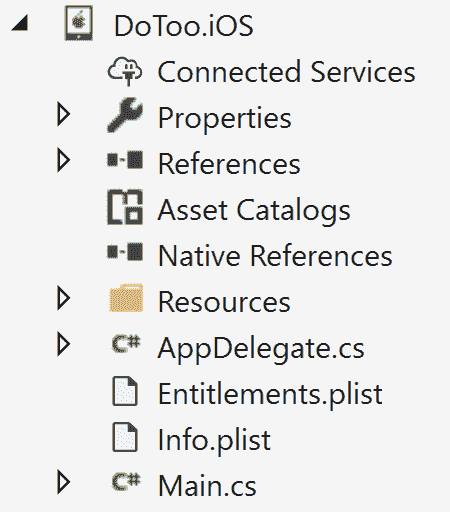

`AppDelegate.cs`文件是 iOS 应用程序的入口点。该文件包含一个名为`FinishedLaunching(...)`的方法，我们从该方法开始编写代码：

```cs
public override bool FinishedLaunching(UIApplication app, NSDictionary options)
{
    global::Xamarin.Forms.Forms.Init();
    LoadApplication(new App());
    return base.FinishedLaunching(app, options);
}
```

代码首先初始化 Xamarin.Forms，然后从.NET 标准库加载应用程序。之后，它将控件返回到 iOS。它必须在 17 秒内完成此操作，否则应用程序将被操作系统终止。

`info.plist`文件是一个特定于 iOS 的文件，其中包含有关应用程序的信息，如捆绑包 ID 及其配置文件。它有一个图形编辑器，但也可以在任何文本编辑器中编辑，因为它是一个标准 XML 文件。

`Entitlements.plist`文件也是一个特定于 iOS 的文件，用于配置我们希望应用程序利用的权利，例如**应用程序内购买**或**推送通知**。

与 Android 应用程序的启动代码一样，我们不需要详细了解这里发生了什么，除了它对我们应用程序的初始化很重要之外。

#### DoToo.UWP

最后一个要检查的项目是 UWP 应用程序。项目的文件结构如以下屏幕截图所示：


它有一个`App.xaml`文件，类似于.NET 标准库中的文件，但特定于 UWP 应用程序。它还有一个名为`App.xaml.cs`的相关文件。其中包含一个名为`OnLaunched(...)`的方法，它是 UWP 应用程序的入口点。这个文件相当大，所以我们不会在这里打印它，但请打开它，看看是否可以在其中找到 Xamarin.Forms 初始化代码。

### 更新 Xamarin.Forms 包

创建项目后，应始终将 Xamarin.Forms 包更新为最新版本。要执行此操作，请执行以下步骤：

1.  在解决方案资源管理器中右键单击您的解决方案。
2.  单击管理解决方案的 NuGet 软件包…：

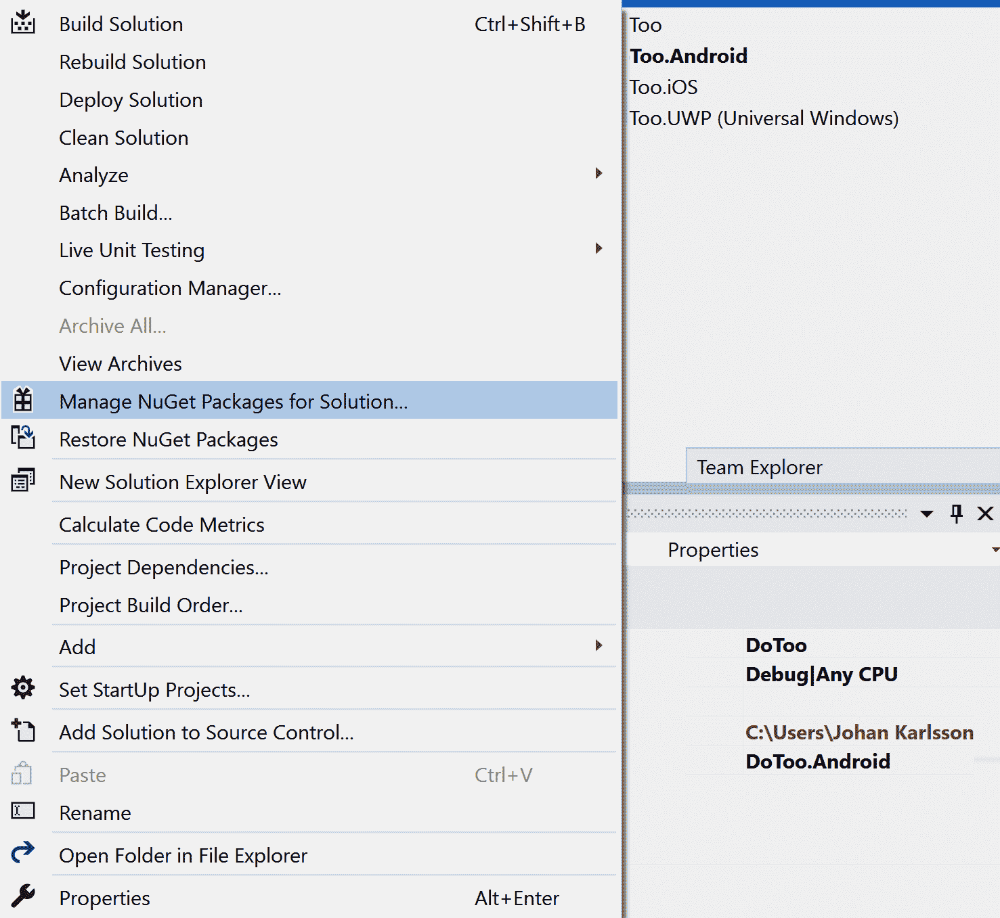

3.  这将在 Visual Studio 中打开 NuGet 包管理器：


要将 Xamarin.Forms 更新至最新版本，请执行以下步骤：

1.  单击更新选项卡。
2.  选中 Xamarin.Forms 并单击更新。
3.  接受任何许可协议。

注意输出窗格，等待所有包更新。但是，请确保不要手动更新任何 Android 软件包，因为这可能会破坏您的应用程序。

### 删除主页文件

在 Xamarin.Forms 中，我们有页面的概念。然而，MVVM 体系结构模式并非如此，它使用视图。视图（在这个版本的 MVVM 中）与页面是一样的，但是它们的后缀不是`-Page`，所以我们需要删除模板生成的`MainPage`类。我们将在短期内详细介绍 MVVM，但目前，我们需要从解决方案中删除`MainPage.cs`类。这可以通过以下方式完成：

1.  右键点击`DoToo`项目中的`MainPage.xaml`文件（即.NET 标准库）。
2.  单击删除并确认删除操作。

Some MVVM-frameworks do, however, use the concept of pages instead of views, such as Prism. It doesn't really matter, as long as you stick to one convention.

## 创建存储库和 TodoItem 模型

任何好的架构都涉及抽象。在这个应用程序中，我们需要一些东西来存储和检索待办事项列表中的项目。这些内容稍后将存储在 SQLite 数据库中，但是在负责 GUI 的代码中直接添加对数据库的引用通常是个坏主意。

相反，我们需要的是从 GUI 中抽象数据库。对于这个应用程序，我们选择使用一个简单的存储库模式。这个存储库只是一个位于 SQLite 数据库和我们即将推出的`ViewModels`类之间的类。这个类处理与视图的交互，视图反过来处理 GUI。

存储库将公开获取、添加和更新项目的方法，以及允许应用程序的其他部分对存储库中的更改作出反应的事件。它将隐藏在一个接口后面，以便我们以后可以替换整个实现，而无需在应用程序初始化过程中修改任何代码。这是通过**自动传真**实现的。

### 定义待办事项列表项

我们首先创建一个`TodoItem`类，它表示列表中的一个项目。这是一个简单的**普通旧 CLR 对象**（**POCO**类），其中**CLR**代表**公共语言运行库**。换句话说，这是一个不依赖于第三方程序集的.NET 类。要创建类，请执行以下步骤：

1.  在.NET 标准库项目中，创建一个名为`Models`的文件夹。
2.  将名为`TodoItem.cs`的类添加到该文件夹中，并输入以下代码：

```cs
using System;

namespace DoToo.Models
{
    public class TodoItem
    {
        public int Id { get; set; }
        public string Title { get; set; }
        public bool Completed { get; set; }
        public DateTime Due { get; set; }
    }
}
```

这段代码很容易解释；它是一个简单的 POCO 类，只包含属性，不包含逻辑。我们有一个`Title`属性来描述我们想要做什么，一个标志（`Completed`）来确定待办事项列表项是否已完成，一个`Due`日期用于我们预期何时完成，以及一个独特的`id`类，我们稍后将需要该类用于数据库。

### 创建存储库及其接口

既然我们有了`TodoItem`类，那么让我们定义一个接口来描述存储库以存储待办事项列表项：

1.  在.NET 标准库项目中，创建一个名为`Repositories`的文件夹。
2.  在`Repositories`文件夹中创建一个名为`ITodoItemRepository.cs`的接口，并编写以下代码：

```cs
using System;
using System.Collections.Generic;
using System.Threading.Tasks;
using DoToo.Models; 

namespace DoToo.Repositories
{
    public interface ITodoItemRepository
    { 
        event EventHandler<TodoItem> OnItemAdded;
        event EventHandler<TodoItem> OnItemUpdated;

        Task<List<TodoItem>> GetItems();
        Task AddItem(TodoItem item);
        Task UpdateItem(TodoItem item);
        Task AddOrUpdate(TodoItem item);
    }
}
```

The eagle-eyed among you might notice that we are not defining a `Delete` method in this interface. This is definitely something that should be there in a real-world app. While the app that we are creating in this chapter does not support deleting items, we are quite sure that you could add this yourself if you want to!

这个界面定义了我们应用程序所需的一切。它用于在存储库的实现和该存储库的用户之间创建逻辑隔离。如果应用程序的任何其他部分需要一个`TodoItemRepository`实例，我们可以向其传递一个实现`ITodoItemRepository`的对象，而不管它是如何实现的。

话虽如此，让我们实施`ITodoItemRepository`：

1.  创建一个名为`TodoItemRepository.cs`的类。
2.  输入以下代码：

```cs
using DoToo.Models;
using System;
using System.Collections.Generic;
using System.IO;
using System.Threading.Tasks;

namespace DoToo.Repositories
{
    public class TodoItemRepository : ITodoItemRepository
    {
        public event EventHandler<TodoItem> OnItemAdded;
        public event EventHandler<TodoItem> OnItemUpdated;

        public async Task<List<TodoItem>> GetItems()
        {
            return null; // Just to make it build
        }

        public async Task AddItem(TodoItem item)
        {
        }

        public async Task UpdateItem(TodoItem item)
        {
        }

        public async Task AddOrUpdate(TodoItem item)
        {
            if (item.Id == 0)
            {
                await AddItem(item);
            }
            else
            {
                await UpdateItem(item);
            }
        }
    }
}
```

此代码是接口的基本实现，除了`AddOrUpdate(...)`方法。这处理一小段逻辑，表明如果一个项目的 ID 为`0`，它就是一个新项目。ID 值大于`0`的任何项目都存储在数据库中。这是因为当我们在表中创建行时，数据库分配的值大于`0`。

在前面的代码中还定义了两个事件。它们将用于通知订阅者已更新或添加项目的列表。

### 将 SQLite 连接到持久化数据

我们现在有了一个接口，以及一个实现该接口的框架。要完成本节，我们需要做的最后一件事是在存储库的实现中连接 SQLite。

#### 添加**SQLite**NuGet 包

要在这个项目中访问 SQLite，我们需要向.NET 标准库项目添加一个名为`sqlite-net-pcl`的 NuGet 包。为此，右键单击解决方案的 DoToo 项目节点下的 Dependencies 项，然后单击 Manage NuGet Packages…：

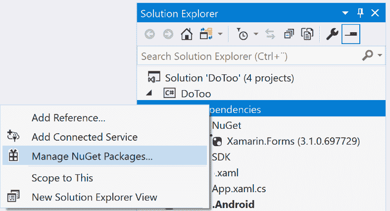

You might notice that the NuGet package is suffixed with `-pcl`. This is an example of what happens when naming conventions go wrong. This package actually supports .NET Standard 1.0, even though the name says **Portable Class Library** (**PCL**), which was the predecessor to .NET Standard.

这将打开 NuGet Package Manager 窗口：

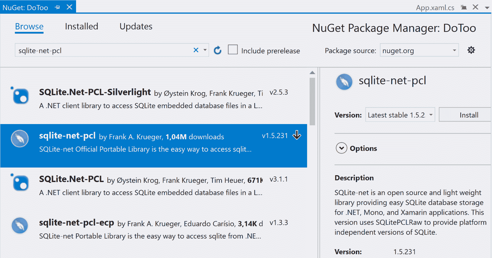

要安装 SQLite NuGet 软件包，请执行以下操作：

1.  点击浏览，在搜索框中输入`sqlite-net-pcl`。
2.  选择 Frank A.Krueger 提供的软件包，然后单击安装。

等待安装完成。然后，我们将向`TodoItem`类和存储库添加一些代码。

#### 更新 TodoItem 类

由于 SQLite 是一个关系数据库，它需要了解一些关于如何创建存储对象的表的基本信息。这是使用在 SQLite 命名空间中定义的属性完成的：

1.  打开`Models/TodoItem`。
2.  在现有`using`语句正下方的文件开头添加`using SQLite`语句，如下代码所示：

```cs
using System;
using SQLite;
```

3.  在`Id`属性前面添加`PrimaryKey`和`AutoIncrement`属性，如下代码所示：

```cs
[PrimaryKey, AutoIncrement]
public int Id { get; set; }
```

`PrimaryKey`属性指示 SQLite`Id`属性是表的主键。`AutoIncrement`属性确保添加到表中的每个新`TodoItem`类的`Id`值增加 1。

#### 创建到 SQLite 数据库的连接

现在我们将添加与数据库通信所需的所有代码。我们需要做的第一件事是定义一个连接字段，用于保存与数据库的连接：

1.  打开`Repositories/TodoItemRepository`文件。
2.  在现有`using`语句正下方的文件开头添加**`using SQLite`**语句，如下代码所示：

```cs
using DoToo.Models;
using System.Collections.Generic;
using System.IO;
using System.Threading.Tasks;
using SQLite;
```

3.  在类声明的正下方添加以下字段：

```cs
private SQLiteAsyncConnection connection;
```

需要初始化连接。一旦初始化，就可以在存储库的整个生命周期中重用它。由于该方法是异步的，因此如果不引入锁定策略，就无法从构造函数调用它。为了简单起见，我们只需从接口定义的每个方法调用它：

1.  将以下代码添加到`TodoItemRepository`类中。
2.  在文件开头添加一个`using System.IO`语句，以便我们可以使用`Path.Combine(...)`：

```cs
private async Task CreateConnection()
{
    if (connection != null)
    {
        return;
    }

    var documentPath = Environment.GetFolderPath(
                       Environment.SpecialFolder.MyDocuments);
    var databasePath = Path.Combine(documentPath, "TodoItems.db"); 

    connection = new SQLiteAsyncConnection(databasePath);
    await connection.CreateTableAsync<TodoItem>();

    if (await connection.Table<TodoItem>().CountAsync() == 0)
    {
        await connection.InsertAsync(new TodoItem() 
        { 
            Title = "Welcome to DoToo",
            Due = DateTime.Now 
        });
    }
} 
```

该方法首先检查我们是否已经有连接。如果我们这样做，我们可以简单地`return`。如果未设置连接，则在磁盘上定义一个路径，以指示数据库文件的位置。在这种情况下，我们将选择`MyDocuments`文件夹。Xamarin 将在我们瞄准的每个平台上找到与此最接近的匹配项。

然后，我们创建连接并将对该连接的引用存储在`connection`字段中。我们需要确保 SQLite 已经创建了一个表来镜像`TodoItem`表的模式。为了简化应用程序的开发，如果`TodoItem`表为空，我们会添加一个默认的待办事项列表项。

#### 实现 GetItems（）、AddItems（）和 UpdateItems（）方法

存储库中剩下的唯一一件事就是实现获取、添加和更新项目的方法：

1.  在`TodoItemRepository`类中找到`GetItems()`方法。
2.  使用以下代码更新`GetItems()`方法：

```cs
public async Task<List<TodoItem>> GetItems()
{
    await CreateConnection();
    return await connection.Table<TodoItem>().ToListAsync();
}

```

为了确保与数据库的连接是有效的，我们调用上一节中创建的`CreateConnection()`方法。当这个方法返回时，我们可以确保它已经初始化并且已经创建了`TodoItem`表。

然后，我们使用连接访问`TodoItem`表并返回一个`List<TodoItem>`项，其中包含数据库中所有待办事项列表项。

SQLite supports querying data using **Language Integrated Query** (**LINQ**). You can play around with this after the project is complete to get a better understanding of how to work it with databases in your app.

添加项目的代码更简单：

1.  在`TodoItemRepository`类中找到`AddItem()`方法。
2.  使用以下代码更新`AddItem()`方法：

```cs
public async Task AddItem(TodoItem item)
{
    await CreateConnection();
    await connection.InsertAsync(item);
    OnItemAdded?.Invoke(this, item);
}
```

对`CreateConnection()`的调用确保我们与`GetItems()`方法的连接方式相同。之后，我们使用`connection`对象上的`InsertAsync(...)`方法将其插入数据库。在表中插入项目后，我们调用`OnItemAdded`事件通知所有订阅者。

更新项目的代码与`AddItem()`方法基本相同，但也包括对`UpdateAsync`和`OnItemUpdated`的调用。最后，我们用以下代码更新`UpdateItem()`方法：

1.  在`TodoItemRepository`类中找到`UpdateItem()`方法。
2.  使用以下代码更新`UpdateItem()`方法：

```cs
public async Task UpdateItem(TodoItem item)
{
    await CreateConnection();
    await connection.UpdateAsync(item);
    OnItemUpdated?.Invoke(this, item);
}
```

在下一节中，我们将开始使用 MVVM。喝杯咖啡，我们开始吧！

## 使用 MVVM–创建视图和 ViewModel

MVVM 是关于关注点分离的。每个部分都有一个特定的含义：

*   **模型**：**这涉及任何表示数据的东西，并且可以用`ViewModel`引用。**
***   **视图**：**这是视觉组件。在 Xamarin.Forms 中，这由一个页面表示。*****   `ViewModel`：**这个类充当模型和视图之间的粘合剂。******

 ******在我们的应用程序中，我们可以说模型是存储库以及它返回的待办事项列表项。`ViewModel`引用此存储库并公开视图可以绑定到的属性。基本规则是任何逻辑都应该驻留在`ViewModel`中，而任何逻辑都不应该驻留在视图中。视图应该知道如何显示数据，例如将布尔值转换为`Yes`或`No`。

MVVM 可以通过多种方式实现，我们可以使用很多框架来实现，例如**Prism**、**MVVMCross**甚至**TinyMvvm**。在本章中，我们选择保持简单，以一种普通的方式实现 MVVM，而不使用任何框架。

将 MVVM 用作体系结构模式的主要好处是清晰的关注点分离、更干净的代码以及`ViewModel`的良好可测试性。

好了，够了，让我们写一些代码吧！

### 定义 ViewModel 基类

`ViewModel`是视图和模型之间的中介。通过为所有`ViewModel`类创建一个可从中继承的公共基类，我们可以从中受益匪浅。要执行此操作，请执行以下步骤：

1.  在`DoToo`.NET 标准项目中创建一个名为`ViewModels`的文件夹。
2.  在`ViewModels`文件夹中创建一个名为`ViewModel`的类。
3.  解析对`System.ComponentModel`和`Xamarin.Forms`的引用，并添加以下代码：

```cs
public abstract class ViewModel : INotifyPropertyChanged
{
    public event PropertyChangedEventHandler PropertyChanged;

    public void RaisePropertyChanged(params string[] propertyNames)
    {
        foreach (var propertyName in propertyNames)
        {
            PropertyChanged?.Invoke(this, new 
            PropertyChangedEventArgs(propertyName));
        }
    }

    public INavigation Navigation { get; set; }
} 
```

`ViewModel`类是所有`ViewModel`对象的基类。它并不意味着要单独实例化，所以我们将其标记为抽象。它实现了在.NET 基类库的`System.ComponentModel`中定义的接口`INotifyPropertyChanged`。这个接口只定义了一件事`PropertyChanged`事件。我们的`ViewModel`类必须在希望 GUI 知道任何属性更改时引发此事件。这可以通过向属性中的 setter 添加代码或使用**中间语言**（**IL**weaver，如`PropertyChanged.Fody`手动完成。我们将在下一节更详细地讨论这一点。

在这里，我们还将通过在`ViewModel`中添加一个`INavigation`属性来走一条捷径。这将有助于我们以后的导航。这也是可以（也应该）抽象的，因为我们不希望`ViewModel`依赖`Xamarin.Forms`以便能够在任何平台上重用`ViewModel`类。

### 介绍 PropertyChanged.Fody

实现`ViewModel`类的传统方法是从基类（如我们之前定义的`ViewModel`类）继承它，然后添加代码，代码可能如下所示：

```cs
public class MyTestViewModel : ViewModel
{
    private string name;
    public string Name 
    {
       get { return name; }
       set 
       { 
           if (name != value)
           {
               name = value; 
               RaisePropertyChanged(nameof(Name)); 
           }
        }
    }
}
```

我们要添加到`ViewModel`类的每个属性都会产生 13 行代码。你可能会想，还不错。然而，考虑到`ViewModel`类可能包含 10 到 20 个属性，这很快就会变成大量代码。我们可以做得更好。

只需几个简单的步骤，我们就可以使用名为`PropertyChanged.Fody`的工具在构建过程中自动注入几乎所有的代码：

1.  在.NET 标准库中，安装`PropertyChanged.Fody`NuGet 包。
2.  在.NET 标准库的根目录中创建一个名为`FodyWeavers.xml`的文件，并向其中添加以下 XML：

```cs
<?xml version="1.0" encoding="utf-8" ?>
<Weavers>
    <PropertyChanged />
</Weavers>
```

`PropertyChanged.Fody`扫描程序集以查找实现`INotifyPropertyChanged`接口的任何类，并添加引发`PropertyChanged`事件所需的代码。它还负责属性之间的依赖关系，这意味着如果您有一个属性返回基于其他两个属性的值，那么如果这两个值中的任何一个发生更改，就会引发该属性。

结果是，我们之前的`test`类被缩减为每个属性的一行代码。这使得代码库更具可读性，因为一切都发生在幕后：

```cs
public class MyTestViewModel : ViewModel
{
    public string Name { get; set; }
}
```

It is worth noting that there are a lot of different plugins that can be used to make `Fody` automate tasks, such as logging or method decoration. Check out [https://github.com/Fody/Fody](https://github.com/Fody/Fody) for more info.

### 创建 MainViewModel

到目前为止，我们主要准备编写应用程序本身的代码。`MainViewModel`是显示给用户的第一个视图的`ViewModel`类。它负责向待办事项列表项提供数据和逻辑。我们将创建基本的`ViewModel`类，并在本章中添加代码：

1.  在`ViewModels`文件夹中创建一个名为`MainViewModel`的类。
2.  添加以下模板代码并解析引用：

```cs
public class MainViewModel : ViewModel
{
    private readonly TodoItemRepository repository;

    public MainViewModel(TodoItemRepository repository)
    {
        this.repository = repository;
        Task.Run(async () => await LoadData());
    }

    private async Task LoadData()
    {

    }
}
```

这个类的结构是我们将在将来的所有`ViewModel`类中重用的。

让我们总结一下我们希望`ViewModel`类具有的重要特性：

*   我们从`ViewModel`类继承来访问共享逻辑，如`INotifyPropertyChanged`接口和公共导航代码。
*   与其他类（如存储库和服务）的所有依赖关系都通过`ViewModel`的构造函数传递。这是由**d****依赖注入**模式处理的，更具体地说，是由 Autofac 处理的，Autofac 是我们正在使用的依赖注入的实现。
*   我们使用对`LoadData()`的异步调用作为入口点来初始化`ViewModel`类。不同的 MVVM 库可能以不同的方式实现这一点，但基本功能是相同的。

### 创建 TodoItemViewModel

`TodoItemViewModel`是`ViewModel`类，表示`MainView`上待办事项列表中的每一项。它没有自己的完整视图（尽管它可能有），而是由`ListView`中的模板呈现。当我们为`MainView`创建控件时，我们将回到这一点。

这里重要的一点是，这个`ViewModel`对象代表单个项目，而不管我们选择在哪里渲染它。

让我们创建`TodoItemViewModel`类：

1.  在`ViewModels`文件夹中创建一个名为`TodoItemViewModel`的类。
2.  添加以下模板代码并解析引用：

```cs
public class TodoItemViewModel : ViewModel
{
    public TodoItemViewModel(TodoItem item) => Item = item;

    public event EventHandler ItemStatusChanged;
    public TodoItem Item { get; private set; }
    public string StatusText => Item.Completed ? "Reactivate" : 
    "Completed";
}
```

与任何其他`ViewModel`类一样，我们从`ViewModel`继承`TodoItemViewModel`类。我们遵循将所有依赖项注入构造函数的模式。在本例中，我们将`TodoItem`类的一个实例传递给`ViewModel`对象将用于向视图公开的构造函数。

`ItemStatusChanged`事件处理程序将在稍后向视图发出`TodoItem`类状态已更改的信号时使用。`Item`属性允许我们访问传入的项目。

`StatusText`属性用于使待办事项的状态在视图中可读。

### 创建 ItemViewModel 类

`ItemViewModel`表示视图中的待办事项列表项，可用于创建新项和编辑现有项：

1.  在`ViewModels`文件夹中，创建一个名为`ItemViewModel`的类。
2.  添加以下代码：

```cs
using DoToo.Models;
using DoToo.Repositories;
using System;
using System.Windows.Input;
using Xamarin.Forms;

namespace DoToo.ViewModels
{
    public class ItemViewModel : ViewModel
    {
        private readonly TodoItemRepository repository;

        public ItemViewModel(TodoItemRepository repository)
        {
            this.repository = repository;
        } 
    }
}
```

模式与前两个`ViewModel`类相同：

*   我们使用依赖注入将`TodoItemRepository`类传递给`ViewModel`对象。
*   我们使用`ViewModel`基类的继承来添加基类定义的公共特性

### 创建 MainView 视图

现在我们已经完成了`ViewModel`类，让我们创建视图所需的框架代码和 XAML。我们要创建的第一个视图是`MainView`，它是将首先加载的视图：

1.  在.NET 标准库中创建名为`Views`的文件夹。
2.  右键点击`Views`文件夹，选择添加，然后点击新建项目。。。。
3.  在左侧的 Visual C# Items 节点下选择 Xamarin.Forms。

4.  选择**内容页并命名为`MainView`。**
***   单击“添加”以创建页面：**

 **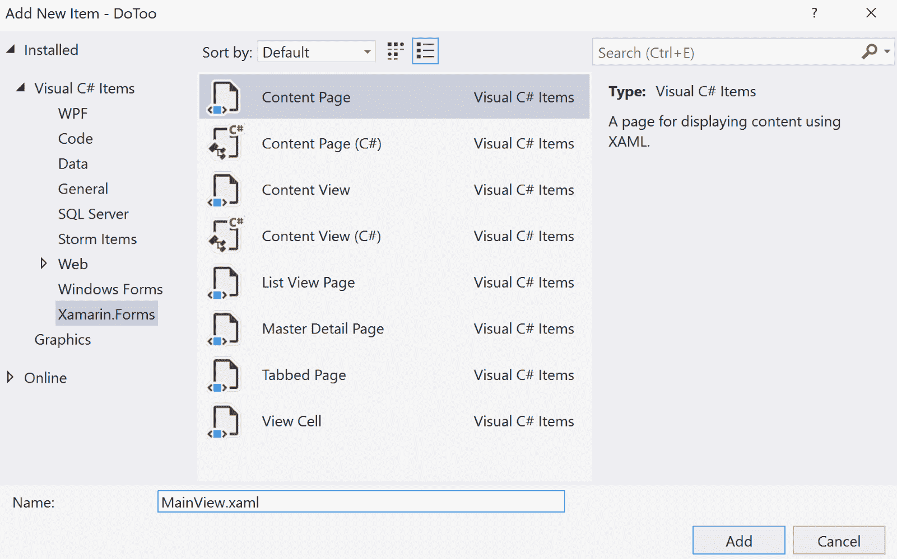

让我们向新创建的视图添加一些内容：

1.  打开`MainView.xaml`。
2.  删除`ContentPage`根节点下的所有模板代码，并在以下代码中添加粗体标记的 XAML 代码：

```cs
<?xml version="1.0" encoding="utf-8"?>
<ContentPage  
             xmlns:x="http://schemas.microsoft.com/winfx/2009/xaml" 
             xmlns:local="clr-namespace:DoToo"
             x:Class="DoToo.Views.MainView" 
             Title="Do Too!">

 <ContentPage.ToolbarItems>
 <ToolbarItem Text="Add" />
 </ContentPage.ToolbarItems>

 <Grid>
 <Grid.RowDefinitions>
 <RowDefinition Height="auto" />
 <RowDefinition Height="*" />
 </Grid.RowDefinitions>

 <Button Text="Toggle filter" />

 <ListView Grid.Row="1">
 </ListView>
 </Grid>
</ContentPage> 
```

为了能够访问自定义转换器，我们需要添加对本地名称空间的引用。`xmlns:local="clr-namespace:DoToo"`行为我们定义了这个名称空间。在本例中，我们不会直接使用它，但最好定义一个本地名称空间。如果我们创建自定义控件，那么我们可以通过编写诸如`<local:MyControl />`之类的内容来访问它们。

`ContentPage`页面上的`Title`属性为页面提供了一个标题。根据我们运行的平台，标题的显示方式有所不同。如果我们使用标准导航栏，它将显示在顶部，例如，在 iOS 和 Android 中。页面应始终具有标题。

`ContentPage.Toolbar`节点定义一个工具栏项，用于添加新的待办事项。它也将根据平台进行不同的呈现，但始终遵循特定于平台的 UI 准则。

Forms 中的页面（通常也是 XML 文档中的页面）只能有一个根节点。Xamarin.Forms 页面中的根节点填充页面本身的`Content`属性。由于我们希望我们的`MainView`视图包含一个项目列表和顶部的一个按钮来切换过滤器（在所有项目和仅活动项目之间切换），因此我们需要添加一个`Layout`控件来将它们定位在页面上。`Grid`是一个允许您根据行和列分割可用空间的控件。

对于我们的`MainView`视图，我们想添加两行。第一行是根据按钮（`Height="auto"`的高度计算的空间，第二行占用`ListView`（`Height="*"`的所有剩余空间。使用`Grid.Row`和`Grid.Column`属性在网格中定位`ListView`等元素。如果没有指定，这两个属性都默认为`0`，就像按钮一样。

`ListView`是一个在列表中显示项目的控件，这恰好是我们的应用程序将要做的。值得注意的是，在 Xamarin.Forms 4 中，引入了一个名为`CollectionView`的新控件。后续章节将使用此控件，但我们也希望向您介绍好的旧`ListView`控件。

If you are interested in how `Grid` works, you can search for more information about Xamarin.Forms grids on the internet or check out the official documentation at [https://docs.microsoft.com/en-us/xamarin/xamarin-forms/user-interface/layouts/grid](https://docs.microsoft.com/en-us/xamarin/xamarin-forms/user-interface/layouts/grid).

我们还需要连接`ViewModel`到视图。这可以通过在视图的构造函数中传递`ViewModel`类来完成：

1.  在解决方案资源管理器中展开`MainView.xaml`文件，打开`MainView`的代码隐藏文件。代码隐藏文件名为`MainView.xaml.cs`。
2.  在文件顶部添加一条`using`<q>`DoToo.ViewModels`语句，与现有`using`语句相邻。</q>
3.  通过添加以粗体标记的代码，修改类的构造函数，使其看起来如以下代码所示：

```cs
public MainView(MainViewModel viewModel)
{ 
    InitializeComponent();
    viewModel.Navigation = Navigation;
 BindingContext = viewModel;
}
```

我们遵循与`ViewModel`类相同的模式，通过构造函数传递任何依赖项。视图始终依赖于`ViewModel`类。为了简化项目，我们还将页面的`Navigation`属性直接分配给`ViewModel`基类中定义的`Navigation`属性。在一个更大的项目中，我们可能还想抽象这个属性，以确保将`ViewModel`类与 Xamarin.Forms 完全分离。但是，为了这个应用程序，可以直接引用它。

最后，我们将`ViewModel`分配给页面的`BindingContext`类。这告诉 Xamarin.Forms 绑定引擎使用`ViewModel`对象进行绑定，我们稍后将创建绑定。

### 创建 ItemView 视图

接下来是第二个视图。我们将使用此选项添加和编辑待办事项列表项：

1.  创建一个新的内容页面（与我们创建`MainView`视图的方式相同）并将其命名为`ItemView`。
2.  编辑 XAML 文件，使其显示在以下代码中：

```cs
 <?xml version="1.0" encoding="UTF-8"?>
 <ContentPage  
              xmlns:x="http://schemas.microsoft.com/winfx/2009/xaml" 
              x:Class="DoToo.Views.ItemView"
              Title="New todo item">

 <ContentPage.ToolbarItems>
 <ToolbarItem Text="Save" />
 </ContentPage.ToolbarItems>

 <StackLayout Padding="14">
 <Label Text="Title" />
 <Entry />
 <Label Text="Due" />
 <DatePicker />
 <StackLayout Orientation="Horizontal">
 <Switch />
 <Label Text="Completed" />
 </StackLayout>
 </StackLayout>
 </ContentPage> 
```

和`MainView`一样，我们需要一个标题。现在我们将给它一个默认标题`New todo item`，但当我们在以后重新使用该视图进行编辑时，我们会将其更改为`Edit todo item`。用户必须能够保存新的或编辑的项目，因此我们添加了一个**工具栏****按钮**。页面内容使用`StackLayout`来构造控件。`StackLayout`根据计算元素占用的空间，垂直（默认选项）或水平添加元素。这是一个 CPU 密集型进程，所以我们应该只在布局的一小部分使用它。在`StackLayout`中，我们添加了一个`Label`控件，该控件是位于其下方的`Entry`控件上方的一行文本。`Entry`控件是一个文本输入控件，包含待办事项列表项的名称。然后我们有一个`DatePicker`部分，用户可以在其中选择待办事项列表项的截止日期。最后一个控件是`Switch`控件，它呈现一个切换按钮来控制项目何时完成，以及项目旁边的标题。因为我们想让它们在水平方向上相邻显示，所以我们使用水平`StackLayout`控件来实现这一点。

视图的最后一步是将`ItemViewModel`模型连接到`ItemView`：

1.  在解决方案资源管理器中展开`ItemView.xaml`文件，打开`ItemView`的代码隐藏文件。
2.  修改类的构造函数，使其显示在以下代码中。添加以粗体标记的代码：

```cs
public ItemView (ItemViewModel viewmodel)
{
    InitializeComponent ();
 viewmodel.Navigation = Navigation;
 BindingContext = viewmodel;
}
```

3.  在文件顶部添加一条`using` `DoToo.ViewModels`语句，与现有`using`语句相邻：

```cs
using DoToo.ViewModels;
```

此代码与我们为`MainView`添加的代码相同，只是`ViewModel`类的类型不同。

### 通过 Autofac 连接依赖项注入

前面，我们讨论了依赖项注入模式，该模式规定所有依赖项（如存储库和视图模型）都必须通过类的构造函数传递。这有几个好处：

*   它提高了代码的可读性，因为我们可以快速确定所有外部依赖项。
*   它使依赖注入成为可能。
*   它通过模拟类使单元测试成为可能。
*   我们可以通过为每个分辨率指定对象是单实例还是新实例来控制对象的生存时间。

依赖项注入是一种模式，它允许我们在运行时确定在创建对象时应该将对象的哪个实例传递给构造函数。我们通过定义一个容器来注册一个类的所有类型。我们让我们正在使用的框架解决它们之间的任何依赖关系。假设我们向容器请求一个`MainView`类。容器负责解析`MainViewModel`和类具有的任何依赖项。

要设置此功能，我们需要引用一个名为 Autofac 的库。还有其他选择，所以请随意选择更适合您需要的。我们还需要一个入口点来将类型解析为实例。为此，我们将定义一个裸体`Resolver`类。总而言之，我们需要一个引导程序，我们将调用它来初始化依赖项注入配置。

#### 添加对 Autofac 的引用

我们需要一个对 Autofac 的引用才能开始。我们将使用 NuGet 安装所需的软件包：

1.  右键单击解决方案节点并单击管理解决方案的 NuGet 软件包，打开 NuGet manager。。。。
2.  点击浏览并在搜索框中键入`autofac`。

3.  勾选“项目”下的所有复选框，向下滚动，然后单击“安装”：

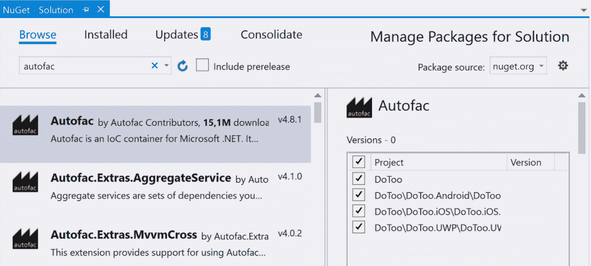

#### 创建解析器

解析器负责根据我们请求的类型为我们创建对象。让我们创建解析器：

1.  在.NET 标准库项目的根目录中，创建一个名为`Resolver.cs`的新文件。
2.  将以下代码添加到文件中：

```cs
using Autofac;

namespace DoToo
{
    public static class Resolver
    {
        private static IContainer container;

        public static void Initialize(IContainer container)
        {
            Resolver.container = container;
        }

        public static T Resolve<T>()
        {
            return container.Resolve<T>();
        }
    }
}
```

`IContainer`类型的`container`属性在`Autofac`中定义，表示保存如何解析类型配置的容器。`Initialize`方法获取实现`IContainer`接口的对象实例，并将其分配给`container`属性。`Resolve`方法使用`container`属性将类型解析为对象的实例。虽然一开始使用它可能看起来很奇怪，但随着经验的积累，它会变得容易得多。

#### 创建引导程序

引导程序负责初始化 Autofac。它在应用程序启动时调用。我们可以按如下方式创建它：

1.  在.NET 标准库项目的根目录中，创建一个名为`Bootstrapper.cs`的新文件。
2.  输入以下代码：

```cs
using Autofac;
using System.Linq;
using System.Reflection;
using Xamarin.Forms;
using DoToo.Views;
using DoToo.Repositories;
using DoToo.ViewModels;

namespace DoToo
{
    public abstract class Bootstrapper
    {
        protected ContainerBuilder ContainerBuilder { get; private 
        set; }

        public Bootstrapper()
        {
            Initialize();
            FinishInitialization();
        }

        protected virtual void Initialize()
        {
            var currentAssembly = Assembly.GetExecutingAssembly();
            ContainerBuilder = new ContainerBuilder();

            foreach (var type in currentAssembly.DefinedTypes
                      .Where(e => 
                             e.IsSubclassOf(typeof(Page)) ||
                             e.IsSubclassOf(typeof(ViewModel)))) 
            {
                ContainerBuilder.RegisterType(type.AsType());
            }

            ContainerBuilder.RegisterType<TodoItemRepository>().SingleInstance();
        }

        private void FinishInitialization()
        {
            var container = ContainerBuilder.Build();
            Resolver.Initialize(container);
        }
    }
}
```

`Bootstrapper`类由每个平台实现，因为这是应用程序开始执行的地方。这也让我们可以选择添加特定于平台的配置。为了确保从类继承，我们将其定义为抽象类。

`ContainerBuilder`是`Autofac`中定义的一个类，负责在我们完成配置后为我们创建`container`属性。`container`属性的构建发生在最后定义的`FinishInitialization`方法中，构造函数在调用虚`Initialize`方法之后立即调用。我们可以覆盖`Initialize`方法向每个平台添加自定义注册。

`Initialize`方法使用反射扫描程序集，查找继承自`Page`或`ViewModel`的任何类型，并将它们添加到`container`属性中。它还将`TodoItemRepository`属性作为单例添加到`container`属性中。这意味着每次我们请求`TodoItemRepository`时，都会得到相同的实例。Autofac 的默认行为（这可能因库而异）是为每个解析提供一个新实例。

#### 在 iOS 上添加引导程序

iOS 引导程序是.NET 标准库中定义的通用引导程序的简单包装器，但添加了启动时调用的`Init`方法：

1.  在 iOS 项目的根目录中，创建一个名为`Bootstrapper.cs`的新类。
2.  向其中添加以下代码：

```cs
public class Bootstrapper : DoToo.Bootstrapper 
{
    public static void Init()
    {
        var instance = new Bootstrapper();
    }
} 
```

`Init`方法可能看起来很奇怪，因为我们没有保留对所创建实例的引用。但是，请记住，我们确实在`Resolver`类中保留了对`Resolver`实例的引用，该实例本身就是一个单例。

iOS 的最后一步是在正确的位置调用此`Init`方法：

1.  打开`AppDelegate.cs`。
2.  找到`FinishedLaunching`方法并从以下代码块中添加粗体代码：

```cs
public override bool FinishedLaunching(UIApplication app, NSDictionary options)
{
    global::Xamarin.Forms.Forms.Init();
    Bootstrapper.Init();
    LoadApplication(new App());

    return base.FinishedLaunching(app, options);
}
```

#### 在 Android 中添加引导程序

与 iOS 一样，Android 引导程序是.NET 标准库中定义的通用引导程序的简单包装，但添加了启动时调用的`Init`方法：

1.  在 Android 项目的根目录中，创建一个名为`Bootstrapper.cs`的新类。
2.  向其中添加以下代码：

```cs
public class Bootstrapper : DoToo.Bootstrapper
{
    public static void Init()
    {
        var instance = new Bootstrapper();
    }
}
```

然后我们需要称之为`Init`方法。这样做的好地方是在`LoadApplication`呼叫`OnCreate`之前：

1.  打开`MainActivity.cs`。
2.  找到`OnCreate`方法并从以下代码块中添加粗体代码：

```cs
protected override void OnCreate(Bundle savedInstanceState)
{
    TabLayoutResource = Resource.Layout.Tabbar;
    ToolbarResource = Resource.Layout.Toolbar;

    base.OnCreate(savedInstanceState);

    Xamarin.Essentials.Platform.Init(this, savedInstanceState);
    global::Xamarin.Forms.Forms.Init(this, savedInstanceState);
    Bootstrapper.Init();
    LoadApplication(new App());
}
```

#### 在 UWP 中添加引导程序

UWP 的引导程序与其他平台相同：

1.  在 UWP 项目的根目录中，创建一个名为`Bootstrapper.cs`的新类。
2.  向其中添加以下代码：

```cs
public class Bootstrapper : DoToo.Bootstrapper
{
    public static void Init()
    {
        var instance = new Bootstrapper();
    }
}
```

与其他平台一样，我们需要在适当的位置调用`Init`方法：

1.  在 UWP 项目中，打开`App.xaml.cs`文件。
2.  找到对`Xamarin.Forms.Forms.Init()`**方法的调用，并从以下代码块中添加粗体代码：**

```cs
Xamarin.Forms.Forms.Init(e);
Bootstrapper.Init();
```

### 让应用程序运行

我们可以按如下方式首次启动该应用程序：

1.  通过扩展.NET 标准库中的`App.xaml`节点打开`App.xaml.cs`。
2.  找到构造函数。
3.  为`DoToo.Views`添加`using`语句，并以粗体添加以下代码行：

```cs
public App ()
{
    InitializeComponent();
    MainPage = new NavigationPage(Resolver.Resolve<MainView>());
}
```

我们刚刚添加的行解析了`MainView`类（及其所有依赖项，包括`MainViewModel`和`TodoItemRepository`，并将其包装在`NavigationPage`中。`NavigationPage`是在 Xamarin.Forms 中定义的页面，它添加了一个导航栏，使用户能够导航到其他视图。

In Xamarin.Forms 4, a brand new way of declaring the structure of an app has been added. It's called **Shell** and we have a whole chapter about it in this book. However, to become a good Xamarin developer, you need to know the basics, and the basics of navigating in Xamarin.Forms uses the good old `NavigationPage` control.

就这样！现在，您的项目应该开始了。根据您使用的平台，它可能如以下屏幕截图所示：

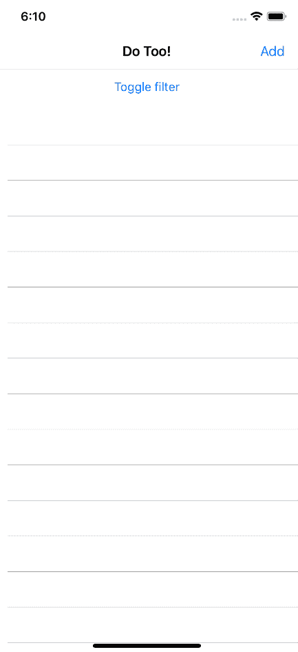

## 添加数据绑定

数据绑定是 MVVM 的核心和灵魂。这是观点和`ViewModel`相互沟通的方式。在 Xamarin.Forms 中，我们需要两件事来实现数据绑定：

1.  我们需要一个对象来实现`INotifyPropertyChanged`。
2.  我们需要将页面的`BindingContext`类设置为该对象。我们已经在`ItemView`和`MainView`上进行了此操作。

数据绑定的一个真正有用的特性是它允许我们使用双向通信。例如，当数据绑定文本到`Entry`控件时，数据绑定对象上的属性将直接更新。考虑下面的 XAML：

```cs
<Entry Text="{Binding Title}" />
```

为了实现这一点，我们需要字符串对象上的一个名为`Title`的属性。我们必须查看文档，定义一个对象，让**Intellisense**为我们提供一个提示，找出我们的属性应该是什么类型。

执行某种操作的控件，例如`Button`，通常会公开一个名为`Command`的属性。此属性属于`ICommand`类型，我们可以返回`Xamarin.Forms.Command`或我们自己的实现。`Command`属性将在下一节中解释，我们将使用它导航到`ItemView`。

It's also worth noting that Xamarin.Forms supports one-way binding, which comes in handy when you want to display data in a view but don't allow it to update `ViewModel`. From a performance perspective, it's a good idea to mark those bindings as one-way bindings.

### 从 MainView 导航到 ItemView 以添加新项目

我们在`MainView`中添加了**工具栏按钮。当用户点击此按钮时，我们希望它将他们带到`ItemView`。MVVM 实现这一点的方法是定义一个命令，然后将该命令绑定到按钮。让我们添加代码：**

 **1.  打开`ViewModels/MainViewModel.cs`。
2.  增加`System.Windows.Input`、`DoToo.Views`、**和`Xamarin.Forms`的`using`报表。**
***   将以下属性添加到类：**

```cs
public ICommand AddItem => new Command(async () =>
{
    var itemView = Resolver.Resolve<ItemView>();
    await Navigation.PushAsync(itemView);
}); 
```

所有命令都应作为泛型`ICommand`类型公开。这抽象了实际的命令实现，这是一个很好的通用实践。命令必须是属性；在本例中，我们正在创建一个新的`Command`对象，并将其分配给该属性。该属性是只读的，这对于`Command`对象来说通常很好。命令的操作（执行命令时要运行的代码）被传递给`Command`对象的构造函数。

命令的操作通过`Resolver`创建一个新的`ItemView`视图，Autofac 构建必要的依赖关系。一旦创建了新的`ItemView`视图，我们只需告诉`Navigation`服务将其推送到堆栈中即可。

之后，我们只需将`ViewModel`中的`AddItem`**命令连接到视图中的 Add 按钮：**

 **1.  打开`Views/MainView.xaml`。
2.  将`Command`属性添加到`ToolbarItem`：

```cs
<ContentPage.ToolbarItems>
    <ToolbarItem Text="Add" Command="{Binding AddItem}" />
</ContentPage.ToolbarItems>
```

运行应用程序并点击添加按钮导航到新的`ItemView`视图。请注意，“后退”按钮将自动显示。

### 将新项目添加到列表中

我们现在已完成向新项目添加导航。现在，让我们添加创建新项目并将其保存到数据库所需的代码：

1.  打开`ViewModels/ItemViewModel.cs`。
2.  添加以下粗体代码。
3.  解析对`System.Windows.Input`的引用：

```cs
public class ItemViewModel : ViewModel
{
    private TodoItemRepository repository;

    public TodoItem Item { get; set; }

    public ItemViewModel(TodoItemRepository repository)
    {
        this.repository = repository;
        Item = new TodoItem() { Due = DateTime.Now.AddDays(1) };
    }

 public ICommand Save => new Command(async () => 
 {
 await repository.AddOrUpdate(Item);
 await Navigation.PopAsync();
 });
}
```

`Item`属性包含我们要添加或编辑的当前项的引用。在构造函数中创建一个新项，当我们想要编辑一个项时，我们可以简单地将我们自己的项分配给这个属性。除非我们执行最后定义的`Save`命令，否则不会将新项添加到数据库中。添加或更新项目后，我们从导航堆栈中删除视图，并再次返回到`MainView`。

Since the navigation keeps pages in a stack, the framework declares methods that reflect operations that you can perform on a stack. The operation of removing the topmost item in a stack is known as **popping the stack**, so instead of `RemoveAsync()`, we have `PopAsync()`. To add a page to the navigation stack, we push it, so the method is called `PushAsync()`.

现在我们已经用必要的命令和属性扩展了`ItemViewModel`，现在是时候在 XAML 中对它们进行数据绑定了：

1.  打开`Views/ItemView.xaml`。
2.  添加用粗体标记的代码：

```cs
<?xml version="1.0" encoding="UTF-8"?>
<ContentPage  
             xmlns:x="http://schemas.microsoft.com/winfx/2009/xaml" 
             x:Class="DoToo.Views.ItemView">
    <ContentPage.ToolbarItems>
        <ToolbarItem Text="Save" Command="{Binding Save}" />
    </ContentPage.ToolbarItems>

    <StackLayout Padding="14">
        <Label Text="Title" />
        <Entry Text="{Binding Item.Title}" />
        <Label Text="Due" />
        <DatePicker Date="{Binding Item.Due}" />
        <StackLayout Orientation="Horizontal">
            <Switch IsToggled="{Binding Item.Completed}" />
            <Label Text="Completed" />
        </StackLayout>
    </StackLayout>

</ContentPage> 
```

当用户点击`Save`链接时，绑定到`ToolbarItems`命令属性会触发`ItemViewModel`公开的`Save`命令。再次值得注意的是，任何名为`Command`的属性都表示将发生一个操作，我们必须将其绑定到实现`ICommand`接口的对象实例。

表示标题的`Entry`控件是绑定到`ItemViewModel`的`Item.Title`属性的数据，`Datepicker`和`Switch`控件以类似的方式绑定到各自的属性。

我们本可以在`ItemViewModel`上直接将`Title`、`Due`和`Complete`作为属性公开，但我们选择重用已经存在的`TodoItem`对象作为引用。这很好，只要`TodoItem`对象的属性实现`INotifyPropertyChange`接口。

### 在 MainView 中绑定 ListView

没有项目列表，待办事项列表没有多大用处。让我们用一个项目列表来扩展`MainViewModel`：

1.  打开`ViewModels/MainViewModel.cs`。
2.  为`System.Collections.ObjectModel`和`System.Linq`添加`using`语句。
3.  为待办事项列表项添加属性：

```cs
public ObservableCollection<TodoItemViewModel> Items { get; set; }
```

`ObservableCollection`就像一个普通的收藏，但它有一个有用的超能力。它可以通知侦听器列表中的更改，例如添加或删除项目时。**ListView**控件侦听列表中的更改，并根据这些更改自动更新自身。但是，重要的是要知道，对列表中某个项目的更改不会触发更新。更改项目的标题不会导致列表重新呈现。让我们继续实施`MainViewModel`的其余部分。

我们现在需要一些数据：

1.  打开`ViewModels/MainViewModel.cs`。
2.  替换（或完成）`LoadData`方法并创建`CreateTodoItemViewModel`和`ItemStatusChanged`方法。
3.  通过添加一条`using`语句来解决对`DoToo.Models`的引用：

```cs
private async Task LoadData()
{
    var items = await repository.GetItems();
    var itemViewModels = items.Select(i =>  
    CreateTodoItemViewModel(i));
    Items = new ObservableCollection<TodoItemViewModel>  
    (itemViewModels); 
}

private TodoItemViewModel CreateTodoItemViewModel(TodoItem item)
{
    var itemViewModel = new TodoItemViewModel(item);
    itemViewModel.ItemStatusChanged += ItemStatusChanged;
    return itemViewModel;
}

private void ItemStatusChanged(object sender, EventArgs e)
{
}
```

`LoadData`方法调用存储库来获取所有项目。然后我们将每个待办事项列表项包装在`TodoItemViewModel`中。这包含更多特定于视图的信息，我们不想将这些信息添加到`TodoItem`类中。在`ViewModel`中包裹普通物体是一种良好的做法；这使得向其添加操作或额外属性变得更简单。`ItemStatusChanged`是当我们将待办事项列表项的状态从`active`更改为`completed`时调用的存根，反之亦然。

我们还需要从存储库连接一些事件，以了解数据何时更改：

1.  打开`ViewModels/MainViewModel.cs`。
2.  添加以下粗体代码：

```cs
public MainViewModel(TodoItemRepository repository)
{
   repository.OnItemAdded += (sender, item) => 
 Items.Add(CreateTodoItemViewModel(item));
 repository.OnItemUpdated += (sender, item) => 
 Task.Run(async () => await LoadData());

    this.repository = repository;

    Task.Run(async () => await LoadData());
}  
```

当一个项目被添加到存储库中时，无论是谁添加的，`MainView`都会将其添加到`items`列表中。由于 items 集合是一个可观察的集合，因此列表将更新。如果某个项目被更新，我们只需重新加载列表。

让我们将数据绑定到`ListView`：

1.  打开`MainView.xaml`并找到`ListView`元件。
2.  修改它以反映以下代码：

```cs
<ListView Grid.Row="1"
 RowHeight="70"
          ItemsSource="{Binding Items}">
    <ListView.ItemTemplate>    
        <DataTemplate>
            <ViewCell>
                <Grid Padding="15,10">
                    <Grid.ColumnDefinitions>
                        <ColumnDefinition Width="10" />
                        <ColumnDefinition Width="*" />
                    </Grid.ColumnDefinitions>

                    <BoxView Grid.RowSpan="2" />
                    <Label Grid.Column="1"
                           Text="{Binding Item.Title}"
                           FontSize="Large" />
                    <Label Grid.Column="1"
                           Grid.Row="1"
                           Text="{Binding Item.Due}"
                           FontSize="Micro" />
                    <Label Grid.Column="1" 
 Grid.Row="1" 
 HorizontalTextAlignment="End" 
 Text="Completed" 
                           IsVisible="{Binding Item.Completed}"
                           FontSize="Micro" />
                </Grid>
            </ViewCell>
        </DataTemplate>
    </ListView.ItemTemplate>
</ListView>
```

`ItemsSource`绑定告诉`ListView`在哪里找到要迭代的集合，并且是`ViewModel`的本地绑定。然而，`ViewCell`节点中的任何绑定都是我们在列表中迭代的每个项的本地绑定。在本例中，我们绑定到`TodoItemViewModel`，它包含一个名为`Item`的属性。这反过来又具有诸如`Title`、`Due`和`Completed`等属性。在定义绑定时，我们可以在对象的层次结构中导航，而不会出现任何问题。

`DataTemplate`元素定义了每一行的外观。我们使用网格来划分空间，就像我们之前做的那样。

### 为项目状态创建 ValueConverter 对象

有时，我们希望绑定到表示原始值的对象。这可能是一段基于布尔值的文本。例如，我们可能希望写入`Yes`和`No`，或者返回颜色，而不是`true`和`false`。这就是`ValueConverter`派上用场的地方。它可用于将一个值与另一个值进行转换。我们将编写一个`ValueConverter`对象，将待办事项列表项的状态转换为颜色：

1.  在.NET 标准库项目的根目录中，创建一个名为`Converters`的文件夹。
2.  创建一个名为`StatusColorConverter.cs`的类并添加以下代码：

```cs
using System;
using System.Globalization;
using Xamarin.Forms;

namespace DoToo.Converters
{
    public class StatusColorConverter : IValueConverter
    {
        public object Convert(object value, Type targetType,
                              object parameter, CultureInfo  
                              culture)
        {
          return (bool)value ?    

          (Color)Application.Current.Resources[
          "CompletedColor"]: 

          (Color)Application.Current.Resources[
          "ActiveColor"];
        }

        public object ConvertBack(object value, Type 
         targetType, 
         object parameter, CultureInfo culture)
        {
            return null;
        }
    }
}
```

`ValueConverter`对象是实现`IValueConverter`的类。反过来，它只定义了两个方法。当视图从`ViewModel`读取数据时调用`Convert`方法，`ViewModel`从视图获取数据时使用`ConvertBack`方法。`ConvertBack`方法仅用于从纯文本返回数据的控件，例如`Entry`控件。

如果我们查看`Convert`方法的实现，我们注意到传递给该方法的任何值都是对象类型。这是因为我们不知道用户绑定到我们要将这个`ValueConverter`类添加到的属性的类型。我们还可能注意到，我们从资源文件中获取颜色。我们可以在代码中定义颜色，但不建议这样做。因此，我们做了额外的努力，将它们作为全局资源添加到`App.xaml`文件中。完成本章后，可以再次查看资源：

1.  在.NET 标准库项目中打开`App.xaml`。
2.  添加以下`ResourceDictionary`元素：

```cs
 <Application ...>
     <Application.Resources>
 <ResourceDictionary>
 <Color x:Key="CompletedColor"># 1C8859</Color>
 <Color x:Key="ActiveColor"># D3D3D3</Color>
 </ResourceDictionary>
     </Application.Resources>
 </Application> 
```

`ResourceDictionary`可以定义范围广泛的不同对象。我们满足于从`ValueConverter`访问两种颜色。请注意，可以通过提供给它们的密钥以及使用静态资源绑定从任何其他 XAML 文件访问它们。`ValueConverter`本身被引用为静态资源，但来自本地范围。

#### 使用 ValueConverter

我们想在`MainView`中使用我们全新的`StatusColorConverter`对象。不幸的是，为了实现这一点，我们必须克服一些困难。我们需要做三件事：

*   在 XAML 中定义名称空间
*   定义表示转换器实例的本地资源
*   在绑定中声明我们要使用转换器

让我们从名称空间开始：

1.  打开`Views/MainView.xaml`。
2.  将以下命名空间添加到页面：

```cs
<ContentPage 
             xmlns:x="http://schemas.microsoft.com/winfx/2009/xaml"
             xmlns:converters="clr-namespace:DoToo.Converters"
             x:Class="DoToo.Views.MainView"
             Title="Do Too!>
```

在`MainView.xaml`文件中添加`Resource`节点：

1.  打开`Views/MainView.xaml`。
2.  添加以下`ResourceDictionary`元素，在 XAML 文件的根元素下以粗体显示：

```cs
<ContentPage ...>
    <ContentPage.Resources>
 <ResourceDictionary>
 <converters:StatusColorConverter  
             x:Key="statusColorConverter" />
 </ResourceDictionary>
 </ContentPage.Resources>    <ContentPage.ToolBarItems>
        <ToolbarItem Text="Add" Command="{Binding AddItem}" />
    </ContentPage.ToolbarItems>
    <Grid ...>
    </Grid>
</ContentPage>
```

这与全局资源字典的形式相同，但由于这是在`MainView`中定义的，因此只能从那里访问。我们可以在全局资源字典中定义它，但通常更有效的方法是定义只在尽可能靠近该位置的一个位置使用的对象。

最后一步是添加转换器：

1.  在 XAML 文件中找到`BoxView`节点。
2.  添加`BackgroundColor`XAML，粗体标记：

```cs
<BoxView Grid.RowSpan="2" 
   BackgroundColor="{Binding Item.Completed, 
                     Converter={StaticResource  
                     statusColorConverter}}" />
```

我们在这里所做的是将布尔值绑定到接受`Color`对象的属性。然而，就在数据绑定发生之前，`ValueConverter`将布尔值转换为颜色。这只是`ValueConverter`派上用场的众多案例之一。在定义 GUI 时请记住这一点。

### 使用命令导航到项目

我们希望能够查看所选待办事项列表项的详细信息。当我们点击一行时，我们应该导航到该行中的项目。

为此，我们需要添加以下代码：

1.  打开`ViewModels/MainViewModel.cs`。
2.  将`SelectedItem`属性和`NavigateToItem`**方法添加到类中：**

```cs
public TodoItemViewModel SelectedItem
{
    get { return null; }
    set 
    {
        Device.BeginInvokeOnMainThread(async () => await 
        NavigateToItem(value));
        RaisePropertyChanged(nameof(SelectedItem));
    }
}

private async Task NavigateToItem(TodoItemViewModel item)
{
    if (item == null)
    {
        return;
    }

    var itemView = Resolver.Resolve<ItemView>();
    var vm = itemView.BindingContext as ItemViewModel;
    vm.Item = item.Item;

    await Navigation.PushAsync(itemView);
}
```

`SelectedItem`属性是我们将数据绑定到`ListView`的属性。当我们在`ListView`中选择一行时，该属性被设置为表示该行的`TodoItemViewModel`对象。因为我们不能在这里真正使用 Fody 来实现它的`PropertyChanged`魔力（因为在 setter 中需要一个方法调用），所以我们需要走老路，手动添加一个 getter 和一个 setter。

然后 setter 调用`NavigateToItem`，这将使用`Resolver`创建一个新的`ItemView`视图。我们从新创建的`ItemView`视图中提取`ViewModel`并分配`TodoItemViewModel`包含的当前`TodoItem`对象。困惑的记住`TodoItemViewModel`实际上包装了一个`TodoItem`对象，我们要传递给`ItemView`的就是这个项目。

我们还没有完成。我们现在需要将新的`SelectedItem`属性数据绑定到视图中的正确位置：

1.  打开`Views/MainView.xaml`。
2.  定位`ListView`并添加粗体属性：

```cs
<ListView x:Name="ItemsListView"
          Grid.Row="1"
          RowHeight="70"
          ItemsSource="{Binding Items}"
          SelectedItem="{Binding SelectedItem}">
```

`SelectedItem`属性将`SelectedItem`属性的`ListView`视图绑定到`ViewModel`属性。当`ListView`中某个项目的选择发生变化时，将调用`ViewModel`属性的`SelectedItem`属性，我们将导航到新的激动人心的视图。

`x:Name`属性用于命名`ListView`，因为我们确实需要进行一个小而丑陋的 hack 来完成这项工作。`ListView`实际上在导航完成后保持选中状态。当我们向后导航时，在选择另一行之前，无法再次选择该行。为了缓解这种情况，我们需要连接到`ListView`的`ItemSelected`事件，并直接在`ListView`上重置所选项目。不建议这样做，因为我们的观点中不应该有任何逻辑，但有时我们别无选择：

1.  打开`Views/MainView.xaml.cs`。
2.  添加以下粗体代码：

```cs
public MainView(MainViewModel viewmodel)
{
    InitializeComponent();
    viewmodel.Navigation = Navigation;
    BindingContext = viewmodel;

    ItemsListView.ItemSelected += (s, e) => 
    ItemsListView.SelectedItem = null;
}
```

我们现在应该能够导航到列表中的项目。

### 使用命令将项目标记为完整

我们需要添加一个功能，允许我们在`complete`和`active`之间切换项目。可以导航到待办事项列表项的详细视图，但这对用户来说太多了。相反，我们将在`ListView`中添加`ContextAction`项。例如，在 iOS 中，可通过在行上向左滑动来访问：

1.  打开`ViewModel/TodoItemViewModel.cs`。
2.  为`System.Windows.Input`和`Xamarin.Forms`添加`using`语句。
3.  添加用于切换项目状态的命令和描述状态的文本：

```cs
public ICommand ToggleCompleted => new Command((arg) =>
{
    Item.Completed = !Item.Completed;
    ItemStatusChanged?.Invoke(this, new EventArgs());
});
```

在这里，我们添加了一个用于切换项目状态的命令。执行时，它会反转当前状态并引发`ItemStatusChanged`事件，以便通知订阅者。为了根据状态更改上下文操作按钮的文本，我们添加了一个`StatusText`属性。这不是推荐的做法，因为我们正在向`ViewModel`添加仅因特定 UI 案例而存在的代码。理想情况下，这将由视图处理，也许可以使用`ValueConverter`。但是，为了避免执行这些步骤，我们将其保留为字符串属性：

1.  打开`Views/MainView.xaml`。
2.  定位`ListView.ItemTemplate`节点，添加以下`ViewCell.ContextActions`节点：

```cs
<ListView.ItemTemplate>
    <DataTemplate>
        <ViewCell>
 <ViewCell.ContextActions>
 <MenuItem Text="{Binding StatusText}" 
 Command="{Binding ToggleCompleted}" />
 </ViewCell.ContextActions>
        <Grid Padding="15,10">
        ...
        </Grid>
    </DataTemplate>
</ListView.ItemTemplate>
```

### 使用命令创建过滤器切换功能

我们希望能够在仅查看活动项目和所有项目之间切换。我们将创建一个简单的机制来实现这一点。

连接`MainViewModel`中的更改，如下所示：

1.  打开`ViewModels/MainViewModel.cs`并定位`ItemStatusChangeMethod`。
2.  将实现添加到`ItemStatusChanged`方法中，并添加一个名为`ShowAll`的属性来控制过滤：

```cs
private void ItemStatusChanged(object sender, EventArgs e)
{
 if (sender is TodoItemViewModel item)
 {
 if (!ShowAll && item.Item.Completed)
 {
 Items.Remove(item);
 }

 Task.Run(async () => await 
        repository.UpdateItem(item.Item));
 }
} 

public bool ShowAll { get; set; }
```

当我们使用上一节中的上下文操作时，`ItemStatusChanged`事件处理程序被触发。因为发送者总是一个对象，所以我们尝试将其转换为`TodoItemViewModel`。如果此操作成功，我们将检查如果`ShowAll`不正确，是否可以将其从列表中删除。这是一个小优化；我们本可以调用`LoadData`并重新加载整个列表，但由于`Items`列表被设置为`ObservableCollection`，因此它会向`ListView`传达一个项目已从列表中删除。我们还调用存储库来更新项目，以保持状态的更改。

`ShowAll`属性控制我们的过滤器处于哪个状态。我们需要调整`LoadData`方法以反映这一点：

1.  在`MainViewModel`中找到`Load`方法。
2.  添加以下以粗体标记的代码行：

```cs
private async Task LoadData()
{
    var items = await repository.GetItems();

    if (!ShowAll)
    {
 items = items.Where(x => x.Completed == false).ToList();
    }

    var itemViewModels = items.Select(i => 
    CreateTodoItemViewModel(i));
    Items = new ObservableCollection<TodoItemViewModel>  
    (itemViewModels);
}
```

如果`ShowAll`为 false，我们将列表内容限制为尚未完成的项目。我们可以通过两种方法来实现这一点，`GetAllItems()`和`GetActiveItems()`，或者通过使用可以传递到`GetItems()`的过滤器参数。花点时间思考一下我们如何实现这一点。

让我们添加切换过滤器的代码：

1.  打开`ViewModels/MainViewModel.cs`。
2.  添加`FilterText`和`ToggleFilter`属性：

```cs
public string FilterText => ShowAll ? "All" : "Active";

public ICommand ToggleFilter => new Command(async () =>
{
    ShowAll = !ShowAll;
    await LoadData();
});
```

`FilterText`属性是一个只读属性，用于以人类可读的形式将状态显示为字符串。我们本可以使用`ValueConverter`来实现此目的，但为了节省时间，我们只需将其作为属性公开。`ToggleFilter`命令的逻辑是简单的状态反转，然后调用`LoadData`。这进而导致重新加载列表。

在筛选项目之前，我们需要连接筛选按钮：

1.  打开`Views/MainView.xaml`。
2.  找到控制过滤器的按钮（文件中唯一的按钮）。
3.  调整代码以反映以下代码：

```cs
<Button Text="{Binding FilterText, StringFormat='Filter: {0}'}"
        Command="{Binding ToggleFilter}" />
```

我们现在已完成此功能！然而，我们的应用程序不是很有吸引力；我们将在下一节中处理这个问题。

## 布置内容

最后一部分是关于让应用程序看起来更好一点。在这里，我们将只触及可能性的表面，但这将为您提供一些关于样式如何工作的想法。

### 设置应用程序范围的背景色

样式是将样式应用于元素的好方法。如果您添加一个`x:Key`属性，则可以将它们应用于类型的所有元素或键引用的元素：

1.  在.NET 标准项目中打开`App.xaml`。
2.  将以下粗体 XAML 添加到文件中：

```cs
<ResourceDictionary>
    <Style TargetType="NavigationPage">
 <Setter Property="BarBackgroundColor" Value="# A25EBB" />
 <Setter Property="BarTextColor" Value="# FFFFFF" />
 </Style>  <Style x:Key="FilterButton" TargetType="Button">
 <Setter Property="Margin" Value="15" />
 <Setter Property="BorderWidth" Value="1" />
 <Setter Property="BorderRadius" Value="6" /> 
 <Setter Property="BorderColor" Value="Silver" />
 <Setter Property="TextColor" Value="Black" />
 </Style>

    <Color x:Key="CompletedColor"># 1C8859</Color>
    <Color x:Key="ActiveColor"># D3D3D3</Color>        
</ResourceDictionary>
```

我们将应用的第一种样式是导航栏的新背景颜色和文本颜色。第二种样式将应用于过滤器按钮。我们可以通过设置`TargetType`来定义样式，它指示 Xamarin。形成此样式可以应用于的对象类型。然后，我们可以添加一个或多个要设置的属性。结果将与我们将这些属性直接添加到 XAML 代码中的元素的结果相同。

缺少`x:Key`属性的样式将应用于`TargetType`中定义的类型的所有实例。具有键的样式必须在用户界面的 XAML 中显式指定。在下一节中定义过滤器按钮时，我们将看到这方面的示例。

### 布局 MainView 和 ListView 项

在本节中，我们将改进`MainView`和`ListView`的外观。打开`Views/MainView.xaml`并将 XAML 代码中粗体的更改应用于以下各部分。

#### 过滤器按钮

过滤器按钮允许我们切换列表的状态，以仅显示活动的待办事项或所有待办事项。让我们对其进行风格设计，使其在布局中突出一点：

1.  找到过滤器按钮。
2.  进行以下更改：

```cs
<Button Style="{StaticResource FilterButton}"
        Text="{Binding FilterText, StringFormat='Filter: {0}'}" 
        BackgroundColor="{Binding ShowAll, 
        Converter={StaticResource statusColorConverter}}"
        TextColor="Black"
        Command="{Binding ToggleFilter}">

<Button.Triggers>
 <DataTrigger TargetType="Button" Binding="{Binding ShowAll}"  
      Value="True">
 <Setter Property="TextColor" Value="White" />
 </DataTrigger>
 </Button.Triggers>
</Button>
```

使用`StaticResource`应用样式。在资源字典中定义的任何内容，无论是在`App.xaml`文件中还是在本地 XAML 文件中，都可以通过它进行访问。然后根据`MainViewModel`的`ShowAll`属性设置`BackgroundColor`，并将`TextColor`设置为`Black`。

`Button.Triggers`节点是一个有用的特性。我们可以定义许多类型的触发器，当满足某些条件时触发。在本例中，我们使用一个数据触发器来检查`ShowAll`的值是否更改为`true`。如果是，我们将`TextColor`设置为白色。最酷的部分是当`ShowAll`再次变成`false`时，它会切换回以前的颜色。

#### 修改列表视图

`ListView`可能需要一些小改动。第一个更改是将到期日期字符串格式化为更易于阅读的格式，第二个更改是将`Completed`标签的颜色更改为漂亮的绿色：

1.  打开`Views/MainView.xaml`。
2.  在`ListView`中找到绑定`Item.Due`和`Item.Completed`的标签：

```cs
<Label Grid.Column="1"
       Grid.Row="1" 
       Text="{Binding Item.Due, StringFormat='{0:MMMM d, yyyy}'}" 
       FontSize="Micro" />

<Label Grid.Column="1" 
       Grid.Row="1" 
       HorizontalTextAlignment="End" 
       Text="Completed" 
       IsVisible="{Binding Item.Completed}"
       FontSize="Micro" 
       TextColor="{StaticResource CompletedColor}" /> 
```

我们向绑定中添加了一个格式化字符串，以使用特定格式格式化日期。在本例中，我们使用了`0:MMMM d, yyyy`格式，它将以字符串形式显示日期，例如 2020 年 5 月 5 日。

我们还为`Completed`标签添加了文本颜色，只有在项目完成时才可见。我们通过参考`App.xaml`中的词典来实现这一点。

# 总结

现在，您应该已经完全掌握了从头创建 Xamarin.Forms 应用程序所涉及的所有步骤。我们了解了新创建的项目中的项目结构和重要文件。我们讨论了使用 Autofac 的依赖注入，并通过创建所有视图和所需的`ViewModel`类学习了 MVVM 的基础知识。我们还介绍了 SQLite 中的数据存储，以便以一种快速、安全的方式在设备上持久保存数据。利用从本章中获得的知识，您现在应该能够创建您喜欢的任何应用程序的主干。

下一章将重点介绍如何通过创建一个匹配应用程序来创建更丰富的用户体验，该应用程序可显示可在屏幕上平移的图像。我们将进一步了解 XAML 以及如何创建自定义控件。**************************