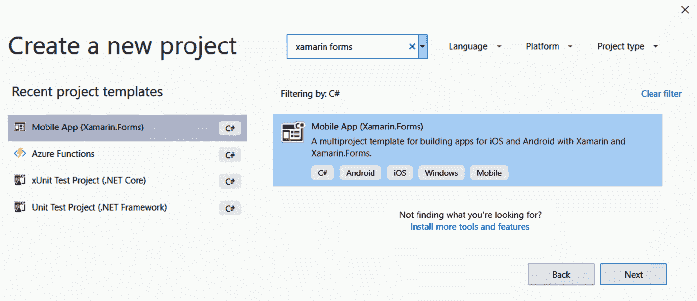
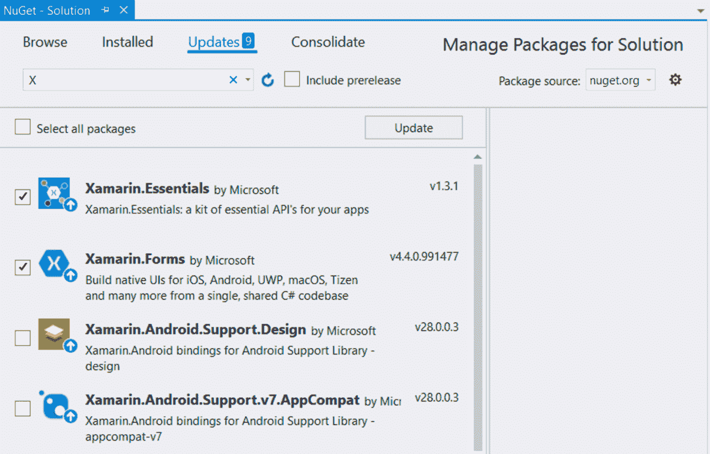
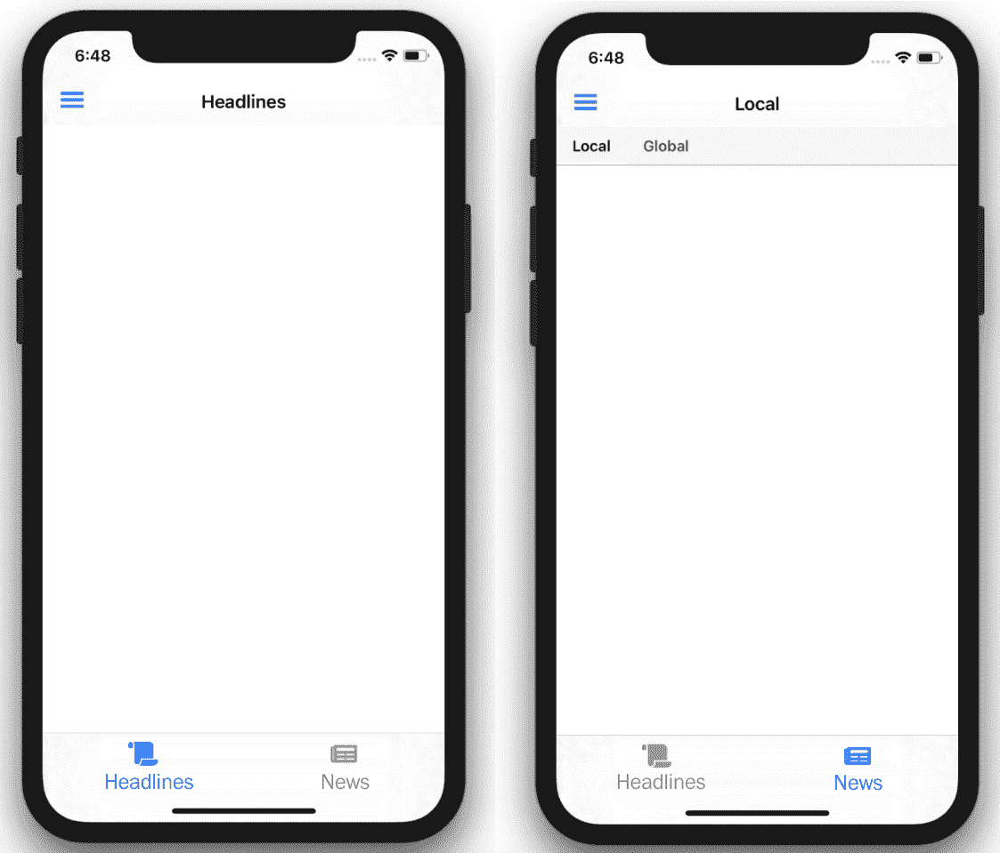
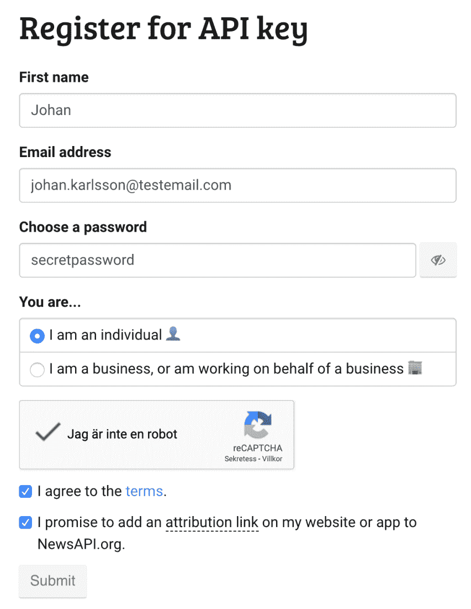

Building a News App Using Xamarin.Forms Shell

在本章中，我们将创建一个新闻应用程序，利用微软 Xamarin 团队提供给我们的新 Shell 导航功能。旧方法仍然有效，不用担心，但我们相信您会喜欢定义应用程序结构的新方法。此外，您还可以混合和匹配旧的和新的。

在本章结束时，您将学习如何使用 Shell 定义应用程序结构、使用 RESTAPI 中的数据以及使用查询样式路由配置导航和在视图之间传递数据。

那么，什么是贝壳呢？在 Shell 中，您使用**可扩展应用程序标记语言**（**XAML**）定义应用程序的结构，而不是将其隐藏在应用程序中分散的代码片段中。您还可以使用路线导航，就像那些花哨的 web 开发人员所做的那样。

本章将介绍以下主题：

*   定义 Shell 导航页面
*   创建弹出型按钮
*   创建导航栏
*   使用路由导航并在查询字符串中传递数据
*   从公共**代表性状态传输**（**REST**）**应用程序编程接口**（**API**中消费数据
*   以`CollectionView`控件的形式添加内容

# 技术要求

要完成此项目，您需要安装 Visual Studio for Mac 或 Windows，以及必要的 Xamarin 组件。有关如何设置您的环境的详细信息，请参见*[第 1 章](01.html)，Xamarin 简介*。

# 项目概述

我们将使用.NET 标准库作为代码共享策略创建一个 Xamarin.Forms 项目。它将包含两个部分，具体如下：

*   在第一部分中，我们将使用 Shell 创建视图并使其可导航。
*   在第二部分中，我们将通过使用新闻的 RESTAPI 添加一些内容。

第二部分不是了解 Shell 所必需的，但它将使您在开发完整应用程序的过程中走得更远。本项目仅针对 iOS 和 Android，因为在撰写本文时，对**通用 Windows 平台**（**UWP**没有很好的支持。

# 开始

让我们开始吧！不过，在开始之前，请确保您拥有一个工作正常的 Xamarin 开发环境。你可以在[第一章](01.html)、*关于 Xamarin 的介绍中阅读所有相关内容。*

# 构建新闻应用程序

本章将从一开始就介绍如何构建新闻应用程序。它会引导你走过每一步，但不会深入到每一个细节。为此，我们建议[第 2 章](02.html)*构建我们的第一个 Xamarin.Forms 应用程序*，这将更加详细。

快乐编码！

## 建立项目

这个项目和其他项目一样，是一个文件式的新项目。这意味着我们根本不会导入任何代码。因此，第一部分是关于创建项目和设置基本项目结构的。

### 创建新项目

打开 Visual Studio 并单击**文件|新建|项目。。。**，如下图所示：


这将打开**创建新项目对话框**向导。遵循以下步骤：

1.  根据截图搜索`xamarin forms`。
2.  选择**移动 App（Xamarin.Forms）**项目模板，点击下一步，如下图所示：



3.  输入新闻作为应用程序的名称，如以下屏幕截图所示：


4.  单击创建。
5.  选择**空白**模板，在平台下选择 Android 和 iOS，如下图所示（在撰写本文时，我们将使用的`CollectionView`控件未完全受 UWP 支持。如果您需要它在 UWP 中工作，请尝试）：


6.  单击“确定”。

这就是项目创建。我们只需要做一些包更新，以确保我们使用的是最新和最好的 Xamarin.Forms 版本。

### 更新 Xamarin.Forms 包

创建项目后，我们应该始终将 Xamarin.Forms 包更新到最新版本。要执行此操作，请执行以下步骤：

1.  在解决方案资源管理器中，右键单击我们的解决方案。
2.  单击 Manage NuGet Packages for Solution。。**。**，如下图所示：


3.  这将在 Visual Studio 中打开 NuGet 软件包管理器，如以下屏幕截图所示：



4.  点击**更新**选项卡，检查**Xamarin.Essentials**和**Xamarin.Forms**（仅限这些）。
5.  单击“更新”，并接受可能弹出的任何许可证对话框。

干得好！我们已经设置了项目，并将所有与 Xamarin.Forms 相关的包更新为最新版本。

让我们继续设置应用程序的结构。

Don't update any Android packages manually except for the Xamarin.Forms package. Doing so might lead to version confusion and headaches.

## 创建应用程序的结构

在本节中，我们将开始构建应用程序的**视图**和**视图模型**。[第二章](02.html)*构建我们的第一个 Xamarin.Forms，App*有一个关于**模型视图模型**（**MVVM**的部分作为设计模式。如果您不知道什么是 MVVM 以及`PropertyChanged.Fody`带来了什么，建议您首先阅读该内容。

### 创建 ViewModel 基类

`ViewModel`是`View`和`Model`之间的调解人。让我们为`ViewModels`创建一个基类，该基类具有可重用的通用功能。实际上，`ViewModel`必须实现一个名为`INotifyPropertyChanged`的接口，以便 MVVM 正常工作。我们将在基类中这样做，还将添加一个名为`PropertyChanged.Fody`的小助手工具，它将节省我们很多时间。再次，请查看[第二章](02.html)*建造我们的第一个 Xamarin。表单应用程序，*如果您对 MVVM 不确定。

第一步是创建基类。进行如下工作：

1.  在**新闻**项目中，创建一个名为`ViewModels`的文件夹。
2.  在`ViewModels`文件夹中，创建一个名为`ViewModel`的类。
3.  将 using 语句添加到`System.ComponentModel`中，并将现有类更改为如下代码：

```cs
using System.ComponentModel;

namespace News.ViewModels
{
    public abstract class ViewModel
    {
    }
}
```

杰出的让我们在基础`ViewModel`类中实现`INotifyPropertyChanged`。

#### 重温 Quick Property 已更改。Fody

`PropertyChanged.Fody`是一种**中间语言**（**IL**weaver），它将在构建时自动向模型属性添加代码。它将更具体地注入一个调用，该调用将在调用 setter 时引发`PropertyChanged`事件。它还负责属性依赖性。如果我更改了`FirstName`属性，`FullName`只读属性也将获得一个`PropertyChanged`事件。在`PropertyChanged.Fody`之前，您必须手动编写此代码。

在[第二章](02.html)*建造我们的第一个 Xamarin 中有更详细的解释。表单应用程序。*你读过了吗？

#### 实现 INotifyPropertyChanged

`ViewModel`位于`View`和`Model`之间。当`ViewModel`发生变化时，必须通知`View`。其机制是`INotifyPropertyChanged`接口，该接口定义`View`中的控件订阅的事件。这里真的没有什么神奇的地方，每个`ViewModel`必须实现这个接口，最好的地方就是`ViewModel`基类。遵循以下步骤：

1.  在**新闻**项目中，打开`ViewModels.cs`。
2.  添加以下粗体代码：

```cs
public abstract class ViewModel : INotifyPropertyChanged
{
    public event PropertyChangedEventHandler PropertyChanged;
}
```

这实现了`INotifyPropertyChanged`接口。下一步是减少我们必须编写的代码行数。通常，您必须从自己的代码中手动引发`PropertyChanged`事件，但多亏了在构建时注入代码的 IL weavers，我们只需创建正常属性并让`PropertyChanged.Fody`发挥作用。

`PropertyChanged.Fody` reduces the amount of code per property from seven lines to one, not only saving your fingers from typing but also making code readability higher.

#### 添加对 PropertyChanged.Fody 的引用

`PropertyChanged.Fody`及其依赖项使用 NuGet 安装。因此，让我们按如下方式安装 NuGet 软件包：

1.  在新闻项目中，安装`PropertyChanged.Fody`NuGet 包。
2.  接受任何许可证对话框。

这将安装相关的 NuGet 软件包。如果您正在使用 Visual Studio for Mac，还需要创建一个`FodyWeaver`文件。它并不复杂，只是一个简单的**可扩展标记语言**（**XML**）文件，用于描述您安装的织布机。下一节将说明如果缺少此文件，如何将其添加到项目中。

#### 创建 FodyWeaver 文件

首先，检查在.NET 标准库项目的根目录下是否有一个名为`FodyWeavers.xml`的文件。如果这样做，请确保它看起来像下面显示的 XML 代码。如果找不到，请按照以下两个简单步骤创建：

1.  在新闻项目的根目录中，创建一个名为`FodyWeavers.xml`的新文件。
2.  将以下代码添加到文件中：

```cs
<?xml version="1.0" encoding="utf-8"?>
<Weavers xmlns:xsi="http://www.w3.org/2001/XMLSchema-instance" 
          xsi:noNamespaceSchemaLocation="FodyWeavers.xsd">
   <PropertyChanged />
</Weavers>
```

Fody 将在构建过程中读取此文件，并执行在此文件中指定的插件。由于我们只有一行（`PropertyChanged`，它将执行该插件并神奇地为我们实现`INotifyPropertyChanged`。

让我们继续并创建我们的第一个`ViewModel`。

### 创建 HeadlinesViewModel 类

现在，我们将开始创建一些`Views`和`ViewModel`占位符，我们将在本章中进行扩展。我们不会直接实现所有的图形功能，而是保持简单，并将所有这些页面视为下一步的占位符。

第一个是`HeadLinesViewModel`类，它将作为`HeadlinesView`的`ViewModel`。进行如下工作：

1.  在新闻项目中，创建一个名为`HeadlinesViewModel`的新类。
2.  编辑要从`ViewModel`基类继承的类，如以下代码段中的粗体所示：

```cs
public class HeadlinesViewModel : ViewModel
{
    public HeadlinesViewModel()
    {
    }
}
```

好的，不错。它还没有什么作用，但我们现在就不谈了。让我们创建匹配的**视图**。

### 创建标题视图

这个**视图**最终将显示一个新闻列表，但在本章的第一节中，它将保持简单。按照以下步骤创建页面：

1.  在新闻项目中，创建一个名为`Views`的文件夹。
2.  右键单击`Views`文件夹，选择“添加”，然后单击“新建项目…”。
3.  在左侧的 Visual C#Items 节点下，选择**Xamarin.Forms**。
4.  选择内容页并将其命名为`HeadlinesView`。
5.  点击**添加**创建页面。

请参阅以下屏幕截图以查看上述信息：


让我们在`HeadlinesView`中添加一些占位符代码，以便于导航。在本章后面，我们将用更热的东西替换它，但为了保持简单，让我们添加一个标签。要执行此操作，请执行以下操作：

1.  在新闻项目中，打开`HeadlinesView.xaml` 。
2.  通过添加以下以粗体标记的代码来编辑 XAML 代码：

```cs
<?xml version="1.0" encoding="UTF-8"?>
<ContentPage 
             xmlns:x="http://schemas.microsoft.com/winfx/2009/xaml"
             Title="Home"
             x:Class="News.Views.HeadlinesView">
    <ContentPage.Content>
        <Label VerticalOptions="Center"
 HorizontalOptions="Center"
 Text="HeadlinesView!" />
    </ContentPage.Content>
</ContentPage>
```

这将设置页面的标题，并添加一个标签，该文本以文本为中心的文本为中心。让我们继续并创建一些额外的**视图**占位符。

### 创建 ArticleItem

该应用程序最终将显示一个文章列表，其中每个文章将使用可重用组件呈现。我们将此可重用组件称为`ArticleItem`。在 Xamarin.Forms 中，可重用组件称为`ContentView`。请不要将其与 MVVM 视图混淆，MVVM 视图由 Xamarin.Forms 中的页面表示。我们知道这令人困惑，但规则是 Xamarin.Forms 页面是 MVVM 视图，而 Xamarin.Forms 内容视图本质上是一个可重用控件。

也就是说，让我们创建`ArticleItem`类，如下所示：

1.  在**新闻**项目中，右键点击`Views`文件夹，选择**添加**，然后点击新建项目。
2.  在左侧的**Visual C#Items**节点下，选择**Xamarin.Forms**。
3.  **重要提示：**确保您在下一步选择**内容视图**模板，而**不是**内容页面模板。
4.  选择**内容视图**（重要，记得吗？），并将其命名为`ArticleItem`。
5.  点击**添加**创建视图。

请参阅以下屏幕截图以查看上述信息：


我们不需要更改此时生成的 XAML 代码，因此我们将保持原样。

### 创建 ArticleView

在最后一节中，我们创建了`ArticleItem`内容视图。此视图（`ArticleView`将包含一个列表视图，其中每个单元格将呈现一个`ArticleItem`。但是现在，让我们添加`ArticleView`作为占位符。请按照以下步骤执行此操作：

1.  在**新闻**项目中，右键点击`Views`文件夹，选择添加，然后点击新建项目。
2.  在左侧**Visual C#Items**节点下选择**Xamarin.Forms**。
3.  选择**内容页**并将其命名为`ArticleView`。
4.  点击**添加**创建页面。

由于该视图目前也是占位符视图，我们只需添加一个标签来指示页面的类型。按以下几个步骤编辑内容：

1.  在**新闻**项目中，打开`Article.xaml`。
2.  通过添加以下以粗体标记的代码来编辑 XAML 代码：

```cs
<?xml version="1.0" encoding="UTF-8"?>
<ContentPage 
             xmlns:x="http://schemas.microsoft.com/winfx/2009/xaml"
             x:Class="News.Views.ArticleView">
    <ContentPage.Content>
        <Label VerticalOptions="Center"
 HorizontalOptions="Center"
 Text="Article view!" />
    </ContentPage.Content>
</ContentPage>
```

好的，在我们开始连线之前，再模拟一个视图。

### 创建 AboutView

最后一个视图将以与所有其他视图相同的方式创建。进行如下工作：

1.  在**新闻**项目中，右键点击`Views`文件夹，选择**添加**，然后点击新建项目。
2.  在左侧的**Visual C#Items**节点下，选择**Xamarin.Forms**。
3.  选择内容页并将其命名为`AboutView`。
4.  点击**添加**创建页面。

此视图是唯一实际保持占位符视图的视图。如果您以后选择从这个项目中构建一些很酷的东西，那么就由您来决定如何使用它。因此，我们将只添加一个标签，说明这是`AboutView`。

1.  在**新闻**项目中，打开`About.xaml`。
2.  通过添加以下以粗体标记的代码来编辑 XAML 代码：

```cs
<?xml version="1.0" encoding="UTF-8"?>
<ContentPage 
             xmlns:x="http://schemas.microsoft.com/winfx/2009/xaml"
             x:Class="News.Views.AboutView">
    <ContentPage.Content>
        <Label VerticalOptions="Center"
 HorizontalOptions="Center"
 Text="About view!" />
    </ContentPage.Content>
</ContentPage>
```

现在，我们有了启动应用程序所需的所有视图。第一步是通过 Autofac 配置依赖项注入。

### 通过 Autofac 连接依赖项注入

使用依赖注入作为一种模式，我们可以使代码更干净，更易于测试。此应用程序将使用构造函数注入，这意味着类的所有依赖项都必须通过其构造函数传递。然后，Autofac 会帮助您构建对象，这样您就不必太在意依赖关系链。让我们开始安装 Autofac。

Confused over dependency injection?

Check out the *Wiring up a dependency injection through Autofac* section in [Chapter 2](02.html), *Building Our First Xamarin.Forms App,* for more details on dependency injection.

#### 添加对 Autofac 的引用

Autofac 生活在我们需要安装的 NuGet 软件包中，我们需要在项目文件中引用它。进行如下工作：

1.  右键单击**解决方案**节点并单击管理解决方案的 NuGet 软件包，打开 NuGet 软件包管理器。
2.  点击浏览，在搜索框中输入`Autofac`。
3.  勾选 Project 下的所有复选框，向下滚动，然后单击 Install。

请参阅以下屏幕截图以查看上述信息：


这将下载 Autofac 并将其安装到您的所有项目中。下一步是添加一些允许我们使用 Autofac 的代码。

#### 创建解析器

解析器将负责根据请求中的类型为我们创建对象。它包装了 Autofac 的特定功能，便于在需要时更换 Autofac。让我们创建解析器，如下所示：

1.  在**新闻**项目的根文件夹中，创建一个名为`Resolver.cs`的新文件。
2.  将以下代码添加到文件中：

```cs
using Autofac;

namespace News
{
    public static class Resolver
    {
        private static IContainer container;

        public static void Initialize(IContainer container)
        {
            Resolver.container = container;
        }

        public static T Resolve<T>()
        {
            return container.Resolve<T>();
        }
    }
}
```

`IContainer`类型的`container`属性在**Autofac**中定义，表示保存如何解析类型配置的容器。`Initialize`方法获取实现`IContainer`接口的对象实例，并将其分配给`container`属性。`Resolve`方法使用`container`属性将类型解析为对象的实例。这似乎是一种奇怪的实例化对象的方式，但只要坚持下去，它就会有意义。

#### 创建引导程序

引导程序负责初始化 Autofac。它将在应用程序启动时调用并运行一次。让我们创建引导程序，如以下步骤所示：

1.  在**新闻**项目的根目录中，创建一个名为`Bootstrapper.cs`的新文件。
2.  输入以下代码：

```cs
using Autofac;
using News.ViewModels;

namespace News
{
    public static class Bootstrapper
    {
        public static void Initialize()
        {
            var containerBuilder = new ContainerBuilder();
            containerBuilder.RegisterAssemblyTypes(typeof(App).Assembly)
                            .Where(x =>   x.IsSubclassOf(typeof(ViewModel)));

            var container = containerBuilder.Build();
            Resolver.Initialize(container);
        }
    }
}
```

Autofac 使用`ContainerBuilder`类来配置并最终构建我们将传递给解析器的容器。可以将构建器视为收集大量关于需要完成的工作的信息，然后最终构建我们需要的对象的东西。顺便说一句，这是一个非常有用的模式。

目前，我们只为一件事使用生成器。稍后，我们将使用它注册程序集中从抽象`ViewModel`类继承的任何类。Autofac 现在已准备好向我们索取这些型号。

The very keen-eyed might notice that this bootstrapper is simpler than the one in [Chapter 2](02.html), *Building Our First Xamarin.Forms App*. That's correct, and the reason for that is that this bootstrapper will not be called by the individual platform projects since there is no need for that in this app. However, as soon as you need to create platform-specific implementations of interfaces, you will need to fall back to the slightly more complicated bootstrapper approach.

#### 初始化引导程序

现在，我们需要将引导程序连接到应用程序中。这应该在生命周期中尽早完成。进行如下工作：

1.  在**新闻**项目中，通过在解决方案浏览器中展开`App.Xaml`节点打开`App.Xaml.cs`。
2.  找到构造函数，并添加以下以粗体标记的代码行：

```cs
public App()
{
    InitializeComponent();
    Bootstrapper.Initialize();
    MainPage = new MainPage();
}
```

不用说，它只是初始化引导程序的静态方法的一行代码。做得好！现在，我们需要在我们的应用程序上添加一些图形，我们依靠**字体真棒**来实现这一神奇。

### 下载和配置字体库

Font Awesome 是一个免费的图像集合，打包成字体。Forms 非常支持在工具栏、导航栏和所有地方使用字体。制作这款应用程序并不需要它，但我们认为它是值得的，因为在你的新杀手应用程序中，你很可能需要这样的东西。

第一步是下载字体。

#### 下载字体真棒

下载字体很简单。请注意，文件的重命名实际上并不需要，但如果文件名更简单，则编辑配置文件更容易。按照以下步骤获取字体并将其复制到每个项目：

1.  浏览至**[https://fontawesome.com/download](https://fontawesome.com/download) 。**
***   点击**桌面免费**按钮下载字体。*   解压缩下载的文件，然后找到`otfs`文件夹。*   将`Font Awesome 5 Free-Solid-900.otf` 文件重命名为**`FontAwesome.otf`**（您可以保留原来的名称，但如果您重命名它的话，键入的内容就更少了）。*   将`FontAwesome.otf`复制到 iOS 项目中的`Resources`文件夹中。*   将`FontAwesome.otf`复制到 Android 项目中的`Assets`文件夹中。**

 **好了，现在我们需要配置 iOS 来接受 Fontsome。只有 iOS 需要这种额外的配置。对于 Android 来说，你是很好的选择。

#### 在 iOS 上将字体添加到 Info.plist

在 iOS 上，我们有一个名为`info.plist`的文件。这个文件是一个标准的 XML 文件，内部格式很有趣。对于此操作，我们强烈建议您使用标准文本编辑器打开此文件，而不是使用**集成开发环境**（**IDE**中的内置编辑器）。这是因为大多数 IDE 都有一个图形化的**用户界面**（**UI**）构建在这个文件之上，这正好妨碍了添加我们想要添加的少量 XML。

也就是说，让我们编辑`info.plist`文件，如下所示：

1.  在**iOS**项目中，使用标准文本编辑器打开`info.plist`。
2.  在以下代码块中添加以粗体标记的标记：

```cs
<?xml version="1.0" encoding="UTF-8"?>
<!DOCTYPE plist PUBLIC "-//Apple//DTD PLIST 1.0//EN" "http://www.apple.com/DTDs/PropertyList-1.0.dtd">
<plist version="1.0">
   <dict>
      <key>UIDeviceFamily</key>
      <array>
         <integer>1</integer>
         <integer>2</integer>
      </array>

      <!-- Tags removed for brevity, don't remove any tags -->

      <key>XSAppIconAssets</key>
      <string>Assets.xcimg/AppIcon.appiconset</string>
 <key>UIAppFonts</key>
      <array>
          <string>FontAwesome.otf</string>
      </array>
    </dict>
</plist>
```

这就是特定于跳台的篮球。下一步是让 Xamarin.Forms 意识到这一点。

#### 将字体添加到静态资源

在 Xamarin.Forms 应用程序中，我们可以定义应用程序范围的资源，这些资源可以在应用程序中的任何位置使用。它们以与页面/视图特定资源相同的方式添加到`App.xaml`文件中。让我们添加对 FontAwesome 的引用，该引用将在我们的 Xamarin.Forms 应用程序中统一为一个名称，如下所示：

1.  在**新闻**项目中，打开`App.xaml`。
2.  添加以下用粗体标记的代码：

```cs
<?xml version="1.0" encoding="utf-8"?>
<Application 
             xmlns:x="http://schemas.microsoft.com/winfx/2009/xaml"
             xmlns:d="http://xamarin.com/schemas/2014/forms/design"
             xmlns:mc="http://schemas.openxmlformats.org/
              markup-compatibility/2006"
             mc:Ignorable="d"
             x:Class="News.App">
    <Application.Resources>
        <ResourceDictionary>
 <OnPlatform x:Key="IconFont" 
               x:TypeArguments="x:String">
 <On Platform="iOS" Value="Font Awesome 5 Free" />
 <On Platform="Android" Value="FontAwesome.otf#" />
 </OnPlatform>
 </ResourceDictionary>
    </Application.Resources>
</Application>
```

`ResourceDictionary`标记定义我们需要一个资源字典。稍后，将在此标记中添加其他资源。在前面的示例中，我们只有一个资源，但它被包装在一个`OnPlatform`标记中。`OnPlatform`标记是 Xamarin.Forms 的一个很酷的特性，它支持基于运行时平台实例化不同的资源。

我们在这里要说的是，我们需要一个名为`IconFont`（`x:Key="IconFont"`）的资源，它将是一个字符串（`x:TypeArguments="x:String"`）。对于 iOS，该字符串将为`Font Awesome 5 Free`，对于 Android，该字符串将为`FontAwesome.otf#`。

我们需要另一个字符串的原因是什么？它与每个平台在识别加载字体方面的期望有关。

#### 在资源字典中定义一些图标

现在我们已经定义了字体，我们将使用它，并在我们的应用程序中定义五个图标。让我们先添加 XAML，然后检查其中一个`FontImage`标记。进行如下工作：

1.  在**新闻**项目中，打开`App.xaml`。
2.  在我们刚刚添加的`OnPlatform`标记下添加以下粗体代码：

```cs
<ResourceDictionary>
    <OnPlatform x:Key="IconFont" x:TypeArguments="x:String">
        <On Platform="iOS" Value="Font Awesome 5 Free" />
        <On Platform="Android" Value="FontAwesome.otf#" />
    </OnPlatform>

    <FontImage x:Key="HomeIcon"
 FontFamily="{StaticResource IconFont}"
 Glyph='& #xf015;' Size="22" Color="Black" />

 <FontImage x:Key="HeadlinesIcon"
 FontFamily="{StaticResource IconFont}"
 Glyph="& #xf70e;" Size="22" />

 <FontImage x:Key="NewsIcon"
 FontFamily="{StaticResource IconFont}"
 Glyph="& #xf1ea;" Size="22" />

 <FontImage x:Key="SettingsIcon"
 FontFamily="{StaticResource IconFont}"
 Glyph="& #xf013;" Size="22"
 Color="Black" />

 <FontImage x:Key="AboutIcon"
 FontFamily="{StaticResource IconFont}"
 Glyph="& #xf05a;"
 Size="22" Color="Black" />
</ResourceDictionary>
```

一个`FontImage`类可以在 Xamarin 的任何地方使用。表单需要一个**ImageSource**对象。它的设计目的是将一个字符（或字形）渲染到图像中。`FontImage`类需要几个属性才能工作，具体如下：

*   应用程序中其他视图使用的参考键。
*   一个`FontFamily`资源，它使用`StaticResource`引用返回到我们在上一节中定义的`IconFont`资源。
*   表示要显示的图像的`Glyph`对象。要找到这些神秘值所指的图像，请访问[fontawesome.com](http://fontawesome.com)，单击图标，选择“免费”，然后开始浏览。
*   `Size`和`Color`。不需要严格要求，但定义起来很好。

FontAwesome 现在已安装和配置。我们已经做了很多工作来讨论这一章的实际主题。是时候定义**外壳了！**

### 定义外壳

如前所述，Xamarin.Forms Shell 是定义应用程序结构的最新方法。书中的不同项目使用不同的方法来定义应用程序的整体结构，但在我们看来，Xamarin.Forms Shell 是定义 UI 结构的最佳方法。我们希望您能像我们一样感到兴奋！

我们将首先创建一个描述应用程序结构的`MainShell`文件。

#### 创建 MainShell 文件

我们将把`MainShell`文件直接添加到.NET 标准库的根目录中。没有可用的 shell 模板，因此我们需要添加一个常规的**内容页**文件，并对其进行一些小的更改。不用担心，很快就能完成，如下所述：

1.  在**新闻**项目中，右键点击项目节点，选择添加，然后点击新建项目。
2.  在左侧的**Visual C#Items**节点下，选择**Xamarin.Forms**。
3.  选择**内容页**并将其命名为`MainShell`。
4.  点击**添加**创建页面。

杰出的现在，我们需要修改 XAML，将根节点更改为 Shell，并删除一些不必要的标记。

1.  在**新闻**项目中，打开`MainShell.xaml`文件。
2.  替换根节点并删除根节点的内容，使文件看起来像以下代码段中的代码：

```cs
<?xml version="1.0" encoding="UTF-8"?>
<Shell 
       xmlns:x="http://schemas.microsoft.com/winfx/2009/xaml"
       x:Class="News.MainShell">
</Shell>
```

要使代码隐藏文件与 XAML 匹配，我们需要通过执行以下操作让它从 Shell 继承：

1.  打开`MainShell.xaml.cs`文件。
2.  将基类更改为`Shell`（或者删除它，因为它是部分类声明），如以下代码段所示：

```cs
public partial class MainShell : Shell
{
    public MainShell()
    {
        InitializeComponent();
    }
}
```

就这样。下一节将重点介绍如何设置应用程序的主要结构。

#### 定义基本结构

我们将从定义应用程序的基本结构开始，而不向其中添加任何已定义的视图。之后，我们将逐个添加实际视图。但是让我们先添加一些内容，然后直接使用 XAML 创建`ContentPage`对象。请按照以下两个步骤进行操作：

1.  在**新闻**项目中，打开`MainShell.xaml` 文件。
2.  更改文件，使其看起来像以下代码：

```cs
<?xml version="1.0" encoding="UTF-8"?>
<Shell 
       xmlns:x="http://schemas.microsoft.com/winfx/2009/xaml"
       xmlns:views="clr-namespace:News.Views"
       x:Class="News.MainShell">
    <FlyoutItem Title="Home"
 Icon="{StaticResource HomeIcon}">
 <ShellContent Title="Headlines" Icon="{StaticResource 
          HeadlinesIcon}" >
 <ContentPage Title="Headlines" />
 </ShellContent>

 <Tab Title="News" Icon="{StaticResource NewsIcon}">
 <ContentPage Title="Local" />
 <ContentPage Title="Global" />
 </Tab>
 </FlyoutItem>

 <FlyoutItem Title="Settings" Icon="{StaticResource 
      SettingsIcon}">
 <ContentPage Title="Settings" />
 </FlyoutItem>

 <ShellContent Title="About" Icon="{StaticResource AboutIcon}">
 <ContentPage Title="About"/>
 </ShellContent>
</Shell>
```

让我们来分析一下。**shell**本身的直接子对象是两个`FlyoutItem`对象和一个`ShellContent`对象。这三个都有一个**标题**和一个**图标**，如下面的屏幕截图所示。图标引用了我们之前创建的字体资源。这将渲染弹出按钮，如以下屏幕截图所示：


从左侧滑入可访问弹出按钮。`Flyout`对象可以有多个子元素，`ShellContent`元素只能有一个子元素。

“主页”弹出按钮项是最复杂的示例。它有两个孩子；带有标题为**标题**的页面的`ShellContent`和一个单独定义两个子页面的选项卡。第一级儿童将呈现应用程序底部的**选项卡****栏**，如下图所示。标题为**新闻**的 Tab 元素下的第二级子元素将直接呈现为顶部**导航****栏**标题下的选项卡栏：



关于弹出按钮的**设置**和**将简单地呈现它们定义的页面。**

#### 将 MainShell 类型添加到容器中

我们现在需要将我们创建的`MainShell`注册到我们的容器中，以便我们可以实例化它并向世界展示它。进行如下工作：

1.  在**新闻**项目中，打开`Bootstrapper.cs`文件。

2.  找到`Initialize()`方法并添加以下粗体代码：

```cs
public static void Initialize()
{
    var containerBuilder = new ContainerBuilder();
    containerBuilder.RegisterType<MainShell>();
    // code omitted for brevity
}
```

这使 Autofac 容器知道在请求类或接口时应返回哪些实例。

### 让应用程序运行

我们正接近真相的第一刻。是时候尝试一下这个应用程序了，看看它是否像本章中显示的屏幕截图。我们只有最后一件事要做，那就是实例化`MainShell`并将其分配给应用程序的`MainPage`属性。进行如下工作：

1.  在**新闻**项目中，打开`App.xaml.cs`文件。
2.  将主页的分配替换为对`Resolver`的调用，并使用以下粗体代码标记：

```cs
public App()
{
    InitializeComponent();
    Bootstrapper.Initialize();
    MainPage = Resolver.Resolve<MainShell>();
}
```

应用程序现在应该可以运行了。如果没有，请冷静下来，简单地重新检查代码。完成应用程序导航后，让我们创建一个新闻服务，从中获取新闻，并扩展我们创建的所有视图。

## 创建新闻服务

为了找到酷的内容，我们将使用[newsapi.org](https://newsapi.org)提供的现有新闻 API。为此，您必须注册一个 API 密钥，我们可以使用它来请求新闻。如果您不习惯这样做，您可以根据需要模拟新闻服务，而不是使用 API。

第一件事是获取 API 密钥。

### 获取 API 密钥

注册的过程非常简单。但由于这是一本书，请注意，[newsapi.org](https://newsapi.org)的用户界面在您阅读本书时可能已经发生了变化。

好的，让我们得到那把钥匙，如下所示：

1.  浏览至[https://newsapi.org/](https://newsapi.org/) 。
2.  单击获取 API 密钥。
3.  填写表格，如以下屏幕截图所示：



4.  复制下一页提供的 API 密钥，如以下屏幕截图所示：


现在，我们需要一个地方来存放钥匙，以便于取用。我们将创建一个静态类，它将为我们保存密钥。进行如下工作：

1.  在**新闻**项目中，在根文件夹中创建一个名为`Settings`的新类。
2.  添加如下代码片段所示的代码，以插入在上一节中获得的 API 密钥：

```cs
namespace News
{
    public static class Settings
    {
        public static string NewsApiKey
        {
            get
            {
                return "<Your APIKey here>";
            }
        }
    }
}
```

这里最重要的一点是，您可以将密钥复制并粘贴到文件中。现在，我们需要模型。

### 创建模型

API 返回的数据需要去某个地方，访问它最方便的方式是将数据反序列化为**POCO**对象（**普通旧 CLR 对象**，也称为常规 C#类）。这些 POCO 对象我们通常称之为模型，它们通常喜欢生活在一个名为`Models`的文件夹中。让我们创建我们的模型：

1.  在**新闻**项目中，创建一个名为`Models`的新文件夹。
2.  在`Models`文件夹中，添加一个名为`NewsApiModels`的新类。
3.  将以下代码添加到类中：

```cs
using System;
using System.Collections.Generic;

namespace News.Models
{
    public class Source
    {
        public string Id { get; set; }
        public string Name { get; set; }
    }

    public class Article
    {
        public Source Source { get; set; }
        public string Author { get; set; }
        public string Title { get; set; }
        public string Description { get; set; }
        public string Url { get; set; }
        public string UrlToImage { get; set; }
        public DateTime PublishedAt { get; set; }
        public string Content { get; set; }
    }

    public class NewsResult
    {
        public string Status { get; set; }
        public int TotalResults { get; set; }
        public List<Article> Articles { get; set; }
    }
}
```

当我们调用 API 时，它将返回一个`NewsResult`对象，该对象将包含文章列表。下一步是创建一个服务，该服务将包装 API 并允许我们访问最新新闻。

If you ever need to create a class model out of a bunch of **JavaScript Object Notation** (**JSON**), you can use the Paste JSON as Classes tool in Visual Studio for Windows (**Edit | Paste Special | Paste JSON as Classes**).

### 创建服务类

服务类将包装 API，以便我们能够以一种好的.NET 方式访问它。我们还将使用一个名为**开关表达式**的酷 C#8 特性来提高代码的可读性。

但我们将从定义一个枚举开始，该枚举将定义我们请求的新闻的范围。

#### 创建新闻范围枚举

`NewsScope`枚举定义了我们服务支持的不同类型的新闻。让我们通过以下几个步骤来添加它：

1.  在**新闻**项目中，创建一个名为**服务**的新文件夹。
2.  在**服务**文件夹中，添加一个名为`NewsScope.cs`的新文件。
3.  将以下代码添加到该文件：

```cs
namespace News.Services
{
    public enum NewsScope
    {
        Headlines,
        Local,
        Global
    }
}
```

为了能够在`switch`表达式中使用此枚举，我们需要为项目启用 C#8。

#### 启用 C#8

在 VisualStudio 中创建新项目时，默认情况下通常不启用 C#8 功能。然而，启用它相当简单，但它确实涉及手动编辑项目文件。请按照以下几个步骤进行操作：

1.  右键点击**新闻**项目节点，点击【编辑项目文件】，如下图所示：


2.  将以下以粗体标记的行添加到项目文件中：

```cs
<Project Sdk="Microsoft.NET.Sdk">
   <PropertyGroup>
      <TargetFramework>netstandard2.0</TargetFramework>
      <ProduceReferenceAssembly>true</ProduceReferenceAssembly>
      <LangVersion>8.0</LangVersion>
   </PropertyGroup>

   <!-- xml removed for brevity -->
</Project> 
```

就这样。我们现在已经指定要使用 C#8。您还可以指定`latest`作为`LangVersion`标记的值。下一步是创建将包装对**新闻 API**的调用的`NewsService`类。

#### 创建新闻服务类

`NewsService`类的目的是包装对 news REST API 的 HTTP 调用，并使我们的代码能够以常规.NET 方法调用的形式轻松访问这些调用。它还可以作为一种抽象，如果您愿意的话，可以更容易地替换新闻来源。

创建`NewsService`类非常简单。遵循以下步骤：

1.  在**新闻**项目中，安装`Newtonsoft.Json`NuGet 包的方式与我们之前添加**Autofac**包的方式相同。
2.  在**服务**文件夹中，创建一个名为`NewsService`的新类。
3.  编辑该类，使其看起来像以下代码：

```cs
using System;
using System.Net;
using System.Threading.Tasks;
using News.Models;
using Newtonsoft.Json;

namespace News.Services
{
    public class NewsService
    {
        public async Task<NewsResult> GetNews(NewsScope scope)
        {
            string url = GetUrl(scope);

            var webclient = new WebClient();
            var json = await 
             webclient.DownloadStringTaskAsync(url);
            return JsonConvert.DeserializeObject<NewsResult>(json);
        }
        private string GetUrl(NewsScope scope)
        {
            return scope switch
            {
                NewsScope.Headlines => Headlines,
                NewsScope.Global => Global,
                NewsScope.Local => Local,
                _ => throw new Exception("Undefined scope")
            };
        }
        private string Headlines =>
            "https://newsapi.org/v2/top-headlines?" +
            "country=us&" +
            $"apiKey={Settings.NewsApiKey}";

        private string Local =>
            "https://newsapi.org/v2/everything?q=local&" +
            $"apiKey={Settings.NewsApiKey}";

        private string Global =>
            "https://newsapi.org/v2/everything?q=global&" +
            $"apiKey={Settings.NewsApiKey}";
    }
}
```

`NewsService`类由五个方法组成；

第一个方法`GetNews`是我们最终将从应用程序调用的方法。它接受一个参数`scope`，它是我们之前创建的枚举。根据此参数的值，我们将获得不同类型的新闻。该方法做的第一件事是解析要调用的**统一资源定位器**（**URL**），并通过调用具有作用域的`GetUrl`方法来实现。

`GetUrl`方法使用开关表达式解析 URL，并根据传递的 scope 参数的值，返回三个 URL 中的一个。URL 指向**新闻 API**的 REST API，带有一些预定义的查询参数和我们注册的 API 密钥。

解析正确的 URL 后，我们就可以发出 HTTP 请求并以 JSON 的形式下载新闻。NET 中的内置`WebClient`类为我们很好地获取了 JSON。获取数据后剩下的就是将其反序列化到我们前面定义的新闻模型中。

下一步是连接`NewsService`类。

## 连接新闻服务类

我们现在准备在我们的应用程序中连接`NewsService`类，并将其与真实的新闻源集成。我们将扩展现有的所有 ViewModel，并定义 UI 元素，以便能够在视图中呈现新闻。

### 扩展 HeadlinesViewModel 类

在 MVVM 中，`ViewModel`是处理应用程序逻辑的地方。该模型是我们将从`NewsService`类中获得的新闻数据。我们现在将扩展`HeadlinesViewModel`类，通过以下两个步骤使用`NewsService`获取新闻：

1.  在**新闻**项目中，展开`ViewModels`文件夹，打开`HeadlinesViewModel.cs`文件。
2.  添加以下以粗体标记的代码并解析引用：

```cs
using System;
using System.Threading.Tasks;
using System.Web;
using System.Windows.Input;
using News.Models;
using News.Services;
using Xamarin.Forms;

namespace News.ViewModels
{

public class HeadlinesViewModel : ViewModel
{
    private readonly NewsService newsService;
 public NewsResult CurrentNews { get; set; }

 public HeadlinesViewModel(NewsService newsService)
 {
 this.newsService = newsService;
 }

 public async Task Initialize(string scope)
 {
 var resolvedScope = scope.ToLower() switch
 {
 "local" => NewsScope.Local,
 "global" => NewsScope.Global,
 "headlines" => NewsScope.Headlines,
 _ => NewsScope.Headlines
 };

 await Initialize(resolvedScope);
 }

 public async Task Initialize(NewsScope scope)
 {
 CurrentNews = await newsService.GetNews(scope);
 }

 public ICommand ItemSelected =>
 new Command(async (selectedItem) =>
 {
 var selectedArticle = selectedItem as Article;
 var url = HttpUtility.UrlEncode(selectedArticle.Url);
 // Placeholder for more code later on
 });
 }
}
}
```

因为我们正在使用（构造函数）依赖项注入，所以我们需要将依赖项注入构造函数中。此 ViewModel 唯一的依赖项是`NewsService`，我们将其作为字段存储在类内部。

定义`CurrentNews`属性是为了获取要将 UI 绑定到的内容。

然后我们有两个`Initialize`方法，一个将`scope`作为枚举，另一个将`scope`作为字符串。`Initialize`方法的字符串重载将在 XAML 中使用，它只是将字符串转换为`scope`的枚举表示形式，然后调用另一个`Initialize`方法，该方法反过来调用新闻服务上的`GetNews(...)`方法。

最后的属性`ItemSelected`返回一个 Xamarin.Forms 命令，当应用程序的用户选择一个项目时，我们将连接该命令以响应该命令。该方法的一半是从一开始就实现的。所选项目将被传递到方法中，然后我们对文章的 URL 进行编码，因为当我们在应用程序中导航时，我们将把它作为查询参数传递。稍后我们将回到导航部分。

因此，现在我们有了获取数据所需的代码，我们将继续定义显示数据的 UI。

### 扩展标题视图

`HeadlinesView`是一个共享视图，将在应用程序中的多个位置使用。该视图的目的是显示文章列表，并允许从一篇文章导航到将显示整个文章的 web 浏览器。

扩展`HeadlinesView`分两步进行；首先，我们编辑 XAML 并定义 UI，然后我们需要添加一些代码来初始化它。进行如下工作：

1.  在**新闻**项目中，展开`Views`文件夹，打开`HeadlinesView.xaml`文件。
2.  编辑 XAML，如以下代码块所示：

```cs
<?xml version="1.0" encoding="UTF-8"?>
<ContentPage 
             xmlns:x="http://schemas.microsoft.com/winfx/2009/xaml"
             xmlns:views="clr-namespace:News.Views"
             x:Name="headlinesview"
             Title="Home"
             x:Class="News.Views.HeadlinesView">
   <ContentPage.Content>
      <StackLayout Padding="14">
         <CollectionView ItemsSource="{Binding 
           CurrentNews.Articles}">
            <CollectionView.EmptyView>
               <Label Text="Loading" />
            </CollectionView.EmptyView>
            <CollectionView.ItemTemplate>
               <DataTemplate>
                  <ContentView>
                     <ContentView.GestureRecognizers>
                        <TapGestureRecognizer
                           Command="{Binding 
                           BindingContext.ItemSelected, 
                           Source={x:Reference headlinesview}}"
                        CommandParameter="{Binding .}" />
                     </ContentView.GestureRecognizers>
                     <views:ArticleItem />
                  </ContentView>
               </DataTemplate>
            </CollectionView.ItemTemplate>
         </CollectionView>
      </StackLayout>
   </ContentPage.Content>
</ContentPage>
```

`HeadlinesView`使用`CollectionView`来显示文章列表。`ItemsSource`属性设置为`ViewModel`的`CurrentNews.Articles`属性，加载新闻后，应该包含新闻列表。当列表为空或正在加载时，我们将显示一个加载标签，该标签在`CollectionView.EmptyView`元素中定义。当然，您可以在该标记内创建任何有效的 UI，以创建一个更酷的加载屏幕。

`CurrentNews.Articles`列表中的每一篇文章都将使用`CollectionView.ItemTemplate`元素中的任何内容来呈现，而`ContentView`元素中的内容将代表实际的项目。本文将使用`ArticleItem`视图呈现，该视图基本上是我们前面定义的自定义控件。我们将在完成此视图后立即定义此视图。

要启用视图导航，我们需要检测用户何时单击特定文章。我们通过添加一个`TapGestureRecognizer`并将其绑定到根`ViewModel`的`ItemSelected`命令来实现。`Source={x:Reference headlinesview}}`片段将当前上下文引用回页面的根目录，而不是我们正在迭代的列表中的当前文章。如果我们没有指定源，绑定引擎将尝试将`ItemSelected`命令绑定到`CurrentNews.Articles`属性的当前文章中定义的属性。

这就是 GUI 部分的全部内容。现在，我们需要修改后面的代码，以便根据我们将从 XAML 本身传递的数据启用初始化。请按照以下步骤进行操作：

1.  在**新闻**项目中，打开`HeadlinesView.xaml.cs`代码隐藏文件。
2.  将以下以粗体标记的代码添加到文件中：

```cs
using System.Threading.Tasks;
using News.Services;
using News.ViewModels;
using Xamarin.Forms;

namespace News.Views
{
   public partial class HeadlinesView : ContentPage
   {
       public HeadlinesView()
 {
 InitializeComponent();
 Task.Run(async () => await Initialize("Headlines"));
 }

 public HeadlinesView(string scope)
 {
 InitializeComponent();
 Title = $"{scope} news";
 Task.Run(async () => await Initialize(scope));
 }

 private async Task Initialize(string scope)
 {
 var viewModel = Resolver.Resolve<HeadlinesViewModel>();
 BindingContext = viewModel;
 await viewModel.Initialize(scope);
 }
   }
}
```

通常，我们不想直接将代码添加到视图的代码隐藏中，但我们需要做一个例外，以允许将参数从 XAML 传递到我们的`ViewModel`。

根据 XAML 的格式，在页面初始化期间将调用前面两个构造函数中的一个。如果我们在 XAML 中根本没有指定任何参数，那么将调用第一个构造函数。如果我们指定参数，那么将调用第二个构造函数。两个构造函数都调用一个私有方法，该方法为我们创建一个`HeadlinesViewModel`实例，将其设置为视图的绑定上下文，并在 ViewModel 上调用`Initialize()`方法，该方法对 news API 进行 REST 调用。在编辑 shell 文件时，我们将在一段时间内使用这两个构造函数。

但首先，我们需要扩展`ArticleItem`的`ContentView`以显示新闻列表中的单行项目。

### 扩展 ArticleItem 的 ContentView

`ArticleItem`的`ContentView`代表新闻列表中的一项，如下截图所示：


要创建此布局，我们将使用一个`Grid`控件。按照以下步骤创建所需的布局：

1.  在**新闻**项目中，展开`Views`文件夹，打开`ArticleItem.xaml`文件。
2.  编辑 XAML 代码，如以下代码块所示：

```cs
<?xml version="1.0" encoding="UTF-8"?>
<ContentView 
             xmlns:x="http://schemas.microsoft.com/winfx/2009/xaml"
             x:Class="News.Views.ArticleItem">
  <Grid Margin="0">
    <Grid.RowDefinitions>
      <RowDefinition Height="10" />
      <RowDefinition Height="40" />
      <RowDefinition Height="15" />
      <RowDefinition Height="10" />
      <RowDefinition Height="1" />
    </Grid.RowDefinitions>
    <Grid.ColumnDefinitions>
      <ColumnDefinition Width="65" />
      <ColumnDefinition Width="*" />
    </Grid.ColumnDefinitions>

    <Label Text="{Binding Title}"
           Padding="10,0"
           Grid.Row="1"
           Grid.Column="1"
           FontSize="Medium"
           FontAttributes="Bold" />

    <Label Text="{Binding PublishedAt, StringFormat='{0:MMMM d, 
     yyyy}'}"
           Padding="10"
           Grid.Column="1"
           Grid.Row="2"
           FontSize="Small" />

    <Frame Grid.Row="1"
           Grid.RowSpan="2"
           CornerRadius="15"
           Padding="0"
           BackgroundColor="#667788"
           IsClippedToBounds="True">

      <Image Source="{Binding UrlToImage}"
             HorizontalOptions="Center" 
             VerticalOptions="Center" />
    </Frame>
    <BoxView BackgroundColor="LightGray" 
             Grid.Row="4" 
             Grid.ColumnSpan="2" />
  </Grid>
</ContentView>
```

前面的 XAML 代码定义了一个两列五行的网格布局。`Grid.Row`和`Grid.Column`属性将子元素定位到网格中，`Grid.ColumnSpan`属性允许控件跨越多个列。

使用指定了`CornerRadius`且`IsClippedToBounds`设置为`True`的`Frame`**元素可以获得圆形图像。**

 **标签中的字符串可以直接在 binding 语句中格式化。查看将日期格式化为特定字符串格式的代码`Text="{Binding PublishedAt, StringFormat='{0:MMMM d, yyyy}'}"`行。

最后，灰色分隔线是 XAML 代码末尾的`BoxView`。

现在我们已经创建了`NewsService`并修复了所有相关视图，是时候利用它们了。

### 添加到引导程序

由于`HeadlinesViewModel`依赖于`NewsService`，我们需要将其注册到我们的**控制反转**（**IoC**容器中。请按照以下步骤执行此操作：

1.  在**新闻**项目中，打开`Bootstrapper.cs`文件。
2.  找到`Initialize()`方法，添加以下粗体标记的行，并使用引用进行解析：

```cs
public static void Initialize()
{
   var containerBuilder = new ContainerBuilder();
   containerBuilder.RegisterType<NewsService>();
   containerBuilder.RegisterType<MainShell>();

   containerBuilder.RegisterAssemblyTypes(typeof(App).Assembly).Where(x => x.IsSubclassOf(typeof(ViewModel)));
   var container = containerBuilder.Build();
   Resolver.Initialize(container);
 } 
```

这将允许`NewsService`的依赖项注入。

### 添加 ContentTemplate 属性

到目前为止，我们的`MainShell`文件中只有占位符代码。让我们将其替换为实际内容，如下所示：

1.  在**新闻**项目中，打开`MainShell.xaml`。
2.  找到标题设置为 Home 的`FlyoutItem`元素。
3.  编辑 XAML，使`ShellContent`元素自动关闭，添加以下粗体标记的`ContentTemplate`属性，替换`Tab`元素的内容：

```cs
<FlyoutItem Title="Home"
            Icon="{StaticResource HomeIcon}">
  <ShellContent Title="Headlines"
                Icon="{StaticResource HeadlinesIcon}"
                ContentTemplate="{DataTemplate 
                 views:HeadlinesView}" /> 
   <Tab Title="News" Route="news" Icon="{StaticResource NewsIcon}">
    <ShellContent Title="Local" Route="local" >
 <ShellContent.ContentTemplate>
 <DataTemplate>
 <views:HeadlinesView>
 <x:Arguments>
 <x:String>Local</x:String>
 </x:Arguments>
 </views:HeadlinesView>
 </DataTemplate>
 </ShellContent.ContentTemplate>
 </ShellContent>
 <ShellContent Title="Global" Route="global">
 <ShellContent.ContentTemplate>
 <DataTemplate>
 <views:HeadlinesView>
 <x:Arguments>
 <x:String>Global</x:String>
 </x:Arguments>
 </views:HeadlinesView>
 </DataTemplate>
 </ShellContent.ContentTemplate>
 </ShellContent>
  </Tab>
</FlyoutItem>
```

这里发生了两件事。首先，我们使用`ContentTemplate`属性指定`ShellContent`的内容。这意味着，当视图变得可见时，我们将指向要创建的视图类型。通常，您希望将视图的创建推迟到即将显示之前，而`ContentTemplate`属性会提供这一点。

第二件事是我们在下面对`Local`和`Global`新闻进行了同样的操作，但是我们指定在创建这些视图时，我们要调用接受字符串参数的构造函数。如您所见，将单个参数传递给构造函数的 XAML 非常冗长，但它完成了任务。

如果此时运行该应用程序，您应该会看到如下屏幕截图：


我们需要实现的最后一件事是在点击列表中的项目时查看文章。

## 操纵导航

现在，我们正在为这个应用程序进行最新的尝试。我们唯一剩下的就是实现到文章视图的导航，该视图将在 web 视图中显示整个文章。因为我们使用的是 Shell，所以我们将使用路由进行导航。路由可以直接在 Shell 标记中注册，例如在`MainShell.xaml`文件中，这是通过在`ShellContent`元素上使用`Route`属性来完成的。

在下面的代码中，我们将以编程方式添加一个路由，并注册一个视图来为我们处理它。我们还将创建一个导航服务来稍微抽象一下导航的概念。

所以，系好安全带，让我们完成这个应用程序！

### 创建导航服务

第一步是定义一个将包装 Xamarin.Forms 导航的接口。我们为什么要这样做？将接口与实现分离是一个很好的实践；它使单元测试更容易；等等

#### 创建 INavigation 接口

`INavigation`接口很简单，我们会稍微超出目标。我们只对`NavigateTo`方法感兴趣，但我们将添加`PushModal()`和`PopModal()`方法，因为如果您继续扩展应用程序，您可能会使用它们。

添加导航界面很简单，如下步骤所示：

1.  在**新闻**项目中，展开`ViewModels`文件夹并添加一个名为`INavigate.cs`的新文件。
2.  将以下代码添加到文件中：

```cs
using System.Threading.Tasks;
using Xamarin.Forms;

namespace News.ViewModels
{
    public interface INavigate
    {
        Task NavigateTo(string route);
        Task PushModal(Page page);
        Task PopModal();
    }
}
```

`NavigateTo()`方法声明采用我们想要导航的路径。这是我们将调用的方法。`PushModal()`方法在导航堆栈顶部添加一个新页面作为模式页面，强制用户仅与此特定页面交互。`PopModal()`方法将其从导航堆栈中删除。因此，如果您使用`PushModal()`方法，请确保为用户提供了将其从堆栈中弹出的方法。否则，您将永远无法查看模式页面。

这就是界面的全部内容。让我们使用 Xamarin.Forms Shell 创建一个实现。

#### 使用 Shell 实现 INavigation 接口

实现非常简单，因为每个方法只调用 Shell API 提供的 Xamarin.Forms 静态方法。

创建`Navigator`类，如下步骤所示：

1.  在**新闻**项目中，添加一个名为`Navigator`的新类。
2.  将以下代码添加到类中：

```cs
using System.Threading.Tasks;
using News.ViewModels;
using Xamarin.Forms;

namespace News
{
    public class Navigator : INavigate
    {
        public async Task NavigateTo(string route)
        {
            await Shell.Current.GoToAsync(route);
        }

        public async Task PushModal(Page page)
        {
            await Shell.Current.Navigation.PushModalAsync(page);
        }

        public async Task PopModal()
        {
            await Shell.Current.Navigation.PopModalAsync();
        }
    }
}
```

这只是调用现有方法的传递代码。

#### 将 INavigation 接口添加到 ViewModel 类

为了能够访问 navigator，我们扩展了`ViewModel`基类，使其可用于所有 ViewModels。进行如下工作：

1.  在**新闻**项目中，打开`ViewModels`文件夹，然后打开`ViewModel.cs`文件。
2.  将以下以粗体标记的代码添加到类中：

```cs
public abstract class ViewModel : INotifyPropertyChanged
{
    public event PropertyChangedEventHandler PropertyChanged;
    public INavigate Navigation { get; set; } = new Navigator();
}
```

`ViewModel`现在通过`INavigate`接口公开`Navigator`属性，我们准备将导航连接到`Article`视图。

### 使用路线导航

路由是一种非常方便的导航方式，因为它们将页面的创建抽象出来。我们所需要知道的只是到我们想要导航到的视图的路线和 Xamarin.Forms Shell 为我们处理其余的事情。如果您熟悉 web 导航的工作原理，您可能会认识到我们在路由中传递参数的方式。它们作为查询参数传递。

#### 完成 ItemSelected 命令

我们之前在`HeadlinesViewModel`类中定义了`ItemSelected`命令。现在是添加代码的时候了，该代码将通过以下两个步骤执行到`ArticleView`的导航：

1.  在**新闻**项目中，展开`ViewModels`文件夹，打开`HeadlinesViewModel.cs`。
2.  找到`ItemSelected`属性并添加以下粗体标记的行：

```cs
public ICommand ItemSelected =>
    new Command(async (selectedItem) =>
    {
        var selectedArticle = selectedItem as Article;
        var url = HttpUtility.UrlEncode(selectedArticle.Url);
        await Navigation.NavigateTo($"articleview?url={url}");
    });
```

我们将定义一个名为`articleview`的路由，该路由使用一个名为`url`的查询行参数，该参数指向文章本身的 URL，它将如下所示：`articleview?url=www.mypage.com`。只有在`url=`参数之后传递的数据必须是**UrlEncoded**，这意味着我们需要对其进行编码，以替换会干扰路由本身的字符。**URL 编码**是通过`HttpUtility.UrlEncode()`方法完成的，我们在`System.Web`中定义了`HttpUtility.UrlEncode()`方法。

前面的`NavigateTo()`方法调用在查询参数中使用此编码数据。

在导航呼叫的接收方，我们需要处理传入的`url`参数。

#### 扩展 ArticleView 以接收查询数据

`ArticleView`负责为我们提供物品。为了简单起见（同时也说明您并不总是需要`ViewModel`，我们不会为这个类定义`ViewModel`，而是将`BindingContext`定义为`UrlWebViewSource`类的一个实例。

将以下代码添加到`ArticleView.xaml.cs`文件中：

1.  在**新闻**项目中，展开`Views`文件夹，打开`ArticleView.xaml.cs`文件。
2.  将以下以粗体标记的代码添加到文件中：

```cs
using System.Web;
using Xamarin.Forms;

namespace News.Views
{
    [QueryProperty("Url", "url")]
    public partial class ArticleView : ContentPage
    {
        public string Url
 {
 set
 {
 BindingContext = new UrlWebViewSource
 {
 Url = HttpUtility.UrlDecode(value)
 };
 }
 }

        public ArticleView()
        {
            InitializeComponent();
        }
    }
}
```

`ArticleView`依赖于所设置的 URL，我们通过定义一个名为`Url`的仅设置属性来实现。设置此属性时，它将创建一个具有该属性值的`UrlWebViewSource`的新实例，并将其分配给页面的`BindingContext`。这个 setter 由 Shell 框架调用，因为我们向类本身添加了一个名为`QueryProperty`的属性。它有两个参数，第一个是设置哪个属性，第二个是`url`查询参数的名称。

由于数据来自 URL 编码，我们需要使用`HttpUtility.UrlDecode()`方法对其进行解码。

现在，我们有了一个绑定上下文，它指向我们要显示的网页。我们现在只需要在 XAML 中定义`WebView`。

#### 使用 WebView 扩展 ArticleView

这个页面只有一个目的，那就是显示我们传递给它的 URL 中的网页。让我们在页面中添加一个`WebView`控件，如下所示：

1.  在**N**ews 项目中，展开`Views`文件夹并打开`ArticleView.xaml`。
2.  添加以下粗体标记的 XAML：

```cs
<?xml version="1.0" encoding="UTF-8"?>
<ContentPage 
             xmlns:x="http://schemas.microsoft.com/winfx/2009/xaml"
             x:Class="News.Views.ArticleView">
    <ContentPage.Content>
        <WebView Source="{Binding .}" />
    </ContentPage.Content>
</ContentPage>
```

`WebView`控件将占用视图中的所有可用空间，并且源将设置为“【T1]”，这意味着它将与`ViewModel`的`BindingContext` 属性相同。在本例中，`BindingContext`属性是`UrlWebViewSource`实例，正是`WebView`导航和显示内容所需要的。

只剩一步了。我们的应用程序现在需要了解`articleview`路线以及如何处理它。

#### 登记路线

如前所述，可以在 XAML（`Route="MyDucks"`或代码中声明性地添加路由，如下所示：

1.  在新闻项目中，打开`MainShell.xaml.cs`文件。
2.  添加以下粗体代码行：

    ```cs
    using News.Views;
    using Xamarin.Forms;

    namespace News
    {
        public partial class MainShell
        {
            public MainShell()
            {
                InitializeComponent();
                Routing.RegisterRoute("articleview", 
                 typeof(ArticleView));
            }
        }
    }
    ```

`RegisterRoute()`方法有两个参数；第一个是我们想要使用的路由，它是我们在`NavigateTo()`调用中指定的路由。第二个是我们想要创建的页面（视图）的类型，在我们的例子中，我们想要创建一个`ArticleView`。

凉的就这样结束了。应用程序现在应该可以运行了，你应该可以从任何一个`CollectionViews`导航到这篇文章。干得好！

# 总结

我们学习了如何使用 Xamarin.Forms Shell 定义导航结构，如何使用 routes 导航到视图，以及如何以查询字符串的形式在视图之间传递参数。Shell 还有很多功能，但这应该会让您有足够的信心开始探索 Shell API。还请记住，Shell API 在不断发展，因此请务必查看可用的最新功能。

我们还学习了如何为任意 REST API 创建 API 客户端，这总是很方便，因为您将编写的大多数应用程序都需要在某个时刻与服务器通信。服务器很有可能通过 RESTAPI 公开其数据和功能。

下一个项目将是创建一个 match making 应用程序，以及如何创建自己的支持滑动的是/否图像选择器应用程序，只使用 Xamarin 表单渲染和动画跨平台 UI 控件。****