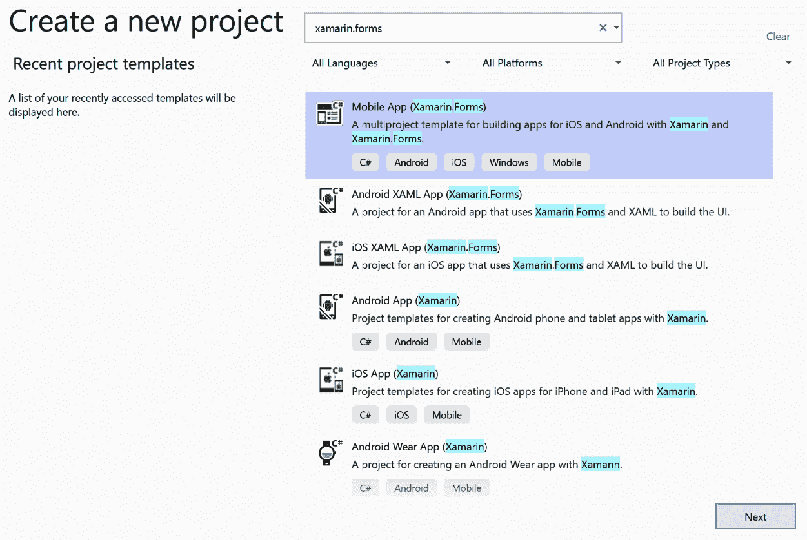
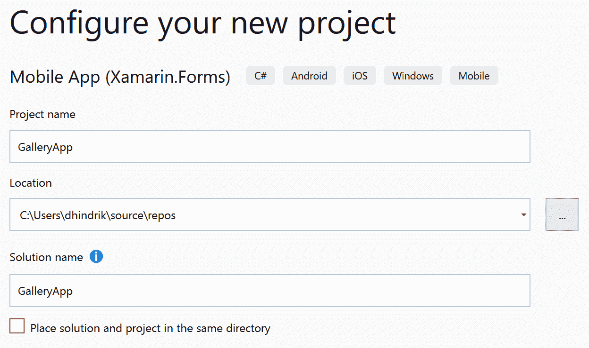
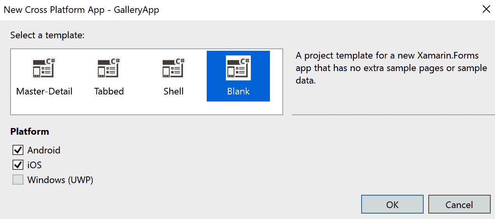

Building a Photo Gallery App Using CollectionView and CarouselView

在本章中，我们将构建一个应用程序，用于显示来自用户设备的相机卷（照片库）的照片。用户还可以选择照片作为收藏夹。然后，我们将研究在旋转木马和多列网格控件中显示照片的不同方式。如果我们学会了如何使用这些控件，那么当我们构建真实世界的应用程序时，我们可以在很多其他情况下使用它们。

本章将介绍以下主题：

*   如何从 iOS 照片库导入照片
*   如何从 Android 照片库导入照片
*   如何在 Xamarin.Forms 中使用`CarouselView`
*   如何在 Xamarin.Forms 中使用`CollectionView`

# 技术要求

要完成此项目，您需要在 PC 上安装 Visual Studio for Mac 或 Visual Studio 2019，以及 Xamarin 组件。请参见[第 1 章](01.html)、*Xamarin 简介*，了解有关如何设置您的环境的更多详细信息。要使用 Visual Studio 为您的 PC 构建 iOS 应用程序，您必须连接 Macintosh（Mac）设备。如果你根本无法使用 Mac 电脑，你可以只使用这个项目中的 Android 部分。

# 项目概述

几乎所有的应用程序都将数据集合可视化，在本章中，我们将重点介绍两个可用于显示数据集合的 Xamarin.Forms 控件-
`CollectionView`和`CarouselView`。我们的应用程序将显示用户在其设备上的照片；为此，我们需要为每个平台创建一个照片导入器，一个用于 iOS，一个用于 Android。

# 构建照片库应用程序

是时候开始使用以下步骤构建应用程序了：

1.  使用移动应用程序（Xamarin.Forms）模板。查找模板的最简单方法是在启动 Visual Studio 时出现的对话框顶部的搜索栏中搜索`Xamarin.Forms`：



2.  将应用程序命名为`GalleryApp`：



3.  选择空白模板，Android 和 iOS 作为平台：



4.  更新模板添加的 NuGet 包，以确保使用最新版本。我们将通过右键单击解决方案文件并选择 Manage NuGet Packages for solution 来执行此操作。然后，选择更新选项卡，选择所有包，然后单击更新。

在这个项目中，我们将使用一些 C#8 特性。在撰写本书时，C#8 不是默认的语言版本。要使用它，您需要将`<LangVersion>8.0</LangVersion>`添加到每个项目文件中。

## 导入照片

导入照片是为这两个平台执行的，因此我们将创建一个照片导入器界面。该接口将有两个`get`方法，一个支持分页，另一个获取具有指定文件名的照片。这两种方法也将采用质量参数，但我们将只使用 iOS 照片导入器中的一个。quality 参数将是一个带有两个选项的枚举-`High`和`Low`。但是，在创建接口之前，我们将创建一个模型类，该类应使用以下步骤表示导入的照片：

1.  在`GalleryApp`项目中创建一个名为`Models`的新文件夹。
2.  在最近创建的文件夹中创建一个名为`Photo`的新类：

```cs
public class Photo
{
      public string Filename { get; set; }
      public byte[] Bytes { get; set; }
}
```

现在我们已经创建了模型类，可以继续创建接口了。该界面将有两种`get`方法，一种用于获取特定范围内的照片，另一种用于获取具有特定文件名的照片：

1.  在`GalleryApp`项目中创建一个名为`IPhotoImporter`的新接口。
2.  在同一个文件中（但在接口之外），创建一个名为`Quality`的枚举，其中包含两个成员—`Low`和`High`：

```cs
public interface IPhotoImporter
{
     Task<ObservableCollection<Photo>> Get(int start, int count, 
     Quality quality = Quality.Low);
     Task<ObservableCollection<Photo>> Get(List<string> filenames, 
     Quality quality = Quality.Low);
}

public enum Quality
{
     Low,
     High
}
```

现在我们有了接口，我们可以从平台实现开始。

### 从 iOS 照片库导入照片

首先，我们将编写 iOS 代码。要访问照片，我们需要用户的许可，因此我们需要一种向用户请求许可的方法。为此，我们需要添加文本来解释为什么我们需要对`info.plist`文件的权限。当我们请求用户许可时，将显示此文本。要打开`info.plist`文件，请右键单击该文件并单击“打开方式”，然后选择 XML（文本）编辑器：

```cs
<key>NSPhotoLibraryUsageDescription</key> 
<string>We want to show your photos in this app</string>
```

我们要做的第一件事是创建一个私有`Import`方法，读取可以加载的照片：

1.  在`GalleryApp.iOS`项目中，创建一个名为`PhotoImporter`的新类。
2.  实现`IPhotoImporter`接口。
3.  解析所有引用。
4.  使用名为`results`的`PHAsset`类型数组创建一个私有字段。这将用于存储照片信息。
5.  创建一个名为`Import`的新私有方法。
6.  使用`PHPhotoLibrary.RequestAuthorizationAsync`方法请求授权。
7.  如果用户授权我们使用照片，请使用`PHAsset.FetchAssets`获取所有图像资产：

```cs
public class PhotoImporter : IPhotoImporter
{
    private PHAsset[] results;

    private async Task<bool> Import()
    {
        var status = await 
         PHPhotoLibrary.RequestAuthorizationAsync();

        if (status != PHAuthorizationStatus.Authorized)
        {
            return false;
        }

        results = PHAsset.FetchAssets(PHAssetMediaType.Image, 
         null).Select(x => (PHAsset)x).ToArray();

        return true;
    }

    Task<ObservableCollection<Photo>> Get(int startIndex, int 
     count, Quality quality = Quality.Low)
    {
        throw new NotImplementedException();
    }

    Task<ObservableCollection<Photo>> Get(List<string> filenames, 
     Quality quality = Quality.Low)
    {
        throw new NotImplementedException();
    }
}
```

现在，我们已经为所有的照片取了`PHAssets`；但是为了展示照片，我们需要得到真实的照片。为此，我们需要请求资产的映像。这是异步执行的；为此，我们将使用`ObservableCollection`：

```cs
private void RequestImage(ObservableCollection<Photo> photos, PHAsset asset, string filename, PHImageRequestOptions options)
{
     PHImageManager.DefaultManager.RequestImageForAsset(asset,  
     PHImageManager.MaximumSize, PHImageContentMode.AspectFill, 
     options, (image, info) =>
     {
           using (NSData imageData = image.AsPNG())
           {
                var bytes = new byte[imageData.Length];
                System.Runtime.InteropServices.Marshal.Copy
                (imageData.Bytes, bytes, 0, Convert.ToInt32(
                 imageData.Length));

                var photo = new Photo()
                {
                     Bytes = bytes,
                     Filename = filename
                };

                photos.Add(photo);
           }
    });
}         
```

现在，我们有了从接口开始实现这两个方法所需要的东西。我们将从`Task<ObservableCollection<Photo>> Get(int start, int count, Quality quality = Quality.Low)`方法开始，该方法将用于从增量加载照片的`CollectionView`视图获取照片：

```cs
public async Task<ObservableCollection<Photo>> Get(int start, int count, Quality quality = Quality.Low)
{
    if (results == null)
    {
        var succeded = await Import();

        if (!succeded)
        {
            return new ObservableCollection<Photo>();
        }
    }

    var photos = new ObservableCollection<Photo>();
    var options = new PHImageRequestOptions()
    {
        NetworkAccessAllowed = true,
        DeliveryMode = quality == Quality.Low ?
        PHImageRequestOptionsDeliveryMode.FastFormat :
         PHImageRequestOptionsDeliveryMode.HighQualityFormat
    };

    Index startIndex = start;
    Index endIndex = start + count;

    if (endIndex.Value >= results.Length)
    {
        endIndex = results.Length - 1;
    }

    if (startIndex.Value > endIndex.Value)
    {
         return new ObservableCollection<Photo>();
    }

    foreach (PHAsset asset in results[startIndex..endIndex])
    {
         var filename = 
         (NSString)asset.ValueForKey((NSString)"filename");RequestImage(
          photos, asset, filename, options);
    }
    return photos;
 }
```

To use `Index`, we need to set the language version of the project to C# 8\. To do so, see the instructions provided in the *Building the photo gallery app* section earlier in this chapter.

来自`IPhotoImporter`接口的另一种方法`Task<ObservableCollection<Photo>> Get(List<string> filenames, Quality quality = Quality.Low)`与`Task<ObservableCollection<Photo>> Get(int start, int count, Quality quality = Quality.Low)`方法非常相似。唯一的区别是没有处理索引的代码，在结果数组中循环的`foreach`循环包含一个`if`语句，检查文件名是否与当前`PHAsset`对象相同，如果相同，则调用`RequestImage`方法：

```cs
public async Task<ObservableCollection<Photo>> Get(List<string> filenames, Quality quality = Quality.Low)
{
     if (results == null)
     {
         var succeded = await Import();

         if (!succeded)
         {
              return new ObservableCollection<Photo>();
         }
     }

     var photos = new ObservableCollection<Photo>();

     var options = new PHImageRequestOptions()
     {
         NetworkAccessAllowed = true,
         DeliveryMode = quality == Quality.Low ? PHImageRequestOptionsDeliveryMode.FastFormat : PHImageRequestOptionsDeliveryMode.HighQualityFormat
     };

     foreach (PHAsset asset in results)
     {
          var filename = (NSString)asset.ValueForKey((NSString)"filename");   

          if (filenames.Contains(filename))
          {
               RequestImage(photos, asset, filename, options);
          }
      }

      return photos;
 }
```

在前面的代码中，我们设置了`NetworkAccessAllowed = true`。我们这样做是为了能够从 iCloud 下载照片。

现在，我们项目的两个照片导入者之一已经完成。

### 从 Android 照片库导入照片

现在我们已经为 iOS 创建了一个实现，我们将为 Android 做同样的事情：

1.  在`GalleryApp.Android`项目中创建一个名为`PhotoImporter`的新接口。
2.  从`IPhotoImporter`界面导入所有成员。
3.  解析所有引用。
4.  创建一个名为`ContinueWithPermission`的新方法，当我们获得用户从照片库获取照片的权限时，我们将调用该方法。
5.  使用`ContentResolver`获取照片（如下代码块所示）。
6.  循环遍历结果并将其添加到名为`result`的`string[]`类型的类级字段中：

```cs
public class PhotoImporter : IPhotoImporter
{
    private bool hasCheckedPermission;
    private string[] result;

    public bool ContinueWithPermission(bool granted)
    {
        if (!granted)
        {
            return false;
        }

        Android.Net.Uri imageUri = 
         MediaStore.Images.Media.ExternalContentUri;
        var cursor = 
         MainActivity.Current.ContentResolver.Query(imageUri, null, 
         MediaStore.Images.ImageColumns.MimeType + "=? or " + 
         MediaStore.Images.ImageColumns.MimeType + "=?", 
         new string[] { "image/jpeg", "image/png" }, 
         MediaStore.Images.ImageColumns.DateModified);

        var paths = new List<string>();

        while (cursor.MoveToNext())
        {
            string path = cursor.GetString(cursor.GetColumnIndex(
             MediaStore.Images.ImageColumns.Data));
        paths.Add(path);
        }

        result = paths.ToArray();

        hasCheckedPermission = true;

        return true;
    }

    Task<ObservableCollection<Photo>> Get(int startIndex, 
    int count, Quality quality = Quality.Low)
    {
        throw new NotImplementedException();
    }

    Task<ObservableCollection<Photo>> Get(List<string> filenames,
     Quality quality = Quality.Low)
    {
        throw new NotImplementedException();
    }
}
```

接下来要做的是编写一个`Import`方法，在前面的方法运行之前，该方法将执行导入的第一步，包括检查用户权限。在对`RequestPermissions`的调用中，我们将设置一个标识符/代码，以便我们知道当用户响应权限请求时该做什么。该方法应如以下代码所示：

```cs
private async Task<bool> Import()
{
    string[] permissions = { Manifest.Permission.ReadExternalStorage };

    if (MainActivity.Current.CheckSelfPermission(Manifest.Permission.ReadExternalStorage) == Permission.Granted)
    {
        ContinueWithPermission(true);
        return true;
    }

    MainActivity.Current.RequestPermissions(permissions, 33);

    while (hasCheckedPermission)
    {
         await Task.Delay(100);
    }
    return MainActivity.Current.CheckSelfPermission(Manifest.Permission.ReadExternalStorage) == Permission.Granted;
}
```

在我们从`IPhotoImporter`界面添加`Get`方法之前，Android 导入的最后一步是添加代码来处理用户响应权限请求时发生的事情。我们将在`Gallery.Android`项目的`MainActivity`中这样做：

```cs
public static MainActivity Current { get; private set; }

public override void OnRequestPermissionsResult(int requestCode, string[] permissions, [GeneratedEnum] Android.Content.PM.Permission[] grantResults)
{
    Xamarin.Essentials.Platform.OnRequestPermissionsResult(requestCode,
    permissions, grantResults);

    if (requestCode == 33)
    {
        var importer = (PhotoImporter)Resolver.Resolve<IPhotoImporter>();
        importer.ContinueWithPermission(grantResults[0] == 
        Permission.Granted);
    }

    base.OnRequestPermissionsResult(requestCode, permissions, 
     grantResults);
}
```

然后我们将开始编辑`Task<ObservableCollection<Photo>> Get(int start, int count, Quality quality = Quality.Low)`方法。如果导入成功，或者如果`results`变量已经有值，我们将继续编写代码来处理在此图像加载中应该导入哪些照片。条件由`start`和`count`参数指定。采取以下步骤计算我们应该使用的结束索引：

```cs
public async Task<ObservableCollection<Photo>> Get(int start, int count, Quality quality = Quality.Low)
{
    if (result == null)
    {
         var succeded = await Import();

         if (!succeded)
         {
             return new ObservableCollection<Photo>();
         }
    }

    if (result.Length == 0)
    {
         return new ObservableCollection<Photo>();
    }

    Index startIndex = start;
    Index endIndex = start + count;

    if (endIndex.Value >= result.Length)
    {
        endIndex = result.Length - 1;
    }

    if (startIndex.Value > endIndex.Value)
    {
         return new ObservableCollection<Photo>();
    }

    var photos = new ObservableCollection<Photo>();

    foreach (var path in result[startIndex..endIndex])
    {
        var filename = Path.GetFileName(path);
        var stream = new FileStream(path, FileMode.Open, FileAccess.Read);
        var memoryStream = new MemoryStream();
        stream.CopyTo(memoryStream);

        var photo = new Photo()
        {
            Bytes = memoryStream.ToArray(),
            Filename = filename
        };

        photos.Add(photo);
    }

    return photos;
 }
```

现在，我们将继续使用另一种`Task<ObservableCollection<Photo>> Get(List<string> filenames, Quality quality = Quality.Low)`方法：

1.  创建一个`foreach`循环，循环浏览所有照片，并检查每个照片是否在`filenames`参数中指定。如果是这种情况，请从路径中读取照片，如第一种`Get`方法：

```cs
public async Task<ObservableCollection<Photo>> Get(List<string> filenames, Quality quality = Quality.Low)
{
    if (result == null)
    {
        var succeded = await Import();

        if (!succeded)
        {
            return new ObservableCollection<Photo>();
        }
    }

    if (result.Length == 0)
    {
        return new ObservableCollection<Photo>();
    }

    var photos = new ObservableCollection<Photo>();

    foreach (var path in result)
    {
        var filename = Path.GetFileName(path);

        if (!filenames.Contains(filename))
        {
            continue;
        }

        var stream = new FileStream(path, FileMode.Open, 
         FileAccess.Read);
        var memoryStream = new MemoryStream();
        stream.CopyTo(memoryStream);

        var photo = new Photo()
        {
            Bytes = memoryStream.ToArray(),
            Filename = filename
        };
            photos.Add(photo);
    }

    return photos;
}
```

照片导入器现在已经完成，我们已经准备好编写应用程序的其余部分，这将主要涉及添加平台间共享的代码。

## 编写应用程序初始化代码

我们现在已经编写了代码，将用于向应用程序获取数据。让我们继续构建应用程序，从初始化应用程序的核心部分开始。

### 创建外壳

此应用程序的主要导航将是屏幕底部的选项卡。该应用程序将有一个弹出菜单，其中包含两个选项 Home 和 Gallery：

1.  在`GalleryApp`项目的`Views`文件夹中，使用 XAML 创建两个新的`ContentPage`文件，一个名为`MainView`，另一个名为`GalleryView`。
2.  在`GalleryApp`项目的根目录下，创建一个名为`MainShell`的新`ContentPage`文件。
3.  将`MainShell`的基类更改为`Shell`而不是`ContentPage`。我们需要在`MainShell.xaml`和`MainShell.xaml.cs`中都这样做。
4.  将`MainView`添加到包裹在`ShellContent`对象中的`Shell`对象。
5.  使用`ShellContent`的`ContentTemplate`属性将`GalleryView`添加到`Shell`对象中。使用`DataTemplate`标记扩展名。这将在用户点击选项卡时加载`GalleryView`，而不是在`Shell`加载时加载`MainView`：

```cs
<Shell 
 xmlns:x="http://schemas.microsoft.com/winfx/2009/xaml"
 xmlns:views="clr-namespace:GalleryApp.Views"
 x:Class="GalleryApp.MainShell">
    <ShellContent Title="Home">
         <views:MainView />
     </ShellContent>
     <ShellContent Title="Gallery" ContentTemplate="{DataTemplate views:GalleryView}" />
</Shell>
```

定义好 shell 后，我们可以导航到`App.xaml.cs`并将`MainPage`设置为`MainShell`：

```cs
public App()
{
    InitializeComponent();
    MainPage = new MainShell();
}
```

现在我们已经创建了一个 shell，在开始创建视图之前，让我们继续使用其他一些基本代码。

### 创建基础视图模型

在创建实际视图模型之前，我们将创建一个所有视图模型都可以继承的抽象基础视图模型。这个基本视图模型背后的想法是，我们可以在其中编写通用代码。在这种情况下，我们将通过以下步骤实现`INotifyPropertyChanged`接口：

1.  在`GalleryApp`项目中，创建一个名为`ViewModels`的文件夹。
2.  创建一个名为`ViewModel`的新抽象类：

```cs
public abstract class ViewModel : INotifyPropertyChanged
{
    public event PropertyChangedEventHandler PropertyChanged;

    protected void Set<T>(ref T field, T newValue, [CallerMemberName]
     string propertyName = null)
    {
        if (!EqualityComparer<T>.Default.Equals(field, newValue))
        {
            field = newValue;
            RaisePropertyChanged(propertyName);
         }
     }

    protected void RaisePropertyChanged([CallerMemberName] string 
     propertyName = null)
    {
        PropertyChanged?.Invoke(this, new 
         PropertyChangedEventArgs(propertyName));
    }

    private bool isBusy;
    public bool IsBusy
    {
        get => isBusy;
        set
         {
            Set(ref isBusy, value);
            RaisePropertyChanged(nameof(IsNotBusy));
        }
    }

    public bool IsNotBusy => !IsBusy;
}
```

The `CallerMemberName` attribute is used so that we don't have to specify the property name when calling it; it will use the name of the property that we called it from.

现在，我们有了一个`ViewModel`基础，可以用于本项目稍后创建的所有`ViewModel`实例。

### 创建引导程序和解析程序

在这个项目中，我们将使用依赖项注入和一个名为 Autofac 的库。**Autofac 是一个开源的**控制反转**（**IoC**容器。我们将创建一个`Resolver`类，以便轻松解析我们将在本章后面添加到容器中的类型。为此，我们将执行以下步骤：**

 **1.  在`GalleryApp`、`GalleryApp.Android`和`GalleryApp.iOS`项目中安装 NuGet 的 Autofac。
2.  在`GalleryApp`项目中，在项目的根目录中创建一个名为`Resolver`的新类。
3.  创建一个名为`container`的`private static IContainer`字段。
4.  创建一个名为`Initialized`的`static`方法，该方法有一个`IContainer`参数，并设置`container`字段的值，如下代码所示：

```cs
using Autofac;
using System;
using System.Collections.Generic;
using System.Text;

namespace GalleryApp
{
    public class Resolver
    {
        private static IContainer container;

        public static void Initialize(IContainer container)
        {
            Resolver.container = container;
        }
    }
}
```

`Initialize`方法将在 Autofac 配置完成后调用，我们将在创建引导程序时执行此操作。这个方法只是将它得到的`container`字段作为参数存储在`static`容器字段中。

现在，我们需要一个方法来访问它。再创建一个名为`Resolve`的`static`方法。这个方法是泛型的，当我们使用它时，我们将把它的类型指定为要解析的类型。使用`container`字段解析类型，如下代码所示：

```cs
public static T Resolve<T>()
{
     return container.Resolve<T>();
} 
```

`Resolve<T>`方法将类型作为参数，并查看容器中是否有关于如何构造此类型的信息。如果有，我们就退回。

因此，现在我们有了用于解析对象类型实例的解析器，我们需要对其进行配置。这是引导者的工作。

#### 创建引导程序

要配置依赖项注入并初始化解析器，我们将创建一个引导程序。我们将为每个平台提供一个共享引导程序和其他引导程序，以满足其特定配置。我们需要它们针对特定平台的原因是，我们将在 iOS 和 Android 上实现不同的`IPhotoImporter`。要创建引导程序，我们将采取以下步骤：

1.  在`GalleryApp`项目中创建一个新类，并将其命名为`Bootstrapper`。
2.  将以下代码添加到新类：

```cs
using System.Linq;
using System.Reflection;
using Autofac;
using GalleryApp.ViewModels;
using Xamarin.Forms;

namespace GalleryApp
{
    public class Bootstrapper
    {
        protected ContainerBuilder ContainerBuilder { get; 
         private set; }
        public Bootstrapper()
        {
            Initialize();
            FinishInitialization();
        }

        protected virtual void Initialize()
        {
            ContainerBuilder = new ContainerBuilder();

            ContainerBuilder.RegisterType<MainShell>();

            var currentAssembly = Assembly.GetExecutingAssembly();

            foreach (var type in 
            currentAssembly.DefinedTypes.Where(e => 
             e.IsSubclassOf(typeof(ContentPage))))
            {
                ContainerBuilder.RegisterType(type.AsType());
            }

            foreach (var type in 
            currentAssembly.DefinedTypes.Where(e => 
             e.IsSubclassOf(typeof(ViewModel))))
            {
                ContainerBuilder.RegisterType(type.AsType());
            }
        }

        private void FinishInitialization()
        {
            var container = ContainerBuilder.Build();

            Resolver.Initialize(container);
        }
    }
}
```

**创建 iOS 引导程序**

在 iOS 引导程序中，我们有特定于 iOS 应用程序的配置。要创建 iOS 应用程序，我们需要执行以下步骤：

1.  在 iOS 项目中，创建一个新类并将其命名为`Bootstrapper`。
2.  使新类从`GalleryApp.Bootstrapper`继承。
3.  添加以下代码：

```cs
using System;
using Autofac;

namespace GalleryApp.iOS
{
    public class Bootstrapper : GalleryApp.Bootstrapper
    {
        protected override void Initialize()
        {
            base.Initialize();

            ContainerBuilder.RegisterType<PhotoImporter>().As<IPhotoImporter>().SingleInstance();
        }
    }
}
```

4.  转到 iOS 项目中的`AppDelegate.cs`。
5.  在调用`LoadApplication`之前，在`FinishedLaunching`方法中，创建`Bootstrapper`的新实例，如下代码所示：

```cs
public override bool FinishedLaunching(UIApplication app, NSDictionary options)
{    
    _ = new Bootstrapper();global::Xamarin.Forms.Forms.Init();

    LoadApplication(new App());

     return base.FinishedLaunching(app, options);
}
```

**创建 Android 引导程序**

在 Android 引导程序中，我们有特定于 Android 应用程序的配置。要在 Android 中创建引导程序，我们将执行以下步骤：

1.  在 Android 项目中，创建一个新类并将其命名为`Bootstrapper`。
2.  使新类从`GalleryApp.Bootstrapper`继承。
3.  添加以下代码：

```cs
using System;
using Autofac;

namespace GalleryApp.Droid
{
    public class Bootstrapper : GalleryApp.Bootstrapper
    {
        protected override void Initialize()
        {
            base.Initialize(); ContainerBuilder.RegisterType<PhotoImporter>().As<IPhotoImporter>().SingleInstance();
        }
    }
}
```

4.  转到 Android 项目中的`MainActivity.cs`文件。
5.  在调用`LoadApplication`之前，在`FinishedLaunching`方法中创建`Bootstrapper`的新实例，如下代码所示：

```cs
protected override void OnCreate(Bundle savedInstanceState)
{
     TabLayoutResource = Resource.Layout.Tabbar;
     ToolbarResource = Resource.Layout.Toolbar;

     base.OnCreate(savedInstanceState);

     _ = new Bootstrapper();
     Xamarin.Essentials.Platform.Init(this, savedInstanceState);

     global::Xamarin.Forms.Forms.Init(this, savedInstanceState);

     LoadApplication(new App());
} 
```

Discards are "dummy variables" that are used when, for example, a method has a return value—but we will never use them. To mark a discard, we will use an underscore (`_`). For example, in the preceding case, we have `_ = new Bootstrapper();`. You can read more about discards at [https://docs.microsoft.com/en-us/dotnet/csharp/discards](https://docs.microsoft.com/en-us/dotnet/csharp/discards).

现在，我们已经创建了用于导入 iOS 和 Android 的代码，以及应用程序的初始化部分。现在，我们准备好开始创建视图了吗。

## 创建库视图

现在，我们将开始构建视图。我们将从 gallery 视图开始，该视图将照片显示为网格。

### 创建视图模型

`ViewModel`是负责获取数据和处理视图逻辑的类。因为照片将异步添加到照片集合中，所以我们不希望在调用`PhotoImporter`的`Get`方法后立即将`IsBusy`设置为`false`。我们先等 3 秒钟。但是，我们还将向集合中添加一个事件侦听器，以便侦听更改。如果集合发生变化，并且集合中有项目，我们会将`IsBusy`设置为`false`。添加以下代码以实现此功能：

```cs
public class GalleryViewModel : ViewModel
{
    private readonly IPhotoImporter photoImporter;
    private readonly ILocalStorage localStorage;

    public GalleryViewModel(IPhotoImporter photoImporter, ILocalStorage localStorage)
    {
         this.photoImporter = photoImporter;
         this.localStorage = localStorage;

         Task.Run(Initialize);
    }

    public ObservableCollection<Photo> Photos { get; set; }

    private async Task Initialize()
    {
         IsBusy = true;
         Photos = await photoImporter.Get(0,20);
         RaisePropertyChanged(nameof(Photos));

         Photos.CollectionChanged += Photos_CollectionChanged;
         await Task.Delay(3000);
         IsBusy = false;
    }

    private void Photos_CollectionChanged(object sender, System.Collections.Specialized.NotifyCollectionChangedEventArgs e)
    {
        if(e.NewItems != null && e.NewItems.Count > 0)
        {
            IsBusy = false;
            Photos.CollectionChanged -= Photos_CollectionChanged;
        }
    }
}
```

现在，`ViewModel`已经准备好，我们可以开始创建视图了。

### 创建视图

首先，我们将创建一个转换器，将`byte[]`转换为`Xamarin.Forms.ImageSource`。在`GalleryApp`项目中，创建一个名为`Converters`的新文件夹，并在该文件夹中创建一个名为`BytesToImageConverter`的新类：

```cs
public class BytesToImageConverter : IValueConverter
{
    public object Convert(object value, Type targetType, object parameter, CultureInfo culture)
     {
         if (value != null)
         {
             var bytes = (byte[])value;
             var stream = new MemoryStream(bytes);

             return ImageSource.FromStream(() => stream);
        }

        return null;
 }

    public object ConvertBack(object value, Type targetType, object parameter, CultureInfo culture)
    {
         throw new NotImplementedException();
    }
}
```

要使用转换器，我们需要将其添加为资源。我们将通过将其添加到`GalleryView`的`Resources`属性中的`ResourceDictionary`对象来实现：

1.  打开`GalleryView.xaml`。
2.  将以下粗体样式的代码添加到视图中：

```cs
<ContentPage  xmlns:x="http://schemas.microsoft.com/winfx/2009/xaml"
 xmlns:converters="clr-namespace:GalleryApp.Converters"
 x:Class="GalleryApp.Views.GalleryView" Title="Photos">   
    <ContentPage.Resources>
 <ResourceDictionary>
 <converters:BytesToImageConverter x:Key="ToImage" />
 </ResourceDictionary>
 <ContentPage.Resources>
</ContentPage>
```

为了能够绑定到`ViewModel`，我们将`BindingContext`设置为`GalleryViewModel`。使用`GalleryView.xaml.cs`中的解析器创建`GalleryViewModel`的实例：

1.  打开`GalleryView.xaml.cs`。
2.  将以下以粗体标记的代码添加到类中：

```cs
public GalleryView()
{
    InitializeComponent();
    BindingContext = Resolver.Resolve<GalleryViewModel>();
}
```

在此视图中，我们将显示一个具有三列的网格。要使用 Xamarin.Forms 构建这个，我们将使用`CollectionView`控件。要指定`CollectionView`应有的布局，请在`CollectionView`的`ItemsLayout`属性中添加一个`GridItemsLayout`元素。

按照以下步骤构建此视图：

1.  导航到`GalleryView.xaml`。
2.  导入`GalleryApp.ViewModels`和`GalleryApp.Models`的名称空间。
3.  在`ContentPage`上，将`x:DataType`设置为`vm:GalleryViewModel`。这使得绑定可以编译，这将使我们的视图更快地呈现：

```cs
<CollectionView x:Name="Photos" ItemsSource="{Binding Photos}">
    <CollectionView.ItemsLayout>
         <GridItemsLayout Orientation="Vertical" Span="3" HorizontalItemSpacing="0" />
     </CollectionView.ItemsLayout>
</CollectionView><CollectionView.ItemTemplate>

<DataTemplate x:DataType="models:Photo"> 
    <Grid>
        <Image Aspect="AspectFill" Source="{Binding Bytes, Converter={StaticResource ToImage}}" HeightRequest="120" /> 
    </Grid> 
</DataTemplate> 
</CollectionView.ItemTemplate> 
```

现在，我们可以在视图中看到这些照片。但是，我们还需要创建在没有任何照片显示时显示的内容，因为这些照片尚未加载，或者如果没有可用的照片。按照以下步骤创建一个`DataTemplate`对象，在`CollectionView`没有任何数据时显示：

```cs
<CollectionView EmptyView="{Binding}">

<CollectionView.EmptyViewTemplate>
    <DataTemplate x:DataType="vm:GalleryViewModel">
         <Grid>
             <ActivityIndicator IsVisible="{Binding IsBusy}" />
             <Label Text="No photos to import could be found" IsVisible="{Binding IsNotBusy}" HorizontalOptions="Center" VerticalOptions="Center" HorizontalTextAlignment="Center" />
         </Grid>
 </DataTemplate>
 </CollectionView.EmptyViewTemplate>
```

现在，我们可以运行应用程序了。下一步是在用户到达视图末尾时加载更多照片。

### 增量加载照片

要加载超过前 20 个项目，我们将以增量方式加载照片，这样当用户滚动到`CollectionView`末尾时，它将开始加载更多项目。`CollectionView`内置了增量加载数据的支持。因为我们从照片导入器获取了一个`ObeservableCollection`对象，并且数据是异步添加到该对象的，所以我们需要创建一个事件侦听器来处理将项目添加到照片导入器时的情况，以便我们可以将其添加到绑定到`CollectionView`的`ObservableCollection`实例中。通过以下步骤创建事件侦听器：

1.  导航到`GalleryViewModel.cs`。
2.  添加以下代码：

```cs
private int itemsAdded;
private void Collection_CollectionChanged(object sender, System.Collections.Specialized.NotifyCollectionChangedEventArgs args)
{
    foreach(Photo photo in args.NewItems)
    {
         itemsAdded++;
         Photos.Add(photo);
     }

    if(itemsAdded == 20)
    {
        var collection = (ObservableCollection<Photo>)sender;
        collection.CollectionChanged -= Collection_CollectionChanged;
    }
}

private int currentStartIndex = 0;
public ICommand LoadMore => new Command(async() =>
{
     currentStartIndex += 20;
     itemsAdded = 0;
     var collection = await photoImporter.Get(currentStartIndex, 20);
     collection.CollectionChanged += Collection_CollectionChanged;
 });
```

要使增量负载正常工作，我们唯一要做的就是将`CollectionView`绑定到我们在`ViewModel`中创建的代码。当用户只剩下五个项目时，以下代码将触发加载更多照片：

```cs
<CollectionView x:Name="Photos" EmptyView="{Binding}" ItemsSource="{Binding Photos}" RemainingItemsThreshold="5" RemainingItemsThresholdReachedCommand="{Binding LoadMore}">
```

现在我们有了一个显示照片并以增量方式加载它们的视图，我们可以将照片添加为收藏夹。

### 保存收藏夹

在`GalleryView`中，我们希望能够选择可以在`MainView`中显示的收藏夹。为此，我们需要存储我们选择的照片，以便它记住我们的选择。在名为`ILocalStorage`的`GalleryApp`项目中创建一个新接口：

```cs
public interface ILocalStorage
{
    Task Store(string filename);
    Task<List<string>> Get();
}
```

在 Xamarin.Forms 中存储/持久化数据的最简单方法是使用内置属性存储。`Properties`是`Application`类的属性，是我们`App`类的基类。请按照以下步骤使用它：

1.  为`GalleryApp`项目安装`Newtonsoft.Json`NuGet 包。
2.  在`GalleryApp`项目中创建一个名为`FormsLocalStorage`的新类。
3.  实现`ILocalStorage`接口：

```cs
public class FormsLocalStorage : ILocalStorage
{
    public const string FavoritePhotosKey = "FavoritePhotos";

    public async Task<List<string>> Get()
    {
        if (Application.Current.Properties.ContainsKey(FavoritePhotosKey))
        {
            var filenames = (string)Application.Current.Properties[FavoritePhotosKey];    
            return JsonConvert.DeserializeObject<List<string>>(filenames);
        }

        return new List<string>();
    }

    public async Task Store(string filename)
    {
         var filenames = await Get();
         filenames.Add(filename);

         var json = JsonConvert.SerializeObject(filenames);

         Application.Current.Properties[FavoritePhotosKey] = json;
         await Application.Current.SavePropertiesAsync();
    }
}
```

为了能够将`ILocalStorage`与构造函数注入一起使用，我们需要将其注册到容器中：

1.  导航到`GalleryApp`项目中的`Bootstrapper`类。
2.  在`Initialize`方法末尾添加以下代码：

```cs
ContainerBuilder.RegisterType<FormsLocalStorage>().As<ILocalStorage>();
```

现在，我们可以使用本地存储了：

1.  导航到`GalleryApp`项目中的`GalleryViewModel`类。
2.  将`ILocalStorage`接口添加到构造函数中，并将其分配给字段：

```cs
private readonly IPhotoImporter photoImporter;
private readonly ILocalStorage localStorage;

public GalleryViewModel(IPhotoImporter photoImporter, ILocalStorage localStorage)
{
    this.photoImporter = photoImporter;
    this.localStorage = localStorage;
}
```

下一步是创建一个命令，我们可以在选择照片时从视图绑定到该命令。该命令将监视我们选择的照片，并通知其他人我们已添加喜爱的照片：

1.  导航到`GalleryApp`项目中的`GalleryViewModel`。
2.  创建名为`AddFavorites`的`ICommand`类型的新属性。
3.  添加以下代码：

```cs
public ICommand AddFavorites => new Command<List<Photo>>((photos) =>
{
    foreach (var photo in photos)
    {
        localStorage.Store(photo.Filename);
    }
    MessagingCenter.Send(this, "FavoritesAdded");
});
```

现在，我们已经准备好开始使用视图。我们将要做的第一件事是使选择照片成为可能。请按照以下步骤进行操作：

1.  导航到`GalleryApp`项目中的`GalleryView.xaml`。
2.  将`CollectionView`的`SelectionMode`模式设置为`Multiple`可以选择多个项目：

```cs
<CollectionView x:Name="Photos" EmptyView="{Binding}" ItemsSource="{Binding Photos}" SelectionMode="Multiple" RemainingItemsThreshold="5" RemainingItemsThresholdReachedCommand="{Binding LoadMore}">
```

当用户选择一张照片时，我们希望它清楚地显示选择了哪些照片。为此，我们将使用`VisualStateManager`。我们将为`Grid`创建一个样式，并将`Opacity`设置为`0.5`，如下代码所示。将代码添加到页面的`Resources`：

```cs
<ContentPage.Resources>
    <ResourceDinctionary>
        <Style TargetType="Grid">
            <Setter Property="VisualStateManager.VisualStateGroups">
                 <VisualStateGroupList>
                     <VisualStateGroup x:Name="CommonStates">
                         <VisualState x:Name="Normal" />
                         <VisualState x:Name="Selected">
                             <VisualState.Setters>
                                 <Setter Property="Opacity" Value="0.5" />
                             </VisualState.Setters>
                         </VisualState>
                     </VisualStateGroup>
                 </VisualStateGroupList>
            </Setter>
        </Style>
    </ResourceDictionary>
</ContentPage.Resources>
```

要保存所选照片，我们将创建一个工具栏项目，用户可以点击：

1.  添加`ToolbarItem`，并将`Text`属性设置为`Select`。
2.  添加名为`SelectToolBarItem_Clicked`的事件处理程序：

```cs
<ContentPage.ToolbarItems>
    <ToolbarItem Text="Select" Clicked="SelectToolBarItem_Clicked" />
</ContentPage.ToolbarItems>
```

3.  导航到`GalleryView.xaml.cs`文件后面的代码。
4.  创建名为`SelectToolBarItem_Clicked`的事件处理程序：

```cs
private void SelectToolBarItem_Clicked(object sender, EventArgs e)
{
    if (!Photos.SelectedItems.Any())
    {
        DisplayAlert("No photos", "No photos selected", "OK");
        return;
    }

    var viewModel = (GalleryViewModel)BindingContext;
    viewModel.AddFavorites.Execute(Photos.SelectedItems.Select(x => (Photo)x).ToList());

    DisplayAlert("Added", "Selected photos has been added to favorites", "OK");
}
```

现在我们已经完成了`GalleryView`，我们将继续主视图，它将在两个旋转木马中查看最新的照片和最喜爱的照片。

## 创建旋转木马

此应用程序中的最后一个视图是`MainView`，用户启动应用程序时可见的视图。此视图将显示两个转盘视图，一个是最近的照片，另一个是最喜爱的照片。

### 为喜爱的照片创建视图模型

我们将首先创建一个用于视图的`ViewModel`模型。在`GalleryApp`项目的`ViewModel`文件夹中，创建一个名为`MainViewModel`的新类：

```cs
public class MainViewModel : ViewModel
{
    private readonly IPhotoImporter photoImporter;
    private readonly ILocalStorage localStorage;

    public ObservableCollection<Photo> Recent { get; set; }    
    public ObservableCollection<Photo> Favorites { get; set; }

    public MainViewModel(IPhotoImporter photoImporter, ILocalStorage localStorage)
    {
         this.photoImporter = photoImporter;
         this.localStorage = localStorage;
    }

    public async Task Initialize()
    {
        var photos = await photoImporter.Get(0, 20, Quality.Low);

        Recent = photos;
        RaisePropertyChanged(nameof(Recent));

        await LoadFavorites();

        MessagingCenter.Subscribe<GalleryViewModel>(this, "FavoritesAdded", (sender) =>
        {
            MainThread.BeginInvokeOnMainThread(async () =>
            {
                await LoadFavorites();
            });
        });
    }

    private async Task LoadFavorites()
    {
     var filenames = await localStorage.Get();
     var favorites = await photoImporter.Get(filenames, Quality.Low);

     Favorites = favorites;
     RaisePropertyChanged(nameof(Favorites));
    }
}
```

现在我们已经为喜爱的照片创建了一个`ViewModel`模型，我们将继续最新的照片。

### 为最新照片创建视图模型

我们现在可以设置旋转木马视图了。我们已经创建了视图模型，因此可以开始向其中添加内容。

`CarouselView` and `IndicatorView` (which we will use later) are in preview in Xamarin.Forms. To use them, we have to add the following code to the `FinishLaunching` method in `AppDelegate.cs` for iOS and in the `OnCreated` method in the `MainActivity.cs` for Android:

`global::Xamarin.Forms.Forms.SetFlags("CarouselView_Experimental", "IndicatorView_Experimental");`

让我们看一下创建视图的步骤：

1.  在代码的承包商中，在`MainView.xaml.cs`文件后面，将`ViewModel`设置为`BindingContext`：

```cs
public MainView()
{
    InitializeComponent();
    BindingContext = Resolver.Resolve<MainViewModel>();
}
```

2.  导航到`MainView.xaml`。
3.  添加以下代码：

```cs
<ContentPage      
    xmlns:x="http://schemas.microsoft.com/winfx/2009/xaml"
    xmlns:converters="clr-namespace:GalleryApp.Converters"
    x:Class="GalleryApp.Views.MainView" Title="My photos">
     <ContentPage.Resources>
         <ResourceDictionary>
             <converters:BytesToImageConverter x:Key="ToImage" />
         </ResourceDictionary>
     </ContentPage.Resources>

    <Grid>
        <Grid.RowDefinitions>
             <RowDefinition Height="*" />
             <RowDefinition Height="*" />
         </Grid.RowDefinitions>
    </Grid>

    <CarouselView ItemsSource="{Binding Recent}">
        <CarouselView.ItemsLayout>
            <LinearItemsLayout Orientation="Horizontal" SnapPointsAlignment="Start" SnapPointsType="Mandatory" />
        </CarouselView.ItemsLayout>
        <CarouselView.ItemTemplate>
            <DataTemplate>
                <Image Source="{Binding Bytes, Converter={StaticResource ToImage}}" Aspect="AspectFill" />
            </DataTemplate>
        </CarouselView.ItemTemplate>
    </CarouselView>
</ContentPage
```

现在我们已经在旋转木马中显示了最新的照片，下一步（也是最后一步）是在另一个旋转木马中显示最喜爱的照片。

### 显示收藏夹照片

我们在这个应用程序中要做的最后一件事是添加一个旋转木马来显示喜爱的照片。添加以下代码以执行此操作：

```cs
<StackLayout Grid.Row="1">
    <Label Margin="10" Text="Favorites" FontSize="Subtitle" FontAttributes="Bold" />
    <CarouselView ItemsSource="{Binding Favorites}" PeekAreaInsets="0,0,40,0" IndicatorView="Indicator">
        <CarouselView.ItemsLayout>
            <LinearItemsLayout Orientation="Horizontal" SnapPointsAlignment="Start" SnapPointsType="MandatorySingle" />
        </CarouselView.ItemsLayout>
         <CarouselView.EmptyViewTemplate>
             <DataTemplate>
                 <Label Text="No favorites selected" />
             </DataTemplate>
         </CarouselView.EmptyViewTemplate>
         <CarouselView.ItemTemplate>
             <DataTemplate>
                 <Image Source="{Binding Bytes, Converter={StaticResource ToImage}}" Aspect="AspectFill" />
             </DataTemplate>
         </CarouselView.ItemTemplate>
     </CarouselView>
    <IndicatorView x:Name="Indicator" HorizontalOptions="Center" SelectedIndicatorColor="Red" IndicatorColor="LightGray" />
</StackLayout>
```

现在，我们可以运行应用程序查看最新的照片和标记为收藏夹的照片。

# 总结

在本章中，我们主要关注照片。我们学习了如何从 iOS 和 Android 照片库导入照片，以及如何使用`CollectionView`将它们显示为网格，使用`CarouselView`将它们显示在旋转木马中。这使我们能够构建其他应用程序，并提供多种向用户呈现数据的选项。因此，我们可以根据情况选择最佳方法。

在下一章中，我们将了解如何使用位置服务构建应用程序，以及如何在地图上可视化位置数据。**